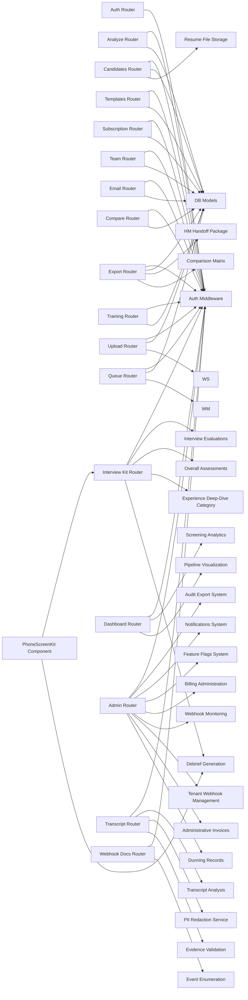

# API Reference

<cite>
**Referenced Files in This Document**
- [main.py](file://app/backend/main.py)
- [auth.py](file://app/backend/middleware/auth.py)
- [schemas.py](file://app/backend/models/schemas.py)
- [db_models.py](file://app/backend/models/db_models.py)
- [analyze.py](file://app/backend/routes/analyze.py)
- [auth.py](file://app/backend/routes/auth.py)
- [candidates.py](file://app/backend/routes/candidates.py)
- [templates.py](file://app/backend/routes/templates.py)
- [subscription.py](file://app/backend/routes/subscription.py)
- [team.py](file://app/backend/routes/team.py)
- [email_gen.py](file://app/backend/routes/email_gen.py)
- [compare.py](file://app/backend/routes/compare.py)
- [export.py](file://app/backend/routes/export.py)
- [training.py](file://app/backend/routes/training.py)
- [upload.py](file://app/backend/routes/upload.py)
- [queue_api.py](file://app/backend/routes/queue_api.py)
- [interview_kit.py](file://app/backend/routes/interview_kit.py)
- [dashboard.py](file://app/backend/routes/dashboard.py)
- [admin.py](file://app/backend/routes/admin.py)
- [transcript.py](file://app/backend/routes/transcript.py)
- [transcript_service.py](file://app/backend/services/transcript_service.py)
- [weight_mapper.py](file://app/backend/services/weight_mapper.py)
- [weight_suggester.py](file://app/backend/services/weight_suggester.py)
- [api.js](file://app/frontend/src/lib/api.js)
- [PhoneScreenKit.jsx](file://app/frontend/src/components/PhoneScreenKit.jsx)
- [webhook_docs.py](file://app/backend/routes/webhook_docs.py)
- [dunning_service.py](file://app/backend/services/billing/dunning_service.py)
</cite>

## Update Summary
**Changes Made**
- Added comprehensive admin API endpoints for audit log exports, webhook event enumeration, invoice retrieval, dunning record management, and webhook event configuration
- Enhanced billing administration endpoints with administrative invoice management and dunning resolution capabilities
- Integrated webhook event monitoring with administrative tenant webhook management and delivery tracking
- Expanded administrative capabilities with comprehensive billing administration and tenant webhook configuration

## Table of Contents
1. [Introduction](#introduction)
2. [Project Structure](#project-structure)
3. [Core Components](#core-components)
4. [Architecture Overview](#architecture-overview)
5. [Detailed Component Analysis](#detailed-component-analysis)
6. [Dependency Analysis](#dependency-analysis)
7. [Performance Considerations](#performance-considerations)
8. [Troubleshooting Guide](#troubleshooting-guide)
9. [Conclusion](#conclusion)
10. [Appendices](#appendices)

## Introduction
This document provides a comprehensive API reference for Resume AI by ThetaLogics. It covers all REST endpoints, request/response schemas, authentication, rate limiting, usage tracking, and integration patterns. The API is organized around:
- Authentication and user management
- Resume analysis (single and batch) with enhanced LLM enrichment
- Chunked upload system for large file handling
- Job queue management for asynchronous processing
- Intelligent scoring weight management with AI suggestions
- Candidate and template management
- Subscription and usage tracking
- Team collaboration and comments
- Email generation, export, comparison, training, and diagnostics
- **NEW** Admin API endpoints for operational oversight and administrative functions including audit log exports, webhook event enumeration, invoice retrieval, dunning record management, and webhook event configuration
- **NEW** Enhanced billing administration endpoints with administrative invoice management and dunning resolution capabilities
- **NEW** Comprehensive webhook event monitoring with administrative tenant webhook management and delivery tracking
- **NEW** Administrative capabilities with notifications, feature flags, and tenant management

The API is versioned and served under a base URL (default /api). Authentication is JWT-based and enforced via a bearer token. Administrative endpoints require elevated privileges and specific role requirements.

## Project Structure
The backend is a FastAPI application that mounts routers for each functional area. The frontend client demonstrates typical usage patterns and token handling.

```mermaid
graph TB
subgraph "Backend"
M["FastAPI App<br/>main.py"]
R_AUTH["Routes: auth.py"]
R_ANALYZE["Routes: analyze.py"]
R_CAND["Routes: candidates.py"]
R_TMPL["Routes: templates.py"]
R_SUB["Routes: subscription.py"]
R_TEAM["Routes: team.py"]
R_EMAIL["Routes: email_gen.py"]
R_COMPARE["Routes: compare.py"]
R_EXPORT["Routes: export.py"]
R_TRAIN["Routes: training.py"]
R_UPLOAD["Routes: upload.py"]
R_QUEUE["Routes: queue_api.py"]
R_INTKIT["Routes: interview_kit.py"]
R_DASHBOARD["Routes: dashboard.py"]
R_ADMIN["Routes: admin.py"]
R_TRANSCRIPT["Routes: transcript.py"]
R_WEBHOOK_DOCS["Routes: webhook_docs.py"]
MW["Middleware: auth.py"]
SC["Models: schemas.py"]
DBM["Models: db_models.py"]
WS["Services: weight_suggester.py"]
WM["Services: weight_mapper.py"]
TS["Service: transcript_service.py"]
AUDIT["Endpoint: export-audit-logs"]
WEBHOOKS["Endpoint: get-webhook-events"]
INVOICES["Endpoint: get-admin-invoices"]
DUNNING["Endpoint: get-admin-dunning-records"]
RESOLVE["Endpoint: resolve-dunning"]
ENDPHONE["Endpoint: generate-debrief"]
PHONESCREEN["Component: PhoneScreenKit.jsx"]
end
subgraph "Frontend"
FE["Client: api.js"]
end
M --> R_AUTH
M --> R_ANALYZE
M --> R_CAND
M --> R_TMPL
M --> R_SUB
M --> R_TEAM
M --> R_EMAIL
M --> R_COMPARE
M --> R_EXPORT
M --> R_TRAIN
M --> R_UPLOAD
M --> R_QUEUE
M --> R_INTKIT
M --> R_DASHBOARD
M --> R_ADMIN
M --> R_TRANSCRIPT
M --> R_WEBHOOK_DOCS
R_AUTH --> MW
R_ANALYZE --> MW
R_CAND --> MW
R_TMPL --> MW
R_SUB --> MW
R_TEAM --> MW
R_EMAIL --> MW
R_COMPARE --> MW
R_EXPORT --> MW
R_TRAIN --> MW
R_UPLOAD --> MW
R_QUEUE --> MW
R_INTKIT --> MW
R_DASHBOARD --> MW
R_ADMIN --> MW
R_TRANSCRIPT --> MW
R_WEBHOOK_DOCS --> MW
FE --> M
MW --> DBM
R_ANALYZE --> DBM
R_CAND --> DBM
R_TMPL --> DBM
R_SUB --> DBM
R_TEAM --> DBM
R_EMAIL --> DBM
R_COMPARE --> DBM
R_EXPORT --> DBM
R_TRAIN --> DBM
R_UPLOAD --> DBM
R_QUEUE --> DBM
R_INTKIT --> DBM
R_DASHBOARD --> DBM
R_ADMIN --> DBM
R_TRANSCRIPT --> DBM
R_TRANSCRIPT --> TS
R_INTKIT --> ENDPHONE
PHONESCREEN --> FE
```



**Diagram sources**
- [main.py:174-215](file://app/backend/main.py#L174-L215)
- [auth.py:19-46](file://app/backend/middleware/auth.py#L19-L46)
- [schemas.py:89-136](file://app/backend/models/schemas.py#L89-L136)
- [db_models.py:11-250](file://app/backend/models/db_models.py#L11-L250)
- [analyze.py:41-801](file://app/backend/routes/analyze.py#L41-L801)
- [auth.py:20-152](file://app/backend/routes/auth.py#L20-152)
- [candidates.py:23-303](file://app/backend/routes/candidates.py#L23-303)
- [templates.py:13-86](file://app/backend/routes/templates.py#L13-86)
- [subscription.py:20-477](file://app/backend/routes/subscription.py#L20-477)
- [team.py:15-135](file://app/backend/routes/team.py#L15-135)
- [email_gen.py:15-105](file://app/backend/routes/email_gen.py#L15-105)
- [compare.py:13-78](file://app/backend/routes/compare.py#L13-78)
- [export.py:17-105](file://app/backend/routes/export.py#L17-105)
- [training.py:18-153](file://app/backend/routes/training.py#L18-153)
- [upload.py:36-361](file://app/backend/routes/upload.py#L36-361)
- [queue_api.py:31-464](file://app/backend/routes/queue_api.py#L31-464)
- [interview_kit.py:1-224](file://app/backend/routes/interview_kit.py#L1-224)
- [dashboard.py:1-382](file://app/backend/routes/dashboard.py#L1-382)
- [admin.py:1-3265](file://app/backend/routes/admin.py#L1-3265)
- [transcript.py:1-220](file://app/backend/routes/transcript.py#L1-220)
- [webhook_docs.py:40-93](file://app/backend/routes/webhook_docs.py#L40-L93)
- [weight_mapper.py:1-360](file://app/backend/services/weight_mapper.py#L1-360)
- [weight_suggester.py:1-307](file://app/backend/services/weight_suggester.py#L1-307)
- [transcript_service.py:1-374](file://app/backend/services/transcript_service.py#L1-374)
- [api.js:1-395](file://app/frontend/src/lib/api.js#L1-L395)
- [PhoneScreenKit.jsx:1-476](file://app/frontend/src/components/PhoneScreenKit.jsx#L1-L476)

**Section sources**
- [main.py:174-215](file://app/backend/main.py#L174-L215)
- [api.js:1-44](file://app/frontend/src/lib/api.js#L1-L44)

## Core Components
- Authentication and Authorization
  - JWT bearer tokens with HS256 algorithm
  - Access and refresh tokens
  - Admin role enforcement for certain endpoints
  - **NEW** Elevated privilege requirements for administrative endpoints including platform_admin, super_admin, billing_admin, security_admin, and support roles
- Data Models and Schemas
  - Pydantic models define request/response shapes
  - SQLAlchemy models define persistence
- Rate Limiting and Usage Tracking
  - Monthly analysis limits per plan
  - Usage logs and resets
- Streaming and Batch Processing
  - SSE streaming for long-running analysis
  - Batch analysis with concurrency and deduplication
- Intelligent Scoring System
  - Universal 7-weight schema with backward compatibility
  - AI-powered weight suggestions
  - Dynamic weight mapping and normalization
- Job Queue Management
  - Asynchronous job processing with priority queuing
  - Real-time job status monitoring
  - Administrative job operations (retry, cancel)
- Resume File Management
  - Storage of original uploaded resume files
  - Support for multiple file formats (PDF, DOCX, DOC, ODT, TXT, RTF)
  - Inline preview for PDFs, forced download for other formats
- **NEW** Admin API Endpoints
  - Comprehensive tenant management and oversight with audit logging and export functionality
  - Billing administration with dunning management and administrative invoice handling
  - Administrative notifications and feature flag management
  - Webhook event monitoring and administrative tenant webhook configuration
  - Enhanced audit logging system with export capabilities for compliance and monitoring
  - Comprehensive billing administration system with dunning record management and resolution
  - Administrative webhook management with tenant-specific webhook configuration and delivery tracking
- **NEW** Phone Screening System
  - Structured interview evaluation with Experience Deep-Dive category
  - Comprehensive debrief generation with LLM-powered analysis
  - Recruiter assessment scoring and recommendation system
  - Integration with frontend PhoneScreenKit component
- **NEW** Transcript Analysis System
  - Unbiased candidate evaluation from audio/video transcripts
  - Support for VTT, SRT, and plain text formats
  - PII redaction and evidence validation capabilities
  - Structured analysis with fit scores and recommendations
- **NEW** Enhanced Interview Kit Functionality
  - Four-category evaluation framework: technical, behavioral, culture_fit, experience_deep_dive
  - Structured debrief generation with sentiment analysis
  - Recruiter score calculation combining rating distribution and sentiment
  - Overall assessment with recommendation system
- **NEW** Admin Analytics
  - Platform-wide metrics overview
  - Usage trend analysis with customizable periods
  - Tenant and user statistics
  - Revenue and storage tracking

**Section sources**
- [auth.py:19-46](file://app/backend/middleware/auth.py#L19-L46)
- [schemas.py:89-136](file://app/backend/models/schemas.py#L89-L136)
- [db_models.py:11-250](file://app/backend/models/db_models.py#L11-L250)
- [subscription.py:72-84](file://app/backend/routes/subscription.py#L72-L84)
- [subscription.py:427-477](file://app/backend/routes/subscription.py#L427-L477)
- [weight_mapper.py:20-360](file://app/backend/services/weight_mapper.py#L20-L360)
- [weight_suggester.py:23-307](file://app/backend/services/weight_suggester.py#L23-L307)
- [queue_api.py:34-464](file://app/backend/routes/queue_api.py#L34-L464)
- [candidates.py:504-558](file://app/backend/routes/candidates.py#L504-L558)
- [interview_kit.py:217-257](file://app/backend/routes/interview_kit.py#L217-L257)
- [dashboard.py:61-381](file://app/backend/routes/dashboard.py#L61-L381)
- [export.py:162-308](file://app/backend/routes/export.py#L162-L308)
- [admin.py:700-899](file://app/backend/routes/admin.py#L700-L899)
- [transcript.py:42-132](file://app/backend/routes/transcript.py#L42-132)
- [transcript_service.py:265-374](file://app/backend/services/transcript_service.py#L265-374)

## Architecture Overview
The API follows a layered architecture:
- Routers expose endpoints grouped by feature
- Middleware enforces authentication and authorization
- Services orchestrate analysis, LLM interactions, and intelligent scoring
- Database models persist state, usage metrics, and job queues
- Queue system manages asynchronous job processing with priority scheduling
- File storage system handles resume file management with multiple format support
- **NEW** Admin API endpoints provide operational oversight and administrative functions with comprehensive audit logging, billing administration, and webhook management
- **NEW** Enhanced billing administration system manages subscription lifecycle and dunning processes with administrative resolution capabilities
- **NEW** Comprehensive audit logging system with export capabilities for compliance and monitoring
- **NEW** Administrative notifications system for platform-wide alerts and updates
- **NEW** Feature flag management system for controlled rollouts and tenant-specific configurations
- **NEW** Phone screening system provides structured interview evaluation and debrief generation
- **NEW** Transcript analysis system enables unbiased candidate evaluation from audio/video sources
- **NEW** Enhanced interview kit functionality supports comprehensive evaluation across four categories
- **NEW** Admin analytics offers platform-wide insights and usage trend analysis
- **NEW** Webhook event monitoring system provides comprehensive delivery tracking and administrative tenant webhook management

```mermaid
sequenceDiagram
participant C as "Client"
participant A as "Auth Router"
participant U as "User"
participante T as "Tenant"
participant S as "Subscription Router"
participant Q as "Queue Manager"
participant F as "File Storage"
participant D as "Dashboard Router"
participant J as "JD Candidates Router"
participant E as "Export Router"
participant I as "Interview Kit Router"
participant TSC as "Transcript Service"
participant ADM as "Admin Router"
participant WB as "Webhook Docs Router"
C->>A : POST /api/auth/register
A->>U : Create admin user
A->>T : Create tenant
A-->>C : TokenResponse(access_token, refresh_token, user, tenant)
C->>S : GET /api/subscription
S->>T : Load tenant + plan
S-->>C : FullSubscriptionResponse
C->>Q : POST /api/queue/submit
Q->>Q : Enqueue job with priority
Q-->>C : Job queued successfully
C->>F : GET /api/candidates/{id}/resume
F->>C : Resume file (PDF inline, others forced download)
C->>D : GET /api/dashboard/summary
D->>D : Aggregate screening metrics
D-->>C : Dashboard summary with pipeline by JD
C->>J : GET /api/jd/{jd_id}/candidates
J->>J : Rank candidates by fit score
J-->>C : JD-scoped candidate list with status
C->>E : GET /api/jd/{jd_id}/handoff-package
E->>E : Build HM Handoff Package
E-->>C : Structured package with comparison matrix
C->>I : PUT /api/results/{result_id}/evaluations
I->>I : Store per-question evaluation (including experience_deep_dive)
C->>I : GET /api/results/{result_id}/scorecard
I->>I : Generate automated scorecard with experience_deep_dive_summary
C->>I : POST /api/results/{result_id}/generate-debrief
I->>I : Generate LLM-powered debrief with recruiter score
I-->>C : DebriefResponse with structured analysis
C->>TSC : POST /api/transcript/analyze
TSC->>TSC : Parse transcript and analyze with PII redaction
TSC-->>C : TranscriptAnalysisResponse with unbiased evaluation
C->>ADM : GET /api/admin/audit-logs/export
ADM->>ADM : Export filtered audit logs
ADM-->>C : CSV/JSON audit log export
C->>ADM : GET /api/admin/dunning
ADM->>ADM : List dunning records
ADM-->>C : Dunning records with status and retry information
C->>ADM : POST /api/admin/dunning/{tenant_id}/resolve
ADM->>ADM : Resolve dunning and reactivate subscription
ADM-->>C : Success response with resolution details
C->>WB : GET /api/webhooks/events
WB->>WB : Enumerate webhook event types
WB-->>C : Event definitions with signing info
```

**Diagram sources**
- [auth.py:57-96](file://app/backend/routes/auth.py#L57-L96)
- [subscription.py:172-253](file://app/backend/routes/subscription.py#L172-L253)
- [queue_api.py:38-76](file://app/backend/routes/queue_api.py#L38-L76)
- [candidates.py:504-558](file://app/backend/routes/candidates.py#L504-L558)
- [dashboard.py:61-186](file://app/backend/routes/dashboard.py#L61-L186)
- [candidates.py:575-721](file://app/backend/routes/candidates.py#L575-L721)
- [export.py:162-308](file://app/backend/routes/export.py#L162-L308)
- [interview_kit.py:40-224](file://app/backend/routes/interview_kit.py#L40-L224)
- [transcript.py:42-132](file://app/backend/routes/transcript.py#L42-132)
- [admin.py:1159-1221](file://app/backend/routes/admin.py#L1159-L1221)
- [admin.py:3147-3185](file://app/backend/routes/admin.py#L3147-L3185)
- [admin.py:3188-3235](file://app/backend/routes/admin.py#L3188-L3235)
- [webhook_docs.py:87-93](file://app/backend/routes/webhook_docs.py#L87-L93)

## Detailed Component Analysis

### Authentication Endpoints
- POST /api/auth/register
  - Request: RegisterRequest (company_name, email, password)
  - Response: TokenResponse (access_token, refresh_token, user, tenant)
  - Behavior: Creates tenant and admin user; returns tokens
- POST /api/auth/login
  - Request: LoginRequest (email, password)
  - Response: TokenResponse
  - Behavior: Validates credentials and issues tokens
- POST /api/auth/refresh
  - Request: RefreshRequest (refresh_token)
  - Response: TokenResponse
  - Behavior: Issues new access token using refresh token
- GET /api/auth/me
  - Response: { user, tenant }
  - Behavior: Returns current user and tenant info

Security and requirements:
- Requires HTTPS in production
- Tokens signed with HS256 using a secret key
- Access token expiry controlled by environment variable
- Refresh token expiry controlled by environment variable

**Section sources**
- [auth.py:57-152](file://app/backend/routes/auth.py#L57-L152)
- [auth.py:19-46](file://app/backend/middleware/auth.py#L19-L46)
- [schemas.py:140-171](file://app/backend/models/schemas.py#L140-L171)

### Resume Analysis Endpoints
- POST /api/analyze
  - Purpose: Single resume analysis with LLM narrative enrichment
  - Body: multipart/form-data
    - resume: file (.pdf, .docx, .doc)
    - job_description: string or
    - job_file: file (alternative to text)
    - scoring_weights: JSON string (universal 7-weight schema)
    - action: string (use_existing | update_profile | create_new | None)
  - Response: AnalysisResponse with AI enhancement fields
  - Behavior:
    - Validates file size and extension
    - Checks usage limits and increments counters
    - Parses resume, analyzes gaps, resolves JD (text or file)
    - Deduplicates candidates across three layers
    - Persists result and candidate profile
    - Returns enriched result with candidate metadata and AI narrative status
- POST /api/analyze/stream
  - Purpose: Streaming analysis via SSE with real-time updates
  - Body: same as above
  - Response: SSE events with progressive analysis results
  - Behavior: Streams intermediate stages, persists Python scores immediately, LLM narrative processed asynchronously
- POST /api/analyze/batch
  - Purpose: Batch analysis with intelligent scoring
  - Body: resumes: list[file], optional job_description/job_file, scoring_weights
  - Response: BatchAnalysisResponse (ordered by fit_score)
  - Behavior: Validates batch size against plan limits, processes concurrently, deduplicates, persists, sorts by score
- POST /api/analyze/suggest-weights
  - Purpose: AI-powered weight suggestions based on job description
  - Body: multipart/form-data with job_description
  - Response: WeightSuggestionResponse (role_category, seniority_level, suggested_weights, reasoning)
  - Behavior: Uses LLM to analyze job requirements and suggest optimal scoring weights

Usage and limits:
- Monthly analysis counts tracked per tenant
- Plan limits enforced; returns 429 on overrun
- Batch size limited by plan
- Intelligent weight system supports both legacy and universal schemas

**Section sources**
- [analyze.py:442-666](file://app/backend/routes/analyze.py#L442-L666)
- [analyze.py:671-905](file://app/backend/routes/analyze.py#L671-L905)
- [analyze.py:922-1059](file://app/backend/routes/analyze.py#L922-L1059)
- [analyze.py:1118-1169](file://app/backend/routes/analyze.py#L1118-L1169)
- [weight_suggester.py:86-177](file://app/backend/services/weight_suggester.py#L86-L177)

### Chunked Upload Endpoints
- POST /api/upload/chunk
  - Purpose: Upload large files in chunks to bypass CDN limits
  - Body: multipart/form-data with chunk upload parameters
  - Response: ChunkUploadResponse (success, upload_id, chunk_index, total_chunks)
  - Behavior: Validates chunk boundaries, stores chunks temporarily, maintains upload session
- POST /api/upload/finalize
  - Purpose: Finalize chunked upload and assemble complete file
  - Body: FinalizeUploadRequest (upload_id, filename, total_chunks, file_hash)
  - Response: FinalizeUploadResponse (success, upload_id, filename, file_size)
  - Behavior: Verifies all chunks present, assembles file, validates integrity, cleans up temporary chunks
- DELETE /api/upload/cancel/{upload_id}
  - Purpose: Cancel in-progress chunked upload
  - Response: Success message
  - Behavior: Removes temporary chunk files and metadata

Security and requirements:
- Maximum chunk size: 15MB, maximum file size: 500MB
- Automatic cleanup of orphaned chunks after 24 hours
- MD5 hash validation for file integrity
- Backward compatible with existing upload flows

**Section sources**
- [upload.py:99-204](file://app/backend/routes/upload.py#L99-L204)
- [upload.py:207-323](file://app/backend/routes/upload.py#L207-L323)
- [upload.py:326-361](file://app/backend/routes/upload.py#L326-L361)

### Job Queue Management Endpoints
- POST /api/queue/submit
  - Purpose: Submit analysis job to queue for asynchronous processing
  - Body: form-data with analysis parameters
  - Response: JobSubmissionResponse (job_id, status, message)
  - Behavior: Creates job with priority level, enqueues for processing
- GET /api/queue/status/{job_id}
  - Purpose: Check job status and progress
  - Response: JobStatusResponse (status, progress_percent, processing_stage, timing info)
  - Behavior: Returns real-time job status with queue position estimates
- GET /api/queue/result/{job_id}
  - Purpose: Retrieve completed analysis result
  - Response: AnalysisResultResponse (full analysis data, AI enhancement status)
  - Behavior: Returns complete analysis including parsed resume/JD and AI narrative
- GET /api/queue/stats
  - Purpose: Get tenant-wide queue statistics
  - Response: QueueStatsResponse (job distribution, processing metrics)
  - Behavior: Aggregates queue performance metrics and tenant usage
- GET /api/queue/jobs
  - Purpose: List tenant's jobs with pagination
  - Response: JobListResponse (jobs array with metadata)
  - Behavior: Returns paginated job history filtered by tenant
- POST /api/queue/retry/{job_id}
  - Purpose: Manually retry failed job
  - Response: JobRetryResponse (status, message)
  - Behavior: Resets job state and requeues for processing
- DELETE /api/queue/cancel/{job_id}
  - Purpose: Cancel queued or processing job
  - Response: JobCancelResponse (status, message)
  - Behavior: Cancels job and updates status appropriately

Priority system:
- 1-2: High priority (premium users, urgent)
- 3-5: Normal priority (default)
- 6-10: Low priority (batch jobs, background)

**Section sources**
- [queue_api.py:38-76](file://app/backend/routes/queue_api.py#L38-L76)
- [queue_api.py:82-141](file://app/backend/routes/queue_api.py#L82-L141)
- [queue_api.py:144-207](file://app/backend/routes/queue_api.py#L144-L207)
- [queue_api.py:214-272](file://app/backend/routes/queue_api.py#L214-L272)
- [queue_api.py:275-316](file://app/backend/routes/queue_api.py#L275-L316)
- [queue_api.py:323-364](file://app/backend/routes/queue_api.py#L323-L364)
- [queue_api.py:367-398](file://app/backend/routes/queue_api.py#L367-L398)

### Candidate Management Endpoints
- GET /api/candidates
  - Query: search, page, page_size
  - Response: paginated list with enriched fields (current_role, total_years_exp, best_score)
- PATCH /api/candidates/{candidate_id}
  - Body: CandidateNameUpdate (name)
  - Response: { id, name }
- GET /api/candidates/{candidate_id}
  - Response: Candidate profile with history, skills snapshot, and flags
- POST /api/candidates/{candidate_id}/analyze-jd
  - Body: AnalyzeJdRequest (job_description, scoring_weights)
  - Response: AnalysisResponse (re-run scoring against stored profile)
  - Behavior: Uses DB JD cache; avoids full parse; faster than full re-upload
- GET /api/candidates/{candidate_id}/resume
  - Response: Binary file stream (PDF inline preview, others forced download)
  - Behavior: Returns original uploaded resume file with appropriate MIME type and Content-Disposition header

**Updated** Added new resume download endpoint that serves the original uploaded resume file with format-specific behavior

**Section sources**
- [candidates.py:40-114](file://app/backend/routes/candidates.py#L40-L114)
- [candidates.py:117-134](file://app/backend/routes/candidates.py#L117-L134)
- [candidates.py:136-348](file://app/backend/routes/candidates.py#L348-L348)
- [candidates.py:351-501](file://app/backend/routes/candidates.py#L351-L501)
- [candidates.py:504-558](file://app/backend/routes/candidates.py#L504-L558)
- [schemas.py:22-26](file://app/backend/models/schemas.py#L22-L26)

### JD-Scoped Candidate Management Endpoints
**NEW** Comprehensive JD-scoped candidate management with ranking and bulk operations

- GET /api/jd/{jd_id}/candidates
  - Purpose: Return all candidates screened against a specific Job Description
  - Query: status (optional), sort_by (fit_score|name|date), sort_order (asc|desc)
  - Response: { jd_id, jd_name, candidates: [...], total }
  - Behavior: Joins ScreeningResult → Candidate for enriched data; supports status filtering and sorting
  - Features: Fit score ranking, name sorting, date ordering, status filtering
- POST /api/jd/{jd_id}/shortlist
  - Purpose: Bulk-update status of multiple ScreeningResults for a given JD
  - Body: { result_ids: [int], status: string }
  - Response: { updated: int }
  - Behavior: Validates payload, checks JD ownership, performs bulk status update
  - Valid statuses: pending, shortlisted, rejected, in-review, hired

**Updated** Added JD-scoped candidate ranking with multiple sort options and bulk status update capabilities

**Section sources**
- [candidates.py:575-721](file://app/backend/routes/candidates.py#L575-L721)
- [schemas.py:210-226](file://app/backend/models/schemas.py#L210-L226)

### Dashboard and Analytics Endpoints
**NEW** Comprehensive dashboard system for screening operations and analytics

- GET /api/dashboard/summary
  - Purpose: Get dashboard summary with action items and pipeline by JD
  - Response: DashboardSummaryResponse (action_items, pipeline_by_jd, weekly_metrics)
  - Behavior: Aggregates pending reviews, in-progress analyses, shortlisted counts
  - Features: Pipeline visualization by job description, weekly metrics calculation
- GET /api/dashboard/activity
  - Purpose: Get recent screening activity feed
  - Query: limit (1-100)
  - Response: { activities: [...] }
  - Behavior: Returns recent screening results with candidate and JD names
- GET /api/analytics/screening
  - Purpose: Get comprehensive screening analytics with period filtering
  - Query: period (last_7_days|last_30_days|last_90_days)
  - Response: ScreeningAnalyticsResponse (period, total_analyzed, avg_fit_score, recommendation_distribution, analyses_by_day, top_skill_gaps, score_distribution, pass_through_rates, jd_effectiveness)
  - Behavior: Calculates analytics over specified period with JD effectiveness tracking

**Updated** Added comprehensive dashboard endpoints with period-based filtering and JD effectiveness tracking

**Section sources**
- [dashboard.py:61-186](file://app/backend/routes/dashboard.py#L61-L186)
- [dashboard.py:191-237](file://app/backend/routes/dashboard.py#L191-L237)
- [dashboard.py:242-381](file://app/backend/routes/dashboard.py#L242-L381)

### HM Handoff Package Endpoints
**NEW** Structured export for hiring managers with comparison matrices

- GET /api/jd/{jd_id}/handoff-package
  - Purpose: Return structured HM Handoff Package for shortlisted candidates
  - Response: HandoffPackageResponse (jd_name, jd_id, generated_at, generated_by, shortlisted_candidates, comparison_matrix, total_shortlisted)
  - Behavior: Builds package with candidate details, interview scores, and comparison matrix
  - Features: Five-dimensional comparison matrix (Skill Match, Experience, Education, Domain Fit, Timeline), interview evaluation integration

**Updated** Added HM Handoff Package export with structured data and comparison matrices

**Section sources**
- [export.py:162-308](file://app/backend/routes/export.py#L162-L308)
- [export.py:113-159](file://app/backend/routes/export.py#L113-L159)

### Interview Kit Evaluation Endpoints
**NEW** Comprehensive interview evaluation system for structured scoring and assessment with Experience Deep-Dive category support

- PUT /api/results/{result_id}/evaluations
  - Purpose: Create or update a per-question interview evaluation
  - Body: EvaluationUpsert (question_category, question_index, rating, notes)
  - Response: EvaluationOut (evaluation record with timestamps)
  - Behavior: Upserts evaluation with unique constraint per question; supports partial updates
  - Validation: question_category must be technical, behavioral, culture_fit, or experience_deep_dive; rating must be strong, adequate, or weak
- GET /api/results/{result_id}/evaluations
  - Purpose: Retrieve all evaluations for a specific screening result
  - Response: List[EvaluationOut] ordered by category then index
  - Behavior: Returns all evaluations by the current user for the specified result
- PUT /api/results/{result_id}/evaluations/overall
  - Purpose: Create or update overall recruiter assessment
  - Body: OverallAssessmentUpsert (overall_assessment, recruiter_recommendation)
  - Response: { status: created|updated, id: assessment_id }
  - Behavior: Upserts single overall assessment per user-result combination
  - Validation: recruiter_recommendation must be advance, hold, or reject
- GET /api/results/{result_id}/scorecard
  - Purpose: Generate automated interview scorecard
  - Response: ScorecardOut (aggregated evaluation summary)
  - Behavior: Combines evaluation data with analysis results to produce dimension summaries
  - Features: Technical/Behavioral/Culture Fit/Experience Deep-Dive summaries, strength/concern identification, overall assessment inclusion
- POST /api/results/{result_id}/generate-debrief
  - Purpose: Generate LLM-powered debrief from conversation summary and evaluations
  - Body: DebriefRequest (conversation_summary)
  - Response: DebriefResponse (structured debrief content, recruiter_score, recommendation)
  - Behavior: Creates comprehensive debrief with sentiment analysis and recruiter scoring
  - Features: Structured analysis with overview, strengths, concerns, recommendation rationale, recommendation (Advance/Hold/Reject)

**Updated** Extended evaluation categories to include experience_deep_dive and enhanced scorecard generation to include experience_deep_dive_summary

**Section sources**
- [interview_kit.py:40-224](file://app/backend/routes/interview_kit.py#L40-L224)
- [interview_kit.py:227-405](file://app/backend/routes/interview_kit.py#L227-L405)
- [schemas.py:441-489](file://app/backend/models/schemas.py#L441-L489)
- [schemas.py:490-517](file://app/backend/models/schemas.py#L490-L517)
- [db_models.py:217-257](file://app/backend/models/db_models.py#L217-L257)

### Transcript Analysis Endpoints
**NEW** Unbiased candidate evaluation from audio/video transcripts with comprehensive analysis

- POST /api/transcript/analyze
  - Purpose: Upload transcript file or paste text, select candidate and job description, receive unbiased AI analysis
  - Body: multipart/form-data with transcript_file or transcript_text, candidate_id, role_template_id, source_platform
  - Response: TranscriptAnalysisResponse (analysis result with fit score, recommendations, evidence)
  - Behavior: Parses VTT/SRT/plain text, applies PII redaction, analyzes against job description
  - Features: Support for multiple formats, PII redaction, structured analysis with evidence citations
- GET /api/transcript/analyses
  - Purpose: List all transcript analyses for the tenant
  - Response: { analyses: [...], total: int }
  - Behavior: Returns paginated list of transcript analyses with candidate and template information
- GET /api/transcript/analyses/{id}
  - Purpose: Retrieve a single transcript analysis
  - Response: TranscriptAnalysisResponse (detailed analysis with all fields)
  - Behavior: Returns specific transcript analysis with full result details

**Updated** Added comprehensive transcript analysis system with PII redaction and evidence validation

**Section sources**
- [transcript.py:42-132](file://app/backend/routes/transcript.py#L42-L132)
- [transcript.py:135-177](file://app/backend/routes/transcript.py#L135-L177)
- [transcript.py:180-220](file://app/backend/routes/transcript.py#L180-L220)
- [transcript_service.py:265-374](file://app/backend/services/transcript_service.py#L265-L374)

### Template Management Endpoints
- GET /api/templates
  - Response: list of RoleTemplate
- POST /api/templates
  - Body: TemplateCreate (name, jd_text, scoring_weights, tags)
  - Response: TemplateOut
- PUT /api/templates/{template_id}
  - Body: TemplateCreate
  - Response: TemplateOut
- DELETE /api/templates/{template_id}
  - Response: { deleted: template_id }

**Section sources**
- [templates.py:16-26](file://app/backend/routes/templates.py#L16-L26)
- [templates.py:29-45](file://app/backend/routes/templates.py#L29-L45)
- [templates.py:48-68](file://app/backend/routes/templates.py#L48-L68)
- [templates.py:71-85](file://app/backend/routes/templates.py#L71-L85)
- [schemas.py:210-226](file://app/backend/models/schemas.py#L210-L226)

### Subscription and Usage Endpoints
- GET /api/subscription/plans
  - Response: list of PlanResponse
- GET /api/subscription
  - Response: FullSubscriptionResponse (current_plan, usage, available_plans, days_until_reset)
- GET /api/subscription/check/{action}?quantity=
  - Response: UsageCheckResponse (allowed, current_usage, limit, message)
- GET /api/subscription/usage-history?limit=
  - Response: list of usage logs
- Admin endpoints:
  - POST /api/subscription/admin/reset-usage
  - POST /api/subscription/admin/change-plan/{plan_id}

Limits and billing:
- Monthly reset handled automatically
- Storage usage calculated from stored resume text and snapshots
- Team member counts reflect actual users in tenant

**Section sources**
- [subscription.py:162-253](file://app/backend/routes/subscription.py#L162-L253)
- [subscription.py:256-343](file://app/backend/routes/subscription.py#L256-L343)
- [subscription.py:346-367](file://app/backend/routes/subscription.py#L346-L367)
- [subscription.py:372-423](file://app/backend/routes/subscription.py#L372-L423)
- [schemas.py:344-379](file://app/backend/models/schemas.py#L344-L379)

### Team Collaboration Endpoints
- GET /api/team
  - Response: list of team members
- POST /api/invites
  - Body: InviteRequest (email, role)
  - Response: { id, email, role, temp_password, message }
  - Behavior: Creates inactive user with hashed temp password
- DELETE /api/team/{user_id}
  - Behavior: Deactivates user (cannot remove self)
- GET /api/results/{result_id}/comments
  - Response: list of comments
- POST /api/results/{result_id}/comments
  - Body: CommentCreate (text)
  - Response: CommentOut

**Section sources**
- [team.py:18-31](file://app/backend/routes/team.py#L18-L31)
- [team.py:34-61](file://app/backend/routes/team.py#L34-L61)
- [team.py:64-82](file://app/backend/routes/team.py#L64-L82)
- [team.py:85-107](file://app/backend/routes/team.py#L85-L107)
- [team.py:110-134](file://app/backend/routes/team.py#L110-L134)
- [schemas.py:254-271](file://app/backend/models/schemas.py#L254-L271)

### Email Generation Endpoint
- POST /api/email/generate
  - Body: EmailGenRequest (candidate_id, type: shortlist | rejection | screening_call)
  - Response: EmailGenResponse (subject, body)
  - Behavior: Uses Ollama to generate templated email; falls back to static templates if LLM fails

**Section sources**
- [email_gen.py:39-105](file://app/backend/routes/email_gen.py#L39-L105)
- [schemas.py:231-240](file://app/backend/models/schemas.py#L231-L240)

### Comparison Endpoint
- POST /api/compare
  - Body: CompareRequest (candidate_ids: list[int])
  - Response: { candidates: [...], total }
  - Behavior: Validates IDs, loads results, computes winners across categories

**Section sources**
- [compare.py:16-77](file://app/backend/routes/compare.py#L16-L77)
- [schemas.py:275-277](file://app/backend/models/schemas.py#L275-L277)

### Export Endpoints
- GET /api/export/csv?ids=
  - Response: CSV file (StreamingResponse)
- GET /api/export/excel?ids=
  - Response: XLSX file (StreamingResponse)

**Section sources**
- [export.py:55-78](file://app/backend/routes/export.py#L55-L78)
- [export.py:81-104](file://app/backend/routes/export.py#L81-L104)

### Training Endpoint
- POST /api/training/label
  - Body: LabelRequest (screening_result_id, outcome: hired | rejected, feedback)
  - Response: { created | updated, outcome }
- POST /api/training/train
  - Behavior: Starts background training if sufficient labeled examples
- GET /api/training/status
  - Response: TrainingStatusResponse (labeled_count, trained, model_name, last_trained)

**Section sources**
- [training.py:24-63](file://app/backend/routes/training.py#L24-L63)
- [training.py:66-97](file://app/backend/routes/training.py#L66-L97)
- [training.py:137-152](file://app/backend/routes/training.py#L137-L152)
- [schemas.py:281-292](file://app/backend/models/schemas.py#L281-L292)

### Resume File Management Endpoints
- GET /api/candidates/{candidate_id}/resume
  - Response: Binary file stream with appropriate MIME type and Content-Disposition header
  - Behavior: Returns original uploaded resume file
  - Format-specific behavior:
    - PDF: inline preview in browser
    - DOCX/DOC/ODT/TXT/RTF: forced download with appropriate filename
  - Security: Requires authenticated access and tenant scoping

**New** Added comprehensive resume file management with multiple format support and format-specific delivery behavior

**Section sources**
- [candidates.py:504-558](file://app/backend/routes/candidates.py#L504-L558)
- [db_models.py:112-133](file://app/backend/models/db_models.py#L112-L133)

### Admin API Endpoints
**NEW** Comprehensive administrative endpoints for operational oversight and administrative functions

#### Audit Logging and Export
- GET /api/admin/audit-logs
  - Purpose: List administrative audit logs with filtering and pagination
  - Query: action (optional), resource_type (optional), actor_email (optional), page (1-1000), per_page (1-100)
  - Response: { items: [...], total: int, page: int, per_page: int, pages: int }
  - Behavior: Returns paginated audit log entries with filtering by action, resource type, and actor email
  - Security: Requires platform_admin role
- GET /api/admin/audit-logs/export
  - Purpose: Export filtered audit logs as CSV or JSON (capped at 10,000 rows)
  - Query: format (csv|json), action (optional), start_date (ISO 8601), end_date (ISO 8601)
  - Response: CSV/JSON file with audit log entries
  - Behavior: Filters audit logs by action and date range, exports up to 10,000 rows
  - Security: Requires platform_admin role

#### Administrative Notifications
- GET /api/admin/notifications
  - Purpose: List admin platform notifications, newest first
  - Query: unread_only (bool), limit (1-200)
  - Response: { notifications: [...], unread_count: int }
  - Behavior: Returns notifications with read/unread status and counts
- PUT /api/admin/notifications/{notification_id}/read
  - Purpose: Mark a single admin notification as read
  - Response: { success: true }
  - Behavior: Updates notification read status
- PUT /api/admin/notifications/read-all
  - Purpose: Mark all unread admin notifications as read
  - Response: { success: true }
  - Behavior: Updates all unread notifications to read

#### Feature Flag Management
- GET /api/admin/feature-flags
  - Purpose: List all feature flags with their global state
  - Response: List of feature flags with keys, display names, and enabled status
- PUT /api/admin/feature-flags/{flag_id}
  - Purpose: Toggle a feature flag's global state
  - Body: { enabled_globally: bool }
  - Response: { message: string, key: string, enabled_globally: bool }
  - Behavior: Updates feature flag state and invalidates cache
- GET /api/admin/tenants/{tenant_id}/features
  - Purpose: Get feature overrides for a specific tenant
  - Response: List of tenant-specific feature flag overrides
- PUT /api/admin/tenants/{tenant_id}/features/{flag_id}
  - Purpose: Set a feature override for a specific tenant
  - Body: { enabled: bool }
  - Response: { message: string, tenant_id: int, flag_id: int, enabled: bool }
  - Behavior: Sets tenant-specific feature flag override

#### Billing Administration
- GET /api/admin/dunning
  - Purpose: List tenants currently in dunning (active or exhausted)
  - Query: status (active|exhausted|resolved|all)
  - Response: { items: [...], total: int }
  - Behavior: Returns dunning records with tenant information and retry status
  - Security: Requires billing_admin role
- POST /api/admin/dunning/{tenant_id}/resolve
  - Purpose: Manually resolve dunning for a tenant
  - Response: { message: string, tenant_id: int, dunning_id: int, retry_count: int }
  - Behavior: Sets dunning status to resolved and reactivates tenant subscription
  - Security: Requires billing_admin role
- POST /api/admin/dunning/process-retries
  - Purpose: Manually trigger dunning retry processing
  - Response: { processed: int, results: [...] }
  - Behavior: Processes due dunning retries manually (requires super_admin)
  - Security: Requires super_admin role

#### Administrative Invoice Management
- GET /api/admin/invoices
  - Purpose: List administrative invoices with filtering options
  - Query: status (paid|pending|overdue), tenant_id (optional), limit (1-1000)
  - Response: { items: [...], total: int }
  - Behavior: Returns invoice records with tenant information and status
  - Security: Requires billing_admin role
- GET /api/admin/invoices/{invoice_id}
  - Purpose: Retrieve a specific administrative invoice
  - Response: Invoice details with line items and payment history
  - Behavior: Returns detailed invoice information for administrative review
  - Security: Requires billing_admin role

#### Webhook Event Monitoring
- GET /api/admin/webhook-events
  - Purpose: List administrative webhook events with filtering
  - Query: status (success|failed|retrying), tenant_id (optional), limit (1-1000)
  - Response: { items: [...], total: int }
  - Behavior: Returns webhook delivery attempts with status and error information
  - Security: Requires billing_admin role
- GET /api/admin/webhook-events/{event_id}
  - Purpose: Retrieve a specific webhook event
  - Response: Webhook event details with payload and response information
  - Behavior: Returns complete webhook event data for debugging and monitoring
  - Security: Requires billing_admin role

#### Tenant Webhook Management
- GET /api/admin/tenants/{tenant_id}/webhooks
  - Purpose: List tenant-specific webhooks
  - Response: List of webhook configurations
  - Behavior: Returns webhooks configured for a specific tenant
  - Security: Requires billing_admin role
- POST /api/admin/tenants/{tenant_id}/webhooks
  - Purpose: Create a tenant webhook
  - Body: Webhook creation data
  - Response: Created webhook configuration
  - Behavior: Creates webhook for tenant with URL, secret, and activation status
  - Security: Requires billing_admin role
- DELETE /api/admin/tenants/{tenant_id}/webhooks/{webhook_id}
  - Purpose: Delete a tenant webhook
  - Response: { message: string }
  - Behavior: Removes webhook configuration for tenant
  - Security: Requires billing_admin role
- GET /api/admin/tenants/{tenant_id}/webhooks/{webhook_id}/deliveries
  - Purpose: List webhook delivery attempts for a specific webhook
  - Query: limit (1-100)
  - Response: { items: [...], total: int }
  - Behavior: Returns delivery attempts with status, response codes, and timestamps
  - Security: Requires billing_admin role

#### Webhook Event Enumeration
- GET /api/webhooks/events
  - Purpose: Enumerate available webhook event types with descriptions and example payloads
  - Response: { events: [...], signing: {...} }
  - Behavior: Returns comprehensive list of webhook event types with descriptions, example payloads, and signing information
  - Security: No authentication required

**Updated** Added comprehensive admin API endpoints for operational oversight and administrative functions including audit log exports, webhook event enumeration, invoice retrieval, dunning record management, and webhook event configuration

**Section sources**
- [admin.py:1159-1221](file://app/backend/routes/admin.py#L1159-L1221)
- [admin.py:1224-1285](file://app/backend/routes/admin.py#L1224-L1285)
- [admin.py:1288-1369](file://app/backend/routes/admin.py#L1288-L1369)
- [admin.py:3147-3185](file://app/backend/routes/admin.py#L3147-L3185)
- [admin.py:3188-3235](file://app/backend/routes/admin.py#L3188-L3235)
- [admin.py:3238-3265](file://app/backend/routes/admin.py#L3238-L3265)
- [webhook_docs.py:87-93](file://app/backend/routes/webhook_docs.py#L87-L93)

### Additional Diagnostics
- GET /
  - Response: { message, version, docs }
- GET /health
  - Response: { status, db, ollama }
- GET /api/llm-status
  - Response: LLM model readiness and diagnosis

**Section sources**
- [main.py:219-259](file://app/backend/main.py#L219-L259)
- [main.py:262-326](file://app/backend/main.py#L262-L326)

## Dependency Analysis
Key dependencies and relationships:
- Authentication middleware depends on JWT secret and HS256 algorithm
- Analysis routes depend on parser service, gap detector, hybrid pipeline, and subscription usage enforcement
- Team endpoints enforce admin role for invites and removals
- Subscription routes maintain tenant usage counters and logs
- Queue API depends on queue manager for job orchestration
- Upload routes handle chunked file processing with temporary storage
- Weight management system provides intelligent scoring with AI suggestions
- Candidate routes now include resume file storage and retrieval functionality
- File storage system handles binary resume data with format detection
- **NEW** Admin API endpoints depend on elevated privilege middleware (require_platform_admin, require_super_admin, require_billing_admin, require_security_admin, require_support)
- **NEW** Billing administration system integrates with dunning service and payment providers
- **NEW** Audit logging system supports export functionality with filtering and pagination
- **NEW** Administrative notifications system manages platform-wide alert distribution
- **NEW** Feature flag management system provides tenant-specific configuration overrides
- **NEW** Webhook event monitoring system tracks delivery attempts and failures
- **NEW** Phone screening system depends on InterviewEvaluation and OverallAssessment models for structured scoring
- **NEW** Transcript analysis system depends on TranscriptAnalysis model and transcript_service for unbiased evaluation
- **NEW** Debried generation system integrates with LLM service for structured analysis and scoring
- **NEW** Frontend PhoneScreenKit component integrates with interview kit endpoints for complete workflow
- **NEW** Interview evaluation system extends to include experience_deep_dive category with comprehensive coverage
- **NEW** Overall assessment system now includes debrief_json and recruiter_score fields for enhanced analysis
- Dashboard system uses efficient aggregation queries with minimal database overhead
- JD-scoped candidate management leverages optimized joins and filtering for large datasets
- HM Handoff Package export performs bulk data aggregation with pre-loaded relationships
- Admin analytics endpoints use optimized SQL aggregations for platform-wide metrics
- Scorecard generation performs efficient aggregation queries with minimal database overhead, including Experience Deep-Dive category
- Experience Deep-Dive category adds minimal overhead as it follows the same evaluation pattern as other categories
- **NEW** Webhook event enumeration system provides comprehensive event type definitions and signing information
- **NEW** Tenant webhook management system supports tenant-specific webhook configuration and delivery tracking
- **NEW** Administrative invoice management system provides comprehensive billing administration capabilities
- **NEW** Dunning record management system integrates with billing administration for subscription lifecycle management



**Diagram sources**
- [auth.py:19-46](file://app/backend/middleware/auth.py#L19-L46)
- [analyze.py:41-801](file://app/backend/routes/analyze.py#L41-L801)
- [candidates.py:23-303](file://app/backend/routes/candidates.py#L23-303)
- [templates.py:13-86](file://app/backend/routes/templates.py#L13-86)
- [subscription.py:20-477](file://app/backend/routes/subscription.py#L20-477)
- [team.py:15-135](file://app/backend/routes/team.py#L15-135)
- [email_gen.py:15-105](file://app/backend/routes/email_gen.py#L15-105)
- [compare.py:13-78](file://app/backend/routes/compare.py#L13-78)
- [export.py:17-105](file://app/backend/routes/export.py#L17-105)
- [training.py:18-153](file://app/backend/routes/training.py#L18-153)
- [upload.py:36-361](file://app/backend/routes/upload.py#L36-361)
- [queue_api.py:31-464](file://app/backend/routes/queue_api.py#L31-464)
- [interview_kit.py:1-224](file://app/backend/routes/interview_kit.py#L1-224)
- [dashboard.py:1-382](file://app/backend/routes/dashboard.py#L1-382)
- [admin.py:1-3265](file://app/backend/routes/admin.py#L1-3265)
- [transcript.py:1-220](file://app/backend/routes/transcript.py#L1-220)
- [webhook_docs.py:40-93](file://app/backend/routes/webhook_docs.py#L40-L93)
- [db_models.py:11-250](file://app/backend/models/db_models.py#L11-L250)
- [weight_mapper.py:1-360](file://app/backend/services/weight_mapper.py#L1-360)
- [weight_suggester.py:1-307](file://app/backend/services/weight_suggester.py#L1-307)
- [transcript_service.py:1-374](file://app/backend/services/transcript_service.py#L1-374)
- [PhoneScreenKit.jsx:1-476](file://app/frontend/src/components/PhoneScreenKit.jsx#L1-L476)

**Section sources**
- [auth.py:19-46](file://app/backend/middleware/auth.py#L19-L46)
- [db_models.py:11-250](file://app/backend/models/db_models.py#L11-L250)

## Performance Considerations
- Streaming analysis (/api/analyze/stream) provides immediate feedback and reduces perceived latency
- Batch analysis processes multiple resumes concurrently with plan-enforced limits
- Deduplication minimizes redundant processing and storage
- DB shared JD cache accelerates repeated analyses with the same job description
- Chunked upload system handles large files efficiently with automatic cleanup
- Job queue system provides scalable asynchronous processing with priority scheduling
- Intelligent weight system optimizes scoring accuracy with AI-powered suggestions
- Frontend client sets reasonable timeouts for long-running operations
- Resume file storage uses efficient binary storage with format-specific delivery optimization
- **NEW** Admin API endpoints implement pagination and filtering for large datasets
- **NEW** Audit log export system limits results to 10,000 rows for performance and compliance
- **NEW** Billing administration system optimizes dunning record queries with status filtering
- **NEW** Administrative notifications system uses efficient read/unread tracking
- **NEW** Feature flag management system caches global states for reduced database queries
- **NEW** Webhook event monitoring system filters delivery attempts by status and tenant
- **NEW** Phone screening system provides real-time evaluation with structured debrief generation
- **NEW** Transcript analysis system handles multiple file formats with efficient parsing and analysis
- **NEW** Debried generation system uses LLM service with semaphore control for concurrent access
- **NEW** Frontend PhoneScreenKit component implements efficient validation and submission workflows
- **NEW** Interview evaluation system uses efficient indexing on result_id, user_id, and question identifiers across four categories
- **NEW** Overall assessment system includes debrief_json and recruiter_score fields with optimized storage
- Dashboard system uses efficient aggregation queries with minimal database overhead
- JD-scoped candidate management leverages optimized joins and filtering for large datasets
- HM Handoff Package export performs bulk data aggregation with pre-loaded relationships
- Admin analytics endpoints use optimized SQL aggregations for platform-wide metrics
- Scorecard generation performs efficient aggregation queries with minimal database overhead, including Experience Deep-Dive category
- Experience Deep-Dive category adds minimal overhead as it follows the same evaluation pattern as other categories
- **NEW** Webhook event enumeration system provides comprehensive event type definitions with minimal overhead
- **NEW** Tenant webhook management system optimizes webhook configuration storage and retrieval
- **NEW** Administrative invoice management system uses efficient querying with status and tenant filtering
- **NEW** Dunning record management system implements optimized retry processing with due date calculations

## Troubleshooting Guide
Common errors and resolutions:
- 401 Unauthorized
  - Cause: Missing or invalid bearer token
  - Resolution: Authenticate and refresh tokens
- 403 Forbidden
  - Cause: Non-admin attempting admin-only operation, tenant boundary violation, insufficient privilege level, CSRF token missing or invalid
  - Resolution: Ensure proper role (platform_admin, super_admin, billing_admin, security_admin, support) or proper tenant access
- 400 Bad Request
  - Cause: Invalid file type, oversized file, insufficient JD length, invalid JSON, chunk validation errors, transcript format issues, invalid evaluation categories, invalid date formats in audit export, invalid webhook configuration
  - Resolution: Validate inputs and file constraints
- 404 Not Found
  - Cause: Resource not found (user, candidate, template, result, job, resume file, screening result, job description, transcript analysis, tenant, feature flag, webhook)
  - Resolution: Verify IDs and tenant scoping
- 422 Unprocessable Entity
  - Cause: Validation errors in interview evaluation categories, ratings, overall assessment recommendations, JD status updates, transcript analysis parameters, feature flag toggles, webhook configuration validation
  - Resolution: Check allowed values: question_category (technical, behavioral, culture_fit, experience_deep_dive), rating (strong, adequate, weak), recommendation (advance, hold, reject), status (pending, shortlisted, rejected, in-review, hired)
- 429 Too Many Requests
  - Cause: Monthly analysis limit exceeded
  - Resolution: Upgrade plan or wait for reset
- 500 Internal Server Error
  - Cause: Pipeline or LLM failures, queue processing errors, file storage failures, database constraint violations, dashboard analytics failures, debrief generation errors, transcript analysis failures, admin API processing errors, webhook delivery failures
  - Resolution: Retry or check /health and /api/llm-status
- 503 Service Unavailable
  - Cause: Queue system overloaded, LLM service unavailable, admin metrics system overwhelmed, transcript analysis service unavailable, dunning processing system overloaded, webhook service unavailable
  - Resolution: Retry with exponential backoff, check queue stats, verify database connectivity

**Section sources**
- [auth.py:23-40](file://app/backend/middleware/auth.py#L23-L40)
- [analyze.py:364-375](file://app/backend/routes/analyze.py#L364-L375)
- [analyze.py:255-266](file://app/backend/routes/analyze.py#L255-L266)
- [subscription.py:293-318](file://app/backend/routes/subscription.py#L293-L318)
- [email_gen.py:77-96](file://app/backend/routes/email_gen.py#L77-L96)
- [upload.py:128-156](file://app/backend/routes/upload.py#L128-L156)
- [queue_api.py:323-344](file://app/backend/routes/queue_api.py#L323-L344)
- [candidates.py:519-526](file://app/backend/routes/candidates.py#L519-L526)
- [interview_kit.py:441-489](file://app/backend/routes/interview_kit.py#L441-L489)
- [transcript.py:56-66](file://app/backend/routes/transcript.py#L56-66)
- [candidates.py:694-698](file://app/backend/routes/candidates.py#L694-L698)
- [admin.py:1159-1221](file://app/backend/routes/admin.py#L1159-L1221)

## Conclusion
This API provides a robust foundation for AI-powered resume screening with strong tenant isolation, usage controls, collaborative features, and advanced processing capabilities. The addition of chunked upload support enables handling of large files, while the job queue system provides scalable asynchronous processing. The intelligent scoring system with AI-powered weight suggestions enhances analysis accuracy. The new resume file management system provides comprehensive support for multiple file formats with format-specific delivery behavior. **NEW** The Admin API endpoints introduce comprehensive operational oversight with audit logging, administrative notifications, feature flag management, and billing administration capabilities. **NEW** The billing administration system provides dunning management, invoice handling, and webhook event monitoring for complete subscription lifecycle management. **NEW** The enhanced audit logging system supports compliance with export functionality and filtering capabilities. **NEW** The Phone screening system introduces structured interview evaluation with Experience Deep-Dive category support and comprehensive debrief generation with LLM-powered analysis. **NEW** The Transcript analysis system enables unbiased candidate evaluation from audio/video sources with PII redaction and evidence validation capabilities. **NEW** The enhanced interview kit functionality provides comprehensive evaluation across four categories with integrated debrief generation and scoring. **NEW** The Dashboard system introduces comprehensive screening analytics with period-based filtering, pipeline visualization, and JD effectiveness tracking. **NEW** JD-scoped candidate management enables focused candidate ranking, bulk status updates, and tenant-scoped operations. **NEW** HM Handoff Package export delivers structured data for hiring managers with comparison matrices and interview evaluation integration. **NEW** Admin analytics provides platform-wide insights with metrics overview and usage trend reporting. **NEW** The webhook event enumeration system provides comprehensive event type definitions for integration development. **NEW** Tenant webhook management enables comprehensive webhook configuration and delivery tracking. **NEW** Administrative invoice management provides complete billing administration capabilities. **NEW** Dunning record management integrates with billing administration for subscription lifecycle management. Clients should implement token refresh, handle streaming events, respect rate limits, utilize the queue system for optimal performance, leverage the resume file management for seamless candidate file handling, integrate the phone screening system for structured interview workflows, use transcript analysis for unbiased evaluation, integrate the enhanced interview kit for comprehensive assessment, utilize the frontend PhoneScreenKit component for complete phone screening experience, implement administrative workflows using the new admin API endpoints for operational oversight and management, integrate webhook event enumeration for comprehensive event type discovery, configure tenant webhooks for delivery tracking, manage administrative invoices for billing operations, and monitor dunning records for subscription lifecycle management. Administrators can manage plans, usage, and queue operations via dedicated endpoints while accessing platform-wide metrics and usage trends, managing billing processes, monitoring audit trails, overseeing feature deployments, configuring webhooks, and managing subscription lifecycle through comprehensive administrative interfaces.

## Appendices

### Authentication and Authorization
- Header: Authorization: Bearer {access_token}
- Refresh token lifecycle
- Admin-only endpoints require admin role
- **NEW** Elevated privilege requirements: platform_admin, super_admin, billing_admin, security_admin, support for specific administrative functions

**Section sources**
- [auth.py:19-46](file://app/backend/middleware/auth.py#L19-L46)
- [team.py:64-82](file://app/backend/routes/team.py#L64-L82)
- [admin.py:17-24](file://app/backend/middleware/auth.py#L17-L24)

### Rate Limiting and Usage Tracking
- Monthly analysis limits per plan
- Usage logs capture actions and quantities
- Automatic monthly reset

**Section sources**
- [subscription.py:72-84](file://app/backend/routes/subscription.py#L72-L84)
- [subscription.py:427-477](file://app/backend/routes/subscription.py#L427-L477)

### Intelligent Scoring System
- Universal 7-weight schema: core_competencies, experience, domain_fit, education, career_trajectory, role_excellence, risk
- Backward compatibility with legacy 4-weight schema
- AI-powered weight suggestions based on job description analysis
- Dynamic weight normalization ensuring sum equals 1.0
- Adaptive labels based on role category (technical, sales, hr, marketing, operations, leadership)

**Section sources**
- [weight_mapper.py:20-360](file://app/backend/services/weight_mapper.py#L20-L360)
- [weight_suggester.py:23-307](file://app/backend/services/weight_suggester.py#L23-L307)

### Job Queue System
- Priority-based job scheduling (1-10 scale)
- Real-time job status monitoring with progress tracking
- Automatic retry with exponential backoff
- Administrative operations (retry, cancel, cancel_all)
- Performance metrics and queue statistics
- Tenant-scoped job isolation

**Section sources**
- [queue_api.py:34-464](file://app/backend/routes/queue_api.py#L34-L464)

### Resume File Management System
- Supported formats: PDF, DOCX, DOC, ODT, TXT, RTF
- Format-specific delivery behavior:
  - PDF: inline preview in browser
  - Other formats: forced download with appropriate filename
- Binary storage using LargeBinary column type
- Filename preservation and format detection
- MIME type determination based on file extension
- Content-Disposition header for proper browser behavior

**New** Comprehensive resume file management system with multiple format support and optimized delivery behavior

**Section sources**
- [candidates.py:504-558](file://app/backend/routes/candidates.py#L504-L558)
- [db_models.py:112-133](file://app/backend/models/db_models.py#L112-L133)

### Admin API System
**NEW** Comprehensive administrative system for operational oversight and management

- Privilege Levels:
  - platform_admin: Full administrative access to most endpoints
  - super_admin: Highest privilege for critical operations (billing processing, system maintenance)
  - billing_admin: Specialized billing and subscription management
  - security_admin: Security event monitoring and management
  - support: Limited administrative support functions
- Audit Export System:
  - Filter by action type and date range
  - Export formats: CSV and JSON
  - Row limit: 10,000 for performance and compliance
  - Compliance-ready export with IP address tracking
- Administrative Notifications:
  - Real-time notification distribution
  - Read/unread tracking with counts
  - Platform-wide and tenant-specific notifications
  - Severity-based prioritization
- Feature Flag Management:
  - Global state management
  - Tenant-specific overrides
  - Cache invalidation for immediate effect
  - Audit trail for configuration changes
- Billing Administration:
  - Dunning record monitoring and resolution
  - Manual intervention capabilities
  - Retry processing control
  - Subscription lifecycle management
- Webhook Event Monitoring:
  - Delivery attempt tracking
  - Status filtering and debugging
  - Payload inspection for troubleshooting
  - Tenant-specific webhook management
- Administrative Invoice Management:
  - Comprehensive invoice listing with filtering
  - Detailed invoice retrieval with line items
  - Billing administration integration
- Webhook Event Enumeration:
  - Complete event type catalog with descriptions
  - Example payloads for integration development
  - Signing information for secure delivery
- Tenant Webhook Management:
  - Tenant-specific webhook configuration
  - Delivery attempt tracking and debugging
  - Secure webhook secret management

**Updated** Added comprehensive admin API system with elevated privilege levels and operational oversight capabilities including webhook event enumeration and tenant webhook management

**Section sources**
- [admin.py:17-24](file://app/backend/middleware/auth.py#L17-L24)
- [admin.py:1159-1221](file://app/backend/routes/admin.py#L1159-L1221)
- [admin.py:1224-1285](file://app/backend/routes/admin.py#L1224-L1285)
- [admin.py:1288-1369](file://app/backend/routes/admin.py#L1288-L1369)
- [admin.py:3147-3265](file://app/backend/routes/admin.py#L3147-L3265)
- [webhook_docs.py:40-93](file://app/backend/routes/webhook_docs.py#L40-L93)

### Phone Screening System
**NEW** Structured interview evaluation and debrief generation system

- PhoneScreenKit component:
  - Four-category evaluation interface: technical, behavioral, culture_fit, experience_deep_dive
  - Real-time question prioritization based on missing/matched skills
  - Structured evaluation with rating and notes
  - Conversation summary with validation and debrief generation
  - Integration with frontend API for seamless workflow
- Debried generation:
  - LLM-powered structured analysis with sentiment scoring
  - Combined rating distribution and sentiment for recruiter score
  - Recommendation system (Advance/Hold/Reject) with rationale
  - Structured content with overview, strengths, concerns, recommendation rationale

**Updated** Added comprehensive phone screening system with structured evaluation and debrief generation

**Section sources**
- [PhoneScreenKit.jsx:86-476](file://app/frontend/src/components/PhoneScreenKit.jsx#L86-L476)
- [interview_kit.py:246-405](file://app/backend/routes/interview_kit.py#L246-L405)

### Transcript Analysis System
**NEW** Unbiased candidate evaluation from audio/video transcripts

- Supported formats: VTT (Zoom/Teams), SRT, plain text
- Automatic format detection and parsing
- PII redaction service integration
- Evidence validation for claim verification
- Structured analysis with fit scores, recommendations, and detailed breakdown
- Confidence scoring and bias mitigation

**Updated** Added comprehensive transcript analysis system with PII redaction and evidence validation

**Section sources**
- [transcript.py:42-132](file://app/backend/routes/transcript.py#L42-L132)
- [transcript_service.py:74-90](file://app/backend/services/transcript_service.py#L74-L90)
- [transcript_service.py:265-374](file://app/backend/services/transcript_service.py#L265-L374)

### Dashboard and Analytics System
**NEW** Comprehensive dashboard and analytics system for screening operations

- DashboardSummaryResponse:
  - action_items: pending_review, in_progress_analyses, shortlisted_count
  - pipeline_by_jd: jd_id, jd_name, total_candidates, by_status, avg_fit_score
  - weekly_metrics: analyses_this_week, avg_fit_score, shortlist_rate, top_skill_gaps
- ScreeningAnalyticsResponse:
  - period, total_analyzed, avg_fit_score, recommendation_distribution
  - analyses_by_day, top_skill_gaps, score_distribution
  - pass_through_rates, jd_effectiveness
- ActivityFeedResponse:
  - activities: type, candidate_name, jd_name, fit_score, recommendation, timestamp, result_id
- Period-based filtering:
  - last_7_days, last_30_days, last_90_days options
  - Tenant-scoped analytics with proper isolation

**Updated** Added comprehensive dashboard and analytics system with period-based filtering and JD effectiveness tracking

**Section sources**
- [dashboard.py:61-186](file://app/backend/routes/dashboard.py#L61-L186)
- [dashboard.py:242-381](file://app/backend/routes/dashboard.py#L242-L381)

### JD-Scoped Candidate Management System
**NEW** JD-focused candidate management with ranking and bulk operations

- JDScoping:
  - Tenant-scoped candidate ranking
  - JD ownership validation
  - Status filtering and sorting
- RankingOptions:
  - sort_by: fit_score, name, date
  - sort_order: asc, desc
- BulkOperations:
  - Bulk status updates for multiple ScreeningResults
  - Valid status transitions: pending, shortlisted, rejected, in-review, hired
  - Tenant and JD validation for bulk operations

**Updated** Added JD-scoped candidate management with comprehensive ranking and bulk operations

**Section sources**
- [candidates.py:575-721](file://app/backend/routes/candidates.py#L575-L721)

### HM Handoff Package System
**NEW** Structured export system for hiring managers

- HandoffPackageResponse:
  - jd_name, jd_id, generated_at, generated_by
  - shortlisted_candidates: candidate details, fit scores, recommendations, strengths, weaknesses
  - comparison_matrix: dimensions, candidates with score values
  - total_shortlisted
- ComparisonMatrixDimensions:
  - Skill Match, Experience, Education, Domain Fit, Timeline
- InterviewIntegration:
  - Per-category interview evaluation summaries
  - Overall recruiter assessment inclusion
- PDFExportSupport:
  - Structured HTML for PDF generation
  - Proper formatting for hiring manager consumption

**Updated** Added comprehensive HM Handoff Package system with structured data and comparison matrices

**Section sources**
- [export.py:162-308](file://app/backend/routes/export.py#L162-L308)
- [export.py:113-159](file://app/backend/routes/export.py#L113-L159)

### Interview Kit Evaluation System
**NEW** Structured interview evaluation and assessment system with Experience Deep-Dive category support

- InterviewEvaluation entity:
  - Per-question evaluation with unique constraint per result-user-question combination
  - Supports four categories: technical, behavioral, culture_fit, and experience_deep_dive
  - Rating system: strong, adequate, weak
  - Notes field for qualitative feedback
  - Tenant scoping through ScreeningResult foreign key
- OverallAssessment entity:
  - Single overall assessment per user-result combination
  - Recruiter recommendation system: advance, hold, reject
  - Text-based overall assessment summary
  - Integration with automated scorecard generation
  - New debrief_json and recruiter_score fields for enhanced analysis
- Scorecard generation:
  - Aggregates evaluation data with analysis results across all four categories
  - Provides dimension summaries for each category including experience_deep_dive_summary
  - Identifies key strengths and concerns from evaluation notes
  - Includes overall assessment and recommendation when available
- Experience Deep-Dive category:
  - Focuses on comprehensive experience analysis and career progression
  - Includes specialized questions for deep experience exploration
  - Extends evaluation framework to cover career depth and expertise evolution
- Debried generation:
  - LLM-powered structured analysis combining rating distribution and sentiment
  - Combined scoring: rating_score (40%) + sentiment_score (60%)
  - Structured content with overview, strengths, concerns, recommendation rationale
  - Automatic recommendation generation (Advance/Hold/Reject)

**Updated** Extended evaluation categories to include experience_deep_dive and enhanced scorecard generation to include experience_deep_dive_summary

**Section sources**
- [interview_kit.py:217-257](file://app/backend/routes/interview_kit.py#L217-L257)
- [interview_kit.py:246-405](file://app/backend/routes/interview_kit.py#L246-L405)
- [db_models.py:217-257](file://app/backend/models/db_models.py#L217-L257)
- [schemas.py:441-517](file://app/backend/models/schemas.py#L441-L517)

### Example Client Integrations
- JavaScript (frontend)
  - Axios client with interceptors for token injection and auto-refresh
  - Streaming analysis via fetch with SSE handling
  - Chunked upload implementation with progress tracking
  - Queue job monitoring with polling
  - Batch uploads and exports
  - Resume file download and preview with format-specific behavior
  - **NEW** Admin API integration with privilege-aware endpoints including audit log exports, webhook event enumeration, invoice retrieval, dunning record management, and webhook event configuration
  - **NEW** Administrative notifications with read/unread tracking
  - **NEW** Feature flag management with tenant overrides
  - **NEW** Billing administration with dunning management and invoice handling
  - **NEW** Webhook event monitoring and debugging
  - **NEW** Phone screening integration with structured evaluation and debrief generation
  - **NEW** Transcript analysis integration with format detection and unbiased evaluation
  - **NEW** Dashboard integration with summary, activity feed, and analytics
  - **NEW** JD-scoped candidate management with ranking and bulk operations
  - **NEW** HM Handoff Package export with comparison matrix visualization
  - **NEW** Interview evaluation CRUD operations with real-time updates across all four categories
  - **NEW** Scorecard generation and display with dimension summaries including Experience Deep-Dive
  - **NEW** Webhook event enumeration integration for comprehensive event type discovery
  - **NEW** Tenant webhook management integration for webhook configuration and delivery tracking
  - **NEW** Administrative invoice management integration for billing operations
  - **NEW** Dunning record management integration for subscription lifecycle management
- Python (backend)
  - Use requests or aiohttp to call endpoints
  - Manage bearer tokens and handle 401/429 responses
  - Implement chunked upload with proper error handling
  - Monitor queue jobs with retry logic
  - Handle binary resume file downloads with appropriate response types
  - **NEW** Admin API integration with privilege-aware authentication
  - **NEW** Audit log export with filtering and compliance support
  - **NEW** Administrative notifications management
  - **NEW** Feature flag deployment and tenant override management
  - **NEW** Billing administration workflows with dunning resolution
  - **NEW** Webhook event monitoring and troubleshooting
  - **NEW** Phone screening evaluation and debrief generation workflows
  - **NEW** Transcript analysis with PII redaction and evidence validation
  - **NEW** Dashboard analytics integration with period-based filtering
  - **NEW** JD-scoped candidate management with bulk status updates
  - **NEW** HM Handoff Package export with structured data handling
  - **NEW** Interview evaluation management with validation and tenant scoping across four categories
  - **NEW** Webhook event enumeration integration for comprehensive event type discovery
  - **NEW** Tenant webhook management integration for webhook configuration and delivery tracking
  - **NEW** Administrative invoice management integration for billing operations
  - **NEW** Dunning record management integration for subscription lifecycle management
- Go
  - Use net/http or gorilla/mux
  - Implement JWT verification and bearer token parsing
  - Handle chunked upload streams and queue operations
  - Process binary resume file responses with proper MIME type handling
  - **NEW** Admin API integration with privilege validation
  - **NEW** Audit log export with filtering capabilities
  - **NEW** Administrative notification handling
  - **NEW** Feature flag management integration
  - **NEW** Billing administration integration
  - **NEW** Webhook event monitoring integration
  - **NEW** Phone screening system integration with structured evaluation
  - **NEW** Transcript analysis API integration with format support
  - **NEW** Dashboard system integration with comprehensive analytics
  - **NEW** JD-scoped APIs integration with candidate ranking and bulk operations
  - **NEW** Interview evaluation API integration with structured data handling across all categories
  - **NEW** Webhook event enumeration integration for comprehensive event type discovery
  - **NEW** Tenant webhook management integration for webhook configuration and delivery tracking
  - **NEW** Administrative invoice management integration for billing operations
  - **NEW** Dunning record management integration for subscription lifecycle management

**Section sources**
- [api.js:9-43](file://app/frontend/src/lib/api.js#L9-L43)
- [api.js:47-147](file://app/frontend/src/lib/api.js#L47-L147)
- [api.js:149-165](file://app/frontend/src/lib/api.js#L149-L165)
- [api.js:183-200](file://app/frontend/src/lib/api.js#L183-L200)
- [api.js:558-569](file://app/frontend/src/lib/api.js#L558-L569)
- [api.js:984-1036](file://app/frontend/src/lib/api.js#L984-L1036)
- [api.js:1209-1247](file://app/frontend/src/lib/api.js#L1209-L1247)

### Request/Response Schemas
- AnalysisResponse
  - Fit score, strengths, weaknesses, risk signals, recommendations, score breakdown, matched/missing skills, interview questions, explainability, quality flags, duplicate candidate info
  - AI enhancement fields: narrative_status, narrative_data, ai_enhanced
- BatchAnalysisResponse
  - results: list of BatchAnalysisResult (rank, filename, result)
- TokenResponse
  - access_token, refresh_token, token_type, user, tenant
- Subscription responses
  - PlanResponse, CurrentPlanResponse, UsageResponse, FullSubscriptionResponse, UsageCheckResponse
- ChunkUploadResponse
  - success, upload_id, chunk_index, total_chunks, message
- FinalizeUploadResponse
  - success, upload_id, filename, file_size, message
- JobStatusResponse
  - job_id, status, progress_percent, processing_stage, timing information
- WeightSuggestionResponse
  - role_category, seniority_level, suggested_weights, reasoning, confidence, role_excellence_label
- ResumeFileResponse
  - Binary file stream with appropriate MIME type and Content-Disposition header
- **NEW** Admin API schemas:
  - AuditLogExportRequest: format, action, start_date, end_date
  - AuditLogExportResponse: CSV/JSON audit log data
  - NotificationResponse: id, type, severity, title, message, tenant_id, is_read, created_at
  - FeatureFlagResponse: id, key, display_name, description, enabled_globally, created_at
  - DunningRecordResponse: id, tenant_id, tenant_name, tenant_slug, subscription_status, status, retry_count, max_retries, next_retry_at, last_retry_at, failure_reason, created_at
  - InvoiceResponse: comprehensive invoice data with line items and payment history
  - WebhookEventResponse: webhook delivery attempt details with payload and response information
  - WebhookEventEnumResponse: comprehensive event type definitions with signing information
  - TenantWebhookResponse: tenant-specific webhook configuration with URL, secret, and status
  - WebhookDeliveryResponse: webhook delivery attempt details with status, response codes, and timestamps
- **NEW** Phone screening schemas:
  - EvaluationUpsert: question_category, question_index, rating, notes
  - EvaluationOut: id, question_category, question_index, rating, notes, updated_at
  - OverallAssessmentUpsert: overall_assessment, recruiter_recommendation
  - DebriefRequest: conversation_summary
  - DebriefContent: overview, strengths, concerns, recommendation_rationale
  - DebriefResponse: debrief, recruiter_score, recommendation
  - ScorecardDimension: category, total_questions, evaluated_count, strong_count, adequate_count, weak_count, key_notes, evaluators
  - ScorecardOut: comprehensive interview scorecard with dimension summaries including experience_deep_dive_summary
- **NEW** Transcript analysis schemas:
  - TranscriptAnalysisResponse: id, candidate_id, candidate_name, role_template_id, role_template_name, source_platform, analysis_result, created_at
  - AnalysisResult: fit_score, technical_depth, communication_quality, jd_alignment, strengths, areas_for_improvement, red_flags, recommendation, recommendation_rationale
- **NEW** Dashboard schemas:
  - DashboardSummaryResponse: action_items, pipeline_by_jd, weekly_metrics
  - ScreeningAnalyticsResponse: period, total_analyzed, avg_fit_score, recommendation_distribution, analyses_by_day, top_skill_gaps, score_distribution, pass_through_rates, jd_effectiveness
  - ActivityFeedResponse: activities array with screening result details
- **NEW** JD-scoped schemas:
  - JDCandidatesResponse: jd_id, jd_name, candidates array, total
  - BulkStatusUpdateResponse: updated count
- **NEW** HM Handoff Package schemas:
  - HandoffPackageResponse: jd_name, jd_id, generated_at, generated_by, shortlisted_candidates array, comparison_matrix, total_shortlisted
  - ComparisonMatrixResponse: dimensions, candidates with score values
- **NEW** Admin analytics schemas:
  - PlatformMetricsOverview: tenants, users, analyses, storage, plans, revenue
  - UsageTrendsResponse: period_days, analyses, signups
- **NEW** Webhook event enumeration schemas:
  - WebhookEventDefinition: event type, description, example payload
  - WebhookSigningInfo: algorithm, header, description
  - WebhookEventCatalog: events array with definitions, signing configuration

**Section sources**
- [schemas.py:89-136](file://app/backend/models/schemas.py#L89-L136)
- [schemas.py:151-156](file://app/backend/models/schemas.py#L151-L156)
- [schemas.py:344-379](file://app/backend/models/schemas.py#L344-L379)
- [upload.py:49-73](file://app/backend/routes/upload.py#L49-L73)
- [queue_api.py:105-141](file://app/backend/routes/queue_api.py#L105-L141)
- [weight_suggester.py:86-177](file://app/backend/services/weight_suggester.py#L86-L177)
- [schemas.py:441-517](file://app/backend/models/schemas.py#L441-L517)
- [schemas.py:536-554](file://app/backend/models/schemas.py#L536-L554)
- [dashboard.py:61-381](file://app/backend/routes/dashboard.py#L61-L381)
- [candidates.py:575-721](file://app/backend/routes/candidates.py#L575-L721)
- [export.py:162-308](file://app/backend/routes/export.py#L162-L308)
- [admin.py:1159-1221](file://app/backend/routes/admin.py#L1159-L1221)
- [admin.py:1224-1285](file://app/backend/routes/admin.py#L1224-L1285)
- [admin.py:1288-1369](file://app/backend/routes/admin.py#L1288-L1369)
- [admin.py:3147-3265](file://app/backend/routes/admin.py#L3147-L3265)
- [transcript.py:42-132](file://app/backend/routes/transcript.py#L42-L132)
- [transcript_service.py:265-374](file://app/backend/services/transcript_service.py#L265-L374)
- [webhook_docs.py:40-93](file://app/backend/routes/webhook_docs.py#L40-L93)

### Data Model Overview

```mermaid
classDiagram
class SubscriptionPlan {
+int id
+string name
+string display_name
+string description
+string limits
+int price_monthly
+int price_yearly
+string currency
+string features
+bool is_active
+int sort_order
}
class Tenant {
+int id
+string name
+string slug
+int plan_id
+string subscription_status
+datetime current_period_start
+datetime current_period_end
+int analyses_count_this_month
+bigint storage_used_bytes
+datetime usage_reset_at
+datetime suspended_at
+string suspended_reason
}
class User {
+int id
+int tenant_id
+string email
+string hashed_password
+string role
+bool is_active
+string platform_role
}
class Candidate {
+int id
+int tenant_id
+string name
+string email
+string phone
+string resume_file_hash
+string resume_filename
+LargeBinary resume_file_data
+string raw_resume_text
+string parsed_skills
+string parsed_education
+string parsed_work_exp
+string gap_analysis_json
+string current_role
+string current_company
+float total_years_exp
+string profile_quality
+datetime profile_updated_at
}
class ScreeningResult {
+int id
+int tenant_id
+int candidate_id
+int role_template_id
+string resume_text
+string jd_text
+string parsed_data
+string analysis_result
+string status
+string narrative_status
+string narrative_json
+string narrative_error
}
class RoleTemplate {
+int id
+int tenant_id
+string name
+string jd_text
+string scoring_weights
+string tags
+string required_skills_override
+string nice_to_have_skills_override
+datetime created_at
}
class Comment {
+int id
+int result_id
+int user_id
+string text
+datetime created_at
}
class UsageLog {
+int id
+int tenant_id
+int user_id
+string action
+int quantity
+string details
}
class AnalysisJob {
+uuid id
+int tenant_id
+int user_id
+int candidate_id
+uuid result_id
+string status
+int priority
+int progress_percent
+string processing_stage
+string error_message
+string error_type
+int retry_count
+int max_retries
+datetime queued_at
+datetime started_at
+datetime completed_at
+datetime failed_at
+datetime next_retry_at
+string worker_id
}
class AnalysisResult {
+uuid id
+uuid job_id
+int tenant_id
+int candidate_id
+float fit_score
+string final_recommendation
+string risk_level
+string analysis_quality
+float confidence_score
+int processing_time_ms
+json analysis_data
+json parsed_resume
+json parsed_jd
+string narrative_status
+json narrative_data
+bool ai_enhanced
+string model_used
+string analysis_version
}
class JobMetrics {
+uuid job_id
+int tenant_id
+int total_time_ms
+int parse_time_ms
+int analysis_time_ms
+int llm_time_ms
+int retry_count
}
class InterviewEvaluation {
+int id
+int result_id
+int user_id
+string question_category
+int question_index
+string rating
+Text notes
+datetime created_at
+datetime updated_at
}
class OverallAssessment {
+int id
+int result_id
+int user_id
+Text overall_assessment
+string recruiter_recommendation
+Text debrief_json
+int recruiter_score
+datetime created_at
+datetime updated_at
}
class TranscriptAnalysis {
+int id
+int tenant_id
+int candidate_id
+int role_template_id
+Text transcript_text
+string source_platform
+Text analysis_result
+datetime created_at
}
class InterviewScorecard {
+string candidate_name
+string role_title
+int fit_score
+string recommendation
+string evaluator_email
+datetime evaluated_at
+ScorecardDimension technical_summary
+ScorecardDimension behavioral_summary
+ScorecardDimension culture_fit_summary
+ScorecardDimension experience_deep_dive_summary
+string overall_assessment
+string recruiter_recommendation
+string[] strengths_confirmed
+string[] concerns_identified
+DebriefContent debrief
+int recruiter_score
}
class DashboardSummary {
+ActionItems action_items
+PipelineByJD[] pipeline_by_jd
+WeeklyMetrics weekly_metrics
}
class ScreeningAnalytics {
+string period
+int total_analyzed
+float avg_fit_score
+map~string,int~ recommendation_distribution
+AnalysesByDay[] analyses_by_day
+TopSkillGaps[] top_skill_gaps
+ScoreDistribution[] score_distribution
+PassThroughRates pass_through_rates
+JDEffectiveness[] jd_effectiveness
}
class HandoffPackage {
+string jd_name
+int jd_id
+datetime generated_at
+string generated_by
+ShortlistedCandidate[] shortlisted_candidates
+ComparisonMatrix comparison_matrix
+int total_shortlisted
}
class AuditLog {
+int id
+int tenant_id
+string actor_email
+string action
+string resource_type
+int resource_id
+string details
+string ip_address
+datetime created_at
}
class AdminNotification {
+int id
+string type
+string severity
+string title
+string message
+int tenant_id
+bool is_read
+datetime created_at
}
class FeatureFlag {
+int id
+string key
+string display_name
+string description
+bool enabled_globally
+datetime created_at
}
class TenantFeatureOverride {
+int id
+int tenant_id
+int feature_flag_id
+bool enabled
+datetime created_at
}
class DunningRecord {
+int id
+int tenant_id
+string status
+int retry_count
+int max_retries
+datetime next_retry_at
+datetime last_retry_at
+string failure_reason
+datetime created_at
}
class Webhook {
+int id
+int tenant_id
+string url
+string secret
+bool is_active
+datetime created_at
}
class WebhookDelivery {
+int id
+int webhook_id
+string event_type
+string payload
+string response_status
+string response_body
+bool success
+int attempt
+datetime delivered_at
+datetime created_at
}
class PlatformConfig {
+int id
+string config_key
+string config_value
+string description
+datetime updated_at
}
class Invoice {
+int id
+int tenant_id
+string status
+datetime due_date
+datetime issued_at
+decimal amount
+string currency
+InvoiceLineItem[] line_items
+datetime created_at
}
class InvoiceLineItem {
+int id
+int invoice_id
+string description
+int quantity
+decimal unit_price
+decimal total
}
class DashboardSummary {
+ActionItems action_items
+PipelineByJD[] pipeline_by_jd
+WeeklyMetrics weekly_metrics
}
class ScreeningAnalytics {
+string period
+int total_analyzed
+float avg_fit_score
+map~string,int~ recommendation_distribution
+AnalysesByDay[] analyses_by_day
+TopSkillGaps[] top_skill_gaps
+ScoreDistribution[] score_distribution
+PassThroughRates pass_through_rates
+JDEffectiveness[] jd_effectiveness
}
class HandoffPackage {
+string jd_name
+int jd_id
+datetime generated_at
+string generated_by
+ShortlistedCandidate[] shortlisted_candidates
+ComparisonMatrix comparison_matrix
+int total_shortlisted
}
class PlatformMetrics {
+TenantCounts tenants
+UserCounts users
+AnalysisCounts analyses
+StorageMetrics storage
+PlanDistribution plans
+RevenueMetrics revenue
}
class WebhookEvent {
+string event
+string description
+dict example_payload
}
class WebhookSigningInfo {
+string algorithm
+string header
+string description
}
SubscriptionPlan "1" --> "many" Tenant : "plan"
Tenant "1" --> "many" User : "users"
Tenant "1" --> "many" Candidate : "candidates"
Tenant "1" --> "many" ScreeningResult : "results"
Tenant "1" --> "many" RoleTemplate : "templates"
Tenant "1" --> "many" UsageLog : "usage_logs"
Tenant "1" --> "many" AnalysisJob : "jobs"
Candidate "1" --> "many" ScreeningResult : "results"
RoleTemplate "1" --> "many" ScreeningResult : "results"
User "1" --> "many" Comment : "comments"
ScreeningResult "1" --> "many" Comment : "comments"
AnalysisJob "1" --> "many" AnalysisResult : "results"
AnalysisJob "1" --> "many" JobMetrics : "metrics"
ScreeningResult "1" --> "many" InterviewEvaluation : "evaluations"
ScreeningResult "1" --> "many" OverallAssessment : "overall_assessments"
ScreeningResult "1" --> "many" DashboardSummary : "dashboard"
ScreeningResult "1" --> "many" ScreeningAnalytics : "analytics"
ScreeningResult "1" --> "many" HandoffPackage : "handoff"
Tenant "1" --> "many" AuditLog : "audit_logs"
Tenant "1" --> "many" AdminNotification : "notifications"
Tenant "1" --> "many" FeatureFlag : "feature_flags"
Tenant "1" --> "many" DunningRecord : "dunning_records"
Tenant "1" --> "many" Webhook : "webhooks"
Tenant "1" --> "many" Invoice : "invoices"
ScreeningResult "1" --> "many" TranscriptAnalysis : "transcripts"
TranscriptAnalysis "1" --> "many" Candidate : "candidate"
TranscriptAnalysis "1" --> "many" RoleTemplate : "role_template"
```


**Diagram sources**
- [db_models.py:11-250](file://app/backend/models/db_models.py#L11-L250)
- [db_models.py:217-257](file://app/backend/models/db_models.py#L217-L257)
- [schemas.py:490-517](file://app/backend/models/schemas.py#L490-L517)
- [dashboard.py:61-381](file://app/backend/routes/dashboard.py#L61-L381)
- [export.py:162-308](file://app/backend/routes/export.py#L162-L308)
- [admin.py:1159-1221](file://app/backend/routes/admin.py#L1159-L1221)
- [admin.py:1224-1285](file://app/backend/routes/admin.py#L1224-L1285)
- [admin.py:1288-1369](file://app/backend/routes/admin.py#L1288-L1369)
- [admin.py:3147-3265](file://app/backend/routes/admin.py#L3147-L3265)
- [transcript.py:42-132](file://app/backend/routes/transcript.py#L42-L132)
- [transcript_service.py:265-374](file://app/backend/services/transcript_service.py#L265-L374)
- [webhook_docs.py:40-93](file://app/backend/routes/webhook_docs.py#L40-L93)