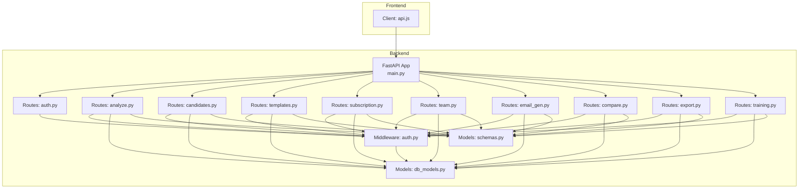
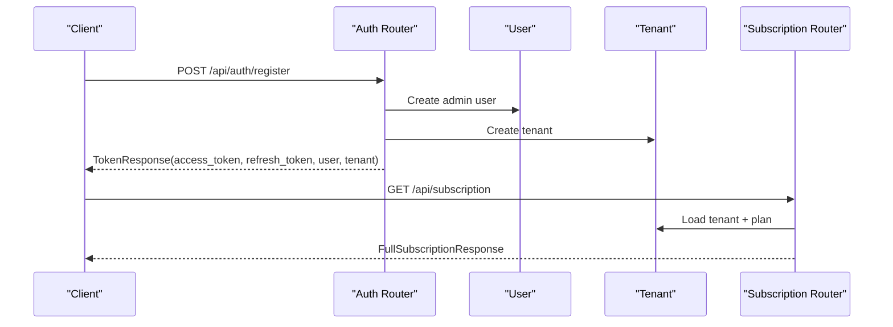
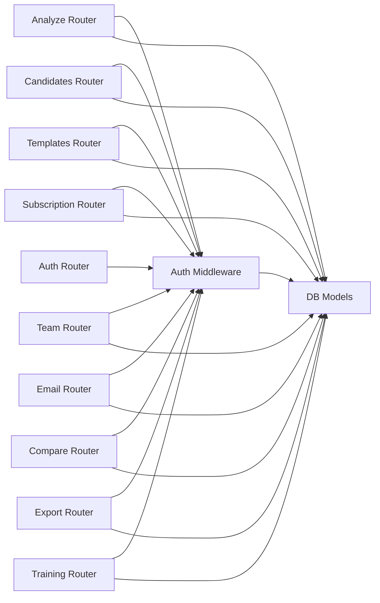
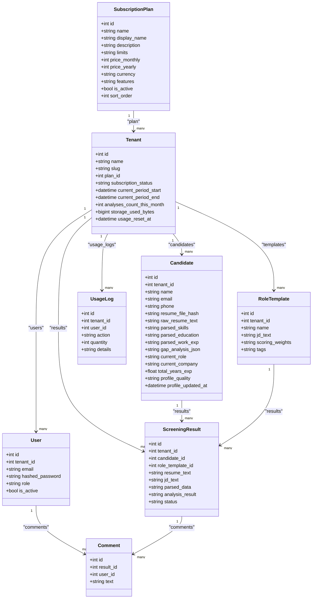

# API Reference

<cite>
**Referenced Files in This Document**
- [main.py](file://app/backend/main.py)
- [auth.py](file://app/backend/middleware/auth.py)
- [schemas.py](file://app/backend/models/schemas.py)
- [db_models.py](file://app/backend/models/db_models.py)
- [analyze.py](file://app/backend/routes/analyze.py)
- [auth.py](file://app/backend/routes/auth.py)
- [candidates.py](file://app/backend/routes/candidates.py)
- [templates.py](file://app/backend/routes/templates.py)
- [subscription.py](file://app/backend/routes/subscription.py)
- [team.py](file://app/backend/routes/team.py)
- [email_gen.py](file://app/backend/routes/email_gen.py)
- [compare.py](file://app/backend/routes/compare.py)
- [export.py](file://app/backend/routes/export.py)
- [training.py](file://app/backend/routes/training.py)
- [api.js](file://app/frontend/src/lib/api.js)
</cite>

## Table of Contents
1. [Introduction](#introduction)
2. [Project Structure](#project-structure)
3. [Core Components](#core-components)
4. [Architecture Overview](#architecture-overview)
5. [Detailed Component Analysis](#detailed-component-analysis)
6. [Dependency Analysis](#dependency-analysis)
7. [Performance Considerations](#performance-considerations)
8. [Troubleshooting Guide](#troubleshooting-guide)
9. [Conclusion](#conclusion)
10. [Appendices](#appendices)

## Introduction
This document provides a comprehensive API reference for Resume AI by ThetaLogics. It covers all REST endpoints, request/response schemas, authentication, rate limiting, usage tracking, and integration patterns. The API is organized around:
- Authentication and user management
- Resume analysis (single and batch)
- Candidate and template management
- Subscription and usage tracking
- Team collaboration and comments
- Email generation, export, comparison, training, and diagnostics

The API is versioned and served under a base URL (default /api). Authentication is JWT-based and enforced via a bearer token.

## Project Structure
The backend is a FastAPI application that mounts routers for each functional area. The frontend client demonstrates typical usage patterns and token handling.

**Diagram sources**
- [main.py:174-215](file://app/backend/main.py#L174-L215)
- [auth.py:19-46](file://app/backend/middleware/auth.py#L19-L46)
- [schemas.py:89-136](file://app/backend/models/schemas.py#L89-L136)
- [db_models.py:11-250](file://app/backend/models/db_models.py#L11-L250)
- [analyze.py:41-801](file://app/backend/routes/analyze.py#L41-L801)
- [auth.py:20-152](file://app/backend/routes/auth.py#L20-152)
- [candidates.py:23-303](file://app/backend/routes/candidates.py#L23-303)
- [templates.py:13-86](file://app/backend/routes/templates.py#L13-86)
- [subscription.py:20-477](file://app/backend/routes/subscription.py#L20-477)
- [team.py:15-135](file://app/backend/routes/team.py#L15-135)
- [email_gen.py:15-105](file://app/backend/routes/email_gen.py#L15-105)
- [compare.py:13-78](file://app/backend/routes/compare.py#L13-78)
- [export.py:17-105](file://app/backend/routes/export.py#L17-105)
- [training.py:18-153](file://app/backend/routes/training.py#L18-153)
- [api.js:1-395](file://app/frontend/src/lib/api.js#L1-L395)

**Section sources**
- [main.py:174-215](file://app/backend/main.py#L174-L215)
- [api.js:1-44](file://app/frontend/src/lib/api.js#L1-L44)

## Core Components
- Authentication and Authorization
  - JWT bearer tokens with HS256 algorithm
  - Access and refresh tokens
  - Admin role enforcement for certain endpoints
- Data Models and Schemas
  - Pydantic models define request/response shapes
  - SQLAlchemy models define persistence
- Rate Limiting and Usage Tracking
  - Monthly analysis limits per plan
  - Usage logs and resets
- Streaming and Batch Processing
  - SSE streaming for long-running analysis
  - Batch analysis with concurrency and deduplication

**Section sources**
- [auth.py:19-46](file://app/backend/middleware/auth.py#L19-L46)
- [schemas.py:89-136](file://app/backend/models/schemas.py#L89-L136)
- [db_models.py:11-250](file://app/backend/models/db_models.py#L11-L250)
- [subscription.py:72-84](file://app/backend/routes/subscription.py#L72-L84)
- [subscription.py:427-477](file://app/backend/routes/subscription.py#L427-L477)

## Architecture Overview
The API follows a layered architecture:
- Routers expose endpoints grouped by feature
- Middleware enforces authentication and authorization
- Services orchestrate analysis and LLM interactions
- Database models persist state and usage metrics

**Diagram sources**
- [auth.py:57-96](file://app/backend/routes/auth.py#L57-L96)
- [subscription.py:172-253](file://app/backend/routes/subscription.py#L172-L253)

## Detailed Component Analysis

### Authentication Endpoints
- POST /api/auth/register
  - Request: RegisterRequest (company_name, email, password)
  - Response: TokenResponse (access_token, refresh_token, user, tenant)
  - Behavior: Creates tenant and admin user; returns tokens
- POST /api/auth/login
  - Request: LoginRequest (email, password)
  - Response: TokenResponse
  - Behavior: Validates credentials and issues tokens
- POST /api/auth/refresh
  - Request: RefreshRequest (refresh_token)
  - Response: TokenResponse
  - Behavior: Issues new access token using refresh token
- GET /api/auth/me
  - Response: { user, tenant }
  - Behavior: Returns current user and tenant info

Security and requirements:
- Requires HTTPS in production
- Tokens signed with HS256 using a secret key
- Access token expiry controlled by environment variable
- Refresh token expiry controlled by environment variable

**Section sources**
- [auth.py:57-152](file://app/backend/routes/auth.py#L57-L152)
- [auth.py:19-46](file://app/backend/middleware/auth.py#L19-L46)
- [schemas.py:140-171](file://app/backend/models/schemas.py#L140-L171)

### Resume Analysis Endpoints
- POST /api/analyze
  - Purpose: Single resume analysis
  - Body: multipart/form-data
    - resume: file (.pdf, .docx, .doc)
    - job_description: string or
    - job_file: file (alternative to text)
    - scoring_weights: JSON string (optional)
    - action: string (use_existing | update_profile | create_new | None)
  - Response: AnalysisResponse
  - Behavior:
    - Validates file size and extension
    - Checks usage limits and increments counters
    - Parses resume, analyzes gaps, resolves JD (text or file)
    - Deduplicates candidates across three layers
    - Persists result and candidate profile
    - Returns enriched result with candidate metadata
- POST /api/analyze/stream
  - Purpose: Streaming analysis via SSE
  - Body: same as above
  - Response: SSE events
    - stage: parsing, scoring, complete
    - result: partial or final result
  - Behavior: Streams intermediate stages, persists final result
- POST /api/analyze/batch
  - Purpose: Batch analysis
  - Body: resumes: list[file], optional job_description/job_file, scoring_weights
  - Response: BatchAnalysisResponse (ordered by fit_score)
  - Behavior: Validates batch size against plan limits, processes concurrently, deduplicates, persists, sorts by score

Usage and limits:
- Monthly analysis counts tracked per tenant
- Plan limits enforced; returns 429 on overrun
- Batch size limited by plan

**Section sources**
- [analyze.py:354-501](file://app/backend/routes/analyze.py#L354-L501)
- [analyze.py:506-646](file://app/backend/routes/analyze.py#L506-L646)
- [analyze.py:651-758](file://app/backend/routes/analyze.py#L651-L758)
- [analyze.py:323-351](file://app/backend/routes/analyze.py#L323-L351)
- [schemas.py:89-136](file://app/backend/models/schemas.py#L89-L136)

### Candidate Management Endpoints
- GET /api/candidates
  - Query: search, page, page_size
  - Response: paginated list with enriched fields (current_role, total_years_exp, best_score)
- PATCH /api/candidates/{candidate_id}
  - Body: CandidateNameUpdate (name)
  - Response: { id, name }
- GET /api/candidates/{candidate_id}
  - Response: Candidate profile with history, skills snapshot, and flags
- POST /api/candidates/{candidate_id}/analyze-jd
  - Body: AnalyzeJdRequest (job_description, scoring_weights)
  - Response: AnalysisResponse (re-run scoring against stored profile)
  - Behavior: Uses DB JD cache; avoids full parse; faster than full re-upload

**Section sources**
- [candidates.py:26-80](file://app/backend/routes/candidates.py#L26-L80)
- [candidates.py:83-99](file://app/backend/routes/candidates.py#L83-L99)
- [candidates.py:102-189](file://app/backend/routes/candidates.py#L102-L189)
- [candidates.py:192-302](file://app/backend/routes/candidates.py#L192-L302)
- [schemas.py:22-26](file://app/backend/models/schemas.py#L22-L26)

### Template Management Endpoints
- GET /api/templates
  - Response: list of RoleTemplate
- POST /api/templates
  - Body: TemplateCreate (name, jd_text, scoring_weights, tags)
  - Response: TemplateOut
- PUT /api/templates/{template_id}
  - Body: TemplateCreate
  - Response: TemplateOut
- DELETE /api/templates/{template_id}
  - Response: { deleted: template_id }

**Section sources**
- [templates.py:16-26](file://app/backend/routes/templates.py#L16-L26)
- [templates.py:29-45](file://app/backend/routes/templates.py#L29-L45)
- [templates.py:48-68](file://app/backend/routes/templates.py#L48-L68)
- [templates.py:71-85](file://app/backend/routes/templates.py#L71-L85)
- [schemas.py:210-226](file://app/backend/models/schemas.py#L210-L226)

### Subscription and Usage Endpoints
- GET /api/subscription/plans
  - Response: list of PlanResponse
- GET /api/subscription
  - Response: FullSubscriptionResponse (current_plan, usage, available_plans, days_until_reset)
- GET /api/subscription/check/{action}?quantity=
  - Response: UsageCheckResponse (allowed, current_usage, limit, message)
- GET /api/subscription/usage-history?limit=
  - Response: list of usage logs
- Admin endpoints:
  - POST /api/subscription/admin/reset-usage
  - POST /api/subscription/admin/change-plan/{plan_id}

Limits and billing:
- Monthly reset handled automatically
- Storage usage calculated from stored resume text and snapshots
- Team member counts reflect actual users in tenant

**Section sources**
- [subscription.py:162-253](file://app/backend/routes/subscription.py#L162-L253)
- [subscription.py:256-343](file://app/backend/routes/subscription.py#L256-L343)
- [subscription.py:346-367](file://app/backend/routes/subscription.py#L346-L367)
- [subscription.py:372-423](file://app/backend/routes/subscription.py#L372-L423)
- [schemas.py:344-379](file://app/backend/models/schemas.py#L344-L379)

### Team Collaboration Endpoints
- GET /api/team
  - Response: list of team members
- POST /api/invites
  - Body: InviteRequest (email, role)
  - Response: { id, email, role, temp_password, message }
  - Behavior: Creates inactive user with hashed temp password
- DELETE /api/team/{user_id}
  - Behavior: Deactivates user (cannot remove self)
- GET /api/results/{result_id}/comments
  - Response: list of comments
- POST /api/results/{result_id}/comments
  - Body: CommentCreate (text)
  - Response: CommentOut

**Section sources**
- [team.py:18-31](file://app/backend/routes/team.py#L18-L31)
- [team.py:34-61](file://app/backend/routes/team.py#L34-L61)
- [team.py:64-82](file://app/backend/routes/team.py#L64-L82)
- [team.py:85-107](file://app/backend/routes/team.py#L85-L107)
- [team.py:110-134](file://app/backend/routes/team.py#L110-L134)
- [schemas.py:254-271](file://app/backend/models/schemas.py#L254-L271)

### Email Generation Endpoint
- POST /api/email/generate
  - Body: EmailGenRequest (candidate_id, type: shortlist | rejection | screening_call)
  - Response: EmailGenResponse (subject, body)
  - Behavior: Uses Ollama to generate templated email; falls back to static templates if LLM fails

**Section sources**
- [email_gen.py:39-105](file://app/backend/routes/email_gen.py#L39-L105)
- [schemas.py:231-240](file://app/backend/models/schemas.py#L231-L240)

### Comparison Endpoint
- POST /api/compare
  - Body: CompareRequest (candidate_ids: list[int])
  - Response: { candidates: [...], total }
  - Behavior: Validates IDs, loads results, computes winners across categories

**Section sources**
- [compare.py:16-77](file://app/backend/routes/compare.py#L16-L77)
- [schemas.py:275-277](file://app/backend/models/schemas.py#L275-L277)

### Export Endpoints
- GET /api/export/csv?ids=
  - Response: CSV file (StreamingResponse)
- GET /api/export/excel?ids=
  - Response: XLSX file (StreamingResponse)

**Section sources**
- [export.py:55-78](file://app/backend/routes/export.py#L55-L78)
- [export.py:81-104](file://app/backend/routes/export.py#L81-L104)

### Training Endpoint
- POST /api/training/label
  - Body: LabelRequest (screening_result_id, outcome: hired | rejected, feedback)
  - Response: { created | updated, outcome }
- POST /api/training/train
  - Behavior: Starts background training if sufficient labeled examples
- GET /api/training/status
  - Response: TrainingStatusResponse (labeled_count, trained, model_name, last_trained)

**Section sources**
- [training.py:24-63](file://app/backend/routes/training.py#L24-L63)
- [training.py:66-97](file://app/backend/routes/training.py#L66-L97)
- [training.py:137-152](file://app/backend/routes/training.py#L137-L152)
- [schemas.py:281-292](file://app/backend/models/schemas.py#L281-L292)

### Additional Diagnostics
- GET /
  - Response: { message, version, docs }
- GET /health
  - Response: { status, db, ollama }
- GET /api/llm-status
  - Response: LLM model readiness and diagnosis

**Section sources**
- [main.py:219-259](file://app/backend/main.py#L219-L259)
- [main.py:262-326](file://app/backend/main.py#L262-L326)

## Dependency Analysis
Key dependencies and relationships:
- Authentication middleware depends on JWT secret and HS256 algorithm
- Analysis routes depend on parser service, gap detector, hybrid pipeline, and subscription usage enforcement
- Team endpoints enforce admin role for invites and removals
- Subscription routes maintain tenant usage counters and logs

**Diagram sources**
- [auth.py:19-46](file://app/backend/middleware/auth.py#L19-L46)
- [analyze.py:41-801](file://app/backend/routes/analyze.py#L41-L801)
- [candidates.py:23-303](file://app/backend/routes/candidates.py#L23-303)
- [templates.py:13-86](file://app/backend/routes/templates.py#L13-86)
- [subscription.py:20-477](file://app/backend/routes/subscription.py#L20-477)
- [team.py:15-135](file://app/backend/routes/team.py#L15-135)
- [email_gen.py:15-105](file://app/backend/routes/email_gen.py#L15-105)
- [compare.py:13-78](file://app/backend/routes/compare.py#L13-78)
- [export.py:17-105](file://app/backend/routes/export.py#L17-105)
- [training.py:18-153](file://app/backend/routes/training.py#L18-153)
- [db_models.py:11-250](file://app/backend/models/db_models.py#L11-L250)

**Section sources**
- [auth.py:19-46](file://app/backend/middleware/auth.py#L19-L46)
- [db_models.py:11-250](file://app/backend/models/db_models.py#L11-L250)

## Performance Considerations
- Streaming analysis (/api/analyze/stream) provides immediate feedback and reduces perceived latency
- Batch analysis processes multiple resumes concurrently with plan-enforced limits
- Deduplication minimizes redundant processing and storage
- DB shared JD cache accelerates repeated analyses with the same job description
- Frontend client sets reasonable timeouts for long-running operations

[No sources needed since this section provides general guidance]

## Troubleshooting Guide
Common errors and resolutions:
- 401 Unauthorized
  - Cause: Missing or invalid bearer token
  - Resolution: Authenticate and refresh tokens
- 403 Forbidden
  - Cause: Non-admin attempting admin-only operation
  - Resolution: Ensure admin role
- 400 Bad Request
  - Cause: Invalid file type, oversized file, insufficient JD length, invalid JSON
  - Resolution: Validate inputs and file constraints
- 404 Not Found
  - Cause: Resource not found (user, candidate, template, result)
  - Resolution: Verify IDs and tenant scoping
- 429 Too Many Requests
  - Cause: Monthly analysis limit exceeded
  - Resolution: Upgrade plan or wait for reset
- 500 Internal Server Error
  - Cause: Pipeline or LLM failures
  - Resolution: Retry or check /health and /api/llm-status

**Section sources**
- [auth.py:23-40](file://app/backend/middleware/auth.py#L23-L40)
- [analyze.py:364-375](file://app/backend/routes/analyze.py#L364-L375)
- [analyze.py:255-266](file://app/backend/routes/analyze.py#L255-L266)
- [subscription.py:293-318](file://app/backend/routes/subscription.py#L293-L318)
- [email_gen.py:77-96](file://app/backend/routes/email_gen.py#L77-L96)

## Conclusion
This API provides a robust foundation for AI-powered resume screening with strong tenant isolation, usage controls, and collaborative features. Clients should implement token refresh, handle streaming events, and respect rate limits. Administrators can manage plans and usage via dedicated endpoints.

[No sources needed since this section summarizes without analyzing specific files]

## Appendices

### Authentication and Authorization
- Header: Authorization: Bearer {access_token}
- Refresh token lifecycle
- Admin-only endpoints require admin role

**Section sources**
- [auth.py:19-46](file://app/backend/middleware/auth.py#L19-L46)
- [team.py:64-82](file://app/backend/routes/team.py#L64-L82)

### Rate Limiting and Usage Tracking
- Monthly analysis limits per plan
- Usage logs capture actions and quantities
- Automatic monthly reset

**Section sources**
- [subscription.py:72-84](file://app/backend/routes/subscription.py#L72-L84)
- [subscription.py:427-477](file://app/backend/routes/subscription.py#L427-L477)

### Example Client Integrations
- JavaScript (frontend)
  - Axios client with interceptors for token injection and auto-refresh
  - Streaming analysis via fetch with SSE handling
  - Batch uploads and exports
- Python (backend)
  - Use requests or aiohttp to call endpoints
  - Manage bearer tokens and handle 401/429 responses
- Go
  - Use net/http or gorilla/mux
  - Implement JWT verification and bearer token parsing

**Section sources**
- [api.js:9-43](file://app/frontend/src/lib/api.js#L9-L43)
- [api.js:47-147](file://app/frontend/src/lib/api.js#L47-L147)
- [api.js:149-165](file://app/frontend/src/lib/api.js#L149-L165)
- [api.js:183-200](file://app/frontend/src/lib/api.js#L183-L200)

### Request/Response Schemas
- AnalysisResponse
  - Fit score, strengths, weaknesses, risk signals, recommendations, score breakdown, matched/missing skills, interview questions, explainability, quality flags, duplicate candidate info
- BatchAnalysisResponse
  - results: list of BatchAnalysisResult (rank, filename, result)
- TokenResponse
  - access_token, refresh_token, token_type, user, tenant
- Subscription responses
  - PlanResponse, CurrentPlanResponse, UsageResponse, FullSubscriptionResponse, UsageCheckResponse

**Section sources**
- [schemas.py:89-136](file://app/backend/models/schemas.py#L89-L136)
- [schemas.py:151-156](file://app/backend/models/schemas.py#L151-L156)
- [schemas.py:344-379](file://app/backend/models/schemas.py#L344-L379)

### Data Model Overview

**Diagram sources**
- [db_models.py:11-250](file://app/backend/models/db_models.py#L11-L250)