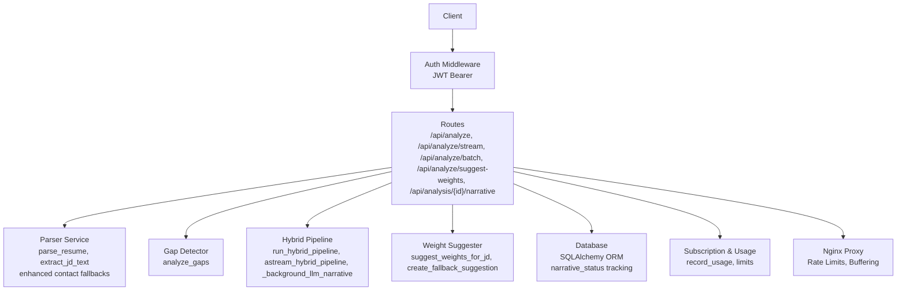
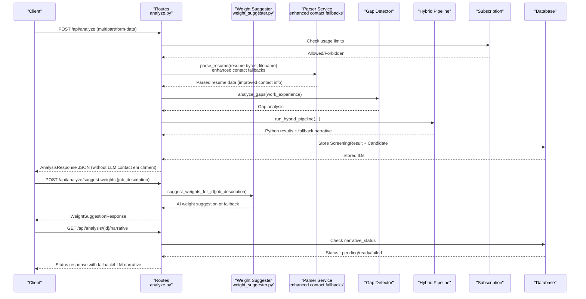
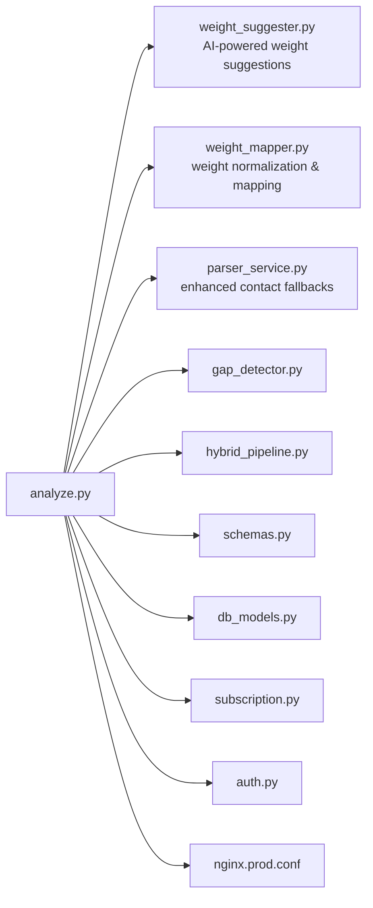

# Analysis Endpoints

<cite>
**Referenced Files in This Document**
- [analyze.py](file://app/backend/routes/analyze.py)
- [weight_suggester.py](file://app/backend/services/weight_suggester.py)
- [weight_mapper.py](file://app/backend/services/weight_mapper.py)
- [schemas.py](file://app/backend/models/schemas.py)
- [auth.py](file://app/backend/middleware/auth.py)
- [subscription.py](file://app/backend/routes/subscription.py)
- [db_models.py](file://app/backend/models/db_models.py)
- [parser_service.py](file://app/backend/services/parser_service.py)
- [gap_detector.py](file://app/backend/services/gap_detector.py)
- [hybrid_pipeline.py](file://app/backend/services/hybrid_pipeline.py)
- [nginx.prod.conf](file://app/nginx/nginx.prod.conf)
- [api.js](file://app/frontend/src/lib/api.js)
- [WeightSuggestionPanel.jsx](file://app/frontend/src/components/WeightSuggestionPanel.jsx)
- [007_narrative_status.py](file://alembic/versions/007_narrative_status.py)
- [test_api.py](file://app/backend/tests/test_api.py)
- [test_routes_phase2.py](file://app/backend/tests/test_routes_phase2.py)
</cite>

## Update Summary
**Changes Made**
- Added documentation for the new `/analyze/suggest-weights` endpoint that provides AI-powered weight suggestions based on job descriptions
- Documented comprehensive error handling, fallback mechanisms, and validation for the weight suggestion system
- Updated streaming analysis endpoint documentation to reflect bug fix that improves data persistence reliability during resume parsing workflows
- Added comprehensive coverage of early database save mechanism for client disconnection scenarios
- Enhanced streaming endpoint reliability section with specific implementation details
- Updated troubleshooting guide to include client disconnection handling

## Table of Contents
1. [Introduction](#introduction)
2. [Project Structure](#project-structure)
3. [Core Components](#core-components)
4. [Architecture Overview](#architecture-overview)
5. [Detailed Component Analysis](#detailed-component-analysis)
6. [Dependency Analysis](#dependency-analysis)
7. [Performance Considerations](#performance-considerations)
8. [Troubleshooting Guide](#troubleshooting-guide)
9. [Conclusion](#conclusion)

## Introduction
This document provides comprehensive API documentation for the resume analysis endpoints. It covers:
- POST /api/analyze: Single resume processing with multipart form data, including resume file upload, job description text or file, optional scoring weights JSON, and action parameters.
- POST /api/analyze/stream: Real-time streaming analysis using Server-Sent Events (SSE) with progressive result stages (parsing, scoring, complete) and enhanced data persistence reliability.
- POST /api/analyze/batch: Concurrent batch processing of multiple resumes with automatic ranking.
- **POST /api/analyze/suggest-weights: AI-powered weight suggestion endpoint that analyzes job descriptions and provides intelligent scoring weight recommendations with fallback mechanisms.**
- **GET /api/analysis/{id}/narrative: Enhanced endpoint with three-state status tracking (pending, ready, failed) and fallback mechanisms.**

It also documents request/response schemas, file size limits and supported formats, error handling for invalid files and insufficient job description content, usage limits, subscription enforcement, rate limiting, and examples of streaming event payloads and batch result structures.

## Project Structure
The analysis endpoints are implemented in the backend FastAPI application under app/backend/routes/analyze.py. Supporting services include:
- Parser service for resume and job description text extraction with enhanced contact information fallback
- Gap detector for employment timeline analysis
- Hybrid pipeline orchestrating Python-first scoring and LLM narrative with status tracking
- Weight suggester service for AI-powered weight recommendations with fallback mechanisms
- Subscription and usage enforcement
- Authentication middleware

**Diagram sources**
- [analyze.py:371-394](file://app/backend/routes/analyze.py#L371-L394)
- [weight_suggester.py:86-177](file://app/backend/services/weight_suggester.py#L86-L177)
- [parser_service.py:1-552](file://app/backend/services/parser_service.py#L1-L552)
- [gap_detector.py:1-219](file://app/backend/services/gap_detector.py#L1-L219)
- [hybrid_pipeline.py:1-800](file://app/backend/services/hybrid_pipeline.py#L1-L800)
- [subscription.py:427-477](file://app/backend/routes/subscription.py#L427-L477)
- [auth.py:1-47](file://app/backend/middleware/auth.py#L1-L47)
- [nginx.prod.conf:50-95](file://app/nginx/nginx.prod.conf#L50-L95)

**Section sources**
- [analyze.py:1-1256](file://app/backend/routes/analyze.py#L1-L1256)
- [weight_suggester.py:1-307](file://app/backend/services/weight_suggester.py#L1-L307)
- [parser_service.py:1-552](file://app/backend/services/parser_service.py#L1-L552)
- [gap_detector.py:1-219](file://app/backend/services/gap_detector.py#L1-L219)
- [hybrid_pipeline.py:1-800](file://app/backend/services/hybrid_pipeline.py#L1-L800)
- [subscription.py:1-477](file://app/backend/routes/subscription.py#L1-L477)
- [auth.py:1-47](file://app/backend/middleware/auth.py#L1-L47)
- [nginx.prod.conf:50-95](file://app/nginx/nginx.prod.conf#L50-L95)

## Core Components
- Authentication: JWT bearer token required for all analysis endpoints.
- Usage enforcement: Monthly analysis limits per tenant plan, enforced before processing.
- File validation: Allowed resume formats (.pdf, .docx, .doc) with size limits; job description file size limit.
- Deduplication: Three-layer deduplication by email, file hash, and name+phone; action parameter controls behavior.
- Streaming: SSE endpoint emits progressive stages with heartbeat pings and enhanced data persistence reliability.
- Batch: Concurrent processing with automatic ranking by fit score.
- **Weight Suggestions: AI-powered weight suggestion endpoint that analyzes job descriptions and provides intelligent scoring weight recommendations with fallback mechanisms.**
- **Status Tracking: Enhanced narrative endpoint with three-state status system (pending, ready, failed) and fallback mechanisms.**
- **Contact Information: Simplified handling through parser service fallback methods (NER, email-based, relaxed header scan, filename-based) without LLM-based enrichment.**
- **Data Persistence Reliability: Enhanced streaming endpoint with early database save mechanism to ensure Python results are preserved when clients disconnect.**

**Section sources**
- [auth.py:19-40](file://app/backend/middleware/auth.py#L19-L40)
- [analyze.py:323-352](file://app/backend/routes/analyze.py#L323-L352)
- [analyze.py:369-384](file://app/backend/routes/analyze.py#L369-L384)
- [analyze.py:147-215](file://app/backend/routes/analyze.py#L147-L215)
- [analyze.py:506-646](file://app/backend/routes/analyze.py#L506-L646)
- [analyze.py:649-758](file://app/backend/routes/analyze.py#L649-L758)
- [analyze.py:371-394](file://app/backend/routes/analyze.py#L371-L394)
- [weight_suggester.py:86-177](file://app/backend/services/weight_suggester.py#L86-L177)

## Architecture Overview
The analysis pipeline integrates file parsing, gap analysis, and hybrid scoring with optional LLM narrative. The hybrid pipeline supports both synchronous and streaming modes with enhanced status tracking for narrative generation. Contact information is now handled through enhanced fallback methods in the parser service. The streaming endpoint includes enhanced data persistence reliability through early database saving mechanisms. The new weight suggestion system provides AI-powered recommendations with comprehensive fallback mechanisms.

**Diagram sources**
- [analyze.py:371-394](file://app/backend/routes/analyze.py#L371-L394)
- [weight_suggester.py:86-177](file://app/backend/services/weight_suggester.py#L86-L177)
- [parser_service.py:547-552](file://app/backend/services/parser_service.py#L547-L552)
- [gap_detector.py:217-219](file://app/backend/services/gap_detector.py#L217-L219)
- [hybrid_pipeline.py:1-800](file://app/backend/services/hybrid_pipeline.py#L1-L800)
- [subscription.py:427-477](file://app/backend/routes/subscription.py#L427-L477)

## Detailed Component Analysis

### Endpoint: POST /api/analyze
Single resume analysis returning a JSON response.

- Method: POST
- Path: /api/analyze
- Authentication: Required (JWT Bearer)
- Content-Type: multipart/form-data
- Form fields:
  - resume: file (required)
  - job_description: string (optional)
  - job_file: file (optional)
  - scoring_weights: string (JSON) (optional)
  - action: string (optional) — one of use_existing, update_profile, create_new
- Response: AnalysisResponse

Request validation and limits:
- Allowed resume extensions: .pdf, .docx, .doc
- Resume file size limit: 10 MB
- Job description file size limit: 5 MB
- Job description text or file required; minimum word count enforced
- Usage limit checked before processing; raises 429 if exceeded

Processing steps:
- Parse resume in thread pool with enhanced contact fallbacks
- Analyze gaps
- Parse or cache job description analysis
- Run hybrid pipeline
- Deduplicate candidates (3-layer) and optionally update stored profile
- Persist result and candidate profile
- Return result with identifiers

Response schema (AnalysisResponse):
- Core fields: fit_score, job_role, strengths, weaknesses, employment_gaps, education_analysis, risk_signals, final_recommendation, score_breakdown, matched_skills, missing_skills, risk_level, interview_questions, required_skills_count, work_experience
- Extended fields: jd_analysis, candidate_profile, skill_analysis, edu_timeline_analysis, explainability, recommendation_rationale, adjacent_skills, pipeline_errors, analysis_quality, narrative_pending, duplicate_candidate
- Auxiliary identifiers: result_id, candidate_id, candidate_name

**Updated** Removed contact_info field from AnalysisResponse as LLM-based contact enrichment system has been eliminated. Contact information is now handled through parser service fallback methods only.

Error handling:
- 400 for unsupported file types, oversized files, insufficient JD content
- 401/403 for authentication/authorization failures
- 429 for usage limit exceeded
- 5xx for internal errors during parsing or pipeline execution

**Section sources**
- [analyze.py:354-501](file://app/backend/routes/analyze.py#L354-L501)
- [schemas.py:89-125](file://app/backend/models/schemas.py#L89-L125)
- [auth.py:19-40](file://app/backend/middleware/auth.py#L19-L40)
- [subscription.py:427-477](file://app/backend/routes/subscription.py#L427-L477)

### Endpoint: POST /api/analyze/stream
Real-time streaming analysis using Server-Sent Events (SSE) with enhanced data persistence reliability.

- Method: POST
- Path: /api/analyze/stream
- Authentication: Required (JWT Bearer)
- Content-Type: multipart/form-data
- Form fields: same as single endpoint
- Response: text/event-stream

**Enhanced Data Persistence Reliability:**
The streaming endpoint now includes sophisticated client disconnection handling to ensure data integrity:

- **Early Database Save Mechanism:** When a client disconnects during analysis, the system automatically saves Python results to the database to prevent data loss
- **Client Disconnection Detection:** The system continuously checks for client disconnection between analysis stages using `await request.is_disconnected()`
- **Conditional Save Logic:** Results are only saved when they contain the full Python scoring data (specifically during "parsing" and "complete" stages)
- **Guaranteed Completion:** The system ensures database persistence regardless of client connectivity issues

Streaming stages:
- Stage "parsing": Python-only scores and partial analysis (within 2s)
- Stage "scoring": LLM narrative and explainability (after ~40s)
- Stage "complete": full merged result
- Heartbeat pings maintain connection through proxies

**Enhanced Reliability Features:**
- **Automatic Recovery:** When clients disconnect, Python results are automatically persisted to prevent data loss
- **Resource Cleanup:** The system guarantees "[DONE]" event delivery even in error conditions
- **Connection Monitoring:** Continuous monitoring for client disconnection during both startup and active streaming phases

Proxy configuration:
- Nginx disables buffering for SSE to prevent Cloudflare 524 errors
- Separate rate limits for streaming endpoint

Frontend consumption example:
- ReadableStream reader decodes chunks and parses "data: " lines
- On each event, invoke onStageComplete callback
- On completion, finalResult contains the full result

**Section sources**
- [analyze.py:506-646](file://app/backend/routes/analyze.py#L506-L646)
- [analyze.py:775-833](file://app/backend/routes/analyze.py#L775-L833)
- [hybrid_pipeline.py:1410-1498](file://app/backend/services/hybrid_pipeline.py#L1410-L1498)
- [nginx.prod.conf:66-95](file://app/nginx/nginx.prod.conf#L66-L95)
- [api.js:96-141](file://app/frontend/src/lib/api.js#L96-L141)

### Endpoint: POST /api/analyze/batch
Concurrent batch processing of multiple resumes with automatic ranking.

- Method: POST
- Path: /api/analyze/batch
- Authentication: Required (JWT Bearer)
- Content-Type: multipart/form-data
- Form fields:
  - resumes: list of files (required)
  - job_description: string (optional)
  - job_file: file (optional)
  - scoring_weights: string (JSON) (optional)
- Response: BatchAnalysisResponse

Processing:
- Validates allowed extensions and size limits
- Checks usage limits for the batch size
- Pre-parses and caches job description analysis
- Processes resumes concurrently using asyncio.gather
- Persists each result and candidate
- Sorts results by fit_score descending

Response schema (BatchAnalysisResponse):
- results: list of BatchAnalysisResult
- total: integer count

BatchAnalysisResult:
- rank: integer
- filename: string
- result: AnalysisResponse

**Section sources**
- [analyze.py:649-758](file://app/backend/routes/analyze.py#L649-L758)
- [schemas.py:127-136](file://app/backend/models/schemas.py#L127-L136)
- [subscription.py:670-681](file://app/backend/routes/subscription.py#L670-L681)

### Endpoint: POST /api/analyze/suggest-weights
**New** AI-powered weight suggestion endpoint that analyzes job descriptions and provides intelligent scoring weight recommendations with comprehensive fallback mechanisms.

- Method: POST
- Path: /api/analyze/suggest-weights
- Authentication: Required (JWT Bearer)
- Content-Type: multipart/form-data
- Form fields:
  - job_description: string (required) — minimum 50 characters
- Response: WeightSuggestionResponse

**AI-Powered Weight Analysis:**
The endpoint uses an LLM to analyze job descriptions and provide intelligent weight recommendations:

- **Role Category Detection:** Identifies role categories (technical, sales, hr, marketing, operations, leadership, other)
- **Seniority Level Analysis:** Determines seniority levels (junior, mid, senior, lead, executive)
- **Key Requirements Extraction:** Identifies critical success factors for the role
- **Optimal Weight Distribution:** Suggests balanced weight allocations for scoring

**Response Schema (WeightSuggestionResponse):**
- role_category: string — detected role type
- seniority_level: string — detected seniority level
- key_requirements: array[string] — identified key requirements
- suggested_weights: object — weight distribution for scoring factors
  - core_competencies: number (0.0-1.0)
  - experience: number (0.0-1.0)
  - domain_fit: number (0.0-1.0)
  - education: number (0.0-1.0)
  - career_trajectory: number (0.0-1.0)
  - role_excellence: number (0.0-1.0)
  - risk: number (-0.15 to 0.0)
- role_excellence_label: string — adaptive label for role-specific excellence
- reasoning: string — explanation for the weight distribution
- confidence: number (0.0-1.0) — confidence score
- fallback: boolean (optional) — indicates fallback mode when LLM is unavailable

**Validation and Error Handling:**
- Minimum 50 character requirement for job description
- Comprehensive LLM response validation and JSON parsing
- Automatic fallback to default weights when LLM fails
- Graceful error handling with informative messages

**Fallback Mechanisms:**
- **LLM Failure Handling:** When AI analysis fails, system falls back to default weights
- **Keyword-Based Detection:** Simple keyword analysis to determine role category
- **Default Weight Categories:** Predefined weight distributions for common role types
- **Confidence Scores:** Lower confidence for fallback suggestions

**Section sources**
- [analyze.py:371-394](file://app/backend/routes/analyze.py#L371-L394)
- [weight_suggester.py:86-177](file://app/backend/services/weight_suggester.py#L86-L177)
- [weight_suggester.py:272-307](file://app/backend/services/weight_suggester.py#L272-L307)
- [weight_mapper.py:29-37](file://app/backend/services/weight_mapper.py#L29-L37)

### Endpoint: GET /api/analysis/{id}/narrative
**Enhanced** endpoint with three-state status tracking system for LLM narrative polling.

- Method: GET
- Path: /api/analysis/{analysis_id}
- Authentication: Required (JWT Bearer)
- Response: JSON with status tracking

**Status States:**
- **pending**: LLM narrative is still being generated
  - Response: `{"status": "pending"}`
  - Used when `narrative_status` is "pending" or `narrative_json` is NULL
- **ready**: LLM narrative is available
  - Response: `{"status": "ready", "narrative": {...}}`
  - Contains the complete narrative JSON with all fields
- **failed**: LLM narrative generation failed
  - Response: `{"status": "failed", "error": "...", "narrative": {...}}`
  - Includes error message and fallback narrative

**Fallback Mechanisms:**
- When LLM fails or times out, deterministic fallback narrative is generated
- Fallback contains basic fit summary, strengths, concerns, and interview questions
- Error messages are stored in `narrative_error` field for debugging

**Database Integration:**
- Uses `narrative_status` field in ScreeningResult model
- Supports four states: "pending", "processing", "ready", "failed"
- Stores error details in `narrative_error` field
- Maintains tenant isolation through filtering by `tenant_id`

**Frontend Polling Strategy:**
- Client polls endpoint when `narrative_pending` is True in initial analysis
- Adaptive polling intervals: 2s for first 30s, then 5s for longer waits
- Maximum 36 attempts (~2.25 minutes total)
- Graceful degradation when LLM is unavailable

**Section sources**
- [analyze.py:1205-1256](file://app/backend/routes/analyze.py#L1205-L1256)
- [db_models.py:129-151](file://app/backend/models/db_models.py#L129-L151)
- [hybrid_pipeline.py:1896-2038](file://app/backend/services/hybrid_pipeline.py#L1896-L2038)
- [007_narrative_status.py:1-65](file://alembic/versions/007_narrative_status.py#L1-L65)
- [test_api.py:277-381](file://app/backend/tests/test_api.py#L277-L381)

### Deduplication and Candidate Profile Storage
Three-layer deduplication:
- Email match within tenant
- File hash match
- Name + phone match

Action parameter behavior:
- use_existing: reuse stored profile if available
- update_profile: update stored profile on match
- create_new: bypass deduplication
- None/unrecognized: deduplicate and optionally return duplicate_candidate info

Stored candidate profile includes:
- Skills, education, work experience
- Gap analysis JSON
- Current role/company and total years experience
- Quality and timestamps

**Section sources**
- [analyze.py:147-215](file://app/backend/routes/analyze.py#L147-L215)
- [schemas.py:8-20](file://app/backend/models/schemas.py#L8-L20)
- [db_models.py:97-126](file://app/backend/models/db_models.py#L97-L126)

### Job Description Parsing and Caching
- extract_jd_text supports multiple formats (PDF, DOCX, DOC, TXT, RTF, HTML, ODT, Markdown)
- parse_jd_rules extracts role title, domain, seniority, required skills, required years, nice-to-have skills, and responsibilities
- JdCache stores parsed JD results keyed by MD5 hash for reuse across workers

**Section sources**
- [parser_service.py:20-128](file://app/backend/services/parser_service.py#L20-L128)
- [hybrid_pipeline.py:467-560](file://app/backend/services/hybrid_pipeline.py#L467-L560)
- [db_models.py:229-236](file://app/backend/models/db_models.py#L229-L236)

### Enhanced Contact Information Handling
**Updated** Contact information is now handled through enhanced fallback methods in the parser service:

- **Parser Service Fallback Methods:**
  - spaCy NER extraction for diverse name formats
  - Email-based name extraction as fallback
  - Relaxed header scanning for name detection
  - Filename-based extraction when other methods fail
  - Automatic merging of LLM contact extraction results with regex results

- **Contact Information Sources:**
  - Name: Extracted from resume text using multiple fallback tiers
  - Email: Extracted using regex patterns
  - Phone: Extracted using regex patterns
  - LinkedIn: Extracted using regex patterns

- **Contact Information Storage:**
  - Stored in Candidate table for future analysis
  - Available for deduplication and profile updates
  - Used for candidate name resolution in results

**Section sources**
- [parser_service.py:1080-1155](file://app/backend/services/parser_service.py#L1080-L1155)
- [analyze.py:166-172](file://app/backend/routes/analyze.py#L166-L172)
- [analyze.py:191-196](file://app/backend/routes/analyze.py#L191-L196)

### Usage Limits, Subscription Enforcement, and Rate Limiting
Usage enforcement:
- Monthly analysis limit per tenant plan
- Usage increments on successful analysis
- Limits retrieved from SubscriptionPlan.limits JSON

Subscription endpoints:
- GET /api/subscription — current plan, usage stats, available plans
- GET /api/subscription/check/{action} — check limits before action
- GET /api/subscription/usage-history — recent usage logs

Rate limiting:
- Nginx zones enforce request rates:
  - Non-streaming: limit_req zone=api burst=20 nodelay
  - Streaming: limit_req zone=api burst=5 nodelay
- Streaming endpoint disables proxy buffering and gzip to ensure immediate event delivery

**Section sources**
- [subscription.py:172-253](file://app/backend/routes/subscription.py#L172-L253)
- [subscription.py:256-343](file://app/backend/routes/subscription.py#L256-L343)
- [subscription.py:427-477](file://app/backend/routes/subscription.py#L427-L477)
- [nginx.prod.conf:50-95](file://app/nginx/nginx.prod.conf#L50-L95)

## Dependency Analysis
The analysis endpoints depend on several services and models.

**Diagram sources**
- [analyze.py:1-1256](file://app/backend/routes/analyze.py#L1-L1256)
- [weight_suggester.py:1-307](file://app/backend/services/weight_suggester.py#L1-L307)
- [weight_mapper.py:1-360](file://app/backend/services/weight_mapper.py#L1-L360)
- [parser_service.py:1-552](file://app/backend/services/parser_service.py#L1-L552)
- [gap_detector.py:1-219](file://app/backend/services/gap_detector.py#L1-L219)
- [hybrid_pipeline.py:1-800](file://app/backend/services/hybrid_pipeline.py#L1-L800)
- [schemas.py:1-379](file://app/backend/models/schemas.py#L1-L379)
- [db_models.py:1-250](file://app/backend/models/db_models.py#L1-L250)
- [subscription.py:1-477](file://app/backend/routes/subscription.py#L1-L477)
- [auth.py:1-47](file://app/backend/middleware/auth.py#L1-L47)
- [nginx.prod.conf:50-95](file://app/nginx/nginx.prod.conf#L50-L95)

**Section sources**
- [analyze.py:1-1256](file://app/backend/routes/analyze.py#L1-L1256)
- [weight_suggester.py:1-307](file://app/backend/services/weight_suggester.py#L1-L307)
- [weight_mapper.py:1-360](file://app/backend/services/weight_mapper.py#L1-L360)
- [schemas.py:1-379](file://app/backend/models/schemas.py#L1-L379)
- [db_models.py:1-250](file://app/backend/models/db_models.py#L1-L250)
- [subscription.py:1-477](file://app/backend/routes/subscription.py#L1-L477)
- [auth.py:1-47](file://app/backend/middleware/auth.py#L1-L47)
- [nginx.prod.conf:50-95](file://app/nginx/nginx.prod.conf#L50-L95)

## Performance Considerations
- Asynchronous parsing: Resume parsing runs in a thread pool to avoid blocking the event loop.
- Streaming: SSE endpoint yields heartbeat pings to keep connections alive through proxies.
- Concurrency: Batch endpoint uses asyncio.gather for concurrent processing.
- Caching: JD parsing is cached per tenant to avoid repeated LLM calls.
- Rate limiting: Nginx zones protect the API from overload.
- **Weight Suggestion Performance:** AI-powered weight suggestions use efficient LLM calls with JSON formatting and automatic fallback mechanisms.
- **Status tracking: Database-level status tracking reduces polling overhead and improves user experience.**
- **Enhanced contact fallbacks: Improved contact information extraction reduces dependency on LLM-based contact enrichment.**
- **Enhanced Streaming Reliability: Early database save mechanism prevents data loss during client disconnections and ensures complete analysis results are always persisted.**

## Troubleshooting Guide
Common errors and resolutions:
- Unsupported resume format: Ensure .pdf, .docx, or .doc. See ALLOWED_EXTENSIONS.
- Resume too large: Maximum 10 MB. See size checks.
- Job description missing or too short: Provide text or file; minimum 50 characters for weight suggestions.
- Usage limit exceeded: Upgrade plan or wait until next reset. Check /api/subscription.
- Authentication failures: Verify JWT Bearer token.
- Streaming timeouts: Ensure SSE endpoint is proxied without buffering and with adequate timeouts.
- **Client disconnection issues: The enhanced streaming endpoint now automatically saves Python results when clients disconnect, preventing data loss.**
- **Narrative polling issues: Check that analysis_id belongs to the authenticated user's tenant. Verify narrative_status field values.**
- **Contact information issues: Verify that enhanced fallback methods are working correctly. Check parser service contact extraction logs.**
- **Weight suggestion failures: The system automatically falls back to default weights when AI analysis fails. Check LLM availability and configuration.**

**Enhanced Streaming Troubleshooting:**
- **Early Database Save Failures:** Monitor logs for "Failed to save early DB results" warnings and ensure database connectivity
- **Client Disconnection Detection:** The system continuously monitors for disconnections during both parsing and streaming phases
- **Guaranteed Completion Events:** The system ensures "[DONE]" event delivery even in error conditions
- **Resource Cleanup:** Background tasks are properly cancelled and cleaned up when clients disconnect

**Weight Suggestion Troubleshooting:**
- **LLM Unavailable:** System automatically falls back to default weights with reduced confidence
- **Invalid Job Description:** Ensure minimum 50 characters and clear role requirements
- **JSON Parsing Errors:** LLM responses are validated and fallback mechanisms trigger on parsing failures
- **Weight Normalization Issues:** System automatically normalizes weights to ensure they sum to 1.0

**Section sources**
- [analyze.py:369-384](file://app/backend/routes/analyze.py#L369-L384)
- [analyze.py:255-266](file://app/backend/routes/analyze.py#L255-L266)
- [analyze.py:371-394](file://app/backend/routes/analyze.py#L371-L394)
- [weight_suggester.py:86-177](file://app/backend/services/weight_suggester.py#L86-L177)
- [subscription.py:256-343](file://app/backend/routes/subscription.py#L256-L343)
- [nginx.prod.conf:66-95](file://app/nginx/nginx.prod.conf#L66-L95)
- [test_routes_phase2.py:221-262](file://app/backend/tests/test_routes_phase2.py#L221-L262)

## Conclusion
The analysis endpoints provide robust, scalable resume screening with optional real-time streaming and batch processing. They enforce usage limits through a subscription system, support multiple file formats, and deliver comprehensive results with explainability and risk signals. The enhanced GET /api/analysis/{id}/narrative endpoint with three-state status tracking significantly improves user experience by providing clear feedback on narrative generation progress and fallback mechanisms. 

**Updated** The elimination of the LLM-based contact enrichment system simplifies the pipeline while maintaining contact information accuracy through enhanced fallback methods in the parser service. This change reduces complexity, improves performance, and maintains the quality of contact information extraction through multiple fallback tiers (NER, email-based, relaxed header scan, filename-based).

**Enhanced Streaming Reliability:** The recent bug fix significantly improves data persistence reliability during resume parsing workflows by implementing an early database save mechanism. When clients disconnect during streaming analysis, the system automatically captures and persists Python results to prevent data loss, ensuring complete analysis results are always available for retrieval and polling. This enhancement provides robust protection against network interruptions and client-side disconnections while maintaining the streaming experience for connected clients.

**New Weight Suggestion System:** The addition of the AI-powered weight suggestion endpoint provides intelligent scoring recommendations based on job descriptions. The system includes comprehensive validation, fallback mechanisms, and automatic weight normalization to ensure reliable and consistent weight recommendations across different role types and requirements.

Proper configuration of authentication, rate limiting, and proxy buffering ensures reliable operation in production environments with enhanced data integrity guarantees and intelligent weight recommendation capabilities.