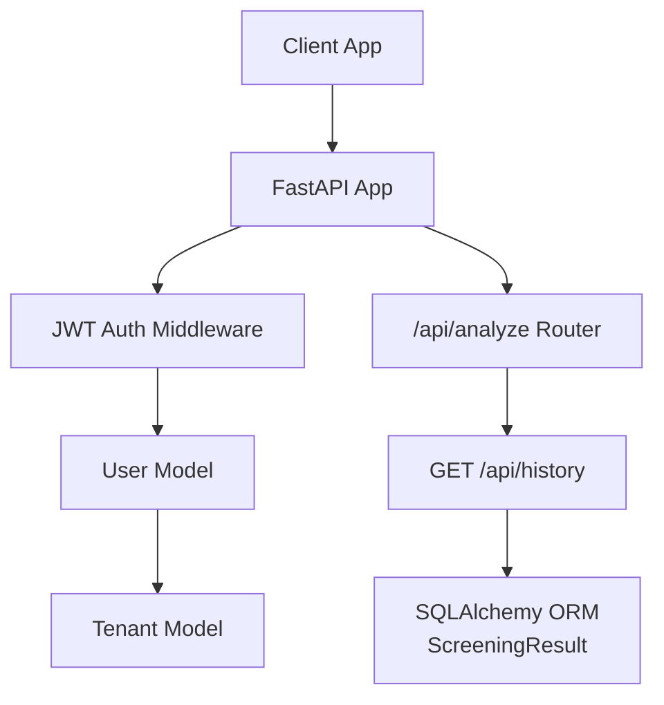
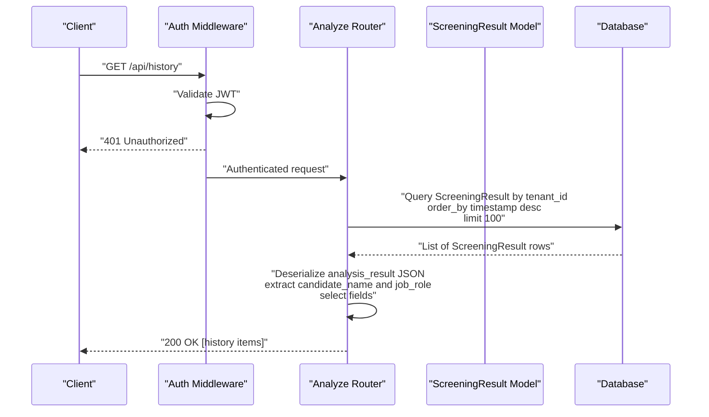
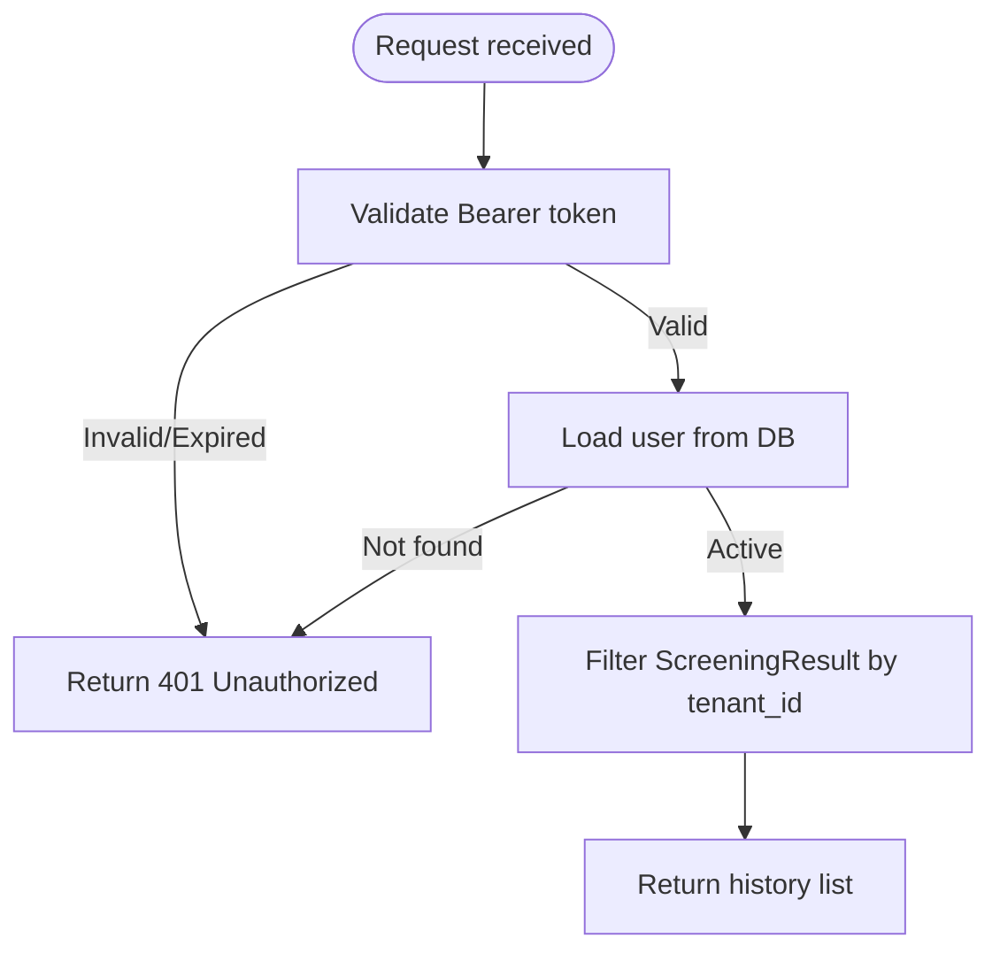
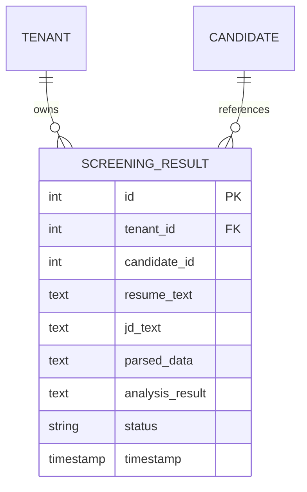
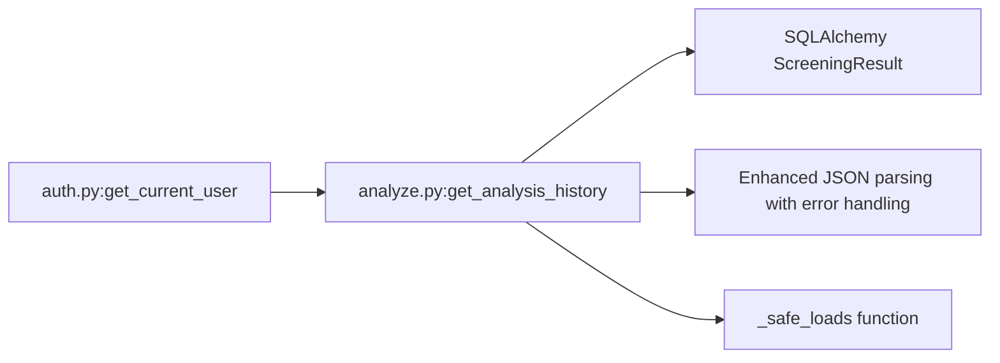

# Analysis History

<cite>
**Referenced Files in This Document**
- [main.py](file://app/backend/main.py)
- [auth.py](file://app/backend/middleware/auth.py)
- [analyze.py](file://app/backend/routes/analyze.py)
- [db_models.py](file://app/backend/models/db_models.py)
- [schemas.py](file://app/backend/models/schemas.py)
- [api.js](file://app/frontend/src/lib/api.js)
- [test_api.py](file://app/backend/tests/test_api.py)
</cite>

## Update Summary
**Changes Made**
- Updated response schema to include new `candidate_name` and `job_role` fields
- Enhanced error handling and data extraction logic in the history endpoint
- Improved comparison page functionality with enriched candidate and job information
- Updated response processing to safely extract and resolve candidate name and job role from multiple data sources

## Table of Contents
1. [Introduction](#introduction)
2. [Project Structure](#project-structure)
3. [Core Components](#core-components)
4. [Architecture Overview](#architecture-overview)
5. [Detailed Component Analysis](#detailed-component-analysis)
6. [Dependency Analysis](#dependency-analysis)
7. [Performance Considerations](#performance-considerations)
8. [Troubleshooting Guide](#troubleshooting-guide)
9. [Conclusion](#conclusion)

## Introduction
This document specifies the GET /api/history endpoint for retrieving analysis history. It covers query parameters, pagination support, response filtering, response schema, tenant isolation, access controls, data privacy considerations, integration patterns with candidate management systems, client-side pagination strategies, filtering examples, and performance considerations for large history datasets.

**Updated** Enhanced with improved error handling and data extraction capabilities, including the addition of `candidate_name` and `job_role` fields to support comparison page functionality.

## Project Structure
The history endpoint is implemented in the backend FastAPI application under the analysis router. Authentication is enforced via a JWT middleware, and tenant isolation is achieved through database queries scoped to the current user's tenant.

**Diagram sources**
- [main.py:200-215](file://app/backend/main.py#L200-L215)
- [auth.py:19-46](file://app/backend/middleware/auth.py#L19-L46)
- [analyze.py:41-42](file://app/backend/routes/analyze.py#L41-L42)
- [analyze.py:1096-1146](file://app/backend/routes/analyze.py#L1096-L1146)
- [db_models.py:129-150](file://app/backend/models/db_models.py#L129-L150)

**Section sources**
- [main.py:200-215](file://app/backend/main.py#L200-L215)
- [auth.py:19-46](file://app/backend/middleware/auth.py#L19-L46)
- [analyze.py:41-42](file://app/backend/routes/analyze.py#L41-L42)

## Core Components
- Endpoint: GET /api/history
- Purpose: Retrieve recent screening analysis records for the authenticated user's tenant
- Response shape: Array of history items with id, timestamp, status, candidate_id, fit_score, final_recommendation, risk_level, candidate_name, job_role
- Pagination: Default limit of 100; no offset/limit query parameters currently supported
- Filtering: No explicit query parameters for status/date/candidate filters; filtering can be applied client-side after retrieval

**Updated** Response now includes `candidate_name` and `job_role` fields for enhanced comparison page functionality.

**Section sources**
- [analyze.py:1096-1146](file://app/backend/routes/analyze.py#L1096-L1146)
- [test_api.py:171-174](file://app/backend/tests/test_api.py#L171-L174)

## Architecture Overview
The history endpoint enforces authentication, isolates data by tenant, and returns a curated subset of analysis results with enhanced error handling and data extraction.

**Diagram sources**
- [auth.py:19-46](file://app/backend/middleware/auth.py#L19-L46)
- [analyze.py:1096-1146](file://app/backend/routes/analyze.py#L1096-L1146)
- [db_models.py:129-150](file://app/backend/models/db_models.py#L129-L150)

## Detailed Component Analysis

### Endpoint Definition and Behavior
- Path: /api/history
- Method: GET
- Authentication: Required (Bearer token)
- Authorization: Tenant-scoped; only results belonging to the current user's tenant are returned
- Sorting: Descending by timestamp (most recent first)
- Limit: 100 items by default
- Response: Array of history items

Response item fields:
- id: integer
- timestamp: datetime
- status: string
- candidate_id: integer or null
- fit_score: integer or null
- final_recommendation: string
- risk_level: string or null
- candidate_name: string or null
- job_role: string or null

**Updated** Response now includes `candidate_name` and `job_role` fields extracted from multiple data sources for enhanced comparison functionality.

Notes:
- fit_score and risk_level may be null depending on analysis state
- final_recommendation is always present in persisted results
- candidate_name and job_role are resolved from analysis_result, contact_info, candidate_profile, or parsed_data with fallback mechanisms

**Section sources**
- [analyze.py:1096-1146](file://app/backend/routes/analyze.py#L1096-L1146)
- [db_models.py:138-140](file://app/backend/models/db_models.py#L138-L140)

### Authentication and Access Control
- JWT bearer token required
- Token decoded to resolve current user
- User must be active
- Tenant isolation enforced via tenant_id filter

**Diagram sources**
- [auth.py:19-46](file://app/backend/middleware/auth.py#L19-L46)
- [analyze.py:1101-1107](file://app/backend/routes/analyze.py#L1101-L1107)

**Section sources**
- [auth.py:19-46](file://app/backend/middleware/auth.py#L19-L46)
- [analyze.py:1101-1107](file://app/backend/routes/analyze.py#L1101-L1107)

### Data Model and Schema Alignment
- ScreeningResult stores analysis_result as JSON text
- History endpoint deserializes analysis_result to extract fit_score, final_recommendation, risk_level, candidate_name, job_role
- Timestamp and status are taken from the ScreeningResult row
- Enhanced error handling ensures safe JSON parsing with fallback mechanisms

**Updated** Enhanced error handling with `_safe_loads` function that handles JSONDecodeError and TypeError exceptions gracefully.

**Diagram sources**
- [db_models.py:129-150](file://app/backend/models/db_models.py#L129-L150)

**Section sources**
- [db_models.py:129-150](file://app/backend/models/db_models.py#L129-L150)

### Response Schema
- Array of objects with the following fields:
  - id: integer
  - timestamp: datetime
  - status: string
  - candidate_id: integer or null
  - fit_score: integer or null
  - final_recommendation: string
  - risk_level: string or null
  - candidate_name: string or null
  - job_role: string or null

**Updated** Response schema now includes `candidate_name` and `job_role` fields for enhanced comparison page functionality.

Validation notes:
- fit_score and risk_level may be null for pending or partial results
- final_recommendation is always present in persisted results
- candidate_name and job_role may be null if not available in analysis data
- Enhanced error handling ensures graceful fallback when data extraction fails

**Section sources**
- [analyze.py:1134-1146](file://app/backend/routes/analyze.py#L1134-L1146)

### Enhanced Data Extraction Logic
The history endpoint implements sophisticated data extraction logic to populate `candidate_name` and `job_role` fields:

**Candidate Name Resolution Priority:**
1. analysis_result.candidate_name (highest priority)
2. analysis_result.contact_info.name
3. analysis_result.candidate_profile.name
4. parsed_data.contact_info.name (lowest priority)
5. None (if all sources fail)

**Job Role Resolution Priority:**
1. analysis_result.job_role (highest priority)
2. analysis_result.jd_analysis.role_title
3. None (if all sources fail)

**Updated** Enhanced error handling ensures that JSON parsing failures don't break the entire response, with graceful fallback to None values.

**Section sources**
- [analyze.py:1119-1132](file://app/backend/routes/analyze.py#L1119-L1132)

### Pagination Support
- Default limit: 100 items
- No offset/limit query parameters are currently supported
- To fetch more items, clients should implement client-side pagination or request fewer items per page and iterate

Recommendations:
- Use client-side pagination for large datasets
- Consider adding server-side limit/offset parameters in future iterations

**Section sources**
- [analyze.py:1104-1105](file://app/backend/routes/analyze.py#L1104-L1105)

### Filtering Capabilities
- No built-in query parameters for status, date range, or candidate_id filtering
- Filtering can be performed client-side after retrieving the default 100-item list
- Example patterns (client-side):
  - Filter by status: keep items where status equals a desired value
  - Filter by date range: keep items whose timestamp falls within a given range
  - Filter by candidate_id: keep items where candidate_id equals a specific ID
  - Filter by candidate_name: keep items where candidate_name matches search criteria
  - Filter by job_role: keep items where job_role matches search criteria

**Updated** Added filtering examples for the new `candidate_name` and `job_role` fields.

Note: Adding server-side filters (e.g., status, candidate_id, start_date, end_date, limit, offset) would improve performance for large datasets.

**Section sources**
- [analyze.py:1096-1146](file://app/backend/routes/analyze.py#L1096-L1146)

### Integration with Candidate Management Systems
- candidate_id in history items links to the candidate who was analyzed
- candidate_name provides direct access to candidate names without additional API calls
- job_role enables filtering and sorting by job roles for comparison functionality
- Clients can enrich history entries with additional context using these fields
- Use the candidate detail endpoint to augment history items with additional metadata

**Updated** Enhanced integration capabilities with the new `candidate_name` and `job_role` fields.

**Section sources**
- [analyze.py:1138-1143](file://app/backend/routes/analyze.py#L1138-L1143)

### Client-Side Pagination Strategies
- Fetch initial page (default 100 items)
- Apply client-side filters for status/date/candidate_id/candidate_name/job_role
- Paginate by slicing arrays and requesting smaller batches if needed
- Debounce frequent filtering operations to avoid excessive re-renders
- Leverage the new filtering fields for enhanced user experience

**Updated** Added guidance for using the new filtering fields in client-side strategies.

**Section sources**
- [api.js:169-172](file://app/frontend/src/lib/api.js#L169-L172)

### Examples of History Retrieval Patterns
- Basic retrieval: GET /api/history
- Client-side filtering examples:
  - Filter to "shortlisted" only
  - Filter to last 30 days
  - Filter to a specific candidate_id
  - Filter by candidate_name containing specific text
  - Filter by job_role matching specific role
- Batch pagination: request N items, slice to M per page, and repeat
- Enhanced comparison scenarios using candidate_name and job_role fields

**Updated** Added examples leveraging the new filtering capabilities.

Note: These are conceptual examples; implement them client-side after retrieving the default list.

**Section sources**
- [test_api.py:171-174](file://app/backend/tests/test_api.py#L171-L174)
- [api.js:169-172](file://app/frontend/src/lib/api.js#L169-L172)

## Dependency Analysis
- The history endpoint depends on:
  - JWT authentication middleware for user resolution
  - SQLAlchemy ORM to query ScreeningResult filtered by tenant_id
  - JSON parsing of analysis_result and parsed_data to extract fields for the response
  - Enhanced error handling with safe JSON loading functions

**Updated** Enhanced dependency analysis reflecting the improved error handling and data extraction logic.

**Diagram sources**
- [auth.py:19-46](file://app/backend/middleware/auth.py#L19-L46)
- [analyze.py:1096-1146](file://app/backend/routes/analyze.py#L1096-L1146)
- [db_models.py:129-150](file://app/backend/models/db_models.py#L129-L150)

**Section sources**
- [auth.py:19-46](file://app/backend/middleware/auth.py#L19-L46)
- [analyze.py:1096-1146](file://app/backend/routes/analyze.py#L1096-L1146)

## Performance Considerations
- Default limit of 100 items helps prevent large payloads
- For very large datasets:
  - Implement client-side pagination and filtering
  - Consider adding server-side limit/offset parameters
  - Indexes on tenant_id and timestamp can improve query performance
- JSON parsing of analysis_result and parsed_data occurs per row; consider caching or precomputing frequently accessed fields if needed
- Enhanced error handling adds minimal overhead with safe fallback mechanisms
- The new candidate_name and job_role fields are computed on-the-fly but only when needed for display

**Updated** Added performance considerations for the enhanced error handling and data extraction logic.

## Troubleshooting Guide
Common issues and resolutions:
- 401 Unauthorized: Ensure a valid Bearer token is included in the Authorization header
- Empty list: The tenant may have no analysis history; verify tenant membership and that analyses were performed
- Unexpected nulls: fit_score and risk_level may be null for pending or partial results
- Missing candidate_name: May be null if not available in analysis data sources
- Missing job_role: May be null if not available in analysis data sources
- JSON parsing errors: Enhanced error handling automatically falls back to safe defaults

**Updated** Added troubleshooting guidance for the new fields and enhanced error handling.

**Section sources**
- [auth.py:23-40](file://app/backend/middleware/auth.py#L23-L40)
- [test_api.py:171-174](file://app/backend/tests/test_api.py#L171-L174)

## Conclusion
The GET /api/history endpoint provides a tenant-isolated, sorted list of recent analysis results with an enhanced response schema that includes `candidate_name` and `job_role` fields for improved comparison page functionality. The endpoint now features enhanced error handling and data extraction capabilities that ensure robust operation even when analysis data is incomplete or malformed. While it currently supports default pagination and no server-side filters, clients can implement robust pagination and filtering strategies using the new fields. Extending the endpoint with query parameters for filtering and pagination would further improve performance and usability for large datasets.