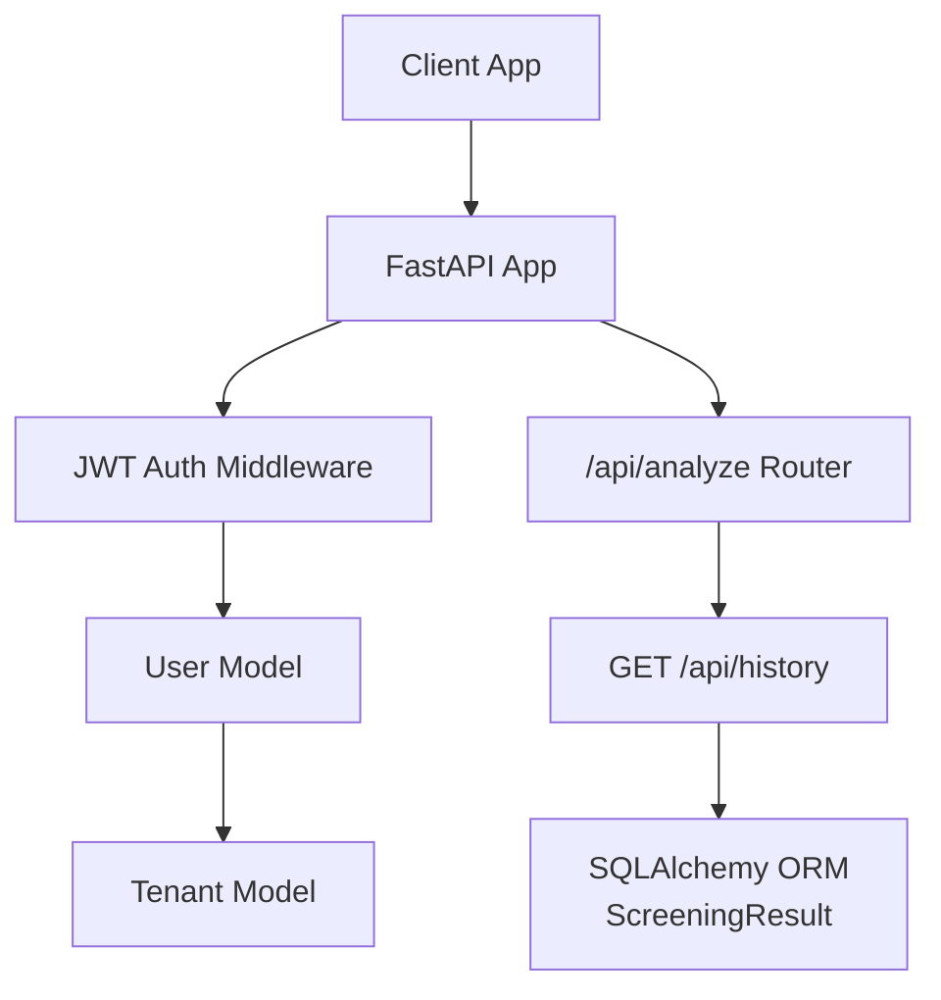
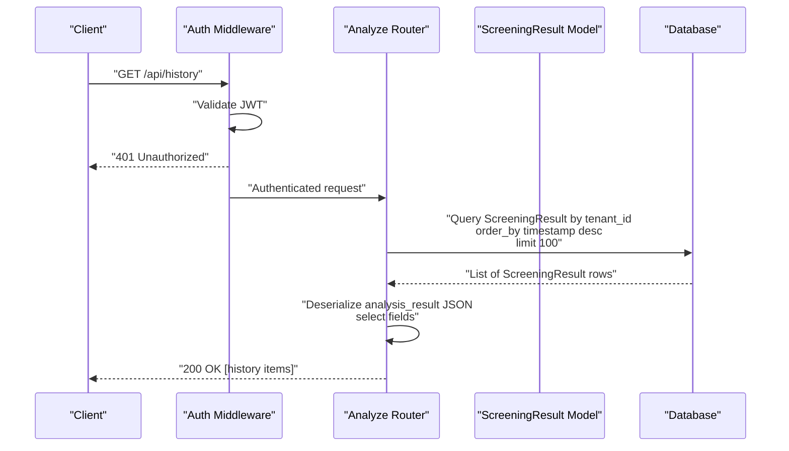
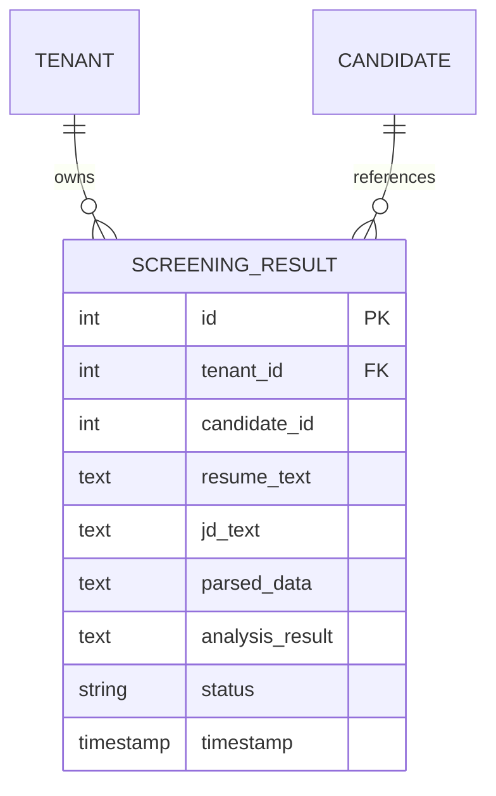
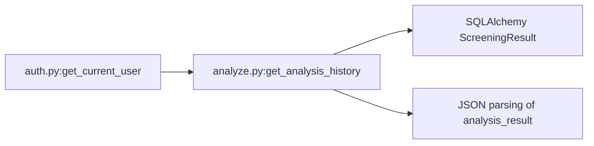

# Analysis History

<cite>
**Referenced Files in This Document**
- [main.py](file://app/backend/main.py)
- [auth.py](file://app/backend/middleware/auth.py)
- [analyze.py](file://app/backend/routes/analyze.py)
- [db_models.py](file://app/backend/models/db_models.py)
- [schemas.py](file://app/backend/models/schemas.py)
- [api.js](file://app/frontend/src/lib/api.js)
- [test_api.py](file://app/backend/tests/test_api.py)
</cite>

## Table of Contents
1. [Introduction](#introduction)
2. [Project Structure](#project-structure)
3. [Core Components](#core-components)
4. [Architecture Overview](#architecture-overview)
5. [Detailed Component Analysis](#detailed-component-analysis)
6. [Dependency Analysis](#dependency-analysis)
7. [Performance Considerations](#performance-considerations)
8. [Troubleshooting Guide](#troubleshooting-guide)
9. [Conclusion](#conclusion)

## Introduction
This document specifies the GET /api/history endpoint for retrieving analysis history. It covers query parameters, pagination support, response filtering, response schema, tenant isolation, access controls, data privacy considerations, integration patterns with candidate management systems, client-side pagination strategies, filtering examples, and performance considerations for large history datasets.

## Project Structure
The history endpoint is implemented in the backend FastAPI application under the analysis router. Authentication is enforced via a JWT middleware, and tenant isolation is achieved through database queries scoped to the current user’s tenant.

**Diagram sources**
- [main.py:200-215](file://app/backend/main.py#L200-L215)
- [auth.py:19-46](file://app/backend/middleware/auth.py#L19-L46)
- [analyze.py:41-42](file://app/backend/routes/analyze.py#L41-L42)
- [analyze.py:763-786](file://app/backend/routes/analyze.py#L763-L786)
- [db_models.py:128-147](file://app/backend/models/db_models.py#L128-L147)

**Section sources**
- [main.py:200-215](file://app/backend/main.py#L200-L215)
- [auth.py:19-46](file://app/backend/middleware/auth.py#L19-L46)
- [analyze.py:41-42](file://app/backend/routes/analyze.py#L41-L42)

## Core Components
- Endpoint: GET /api/history
- Purpose: Retrieve recent screening analysis records for the authenticated user’s tenant
- Response shape: Array of history items with id, timestamp, status, candidate_id, fit_score, final_recommendation, risk_level
- Pagination: Default limit of 100; no offset/limit query parameters currently supported
- Filtering: No explicit query parameters for status/date/candidate filters; filtering can be applied client-side after retrieval

**Section sources**
- [analyze.py:763-786](file://app/backend/routes/analyze.py#L763-L786)
- [test_api.py:89-96](file://app/backend/tests/test_api.py#L89-L96)

## Architecture Overview
The history endpoint enforces authentication, isolates data by tenant, and returns a curated subset of analysis results.

**Diagram sources**
- [auth.py:19-46](file://app/backend/middleware/auth.py#L19-L46)
- [analyze.py:763-786](file://app/backend/routes/analyze.py#L763-L786)
- [db_models.py:128-147](file://app/backend/models/db_models.py#L128-L147)

## Detailed Component Analysis

### Endpoint Definition and Behavior
- Path: /api/history
- Method: GET
- Authentication: Required (Bearer token)
- Authorization: Tenant-scoped; only results belonging to the current user’s tenant are returned
- Sorting: Descending by timestamp (most recent first)
- Limit: 100 items by default
- Response: Array of history items

Response item fields:
- id: integer
- timestamp: datetime
- status: string
- candidate_id: integer or null
- fit_score: integer or null
- final_recommendation: string
- risk_level: string or null

Notes:
- fit_score and risk_level may be null depending on analysis state
- final_recommendation is always present in persisted results

**Section sources**
- [analyze.py:763-786](file://app/backend/routes/analyze.py#L763-L786)
- [db_models.py:138-140](file://app/backend/models/db_models.py#L138-L140)

### Authentication and Access Control
- JWT bearer token required
- Token decoded to resolve current user
- User must be active
- Tenant isolation enforced via tenant_id filter

**Diagram sources**
- [auth.py:19-46](file://app/backend/middleware/auth.py#L19-L46)
- [analyze.py:768-774](file://app/backend/routes/analyze.py#L768-L774)

**Section sources**
- [auth.py:19-46](file://app/backend/middleware/auth.py#L19-L46)
- [analyze.py:768-774](file://app/backend/routes/analyze.py#L768-L774)

### Data Model and Schema Alignment
- ScreeningResult stores analysis_result as JSON text
- History endpoint deserializes analysis_result to extract fit_score, final_recommendation, risk_level
- Timestamp and status are taken from the ScreeningResult row

**Diagram sources**
- [db_models.py:128-147](file://app/backend/models/db_models.py#L128-L147)

**Section sources**
- [db_models.py:128-147](file://app/backend/models/db_models.py#L128-L147)

### Response Schema
- Array of objects with the following fields:
  - id: integer
  - timestamp: datetime
  - status: string
  - candidate_id: integer or null
  - fit_score: integer or null
  - final_recommendation: string
  - risk_level: string or null

Validation notes:
- fit_score and risk_level may be null for pending or partial results
- final_recommendation is always present in persisted results

**Section sources**
- [analyze.py:775-786](file://app/backend/routes/analyze.py#L775-L786)

### Pagination Support
- Default limit: 100 items
- No offset/limit query parameters are currently supported
- To fetch more items, clients should implement client-side pagination or request fewer items per page and iterate

Recommendations:
- Use client-side pagination for large datasets
- Consider adding server-side limit/offset parameters in future iterations

**Section sources**
- [analyze.py:771-772](file://app/backend/routes/analyze.py#L771-L772)

### Filtering Capabilities
- No built-in query parameters for status, date range, or candidate_id filtering
- Filtering can be performed client-side after retrieving the default 100-item list
- Example patterns (client-side):
  - Filter by status: keep items where status equals a desired value
  - Filter by date range: keep items whose timestamp falls within a given range
  - Filter by candidate_id: keep items where candidate_id equals a specific ID

Note: Adding server-side filters (e.g., status, candidate_id, start_date, end_date, limit, offset) would improve performance for large datasets.

**Section sources**
- [analyze.py:763-786](file://app/backend/routes/analyze.py#L763-L786)

### Integration with Candidate Management Systems
- candidate_id in history items links to the candidate who was analyzed
- Clients can enrich history entries with candidate metadata (e.g., name, email) by fetching candidate details
- Use the candidate detail endpoint to augment history items with additional context

**Section sources**
- [analyze.py:779-780](file://app/backend/routes/analyze.py#L779-L780)

### Client-Side Pagination Strategies
- Fetch initial page (default 100 items)
- Apply client-side filters for status/date/candidate_id
- Paginate by slicing arrays and requesting smaller batches if needed
- Debounce frequent filtering operations to avoid excessive re-renders

**Section sources**
- [api.js:169-172](file://app/frontend/src/lib/api.js#L169-L172)

### Examples of History Retrieval Patterns
- Basic retrieval: GET /api/history
- Client-side filtering examples:
  - Filter to “shortlisted” only
  - Filter to last 30 days
  - Filter to a specific candidate_id
- Batch pagination: request N items, slice to M per page, and repeat

Note: These are conceptual examples; implement them client-side after retrieving the default list.

**Section sources**
- [test_api.py:89-96](file://app/backend/tests/test_api.py#L89-L96)
- [api.js:169-172](file://app/frontend/src/lib/api.js#L169-L172)

## Dependency Analysis
- The history endpoint depends on:
  - JWT authentication middleware for user resolution
  - SQLAlchemy ORM to query ScreeningResult filtered by tenant_id
  - JSON parsing of analysis_result to extract fields for the response

**Diagram sources**
- [auth.py:19-46](file://app/backend/middleware/auth.py#L19-L46)
- [analyze.py:763-786](file://app/backend/routes/analyze.py#L763-L786)
- [db_models.py:128-147](file://app/backend/models/db_models.py#L128-L147)

**Section sources**
- [auth.py:19-46](file://app/backend/middleware/auth.py#L19-L46)
- [analyze.py:763-786](file://app/backend/routes/analyze.py#L763-L786)

## Performance Considerations
- Default limit of 100 items helps prevent large payloads
- For very large datasets:
  - Implement client-side pagination and filtering
  - Consider adding server-side limit/offset parameters
  - Indexes on tenant_id and timestamp can improve query performance
- JSON parsing of analysis_result occurs per row; consider caching or precomputing frequently accessed fields if needed

[No sources needed since this section provides general guidance]

## Troubleshooting Guide
Common issues and resolutions:
- 401 Unauthorized: Ensure a valid Bearer token is included in the Authorization header
- Empty list: The tenant may have no analysis history; verify tenant membership and that analyses were performed
- Unexpected nulls: fit_score and risk_level may be null for pending or partial results

**Section sources**
- [auth.py:23-40](file://app/backend/middleware/auth.py#L23-L40)
- [test_api.py:89-96](file://app/backend/tests/test_api.py#L89-L96)

## Conclusion
The GET /api/history endpoint provides a tenant-isolated, sorted list of recent analysis results with a concise response schema. While it currently supports default pagination and no server-side filters, clients can implement robust pagination and filtering strategies. Extending the endpoint with query parameters for filtering and pagination would further improve performance and usability for large datasets.