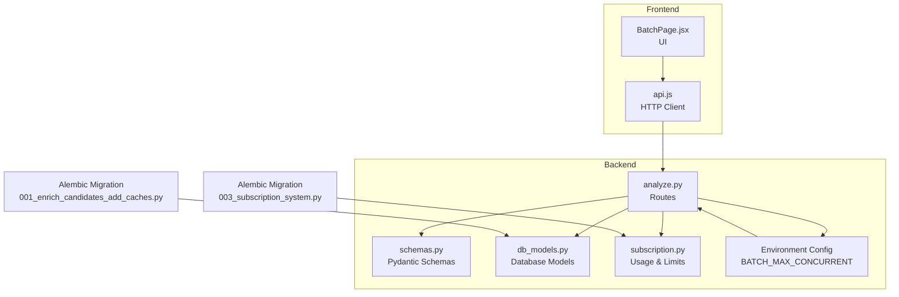
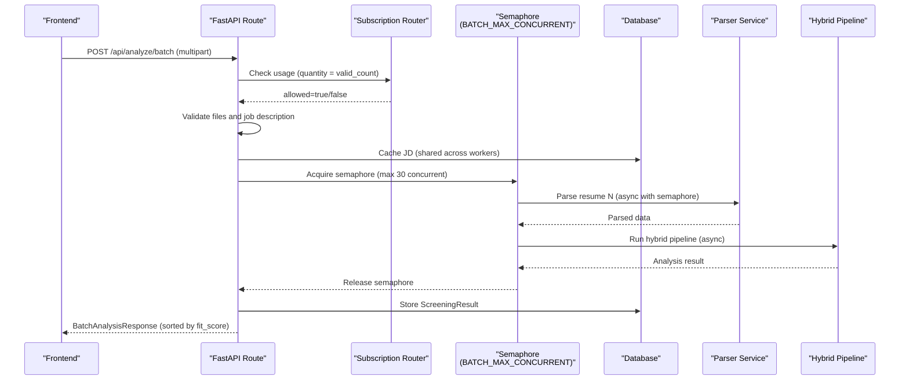
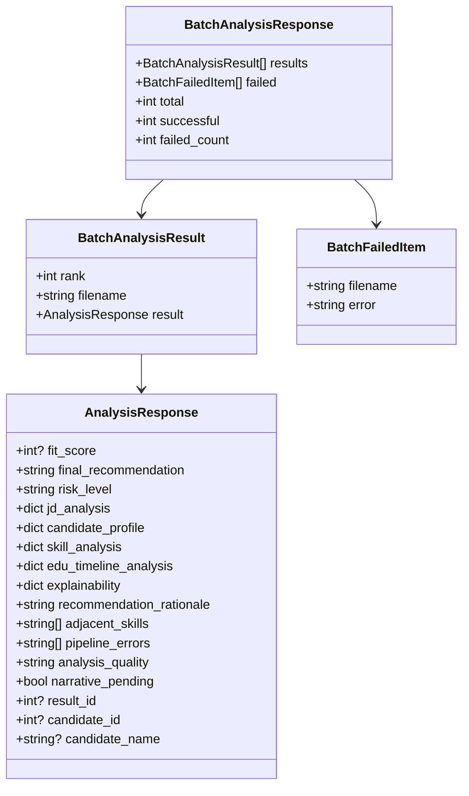

# Batch Analysis

<cite>
**Referenced Files in This Document**
- [analyze.py](file://app/backend/routes/analyze.py)
- [schemas.py](file://app/backend/models/schemas.py)
- [db_models.py](file://app/backend/models/db_models.py)
- [subscription.py](file://app/backend/routes/subscription.py)
- [BatchPage.jsx](file://app/frontend/src/pages/BatchPage.jsx)
- [api.js](file://app/frontend/src/lib/api.js)
- [001_enrich_candidates_add_caches.py](file://alembic/versions/001_enrich_candidates_add_caches.py)
- [003_subscription_system.py](file://alembic/versions/003_subscription_system.py)
</cite>

## Update Summary
**Changes Made**
- Updated batch processing concurrency from 5 to 30 concurrent resumes with new environment variable configuration system
- Enhanced batch size limits with configurable maximum batch size (default 50)
- Improved environment variable configuration for BATCH_MAX_CONCURRENT
- Updated frontend integration to reflect new concurrency limits
- Enhanced error handling and partial success scenarios for large batch operations

## Table of Contents
1. [Introduction](#introduction)
2. [Project Structure](#project-structure)
3. [Core Components](#core-components)
4. [Architecture Overview](#architecture-overview)
5. [Detailed Component Analysis](#detailed-component-analysis)
6. [Dependency Analysis](#dependency-analysis)
7. [Performance Considerations](#performance-considerations)
8. [Troubleshooting Guide](#troubleshooting-guide)
9. [Conclusion](#conclusion)
10. [Appendices](#appendices)

## Introduction
This document describes the POST /api/analyze/batch endpoint for concurrent processing of multiple resumes. It covers:
- Array-based resume uploads with both synchronous and chunked processing modes
- Batch size limits based on subscription plans (default 50, configurable via environment variables)
- Automatic ranking by fit_score
- Request/response schemas for batch processing
- Error handling for individual file failures and partial success scenarios
- Usage counting for batch operations
- JD caching optimization shared across all workers
- Performance considerations for large batches with enhanced concurrency (30 concurrent resumes)
- Examples of batch processing workflows, result ranking algorithms, and integration patterns

**Updated** The batch analysis functionality now supports significantly enhanced concurrency with configurable limits and improved error handling for large-scale operations.

## Project Structure
The batch analysis feature spans backend FastAPI routes, models, schemas, subscription enforcement, and frontend integration.

**Diagram sources**
- [analyze.py](file://app/backend/routes/analyze.py)
- [schemas.py](file://app/backend/models/schemas.py)
- [db_models.py](file://app/backend/models/db_models.py)
- [subscription.py](file://app/backend/routes/subscription.py)
- [BatchPage.jsx](file://app/frontend/src/pages/BatchPage.jsx)
- [api.js](file://app/frontend/src/lib/api.js)
- [001_enrich_candidates_add_caches.py](file://alembic/versions/001_enrich_candidates_add_caches.py)
- [003_subscription_system.py](file://alembic/versions/003_subscription_system.py)

**Section sources**
- [analyze.py](file://app/backend/routes/analyze.py)
- [schemas.py](file://app/backend/models/schemas.py)
- [db_models.py](file://app/backend/models/db_models.py)
- [subscription.py](file://app/backend/routes/subscription.py)
- [BatchPage.jsx](file://app/frontend/src/pages/BatchPage.jsx)
- [api.js](file://app/frontend/src/lib/api.js)
- [001_enrich_candidates_add_caches.py](file://alembic/versions/001_enrich_candidates_add_caches.py)
- [003_subscription_system.py](file://alembic/versions/003_subscription_system.py)

## Core Components
- Route: POST /api/analyze/batch (synchronous) and POST /api/analyze/batch-chunked (chunked upload)
- Request: multipart/form-data with array of resumes, optional job_description or job_file, optional scoring_weights
- Response: BatchAnalysisResponse with results ordered by fit_score descending
- Batch size limit: derived from tenant's plan limits (default 50) with configurable concurrency (default 30)
- Usage counting: increments by number of valid resumes processed
- JD caching: shared DB cache across all workers for the provided job description
- Concurrency control: semaphore-based limiting of concurrent batch operations with environment variable configuration

**Updated** Enhanced concurrency control now supports up to 30 concurrent resume processing with configurable limits via BATCH_MAX_CONCURRENT environment variable.

**Section sources**
- [analyze.py](file://app/backend/routes/analyze.py)
- [schemas.py](file://app/backend/models/schemas.py)
- [db_models.py](file://app/backend/models/db_models.py)
- [subscription.py](file://app/backend/routes/subscription.py)

## Architecture Overview
The batch endpoint orchestrates concurrent resume parsing and analysis, enforces usage limits, and persists results. Both synchronous and chunked processing modes are supported with enhanced concurrency controls.

**Diagram sources**
- [analyze.py](file://app/backend/routes/analyze.py)
- [subscription.py](file://app/backend/routes/subscription.py)
- [db_models.py](file://app/backend/models/db_models.py)

## Detailed Component Analysis

### Endpoint Definition and Behavior
- Path: POST /api/analyze/batch (synchronous) and POST /api/analyze/batch-chunked (chunked)
- Request form fields:
  - resumes: array of UploadFile (PDF, DOCX, DOC) - synchronous mode
  - upload_ids: array of assembly IDs - chunked mode
  - filenames: array of original filenames - chunked mode
  - job_description: string (optional if job_file provided)
  - job_file: UploadFile (optional if job_description provided)
  - scoring_weights: stringified JSON object (optional)
- Response: BatchAnalysisResponse with:
  - results: array of BatchAnalysisResult sorted by fit_score descending
  - total: integer count of processed results
  - failed: array of failed items with error details
  - successful: count of successful analyses
  - failed_count: count of failed analyses

Processing steps for synchronous batch:
1. Validate presence of resumes and allowed extensions
2. Determine max batch size from plan limits (default 50)
3. Check usage allowance for quantity equal to valid resume count
4. Resolve job description from text or file
5. Validate JD length
6. Pre-parse and cache JD once for all resumes
7. Read and validate each resume file
8. Concurrently process resumes via asyncio.gather with semaphore control (max 30 concurrent)
9. For each result:
   - Extract file hash
   - Deduplicate/create candidate
   - Persist ScreeningResult
10. Sort results by fit_score descending
11. Return BatchAnalysisResponse

**Updated** Enhanced concurrency control now uses a semaphore with configurable maximum (default 30) instead of fixed limits, allowing for better resource utilization and scalability.

**Section sources**
- [analyze.py](file://app/backend/routes/analyze.py)
- [schemas.py](file://app/backend/models/schemas.py)

### Request and Response Schemas
- Request form fields:
  - resumes: list[UploadFile] (synchronous)
  - upload_ids: list[str] (chunked)
  - filenames: list[str] (chunked)
  - job_description: str (optional)
  - job_file: UploadFile (optional)
  - scoring_weights: str (optional)
- Response:
  - results: List[BatchAnalysisResult]
  - total: int
  - failed: List[BatchFailedItem]
  - successful: int
  - failed_count: int

BatchAnalysisResult:
- rank: int
- filename: str
- result: AnalysisResponse

BatchFailedItem:
- filename: str
- error: str

AnalysisResponse includes fit_score, final_recommendation, risk_level, and other fields produced by the hybrid pipeline.

**Section sources**
- [analyze.py](file://app/backend/routes/analyze.py)
- [schemas.py](file://app/backend/models/schemas.py)

### Batch Size Limits and Usage Counting
- Max batch size:
  - Default 50
  - Overridden by tenant.plan.limits.batch_size if present
  - Enforced before processing resumes
- Usage counting:
  - _check_and_increment_usage increments by valid_count
  - Uses tenant.plan.limits.analyses_per_month for monthly cap
  - Records UsageLog entries for each successful analysis
- Frontend integration:
  - BatchPage enforces maxFiles based on subscription limits
  - Displays remaining analyses and usage status
  - Supports both analyzeBatch and analyzeBatchChunked

**Section sources**
- [analyze.py](file://app/backend/routes/analyze.py)
- [subscription.py](file://app/backend/routes/subscription.py)
- [BatchPage.jsx](file://app/frontend/src/pages/BatchPage.jsx)

### JD Caching Optimization
- Shared across all workers via DB:
  - Key: MD5 of first 2000 characters of job description
  - Stored in JdCache table
  - Retrieved or computed once per batch
- Benefits:
  - Avoids repeated parsing of identical or similar JDs
  - Reduces CPU and latency for large batches

**Section sources**
- [analyze.py](file://app/backend/routes/analyze.py)
- [db_models.py](file://app/backend/models/db_models.py)
- [001_enrich_candidates_add_caches.py](file://alembic/versions/001_enrich_candidates_add_caches.py)

### Ranking Algorithm
- Sorting: results are ordered by fit_score descending
- fit_score is computed by the hybrid pipeline scoring module
- The endpoint returns results as-is from the pipeline, then sorts client-side by fit_score

**Section sources**
- [analyze.py](file://app/backend/routes/analyze.py)

### Error Handling and Partial Success
- Validation errors:
  - No resumes provided
  - Invalid file types or oversized files
  - Missing or too-short job description
  - Exceeds batch size limit
  - Usage limit exceeded
- Runtime exceptions during processing:
  - Individual resume failures are tracked separately
  - Other resumes continue processing
  - Failed items are returned with error details
  - Successful results are still processed and ranked
- Usage rollback note:
  - Current behavior increments usage before validation; tests document this limitation

**Section sources**
- [analyze.py](file://app/backend/routes/analyze.py)
- [subscription.py](file://app/backend/routes/subscription.py)
- [BatchPage.jsx](file://app/frontend/src/pages/BatchPage.jsx)

### Environment Variable Configuration System
- BATCH_MAX_CONCURRENT: Controls maximum concurrent batch operations (default: 30)
- Configurable via environment variable for production deployments
- Allows tuning based on available resources and performance requirements
- Provides better control over resource utilization compared to fixed limits

**New** Added environment variable configuration system for batch processing concurrency control.

**Section sources**
- [analyze.py](file://app/backend/routes/analyze.py)

### Frontend Integration Patterns
- BatchPage:
  - Drag-and-drop multiple resumes with maxFiles bound to subscription limits
  - Displays usage banner and remaining counts
  - Supports both synchronous and chunked upload modes
  - Calls analyzeBatch or analyzeBatchChunked and renders ranked results
- API client:
  - analyzeBatch constructs FormData with resumes array and optional job fields
  - analyzeBatchChunked handles chunked uploads for large files
  - Sets Content-Type to multipart/form-data
  - Timeout configured for batch operations (300s for synchronous, 600s for chunked)

**Section sources**
- [BatchPage.jsx](file://app/frontend/src/pages/BatchPage.jsx)
- [api.js](file://app/frontend/src/lib/api.js)

## Dependency Analysis

**Diagram sources**
- [schemas.py](file://app/backend/models/schemas.py)

**Section sources**
- [schemas.py](file://app/backend/models/schemas.py)

## Performance Considerations
- Concurrency:
  - Uses asyncio.gather to process resumes concurrently
  - Semaphore-based control limits concurrent batch operations to configurable limit (default 30)
  - Parsing occurs in thread pool to avoid blocking the event loop
  - Environment variable BATCH_MAX_CONCURRENT allows tuning based on deployment resources
- Memory and throughput:
  - Pre-validate file sizes and types before reading
  - Limit batch size by plan limits to prevent overload
  - Chunked upload bypasses CDN upload limits for large files
- Database contention:
  - JD cache reduces repeated parsing
  - Batch writes commit once at the end
- Frontend UX:
  - Large timeouts configured for batch requests
  - Progressive rendering of results after processing completes
  - Upload progress tracking for chunked operations

**Updated** Enhanced concurrency control with configurable limits (default 30) provides better resource utilization and scalability for large batch operations.

## Troubleshooting Guide
Common issues and resolutions:
- Batch denied due to plan limits:
  - Verify tenant.plan.limits.batch_size and analyses_per_month
  - Use GET /api/subscription/check/batch_analysis to preflight
- Usage limit exceeded:
  - Check remaining analyses and upgrade plan if needed
  - Review UsageLog entries for recent activity
- Invalid file types or oversized files:
  - Ensure PDF, DOCX, or DOC; under 10MB per file
- Missing job description:
  - Provide either job_description or job_file
  - Ensure job description meets minimum word count
- Partial failures:
  - Some resumes may fail while others succeed; check failed array for error details
  - Successful results are still processed and ranked
- JD parsing inconsistencies:
  - Confirm that identical JDs produce the same cache key
- Chunked upload issues:
  - Verify assembly directory permissions
  - Check upload IDs and filename mappings
  - Monitor overall progress for large batches
- Concurrency issues:
  - Adjust BATCH_MAX_CONCURRENT environment variable based on available resources
  - Monitor system resources during large batch operations

**Updated** Added troubleshooting guidance for concurrency-related issues and environment variable configuration.

**Section sources**
- [analyze.py](file://app/backend/routes/analyze.py)
- [subscription.py](file://app/backend/routes/subscription.py)
- [BatchPage.jsx](file://app/frontend/src/pages/BatchPage.jsx)

## Conclusion
The POST /api/analyze/batch endpoint enables efficient, scalable bulk resume screening with plan-aware limits, shared JD caching, and automatic ranking. Enhanced concurrency control (default 30 concurrent operations) with environment variable configuration provides better resource utilization and scalability for high-volume workflows. By leveraging concurrency and robust error handling, it supports large-scale batch processing while maintaining usage compliance and performance. Both synchronous and chunked upload modes provide flexibility for different use cases and file sizes.

## Appendices

### API Reference: POST /api/analyze/batch
- Method: POST
- Path: /api/analyze/batch
- Content-Type: multipart/form-data
- Form Fields:
  - resumes: array of files (PDF, DOCX, DOC)
  - job_description: string (optional if job_file provided)
  - job_file: file (optional if job_description provided)
  - scoring_weights: stringified JSON object (optional)
- Response:
  - BatchAnalysisResponse with results sorted by fit_score descending

### API Reference: POST /api/analyze/batch-chunked
- Method: POST
- Path: /api/analyze/batch-chunked
- Content-Type: multipart/form-data
- Form Fields:
  - upload_ids: array of assembly IDs
  - filenames: array of original filenames
  - job_description: string (optional if job_file provided)
  - job_file: file (optional if job_description provided)
  - scoring_weights: stringified JSON object (optional)
- Response:
  - BatchAnalysisResponse with results sorted by fit_score descending

### Environment Variables
- BATCH_MAX_CONCURRENT: Maximum number of concurrent batch operations (default: 30)
- Configurable via environment variable for production deployments
- Allows tuning based on available CPU, memory, and LLM resources

**New** Added environment variable configuration for batch processing.

**Section sources**
- [analyze.py](file://app/backend/routes/analyze.py)
- [schemas.py](file://app/backend/models/schemas.py)

### Example Workflows
- Bulk screening:
  - Upload 10–50 resumes against a single job description
  - Receive ranked shortlist with fit_score and recommendations
- Template reuse:
  - Save job descriptions as templates and reuse across batches
- Export:
  - Export CSV or Excel of selected candidates for downstream actions
- Large file processing:
  - Use chunked upload mode for files larger than CDN limits
- Mixed file sizes:
  - Combine small and large files in single batch operation
- High-volume processing:
  - Configure BATCH_MAX_CONCURRENT based on available resources for optimal throughput

**Updated** Added guidance for high-volume processing with environment variable configuration.

**Section sources**
- [BatchPage.jsx](file://app/frontend/src/pages/BatchPage.jsx)
- [api.js](file://app/frontend/src/lib/api.js)