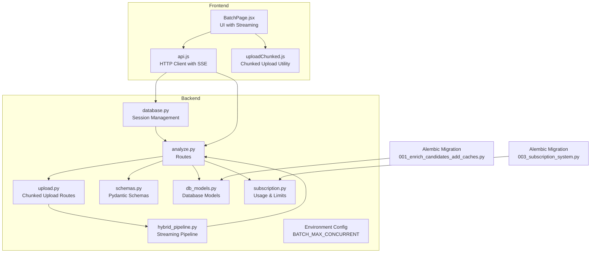
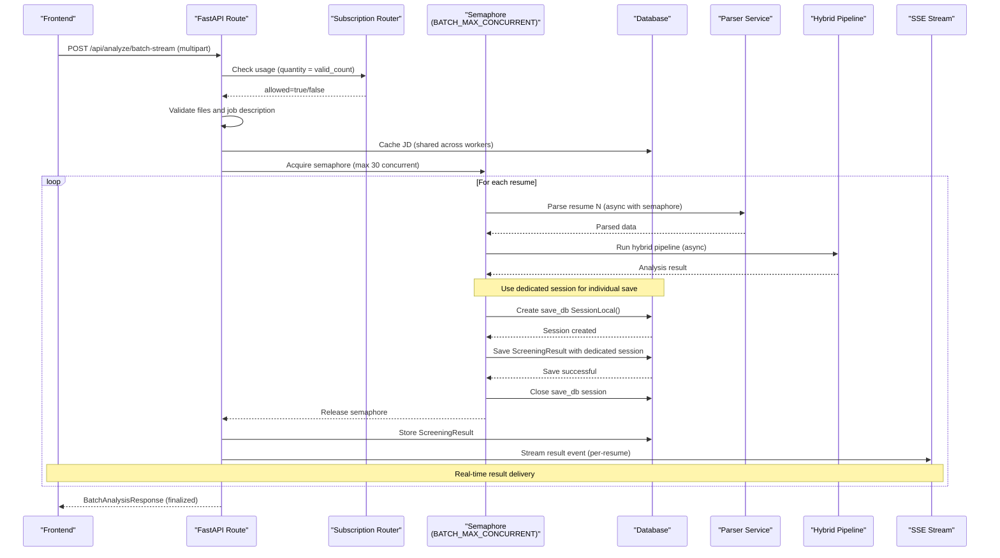
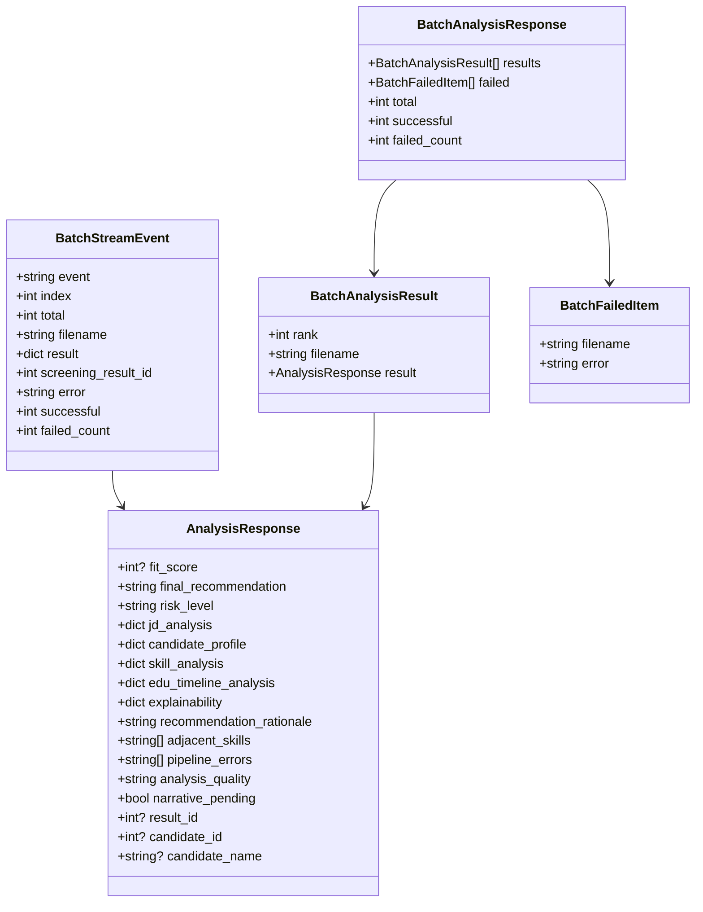

# Batch Analysis

<cite>
**Referenced Files in This Document**
- [analyze.py](file://app/backend/routes/analyze.py)
- [hybrid_pipeline.py](file://app/backend/services/hybrid_pipeline.py)
- [upload.py](file://app/backend/routes/upload.py)
- [schemas.py](file://app/backend/models/schemas.py)
- [db_models.py](file://app/backend/models/db_models.py)
- [subscription.py](file://app/backend/routes/subscription.py)
- [database.py](file://app/backend/db/database.py)
- [BatchPage.jsx](file://app/frontend/src/pages/BatchPage.jsx)
- [api.js](file://app/frontend/src/lib/api.js)
- [uploadChunked.js](file://app/frontend/src/lib/uploadChunked.js)
- [001_enrich_candidates_add_caches.py](file://alembic/versions/001_enrich_candidates_add_caches.py)
- [003_subscription_system.py](file://alembic/versions/003_subscription_system.py)
</cite>

## Update Summary
**Changes Made**
- Refactored batch analysis endpoint to use dedicated database sessions for individual resume saves
- Improved error handling with separate session management for each resume processing
- Enhanced tenant isolation during batch processing operations with explicit tenant_id extraction
- Added robust session cleanup mechanisms with try/finally blocks
- Implemented per-resume database persistence to prevent detached object issues

## Table of Contents
1. [Introduction](#introduction)
2. [Project Structure](#project-structure)
3. [Core Components](#core-components)
4. [Architecture Overview](#architecture-overview)
5. [Detailed Component Analysis](#detailed-component-analysis)
6. [Dependency Analysis](#dependency-analysis)
7. [Performance Considerations](#performance-considerations)
8. [Troubleshooting Guide](#troubleshooting-guide)
9. [Conclusion](#conclusion)
10. [Appendices](#appendices)

## Introduction
This document describes the POST /api/analyze/batch and POST /api/analyze/batch-stream endpoints for concurrent processing of multiple resumes with real-time progressive streaming capabilities. It covers:
- Array-based resume uploads with both synchronous and streaming batch modes
- Real-time result streaming using Server-Sent Events (SSE) for immediate feedback
- Live progress tracking with dynamic result tables and ranking updates
- Batch size limits based on subscription plans (default 50, configurable via environment variables)
- Automatic ranking by fit_score with live updates during processing
- Request/response schemas for streaming batch processing
- Error handling for individual file failures with real-time notifications
- Usage counting for batch operations with streaming progress
- JD caching optimization shared across all workers
- Performance considerations for large batches with enhanced concurrency (30 concurrent resumes)
- Examples of streaming batch processing workflows, result ranking algorithms, and integration patterns

**Updated** The batch analysis functionality now includes progressive streaming capabilities with real-time result delivery, live progress tracking, and dynamic result tables that update as resumes complete processing. The implementation has been refactored to use dedicated database sessions for individual resume saves, improving error handling and tenant isolation during batch operations.

## Project Structure
The batch analysis feature spans backend FastAPI routes, streaming services, models, schemas, subscription enforcement, chunked upload system, and enhanced frontend integration with real-time capabilities.

**Diagram sources**
- [analyze.py](file://app/backend/routes/analyze.py)
- [hybrid_pipeline.py](file://app/backend/services/hybrid_pipeline.py)
- [upload.py](file://app/backend/routes/upload.py)
- [schemas.py](file://app/backend/models/schemas.py)
- [db_models.py](file://app/backend/models/db_models.py)
- [subscription.py](file://app/backend/routes/subscription.py)
- [database.py](file://app/backend/db/database.py)
- [BatchPage.jsx](file://app/frontend/src/pages/BatchPage.jsx)
- [api.js](file://app/frontend/src/lib/api.js)
- [uploadChunked.js](file://app/frontend/src/lib/uploadChunked.js)
- [001_enrich_candidates_add_caches.py](file://alembic/versions/001_enrich_candidates_add_caches.py)
- [003_subscription_system.py](file://alembic/versions/003_subscription_system.py)

**Section sources**
- [analyze.py](file://app/backend/routes/analyze.py)
- [hybrid_pipeline.py](file://app/backend/services/hybrid_pipeline.py)
- [upload.py](file://app/backend/routes/upload.py)
- [schemas.py](file://app/backend/models/schemas.py)
- [db_models.py](file://app/backend/models/db_models.py)
- [subscription.py](file://app/backend/routes/subscription.py)
- [database.py](file://app/backend/db/database.py)
- [BatchPage.jsx](file://app/frontend/src/pages/BatchPage.jsx)
- [api.js](file://app/frontend/src/lib/api.js)
- [uploadChunked.js](file://app/frontend/src/lib/uploadChunked.js)
- [001_enrich_candidates_add_caches.py](file://alembic/versions/001_enrich_candidates_add_caches.py)
- [003_subscription_system.py](file://alembic/versions/003_subscription_system.py)

## Core Components
- Route: POST /api/analyze/batch (synchronous) and POST /api/analyze/batch-stream (streaming)
- Request: multipart/form-data with array of resumes (synchronous) or upload_ids (streaming), optional job_description or job_file, optional scoring_weights
- Response: Real-time streaming events with BatchStreamEvent payloads for streaming mode
- Batch size limit: derived from tenant's plan limits (default 50) with configurable concurrency (default 30)
- Usage counting: increments by number of valid resumes processed
- JD caching: shared DB cache across all workers for the provided job description
- Concurrency control: semaphore-based limiting of concurrent batch operations with environment variable configuration
- Chunked upload integration: seamless processing of files uploaded via chunked upload system
- Streaming capabilities: real-time result delivery with per-resume completion notifications
- Live progress tracking: dynamic progress bars and result tables that update during processing
- Dynamic ranking: results are continuously re-ranked as new candidates complete processing
- **Enhanced Database Session Management**: Dedicated sessions for individual resume saves to prevent detached object issues
- **Improved Error Handling**: Separate session management for each resume with proper cleanup mechanisms
- **Enhanced Tenant Isolation**: Explicit tenant_id extraction and consistent usage across individual save operations

**Updated** The batch processing now includes progressive streaming capabilities with real-time result delivery, live progress tracking, and dynamic result tables that update as resumes complete processing. The implementation has been refactored to use dedicated database sessions for individual resume saves, improving error handling and tenant isolation during batch operations.

**Section sources**
- [analyze.py](file://app/backend/routes/analyze.py)
- [hybrid_pipeline.py](file://app/backend/services/hybrid_pipeline.py)
- [upload.py](file://app/backend/routes/upload.py)
- [schemas.py](file://app/backend/models/schemas.py)
- [db_models.py](file://app/backend/models/db_models.py)
- [subscription.py](file://app/backend/routes/subscription.py)
- [database.py](file://app/backend/db/database.py)

## Architecture Overview
The batch endpoint orchestrates concurrent resume parsing and analysis with real-time streaming, enforces usage limits, and persists results. Both synchronous and streaming processing modes are supported with standard concurrency controls and real-time event delivery. The implementation now uses dedicated database sessions for individual resume saves to prevent detached object issues and improve error handling.

**Diagram sources**
- [analyze.py](file://app/backend/routes/analyze.py)
- [hybrid_pipeline.py](file://app/backend/services/hybrid_pipeline.py)
- [upload.py](file://app/backend/routes/upload.py)
- [subscription.py](file://app/backend/routes/subscription.py)
- [db_models.py](file://app/backend/models/db_models.py)
- [database.py](file://app/backend/db/database.py)

## Detailed Component Analysis

### Endpoint Definition and Behavior
- Path: POST /api/analyze/batch (synchronous) and POST /api/analyze/batch-stream (streaming)
- Request form fields:
  - **Synchronous mode**: resumes: array of UploadFile (PDF, DOCX, DOC)
  - **Streaming mode**: upload_ids: array of assembly IDs, filenames: array of original filenames
  - job_description: string (optional if job_file provided)
  - job_file: UploadFile (optional if job_description provided)
  - scoring_weights: stringified JSON object (optional)
- Response: Real-time streaming events for streaming mode, BatchAnalysisResponse for synchronous mode

**Synchronous batch processing**:
1. Validate presence of resumes and allowed extensions
2. Determine max batch size from plan limits (default 50)
3. Check usage allowance for quantity equal to valid resume count
4. Resolve job description from text or file
5. Validate JD length
6. Pre-parse and cache JD once for all resumes
7. Read and validate each resume file
8. Concurrently process resumes via asyncio.gather with semaphore control (max 30 concurrent)
9. For each result:
   - Extract file hash
   - Deduplicate/create candidate
   - Persist ScreeningResult
10. Sort results by fit_score descending
11. Return BatchAnalysisResponse

**Streaming batch processing**:
1. Validate upload_ids array and filenames array lengths
2. Verify upload_ids and filenames arrays have equal length
3. Check maximum batch size constraint (default 50)
4. Read and validate JD file if provided (before usage check)
5. Resolve and validate job description (before usage check)
6. Locate assembled files for each upload_id in chunk storage directory
7. Validate file existence, read content, and check size/extension constraints
8. Pre-flight file content validation with magic-byte signatures
9. Determine max batch size from plan limits (default 50)
10. Check usage allowance for quantity equal to valid resume count
11. Validate scoring_weights size
12. Pre-parse JD once for all resumes
13. Process all resumes concurrently with streaming events
14. Stream per-resume results as they complete
15. Stream completion summary with total counts
16. Sort results by fit_score descending
17. Return BatchAnalysisResponse

**Enhanced Database Session Management**:
- **Individual Resume Saves**: Each resume processing uses a dedicated `save_db = SessionLocal()` session to avoid detached object issues
- **Separate Session Management**: Individual resume saves use separate database sessions from the main route session
- **Proper Cleanup**: Each dedicated session is properly closed using try/finally blocks
- **Tenant Isolation**: Tenant ID is extracted while the main session is still active and used consistently for each individual save operation
- **Error Recovery**: Individual database errors are isolated to specific resumes without affecting other concurrent operations

**Updated** The streaming batch processing now includes real-time result delivery with per-resume completion notifications, live progress tracking, and dynamic result tables that update during processing. The implementation has been refactored to use dedicated database sessions for individual resume saves, improving error handling and tenant isolation during batch operations.

**Section sources**
- [analyze.py](file://app/backend/routes/analyze.py)
- [hybrid_pipeline.py](file://app/backend/services/hybrid_pipeline.py)
- [upload.py](file://app/backend/routes/upload.py)
- [schemas.py](file://app/backend/models/schemas.py)
- [database.py](file://app/backend/db/database.py)

### Request and Response Schemas
- **Synchronous mode**:
  - Request form fields: resumes (list[UploadFile]), job_description (str), job_file (UploadFile), scoring_weights (str)
  - Response: BatchAnalysisResponse with results sorted by fit_score descending
- **Streaming mode**:
  - Request form fields: upload_ids (list[str]), filenames (list[str]), job_description (str), job_file (UploadFile), scoring_weights (str)
  - Response: Real-time streaming events with BatchStreamEvent payloads

BatchStreamEvent:
- event: "result" | "failed" | "done"
- index: int (1-based position in batch)
- total: int (total resumes in batch)
- filename: str (optional)
- result: dict (analysis result for successful processing)
- screening_result_id: int (optional)
- error: str (error message for failed processing)
- successful: int (count for final summary)
- failed_count: int (count for final summary)

BatchAnalysisResult:
- rank: int
- filename: str
- result: AnalysisResponse

BatchFailedItem:
- filename: str
- error: str

AnalysisResponse includes fit_score, final_recommendation, risk_level, and other fields produced by the hybrid pipeline.

**Section sources**
- [analyze.py](file://app/backend/routes/analyze.py)
- [hybrid_pipeline.py](file://app/backend/services/hybrid_pipeline.py)
- [schemas.py](file://app/backend/models/schemas.py)

### Batch Size Limits and Usage Counting
- Max batch size:
  - Default 50
  - Overridden by tenant.plan.limits.batch_size if present
  - Enforced before processing resumes
- Usage counting:
  - _check_and_increment_usage increments by valid_count
  - Uses tenant.plan.limits.analyses_per_month for monthly cap
  - Records UsageLog entries for each successful analysis
- Frontend integration:
  - BatchPage enforces maxFiles based on subscription limits
  - Displays remaining analyses and usage status
  - Supports both analyzeBatch and analyzeBatchStream
  - Shows live progress during streaming analysis

**Section sources**
- [analyze.py](file://app/backend/routes/analyze.py)
- [subscription.py](file://app/backend/routes/subscription.py)
- [BatchPage.jsx](file://app/frontend/src/pages/BatchPage.jsx)

### JD Caching Optimization
- Shared across all workers via DB:
  - Key: MD5 of first 2000 characters of job description
  - Stored in JdCache table
  - Retrieved or computed once per batch
- Benefits:
  - Avoids repeated parsing of identical or similar JDs
  - Reduces CPU and latency for large batches

**Section sources**
- [analyze.py](file://app/backend/routes/analyze.py)
- [db_models.py](file://app/backend/models/db_models.py)
- [001_enrich_candidates_add_caches.py](file://alembic/versions/001_enrich_candidates_add_caches.py)

### Ranking Algorithm
- Sorting: results are ordered by fit_score descending
- fit_score is computed by the hybrid pipeline scoring module
- The endpoint returns results as-is from the pipeline, then sorts client-side by fit_score
- **Streaming enhancement**: Results are continuously re-ranked as new candidates complete processing

**Section sources**
- [analyze.py](file://app/backend/routes/analyze.py)
- [hybrid_pipeline.py](file://app/backend/services/hybrid_pipeline.py)

### Error Handling and Partial Success
- **Validation errors**:
  - No resumes provided (synchronous) or no upload_ids provided (streaming)
  - Invalid file types or oversized files
  - Missing or too-short job description
  - Exceeds batch size limit
  - Usage limit exceeded
  - Mismatched upload_ids and filenames arrays (streaming)
  - Upload not found or expired (streaming)
  - Failed to read assembled file (streaming)
- **Runtime exceptions during processing**:
  - Individual resume failures are tracked separately
  - Other resumes continue processing
  - Failed items are streamed with error details
  - Successful results are streamed as they complete
  - Usage rollback note:
  - Current behavior increments usage before validation; tests document this limitation
- **Streaming error handling**:
  - Real-time error notifications for failed resumes
  - Continues processing remaining resumes
  - Final summary includes total counts and completion status
- **Enhanced Database Error Handling**:
  - Individual database errors are isolated to specific resumes
  - Dedicated sessions prevent cascading failures across concurrent operations
  - Proper session cleanup ensures resources are released even on errors

**Updated** Error handling now includes real-time error notifications for streaming mode, allowing users to see individual failures as they occur. The implementation now uses dedicated database sessions for individual resume saves, improving error isolation and recovery.

**Section sources**
- [analyze.py](file://app/backend/routes/analyze.py)
- [subscription.py](file://app/backend/routes/subscription.py)
- [BatchPage.jsx](file://app/frontend/src/pages/BatchPage.jsx)
- [database.py](file://app/backend/db/database.py)

### Environment Variable Configuration System
- BATCH_MAX_CONCURRENT: Controls maximum concurrent batch operations (default: 30)
- Configurable via environment variable for production deployments
- Allows tuning based on available resources and performance requirements
- Provides better control over resource utilization compared to fixed limits

**New** Added environment variable configuration system for batch processing concurrency control.

**Section sources**
- [analyze.py](file://app/backend/routes/analyze.py)

### Frontend Integration Patterns
- **Enhanced BatchPage**:
  - Drag-and-drop multiple resumes with maxFiles bound to subscription limits
  - Displays usage banner and remaining counts
  - Supports both synchronous and streaming upload modes
  - Calls analyzeBatch or analyzeBatchStream and renders dynamic ranked results
  - Shows upload progress for chunked operations
  - **Live progress tracking**: Real-time progress bars and completion indicators
  - **Dynamic result tables**: Tables that update as resumes complete processing
  - **Real-time ranking**: Results continuously re-ranked as new candidates complete
- **Enhanced API client**:
  - analyzeBatch constructs FormData with resumes array and optional job fields
  - analyzeBatchStream handles streaming SSE events for real-time feedback
  - Sets Content-Type to multipart/form-data
  - Timeout configured for batch operations (300s for synchronous, 600s for streaming)
  - **SSE event parsing**: Handles result, failed, and done streaming events
- **Chunked upload utility**:
  - uploadMultipleFiles manages multiple file uploads with progress tracking
  - Provides real-time progress updates per file and overall progress
  - Handles network failures gracefully with retry logic

**Section sources**
- [BatchPage.jsx](file://app/frontend/src/pages/BatchPage.jsx)
- [api.js](file://app/frontend/src/lib/api.js)
- [uploadChunked.js](file://app/frontend/src/lib/uploadChunked.js)

### Security Considerations for Chunked Upload Processing
- **Directory traversal prevention**:
  - Sanitizes upload_id and filename to prevent directory traversal attacks
  - Removes dangerous characters (.., /, \) from upload_id and filename
- **File validation**:
  - Validates file size (max 10MB per file)
  - Validates file extensions (PDF, DOCX, DOC)
  - Checks for file existence in assembled directory
- **Pre-flight validation**:
  - Magic-byte signature validation for file content verification
  - Enhanced security checks for uploaded files
- **Cleanup mechanism**:
  - Automatically cleans up assembled files after successful processing
  - Handles cleanup failures gracefully with logging
- **Rate limiting and quotas**:
  - Enforces batch size limits based on subscription plans
  - Prevents abuse through usage tracking and limits

**Updated** Security measures now include enhanced pre-flight validation with magic-byte signatures for file content verification.

**Section sources**
- [analyze.py](file://app/backend/routes/analyze.py)
- [upload.py](file://app/backend/routes/upload.py)

### Streaming Architecture and Event Flow
- **Event types**:
  - "result": Per-resume successful analysis with screening_result_id
  - "failed": Per-resume failure with error details
  - "done": Final summary with total counts
- **Event structure**:
  - index: 1-based position in batch
  - total: total resumes in batch
  - filename: original filename (for result events)
  - result: analysis result payload (for result events)
  - error: error message (for failed events)
  - successful: count of successful analyses (for done events)
  - failed_count: count of failed analyses (for done events)
- **Real-time processing**:
  - Results streamed as soon as they complete
  - Dynamic result tables update with new rankings
  - Live progress bars show completion percentage
  - Continuous re-ranking based on fit_score
- **Enhanced Database Session Management**:
  - Individual resume saves use dedicated sessions to prevent detached object issues
  - Sessions are properly cleaned up even on errors
  - Tenant isolation is maintained across individual save operations

**New** Added streaming architecture documentation covering event types, flow, and real-time processing capabilities. The implementation now includes enhanced database session management for improved reliability.

**Section sources**
- [analyze.py](file://app/backend/routes/analyze.py)
- [hybrid_pipeline.py](file://app/backend/services/hybrid_pipeline.py)
- [BatchPage.jsx](file://app/frontend/src/pages/BatchPage.jsx)
- [database.py](file://app/backend/db/database.py)

## Dependency Analysis

**Diagram sources**
- [schemas.py](file://app/backend/models/schemas.py)

**Section sources**
- [schemas.py](file://app/backend/models/schemas.py)

## Performance Considerations
- **Concurrency**:
  - Uses asyncio.gather to process resumes concurrently
  - Semaphore-based control limits concurrent batch operations to configurable limit (default 30)
  - Parsing occurs in thread pool to avoid blocking the event loop
  - Environment variable BATCH_MAX_CONCURRENT allows tuning based on deployment resources
- **Memory and throughput**:
  - Pre-validate file sizes and types before reading
  - Limit batch size by plan limits to prevent overload
  - Chunked upload bypasses CDN upload limits for large files
  - **Streaming optimization**: Real-time result delivery reduces perceived latency
  - **Enhanced Database Performance**: Dedicated sessions reduce contention and improve reliability
- **Database contention**:
  - JD cache reduces repeated parsing
  - Batch writes commit once at the end
  - **Streaming persistence**: Results persisted immediately for streaming mode with proper session management
- **Frontend UX**:
  - Large timeouts configured for batch requests
  - **Real-time progressive rendering**: Results displayed as they become available
  - Upload progress tracking for chunked operations
  - **Live progress updates**: Real-time progress bars and completion indicators
  - **Dynamic result tables**: Tables that update continuously during processing
- **Error Recovery**:
  - Individual database errors don't affect other concurrent operations
  - Proper session cleanup prevents resource leaks
  - Tenant isolation prevents cross-tenant data contamination

**Updated** Performance considerations now include streaming optimizations and real-time progressive rendering capabilities. The enhanced database session management improves reliability and reduces contention.

## Troubleshooting Guide
Common issues and resolutions:
- **Batch denied due to plan limits**:
  - Verify tenant.plan.limits.batch_size and analyses_per_month
  - Use GET /api/subscription/check/batch_analysis to preflight
- **Usage limit exceeded**:
  - Check remaining analyses and upgrade plan if needed
  - Review UsageLog entries for recent activity
- **Invalid file types or oversized files**:
  - Ensure PDF, DOCX, or DOC; under 10MB per file
  - Check file extensions and sizes before upload
- **Missing job description**:
  - Provide either job_description or job_file
  - Ensure job description meets minimum word count
- **Partial failures**:
  - Some resumes may fail while others succeed; check failed array for error details
  - Successful results are streamed as they complete and ranked dynamically
- **JD parsing inconsistencies**:
  - Confirm that identical JDs produce the same cache key
- **Chunked upload issues**:
  - Verify assembly directory permissions
  - Check upload IDs and filename mappings
  - Monitor overall progress for large batches
  - Ensure chunked upload completion before batch processing
- **Concurrency issues**:
  - Adjust BATCH_MAX_CONCURRENT environment variable based on available resources
  - Monitor system resources during large batch operations
- **Security validation failures**:
  - Check for directory traversal attempts in upload IDs
  - Verify file existence in assembled directory
  - Ensure proper cleanup of temporary files
- **Streaming connection issues**:
  - **Network interruptions**: SSE connections automatically reconnect
  - **Client disconnection**: Results are saved immediately for streaming mode
  - **Timeout handling**: Streaming responses include heartbeat pings to keep connections alive
- **Database session issues**:
  - **Detached object errors**: Now prevented by dedicated session usage
  - **Resource leaks**: Proper session cleanup with try/finally blocks
  - **Tenant isolation failures**: Tenant ID extracted while main session is active
- **Real-time UI issues**:
  - **Result ordering**: Results are continuously re-ranked as new candidates complete
  - **Progress tracking**: Live progress bars update in real-time
  - **Error display**: Failed resumes are shown with error messages

**Updated** Troubleshooting guidance now includes streaming-specific issues, database session management problems, and tenant isolation concerns. The enhanced error handling and session management address many previously problematic scenarios.

**Section sources**
- [analyze.py](file://app/backend/routes/analyze.py)
- [subscription.py](file://app/backend/routes/subscription.py)
- [BatchPage.jsx](file://app/frontend/src/pages/BatchPage.jsx)
- [database.py](file://app/backend/db/database.py)

## Conclusion
The POST /api/analyze/batch and POST /api/analyze/batch-stream endpoints enable efficient, scalable bulk resume screening with plan-aware limits, shared JD caching, and automatic ranking. Enhanced concurrency control (default 30 concurrent operations) with environment variable configuration provides better resource utilization and scalability for high-volume workflows. The streaming batch mode adds real-time progressive capabilities with Server-Sent Events (SSE), delivering results as they become available, live progress tracking, and dynamic result tables that continuously update during processing. The chunked upload mode addresses Cloudflare's 100MB upload limit while maintaining security through standard validation and cleanup mechanisms. 

**Critical Improvements**: The implementation has been refactored to use dedicated database sessions for individual resume saves, significantly improving error handling and tenant isolation during batch operations. This prevents detached object issues, ensures proper resource cleanup, and maintains tenant data separation even when individual resume processing fails. The enhanced session management provides better reliability and prevents cascading failures across concurrent operations.

The enhanced implementation preserves core batch processing capabilities while adding powerful streaming features for improved user experience and real-time feedback. By leveraging concurrency, streaming architecture, standard error handling, enhanced database session management, and security-conscious processing, it supports large-scale batch processing while maintaining usage compliance, performance, and security. Both synchronous and streaming upload modes provide flexibility for different use cases and file sizes, with the streaming mode offering superior user experience through real-time feedback and continuous result updates.

## Appendices

### API Reference: POST /api/analyze/batch
- Method: POST
- Path: /api/analyze/batch
- Content-Type: multipart/form-data
- Form Fields:
  - resumes: array of files (PDF, DOCX, DOC)
  - job_description: string (optional if job_file provided)
  - job_file: file (optional if job_description provided)
  - scoring_weights: stringified JSON object (optional)
- Response:
  - BatchAnalysisResponse with results sorted by fit_score descending

### API Reference: POST /api/analyze/batch-stream
- Method: POST
- Path: /api/analyze/batch-stream
- Content-Type: multipart/form-data
- Form Fields:
  - upload_ids: array of assembly IDs from chunked upload system
  - filenames: array of original filenames (same order as upload_ids)
  - job_description: string (optional if job_file provided)
  - job_file: file (optional if job_description provided)
  - scoring_weights: stringified JSON object (optional)
- Response:
  - Real-time streaming events with BatchStreamEvent payloads
  - Event types: "result", "failed", "done"
  - Live progress tracking and dynamic result ranking

### Streaming Event Payloads
- **Result Event**:
  - event: "result"
  - index: 1-based position in batch
  - total: total resumes in batch
  - filename: original filename
  - result: analysis result payload
  - screening_result_id: unique identifier for the analysis
- **Failed Event**:
  - event: "failed"
  - index: position in batch where failure occurred
  - total: total resumes in batch
  - filename: original filename (if available)
  - error: error message describing the failure
- **Done Event**:
  - event: "done"
  - index: 0 (summary event)
  - total: total resumes in batch
  - successful: count of successful analyses
  - failed_count: count of failed analyses

### Environment Variables
- BATCH_MAX_CONCURRENT: Maximum number of concurrent batch operations (default: 30)
- Configurable via environment variable for production deployments
- Allows tuning based on available CPU, memory, and LLM resources

**New** Added environment variable configuration for batch processing.

**Section sources**
- [analyze.py](file://app/backend/routes/analyze.py)
- [hybrid_pipeline.py](file://app/backend/services/hybrid_pipeline.py)
- [schemas.py](file://app/backend/models/schemas.py)

### Example Workflows
- **Bulk screening with real-time feedback**:
  - Upload 10–50 resumes against a single job description
  - Receive ranked shortlist with fit_score and recommendations
  - **Live progress**: See results appear as they complete processing
  - **Dynamic ranking**: Results continuously re-ranked during processing
- **Template reuse**:
  - Save job descriptions as templates and reuse across batches
- **Export**:
  - Export CSV or Excel of selected candidates for downstream actions
- **Large file processing**:
  - Use chunked upload mode for files larger than CDN limits
  - Automatically bypasses Cloudflare's 100MB upload limit
- **Mixed file sizes**:
  - Combine small and large files in single batch operation
  - Streaming mode handles large files while synchronous mode handles small files
- **High-volume processing**:
  - Configure BATCH_MAX_CONCURRENT based on available resources for optimal throughput
  - Monitor progress and adjust concurrency based on system performance
  - **Real-time monitoring**: Track progress and results as they become available
- **Security-conscious processing**:
  - Use chunked mode for sensitive large files requiring validation
  - Automatic cleanup ensures no temporary files remain after processing
  - **Enhanced validation**: Magic-byte signature validation for file content verification
- **Streaming user experience**:
  - **Live progress bars**: Real-time completion percentage and estimated time
  - **Dynamic result tables**: Tables that update continuously during processing
  - **Immediate feedback**: Results displayed as soon as they complete
  - **Continuous ranking**: Results re-ranked as new candidates finish
- **Enhanced reliability**:
  - **Database session isolation**: Individual resume saves use dedicated sessions
  - **Error containment**: Failures don't cascade to other concurrent operations
  - **Tenant data protection**: Proper isolation prevents cross-tenant data access

**Updated** Example workflows now include streaming-specific features, real-time user experience enhancements, and the benefits of enhanced database session management and error handling.

**Section sources**
- [BatchPage.jsx](file://app/frontend/src/pages/BatchPage.jsx)
- [api.js](file://app/frontend/src/lib/api.js)
- [uploadChunked.js](file://app/frontend/src/lib/uploadChunked.js)
- [database.py](file://app/backend/db/database.py)