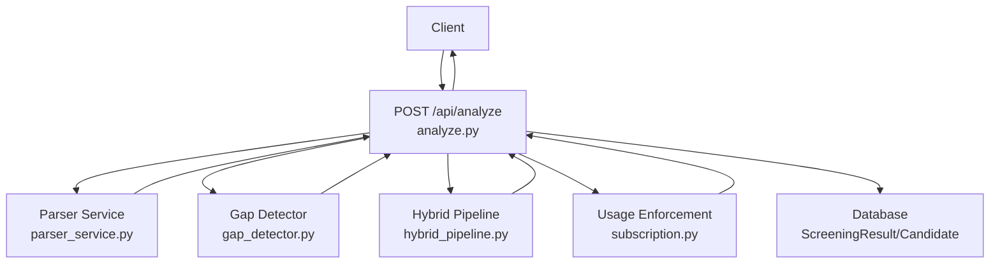
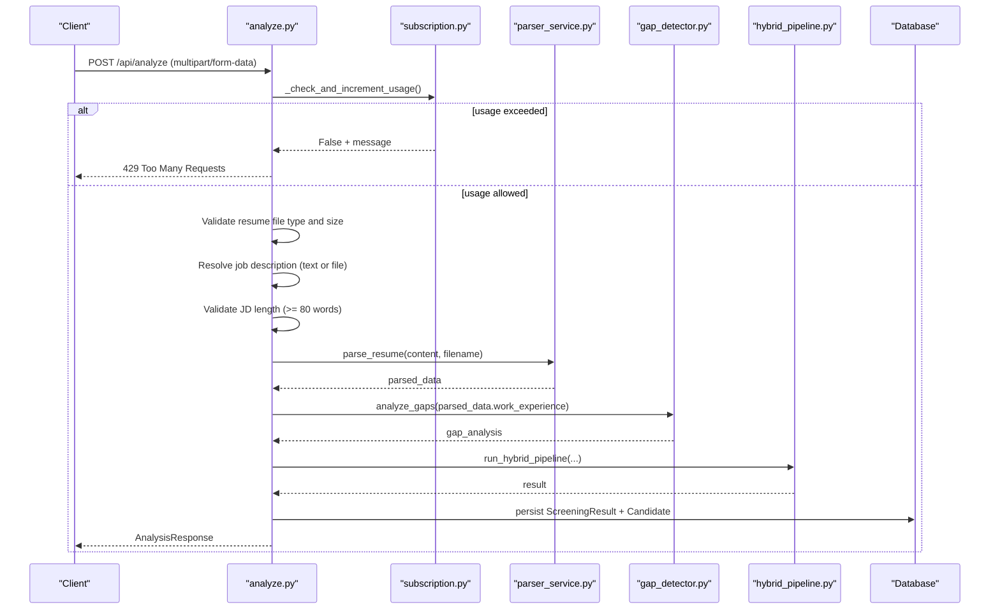
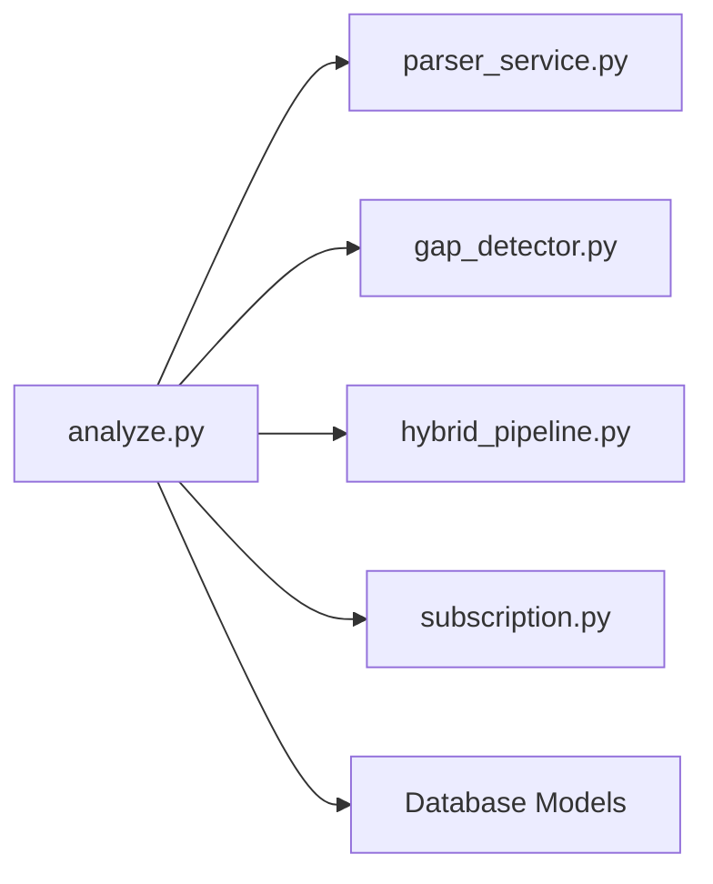

# Single Resume Analysis

<cite>
**Referenced Files in This Document**
- [analyze.py](file://app/backend/routes/analyze.py)
- [schemas.py](file://app/backend/models/schemas.py)
- [subscription.py](file://app/backend/routes/subscription.py)
- [parser_service.py](file://app/backend/services/parser_service.py)
- [gap_detector.py](file://app/backend/services/gap_detector.py)
- [hybrid_pipeline.py](file://app/backend/services/hybrid_pipeline.py)
- [test_usage_enforcement.py](file://app/backend/tests/test_usage_enforcement.py)
</cite>

## Table of Contents
1. [Introduction](#introduction)
2. [Project Structure](#project-structure)
3. [Core Components](#core-components)
4. [Architecture Overview](#architecture-overview)
5. [Detailed Component Analysis](#detailed-component-analysis)
6. [Dependency Analysis](#dependency-analysis)
7. [Performance Considerations](#performance-considerations)
8. [Troubleshooting Guide](#troubleshooting-guide)
9. [Conclusion](#conclusion)

## Introduction
This document provides comprehensive documentation for the POST /api/analyze endpoint, which performs single resume analysis against a job description. It covers multipart form data requirements, validation rules, scoring weights, action parameters, response schema, and error handling. It also includes practical examples for successful analysis and common error scenarios.

## Project Structure
The endpoint is implemented in the backend routes module and integrates with services for parsing, gap detection, and hybrid pipeline analysis. Usage enforcement is handled by the subscription module.

**Diagram sources**
- [analyze.py:354-501](file://app/backend/routes/analyze.py#L354-L501)
- [parser_service.py:142-200](file://app/backend/services/parser_service.py#L142-L200)
- [gap_detector.py:103-200](file://app/backend/services/gap_detector.py#L103-L200)
- [hybrid_pipeline.py:1-200](file://app/backend/services/hybrid_pipeline.py#L1-L200)
- [subscription.py:323-351](file://app/backend/routes/subscription.py#L323-L351)

**Section sources**
- [analyze.py:1-501](file://app/backend/routes/analyze.py#L1-L501)
- [schemas.py:89-125](file://app/backend/models/schemas.py#L89-L125)

## Core Components
- Endpoint: POST /api/analyze
- Purpose: Parse resume, analyze against job description, compute fit score, and return structured analysis results
- Authentication: Requires authenticated user via dependency
- Database: Persists ScreeningResult and Candidate records

**Section sources**
- [analyze.py:354-501](file://app/backend/routes/analyze.py#L354-L501)

## Architecture Overview
The endpoint orchestrates:
- Usage enforcement (monthly limit checks)
- File validation (resume and optional job file)
- Job description resolution (text or file)
- Resume parsing and gap analysis
- Hybrid pipeline scoring (Python + LLM)
- Candidate deduplication and profile storage
- Result persistence and response construction

**Diagram sources**
- [analyze.py:354-501](file://app/backend/routes/analyze.py#L354-L501)
- [subscription.py:323-351](file://app/backend/routes/subscription.py#L323-L351)
- [parser_service.py:193-200](file://app/backend/services/parser_service.py#L193-L200)
- [gap_detector.py:103-200](file://app/backend/services/gap_detector.py#L103-L200)
- [hybrid_pipeline.py:1-200](file://app/backend/services/hybrid_pipeline.py#L1-L200)

## Detailed Component Analysis

### Endpoint Definition and Parameters
- Method: POST
- Path: /api/analyze
- Content-Type: multipart/form-data
- Required parameters:
  - resume: UploadFile (PDF, DOCX, DOC; max 10MB)
  - Either:
    - job_description: str (text), OR
    - job_file: UploadFile (PDF, DOCX, DOC, TXT, RTF, HTML/HTM, ODT, Markdown; max 5MB)
- Optional parameters:
  - scoring_weights: str (JSON string representing weights)
  - action: str (use_existing | update_profile | create_new | None)
- Authentication: Depends on current user
- Database: Depends on database session

Validation rules:
- Resume file type must be one of (.pdf, .docx, .doc)
- Resume file size ≤ 10MB
- Job description must be provided via either job_description or job_file
- Job description file size ≤ 5MB
- Job description text must contain ≥ 80 words
- Usage limit enforced per tenant’s plan

**Section sources**
- [analyze.py:354-384](file://app/backend/routes/analyze.py#L354-L384)
- [analyze.py:386-392](file://app/backend/routes/analyze.py#L386-L392)
- [analyze.py:238-266](file://app/backend/routes/analyze.py#L238-L266)
- [subscription.py:323-351](file://app/backend/routes/subscription.py#L323-L351)

### Usage Enforcement
- Checks tenant’s plan for analyses_per_month limit
- Allows unlimited when limit < 0
- Increments usage counter upon successful analysis
- Returns 429 when limit exceeded

**Section sources**
- [subscription.py:323-351](file://app/backend/routes/subscription.py#L323-L351)
- [subscription.py:427-476](file://app/backend/routes/subscription.py#L427-L476)
- [test_usage_enforcement.py:116-135](file://app/backend/tests/test_usage_enforcement.py#L116-L135)

### File Validation Rules
- Resume:
  - Allowed extensions: .pdf, .docx, .doc
  - Max size: 10MB
- Job description file:
  - Supported formats: PDF, DOCX, DOC, TXT, RTF, HTML/HTM, ODT, Markdown
  - Max size: 5MB
- Job description text:
  - Minimum word count: 80 words

**Section sources**
- [analyze.py:44](file://app/backend/routes/analyze.py#L44)
- [analyze.py:369-384](file://app/backend/routes/analyze.py#L369-L384)
- [parser_service.py:22-127](file://app/backend/services/parser_service.py#L22-L127)
- [analyze.py:255-266](file://app/backend/routes/analyze.py#L255-L266)

### Job Description Resolution
- If job_file is provided, extracts text using extract_jd_text
- If job_description is provided, uses it directly
- If neither is provided, returns 400

**Section sources**
- [analyze.py:238-253](file://app/backend/routes/analyze.py#L238-L253)
- [parser_service.py:22-127](file://app/backend/services/parser_service.py#L22-L127)

### Resume Parsing and Gap Analysis
- Parses resume in thread pool to avoid blocking
- Raises ValueError for scanned PDFs or unreadable files
- Computes employment gaps and experience metrics

**Section sources**
- [analyze.py:268-318](file://app/backend/routes/analyze.py#L268-L318)
- [parser_service.py:152-187](file://app/backend/services/parser_service.py#L152-L187)
- [gap_detector.py:103-200](file://app/backend/services/gap_detector.py#L103-L200)

### Hybrid Pipeline Execution
- run_hybrid_pipeline computes fit score, matched/missing skills, risk level, interview questions, and quality metrics
- Supports optional scoring_weights JSON parameter

**Section sources**
- [analyze.py:304-318](file://app/backend/routes/analyze.py#L304-L318)
- [hybrid_pipeline.py:1-200](file://app/backend/services/hybrid_pipeline.py#L1-L200)

### Candidate Deduplication and Profile Storage
- 3-layer deduplication: email → file hash → name + phone
- Action parameter controls behavior:
  - use_existing: reuse existing profile if available
  - update_profile: update stored profile
  - create_new: bypass dedup and create new candidate
  - None: deduplicate and return duplicate_candidate info if applicable

**Section sources**
- [analyze.py:147-214](file://app/backend/routes/analyze.py#L147-L214)
- [analyze.py:395-448](file://app/backend/routes/analyze.py#L395-L448)

### Response Schema
The response conforms to AnalysisResponse with the following fields:

- Core backward-compatible fields:
  - fit_score: integer or null
  - strengths: list[str]
  - weaknesses: list[str]
  - employment_gaps: list[any]
  - education_analysis: string or null
  - risk_signals: list[any]
  - final_recommendation: string ("Shortlist" | "Consider" | "Reject" | "Pending")
  - score_breakdown: ScoreBreakdown (optional)
  - matched_skills: list[str] or null
  - missing_skills: list[str] or null
  - risk_level: string ("Low" | "Medium" | "High" | null)
  - interview_questions: InterviewQuestions (optional)
  - required_skills_count: integer or null
  - result_id: integer or null
  - candidate_id: integer or null
  - candidate_name: string or null
  - work_experience: list[any] or null
  - contact_info: dict or null

- New hybrid pipeline fields:
  - jd_analysis: dict or null
  - candidate_profile: dict or null
  - skill_analysis: dict or null
  - edu_timeline_analysis: dict or null
  - explainability: ExplainabilityDetail (optional)
  - recommendation_rationale: string or null
  - adjacent_skills: list[str] or null
  - pipeline_errors: list[str] or null

- Production hardening fields:
  - analysis_quality: string ("high" | "medium" | "low" | null)
  - narrative_pending: boolean
  - duplicate_candidate: DuplicateCandidateInfo (optional)

**Section sources**
- [schemas.py:89-125](file://app/backend/models/schemas.py#L89-L125)

### Example Request/Response

#### Successful Analysis
- Request:
  - multipart/form-data with:
    - resume: [file bytes, .pdf/.docx/.doc, ≤ 10MB]
    - job_description: [text with ≥ 80 words]
    - Optional: scoring_weights: {"skills": 0.3, "experience": 0.2, ...}
    - Optional: action: "use_existing" | "update_profile" | "create_new" | None
- Response:
  - 200 OK with AnalysisResponse containing fit_score, matched_skills, missing_skills, risk_level, interview_questions, and analysis quality metrics

#### Common Error Scenarios
- File format error:
  - Resume file type not allowed
  - Job description file format not supported
  - Response: 400 Bad Request
- JD too short:
  - Job description < 80 words
  - Response: 400 Bad Request
- Usage limit exceeded:
  - analyses_per_month limit reached
  - Response: 429 Too Many Requests

**Section sources**
- [analyze.py:369-384](file://app/backend/routes/analyze.py#L369-L384)
- [analyze.py:255-266](file://app/backend/routes/analyze.py#L255-L266)
- [subscription.py:323-351](file://app/backend/routes/subscription.py#L323-L351)
- [test_usage_enforcement.py:116-135](file://app/backend/tests/test_usage_enforcement.py#L116-L135)

## Dependency Analysis
The endpoint depends on:
- Parser service for resume text extraction
- Gap detector for employment timeline and gaps
- Hybrid pipeline for scoring and narrative
- Subscription service for usage enforcement
- Database models for persistence

**Diagram sources**
- [analyze.py:32-38](file://app/backend/routes/analyze.py#L32-L38)
- [subscription.py:15-18](file://app/backend/routes/subscription.py#L15-L18)

**Section sources**
- [analyze.py:32-38](file://app/backend/routes/analyze.py#L32-L38)
- [subscription.py:15-18](file://app/backend/routes/subscription.py#L15-L18)

## Performance Considerations
- Resume parsing runs in a thread pool to avoid blocking the event loop for large PDFs
- Hybrid pipeline uses a semaphore to limit concurrent LLM calls per worker
- JD caching reduces repeated parsing overhead
- Candidate deduplication avoids redundant processing

[No sources needed since this section provides general guidance]

## Troubleshooting Guide
- Scanned PDFs:
  - Symptom: ValueError indicating unreadable PDF
  - Resolution: Provide a text-based PDF exported from a word processor
- Unsupported job description file:
  - Symptom: 400 Bad Request with unsupported format message
  - Resolution: Convert to supported format (PDF, DOCX, DOC, TXT, RTF, HTML/HTM, ODT, Markdown)
- Insufficient JD content:
  - Symptom: 400 Bad Request about brief job description
  - Resolution: Include role title, required skills, and years of experience
- Usage limit exceeded:
  - Symptom: 429 Too Many Requests
  - Resolution: Upgrade plan or wait until next billing cycle reset

**Section sources**
- [parser_service.py:175-181](file://app/backend/services/parser_service.py#L175-L181)
- [parser_service.py:124-127](file://app/backend/services/parser_service.py#L124-L127)
- [analyze.py:255-266](file://app/backend/routes/analyze.py#L255-L266)
- [subscription.py:323-351](file://app/backend/routes/subscription.py#L323-L351)

## Conclusion
The POST /api/analyze endpoint provides a robust, validated, and scalable solution for single resume analysis. It enforces strict file and content validation, integrates usage limits, and delivers comprehensive analysis results with fit scores, skill matching, risk assessment, and interview guidance. Proper handling of edge cases ensures reliable operation across diverse inputs.