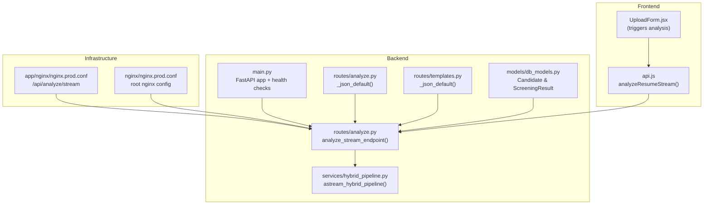
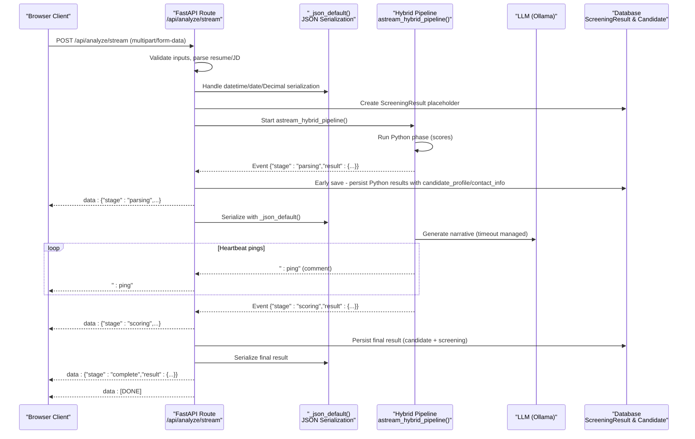
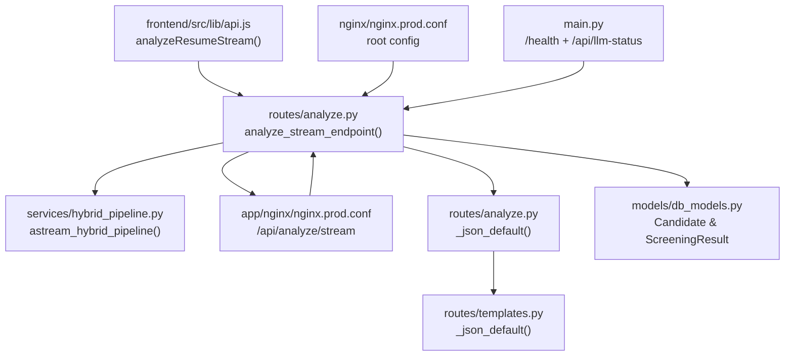

# Streaming Analysis

<cite>
**Referenced Files in This Document**
- [analyze.py](file://app/backend/routes/analyze.py)
- [hybrid_pipeline.py](file://app/backend/services/hybrid_pipeline.py)
- [api.js](file://app/frontend/src/lib/api.js)
- [db_models.py](file://app/backend/models/db_models.py)
- [nginx.prod.conf](file://app/nginx/nginx.prod.conf)
- [nginx.prod.conf](file://nginx/nginx.prod.conf)
- [main.py](file://app/backend/main.py)
- [templates.py](file://app/backend/routes/templates.py)
</cite>

## Update Summary
**Changes Made**
- Enhanced database persistence mechanism in analyze_stream_endpoint to properly save complete analysis results during parsing stage
- Implemented early database saves to ensure candidate_profile and contact_info data is reliably persisted
- Added sophisticated client disconnection handling with automatic early result persistence
- Improved reliability of streaming analysis by saving Python results immediately after parsing phase
- Enhanced error handling and graceful degradation scenarios for connection interruptions

## Table of Contents
1. [Introduction](#introduction)
2. [Project Structure](#project-structure)
3. [Core Components](#core-components)
4. [Architecture Overview](#architecture-overview)
5. [Detailed Component Analysis](#detailed-component-analysis)
6. [Dependency Analysis](#dependency-analysis)
7. [Performance Considerations](#performance-considerations)
8. [Troubleshooting Guide](#troubleshooting-guide)
9. [Conclusion](#conclusion)

## Introduction
This document provides comprehensive documentation for the POST /api/analyze/stream endpoint using Server-Sent Events (SSE). The endpoint delivers a progressive analysis of resumes with three distinct stages:
- Parsing: Python-based scoring and analysis (within 2 seconds)
- Scoring: LLM-generated narrative (after approximately 40 seconds)
- Complete: Final merged result with strengths, weaknesses, recommendations, and interview questions

The implementation ensures SSE protocol compliance, includes heartbeat pings to maintain connections, and handles connection lifecycle, error propagation, and graceful degradation when the LLM is unavailable. **Updated** to include enhanced database persistence mechanisms that guarantee reliable saving of candidate_profile and contact_info data during the parsing stage, even in case of client disconnections.

## Project Structure
The streaming analysis spans backend route handlers, a hybrid pipeline orchestrator, and frontend client-side consumption. Supporting infrastructure includes Nginx configuration for SSE buffering and FastAPI application initialization.

**Diagram sources**
- [analyze.py:506-646](file://app/backend/routes/analyze.py#L506-L646)
- [hybrid_pipeline.py:1410-1498](file://app/backend/services/hybrid_pipeline.py#L1410-L1498)
- [api.js:75-147](file://app/frontend/src/lib/api.js#L75-L147)
- [db_models.py:98-156](file://app/backend/models/db_models.py#L98-L156)
- [nginx.prod.conf:66-95](file://app/nginx/nginx.prod.conf#L66-L95)
- [nginx.prod.conf:36-52](file://nginx/nginx.prod.conf#L36-L52)
- [main.py:174-215](file://app/backend/main.py#L174-L215)
- [analyze.py:48-57](file://app/backend/routes/analyze.py#L48-L57)
- [templates.py:18-25](file://app/backend/routes/templates.py#L18-L25)

**Section sources**
- [analyze.py:506-646](file://app/backend/routes/analyze.py#L506-L646)
- [hybrid_pipeline.py:1410-1498](file://app/backend/services/hybrid_pipeline.py#L1410-L1498)
- [api.js:75-147](file://app/frontend/src/lib/api.js#L75-L147)
- [db_models.py:98-156](file://app/backend/models/db_models.py#L98-L156)
- [nginx.prod.conf:66-95](file://app/nginx/nginx.prod.conf#L66-L95)
- [nginx.prod.conf:36-52](file://nginx/nginx.prod.conf#L36-L52)
- [main.py:174-215](file://app/backend/main.py#L174-L215)

## Core Components
- Route handler: Implements the /api/analyze/stream endpoint, validates inputs, parses resume/JD, and streams progressive events with enhanced JSON serialization and robust database persistence.
- Hybrid pipeline: Executes Python scoring (instant) followed by LLM narrative generation with heartbeat pings.
- Frontend consumer: Uses fetch with ReadableStream to process SSE events and update UI progressively.
- Infrastructure: Nginx disables buffering for SSE and sets appropriate timeouts to prevent 524 errors.
- **Updated** Database persistence: Enhanced mechanisms ensure candidate_profile and contact_info data is reliably saved during parsing stage, with automatic early saves on client disconnection.

Key implementation references:
- Route handler and SSE response: [analyze.py:506-646](file://app/backend/routes/analyze.py#L506-L646)
- Streaming orchestration and heartbeat pings: [hybrid_pipeline.py:1410-1498](file://app/backend/services/hybrid_pipeline.py#L1410-L1498)
- Client-side SSE consumption: [api.js:75-147](file://app/frontend/src/lib/api.js#L75-L147)
- Nginx SSE configuration: [nginx.prod.conf:66-95](file://app/nginx/nginx.prod.conf#L66-L95), [nginx.prod.conf:36-52](file://nginx/nginx.prod.conf#L36-L52)
- **Updated** JSON serialization helper: [analyze.py:48-57](file://app/backend/routes/analyze.py#L48-L57)
- Database models: [db_models.py:98-156](file://app/backend/models/db_models.py#L98-L156)

**Section sources**
- [analyze.py:506-646](file://app/backend/routes/analyze.py#L506-L646)
- [hybrid_pipeline.py:1410-1498](file://app/backend/services/hybrid_pipeline.py#L1410-L1498)
- [api.js:75-147](file://app/frontend/src/lib/api.js#L75-L147)
- [nginx.prod.conf:66-95](file://app/nginx/nginx.prod.conf#L66-L95)
- [nginx.prod.conf:36-52](file://nginx/nginx.prod.conf#L36-L52)
- [analyze.py:48-57](file://app/backend/routes/analyze.py#L48-L57)
- [db_models.py:98-156](file://app/backend/models/db_models.py#L98-L156)

## Architecture Overview
The streaming analysis follows a strict three-stage flow: Python parsing, LLM scoring, and completion. The backend emits structured events compliant with SSE, while the frontend consumes them in real time. **Updated** to include enhanced database persistence that guarantees reliable saving of candidate_profile and contact_info data during the parsing stage, with automatic early saves triggered by client disconnections.

**Diagram sources**
- [analyze.py:565-640](file://app/backend/routes/analyze.py#L565-L640)
- [hybrid_pipeline.py:1410-1498](file://app/backend/services/hybrid_pipeline.py#L1410-L1498)
- [api.js:96-147](file://app/frontend/src/lib/api.js#L96-L147)
- [analyze.py:48-57](file://app/backend/routes/analyze.py#L48-L57)

**Section sources**
- [analyze.py:565-640](file://app/backend/routes/analyze.py#L565-L640)
- [hybrid_pipeline.py:1410-1498](file://app/backend/services/hybrid_pipeline.py#L1410-L1498)
- [api.js:96-147](file://app/frontend/src/lib/api.js#L96-L147)

## Detailed Component Analysis

### Backend Route Handler: /api/analyze/stream
Responsibilities:
- Validate file types and sizes, job description source, and scoring weights.
- Parse resume and JD in a thread pool to avoid blocking the event loop.
- Stream progressive events using FastAPI's StreamingResponse with text/event-stream.
- Emit SSE heartbeat comments during LLM wait to keep connections alive.
- **Updated** Serialize all events using `_json_default` to handle datetime, date, and Decimal objects.
- **Enhanced** Implement sophisticated database persistence with early saves for candidate_profile and contact_info data.
- **Enhanced** Handle client disconnections gracefully with automatic early result persistence.
- Persist final result to the database and append metadata (IDs, names).
- Emit a final "complete" event followed by "[DONE]" marker.

Event emission timeline:
- Stage "parsing": emitted immediately after Python phase completes, with early database save.
- Stage "scoring": emitted after LLM completes or falls back.
- Stage "complete": emitted after DB persistence with merged result.
- Marker "[DONE]": signals end of stream.

Headers:
- Content-Type: text/event-stream
- Cache-Control: no-cache
- X-Accel-Buffering: no (Nginx-specific header to disable buffering)

Error handling:
- On parsing failures, emits an "error" event with message and terminates with "[DONE]".
- On pipeline exceptions, emits an "error" event and persists a fallback result.
- **Updated** Uses `_json_default` for all JSON serialization to prevent crashes.
- **Enhanced** Handles client disconnections with automatic early database saves.

References:
- Route definition and SSE response: [analyze.py:506-646](file://app/backend/routes/analyze.py#L506-L646)
- Event stream generator and persistence: [analyze.py:565-640](file://app/backend/routes/analyze.py#L565-L640)
- **Updated** JSON serialization helper: [analyze.py:48-57](file://app/backend/routes/analyze.py#L48-L57)

**Section sources**
- [analyze.py:506-646](file://app/backend/routes/analyze.py#L506-L646)
- [analyze.py:565-640](file://app/backend/routes/analyze.py#L565-L640)
- [analyze.py:48-57](file://app/backend/routes/analyze.py#L48-L57)

### Enhanced Database Persistence Mechanisms
The analyze_stream_endpoint now includes sophisticated database persistence mechanisms to ensure reliable data saving:

**Early Database Saves:**
- After parsing phase completes, Python results are automatically saved to ScreeningResult with candidate_profile and contact_info data
- The system tracks whether Python scores have been saved to prevent duplicate writes
- Early saves occur regardless of client connection state

**Client Disconnection Handling:**
- System monitors client connection status between streaming stages
- If client disconnects, automatic early save captures Python results with full candidate_profile and contact_info
- Prevents data loss when clients close connections prematurely

**Reliability Features:**
- Multiple layers of database persistence ensure data integrity
- Automatic rollback and error handling for database operations
- Logging of all persistence operations for debugging and monitoring

**Section sources**
- [analyze.py:775-835](file://app/backend/routes/analyze.py#L775-L835)
- [analyze.py:800-812](file://app/backend/routes/analyze.py#L800-L812)
- [analyze.py:820-835](file://app/backend/routes/analyze.py#L820-L835)

### Hybrid Pipeline: astream_hybrid_pipeline
Responsibilities:
- Execute Python scoring phase (JD parsing, resume profile building, skill matching, education/experience scoring, domain/architecture scoring, and fit score computation).
- Yield a "parsing" event containing Python scores.
- Initiate LLM narrative generation asynchronously with a semaphore-controlled concurrency limit.
- Emit heartbeat comments every 5 seconds while waiting for the LLM to prevent timeouts.
- Yield a "scoring" event with the LLM narrative (or fallback).
- Merge Python and LLM results into a complete analysis and yield a "complete" event.

Timeout and fallback behavior:
- LLM timeout defaults to 150 seconds; on timeout or errors, a deterministic fallback narrative is generated and "narrative_pending" is set to True.

Heartbeat mechanism:
- Periodic ": ping" comments are yielded to keep the connection alive across proxies and CDNs.

References:
- Streaming orchestration and heartbeat: [hybrid_pipeline.py:1410-1498](file://app/backend/services/hybrid_pipeline.py#L1410-L1498)
- Python phase assembly: [hybrid_pipeline.py:1262-1333](file://app/backend/services/hybrid_pipeline.py#L1262-L1333)
- LLM narrative and fallback: [hybrid_pipeline.py:1144-1255](file://app/backend/services/hybrid_pipeline.py#L1144-L1255)

**Section sources**
- [hybrid_pipeline.py:1410-1498](file://app/backend/services/hybrid_pipeline.py#L1410-L1498)
- [hybrid_pipeline.py:1262-1333](file://app/backend/services/hybrid_pipeline.py#L1262-L1333)
- [hybrid_pipeline.py:1144-1255](file://app/backend/services/hybrid_pipeline.py#L1144-L1255)

### Frontend Consumer: analyzeResumeStream
Responsibilities:
- Construct multipart/form-data with resume, optional job description or job file, and optional scoring weights.
- Send POST request to /api/analyze/stream using fetch.
- Consume the SSE stream via ReadableStream, splitting on double-newlines and filtering "data:" lines.
- Parse JSON events and dispatch them to an onStageComplete callback.
- Track the final result and resolve the promise upon receiving the "complete" event.
- Handle stream termination gracefully and surface errors.

Client-side event processing:
- Parses each event line, skipping non-data lines and the "[DONE]" marker.
- Updates UI progressively as "parsing" and "scoring" events arrive.
- Resolves with the final "complete" result.

References:
- Fetch-based SSE consumption: [api.js:75-147](file://app/frontend/src/lib/api.js#L75-L147)

**Section sources**
- [api.js:75-147](file://app/frontend/src/lib/api.js#L75-L147)

### Infrastructure: Nginx SSE Configuration
Responsibilities:
- Disable proxy buffering for /api/analyze/stream to ensure immediate event delivery.
- Set extended timeouts to accommodate long-running LLM narratives.
- Disable gzip for the stream and strip Connection header to prevent proxy interference.
- Provide a dedicated location block for SSE with appropriate headers.

References:
- Application-level Nginx config: [nginx.prod.conf:66-95](file://app/nginx/nginx.prod.conf#L66-L95)
- Root Nginx config (alternative): [nginx.prod.conf:36-52](file://nginx/nginx.prod.conf#L36-L52)

**Section sources**
- [nginx.prod.conf:66-95](file://app/nginx/nginx.prod.conf#L66-L95)
- [nginx.prod.conf:36-52](file://nginx/nginx.prod.conf#L36-L52)

### Event Payload Formats
Each event emitted by the backend adheres to the SSE "data:" line format with a JSON payload. The payload structure is consistent across stages and **Updated** to include proper serialization of datetime objects, dates, and Decimal values.

- Base structure:
  - stage: "parsing" | "scoring" | "complete" | "error"
  - result: object containing analysis data

- Stage "parsing":
  - Contains Python-generated scores and profiles (e.g., fit_score, matched_skills, missing_skills, score_breakdown, risk_signals, etc.).
  - **Updated** All datetime fields serialized as ISO format strings, Decimal values as floats.
  - **Enhanced** Includes complete candidate_profile and contact_info data for reliable persistence.
  - Example structure reference: [hybrid_pipeline.py:1262-1333](file://app/backend/services/hybrid_pipeline.py#L1262-L1333)

- Stage "scoring":
  - Contains LLM-generated narrative (e.g., strengths, weaknesses, recommendation_rationale, explainability, interview_questions).
  - **Updated** Properly serializes any datetime/Decimal values that may be included in the narrative context.
  - Example structure reference: [hybrid_pipeline.py:1144-1255](file://app/backend/services/hybrid_pipeline.py#L1144-L1255)

- Stage "complete":
  - Merged result combining Python and LLM outputs, plus persisted metadata (IDs, names).
  - **Updated** All temporal fields serialized as ISO format strings, numeric values as appropriate types.
  - **Enhanced** Includes final candidate_profile and contact_info data with analysis quality indicators.
  - References: [analyze.py:589-640](file://app/backend/routes/analyze.py#L589-L640), [hybrid_pipeline.py:1336-1350](file://app/backend/services/hybrid_pipeline.py#L1336-L1350)

- Stage "error":
  - Contains a message field with the error description.
  - Emitted on parsing failures or pipeline exceptions.
  - Reference: [analyze.py:555-558](file://app/backend/routes/analyze.py#L555-L558), [analyze.py:584-587](file://app/backend/routes/analyze.py#L584-L587)

SSE Protocol Compliance:
- Each event line begins with "data: " followed by JSON.
- Heartbeat comments are emitted as ": ping".
- Stream termination is signaled by "data: [DONE]".

**Updated** JSON Serialization Handling:
- `_json_default` function converts datetime and date objects to ISO format strings.
- Converts Decimal objects to float values for JSON compatibility.
- Prevents serialization crashes when encountering non-serializable types.

References:
- SSE emission and markers: [analyze.py:576-581](file://app/backend/routes/analyze.py#L576-L581), [analyze.py:638-640](file://app/backend/routes/analyze.py#L638-L640)
- Heartbeat pings: [hybrid_pipeline.py:1483-1486](file://app/backend/services/hybrid_pipeline.py#L1483-L1486)
- **Updated** JSON serialization helper: [analyze.py:48-57](file://app/backend/routes/analyze.py#L48-L57)

**Section sources**
- [analyze.py:555-558](file://app/backend/routes/analyze.py#L555-L558)
- [analyze.py:576-581](file://app/backend/routes/analyze.py#L576-L581)
- [analyze.py:584-587](file://app/backend/routes/analyze.py#L584-L587)
- [analyze.py:638-640](file://app/backend/routes/analyze.py#L638-L640)
- [hybrid_pipeline.py:1483-1486](file://app/backend/services/hybrid_pipeline.py#L1483-L1486)
- [hybrid_pipeline.py:1262-1333](file://app/backend/services/hybrid_pipeline.py#L1262-L1333)
- [hybrid_pipeline.py:1144-1255](file://app/backend/services/hybrid_pipeline.py#L1144-L1255)
- [hybrid_pipeline.py:1336-1350](file://app/backend/services/hybrid_pipeline.py#L1336-L1350)
- [analyze.py:48-57](file://app/backend/routes/analyze.py#L48-L57)

### Client-Side Event Processing and Examples
JavaScript fetch event stream consumption:
- Establishes a POST request with multipart/form-data.
- Reads the response body as a stream and decodes chunks.
- Splits on "\n\n" boundaries and processes "data: " lines.
- Parses JSON events and invokes onStageComplete for "parsing" and "scoring".
- Tracks finalResult and resolves when "complete" arrives.
- Throws an error if the stream ends without a "complete" event.

References:
- Fetch-based SSE consumption: [api.js:75-147](file://app/frontend/src/lib/api.js#L75-L147)

**Section sources**
- [api.js:75-147](file://app/frontend/src/lib/api.js#L75-L147)

### Connection Handling, Timeouts, and Retry Strategies
Connection handling:
- Backend uses StreamingResponse with text/event-stream and disables caching.
- Nginx disables buffering and gzip for SSE, sets extended timeouts, and strips Connection header.
- **Enhanced** Client disconnection detection with automatic early database saves.

Timeouts:
- LLM narrative timeout defaults to 150 seconds; configurable via LLM_NARRATIVE_TIMEOUT environment variable.
- Nginx proxy_read_timeout and proxy_send_timeout are set to 600 seconds for SSE.

Retry mechanisms:
- Heartbeat pings every 5 seconds keep the connection alive during LLM wait.
- Graceful fallback to Python-generated narrative when LLM is unavailable or times out.
- Frontend should implement retry logic at the application level if needed (e.g., re-submit analysis on error).
- **Enhanced** Automatic early result persistence prevents data loss on client disconnects.

References:
- SSE headers and buffering: [analyze.py:642-646](file://app/backend/routes/analyze.py#L642-L646), [nginx.prod.conf:81-94](file://app/nginx/nginx.prod.conf#L81-L94)
- LLM timeout and fallback: [hybrid_pipeline.py:1384-1407](file://app/backend/services/hybrid_pipeline.py#L1384-L1407)
- Heartbeat pings: [hybrid_pipeline.py:1483-1486](file://app/backend/services/hybrid_pipeline.py#L1483-L1486)

**Section sources**
- [analyze.py:642-646](file://app/backend/routes/analyze.py#L642-L646)
- [nginx.prod.conf:81-94](file://app/nginx/nginx.prod.conf#L81-L94)
- [hybrid_pipeline.py:1384-1407](file://app/backend/services/hybrid_pipeline.py#L1384-L1407)
- [hybrid_pipeline.py:1483-1486](file://app/backend/services/hybrid_pipeline.py#L1483-L1486)

### Real-Time Progress Updates and Streaming Response Headers
Real-time updates:
- Progressive UI updates occur as "parsing" and "scoring" events are received.
- The frontend can render partial results immediately after "parsing" and enhance with narrative after "scoring".
- **Enhanced** Early database saves ensure reliable data persistence even if client disconnects.

Streaming response headers:
- Content-Type: text/event-stream
- Cache-Control: no-cache
- X-Accel-Buffering: no (Nginx-specific)

References:
- SSE headers: [analyze.py:642-646](file://app/backend/routes/analyze.py#L642-L646)
- Nginx headers: [nginx.prod.conf:84-85](file://app/nginx/nginx.prod.conf#L84-L85)

**Section sources**
- [analyze.py:642-646](file://app/backend/routes/analyze.py#L642-L646)
- [nginx.prod.conf:84-85](file://app/nginx/nginx.prod.conf#L84-L85)

### Error Handling Patterns
Backend error handling:
- Parsing errors: emits "error" event with message and "[DONE]".
- Pipeline exceptions: emits "error" event and persists a fallback result.
- DB persistence errors: appended to pipeline_errors in the final result.
- **Updated** JSON serialization errors: prevented by `_json_default` function.
- **Enhanced** Client disconnection errors: triggers automatic early database saves.

Frontend error handling:
- Validates response.ok and throws descriptive errors.
- Skips malformed events and continues processing until "[DONE]".
- Resolves with final result only if "complete" is received.

References:
- Backend error events: [analyze.py:555-558](file://app/backend/routes/analyze.py#L555-L558), [analyze.py:584-587](file://app/backend/routes/analyze.py#L584-L587)
- Frontend error handling: [api.js:102-109](file://app/frontend/src/lib/api.js#L102-L109), [api.js:132-140](file://app/frontend/src/lib/api.js#L132-L140)

**Section sources**
- [analyze.py:555-558](file://app/backend/routes/analyze.py#L555-L558)
- [analyze.py:584-587](file://app/backend/routes/analyze.py#L584-L587)
- [api.js:102-109](file://app/frontend/src/lib/api.js#L102-L109)
- [api.js:132-140](file://app/frontend/src/lib/api.js#L132-L140)

## Dependency Analysis
The streaming analysis depends on:
- FastAPI route handler for SSE response and event emission.
- Hybrid pipeline for orchestrating Python and LLM phases with heartbeat pings.
- Frontend consumer for consuming SSE and updating UI.
- Nginx configuration for buffering control and timeouts.
- Health checks and environment diagnostics for LLM readiness.
- **Updated** JSON serialization utilities for handling datetime, date, and Decimal objects.
- **Enhanced** Database models for Candidate and ScreeningResult persistence.

**Diagram sources**
- [analyze.py:506-646](file://app/backend/routes/analyze.py#L506-L646)
- [hybrid_pipeline.py:1410-1498](file://app/backend/services/hybrid_pipeline.py#L1410-L1498)
- [api.js:75-147](file://app/frontend/src/lib/api.js#L75-L147)
- [nginx.prod.conf:66-95](file://app/nginx/nginx.prod.conf#L66-L95)
- [nginx.prod.conf:36-52](file://nginx/nginx.prod.conf#L36-L52)
- [main.py:228-259](file://app/backend/main.py#L228-L259)
- [analyze.py:48-57](file://app/backend/routes/analyze.py#L48-L57)
- [templates.py:18-25](file://app/backend/routes/templates.py#L18-L25)
- [db_models.py:98-156](file://app/backend/models/db_models.py#L98-L156)

**Section sources**
- [analyze.py:506-646](file://app/backend/routes/analyze.py#L506-L646)
- [hybrid_pipeline.py:1410-1498](file://app/backend/services/hybrid_pipeline.py#L1410-L1498)
- [api.js:75-147](file://app/frontend/src/lib/api.js#L75-L147)
- [nginx.prod.conf:66-95](file://app/nginx/nginx.prod.conf#L66-L95)
- [nginx.prod.conf:36-52](file://nginx/nginx.prod.conf#L36-L52)
- [main.py:228-259](file://app/backend/main.py#L228-L259)
- [analyze.py:48-57](file://app/backend/routes/analyze.py#L48-L57)
- [templates.py:18-25](file://app/backend/routes/templates.py#L18-L25)
- [db_models.py:98-156](file://app/backend/models/db_models.py#L98-L156)

## Performance Considerations
- Python phase is designed to complete within 2 seconds, ensuring quick "parsing" events.
- LLM narrative generation is asynchronous with heartbeat pings to prevent timeouts.
- Nginx disables buffering and gzip for SSE to minimize latency and avoid 524 errors.
- Extended proxy timeouts (600 seconds) accommodate long-running LLM calls.
- Concurrency control via semaphore limits simultaneous LLM calls to 2 per worker.
- **Updated** JSON serialization overhead is minimal and prevents runtime crashes.
- **Enhanced** Database persistence adds minimal overhead while ensuring data reliability.
- **Enhanced** Early database saves prevent data loss and improve user experience.

## Troubleshooting Guide
Common issues and resolutions:
- 524 Gateway Timeout from CDN/proxy:
  - Cause: Nginx buffering holding SSE events.
  - Resolution: Ensure proxy_buffering off and X-Accel-Buffering no for /api/analyze/stream.
  - References: [nginx.prod.conf:81-85](file://app/nginx/nginx.prod.conf#L81-L85), [nginx.prod.conf:43-51](file://nginx/nginx.prod.conf#L43-L51)

- Connection drops during LLM wait:
  - Cause: Absence of heartbeat pings.
  - Resolution: Verify ": ping" comments are emitted and consumed.
  - References: [hybrid_pipeline.py:1483-1486](file://app/backend/services/hybrid_pipeline.py#L1483-L1486)

- LLM unavailable or slow:
  - Behavior: Fallback narrative with narrative_pending set to True.
  - Resolution: Pull and warm the model; adjust LLM_NARRATIVE_TIMEOUT if needed.
  - References: [hybrid_pipeline.py:1384-1407](file://app/backend/services/hybrid_pipeline.py#L1384-L1407), [main.py:262-326](file://app/backend/main.py#L262-L326)

- Frontend not receiving events:
  - Verify SSE consumption logic and that the stream is not aborted prematurely.
  - References: [api.js:111-141](file://app/frontend/src/lib/api.js#L111-L141)

- **Updated** JSON serialization errors:
  - Symptom: Crashes when encountering datetime, date, or Decimal objects in SSE payloads.
  - Solution: Ensure `_json_default` function is used for all JSON serialization in streaming endpoints.
  - References: [analyze.py:48-57](file://app/backend/routes/analyze.py#L48-L57), [templates.py:18-25](file://app/backend/routes/templates.py#L18-L25)

- **Enhanced** Data persistence failures:
  - Symptom: Missing candidate_profile or contact_info data after analysis.
  - Solution: Check database logs for early save operations; verify client disconnection handling.
  - References: [analyze.py:798-812](file://app/backend/routes/analyze.py#L798-L812), [analyze.py:820-835](file://app/backend/routes/analyze.py#L820-L835)

- **Enhanced** Client disconnection issues:
  - Symptom: Analysis appears to fail when client closes browser window.
  - Solution: Early database saves automatically capture Python results; verify python_scores_saved flag.
  - References: [analyze.py:798-812](file://app/backend/routes/analyze.py#L798-L812), [analyze.py:820-835](file://app/backend/routes/analyze.py#L820-L835)

**Section sources**
- [nginx.prod.conf:81-85](file://app/nginx/nginx.prod.conf#L81-L85)
- [nginx.prod.conf:43-51](file://nginx/nginx.prod.conf#L43-L51)
- [hybrid_pipeline.py:1483-1486](file://app/backend/services/hybrid_pipeline.py#L1483-L1486)
- [hybrid_pipeline.py:1384-1407](file://app/backend/services/hybrid_pipeline.py#L1384-L1407)
- [main.py:262-326](file://app/backend/main.py#L262-L326)
- [api.js:111-141](file://app/frontend/src/lib/api.js#L111-L141)
- [analyze.py:48-57](file://app/backend/routes/analyze.py#L48-L57)
- [templates.py:18-25](file://app/backend/routes/templates.py#L18-L25)
- [analyze.py:798-812](file://app/backend/routes/analyze.py#L798-L812)
- [analyze.py:820-835](file://app/backend/routes/analyze.py#L820-L835)

## Conclusion
The POST /api/analyze/stream endpoint provides a robust, real-time streaming analysis experience. By separating deterministic Python scoring from LLM narrative generation and emitting structured SSE events with heartbeat pings, the system ensures responsive UI updates and reliable operation even under adverse conditions. **Updated** to include enhanced database persistence mechanisms that guarantee reliable saving of candidate_profile and contact_info data during the parsing stage, with automatic early saves triggered by client disconnections. These enhancements ensure that critical analysis data is never lost, improving the overall reliability and user experience of the streaming analysis system.