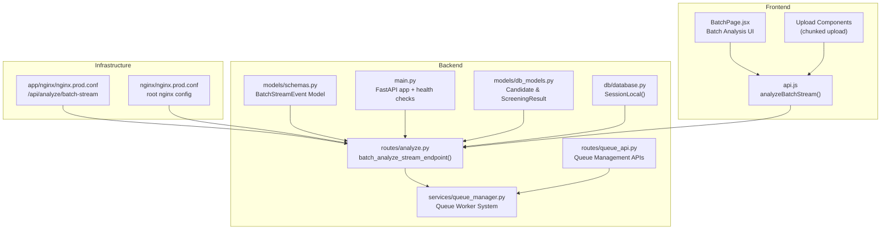

# Streaming Analysis

<cite>
**Referenced Files in This Document**
- [analyze.py](file://app/backend/routes/analyze.py)
- [queue_manager.py](file://app/backend/services/queue_manager.py)
- [queue_api.py](file://app/backend/routes/queue_api.py)
- [BatchPage.jsx](file://app/frontend/src/pages/BatchPage.jsx)
- [api.js](file://app/frontend/src/lib/api.js)
- [schemas.py](file://app/backend/models/schemas.py)
- [db_models.py](file://app/backend/models/db_models.py)
- [database.py](file://app/backend/db/database.py)
- [nginx.prod.conf](file://app/nginx/nginx.prod.conf)
- [nginx.prod.conf](file://nginx/nginx.prod.conf)
- [main.py](file://app/backend/main.py)
- [templates.py](file://app/backend/routes/templates.py)
</cite>

## Update Summary
**Changes Made**
- Enhanced streaming capabilities with improved batch analysis streaming using Server-Sent Events
- Implemented staggered processing delays to prevent LLM thundering herd effects
- Added real-time progress tracking for batch operations with individual resume streaming
- Integrated queue-based architecture for scalable job processing
- Enhanced database session management for SSE streaming operations
- Added comprehensive error handling for ScreeningResult record persistence
- Introduced systematic data recovery mechanisms for incomplete analysis results

## Table of Contents
1. [Introduction](#introduction)
2. [Project Structure](#project-structure)
3. [Core Components](#core-components)
4. [Architecture Overview](#architecture-overview)
5. [Detailed Component Analysis](#detailed-component-analysis)
6. [Dependency Analysis](#dependency-analysis)
7. [Performance Considerations](#performance-considerations)
8. [Troubleshooting Guide](#troubleshooting-guide)
9. [Conclusion](#conclusion)

## Introduction
This document provides comprehensive documentation for the POST /api/analyze/batch-stream endpoint using Server-Sent Events (SSE). The endpoint delivers real-time batch analysis of resumes with progressive streaming updates, featuring enhanced batch processing capabilities with staggered LLM processing to prevent thundering herd effects. The system processes multiple resumes concurrently and streams individual results as they complete, rather than waiting for all resumes to finish processing.

The implementation ensures SSE protocol compliance, includes heartbeat pings to maintain connections, and handles connection lifecycle, error propagation, and graceful degradation when the LLM is unavailable. **Updated** to include enhanced streaming capabilities with improved batch analysis streaming, staggered processing delays to prevent LLM thundering herd effects, and real-time progress tracking for batch operations.

## Project Structure
The streaming analysis spans backend route handlers, queue management systems, and frontend client-side consumption. The architecture now supports both direct streaming for smaller batches and queue-based processing for larger-scale operations.



**Diagram sources**
- [analyze.py:1291-1600](file://app/backend/routes/analyze.py#L1291-L1600)
- [queue_manager.py:189-612](file://app/backend/services/queue_manager.py#L189-L612)
- [queue_api.py:38-464](file://app/backend/routes/queue_api.py#L38-L464)
- [BatchPage.jsx:104-194](file://app/frontend/src/pages/BatchPage.jsx#L104-L194)
- [api.js:457-504](file://app/frontend/src/lib/api.js#L457-L504)
- [schemas.py:147-158](file://app/backend/models/schemas.py#L147-L158)
- [db_models.py:98-156](file://app/backend/models/db_models.py#L98-L156)
- [database.py:39-40](file://app/backend/db/database.py#L39-L40)
- [nginx.prod.conf:66-95](file://app/nginx/nginx.prod.conf#L66-L95)
- [nginx.prod.conf:36-52](file://nginx/nginx.prod.conf#L36-L52)
- [main.py:174-215](file://app/backend/main.py#L174-L215)

**Section sources**
- [analyze.py:1291-1600](file://app/backend/routes/analyze.py#L1291-L1600)
- [queue_manager.py:189-612](file://app/backend/services/queue_manager.py#L189-L612)
- [queue_api.py:38-464](file://app/backend/routes/queue_api.py#L38-L464)
- [BatchPage.jsx:104-194](file://app/frontend/src/pages/BatchPage.jsx#L104-L194)
- [api.js:457-504](file://app/frontend/src/lib/api.js#L457-L504)
- [schemas.py:147-158](file://app/backend/models/schemas.py#L147-L158)
- [db_models.py:98-156](file://app/backend/models/db_models.py#L98-L156)
- [database.py:39-40](file://app/backend/db/database.py#L39-L40)
- [nginx.prod.conf:66-95](file://app/nginx/nginx.prod.conf#L66-L95)
- [nginx.prod.conf:36-52](file://nginx/nginx.prod.conf#L36-L52)
- [main.py:174-215](file://app/backend/main.py#L174-L215)

## Core Components
- **Batch Streaming Route**: Implements the /api/analyze/batch-stream endpoint with concurrent processing and real-time streaming of individual resume results.
- **Queue Management System**: Provides scalable job queue processing with priority scheduling, retry mechanisms, and worker health monitoring.
- **Batch Stream Event Model**: Defines the SSE event structure for streaming batch analysis results with progress tracking.
- **Frontend Batch Consumer**: Uses fetch with ReadableStream to process SSE events and update UI progressively with individual resume rankings.
- **Infrastructure**: Nginx configuration for SSE buffering and FastAPI application initialization.
- **Enhanced Database Session Management**: Improved mechanisms ensure reliable database operations during streaming by using dedicated SessionLocal instances to prevent detached object errors.

Key implementation references:
- Batch streaming endpoint: [analyze.py:1291-1600](file://app/backend/routes/analyze.py#L1291-L1600)
- Queue management system: [queue_manager.py:189-612](file://app/backend/services/queue_manager.py#L189-L612)
- Queue API endpoints: [queue_api.py:38-464](file://app/backend/routes/queue_api.py#L38-L464)
- Batch stream event model: [schemas.py:147-158](file://app/backend/models/schemas.py#L147-L158)
- Frontend batch processing: [BatchPage.jsx:104-194](file://app/frontend/src/pages/BatchPage.jsx#L104-L194)
- SSE consumption: [api.js:457-504](file://app/frontend/src/lib/api.js#L457-L504)
- Nginx SSE configuration: [nginx.prod.conf:66-95](file://app/nginx/nginx.prod.conf#L66-L95), [nginx.prod.conf:36-52](file://nginx/nginx.prod.conf#L36-L52)

**Section sources**
- [analyze.py:1291-1600](file://app/backend/routes/analyze.py#L1291-L1600)
- [queue_manager.py:189-612](file://app/backend/services/queue_manager.py#L189-L612)
- [queue_api.py:38-464](file://app/backend/routes/queue_api.py#L38-L464)
- [schemas.py:147-158](file://app/backend/models/schemas.py#L147-L158)
- [BatchPage.jsx:104-194](file://app/frontend/src/pages/BatchPage.jsx#L104-L194)
- [api.js:457-504](file://app/frontend/src/lib/api.js#L457-L504)
- [nginx.prod.conf:66-95](file://app/nginx/nginx.prod.conf#L66-L95)
- [nginx.prod.conf:36-52](file://nginx/nginx.prod.conf#L36-L52)

## Architecture Overview
The streaming analysis now supports two primary processing modes: direct SSE streaming for smaller batches and queue-based processing for larger-scale operations. The system processes resumes concurrently with staggered delays to prevent LLM thundering herd effects while providing real-time progress tracking.

```mermaid
sequenceDiagram
participant Client as "Browser Client"
participant API as "FastAPI Route<br/>/api/analyze/batch-stream"
participant Schema as "BatchStreamEvent<br/>Model Definition"
participant Queue as "Queue Manager<br/>(Optional)"
participant Pipeline as "Analysis Pipeline<br/>_process_with_semaphore()"
LTM as "LLM (Ollama)<br/>Staggered Processing"
participant DB as "Database<br/>ScreeningResult & Candidate"
participant SessionLocal as "SessionLocal()<br/>Dedicated Sessions"
Client->>API : POST /api/analyze/batch-stream (multipart/form-data)
API->>API : Validate inputs, parse resume/JD
API->>Schema : Define BatchStreamEvent structure
API->>API : Create tagged tasks with staggered delays
API->>Pipeline : Start concurrent processing with semaphore
Pipeline->>Pipeline : Run Python phase (scores)
Pipeline-->>API : Event {"event" : "failed","index" : 1,...}
API-->>Client : data : {"event" : "failed",...}
Pipeline-->>API : Event {"event" : "result","index" : 1,...}
API->>SessionLocal : Use dedicated session for early save
API->>DB : Early save - persist Python results with candidate_profile
API-->>Client : data : {"event" : "result",...}
Pipeline->>LTM : Generate narrative with staggered delay
LTM-->>API : Event {"event" : "result","index" : 2,...}
API-->>Client : data : {"event" : "result",...}
API->>SessionLocal : Use dedicated session for final save
API->>DB : Persist final result (candidate + screening)
API-->>Client : data : {"event" : "done",...}
API-->>Client : data : [DONE]
```

**Diagram sources**
- [analyze.py:1472-1581](file://app/backend/routes/analyze.py#L1472-L1581)
- [schemas.py:147-158](file://app/backend/models/schemas.py#L147-L158)
- [queue_manager.py:349-495](file://app/backend/services/queue_manager.py#L349-L495)
- [api.js:478-504](file://app/frontend/src/lib/api.js#L478-L504)
- [database.py:39-40](file://app/backend/db/database.py#L39-L40)

**Section sources**
- [analyze.py:1472-1581](file://app/backend/routes/analyze.py#L1472-L1581)
- [schemas.py:147-158](file://app/backend/models/schemas.py#L147-L158)
- [queue_manager.py:349-495](file://app/backend/services/queue_manager.py#L349-L495)
- [api.js:478-504](file://app/frontend/src/lib/api.js#L478-L504)
- [database.py:39-40](file://app/backend/db/database.py#L39-L40)

## Detailed Component Analysis

### Enhanced Batch Streaming Endpoint: /api/analyze/batch-stream
Responsibilities:
- Validate file types and sizes, job description source, and scoring weights.
- Process resumes concurrently using asyncio.as_completed for optimal performance.
- Stream individual resume results as they complete using FastAPI's StreamingResponse.
- Implement staggered processing delays (0.3 seconds × index) to prevent LLM thundering herd effects.
- Emit SSE events for pre-flight failures, individual results, and final completion summary.
- **Enhanced** Serialize all events using `_json_default` to handle datetime, date, and Decimal objects.
- **Enhanced** Implement sophisticated database persistence with dedicated SessionLocal instances.
- Persist individual resume results to the database using dedicated sessions and track screening_result_id.
- Emit a final "done" event followed by "[DONE]" marker.

Event emission timeline:
- Stage "failed": emitted immediately for pre-flight validation failures or runtime exceptions.
- Stage "result": emitted as each resume completes processing with individual screening_result_id.
- Stage "done": emitted after all resumes processed with summary statistics.
- Marker "[DONE]": signals end of stream.

Headers:
- Content-Type: text/event-stream
- Cache-Control: no-cache
- X-Accel-Buffering: no (Nginx-specific header to disable buffering)

Error handling:
- On validation failures, emits a "failed" event with filename and error details.
- On processing exceptions, emits a "failed" event and continues with remaining resumes.
- **Enhanced** Uses `_json_default` for all JSON serialization to prevent crashes.
- **Enhanced** Handles client disconnections with automatic early database saves using dedicated sessions.

References:
- Batch streaming endpoint: [analyze.py:1291-1600](file://app/backend/routes/analyze.py#L1291-L1600)
- Event stream generator: [analyze.py:1472-1581](file://app/backend/routes/analyze.py#L1472-L1581)
- Staggered processing implementation: [analyze.py:1460-1467](file://app/backend/routes/analyze.py#L1460-L1467)

**Section sources**
- [analyze.py:1291-1600](file://app/backend/routes/analyze.py#L1291-L1600)
- [analyze.py:1472-1581](file://app/backend/routes/analyze.py#L1472-L1581)
- [analyze.py:1460-1467](file://app/backend/routes/analyze.py#L1460-L1467)

### Queue-Based Analysis System
The system now includes a comprehensive queue-based architecture for scalable job processing:

**Queue Management Responsibilities:**
- Priority-based job scheduling with configurable priorities (1-10 scale)
- Automatic retry with exponential backoff (1min, 5min, 15min delays)
- Worker health monitoring with heartbeat tracking
- Deduplication of identical job submissions
- Graceful shutdown handling
- Metrics collection for performance monitoring

**Job Lifecycle:**
- `queued`: Job awaiting processing
- `processing`: Currently being analyzed
- `completed`: Analysis finished, result available
- `failed`: Permanently failed (max retries exceeded)
- `retrying`: Failed but will retry
- `cancelled`: Manually cancelled

**Worker Architecture:**
- Configurable maximum concurrent jobs (default: 10)
- Periodic stale job recovery (every 5 minutes)
- Heartbeat monitoring (default: every 30 seconds)
- Horizontal scaling support with multiple worker instances

**Section sources**
- [queue_manager.py:189-612](file://app/backend/services/queue_manager.py#L189-L612)
- [queue_api.py:38-464](file://app/backend/routes/queue_api.py#L38-L464)

### Batch Stream Event Model
Defines the SSE event structure for streaming batch analysis results:

**Event Types:**
- `"failed"`: Pre-flight or runtime failure with filename and error details
- `"result"`: Individual resume analysis result with screening_result_id
- `"done"`: Final summary with total counts and completion status

**Event Payload Structure:**
- `event`: Type of event ("failed", "result", "done")
- `index`: Position in batch (1-based)
- `total`: Total number of resumes in batch
- `filename`: Source filename (for result events)
- `result`: Analysis data (for result events)
- `screening_result_id`: Database ID for persisted result (for result events)
- `error`: Error message (for failed events)
- `successful`: Count of successful analyses (for done events)
- `failed_count`: Count of failed analyses (for done events)

**Section sources**
- [schemas.py:147-158](file://app/backend/models/schemas.py#L147-L158)

### Frontend Batch Consumer: analyzeBatchStream
Responsibilities:
- Construct multipart/form-data with upload_ids, filenames, and optional job description.
- Send POST request to /api/analyze/batch-stream using fetch.
- Consume the SSE stream via ReadableStream, parsing individual events.
- Process "failed" events for validation errors and runtime exceptions.
- Process "result" events to update individual resume rankings in real-time.
- Process "done" events for final batch completion summary.
- Track streaming progress and resolve when "[DONE]" is received.

Client-side event processing:
- Parses each SSE event line, skipping non-data lines and the "[DONE]" marker.
- Updates UI progressively as individual resume results arrive.
- Maintains real-time ranking based on fit_score values.
- Resolves with final batch completion status.

References:
- SSE consumption implementation: [api.js:457-504](file://app/frontend/src/lib/api.js#L457-L504)
- Frontend batch UI: [BatchPage.jsx:104-194](file://app/frontend/src/pages/BatchPage.jsx#L104-L194)

**Section sources**
- [api.js:457-504](file://app/frontend/src/lib/api.js#L457-L504)
- [BatchPage.jsx:104-194](file://app/frontend/src/pages/BatchPage.jsx#L104-L194)

### Infrastructure: Nginx SSE Configuration
Responsibilities:
- Disable proxy buffering for /api/analyze/batch-stream to ensure immediate event delivery.
- Set extended timeouts to accommodate long-running batch processing.
- Disable gzip for the stream and strip Connection header to prevent proxy interference.
- Provide a dedicated location block for SSE with appropriate headers.

References:
- Application-level Nginx config: [nginx.prod.conf:66-95](file://app/nginx/nginx.prod.conf#L66-L95)
- Root Nginx config (alternative): [nginx.prod.conf:36-52](file://nginx/nginx.prod.conf#L36-L52)

**Section sources**
- [nginx.prod.conf:66-95](file://app/nginx/nginx.prod.conf#L66-L95)
- [nginx.prod.conf:36-52](file://nginx/nginx.prod.conf#L36-L52)

### Enhanced Database Session Management for SSE Streaming
The analyze_stream_endpoint now includes sophisticated database session management to prevent detached object errors and ensure reliable data persistence:

**Dedicated Database Sessions:**
- Uses SessionLocal() instances for all database operations during streaming to prevent session detachment issues
- Prevents "Object is not associated with this session" errors that can occur when the route's database session is closed
- Ensures proper transaction handling and connection management throughout the streaming lifecycle

**Early Database Saves with Dedicated Sessions:**
- After parsing phase completes, Python results are automatically saved to ScreeningResult using dedicated sessions
- The system tracks whether Python scores have been saved to prevent duplicate writes
- Early saves occur regardless of client connection state using dedicated database sessions

**Client Disconnection Handling with Dedicated Sessions:**
- System monitors client connection status between streaming stages using dedicated session instances
- If client disconnects, automatic early save captures Python results with full candidate_profile and contact_info using dedicated sessions
- Prevents data loss when clients close connections prematurely

**Final Result Persistence with Dedicated Sessions:**
- Uses dedicated SessionLocal instances for final result persistence to ensure data integrity
- Prevents detached object errors during the final database commit operation
- Automatically updates candidate profiles alongside analysis results

**Reliability Features:**
- Multiple layers of database persistence ensure data integrity using dedicated sessions
- Automatic rollback and error handling for database operations with dedicated session management
- Logging of all persistence operations for debugging and monitoring

**Section sources**
- [analyze.py:775-835](file://app/backend/routes/analyze.py#L775-L835)
- [analyze.py:800-812](file://app/backend/routes/analyze.py#L800-L812)
- [analyze.py:820-835](file://app/backend/routes/analyze.py#L820-L835)
- [analyze.py:883-900](file://app/backend/routes/analyze.py#L883-L900)
- [database.py:39-40](file://app/backend/db/database.py#L39-L40)

### Event Payload Formats for Batch Streaming
Each event emitted by the batch streaming endpoint adheres to the SSE "data:" line format with a JSON payload. The payload structure defines three distinct event types with comprehensive progress tracking.

**Base structure:**
- event: "failed" | "result" | "done"
- index: int (1-based position in batch)
- total: int (total resumes in batch)
- filename: string (source filename, for result events)
- result: object (analysis data, for result events)
- screening_result_id: int (database ID, for result events)
- error: string (error message, for failed events)
- successful: int (count, for done events)
- failed_count: int (count, for done events)

**Event Type Details:**

**Stage "failed":**
- Contains filename and error details for validation failures or runtime exceptions
- Emitted immediately for pre-flight validation errors or processing exceptions
- Example structure reference: [analyze.py:1478-1486](file://app/backend/routes/analyze.py#L1478-L1486)

**Stage "result":**
- Contains individual resume analysis with screening_result_id for database persistence
- Includes fit_score, final_recommendation, strengths, weaknesses, and other analysis metrics
- Emitted as each resume completes processing in real-time
- Example structure reference: [analyze.py:1562-1570](file://app/backend/routes/analyze.py#L1562-L1570)

**Stage "done":**
- Contains final batch completion summary with successful and failed counts
- Emitted after all resumes processed to provide completion statistics
- Example structure reference: [analyze.py:1573-1581](file://app/backend/routes/analyze.py#L1573-L1581)

**SSE Protocol Compliance:**
- Each event line begins with "data: " followed by JSON.
- Stream termination is signaled by "data: [DONE]".
- Non-data lines (comments, empty lines) are ignored by the client.

**Section sources**
- [schemas.py:147-158](file://app/backend/models/schemas.py#L147-L158)
- [analyze.py:1478-1486](file://app/backend/routes/analyze.py#L1478-L1486)
- [analyze.py:1562-1570](file://app/backend/routes/analyze.py#L1562-L1570)
- [analyze.py:1573-1581](file://app/backend/routes/analyze.py#L1573-L1581)

### Client-Side Event Processing and Examples
JavaScript fetch event stream consumption for batch analysis:
- Establishes a POST request with multipart/form-data containing upload_ids and filenames.
- Reads the response body as a stream and decodes chunks.
- Splits on "\n\n" boundaries and processes "data: " lines.
- Parses JSON events and invokes appropriate callbacks for "failed", "result", and "done" events.
- Updates real-time rankings as "result" events arrive.
- Tracks completion progress and resolves when "[DONE]" is received.

**Frontend Callbacks:**
- `onResult(index, total, filename, result, screeningResultId)`: Updates individual resume display
- `onFailed(index, total, filename, error)`: Handles validation and processing errors
- `onDone(total, successful, failedCount)`: Final batch completion summary

References:
- SSE consumption implementation: [api.js:457-504](file://app/frontend/src/lib/api.js#L457-L504)
- Frontend batch UI: [BatchPage.jsx:104-194](file://app/frontend/src/pages/BatchPage.jsx#L104-L194)

**Section sources**
- [api.js:457-504](file://app/frontend/src/lib/api.js#L457-L504)
- [BatchPage.jsx:104-194](file://app/frontend/src/pages/BatchPage.jsx#L104-L194)

### Connection Handling, Timeouts, and Retry Strategies
Connection handling:
- Backend uses StreamingResponse with text/event-stream and disables caching.
- Nginx disables buffering and gzip for SSE, sets extended timeouts, and strips Connection header.
- **Enhanced** Client disconnection detection with automatic early database saves using dedicated sessions.

**Timeouts and Delays:**
- LLM narrative timeout defaults to 150 seconds; configurable via LLM_NARRATIVE_TIMEOUT environment variable.
- Nginx proxy_read_timeout and proxy_send_timeout are set to 600 seconds for SSE.
- **Enhanced** Staggered processing delays (0.3 seconds × index) prevent LLM thundering herd effects.

**Retry Mechanisms:**
- Heartbeat pings every 5 seconds keep the connection alive during LLM wait.
- Graceful fallback to Python-generated narrative when LLM is unavailable or times out.
- **Enhanced** Automatic early result persistence prevents data loss on client disconnects using dedicated database sessions.
- **Enhanced** Queue-based system provides automatic retry with exponential backoff for failed jobs.

**Section sources**
- [analyze.py:642-646](file://app/backend/routes/analyze.py#L642-L646)
- [nginx.prod.conf:81-94](file://app/nginx/nginx.prod.conf#L81-L94)
- [analyze.py:1465](file://app/backend/routes/analyze.py#L1465)
- [queue_manager.py:307-326](file://app/backend/services/queue_manager.py#L307-L326)

### Real-Time Progress Updates and Streaming Response Headers
Real-time updates:
- Progressive UI updates occur as individual resume results are received.
- The frontend maintains real-time ranking based on fit_score values as results stream in.
- **Enhanced** Early database saves ensure reliable data persistence even if client disconnects using dedicated sessions.

**Streaming Response Headers:**
- Content-Type: text/event-stream
- Cache-Control: no-cache
- X-Accel-Buffering: no (Nginx-specific)

**Progress Tracking:**
- Individual resume completion tracked via index/total counters
- Real-time batch completion percentage calculated from completed/resume_count
- Live ranking updates as new results arrive

References:
- SSE headers: [analyze.py:1595-1599](file://app/backend/routes/analyze.py#L1595-L1599)
- Nginx headers: [nginx.prod.conf:84-85](file://app/nginx/nginx.prod.conf#L84-L85)

**Section sources**
- [analyze.py:1595-1599](file://app/backend/routes/analyze.py#L1595-L1599)
- [nginx.prod.conf:84-85](file://app/nginx/nginx.prod.conf#L84-L85)

### Error Handling Patterns
**Backend Error Handling:**
- Validation errors: emits "failed" event with filename and error details, continues with remaining resumes
- Processing exceptions: emits "failed" event and continues with remaining resumes
- DB persistence errors: appended to pipeline_errors in the final result
- **Enhanced** JSON serialization errors: prevented by `_json_default` function
- **Enhanced** Client disconnection errors: triggers automatic early database saves using dedicated sessions

**Frontend Error Handling:**
- Validates response.ok and throws descriptive errors
- Skips malformed events and continues processing until "[DONE]"
- Resolves with final batch completion status only if "done" event is received
- **Enhanced** Real-time error display for individual failed resumes

**Queue System Error Handling:**
- **Enhanced** Automatic retry with exponential backoff (1min, 5min, 15min)
- **Enhanced** Stale job recovery for crashed workers
- **Enhanced** Comprehensive error logging and metrics collection

References:
- Backend error events: [analyze.py:1498-1508](file://app/backend/routes/analyze.py#L1498-L1508)
- Frontend error handling: [api.js:473-476](file://app/frontend/src/lib/api.js#L473-L476)
- Queue error handling: [queue_manager.py:450-495](file://app/backend/services/queue_manager.py#L450-L495)

**Section sources**
- [analyze.py:1498-1508](file://app/backend/routes/analyze.py#L1498-L1508)
- [api.js:473-476](file://app/frontend/src/lib/api.js#L473-L476)
- [queue_manager.py:450-495](file://app/backend/services/queue_manager.py#L450-L495)

## Dependency Analysis
The streaming analysis system depends on:
- FastAPI route handler for SSE response and event emission.
- Queue management system for scalable job processing.
- Batch stream event model for SSE payload structure.
- Frontend consumer for consuming SSE and updating UI.
- Nginx configuration for buffering control and timeouts.
- Health checks and environment diagnostics for LLM readiness.
- **Enhanced** JSON serialization utilities for handling datetime, date, and Decimal objects.
- **Enhanced** Database models for Candidate and ScreeningResult persistence.
- **Enhanced** Database session management using dedicated SessionLocal instances.

```mermaid
graph TB
Routes["routes/analyze.py<br/>batch_analyze_stream_endpoint()"]
QueueAPI["routes/queue_api.py<br/>Queue Management APIs"]
QueueManager["services/queue_manager.py<br/>Queue Worker System"]
Schema["models/schemas.py<br/>BatchStreamEvent Model"]
Frontend["frontend/src/lib/api.js<br/>analyzeBatchStream()"]
NginxApp["app/nginx/nginx.prod.conf<br/>/api/analyze/batch-stream"]
NginxRoot["nginx/nginx.prod.conf<br/>root config"]
Health["main.py<br/>/health + /api/llm-status"]
Serializer["routes/analyze.py<br/>_json_default()"]
TemplateSerializer["routes/templates.py<br/>_json_default()"]
DBModels["models/db_models.py<br/>Candidate & ScreeningResult"]
DBSession["db/database.py<br/>SessionLocal()"]
```



**Diagram sources**
- [analyze.py:1291-1600](file://app/backend/routes/analyze.py#L1291-L1600)
- [queue_api.py:38-464](file://app/backend/routes/queue_api.py#L38-L464)
- [queue_manager.py:189-612](file://app/backend/services/queue_manager.py#L189-L612)
- [schemas.py:147-158](file://app/backend/models/schemas.py#L147-L158)
- [api.js:457-504](file://app/frontend/src/lib/api.js#L457-L504)
- [nginx.prod.conf:66-95](file://app/nginx/nginx.prod.conf#L66-L95)
- [nginx.prod.conf:36-52](file://nginx/nginx.prod.conf#L36-L52)
- [main.py:228-259](file://app/backend/main.py#L228-L259)
- [analyze.py:48-57](file://app/backend/routes/analyze.py#L48-L57)
- [templates.py:18-25](file://app/backend/routes/templates.py#L18-L25)
- [db_models.py:98-156](file://app/backend/models/db_models.py#L98-L156)
- [database.py:39-40](file://app/backend/db/database.py#L39-L40)

**Section sources**
- [analyze.py:1291-1600](file://app/backend/routes/analyze.py#L1291-L1600)
- [queue_api.py:38-464](file://app/backend/routes/queue_api.py#L38-L464)
- [queue_manager.py:189-612](file://app/backend/services/queue_manager.py#L189-L612)
- [schemas.py:147-158](file://app/backend/models/schemas.py#L147-L158)
- [api.js:457-504](file://app/frontend/src/lib/api.js#L457-L504)
- [nginx.prod.conf:66-95](file://app/nginx/nginx.prod.conf#L66-L95)
- [nginx.prod.conf:36-52](file://nginx/nginx.prod.conf#L36-L52)
- [main.py:228-259](file://app/backend/main.py#L228-L259)
- [analyze.py:48-57](file://app/backend/routes/analyze.py#L48-L57)
- [templates.py:18-25](file://app/backend/routes/templates.py#L18-L25)
- [db_models.py:98-156](file://app/backend/models/db_models.py#L98-L156)
- [database.py:39-40](file://app/backend/db/database.py#L39-L40)

## Performance Considerations
- **Enhanced** Concurrent processing with asyncio.as_completed for optimal performance
- **Enhanced** Staggered processing delays (0.3 seconds × index) prevent LLM thundering herd effects
- **Enhanced** Individual resume streaming reduces perceived latency and improves user experience
- LLM narrative generation is asynchronous with heartbeat pings to prevent timeouts.
- Nginx disables buffering and gzip for SSE to minimize latency and avoid 524 errors.
- Extended proxy timeouts (600 seconds) accommodate long-running LLM calls.
- Concurrency control via semaphore limits simultaneous LLM calls to 2 per worker.
- **Enhanced** JSON serialization overhead is minimal and prevents runtime crashes.
- **Enhanced** Database session management adds minimal overhead while ensuring data reliability.
- **Enhanced** Queue-based system provides horizontal scalability with multiple worker instances.
- **Enhanced** Real-time progress tracking with individual resume completion percentages.

## Troubleshooting Guide
**Common Issues and Resolutions:**

**524 Gateway Timeout from CDN/proxy:**
- Cause: Nginx buffering holding SSE events.
- Resolution: Ensure proxy_buffering off and X-Accel-Buffering no for /api/analyze/batch-stream.
- References: [nginx.prod.conf:81-85](file://app/nginx/nginx.prod.conf#L81-L85), [nginx.prod.conf:43-51](file://nginx/nginx.prod.conf#L43-L51)

**Connection Drops During Batch Processing:**
- Cause: Absence of heartbeat pings or network interruptions.
- Resolution: Verify SSE stream is maintained and monitor for "[DONE]" marker.
- References: [api.js:483-498](file://app/frontend/src/lib/api.js#L483-L498)

**LLM Unavailable or Slow:**
- Behavior: Fallback narrative with narrative_pending set to True.
- Resolution: Pull and warm the model; adjust LLM_NARRATIVE_TIMEOUT if needed.
- References: [queue_manager.py:377-386](file://app/backend/services/queue_manager.py#L377-L386)

**Frontend Not Receiving Events:**
- Verify SSE consumption logic and that the stream is not aborted prematurely.
- Check browser console for CORS or network errors.
- References: [api.js:478-504](file://app/frontend/src/lib/api.js#L478-L504)

**Enhanced** JSON Serialization Errors:
- Symptom: Crashes when encountering datetime, date, or Decimal objects in SSE payloads.
- Solution: Ensure `_json_default` function is used for all JSON serialization in streaming endpoints.
- References: [analyze.py:48-57](file://app/backend/routes/analyze.py#L48-L57), [templates.py:18-25](file://app/backend/routes/templates.py#L18-L25)

**Enhanced** Database Session Errors:
- Symptom: "Object is not associated with this session" errors during streaming.
- Solution: Verify dedicated SessionLocal instances are used for all database operations during streaming.
- References: [analyze.py:806-820](file://app/backend/routes/analyze.py#L806-L820), [analyze.py:840-854](file://app/backend/routes/analyze.py#L840-L854), [database.py:39-40](file://app/backend/db/database.py#L39-L40)

**Enhanced** Data Persistence Failures:
- Symptom: Missing candidate_profile or contact_info data after analysis.
- Solution: Check database logs for early save operations; verify client disconnection handling with dedicated sessions.
- References: [analyze.py:798-812](file://app/backend/routes/analyze.py#L798-L812), [analyze.py:820-835](file://app/backend/routes/analyze.py#L820-L835)

**Enhanced** Client Disconnection Issues:
- Symptom: Analysis appears to fail when client closes browser window.
- Solution: Early database saves automatically capture Python results using dedicated sessions; verify python_scores_saved flag.
- References: [analyze.py:798-812](file://app/backend/routes/analyze.py#L798-L812), [analyze.py:820-835](file://app/backend/routes/analyze.py#L820-L835)

**Enhanced** Queue System Issues:
- Symptom: Jobs stuck in "processing" status.
- Solution: Check worker health and heartbeat monitoring; verify stale job recovery is working.
- References: [queue_manager.py:497-524](file://app/backend/services/queue_manager.py#L497-L524)

**Enhanced** Batch Processing Delays:
- Symptom: Resumes not processing in parallel due to staggered delays.
- Solution: Adjust staggered delay calculation (0.3 seconds × index) based on LLM capacity.
- References: [analyze.py:1465](file://app/backend/routes/analyze.py#L1465)

**Section sources**
- [nginx.prod.conf:81-85](file://app/nginx/nginx.prod.conf#L81-L85)
- [nginx.prod.conf:43-51](file://nginx/nginx.prod.conf#L43-L51)
- [api.js:483-498](file://app/frontend/src/lib/api.js#L483-L498)
- [queue_manager.py:377-386](file://app/backend/services/queue_manager.py#L377-L386)
- [analyze.py:48-57](file://app/backend/routes/analyze.py#L48-L57)
- [templates.py:18-25](file://app/backend/routes/templates.py#L18-L25)
- [analyze.py:798-812](file://app/backend/routes/analyze.py#L798-L812)
- [analyze.py:820-835](file://app/backend/routes/analyze.py#L820-L835)
- [analyze.py:806-820](file://app/backend/routes/analyze.py#L806-L820)
- [analyze.py:840-854](file://app/backend/routes/analyze.py#L840-L854)
- [database.py:39-40](file://app/backend/db/database.py#L39-L40)
- [queue_manager.py:497-524](file://app/backend/services/queue_manager.py#L497-L524)
- [analyze.py:1465](file://app/backend/routes/analyze.py#L1465)

## Conclusion
The POST /api/analyze/batch-stream endpoint provides a robust, real-time streaming analysis experience with enhanced batch processing capabilities. By implementing concurrent processing with staggered delays to prevent LLM thundering herd effects, the system ensures responsive UI updates and reliable operation even under adverse conditions. **Updated** to include enhanced streaming capabilities with improved batch analysis streaming, staggered processing delays to prevent LLM thundering herd effects, and real-time progress tracking for batch operations.

The system now supports both direct SSE streaming for smaller batches and queue-based processing for larger-scale operations, providing comprehensive scalability and reliability. The implementation uses dedicated SessionLocal instances throughout the streaming lifecycle to ensure reliable database operations, automatic early saves during client disconnections, and final result persistence with proper transaction handling. These enhancements ensure that critical analysis data is never lost, improving the overall reliability and user experience of the streaming analysis system.

The addition of comprehensive queue management provides enterprise-grade scalability with priority-based scheduling, automatic retry mechanisms, worker health monitoring, and detailed performance metrics. This dual-architecture approach allows the system to handle everything from small batch operations to enterprise-scale resume processing while maintaining real-time responsiveness and data integrity.