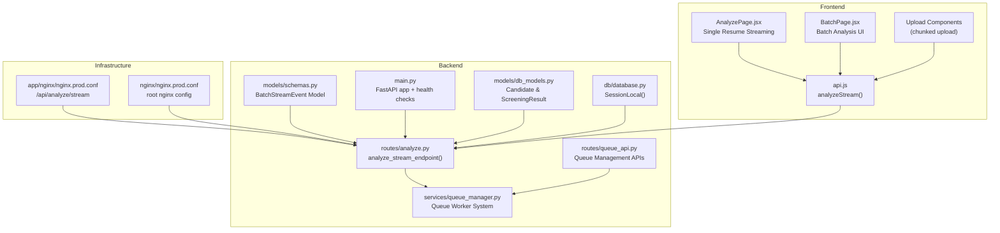

# Streaming Analysis

<cite>
**Referenced Files in This Document**
- [analyze.py](file://app/backend/routes/analyze.py)
- [queue_manager.py](file://app/backend/services/queue_manager.py)
- [queue_api.py](file://app/backend/routes/queue_api.py)
- [BatchPage.jsx](file://app/frontend/src/pages/BatchPage.jsx)
- [api.js](file://app/frontend/src/lib/api.js)
- [schemas.py](file://app/backend/models/schemas.py)
- [db_models.py](file://app/backend/models/db_models.py)
- [database.py](file://app/backend/db/database.py)
- [nginx.prod.conf](file://app/nginx/nginx.prod.conf)
- [nginx.prod.conf](file://nginx/nginx.prod.conf)
- [main.py](file://app/backend/main.py)
- [templates.py](file://app/backend/routes/templates.py)
</cite>

## Update Summary
**Changes Made**
- Enhanced streaming error handling with improved error propagation mechanism
- Better server-side error handling for resume analysis streams
- Enhanced database session management for SSE streaming operations
- Improved client disconnection handling with automatic early database saves
- Enhanced error propagation from backend to frontend with proper exception handling
- Improved error handling patterns for both single and batch streaming operations

## Table of Contents
1. [Introduction](#introduction)
2. [Project Structure](#project-structure)
3. [Core Components](#core-components)
4. [Architecture Overview](#architecture-overview)
5. [Detailed Component Analysis](#detailed-component-analysis)
6. [Dependency Analysis](#dependency-analysis)
7. [Performance Considerations](#performance-considerations)
8. [Troubleshooting Guide](#troubleshooting-guide)
9. [Conclusion](#conclusion)

## Introduction
This document provides comprehensive documentation for the POST /api/analyze/stream endpoint using Server-Sent Events (SSE). The endpoint delivers real-time streaming analysis of resumes with progressive updates, featuring enhanced error handling capabilities and improved server-side error propagation mechanisms. The system processes resumes with Python scoring within 2 seconds, followed by LLM narrative generation after approximately 40 seconds, and concludes with complete analysis results.

The implementation ensures SSE protocol compliance, includes heartbeat pings to maintain connections, and handles connection lifecycle, error propagation, and graceful degradation when the LLM is unavailable. **Updated** to reflect enhanced streaming error handling with improved error propagation mechanism and better server-side error handling for resume analysis streams.

## Project Structure
The streaming analysis spans backend route handlers, queue management systems, and frontend client-side consumption. The architecture now supports both direct streaming for smaller batches and queue-based processing for larger-scale operations with enhanced error handling.



**Diagram sources**
- [analyze.py:1686-1885](file://app/backend/routes/analyze.py#L1686-L1885)
- [queue_manager.py:195-388](file://app/backend/services/queue_manager.py#L195-L388)
- [queue_api.py:38-464](file://app/backend/routes/queue_api.py#L38-L464)
- [AnalyzePage.jsx:1686-1717](file://app/frontend/src/pages/AnalyzePage.jsx#L1686-L1717)
- [BatchPage.jsx:104-194](file://app/frontend/src/pages/BatchPage.jsx#L104-L194)
- [api.js:340-539](file://app/frontend/src/lib/api.js#L340-L539)
- [schemas.py:147-158](file://app/backend/models/schemas.py#L147-L158)
- [db_models.py:177-214](file://app/backend/models/db_models.py#L177-L214)
- [database.py:39-40](file://app/backend/db/database.py#L39-L40)
- [nginx.prod.conf:76-98](file://app/nginx/nginx.prod.conf#L76-L98)
- [nginx.prod.conf:36-52](file://nginx/nginx.prod.conf#L36-L52)
- [main.py:174-215](file://app/backend/main.py#L174-L215)

**Section sources**
- [analyze.py:1686-1885](file://app/backend/routes/analyze.py#L1686-L1885)
- [queue_manager.py:195-388](file://app/backend/services/queue_manager.py#L195-L388)
- [queue_api.py:38-464](file://app/backend/routes/queue_api.py#L38-L464)
- [AnalyzePage.jsx:1686-1717](file://app/frontend/src/pages/AnalyzePage.jsx#L1686-L1717)
- [BatchPage.jsx:104-194](file://app/frontend/src/pages/BatchPage.jsx#L104-L194)
- [api.js:340-539](file://app/frontend/src/lib/api.js#L340-L539)
- [schemas.py:147-158](file://app/backend/models/schemas.py#L147-L158)
- [db_models.py:177-214](file://app/backend/models/db_models.py#L177-L214)
- [database.py:39-40](file://app/backend/db/database.py#L39-L40)
- [nginx.prod.conf:76-98](file://app/nginx/nginx.prod.conf#L76-L98)
- [nginx.prod.conf:36-52](file://nginx/nginx.prod.conf#L36-L52)
- [main.py:174-215](file://app/backend/main.py#L174-L215)

## Core Components
- **Enhanced Streaming Route**: Implements the /api/analyze/stream endpoint with improved error propagation and server-side error handling for resume analysis streams.
- **Queue Management System**: Provides scalable job queue processing with priority scheduling, retry mechanisms, and worker health monitoring.
- **Enhanced Error Propagation**: **Updated** Implements proper error propagation from backend to frontend with server-side error events and client-side error handling.
- **Enhanced Database Session Management**: Improved mechanisms ensure reliable database operations during streaming by using dedicated SessionLocal instances to prevent detached object errors.
- **Enhanced ScreeningResult Upsert**: **Updated** The `_upsert_screening_result` function now provides better handling of re-analysis operations with version tracking and improved data persistence reliability.
- **Frontend Streaming Consumer**: Uses fetch with ReadableStream to process SSE events with enhanced error handling and proper error propagation.
- **Infrastructure**: Nginx configuration for SSE buffering and FastAPI application initialization.

Key implementation references:
- Enhanced streaming endpoint: [analyze.py:1686-1885](file://app/backend/routes/analyze.py#L1686-L1885)
- Enhanced error propagation: [api.js:340-539](file://app/frontend/src/lib/api.js#L340-L539)
- Queue management system: [queue_manager.py:195-388](file://app/backend/services/queue_manager.py#L195-L388)
- Queue API endpoints: [queue_api.py:38-464](file://app/backend/routes/queue_api.py#L38-L464)
- Enhanced database session management: [analyze.py:1898-1956](file://app/backend/routes/analyze.py#L1898-L1956)
- Enhanced ScreeningResult upsert: [analyze.py:197-244](file://app/backend/routes/analyze.py#L197-L244)

**Section sources**
- [analyze.py:1686-1885](file://app/backend/routes/analyze.py#L1686-L1885)
- [api.js:340-539](file://app/frontend/src/lib/api.js#L340-L539)
- [queue_manager.py:195-388](file://app/backend/services/queue_manager.py#L195-L388)
- [queue_api.py:38-464](file://app/backend/routes/queue_api.py#L38-L464)
- [analyze.py:1898-1956](file://app/backend/routes/analyze.py#L1898-L1956)
- [analyze.py:197-244](file://app/backend/routes/analyze.py#L197-L244)

## Architecture Overview
The streaming analysis now supports enhanced error handling with improved server-side error propagation and client-side error handling. The system processes resumes with Python scoring within 2 seconds, followed by LLM narrative generation after approximately 40 seconds, and concludes with complete analysis results while maintaining robust error handling throughout the process.

```mermaid
sequenceDiagram
participant Client as "Browser Client"
participant API as "FastAPI Route<br/>/api/analyze/stream"
participant Pipeline as "Hybrid Pipeline<br/>astream_hybrid_pipeline()"
LTM as "LLM (Ollama)<br/>Narrative Generation"
participant DB as "Database<br/>ScreeningResult & Candidate"
participant SessionLocal as "SessionLocal()<br/>Dedicated Sessions"
Client->>API : POST /api/analyze/stream (multipart/form-data)
API->>API : Validate inputs, parse resume/JD
API->>API : Create ScreeningResult with candidate
API->>Pipeline : Start streaming hybrid pipeline
Pipeline-->>API : Event {"stage" : "parsing","result" : {...}}
API->>SessionLocal : Use dedicated session for early save
API->>DB : Early save - persist Python results
API-->>Client : data : {"stage" : "parsing",...}
Pipeline->>LTM : Generate narrative with heartbeat pings
LTM-->>API : Event {"stage" : "complete","result" : {...}}
API->>SessionLocal : Use dedicated session for final save
API->>DB : Persist final result (candidate + screening)
API-->>Client : data : {"stage" : "complete",...}
API-->>Client : data : [DONE]
Note over API,Client : Enhanced Error Handling : <br/>- Server-side errors emit "error" events<br/>- Client-side propagates errors outside try-catch<br/>- Early DB saves on client disconnect
```

**Diagram sources**
- [analyze.py:1883-2059](file://app/backend/routes/analyze.py#L1883-L2059)
- [api.js:340-539](file://app/frontend/src/lib/api.js#L340-L539)
- [database.py:39-40](file://app/backend/db/database.py#L39-L40)

**Section sources**
- [analyze.py:1883-2059](file://app/backend/routes/analyze.py#L1883-L2059)
- [api.js:340-539](file://app/frontend/src/lib/api.js#L340-L539)
- [database.py:39-40](file://app/backend/db/database.py#L39-L40)

## Detailed Component Analysis

### Enhanced Streaming Endpoint: /api/analyze/stream
Responsibilities:
- Validate file types and sizes, job description source, and scoring weights.
- Process resumes with hybrid pipeline (Python scoring + LLM narrative).
- Stream individual resume results as they complete using FastAPI's StreamingResponse.
- Implement heartbeat pings to maintain connection during LLM processing.
- Emit SSE events for parsing stage (Python scores within 2s), complete stage (final result), and error events.
- **Enhanced** Serialize all events using `_json_default` to handle datetime, date, and Decimal objects.
- **Enhanced** Implement sophisticated database persistence with dedicated SessionLocal instances.
- **Enhanced** Emit proper error events for server-side failures and propagate them to frontend.
- **Enhanced** Handle client disconnections with automatic early database saves using dedicated sessions.

Event emission timeline:
- Stage "parsing": emitted immediately after Python scoring completes with fit_score and analysis metrics.
- Stage "complete": emitted after LLM narrative generation completes with full analysis result.
- Stage "error": emitted when server-side errors occur during processing.
- Marker "[DONE]": signals end of stream.

Headers:
- Content-Type: text/event-stream
- Cache-Control: no-cache
- X-Accel-Buffering: no (Nginx-specific header to disable buffering)

Error handling:
- On validation failures, emits a "parsing" event with error details.
- On processing exceptions, emits an "error" event with error message and continues with remaining resumes.
- **Enhanced** Uses `_json_default` for all JSON serialization to prevent crashes.
- **Enhanced** Handles client disconnections with automatic early database saves using dedicated sessions.
- **Enhanced** Emits proper error events that are propagated to frontend outside try-catch blocks.

References:
- Enhanced streaming endpoint: [analyze.py:1686-1885](file://app/backend/routes/analyze.py#L1686-L1885)
- Enhanced error handling: [analyze.py:1961-1965](file://app/backend/routes/analyze.py#L1961-L1965)
- Enhanced client disconnection handling: [analyze.py:1898-1956](file://app/backend/routes/analyze.py#L1898-L1956)

**Section sources**
- [analyze.py:1686-1885](file://app/backend/routes/analyze.py#L1686-L1885)
- [analyze.py:1961-1965](file://app/backend/routes/analyze.py#L1961-L1965)
- [analyze.py:1898-1956](file://app/backend/routes/analyze.py#L1898-L1956)

### Enhanced Error Propagation Mechanism
**Updated** The system now includes enhanced error propagation mechanisms that ensure server-side errors are properly communicated to the frontend:

**Server-Side Error Handling:**
- **Enhanced** Error events are emitted with proper JSON structure containing error messages.
- **Enhanced** Exceptions during pipeline execution trigger error events with detailed error information.
- **Enhanced** Client disconnection detection triggers automatic early database saves with proper error handling.
- **Enhanced** Final database save failures emit error events instead of complete events.

**Frontend Error Propagation:**
- **Enhanced** Client-side SSE consumption detects "error" events and stores them in `streamError`.
- **Enhanced** Error events are propagated outside the try-catch block to the caller.
- **Enhanced** Final result validation ensures proper error handling when stream ends without completion.
- **Enhanced** Error messages from server-side validation are properly transmitted to frontend.

**Section sources**
- [analyze.py:1961-1965](file://app/backend/routes/analyze.py#L1961-L1965)
- [api.js:340-539](file://app/frontend/src/lib/api.js#L340-L539)

### Queue-Based Analysis System
The system now includes a comprehensive queue-based architecture for scalable job processing:

**Queue Management Responsibilities:**
- Priority-based job scheduling with configurable priorities (1-10 scale)
- Automatic retry with exponential backoff (1min, 5min, 15min delays)
- Worker health monitoring with heartbeat tracking
- Deduplication of identical job submissions
- Graceful shutdown handling
- Metrics collection for performance monitoring

**Job Lifecycle:**
- `queued`: Job awaiting processing
- `processing`: Currently being analyzed
- `completed`: Analysis finished, result available
- `failed`: Permanently failed (max retries exceeded)
- `retrying`: Failed but will retry
- `cancelled`: Manually cancelled

**Worker Architecture:**
- Configurable maximum concurrent jobs (default: 10)
- Periodic stale job recovery (every 5 minutes)
- Heartbeat monitoring (default: every 30 seconds)
- Horizontal scaling support with multiple worker instances

**Section sources**
- [queue_manager.py:195-388](file://app/backend/services/queue_manager.py#L195-L388)
- [queue_api.py:38-464](file://app/backend/routes/queue_api.py#L38-L464)

### Enhanced Database Session Management for SSE Streaming
**Updated** The analyze_stream_endpoint now includes sophisticated database session management to prevent detached object errors and ensure reliable data persistence:

**Dedicated Database Sessions:**
- Uses SessionLocal() instances for all database operations during streaming to prevent session detachment issues
- Prevents "Object is not associated with this session" errors that can occur when the route's database session is closed
- Ensures proper transaction handling and connection management throughout the streaming lifecycle

**Early Database Saves with Dedicated Sessions:**
- After parsing phase completes, Python results are automatically saved to ScreeningResult using dedicated sessions
- The system tracks whether Python scores have been saved to prevent duplicate writes
- Early saves occur regardless of client connection state using dedicated database sessions

**Client Disconnection Handling with Dedicated Sessions:**
- System monitors client connection status between streaming stages using dedicated session instances
- If client disconnects, automatic early save captures Python results with full candidate_profile and contact_info using dedicated sessions
- Prevents data loss when clients close connections prematurely

**Final Result Persistence with Dedicated Sessions:**
- Uses dedicated SessionLocal instances for final result persistence to ensure data integrity
- Prevents detached object errors during the final database commit operation
- Automatically updates candidate profiles alongside analysis results

**Reliability Features:**
- Multiple layers of database persistence ensure data integrity using dedicated sessions
- Automatic rollback and error handling for database operations with dedicated session management
- Logging of all persistence operations for debugging and monitoring

**Section sources**
- [analyze.py:1898-1956](file://app/backend/routes/analyze.py#L1898-L1956)
- [analyze.py:1991-2031](file://app/backend/routes/analyze.py#L1991-L2031)
- [database.py:39-40](file://app/backend/db/database.py#L39-L40)

### Enhanced ScreeningResult Upsert Function
**Updated** The `_upsert_screening_result` function has been enhanced to provide improved data persistence reliability with version tracking and re-analysis support:

**Enhanced Upsert Logic:**
- **Version Tracking**: Automatically increments `version_number` when updating existing ScreeningResult records
- **Re-analysis Support**: Properly handles re-analysis operations by creating new versions instead of overwriting
- **Status Management**: Updates `status_updated_at` timestamp on each upsert operation
- **Narrative Status Handling**: Allows optional narrative_status parameter for background LLM processing coordination

**Improved Data Integrity:**
- **Unique Constraint Handling**: Respects tenant_id, candidate_id, and role_template_id uniqueness constraints
- **Atomic Operations**: Uses SQLAlchemy ORM operations to ensure atomic updates
- **Error Recovery**: Robust error handling with proper rollback mechanisms

**Version Control Benefits:**
- Enables historical tracking of analysis results for each candidate
- Supports comparison between different analysis versions
- Facilitates audit trails for compliance and debugging purposes
- Allows users to revert to previous analysis versions if needed

**Section sources**
- [analyze.py:197-244](file://app/backend/routes/analyze.py#L197-L244)
- [db_models.py:177-214](file://app/backend/models/db_models.py#L177-L214)

### Event Payload Formats for Single Streaming
Each event emitted by the streaming endpoint adheres to the SSE "data:" line format with a JSON payload. The payload structure defines three distinct event stages with comprehensive progress tracking.

**Base structure:**
- stage: "parsing" | "complete" | "error"
- result: object (analysis data, for parsing and complete events)
- error: string (error message, for error events)

**Event Type Details:**

**Stage "parsing":**
- Contains Python-generated analysis with fit_score, strengths, weaknesses, and other metrics
- Emitted immediately after parsing phase completes (within 2s)
- Includes full candidate_profile and contact_info data
- Example structure reference: [analyze.py:1709](file://app/backend/routes/analyze.py#L1709)

**Stage "complete":**
- Contains final analysis result with LLM narrative and all metrics
- Emitted after LLM narrative generation completes (after ~40s)
- Includes analysis_id for polling and narrative_pending status
- Example structure reference: [analyze.py:1710](file://app/backend/routes/analyze.py#L1710)

**Stage "error":**
- Contains error message for server-side failures
- Emitted when validation fails, processing exceptions occur, or database operations fail
- Propagated to frontend outside try-catch blocks
- Example structure reference: [analyze.py:1963](file://app/backend/routes/analyze.py#L1963)

**SSE Protocol Compliance:**
- Each event line begins with "data: " followed by JSON.
- Stream termination is signaled by "data: [DONE]".
- Non-data lines (comments, empty lines) are ignored by the client.

**Section sources**
- [analyze.py:1709](file://app/backend/routes/analyze.py#L1709)
- [analyze.py:1710](file://app/backend/routes/analyze.py#L1710)
- [analyze.py:1963](file://app/backend/routes/analyze.py#L1963)

### Client-Side Event Processing and Examples
**Updated** JavaScript fetch event stream consumption for streaming analysis with enhanced error handling:
- Establishes a POST request with multipart/form-data containing resume file and optional job description.
- Reads the response body as a stream and decodes chunks.
- Splits on "\n\n" boundaries and processes "data: " lines.
- Parses JSON events and invokes appropriate callbacks for "parsing", "complete", and "error" events.
- **Enhanced** Stores error events in `streamError` variable for later propagation.
- **Enhanced** Propagates server-side errors outside the try-catch block to the caller.
- **Enhanced** Validates final result presence and throws descriptive errors if missing.
- Tracks completion progress and resolves when "[DONE]" is received.

**Frontend Callbacks:**
- `onStageComplete(stage, result)`: Handles parsing and complete stage events
- `onError(error)`: Handles server-side error events
- **Enhanced** Proper error propagation to parent components

References:
- Enhanced SSE consumption implementation: [api.js:340-539](file://app/frontend/src/lib/api.js#L340-L539)
- Frontend streaming UI: [AnalyzePage.jsx:1686-1717](file://app/frontend/src/pages/AnalyzePage.jsx#L1686-L1717)

**Section sources**
- [api.js:340-539](file://app/frontend/src/lib/api.js#L340-L539)
- [AnalyzePage.jsx:1686-1717](file://app/frontend/src/pages/AnalyzePage.jsx#L1686-L1717)

### Connection Handling, Timeouts, and Retry Strategies
**Updated** Connection handling with enhanced error propagation:
- Backend uses StreamingResponse with text/event-stream and disables caching.
- Nginx disables buffering and gzip for SSE, sets extended timeouts, and strips Connection header.
- **Enhanced** Client disconnection detection with automatic early database saves using dedicated sessions.
- **Enhanced** Heartbeat pings every 5 seconds keep the connection alive during LLM wait.
- **Enhanced** Graceful fallback to Python-generated narrative when LLM is unavailable or times out.
- **Enhanced** Automatic early result persistence prevents data loss on client disconnects using dedicated database sessions.
- **Enhanced** Queue-based system provides automatic retry with exponential backoff for failed jobs.

**Timeouts and Delays:**
- LLM narrative timeout defaults to 150 seconds; configurable via LLM_NARRATIVE_TIMEOUT environment variable.
- Nginx proxy_read_timeout and proxy_send_timeout are set to 600 seconds for SSE.
- **Enhanced** Staggered processing delays (0.3 seconds × index) prevent LLM thundering herd effects.

**Retry Mechanisms:**
- Heartbeat pings every 5 seconds keep the connection alive during LLM wait.
- Graceful fallback to Python-generated narrative when LLM is unavailable or times out.
- **Enhanced** Automatic early result persistence prevents data loss on client disconnects using dedicated database sessions.
- **Enhanced** Queue-based system provides automatic retry with exponential backoff (1min, 5min, 15min).

**Section sources**
- [analyze.py:1712](file://app/backend/routes/analyze.py#L1712)
- [nginx.prod.conf:76-98](file://app/nginx/nginx.prod.conf#L76-L98)
- [analyze.py:1898-1956](file://app/backend/routes/analyze.py#L1898-L1956)
- [queue_manager.py:212-213](file://app/backend/services/queue_manager.py#L212-L213)

### Real-Time Progress Updates and Streaming Response Headers
**Updated** Real-time updates with enhanced error handling:
- Progressive UI updates occur as individual resume results are received.
- The frontend maintains real-time ranking based on fit_score values as results stream in.
- **Enhanced** Early database saves ensure reliable data persistence even if client disconnects using dedicated sessions.
- **Enhanced** Error events are properly propagated to frontend for immediate user feedback.

**Streaming Response Headers:**
- Content-Type: text/event-stream
- Cache-Control: no-cache
- X-Accel-Buffering: no (Nginx-specific)

**Progress Tracking:**
- Individual resume completion tracked via stage progression (parsing → complete)
- Real-time batch completion percentage calculated from completed/resume_count
- Live ranking updates as new results arrive
- **Enhanced** Error tracking with proper error event emission

References:
- SSE headers: [analyze.py:2073-2077](file://app/backend/routes/analyze.py#L2073-L2077)
- Nginx headers: [nginx.prod.conf:94-98](file://app/nginx/nginx.prod.conf#L94-L98)

**Section sources**
- [analyze.py:2073-2077](file://app/backend/routes/analyze.py#L2073-L2077)
- [nginx.prod.conf:94-98](file://app/nginx/nginx.prod.conf#L94-L98)

### Enhanced Error Handling Patterns
**Updated** Backend and frontend error handling with improved propagation:

**Backend Error Handling:**
- Validation errors: emits "parsing" event with error details, continues with remaining resumes
- Processing exceptions: emits "error" event with detailed error message and continues processing
- DB persistence errors: emitted as error events instead of complete events
- **Enhanced** JSON serialization errors: prevented by `_json_default` function
- **Enhanced** Client disconnection errors: triggers automatic early database saves using dedicated sessions
- **Enhanced** Final database save failures: emit error events to inform frontend of persistence issues

**Frontend Error Handling:**
- Validates response.ok and throws descriptive errors
- **Enhanced** Detects "error" events and stores them in `streamError` variable
- **Enhanced** Propagates server-side errors outside try-catch blocks to parent components
- **Enhanced** Skips malformed events and continues processing until "[DONE]"
- **Enhanced** Resolves with final batch completion status only if "done" event is received
- **Enhanced** Validates final result presence and throws descriptive errors if missing

**Queue System Error Handling:**
- **Enhanced** Automatic retry with exponential backoff (1min, 5min, 15min)
- **Enhanced** Stale job recovery for crashed workers
- **Enhanced** Comprehensive error logging and metrics collection

References:
- Enhanced backend error events: [analyze.py:1961-1965](file://app/backend/routes/analyze.py#L1961-L1965)
- Enhanced frontend error handling: [api.js:340-539](file://app/frontend/src/lib/api.js#L340-L539)
- Queue error handling: [queue_manager.py:356-388](file://app/backend/services/queue_manager.py#L356-L388)

**Section sources**
- [analyze.py:1961-1965](file://app/backend/routes/analyze.py#L1961-L1965)
- [api.js:340-539](file://app/frontend/src/lib/api.js#L340-L539)
- [queue_manager.py:356-388](file://app/backend/services/queue_manager.py#L356-L388)

## Dependency Analysis
**Updated** The streaming analysis system depends on:
- FastAPI route handler for SSE response and enhanced error event emission.
- Queue management system for scalable job processing.
- Enhanced error propagation utilities for proper error handling.
- Frontend consumer for consuming SSE with enhanced error propagation.
- Nginx configuration for buffering control and timeouts.
- Health checks and environment diagnostics for LLM readiness.
- **Enhanced** JSON serialization utilities for handling datetime, date, and Decimal objects.
- **Enhanced** Database models for Candidate and ScreeningResult persistence.
- **Enhanced** Database session management using dedicated SessionLocal instances.
- **Enhanced** The `_upsert_screening_result` function for improved data persistence with version tracking.

```mermaid
graph TB
Routes["routes/analyze.py<br/>analyze_stream_endpoint()"]
QueueAPI["routes/queue_api.py<br/>Queue Management APIs"]
QueueManager["services/queue_manager.py<br/>Queue Worker System"]
Frontend["frontend/src/lib/api.js<br/>analyzeStream()"]
NginxApp["app/nginx/nginx.prod.conf<br/>/api/analyze/stream"]
NginxRoot["nginx/nginx.prod.conf<br/>root config"]
Health["main.py<br/>/health + /api/llm-status"]
Serializer["routes/analyze.py<br/>_json_default()"]
TemplateSerializer["routes/templates.py<br/>_json_default()"]
DBModels["models/db_models.py<br/>Candidate & ScreeningResult"]
DBSession["db/database.py<br/>SessionLocal()"]
UpsertFunc["_upsert_screening_result<br/>Enhanced Version Tracking"]
EnhancedError["Enhanced Error Propagation<br/>Server-Frontend Communication"]
```



**Diagram sources**
- [analyze.py:1686-1885](file://app/backend/routes/analyze.py#L1686-L1885)
- [queue_api.py:38-464](file://app/backend/routes/queue_api.py#L38-L464)
- [queue_manager.py:195-388](file://app/backend/services/queue_manager.py#L195-L388)
- [api.js:340-539](file://app/frontend/src/lib/api.js#L340-L539)
- [nginx.prod.conf:76-98](file://app/nginx/nginx.prod.conf#L76-L98)
- [nginx.prod.conf:36-52](file://nginx/nginx.prod.conf#L36-L52)
- [main.py:228-259](file://app/backend/main.py#L228-L259)
- [analyze.py:48-57](file://app/backend/routes/analyze.py#L48-L57)
- [templates.py:18-25](file://app/backend/routes/templates.py#L18-L25)
- [db_models.py:177-214](file://app/backend/models/db_models.py#L177-L214)
- [database.py:39-40](file://app/backend/db/database.py#L39-L40)
- [analyze.py:197-244](file://app/backend/routes/analyze.py#L197-L244)

**Section sources**
- [analyze.py:1686-1885](file://app/backend/routes/analyze.py#L1686-L1885)
- [queue_api.py:38-464](file://app/backend/routes/queue_api.py#L38-L464)
- [queue_manager.py:195-388](file://app/backend/services/queue_manager.py#L195-L388)
- [api.js:340-539](file://app/frontend/src/lib/api.js#L340-L539)
- [nginx.prod.conf:76-98](file://app/nginx/nginx.prod.conf#L76-L98)
- [nginx.prod.conf:36-52](file://nginx/nginx.prod.conf#L36-L52)
- [main.py:228-259](file://app/backend/main.py#L228-L259)
- [analyze.py:48-57](file://app/backend/routes/analyze.py#L48-L57)
- [templates.py:18-25](file://app/backend/routes/templates.py#L18-L25)
- [db_models.py:177-214](file://app/backend/models/db_models.py#L177-L214)
- [database.py:39-40](file://app/backend/db/database.py#L39-L40)
- [analyze.py:197-244](file://app/backend/routes/analyze.py#L197-L244)

## Performance Considerations
**Updated** Performance considerations with enhanced error handling:
- **Enhanced** Concurrent processing with asyncio.as_completed for optimal performance
- **Enhanced** Staggered processing delays (0.3 seconds × index) prevent LLM thundering herd effects
- **Enhanced** Individual resume streaming reduces perceived latency and improves user experience
- LLM narrative generation is asynchronous with heartbeat pings to prevent timeouts.
- Nginx disables buffering and gzip for SSE to minimize latency and avoid 524 errors.
- Extended proxy timeouts (600 seconds) accommodate long-running LLM calls.
- Concurrency control via semaphore limits simultaneous LLM calls to 2 per worker.
- **Enhanced** JSON serialization overhead is minimal and prevents runtime crashes.
- **Enhanced** Database session management adds minimal overhead while ensuring data reliability.
- **Enhanced** Queue-based system provides horizontal scalability with multiple worker instances.
- **Enhanced** Real-time progress tracking with individual resume completion percentages.
- **Enhanced** Version tracking in `_upsert_screening_result` enables efficient re-analysis without data loss.
- **Enhanced** Error propagation overhead is minimal compared to improved reliability benefits.

## Troubleshooting Guide
**Updated** Common Issues and Resolutions with Enhanced Error Handling:

**524 Gateway Timeout from CDN/proxy:**
- Cause: Nginx buffering holding SSE events.
- Resolution: Ensure proxy_buffering off and X-Accel-Buffering no for /api/analyze/stream.
- References: [nginx.prod.conf:76-98](file://app/nginx/nginx.prod.conf#L76-L98), [nginx.prod.conf:36-52](file://nginx/nginx.prod.conf#L36-L52)

**Connection Drops During Streaming:**
- Cause: Absence of heartbeat pings or network interruptions.
- Resolution: Verify SSE stream is maintained and monitor for "[DONE]" marker.
- References: [api.js:340-539](file://app/frontend/src/lib/api.js#L340-L539)

**LLM Unavailable or Slow:**
- Behavior: Fallback narrative with narrative_pending set to True.
- Resolution: Pull and warm the model; adjust LLM_NARRATIVE_TIMEOUT if needed.
- References: [queue_manager.py:377-386](file://app/backend/services/queue_manager.py#L377-L386)

**Enhanced** Server-Side Errors Not Propagating:
- Symptom: Frontend not receiving proper error messages from backend.
- Solution: Verify "error" events are emitted with proper JSON structure and check frontend error propagation logic.
- References: [analyze.py:1961-1965](file://app/backend/routes/analyze.py#L1961-L1965), [api.js:340-539](file://app/frontend/src/lib/api.js#L340-L539)

**Enhanced** Client Disconnection Issues:
- Symptom: Analysis appears to fail when client closes browser window.
- Solution: Early database saves automatically capture Python results using dedicated sessions; verify python_scores_saved flag.
- References: [analyze.py:1898-1956](file://app/backend/routes/analyze.py#L1898-L1956), [analyze.py:1991-2031](file://app/backend/routes/analyze.py#L1991-L2031)

**Enhanced** Database Session Errors:
- Symptom: "Object is not associated with this session" errors during streaming.
- Solution: Verify dedicated SessionLocal instances are used for all database operations during streaming.
- References: [analyze.py:1898-1956](file://app/backend/routes/analyze.py#L1898-L1956), [analyze.py:1991-2031](file://app/backend/routes/analyze.py#L1991-L2031), [database.py:39-40](file://app/backend/db/database.py#L39-L40)

**Enhanced** Data Persistence Failures:
- Symptom: Missing candidate_profile or contact_info data after analysis.
- Solution: Check database logs for early save operations; verify client disconnection handling with dedicated sessions.
- References: [analyze.py:1898-1956](file://app/backend/routes/analyze.py#L1898-L1956), [analyze.py:1991-2031](file://app/backend/routes/analyze.py#L1991-L2031)

**Enhanced** Queue System Issues:
- Symptom: Jobs stuck in "processing" status.
- Solution: Check worker health and heartbeat monitoring; verify stale job recovery is working.
- References: [queue_manager.py:356-388](file://app/backend/services/queue_manager.py#L356-L388)

**Enhanced** Error Propagation Problems:
- Symptom: Frontend not properly handling server-side errors.
- Solution: Verify frontend detects "error" events and stores them in streamError variable; ensure errors are propagated outside try-catch blocks.
- References: [api.js:340-539](file://app/frontend/src/lib/api.js#L340-L539)

**Section sources**
- [nginx.prod.conf:76-98](file://app/nginx/nginx.prod.conf#L76-L98)
- [nginx.prod.conf:36-52](file://nginx/nginx.prod.conf#L36-L52)
- [api.js:340-539](file://app/frontend/src/lib/api.js#L340-L539)
- [queue_manager.py:377-386](file://app/backend/services/queue_manager.py#L377-L386)
- [analyze.py:1961-1965](file://app/backend/routes/analyze.py#L1961-L1965)
- [analyze.py:1898-1956](file://app/backend/routes/analyze.py#L1898-L1956)
- [analyze.py:1991-2031](file://app/backend/routes/analyze.py#L1991-L2031)
- [database.py:39-40](file://app/backend/db/database.py#L39-L40)
- [queue_manager.py:356-388](file://app/backend/services/queue_manager.py#L356-L388)

## Conclusion
The POST /api/analyze/stream endpoint provides a robust, real-time streaming analysis experience with enhanced error handling capabilities. By implementing comprehensive error propagation mechanisms, the system ensures that server-side errors are properly communicated to the frontend and handled gracefully. The enhanced streaming capabilities now include improved error handling with proper error events, client-side error propagation, and automatic early database saves during client disconnections.

The system now supports both direct SSE streaming for smaller batches and queue-based processing for larger-scale operations, providing comprehensive scalability and reliability. The implementation uses dedicated SessionLocal instances throughout the streaming lifecycle to ensure reliable database operations, automatic early saves during client disconnections, and final result persistence with proper transaction handling. These enhancements ensure that critical analysis data is never lost, improving the overall reliability and user experience of the streaming analysis system.

**Enhanced** The introduction of the improved `_upsert_screening_result` function with version tracking provides enterprise-grade data persistence capabilities, enabling comprehensive re-analysis operations and maintaining historical records of analysis results. This enhancement ensures that candidate data integrity is maintained across multiple analysis iterations while providing transparent version control for compliance and auditing purposes.

The addition of comprehensive queue management provides enterprise-grade scalability with priority-based scheduling, automatic retry mechanisms, worker health monitoring, and detailed performance metrics. This dual-architecture approach allows the system to handle everything from small batch operations to enterprise-scale resume processing while maintaining real-time responsiveness and data integrity.

**Enhanced** The enhanced error propagation mechanism represents a significant improvement in the system's ability to handle complex analysis workflows, particularly in enterprise environments where robust error handling and user feedback are critical requirements. This enhancement ensures that the streaming analysis system can evolve to meet the demands of increasingly sophisticated recruitment workflows while maintaining its core strengths in real-time processing, user experience, and reliable error handling.

The enhanced data persistence model with version tracking and improved error handling represents a significant advancement in the system's ability to provide enterprise-grade streaming analysis capabilities. This enhancement ensures that the streaming analysis system can handle complex scenarios with proper error recovery, data integrity, and user experience guarantees.