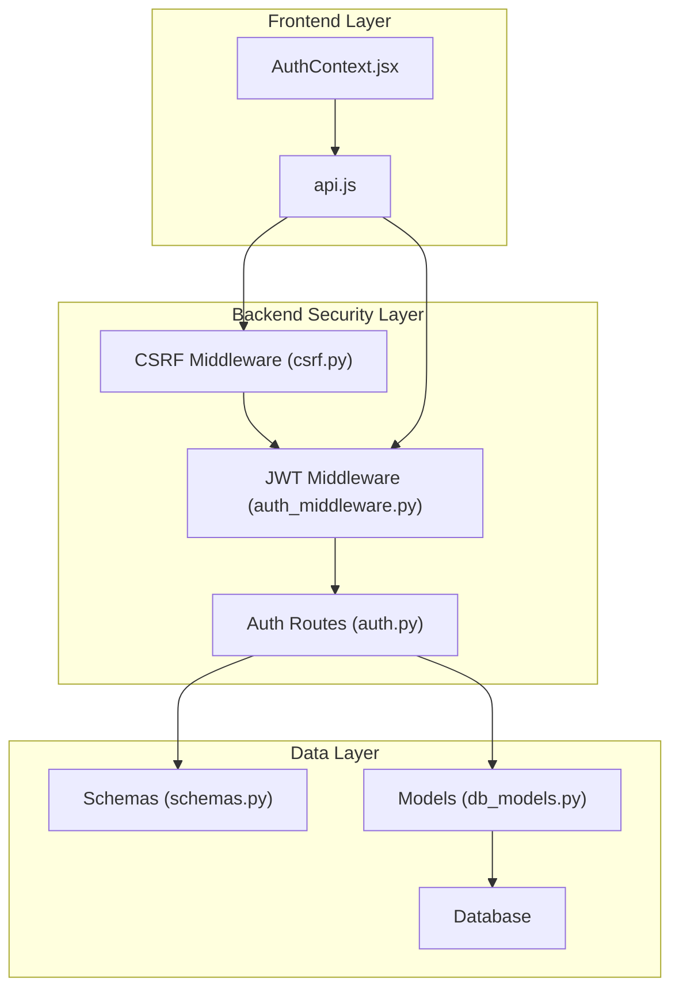
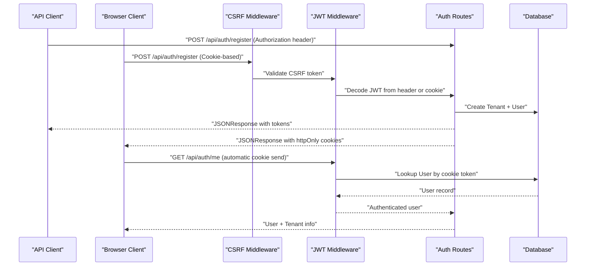
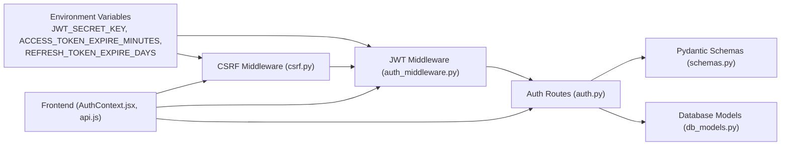
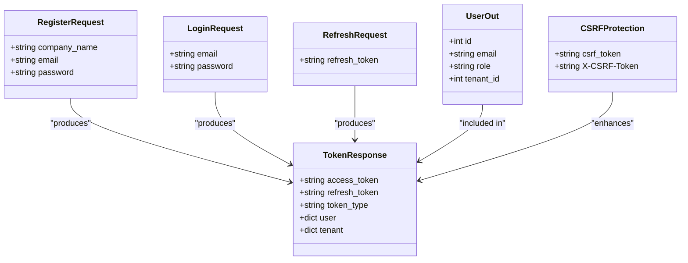

# Authentication Endpoints

<cite>
**Referenced Files in This Document**
- [auth.py](file://app/backend/routes/auth.py)
- [auth_middleware.py](file://app/backend/middleware/auth.py)
- [csrf.py](file://app/backend/middleware/csrf.py)
- [schemas.py](file://app/backend/models/schemas.py)
- [db_models.py](file://app/backend/models/db_models.py)
- [main.py](file://app/backend/main.py)
- [AuthContext.jsx](file://app/frontend/src/contexts/AuthContext.jsx)
- [api.js](file://app/frontend/src/lib/api.js)
- [docker-compose.yml](file://docker-compose.yml)
- [docker-compose.prod.yml](file://docker-compose.prod.yml)
- [test_auth.py](file://app/backend/tests/test_auth.py)
</cite>

## Update Summary
**Changes Made**
- Added comprehensive CSRF protection middleware documentation
- Updated authentication patterns to support dual client types (API and browser)
- Enhanced token management documentation with cookie-based authentication
- Added security considerations for CSRF protection and cookie handling
- Updated frontend integration to reflect cookie-based authentication

## Table of Contents
1. [Introduction](#introduction)
2. [Project Structure](#project-structure)
3. [Core Components](#core-components)
4. [Architecture Overview](#architecture-overview)
5. [Detailed Component Analysis](#detailed-component-analysis)
6. [Dependency Analysis](#dependency-analysis)
7. [Performance Considerations](#performance-considerations)
8. [Troubleshooting Guide](#troubleshooting-guide)
9. [Conclusion](#conclusion)

## Introduction
This document provides comprehensive API documentation for the authentication endpoints in the Resume AI by ThetaLogics platform. The system now supports dual authentication patterns for both API clients and browser clients, with enhanced security measures including CSRF protection and improved token management.

Key authentication features:
- **Dual Authentication Patterns**: Supports both API clients (Authorization header) and browser clients (httpOnly cookies)
- **CSRF Protection**: Implements double-submit cookie pattern for browser clients
- **Enhanced Security**: Improved token management with secure cookie handling
- **Automatic Token Handling**: Frontend automatically manages cookies and CSRF tokens

## Project Structure
The authentication system spans backend routes, middleware, Pydantic models, database models, and frontend client integration with enhanced security layers:

- **Backend routes** define authentication endpoints and handle dual client authentication
- **JWT middleware** validates tokens from both Authorization headers and cookies
- **CSRF middleware** protects browser clients with double-submit cookie pattern
- **Pydantic schemas** define request/response contracts
- **Database models** represent users, tenants, and related entities
- **Frontend** manages cookies automatically and handles CSRF tokens



**Diagram sources**
- [auth.py:1-209](file://app/backend/routes/auth.py#L1-L209)
- [auth_middleware.py:1-63](file://app/backend/middleware/auth_middleware.py#L1-L63)
- [csrf.py:1-58](file://app/backend/middleware/csrf.py#L1-L58)
- [schemas.py:140-171](file://app/backend/models/schemas.py#L140-L171)
- [db_models.py:62-77](file://app/backend/models/db_models.py#L62-L77)
- [AuthContext.jsx:1-71](file://app/frontend/src/contexts/AuthContext.jsx#L1-L71)
- [api.js:1-414](file://app/frontend/src/lib/api.js#L1-L414)

**Section sources**
- [auth.py:1-209](file://app/backend/routes/auth.py#L1-L209)
- [auth_middleware.py:1-63](file://app/backend/middleware/auth_middleware.py#L1-L63)
- [csrf.py:1-58](file://app/backend/middleware/csrf.py#L1-L58)
- [schemas.py:140-171](file://app/backend/models/schemas.py#L140-L171)
- [db_models.py:62-77](file://app/backend/models/db_models.py#L62-L77)
- [AuthContext.jsx:1-71](file://app/frontend/src/contexts/AuthContext.jsx#L1-L71)
- [api.js:1-414](file://app/frontend/src/lib/api.js#L1-L414)

## Core Components
- **Authentication routes** module defines endpoints under /api/auth with dual client support
- **JWT middleware** validates tokens from both Authorization headers and cookies
- **CSRF middleware** implements double-submit cookie pattern for browser security
- **Pydantic models** define request/response schemas
- **Database models** represent Users and Tenants
- **Frontend client** manages cookies automatically and handles CSRF tokens

Key implementation references:
- Routes: [auth.py:108-209](file://app/backend/routes/auth.py#L108-L209)
- JWT Middleware: [auth_middleware.py:26-56](file://app/backend/middleware/auth_middleware.py#L26-L56)
- CSRF Middleware: [csrf.py:13-57](file://app/backend/middleware/csrf.py#L13-L57)
- Schemas: [schemas.py:140-171](file://app/backend/models/schemas.py#L140-L171)
- Models: [db_models.py:62-77](file://app/backend/models/db_models.py#L62-L77)

**Section sources**
- [auth.py:108-209](file://app/backend/routes/auth.py#L108-L209)
- [auth_middleware.py:26-56](file://app/backend/middleware/auth_middleware.py#L26-L56)
- [csrf.py:13-57](file://app/backend/middleware/csrf.py#L13-L57)
- [schemas.py:140-171](file://app/backend/models/schemas.py#L140-L171)
- [db_models.py:62-77](file://app/backend/models/db_models.py#L62-L77)

## Architecture Overview
The authentication flow now integrates CSRF protection, dual client authentication, and enhanced security measures.



**Diagram sources**
- [auth.py:57-104](file://app/backend/routes/auth.py#L57-L104)
- [auth_middleware.py:31-37](file://app/backend/middleware/auth_middleware.py#L31-L37)
- [csrf.py:33-57](file://app/backend/middleware/csrf.py#L33-L57)
- [AuthContext.jsx:13-25](file://app/frontend/src/contexts/AuthContext.jsx#L13-L25)

## Detailed Component Analysis

### POST /api/auth/register
Purpose: Register a new user, create a tenant, hash the password, and issue tokens with enhanced security for both API and browser clients.

**Updated** Enhanced with CSRF protection and cookie-based token delivery for browser clients.

- **Request body schema**: RegisterRequest
  - Fields:
    - company_name: string
    - email: string
    - password: string
- **Response**: JSONResponse with both JSON body and httpOnly cookies
  - Fields:
    - access_token: string (sent in response body for API clients)
    - refresh_token: string (sent in response body for API clients)
    - token_type: string (default "bearer")
    - user: dict with id, email, role, tenant_id
    - tenant: dict with id, name, slug
  - **Cookies** (browser clients only):
    - access_token: httpOnly cookie with short expiration
    - refresh_token: httpOnly cookie with long expiration
    - csrf_token: non-httpOnly cookie for CSRF protection

Validation and business rules:
- Email uniqueness: Raises HTTP 400 if email already exists
- Password length: Minimum 8 characters; otherwise HTTP 400
- Tenant creation: Slug derived from company_name; collisions auto-incremented
- Role assignment: First user gets admin role
- Token expiry: Controlled by environment variables ACCESS_TOKEN_EXPIRE_MINUTES and REFRESH_TOKEN_EXPIRE_DAYS
- CSRF protection: Browser clients must have matching CSRF token

Success response example:
```json
{
  "access_token": "<JWT_ACCESS_TOKEN>",
  "refresh_token": "<JWT_REFRESH_TOKEN>",
  "token_type": "bearer",
  "user": {
    "id": 1,
    "email": "user@example.com",
    "role": "admin",
    "tenant_id": 1
  },
  "tenant": {
    "id": 1,
    "name": "Example Corp",
    "slug": "example-corp"
  }
}
```

**Section sources**
- [auth.py:108-142](file://app/backend/routes/auth.py#L108-L142)
- [auth.py:57-104](file://app/backend/routes/auth.py#L57-L104)
- [csrf.py:47-55](file://app/backend/middleware/csrf.py#L47-L55)

### POST /api/auth/login
Purpose: Authenticate an existing user and issue tokens with dual client support.

**Updated** Now supports both API clients (Authorization header) and browser clients (cookie-based authentication).

- **Request body schema**: LoginRequest
  - Fields:
    - email: string
    - password: string
- **Response**: JSONResponse with enhanced security for browser clients

**Authentication Flow**:
- **API Clients**: Use Authorization header with Bearer token
- **Browser Clients**: Use httpOnly cookies automatically sent with requests

Validation and business rules:
- User lookup by email and active status
- Password verification against hashed password
- Token issuance mirrors register flow with configurable expirations
- CSRF protection for browser clients

Success response example:
```json
{
  "access_token": "<JWT_ACCESS_TOKEN>",
  "refresh_token": "<JWT_REFRESH_TOKEN>",
  "token_type": "bearer",
  "user": {
    "id": 1,
    "email": "user@example.com",
    "role": "admin",
    "tenant_id": 1
  },
  "tenant": {
    "id": 1,
    "name": "Example Corp",
    "slug": "example-corp"
  }
}
```

**Section sources**
- [auth.py:145-156](file://app/backend/routes/auth.py#L145-L156)
- [auth_middleware.py:31-37](file://app/backend/middleware/auth_middleware.py#L31-L37)
- [csrf.py:42-45](file://app/backend/middleware/csrf.py#L42-L45)

### POST /api/auth/refresh
Purpose: Validate a refresh token and issue new tokens with dual client support.

**Updated** Enhanced to support both API clients (body parameter) and browser clients (cookie-based).

- **Request body schema**: RefreshRequest (optional for API clients)
  - Fields:
    - refresh_token: string (for API clients)
- **Response**: JSONResponse with refreshed tokens

**Client Type Detection**:
- **API Clients**: Must provide refresh_token in request body
- **Browser Clients**: Refresh token is read from httpOnly cookie automatically

Validation and business rules:
- Decode JWT with HS256 using SECRET_KEY
- Verify token type equals "refresh"
- Lookup user by sub and ensure active status
- Issue new access token and new refresh token
- CSRF protection for browser clients

Success response example:
```json
{
  "access_token": "<NEW_ACCESS_TOKEN>",
  "refresh_token": "<NEW_REFRESH_TOKEN>",
  "token_type": "bearer",
  "user": {
    "id": 1,
    "email": "user@example.com",
    "role": "admin",
    "tenant_id": 1
  },
  "tenant": {
    "id": 1,
    "name": "Example Corp",
    "slug": "example-corp"
  }
}
```

**Section sources**
- [auth.py:159-189](file://app/backend/routes/auth.py#L159-L189)
- [auth_middleware.py:31-37](file://app/backend/middleware/auth_middleware.py#L31-L37)
- [csrf.py:42-45](file://app/backend/middleware/csrf.py#L42-L45)

### GET /api/auth/me
Purpose: Retrieve currently authenticated user and associated tenant with dual client support.

**Updated** Enhanced to work seamlessly with both API and browser authentication methods.

- **Authentication**: Works with both Authorization header and httpOnly cookies
- **Response schema**: dict with user and tenant keys
  - user: UserOut fields (id, email, role, tenant_id)
  - tenant: dict with id, name, slug (may be null if tenant not found)

**Client Type Support**:
- **API Clients**: Require Authorization: Bearer <access_token> header
- **Browser Clients**: Automatically send httpOnly cookie with request

Success response example:
```json
{
  "user": {
    "id": 1,
    "email": "user@example.com",
    "role": "admin",
    "tenant_id": 1
  },
  "tenant": {
    "id": 1,
    "name": "Example Corp",
    "slug": "example-corp"
  }
}
```

**Section sources**
- [auth.py:192-198](file://app/backend/routes/auth.py#L192-L198)
- [auth_middleware.py:31-37](file://app/backend/middleware/auth_middleware.py#L31-L37)

### POST /api/auth/logout
Purpose: Clear all authentication cookies and terminate browser session.

**New** Dedicated logout endpoint to properly clear authentication state.

- **Response**: JSONResponse with success message
- **Actions**:
  - Delete access_token cookie
  - Delete refresh_token cookie
  - Delete csrf_token cookie

**Section sources**
- [auth.py:201-209](file://app/backend/routes/auth.py#L201-L209)

## Dependency Analysis
Authentication now depends on enhanced security layers:

- **JWT secret key and algorithm** from environment
- **CSRF middleware** for browser client protection
- **Database sessions** for user and tenant persistence
- **Pydantic schemas** for request/response validation
- **Frontend axios interceptors** for automatic cookie and CSRF handling



**Diagram sources**
- [auth.py:26-27](file://app/backend/routes/auth.py#L26-L27)
- [auth_middleware.py:13-21](file://app/backend/middleware/auth_middleware.py#L13-L21)
- [csrf.py:13-57](file://app/backend/middleware/csrf.py#L13-L57)
- [schemas.py:140-171](file://app/backend/models/schemas.py#L140-L171)
- [db_models.py:62-77](file://app/backend/models/db_models.py#L62-L77)
- [AuthContext.jsx:13-25](file://app/frontend/src/contexts/AuthContext.jsx#L13-L25)
- [api.js:7-31](file://app/frontend/src/lib/api.js#L7-L31)

**Section sources**
- [auth.py:26-27](file://app/backend/routes/auth.py#L26-L27)
- [auth_middleware.py:13-21](file://app/backend/middleware/auth_middleware.py#L13-L21)
- [csrf.py:13-57](file://app/backend/middleware/csrf.py#L13-L57)
- [schemas.py:140-171](file://app/backend/models/schemas.py#L140-L171)
- [db_models.py:62-77](file://app/backend/models/db_models.py#L62-L77)
- [AuthContext.jsx:13-25](file://app/frontend/src/contexts/AuthContext.jsx#L13-L25)
- [api.js:7-31](file://app/frontend/src/lib/api.js#L7-L31)

## Performance Considerations
- **Token lifetimes**: ACCESS_TOKEN_EXPIRE_MINUTES controls short-lived access tokens; REFRESH_TOKEN_EXPIRE_DAYS controls refresh token validity
- **Database lookups**: Each endpoint performs minimal DB queries (email lookup, user lookup by id)
- **Password hashing**: bcrypt is used for secure password storage; hashing cost is managed by the underlying library
- **CSRF overhead**: Minimal performance impact with efficient cookie and header validation
- **Cookie handling**: Automatic cookie management reduces frontend complexity and potential errors
- **Frontend auto-refresh**: Axios interceptor attempts token refresh on 401 responses, reducing user interruption

## Troubleshooting Guide
Common issues and resolutions:

**CSRF Token Issues**:
- **Symptom**: 403 Forbidden with CSRF token error
- **Cause**: Missing or mismatched CSRF token in browser requests
- **Resolution**: Ensure frontend automatically handles CSRF tokens; check cookie presence

**Cookie Authentication Problems**:
- **Symptom**: 401 Unauthorized despite successful login
- **Cause**: Browser not sending httpOnly cookies or CSRF token mismatch
- **Resolution**: Verify CORS settings allow credentials; ensure same-site policy matches

**Dual Client Confusion**:
- **API Clients**: Use Authorization header with Bearer token
- **Browser Clients**: Rely on automatic cookie handling; no manual token management needed

**Frontend Integration Issues**:
- **Axios configuration**: withCredentials: true enables cookie sending
- **CSRF handling**: Automatic header injection for non-GET requests
- **Auto-refresh**: Handles token expiration transparently

**Section sources**
- [csrf.py:51-55](file://app/backend/middleware/csrf.py#L51-L55)
- [api.js:7-31](file://app/frontend/src/lib/api.js#L7-L31)
- [AuthContext.jsx:13-25](file://app/frontend/src/contexts/AuthContext.jsx#L13-L25)

## Security Considerations
**Updated** Enhanced security measures for dual client authentication:

- **CSRF Protection**:
  - Double-submit cookie pattern prevents cross-site request forgery
  - Safe methods (GET, HEAD, OPTIONS) are exempt from CSRF checks
  - API clients using Authorization header bypass CSRF validation
  - CSRF tokens are stored in non-httpOnly cookies for JavaScript access

- **Cookie Security**:
  - Access tokens: httpOnly, secure (production), SameSite=Lax, short expiration
  - Refresh tokens: httpOnly, secure (production), SameSite=Lax, longer expiration
  - CSRF tokens: Non-httpOnly, accessible to JavaScript, short expiration (1 hour)
  - Proper path scoping for different token types

- **Dual Authentication Benefits**:
  - API clients use Authorization header for maximum security
  - Browser clients use cookies for seamless experience
  - Automatic CSRF protection for browser interactions
  - Clear separation of concerns between client types

- **Token Management**:
  - JWT_SECRET_KEY must be set in production environments
  - ACCESS_TOKEN_EXPIRE_MINUTES should be short (e.g., minutes)
  - REFRESH_TOKEN_EXPIRE_DAYS should be reasonable (e.g., days to weeks)
  - Logout endpoint clears all authentication cookies

**Section sources**
- [csrf.py:13-57](file://app/backend/middleware/csrf.py#L13-L57)
- [auth.py:57-104](file://app/backend/routes/auth.py#L57-L104)
- [auth_middleware.py:13-21](file://app/backend/middleware/auth_middleware.py#L13-L21)
- [api.js:7-31](file://app/frontend/src/lib/api.js#L7-L31)

## Example Requests and Responses

### Successful Registration (API Client)
**Updated** Enhanced with CSRF protection for browser clients.

- **Request**:
  - Method: POST
  - URL: /api/auth/register
  - Headers: Content-Type: application/json
  - Body:
    ```json
    {
      "company_name": "ThetaLogics Inc",
      "email": "hr@thetalogics.com",
      "password": "SecurePass123!"
    }
    ```

- **Response**:
  ```json
  {
    "access_token": "<JWT_ACCESS_TOKEN>",
    "refresh_token": "<JWT_REFRESH_TOKEN>",
    "token_type": "bearer",
    "user": {
      "id": 1,
      "email": "hr@thetalogics.com",
      "role": "admin",
      "tenant_id": 1
    },
    "tenant": {
      "id": 1,
      "name": "ThetaLogics Inc",
      "slug": "thetalogics-inc"
    }
  }
  ```

**Section sources**
- [auth.py:108-142](file://app/backend/routes/auth.py#L108-L142)
- [test_auth.py:16-23](file://app/backend/tests/test_auth.py#L16-L23)

### Successful Login (Browser Client)
**New** Example showing browser client authentication with automatic cookie handling.

- **Request**:
  - Method: POST
  - URL: /api/auth/login
  - Headers: Content-Type: application/json
  - Body:
    ```json
    {
      "email": "hr@thetalogics.com",
      "password": "SecurePass123!"
    }
    ```

- **Response**:
  ```json
  {
    "access_token": "<JWT_ACCESS_TOKEN>",
    "refresh_token": "<JWT_REFRESH_TOKEN>",
    "token_type": "bearer",
    "user": {
      "id": 1,
      "email": "hr@thetalogics.com",
      "role": "admin",
      "tenant_id": 1
    },
    "tenant": {
      "id": 1,
      "name": "ThetaLogics Inc",
      "slug": "thetalogics-inc"
    }
  }
  ```

**Section sources**
- [auth.py:145-156](file://app/backend/routes/auth.py#L145-L156)
- [test_auth.py:44-54](file://app/backend/tests/test_auth.py#L44-L54)

### Using Cookies for Authentication
**New** Example showing browser client automatic cookie-based authentication.

- **Request**:
  - Method: GET
  - URL: /api/auth/me
  - **Browser automatically sends**: access_token cookie

- **Response**:
  ```json
  {
    "user": {
      "id": 1,
      "email": "hr@thetalogics.com",
      "role": "admin",
      "tenant_id": 1
    },
    "tenant": {
      "id": 1,
      "name": "ThetaLogics Inc",
      "slug": "thetalogics-inc"
    }
  }
  ```

**Section sources**
- [auth.py:192-198](file://app/backend/routes/auth.py#L192-L198)
- [AuthContext.jsx:13-25](file://app/frontend/src/contexts/AuthContext.jsx#L13-L25)

## API Definitions

### Authentication Endpoints

**Updated** Enhanced with dual client support and CSRF protection.

- **POST /api/auth/register**
  - **Request body**: RegisterRequest
    - company_name: string
    - email: string
    - password: string
  - **Response**: JSONResponse with tokens in both body and cookies
  - **Errors**: 400 (email exists, invalid password), 422 (validation)

- **POST /api/auth/login**
  - **Request body**: LoginRequest
    - email: string
    - password: string
  - **Response**: JSONResponse with enhanced security
  - **Errors**: 401 (invalid credentials), 422 (validation)

- **POST /api/auth/refresh**
  - **Request body**: RefreshRequest (API clients) or cookie (browser clients)
  - **Response**: JSONResponse with refreshed tokens
  - **Errors**: 401 (invalid/expired refresh token)

- **GET /api/auth/me**
  - **Authentication**: Works with both Authorization header and cookies
  - **Response**: { user: UserOut, tenant: dict or null }
  - **Errors**: 401 (not authenticated/invalid token)

- **POST /api/auth/logout**
  - **Request body**: None
  - **Response**: JSONResponse with success message
  - **Action**: Clears all authentication cookies

**Section sources**
- [auth.py:108-209](file://app/backend/routes/auth.py#L108-L209)
- [auth_middleware.py:26-56](file://app/backend/middleware/auth_middleware.py#L26-L56)
- [csrf.py:13-57](file://app/backend/middleware/csrf.py#L13-L57)

## Data Models

### Request/Response Schemas

**Updated** Enhanced with CSRF token handling for browser clients.



**Diagram sources**
- [schemas.py:140-171](file://app/backend/models/schemas.py#L140-L171)
- [csrf.py:47-55](file://app/backend/middleware/csrf.py#L47-L55)

**Section sources**
- [schemas.py:140-171](file://app/backend/models/schemas.py#L140-L171)

## Environment Configuration

### Required Environment Variables
- **JWT_SECRET_KEY**: Secret key for signing JWT tokens (required in production)
- **ACCESS_TOKEN_EXPIRE_MINUTES**: Access token lifetime in minutes (default 60)
- **REFRESH_TOKEN_EXPIRE_DAYS**: Refresh token lifetime in days (default 30)

### Enhanced Security Configuration
- **CSRF Protection**: Automatic CSRF token generation and validation
- **Cookie Security**: HttpOnly, Secure, SameSite=Lax for authentication cookies
- **Frontend Integration**: Automatic cookie and CSRF token handling

**Section sources**
- [auth_middleware.py:13-21](file://app/backend/middleware/auth_middleware.py#L13-L21)
- [auth.py:26-27](file://app/backend/routes/auth.py#L26-L27)
- [csrf.py:13-57](file://app/backend/middleware/csrf.py#L13-L57)

## Conclusion
The authentication system now provides comprehensive dual-client support with enhanced security measures. The system seamlessly handles both API clients (using Authorization headers) and browser clients (using httpOnly cookies with CSRF protection). Key improvements include:

- **Dual Authentication Patterns**: Separate flows for API and browser clients
- **CSRF Protection**: Double-submit cookie pattern for browser security
- **Enhanced Token Management**: Secure cookie handling with proper scoping
- **Automatic Frontend Integration**: Seamless cookie and CSRF token management
- **Improved Security**: Better separation of concerns between client types

For production deployment, ensure JWT_SECRET_KEY is properly configured, implement proper CORS settings for cookie handling, and leverage the automatic CSRF protection for browser clients. The frontend's automatic cookie management significantly reduces security risks while maintaining excellent user experience.