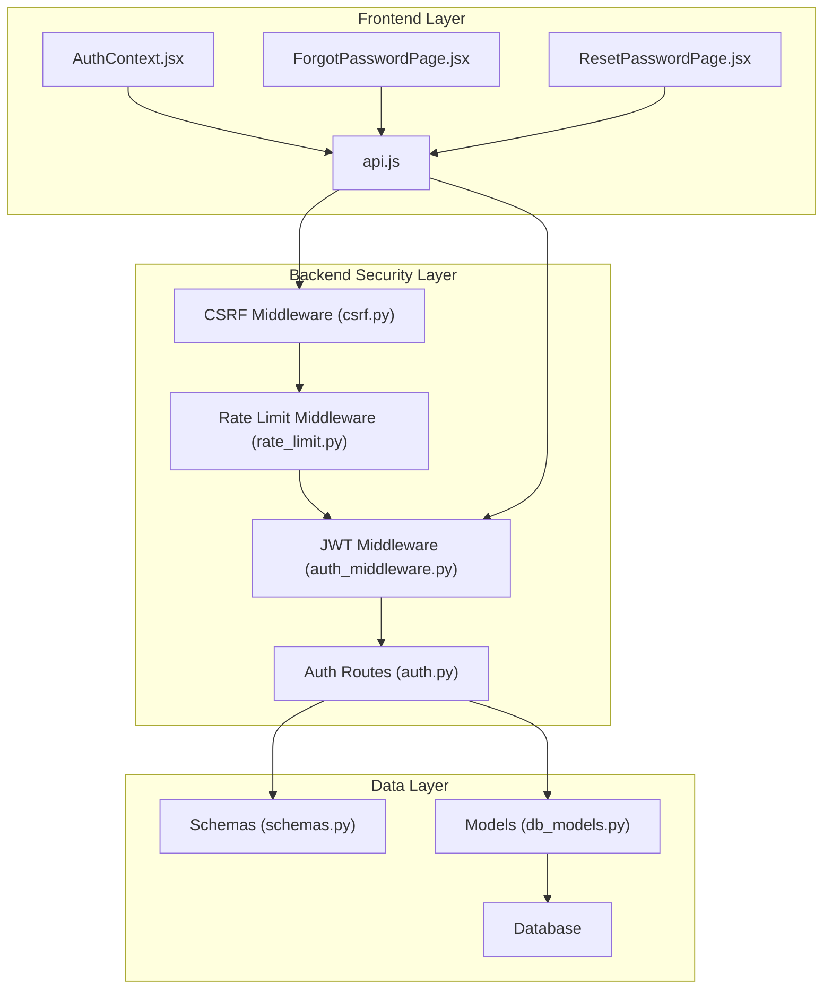
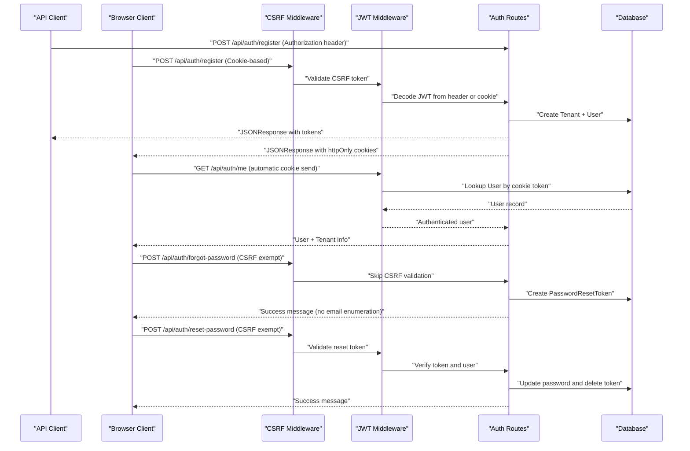
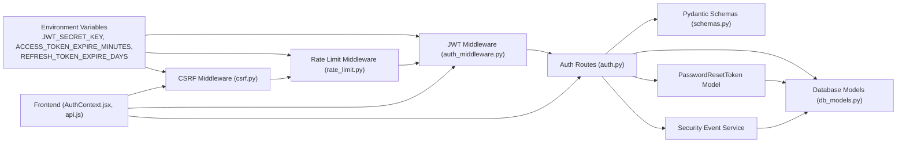
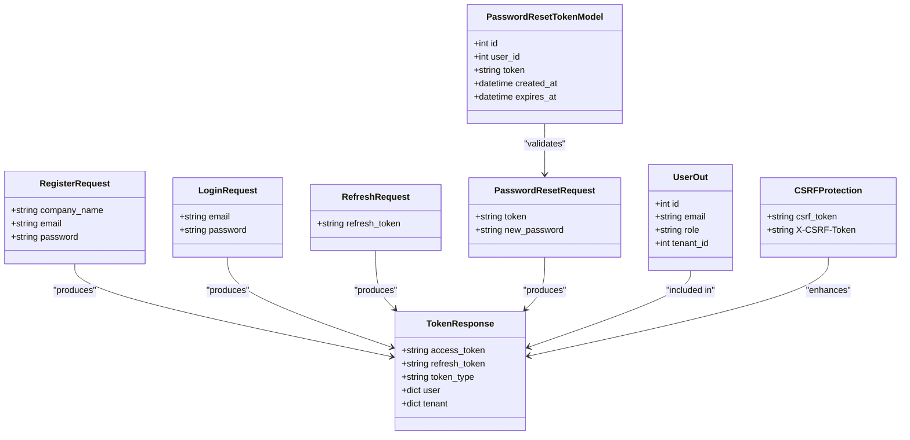

# Authentication Endpoints

<cite>
**Referenced Files in This Document**
- [auth.py](file://app/backend/routes/auth.py)
- [auth_middleware.py](file://app/backend/middleware/auth.py)
- [csrf.py](file://app/backend/middleware/csrf.py)
- [rate_limit.py](file://app/backend/middleware/rate_limit.py)
- [schemas.py](file://app/backend/models/schemas.py)
- [db_models.py](file://app/backend/models/db_models.py)
- [034_password_reset_tokens.py](file://alembic/versions/034_password_reset_tokens.py)
- [security_event_service.py](file://app/backend/services/security_event_service.py)
- [main.py](file://app/backend/main.py)
- [AuthContext.jsx](file://app/frontend/src/contexts/AuthContext.jsx)
- [api.js](file://app/frontend/src/lib/api.js)
- [ForgotPasswordPage.jsx](file://app/frontend/src/pages/ForgotPasswordPage.jsx)
- [ResetPasswordPage.jsx](file://app/frontend/src/pages/ResetPasswordPage.jsx)
- [docker-compose.yml](file://docker-compose.yml)
- [docker-compose.prod.yml](file://docker-compose.prod.yml)
- [test_auth.py](file://app/backend/tests/test_auth.py)
</cite>

## Update Summary
**Changes Made**
- Added comprehensive password reset functionality with secure token-based authentication
- Documented new `/api/auth/forgot-password` and `/api/auth/reset-password` endpoints
- Updated CSRF protection to include password reset endpoints (exempt from CSRF validation)
- Enhanced rate limiting exemptions for password reset endpoints
- Added security event recording for password reset activities
- Updated frontend integration examples for password reset workflow
- Enhanced authentication patterns to support password reset token flow
- Added PasswordResetToken database model documentation

## Table of Contents
1. [Introduction](#introduction)
2. [Project Structure](#project-structure)
3. [Core Components](#core-components)
4. [Architecture Overview](#architecture-overview)
5. [Detailed Component Analysis](#detailed-component-analysis)
6. [Dependency Analysis](#dependency-analysis)
7. [Performance Considerations](#performance-considerations)
8. [Troubleshooting Guide](#troubleshooting-guide)
9. [Conclusion](#conclusion)

## Introduction
This document provides comprehensive API documentation for the authentication endpoints in the Resume AI by ThetaLogics platform. The system now supports dual authentication patterns for both API clients and browser clients, with enhanced security measures including CSRF protection, improved token management, and comprehensive password reset functionality.

Key authentication features:
- **Dual Authentication Patterns**: Supports both API clients (Authorization header) and browser clients (httpOnly cookies)
- **CSRF Protection**: Implements double-submit cookie pattern for browser clients across all endpoints
- **Enhanced Security**: Improved token management with secure cookie handling and password reset security
- **Automatic Token Handling**: Frontend automatically manages cookies and CSRF tokens
- **Password Reset Workflow**: Secure token-based password reset with email enumeration protection
- **Rate Limiting**: Intelligent rate limiting with exemptions for authentication endpoints
- **Security Event Tracking**: Comprehensive logging of authentication and password reset activities

## Project Structure
The authentication system spans backend routes, middleware, Pydantic models, database models, and frontend client integration with enhanced security layers and password reset functionality:

- **Backend routes** define authentication endpoints and handle dual client authentication
- **JWT middleware** validates tokens from both Authorization headers and cookies
- **CSRF middleware** protects browser clients with double-submit cookie pattern
- **Rate limiting middleware** provides intelligent request throttling
- **Pydantic schemas** define request/response contracts
- **Database models** represent users, tenants, password reset tokens, and related entities
- **Frontend** manages cookies automatically and handles CSRF tokens with password reset integration



**Diagram sources**
- [auth.py:1-381](file://app/backend/routes/auth.py#L1-L381)
- [auth_middleware.py:1-63](file://app/backend/middleware/auth_middleware.py#L1-L63)
- [csrf.py:1-105](file://app/backend/middleware/csrf.py#L1-L105)
- [rate_limit.py:1-149](file://app/backend/middleware/rate_limit.py#L1-L149)
- [schemas.py:140-171](file://app/backend/models/schemas.py#L140-L171)
- [db_models.py:394-403](file://app/backend/models/db_models.py#L394-L403)
- [AuthContext.jsx:1-71](file://app/frontend/src/contexts/AuthContext.jsx#L1-L71)
- [api.js:1-414](file://app/frontend/src/lib/api.js#L1-L414)
- [ForgotPasswordPage.jsx:1-113](file://app/frontend/src/pages/ForgotPasswordPage.jsx#L1-L113)
- [ResetPasswordPage.jsx:1-169](file://app/frontend/src/pages/ResetPasswordPage.jsx#L1-L169)

**Section sources**
- [auth.py:1-381](file://app/backend/routes/auth.py#L1-L381)
- [auth_middleware.py:1-63](file://app/backend/middleware/auth_middleware.py#L1-L63)
- [csrf.py:1-105](file://app/backend/middleware/csrf.py#L1-L105)
- [rate_limit.py:1-149](file://app/backend/middleware/rate_limit.py#L1-L149)
- [schemas.py:140-171](file://app/backend/models/schemas.py#L140-L171)
- [db_models.py:394-403](file://app/backend/models/db_models.py#L394-L403)
- [AuthContext.jsx:1-71](file://app/frontend/src/contexts/AuthContext.jsx#L1-L71)
- [api.js:1-414](file://app/frontend/src/lib/api.js#L1-L414)
- [ForgotPasswordPage.jsx:1-113](file://app/frontend/src/pages/ForgotPasswordPage.jsx#L1-L113)
- [ResetPasswordPage.jsx:1-169](file://app/frontend/src/pages/ResetPasswordPage.jsx#L1-L169)

## Core Components
- **Authentication routes** module defines endpoints under /api/auth with dual client support
- **JWT middleware** validates tokens from both Authorization headers and cookies
- **CSRF middleware** implements double-submit cookie pattern for browser security across all endpoints
- **Rate limiting middleware** provides intelligent request throttling with exemptions for authentication endpoints
- **Pydantic models** define request/response schemas
- **Database models** represent Users, Tenants, and PasswordResetToken
- **Frontend client** manages cookies automatically and handles CSRF tokens with password reset integration

Key implementation references:
- Routes: [auth.py:135-381](file://app/backend/routes/auth.py#L135-L381)
- JWT Middleware: [auth_middleware.py:26-56](file://app/backend/middleware/auth_middleware.py#L26-L56)
- CSRF Middleware: [csrf.py:15-105](file://app/backend/middleware/csrf.py#L15-L105)
- Rate Limit Middleware: [rate_limit.py:19-149](file://app/backend/middleware/rate_limit.py#L19-L149)
- Schemas: [schemas.py:140-171](file://app/backend/models/schemas.py#L140-L171)
- Models: [db_models.py:394-403](file://app/backend/models/db_models.py#L394-L403)

**Section sources**
- [auth.py:135-381](file://app/backend/routes/auth.py#L135-L381)
- [auth_middleware.py:26-56](file://app/backend/middleware/auth_middleware.py#L26-L56)
- [csrf.py:15-105](file://app/backend/middleware/csrf.py#L15-L105)
- [rate_limit.py:19-149](file://app/backend/middleware/rate_limit.py#L19-L149)
- [schemas.py:140-171](file://app/backend/models/schemas.py#L140-L171)
- [db_models.py:394-403](file://app/backend/models/db_models.py#L394-L403)

## Architecture Overview
The authentication flow now integrates CSRF protection, dual client authentication, enhanced security measures, and comprehensive password reset functionality.



**Diagram sources**
- [auth.py:135-381](file://app/backend/routes/auth.py#L135-L381)
- [auth_middleware.py:31-37](file://app/backend/middleware/auth_middleware.py#L31-L37)
- [csrf.py:57-105](file://app/backend/middleware/csrf.py#L57-L105)
- [rate_limit.py:128-149](file://app/backend/middleware/rate_limit.py#L128-L149)
- [AuthContext.jsx:13-25](file://app/frontend/src/contexts/AuthContext.jsx#L13-L25)

## Detailed Component Analysis

### POST /api/auth/register
Purpose: Register a new user, create a tenant, hash the password, and issue tokens with enhanced security for both API and browser clients.

**Updated** Enhanced with CSRF protection and cookie-based token delivery for browser clients.

- **Request body schema**: RegisterRequest
  - Fields:
    - company_name: string
    - email: string
    - password: string
- **Response**: JSONResponse with both JSON body and httpOnly cookies
  - Fields:
    - access_token: string (sent in response body for API clients)
    - refresh_token: string (sent in response body for API clients)
    - token_type: string (default "bearer")
    - user: dict with id, email, role, tenant_id
    - tenant: dict with id, name, slug
  - **Cookies** (browser clients only):
    - access_token: httpOnly cookie with short expiration
    - refresh_token: httpOnly cookie with long expiration
    - csrf_token: non-httpOnly cookie for CSRF protection

Validation and business rules:
- Email uniqueness: Raises HTTP 400 if email already exists
- Password length: Minimum 8 characters; otherwise HTTP 400
- Tenant creation: Slug derived from company_name; collisions auto-incremented
- Role assignment: First user gets admin role
- Token expiry: Controlled by environment variables ACCESS_TOKEN_EXPIRE_MINUTES and REFRESH_TOKEN_EXPIRE_DAYS
- CSRF protection: Browser clients must have matching CSRF token

Success response example:
```json
{
  "access_token": "<JWT_ACCESS_TOKEN>",
  "refresh_token": "<JWT_REFRESH_TOKEN>",
  "token_type": "bearer",
  "user": {
    "id": 1,
    "email": "user@example.com",
    "role": "admin",
    "tenant_id": 1
  },
  "tenant": {
    "id": 1,
    "name": "Example Corp",
    "slug": "example-corp"
  }
}
```

**Section sources**
- [auth.py:135-169](file://app/backend/routes/auth.py#L135-L169)
- [auth.py:172-207](file://app/backend/routes/auth.py#L172-L207)
- [csrf.py:89-105](file://app/backend/middleware/csrf.py#L89-L105)

### POST /api/auth/login
Purpose: Authenticate an existing user and issue tokens with dual client support.

**Updated** Now supports both API clients (Authorization header) and browser clients (cookie-based authentication).

- **Request body schema**: LoginRequest
  - Fields:
    - email: string
    - password: string
- **Response**: JSONResponse with enhanced security for browser clients

**Authentication Flow**:
- **API Clients**: Use Authorization header with Bearer token
- **Browser Clients**: Use httpOnly cookies automatically sent with requests

Validation and business rules:
- User lookup by email and active status
- Password verification against hashed password
- Token issuance mirrors register flow with configurable expirations
- CSRF protection for browser clients
- SSO enforcement checking for tenant-specific SSO configuration

Success response example:
```json
{
  "access_token": "<JWT_ACCESS_TOKEN>",
  "refresh_token": "<JWT_REFRESH_TOKEN>",
  "token_type": "bearer",
  "user": {
    "id": 1,
    "email": "user@example.com",
    "role": "admin",
    "tenant_id": 1
  },
  "tenant": {
    "id": 1,
    "name": "Example Corp",
    "slug": "example-corp"
  }
}
```

**Section sources**
- [auth.py:172-207](file://app/backend/routes/auth.py#L172-L207)
- [auth_middleware.py:31-37](file://app/backend/middleware/auth_middleware.py#L31-L37)
- [csrf.py:66-69](file://app/backend/middleware/csrf.py#L66-L69)

### POST /api/auth/forgot-password
Purpose: Generate a password reset token for a user account. Always returns success to prevent email enumeration attacks.

**New** Comprehensive password reset functionality with security best practices.

- **Request body schema**: dict
  - Fields:
    - email: string (user's email address)
- **Response**: JSONResponse with success message
  - Always returns success regardless of whether the email exists
  - Prevents email enumeration attacks

**Security Features**:
- **Email Enumeration Protection**: Always returns success message
- **Token Generation**: Creates unique URL-safe tokens with 1-hour expiration
- **Database Cleanup**: Removes existing tokens for the user before creating new ones
- **CSRF Exemption**: No CSRF validation required (security by design for password reset)
- **Logging**: Logs reset URLs for debugging purposes

Validation and business rules:
- Email normalization: Converts to lowercase and strips whitespace
- User lookup: Finds active user by email
- Token creation: Generates cryptographically secure random tokens
- Expiration handling: 1-hour validity period
- Database persistence: Stores token with user_id and expiration timestamp

Success response example:
```json
{
  "message": "If an account with that email exists, a reset link has been sent."
}
```

**Section sources**
- [auth.py:317-345](file://app/backend/routes/auth.py#L317-L345)
- [csrf.py:32-33](file://app/backend/middleware/csrf.py#L32-L33)
- [rate_limit.py:27-28](file://app/backend/middleware/rate_limit.py#L27-L28)

### POST /api/auth/reset-password
Purpose: Reset a user's password using a valid reset token.

**New** Secure password reset endpoint with comprehensive validation.

- **Request body schema**: dict
  - Fields:
    - token: string (reset token from email)
    - new_password: string (new password to set)
- **Response**: JSONResponse with success message

**Security Features**:
- **Token Validation**: Verifies token exists and hasn't expired
- **User Verification**: Ensures user still exists and is active
- **Password Validation**: Enforces minimum 8-character requirement
- **Atomic Operations**: Uses database transactions for safety
- **Token Cleanup**: Deletes used tokens immediately after reset

Validation and business rules:
- Token presence: Both token and new_password are required
- Password strength: Minimum 8 characters enforced
- Token verification: Checks token existence and expiration
- User validation: Ensures user exists and is active
- Password hashing: Uses bcrypt with secure salt generation
- Database cleanup: Removes used token from database

Success response example:
```json
{
  "message": "Password has been reset successfully"
}
```

**Section sources**
- [auth.py:348-380](file://app/backend/routes/auth.py#L348-L380)
- [db_models.py:394-403](file://app/backend/models/db_models.py#L394-L403)
- [security_event_service.py:17](file://app/backend/services/security_event_service.py#L17)

### POST /api/auth/refresh
Purpose: Validate a refresh token and issue new tokens with dual client support.

**Updated** Enhanced to support both API clients (body parameter) and browser clients (cookie-based).

- **Request body schema**: RefreshRequest (optional for API clients)
  - Fields:
    - refresh_token: string (for API clients)
- **Response**: JSONResponse with refreshed tokens

**Client Type Detection**:
- **API Clients**: Must provide refresh_token in request body
- **Browser Clients**: Refresh token is read from httpOnly cookie automatically

Validation and business rules:
- Decode JWT with HS256 using SECRET_KEY
- Verify token type equals "refresh"
- Lookup user by sub and ensure active status
- Check for revoked tokens using JTI validation
- Issue new access token and new refresh token
- CSRF protection for browser clients

Success response example:
```json
{
  "access_token": "<NEW_ACCESS_TOKEN>",
  "refresh_token": "<NEW_REFRESH_TOKEN>",
  "token_type": "bearer",
  "user": {
    "id": 1,
    "email": "user@example.com",
    "role": "admin",
    "tenant_id": 1
  },
  "tenant": {
    "id": 1,
    "name": "Example Corp",
    "slug": "example-corp"
  }
}
```

**Section sources**
- [auth.py:210-259](file://app/backend/routes/auth.py#L210-L259)
- [auth_middleware.py:31-37](file://app/backend/middleware/auth_middleware.py#L31-L37)
- [csrf.py:66-69](file://app/backend/middleware/csrf.py#L66-L69)

### GET /api/auth/me
Purpose: Retrieve currently authenticated user and associated tenant with dual client support.

**Updated** Enhanced to work seamlessly with both API and browser authentication methods.

- **Authentication**: Works with both Authorization header and httpOnly cookies
- **Response schema**: dict with user and tenant keys
  - user: UserOut fields (id, email, role, tenant_id)
  - tenant: dict with id, name, slug (may be null if tenant not found)

**Client Type Support**:
- **API Clients**: Require Authorization: Bearer <access_token> header
- **Browser Clients**: Automatically send httpOnly cookie with request

Success response example:
```json
{
  "user": {
    "id": 1,
    "email": "user@example.com",
    "role": "admin",
    "tenant_id": 1
  },
  "tenant": {
    "id": 1,
    "name": "Example Corp",
    "slug": "example-corp"
  }
}
```

**Section sources**
- [auth.py:262-268](file://app/backend/routes/auth.py#L262-L268)
- [auth_middleware.py:31-37](file://app/backend/middleware/auth_middleware.py#L31-L37)

### POST /api/auth/logout
Purpose: Clear all authentication cookies and terminate browser session.

**New** Dedicated logout endpoint to properly clear authentication state.

- **Response**: JSONResponse with success message
- **Actions**:
  - Delete access_token cookie
  - Delete refresh_token cookie
  - Delete csrf_token cookie
  - Revoke refresh token by storing JTI in revoked_tokens table

**Section sources**
- [auth.py:271-314](file://app/backend/routes/auth.py#L271-L314)

## Dependency Analysis
Authentication now depends on enhanced security layers and password reset infrastructure:

- **JWT secret key and algorithm** from environment
- **CSRF middleware** for browser client protection across all endpoints
- **Rate limiting middleware** with exemptions for authentication endpoints
- **Database sessions** for user, tenant, and password reset token persistence
- **Pydantic schemas** for request/response validation
- **Frontend axios interceptors** for automatic cookie and CSRF handling
- **Password reset token model** for secure password reset workflow
- **Security event service** for password reset tracking



**Diagram sources**
- [auth.py:26-27](file://app/backend/routes/auth.py#L26-L27)
- [auth_middleware.py:13-21](file://app/backend/middleware/auth_middleware.py#L13-L21)
- [csrf.py:15-105](file://app/backend/middleware/csrf.py#L15-L105)
- [rate_limit.py:19-149](file://app/backend/middleware/rate_limit.py#L19-L149)
- [schemas.py:140-171](file://app/backend/models/schemas.py#L140-L171)
- [db_models.py:394-403](file://app/backend/models/db_models.py#L394-L403)
- [AuthContext.jsx:13-25](file://app/frontend/src/contexts/AuthContext.jsx#L13-L25)
- [api.js:7-31](file://app/frontend/src/lib/api.js#L7-L31)
- [security_event_service.py:17](file://app/backend/services/security_event_service.py#L17)

**Section sources**
- [auth.py:26-27](file://app/backend/routes/auth.py#L26-L27)
- [auth_middleware.py:13-21](file://app/backend/middleware/auth_middleware.py#L13-L21)
- [csrf.py:15-105](file://app/backend/middleware/csrf.py#L15-L105)
- [rate_limit.py:19-149](file://app/backend/middleware/rate_limit.py#L19-L149)
- [schemas.py:140-171](file://app/backend/models/schemas.py#L140-L171)
- [db_models.py:394-403](file://app/backend/models/db_models.py#L394-L403)
- [AuthContext.jsx:13-25](file://app/frontend/src/contexts/AuthContext.jsx#L13-L25)
- [api.js:7-31](file://app/frontend/src/lib/api.js#L7-L31)
- [security_event_service.py:17](file://app/backend/services/security_event_service.py#L17)

## Performance Considerations
- **Token lifetimes**: ACCESS_TOKEN_EXPIRE_MINUTES controls short-lived access tokens; REFRESH_TOKEN_EXPIRE_DAYS controls refresh token validity
- **Database lookups**: Each endpoint performs minimal DB queries (email lookup, user lookup by id)
- **Password hashing**: bcrypt is used for secure password storage; hashing cost is managed by the underlying library
- **CSRF overhead**: Minimal performance impact with efficient cookie and header validation
- **Cookie handling**: Automatic cookie management reduces frontend complexity and potential errors
- **Frontend auto-refresh**: Axios interceptor attempts token refresh on 401 responses, reducing user interruption
- **Rate limiting**: Intelligent throttling with exemptions for authentication endpoints prevents abuse while maintaining performance
- **Password reset tokens**: 1-hour expiration prevents token accumulation and maintains security

## Troubleshooting Guide
Common issues and resolutions:

**CSRF Token Issues**:
- **Symptom**: 403 Forbidden with CSRF token error
- **Cause**: Missing or mismatched CSRF token in browser requests
- **Resolution**: Ensure frontend automatically handles CSRF tokens; check cookie presence
- **Note**: Password reset endpoints are exempt from CSRF validation

**Cookie Authentication Problems**:
- **Symptom**: 401 Unauthorized despite successful login
- **Cause**: Browser not sending httpOnly cookies or CSRF token mismatch
- **Resolution**: Verify CORS settings allow credentials; ensure same-site policy matches

**Password Reset Issues**:
- **Symptom**: "Invalid or expired reset token" error
- **Cause**: Token expired (1-hour limit) or incorrect token
- **Resolution**: Generate new reset token; ensure correct token usage
- **Note**: Email enumeration protection always returns success

**Rate Limiting Issues**:
- **Symptom**: 429 Too Many Requests on authentication endpoints
- **Cause**: Excessive authentication attempts
- **Resolution**: Wait for rate limit to reset; check whitelist exemptions

**Dual Client Confusion**:
- **API Clients**: Use Authorization header with Bearer token
- **Browser Clients**: Rely on automatic cookie handling; no manual token management needed

**Frontend Integration Issues**:
- **Axios configuration**: withCredentials: true enables cookie sending
- **CSRF handling**: Automatic header injection for non-GET requests
- **Auto-refresh**: Handles token expiration transparently
- **Password reset flow**: Frontend handles token-based navigation automatically

**Section sources**
- [csrf.py:75-84](file://app/backend/middleware/csrf.py#L75-L84)
- [rate_limit.py:144-148](file://app/backend/middleware/rate_limit.py#L144-L148)
- [api.js:7-31](file://app/frontend/src/lib/api.js#L7-L31)
- [AuthContext.jsx:13-25](file://app/frontend/src/contexts/AuthContext.jsx#L13-L25)

## Security Considerations
**Updated** Enhanced security measures for dual client authentication and password reset functionality:

- **CSRF Protection**:
  - Double-submit cookie pattern prevents cross-site request forgery
  - Safe methods (GET, HEAD, OPTIONS) are exempt from CSRF checks
  - API clients using Authorization header bypass CSRF validation
  - CSRF tokens are stored in non-httpOnly cookies for JavaScript access
  - **Exempt endpoints**: All authentication endpoints including password reset

- **Cookie Security**:
  - Access tokens: httpOnly, secure (production), SameSite=Lax, short expiration
  - Refresh tokens: httpOnly, secure (production), SameSite=Lax, longer expiration
  - CSRF tokens: Non-httpOnly, accessible to JavaScript, short expiration (1 hour)
  - Proper path scoping for different token types

- **Password Reset Security**:
  - **Email Enumeration Protection**: Always returns success regardless of email existence
  - **Token Generation**: Cryptographically secure URL-safe tokens
  - **Expiration Handling**: 1-hour validity period with automatic cleanup
  - **Atomic Operations**: Database transactions ensure data consistency
  - **Security Events**: Tracks password reset requests for monitoring
  - **Rate Limiting**: Exemptions from rate limits for security reasons

- **Dual Authentication Benefits**:
  - API clients use Authorization header for maximum security
  - Browser clients use cookies for seamless experience
  - Automatic CSRF protection for browser interactions
  - Clear separation of concerns between client types

- **Token Management**:
  - JWT_SECRET_KEY must be set in production environments
  - ACCESS_TOKEN_EXPIRE_MINUTES should be short (e.g., minutes)
  - REFRESH_TOKEN_EXPIRE_DAYS should be reasonable (e.g., days to weeks)
  - Logout endpoint clears all authentication cookies and revokes refresh tokens
  - Password reset tokens are securely stored and automatically cleaned up

**Section sources**
- [csrf.py:15-105](file://app/backend/middleware/csrf.py#L15-L105)
- [auth.py:317-380](file://app/backend/routes/auth.py#L317-L380)
- [auth_middleware.py:13-21](file://app/backend/middleware/auth_middleware.py#L13-L21)
- [rate_limit.py:27-28](file://app/backend/middleware/rate_limit.py#L27-L28)
- [api.js:7-31](file://app/frontend/src/lib/api.js#L7-L31)
- [security_event_service.py:17](file://app/backend/services/security_event_service.py#L17)

## Example Requests and Responses

### Successful Registration (API Client)
**Updated** Enhanced with CSRF protection for browser clients.

- **Request**:
  - Method: POST
  - URL: /api/auth/register
  - Headers: Content-Type: application/json
  - Body:
    ```json
    {
      "company_name": "ThetaLogics Inc",
      "email": "hr@thetalogics.com",
      "password": "SecurePass123!"
    }
    ```

- **Response**:
  ```json
  {
    "access_token": "<JWT_ACCESS_TOKEN>",
    "refresh_token": "<JWT_REFRESH_TOKEN>",
    "token_type": "bearer",
    "user": {
      "id": 1,
      "email": "hr@thetalogics.com",
      "role": "admin",
      "tenant_id": 1
    },
    "tenant": {
      "id": 1,
      "name": "ThetaLogics Inc",
      "slug": "thetalogics-inc"
    }
  }
  ```

**Section sources**
- [auth.py:135-169](file://app/backend/routes/auth.py#L135-L169)
- [test_auth.py:19-41](file://app/backend/tests/test_auth.py#L19-L41)

### Password Reset Flow (Browser Client)
**New** Complete password reset workflow with token-based authentication.

- **Step 1**: Request password reset
  - Method: POST
  - URL: /api/auth/forgot-password
  - Headers: Content-Type: application/json
  - Body:
    ```json
    {
      "email": "hr@thetalogics.com"
    }
    ```
  - Response: Success message (no email enumeration)

- **Step 2**: Navigate to reset page with token
  - URL: /reset-password/{token}
  - Frontend automatically handles token-based navigation

- **Step 3**: Submit new password
  - Method: POST
  - URL: /api/auth/reset-password
  - Headers: Content-Type: application/json
  - Body:
    ```json
    {
      "token": "reset_token_from_email",
      "new_password": "NewSecurePass456!"
    }
    ```
  - Response: Success message

**Section sources**
- [auth.py:317-380](file://app/backend/routes/auth.py#L317-L380)
- [ForgotPasswordPage.jsx:12-24](file://app/frontend/src/pages/ForgotPasswordPage.jsx#L12-L24)
- [ResetPasswordPage.jsx:26-49](file://app/frontend/src/pages/ResetPasswordPage.jsx#L26-L49)

### Successful Login (Browser Client)
**New** Example showing browser client authentication with automatic cookie handling.

- **Request**:
  - Method: POST
  - URL: /api/auth/login
  - Headers: Content-Type: application/json
  - Body:
    ```json
    {
      "email": "hr@thetalogics.com",
      "password": "SecurePass123!"
    }
    ```

- **Response**:
  ```json
  {
    "access_token": "<JWT_ACCESS_TOKEN>",
    "refresh_token": "<JWT_REFRESH_TOKEN>",
    "token_type": "bearer",
    "user": {
      "id": 1,
      "email": "hr@thetalogics.com",
      "role": "admin",
      "tenant_id": 1
    },
    "tenant": {
      "id": 1,
      "name": "ThetaLogics Inc",
      "slug": "thetalogics-inc"
    }
  }
  ```

**Section sources**
- [auth.py:172-207](file://app/backend/routes/auth.py#L172-L207)
- [test_auth.py:43-78](file://app/backend/tests/test_auth.py#L43-L78)

### Using Cookies for Authentication
**New** Example showing browser client automatic cookie-based authentication.

- **Request**:
  - Method: GET
  - URL: /api/auth/me
  - **Browser automatically sends**: access_token cookie

- **Response**:
  ```json
  {
    "user": {
      "id": 1,
      "email": "hr@thetalogics.com",
      "role": "admin",
      "tenant_id": 1
    },
    "tenant": {
      "id": 1,
      "name": "ThetaLogics Inc",
      "slug": "thetalogics-inc"
    }
  }
  ```

**Section sources**
- [auth.py:262-268](file://app/backend/routes/auth.py#L262-L268)
- [AuthContext.jsx:13-25](file://app/frontend/src/contexts/AuthContext.jsx#L13-L25)

## API Definitions

### Authentication Endpoints

**Updated** Enhanced with dual client support, CSRF protection, and password reset functionality.

- **POST /api/auth/register**
  - **Request body**: RegisterRequest
    - company_name: string
    - email: string
    - password: string
  - **Response**: JSONResponse with tokens in both body and cookies
  - **Errors**: 400 (email exists, invalid password), 422 (validation)

- **POST /api/auth/login**
  - **Request body**: LoginRequest
    - email: string
    - password: string
  - **Response**: JSONResponse with enhanced security
  - **Errors**: 401 (invalid credentials), 422 (validation)

- **POST /api/auth/forgot-password**
  - **Request body**: dict
    - email: string
  - **Response**: JSONResponse with success message (always succeeds)
  - **Security**: Prevents email enumeration attacks
  - **Errors**: None (exempt from CSRF validation)

- **POST /api/auth/reset-password**
  - **Request body**: dict
    - token: string
    - new_password: string (minimum 8 characters)
  - **Response**: JSONResponse with success message
  - **Security**: Validates token, user, and password requirements
  - **Errors**: 400 (invalid/expired token, missing fields), 422 (validation)

- **POST /api/auth/refresh**
  - **Request body**: RefreshRequest (API clients) or cookie (browser clients)
  - **Response**: JSONResponse with refreshed tokens
  - **Errors**: 401 (invalid/expired refresh token)

- **GET /api/auth/me**
  - **Authentication**: Works with both Authorization header and cookies
  - **Response**: { user: UserOut, tenant: dict or null }
  - **Errors**: 401 (not authenticated/invalid token)

- **POST /api/auth/logout**
  - **Request body**: None
  - **Response**: JSONResponse with success message
  - **Action**: Clears all authentication cookies and revokes refresh token

**Section sources**
- [auth.py:135-381](file://app/backend/routes/auth.py#L135-L381)
- [auth_middleware.py:26-56](file://app/backend/middleware/auth_middleware.py#L26-L56)
- [csrf.py:15-105](file://app/backend/middleware/csrf.py#L15-L105)
- [rate_limit.py:19-149](file://app/backend/middleware/rate_limit.py#L19-L149)

## Data Models

### Request/Response Schemas

**Updated** Enhanced with CSRF token handling for browser clients and password reset functionality.



**Diagram sources**
- [schemas.py:140-171](file://app/backend/models/schemas.py#L140-L171)
- [csrf.py:89-105](file://app/backend/middleware/csrf.py#L89-L105)
- [db_models.py:394-403](file://app/backend/models/db_models.py#L394-L403)

**Section sources**
- [schemas.py:140-171](file://app/backend/models/schemas.py#L140-L171)
- [db_models.py:394-403](file://app/backend/models/db_models.py#L394-L403)

## Environment Configuration

### Required Environment Variables
- **JWT_SECRET_KEY**: Secret key for signing JWT tokens (required in production)
- **ACCESS_TOKEN_EXPIRE_MINUTES**: Access token lifetime in minutes (default 60)
- **REFRESH_TOKEN_EXPIRE_DAYS**: Refresh token lifetime in days (default 30)

### Enhanced Security Configuration
- **CSRF Protection**: Automatic CSRF token generation and validation for all endpoints
- **Cookie Security**: HttpOnly, Secure, SameSite=Lax for authentication cookies
- **Frontend Integration**: Automatic cookie and CSRF token handling
- **Rate Limiting**: Intelligent throttling with exemptions for authentication endpoints
- **Password Reset Security**: Token-based authentication with 1-hour expiration

**Section sources**
- [auth_middleware.py:13-21](file://app/backend/middleware/auth_middleware.py#L13-L21)
- [auth.py:26-27](file://app/backend/routes/auth.py#L26-L27)
- [csrf.py:15-105](file://app/backend/middleware/csrf.py#L15-L105)
- [rate_limit.py:19-149](file://app/backend/middleware/rate_limit.py#L19-L149)

## Conclusion
The authentication system now provides comprehensive dual-client support with enhanced security measures and complete password reset functionality. The system seamlessly handles both API clients (using Authorization headers) and browser clients (using httpOnly cookies with CSRF protection). Key improvements include:

- **Dual Authentication Patterns**: Separate flows for API and browser clients
- **CSRF Protection**: Double-submit cookie pattern for browser security across all endpoints
- **Enhanced Token Management**: Secure cookie handling with proper scoping
- **Automatic Frontend Integration**: Seamless cookie and CSRF token management
- **Comprehensive Password Reset**: Secure token-based workflow with email enumeration protection
- **Intelligent Rate Limiting**: Exemptions for authentication endpoints while preventing abuse
- **Security Event Tracking**: Monitoring of password reset activities
- **Improved Security**: Better separation of concerns between client types

For production deployment, ensure JWT_SECRET_KEY is properly configured, implement proper CORS settings for cookie handling, leverage the automatic CSRF protection for browser clients, and utilize the password reset security features. The frontend's automatic cookie management significantly reduces security risks while maintaining excellent user experience. The password reset functionality provides a secure and user-friendly way to recover from forgotten passwords while protecting against common attack vectors.