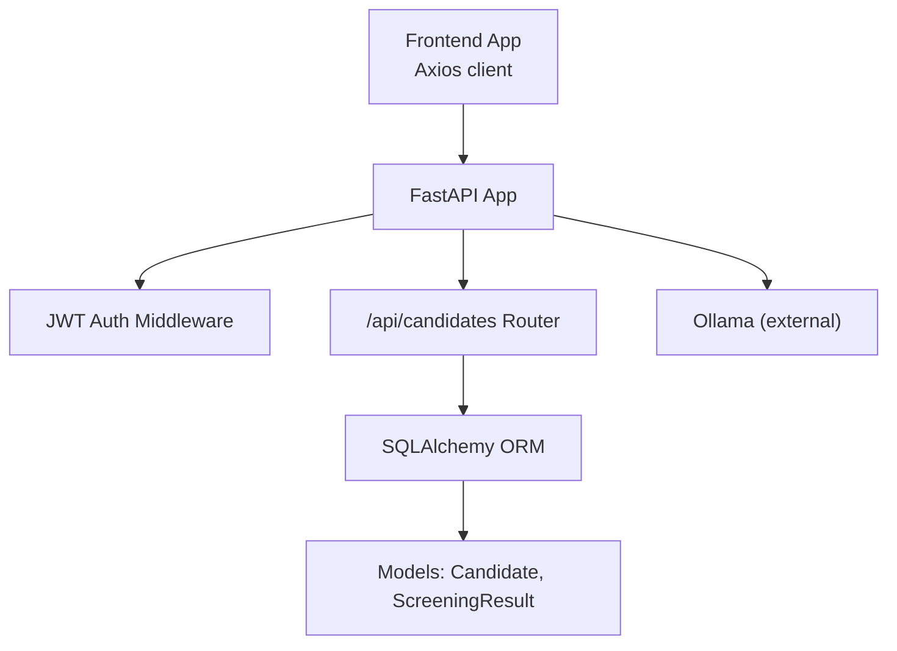
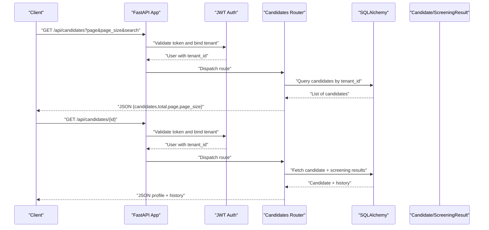
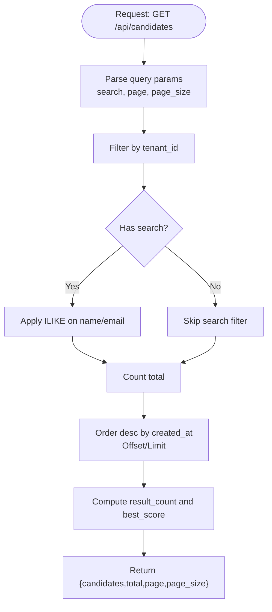
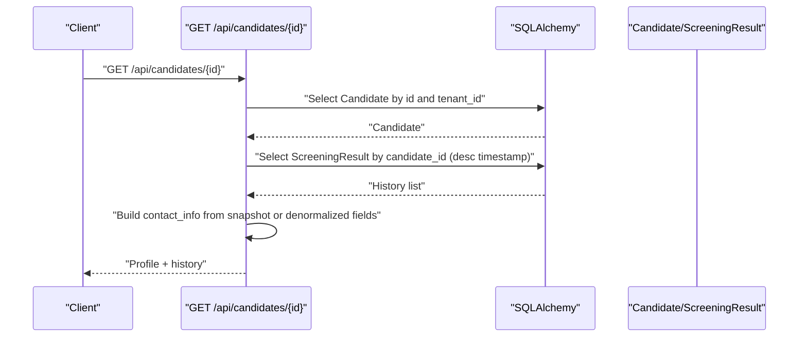
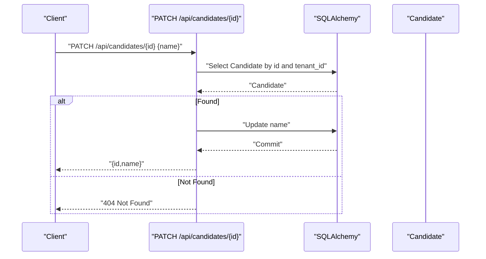
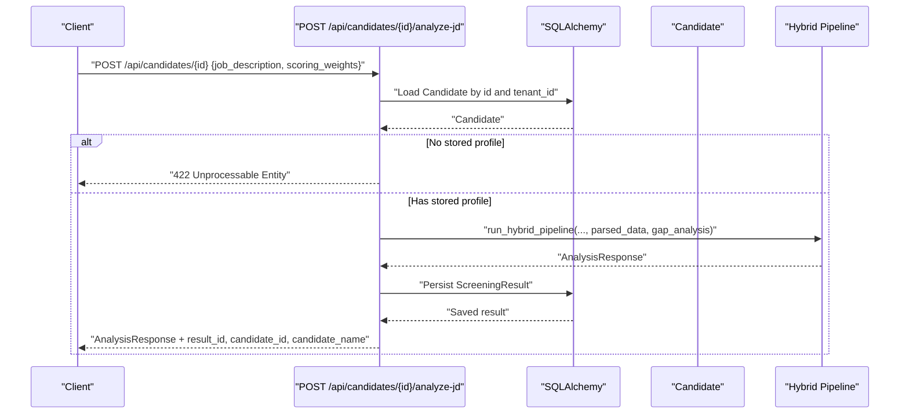
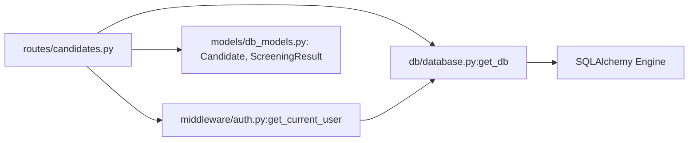

# Candidate Management

<cite>
**Referenced Files in This Document**
- [candidates.py](file://app/backend/routes/candidates.py)
- [schemas.py](file://app/backend/models/schemas.py)
- [db_models.py](file://app/backend/models/db_models.py)
- [auth.py](file://app/backend/middleware/auth.py)
- [database.py](file://app/backend/db/database.py)
- [main.py](file://app/backend/main.py)
- [api.js](file://app/frontend/src/lib/api.js)
- [CandidatesPage.jsx](file://app/frontend/src/pages/CandidatesPage.jsx)
- [test_candidate_dedup.py](file://app/backend/tests/test_candidate_dedup.py)
- [001_enrich_candidates_add_caches.py](file://alembic/versions/001_enrich_candidates_add_caches.py)
- [002_parser_snapshot_json.py](file://alembic/versions/002_parser_snapshot_json.py)
</cite>

## Table of Contents
1. [Introduction](#introduction)
2. [Project Structure](#project-structure)
3. [Core Components](#core-components)
4. [Architecture Overview](#architecture-overview)
5. [Detailed Component Analysis](#detailed-component-analysis)
6. [Dependency Analysis](#dependency-analysis)
7. [Performance Considerations](#performance-considerations)
8. [Troubleshooting Guide](#troubleshooting-guide)
9. [Conclusion](#conclusion)
10. [Appendices](#appendices)

## Introduction
This document provides comprehensive API documentation for the candidate management endpoints. It covers listing candidates with search and pagination, retrieving detailed candidate profiles with analysis history, updating candidate names, and re-analyzing candidates against a new job description. It also documents request/response schemas, deduplication handling, profile quality metrics, multi-tenant isolation, access controls, and integration patterns for frontend clients.

## Project Structure
The candidate management API is implemented as a FastAPI router mounted under /api/candidates. Authentication is enforced via a JWT middleware that binds requests to a tenant. Data models define the persisted candidate records and screening results. Frontend integration is handled via an Axios-based API client.

**Diagram sources**
- [main.py:200-214](file://app/backend/main.py#L200-L214)
- [auth.py:19-40](file://app/backend/middleware/auth.py#L19-L40)
- [candidates.py:23-303](file://app/backend/routes/candidates.py#L23-L303)
- [db_models.py:97-146](file://app/backend/models/db_models.py#L97-L146)

**Section sources**
- [main.py:200-214](file://app/backend/main.py#L200-L214)
- [auth.py:19-40](file://app/backend/middleware/auth.py#L19-L40)
- [candidates.py:23-303](file://app/backend/routes/candidates.py#L23-L303)

## Core Components
- Authentication and tenant binding: JWT bearer tokens are validated and bound to a user and tenant. All candidate operations filter by tenant_id.
- Candidate listing: Supports search by name or email, pagination, and enrichment with best-fit score and result counts.
- Candidate retrieval: Returns enriched profile fields, skills snapshot, contact info, and analysis history.
- Name updates: PATCH endpoint to update candidate name with tenant isolation.
- Re-analysis: POST endpoint to run scoring against a new job description using stored profile data.

**Section sources**
- [auth.py:19-40](file://app/backend/middleware/auth.py#L19-L40)
- [candidates.py:26-80](file://app/backend/routes/candidates.py#L26-L80)
- [candidates.py:102-189](file://app/backend/routes/candidates.py#L102-L189)
- [candidates.py:83-99](file://app/backend/routes/candidates.py#L83-L99)
- [candidates.py:192-302](file://app/backend/routes/candidates.py#L192-L302)

## Architecture Overview
The candidate management endpoints are protected by JWT authentication and operate within a multi-tenant context. Requests flow through the FastAPI app, which mounts the candidates router. Database access uses SQLAlchemy models with tenant filters. Analysis results are persisted and retrieved for historical tracking.

**Diagram sources**
- [auth.py:19-40](file://app/backend/middleware/auth.py#L19-L40)
- [candidates.py:26-80](file://app/backend/routes/candidates.py#L26-L80)
- [candidates.py:102-189](file://app/backend/routes/candidates.py#L102-L189)

## Detailed Component Analysis

### Endpoint: GET /api/candidates
- Purpose: List candidates with optional search, pagination, and enrichment.
- Query parameters:
  - search: Optional substring search across name and email.
  - page: Page number (default 1, minimum 1).
  - page_size: Items per page (default 20, minimum 1, maximum 100).
- Response:
  - candidates: Array of candidate summaries with enriched fields.
  - total: Total matching candidates.
  - page, page_size: Pagination metadata.
- Enriched fields per candidate:
  - id, name, email, phone, created_at
  - result_count: Number of screening results
  - best_score: Fit score from latest analysis (if available)
  - current_role, current_company, total_years_exp, profile_quality

**Diagram sources**
- [candidates.py:26-80](file://app/backend/routes/candidates.py#L26-L80)

**Section sources**
- [candidates.py:26-80](file://app/backend/routes/candidates.py#L26-L80)

### Endpoint: GET /api/candidates/{id}
- Purpose: Retrieve a single candidate’s profile with analysis history.
- Path parameter:
  - id: Candidate identifier.
- Response fields:
  - Basic profile: id, name, email, phone, created_at, profile_updated_at
  - Contact info: Derived from parser snapshot with fallback to denormalized fields; recruiter edits override stale snapshot values.
  - Enriched profile: current_role, current_company, total_years_exp, profile_quality
  - Skills snapshot: Top skills extracted from stored profile (limited to 15).
  - Flags: has_stored_profile, has_full_parser_snapshot
  - History: Array of screening results ordered by timestamp descending, each with:
    - id, timestamp, status
    - fit_score, final_recommendation, risk_level
    - score_breakdown, matched_skills, missing_skills
    - job_role, analysis_quality

**Diagram sources**
- [candidates.py:102-189](file://app/backend/routes/candidates.py#L102-L189)

**Section sources**
- [candidates.py:102-189](file://app/backend/routes/candidates.py#L102-L189)

### Endpoint: PATCH /api/candidates/{id}
- Purpose: Update candidate name with tenant isolation.
- Path parameter:
  - id: Candidate identifier.
- Request body:
  - name: New name (string).
- Response:
  - id, name: Updated candidate identifiers.

**Diagram sources**
- [candidates.py:83-99](file://app/backend/routes/candidates.py#L83-L99)

**Section sources**
- [candidates.py:83-99](file://app/backend/routes/candidates.py#L83-L99)

### Endpoint: POST /api/candidates/{id}/analyze-jd
- Purpose: Re-run scoring against a new job description using the candidate’s stored profile (no file upload).
- Path parameter:
  - id: Candidate identifier.
- Request body:
  - job_description: New job description text (minimum word length enforced).
  - scoring_weights: Optional custom weights object.
- Response: Analysis result object with computed fit score, recommendations, breakdown, and metadata.

**Diagram sources**
- [candidates.py:192-302](file://app/backend/routes/candidates.py#L192-L302)

**Section sources**
- [candidates.py:192-302](file://app/backend/routes/candidates.py#L192-L302)

### Request/Response Schemas
- Candidate listing summary item:
  - id: integer
  - name: string or null
  - email: string or null
  - phone: string or null
  - created_at: datetime
  - result_count: integer
  - best_score: integer or null
  - current_role: string or null
  - current_company: string or null
  - total_years_exp: number or null
  - profile_quality: string or null
- Candidate detail response:
  - id, name, email, phone, created_at, profile_updated_at
  - contact_info: object with name, email, phone
  - current_role, current_company, total_years_exp, profile_quality
  - skills_snapshot: array of up to 15 strings
  - has_stored_profile, has_full_parser_snapshot: booleans
  - history: array of screening results
- Screening result item (history):
  - id: integer
  - timestamp: datetime
  - status: string
  - fit_score: integer or null
  - final_recommendation: string
  - risk_level: string
  - score_breakdown: object with numeric fields
  - matched_skills, missing_skills: arrays of strings
  - job_role: string or null
  - analysis_quality: string or null
- Update name request:
  - name: string

**Section sources**
- [candidates.py:26-80](file://app/backend/routes/candidates.py#L26-L80)
- [candidates.py:102-189](file://app/backend/routes/candidates.py#L102-L189)
- [schemas.py:89-125](file://app/backend/models/schemas.py#L89-L125)
- [schemas.py:192-194](file://app/backend/models/schemas.py#L192-L194)

### Deduplication Handling
- Stored profile enrichment includes deduplication-aware fields such as resume_file_hash, raw_resume_text, parsed_skills, parsed_education, parsed_work_exp, gap_analysis_json, current_role, current_company, total_years_exp, profile_quality, profile_updated_at, and parser_snapshot_json.
- Deduplication logic considers email match and file hash match within the tenant scope during ingestion.

**Section sources**
- [001_enrich_candidates_add_caches.py:45-77](file://alembic/versions/001_enrich_candidates_add_caches.py#L45-L77)
- [002_parser_snapshot_json.py:21-28](file://alembic/versions/002_parser_snapshot_json.py#L21-L28)
- [db_models.py:107-121](file://app/backend/models/db_models.py#L107-L121)
- [test_candidate_dedup.py:159-200](file://app/backend/tests/test_candidate_dedup.py#L159-L200)

### Profile Quality Metrics
- profile_quality: Enumerated string indicating quality level (e.g., high, medium, low).
- analysis_quality: Returned in analysis results to indicate confidence or completeness of the generated narrative.
- narrative_pending: Boolean flag indicating whether LLM completion timed out but Python-derived scores remain valid.

**Section sources**
- [db_models.py:117](file://app/backend/models/db_models.py#L117)
- [schemas.py:122](file://app/backend/models/schemas.py#L122)

### Multi-Tenant Isolation and Access Controls
- Authentication: JWT bearer tokens decoded to bind the request to a user and tenant.
- Tenant isolation: All queries filter by tenant_id on Candidate and ScreeningResult tables.
- Role enforcement: Admin-only routes exist; general candidate endpoints rely on tenant-scoped access via current user.

**Section sources**
- [auth.py:19-40](file://app/backend/middleware/auth.py#L19-L40)
- [db_models.py:101](file://app/backend/models/db_models.py#L101)
- [db_models.py:132](file://app/backend/models/db_models.py#L132)
- [candidates.py:34](file://app/backend/routes/candidates.py#L34)
- [candidates.py:108-111](file://app/backend/routes/candidates.py#L108-L111)

### Bulk Operations
- The repository does not expose explicit bulk deletion or update endpoints for candidates. Bulk analysis is supported via a separate batch endpoint for resume files. Candidate removal semantics are not defined in the provided routes; refer to tenant isolation and data retention policies at the application level.

**Section sources**
- [candidates.py:26-80](file://app/backend/routes/candidates.py#L26-L80)
- [api.js:149-165](file://app/frontend/src/lib/api.js#L149-L165)

### Integration Patterns
- Frontend integration:
  - Axios client attaches Authorization header with Bearer token.
  - Candidates listing uses query parameters search, page, page_size.
  - Detail view fetches candidate and renders history entries.
- Example flows:
  - Listing candidates: GET /api/candidates with pagination and search.
  - Viewing candidate: GET /api/candidates/{id} and render history.
  - Updating name: PATCH /api/candidates/{id} with { name }.

**Section sources**
- [api.js:1-43](file://app/frontend/src/lib/api.js#L1-L43)
- [api.js:229-242](file://app/frontend/src/lib/api.js#L229-L242)
- [CandidatesPage.jsx:77-104](file://app/frontend/src/pages/CandidatesPage.jsx#L77-L104)
- [CandidatesPage.jsx:14-21](file://app/frontend/src/pages/CandidatesPage.jsx#L14-L21)

## Dependency Analysis
- Router dependencies:
  - Depends on get_current_user for tenant binding.
  - Uses get_db for database sessions.
- Models:
  - Candidate and ScreeningResult define persisted data and relationships.
- Middleware:
  - JWT decoding and user lookup.
- Database:
  - Engine and session factory configured for SQLite or PostgreSQL.

**Diagram sources**
- [candidates.py:18-23](file://app/backend/routes/candidates.py#L18-L23)
- [auth.py:19-40](file://app/backend/middleware/auth.py#L19-L40)
- [database.py:27-32](file://app/backend/db/database.py#L27-L32)
- [db_models.py:97-146](file://app/backend/models/db_models.py#L97-L146)

**Section sources**
- [candidates.py:18-23](file://app/backend/routes/candidates.py#L18-L23)
- [auth.py:19-40](file://app/backend/middleware/auth.py#L19-L40)
- [database.py:27-32](file://app/backend/db/database.py#L27-L32)
- [db_models.py:97-146](file://app/backend/models/db_models.py#L97-L146)

## Performance Considerations
- Pagination: Enforced page_size bounds reduce payload sizes.
- Indexing: Candidate email and resume_file_hash are indexed to support deduplication and search.
- Sorting: Results ordered by creation time to support most-recent-first views.
- Re-analysis optimization: Using stored profile avoids full parsing, reducing latency.

**Section sources**
- [candidates.py:29-30](file://app/backend/routes/candidates.py#L29-L30)
- [001_enrich_candidates_add_caches.py:75](file://alembic/versions/001_enrich_candidates_add_caches.py#L75)
- [001_enrich_candidates_add_caches.py:48-69](file://alembic/versions/001_enrich_candidates_add_caches.py#L48-L69)

## Troubleshooting Guide
- 401 Unauthorized: Missing or invalid JWT token.
- 403 Forbidden: Non-admin access attempted on admin-only routes.
- 404 Not Found: Candidate does not exist or belongs to another tenant.
- 422 Unprocessable Entity: Candidate has no stored profile for re-analysis.
- 400 Bad Request: Job description too short for re-analysis.

**Section sources**
- [auth.py:23-28](file://app/backend/middleware/auth.py#L23-L28)
- [candidates.py:112-113](file://app/backend/routes/candidates.py#L112-L113)
- [candidates.py:213-226](file://app/backend/routes/candidates.py#L213-L226)

## Conclusion
The candidate management API provides robust tenant-scoped operations for listing, retrieving, updating, and re-analyzing candidates. It leverages stored profiles to optimize performance and offers enriched fields and analysis history for informed decision-making. Multi-tenant isolation and JWT-based access control ensure secure operation across environments.

## Appendices

### API Definitions

- GET /api/candidates
  - Query: search (string), page (integer, default 1), page_size (integer, default 20, min 1, max 100)
  - Response: { candidates: array, total: integer, page: integer, page_size: integer }

- GET /api/candidates/{id}
  - Path: id (integer)
  - Response: Candidate detail with history

- PATCH /api/candidates/{id}
  - Path: id (integer)
  - Body: { name: string }
  - Response: { id: integer, name: string }

- POST /api/candidates/{id}/analyze-jd
  - Path: id (integer)
  - Body: { job_description: string, scoring_weights?: object }
  - Response: Analysis result object

**Section sources**
- [candidates.py:26-80](file://app/backend/routes/candidates.py#L26-L80)
- [candidates.py:102-189](file://app/backend/routes/candidates.py#L102-L189)
- [candidates.py:83-99](file://app/backend/routes/candidates.py#L83-L99)
- [candidates.py:192-302](file://app/backend/routes/candidates.py#L192-L302)