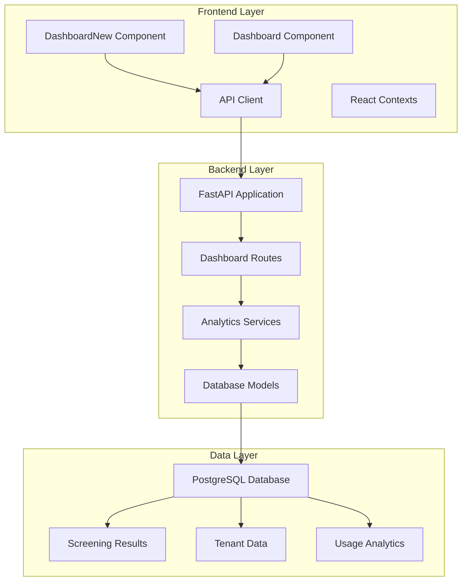
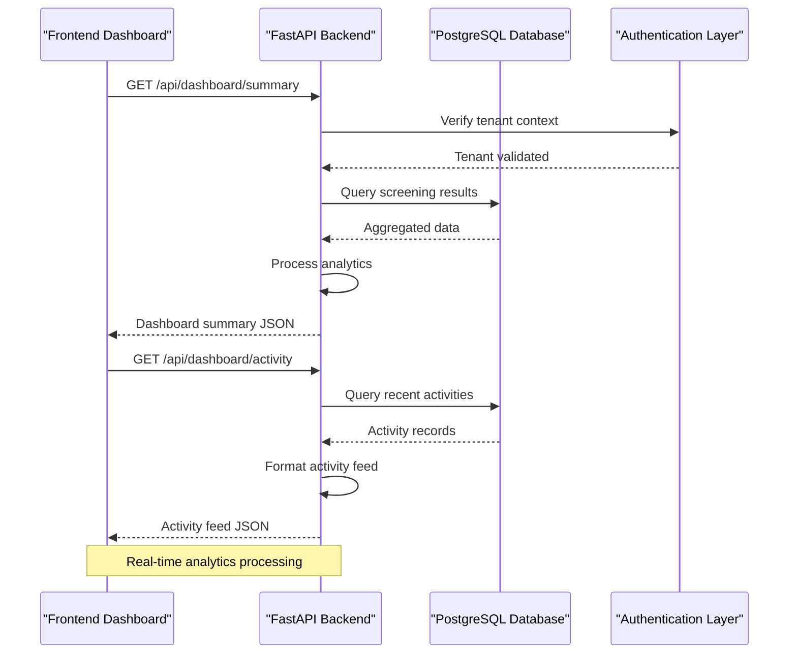
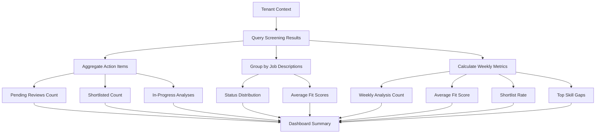
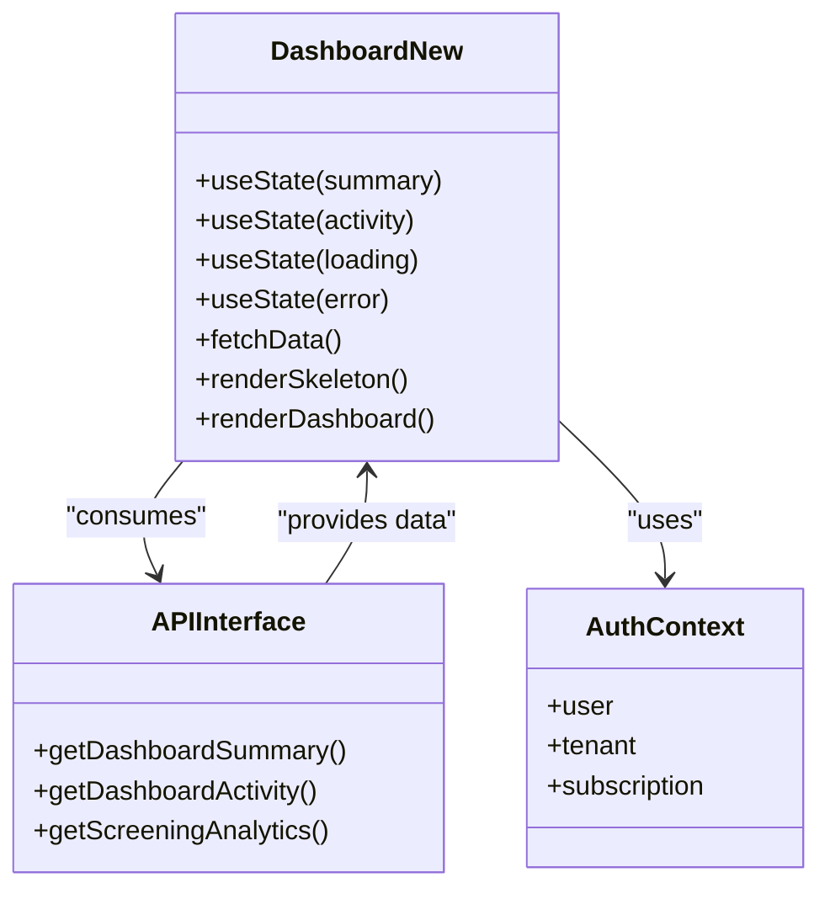
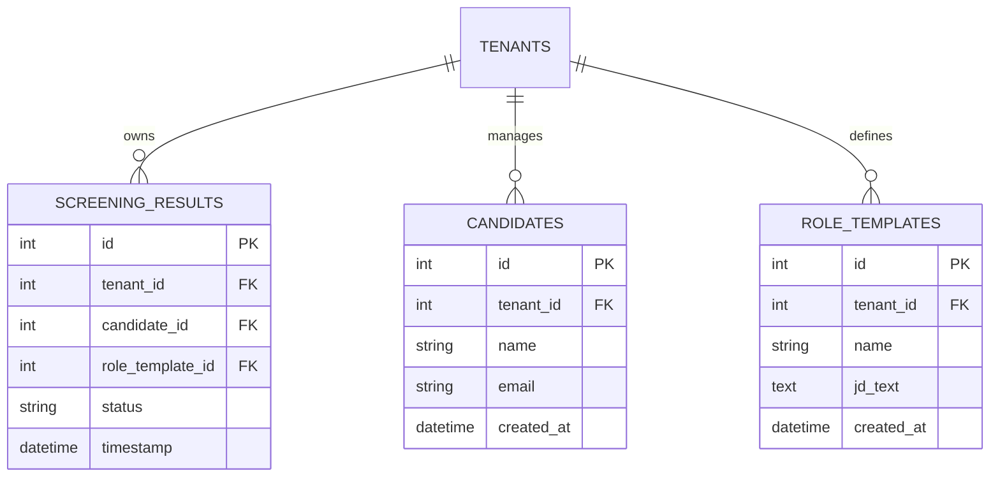
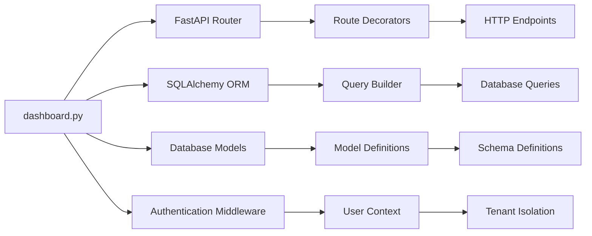
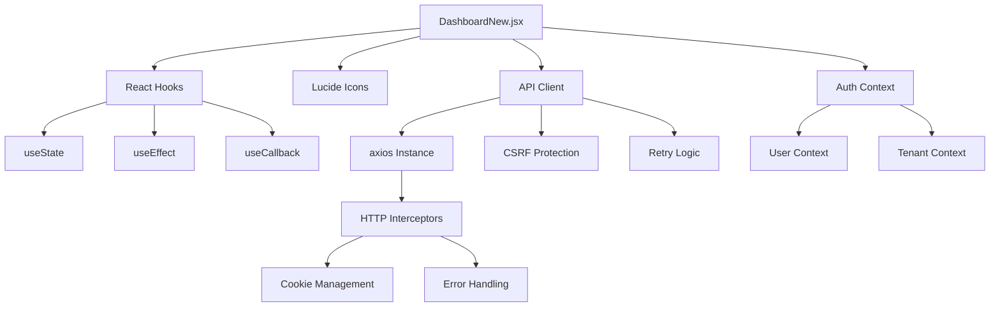

# Dashboard Module

<cite>
**Referenced Files in This Document**
- [dashboard.py](file://app/backend/routes/dashboard.py)
- [main.py](file://app/backend/main.py)
- [api.js](file://app/frontend/src/lib/api.js)
- [DashboardNew.jsx](file://app/frontend/src/pages/DashboardNew.jsx)
- [Dashboard.jsx](file://app/frontend/src/pages/Dashboard.jsx)
- [db_models.py](file://app/backend/models/db_models.py)
</cite>

## Table of Contents
1. [Introduction](#introduction)
2. [Project Structure](#project-structure)
3. [Core Components](#core-components)
4. [Architecture Overview](#architecture-overview)
5. [Detailed Component Analysis](#detailed-component-analysis)
6. [Dependency Analysis](#dependency-analysis)
7. [Performance Considerations](#performance-considerations)
8. [Troubleshooting Guide](#troubleshooting-guide)
9. [Conclusion](#conclusion)

## Introduction

The Dashboard Module is a comprehensive analytics and monitoring system for the ARIA AI Resume Intelligence platform. It provides real-time insights into candidate screening operations, job description pipelines, and organizational analytics. The module consists of two main dashboard interfaces: a modern analytics dashboard for operational insights and a streamlined analysis interface for direct candidate screening.

The dashboard module serves as the central command center for recruiters and hiring teams, offering actionable intelligence through visual dashboards, activity feeds, and performance metrics. It integrates seamlessly with the platform's multi-tenant architecture and provides tenant-scoped analytics for complete visibility into screening operations.

## Project Structure

The dashboard module follows a clear separation of concerns with distinct backend and frontend components:

**Diagram sources**
- [main.py:325-392](file://app/backend/main.py#L325-L392)
- [dashboard.py:20-20](file://app/backend/routes/dashboard.py#L20-L20)

**Section sources**
- [main.py:325-392](file://app/backend/main.py#L325-L392)
- [dashboard.py:20-20](file://app/backend/routes/dashboard.py#L20-L20)

## Core Components

### Backend Dashboard Endpoints

The backend provides three primary dashboard endpoints that serve different analytical purposes:

#### Summary Dashboard Endpoint
The `/api/dashboard/summary` endpoint aggregates key operational metrics including pending reviews, shortlisted candidates, and pipeline analytics grouped by job descriptions. It provides a comprehensive overview of current screening operations.

#### Activity Feed Endpoint  
The `/api/dashboard/activity` endpoint delivers recent screening activities with detailed information about candidate analysis results, fit scores, and recommendations. This creates a real-time audit trail of screening operations.

#### Analytics Dashboard Endpoint
The `/api/analytics/screening` endpoint offers advanced analytics with customizable time periods (7, 30, or 90 days), providing insights into screening performance, skill gap analysis, and effectiveness metrics across different job descriptions.

### Frontend Dashboard Interfaces

#### Modern Dashboard (DashboardNew)
The modern dashboard provides a comprehensive analytics interface with:
- Real-time action item counters (pending reviews, shortlisted, in-progress)
- Pipeline summary cards with status breakdowns
- Recent activity feed with candidate details
- Weekly metrics including average fit scores and skill gap analysis
- Interactive navigation to candidate management and job description libraries

#### Traditional Dashboard (Dashboard)
The traditional dashboard focuses on direct candidate screening with:
- Agent progress visualization showing the six-stage LangGraph pipeline
- Upload forms for resumes and job descriptions
- Real-time analysis progress tracking
- Usage monitoring with subscription limits

**Section sources**
- [dashboard.py:61-186](file://app/backend/routes/dashboard.py#L61-L186)
- [dashboard.py:191-237](file://app/backend/routes/dashboard.py#L191-L237)
- [dashboard.py:242-381](file://app/backend/routes/dashboard.py#L242-L381)
- [DashboardNew.jsx:130-512](file://app/frontend/src/pages/DashboardNew.jsx#L130-L512)
- [Dashboard.jsx:204-330](file://app/frontend/src/pages/Dashboard.jsx#L204-L330)

## Architecture Overview

The dashboard module implements a client-server architecture with clear separation between data presentation and business logic:

**Diagram sources**
- [dashboard.py:61-186](file://app/backend/routes/dashboard.py#L61-L186)
- [dashboard.py:191-237](file://app/backend/routes/dashboard.py#L191-L237)

The architecture ensures tenant isolation through automatic context propagation and provides comprehensive analytics through optimized database queries with appropriate indexing strategies.

**Section sources**
- [dashboard.py:61-186](file://app/backend/routes/dashboard.py#L61-L186)
- [dashboard.py:191-237](file://app/backend/routes/dashboard.py#L191-L237)

## Detailed Component Analysis

### Backend Dashboard Implementation

#### Data Processing Pipeline
The backend implements sophisticated data aggregation through multiple query phases:

**Diagram sources**
- [dashboard.py:69-186](file://app/backend/routes/dashboard.py#L69-L186)

#### Analytics Calculation Methods
The backend employs several calculation strategies:

1. **Fit Score Processing**: Safe parsing and validation of numerical fit scores with error handling
2. **Status Aggregation**: Real-time counting of screening statuses with tenant scoping
3. **Skill Gap Analysis**: Frequency counting of missing skills with normalization
4. **Temporal Filtering**: Flexible time window calculations for historical analytics

**Section sources**
- [dashboard.py:25-56](file://app/backend/routes/dashboard.py#L25-L56)
- [dashboard.py:69-186](file://app/backend/routes/dashboard.py#L69-L186)

### Frontend Dashboard Components

#### Modern Dashboard Architecture
The modern dashboard implements a reactive data fetching strategy:

**Diagram sources**
- [DashboardNew.jsx:130-512](file://app/frontend/src/pages/DashboardNew.jsx#L130-L512)
- [api.js:984-1015](file://app/frontend/src/lib/api.js#L984-L1015)

#### Component Interaction Patterns
The frontend dashboard demonstrates sophisticated state management:

1. **Concurrent Data Fetching**: Parallel API calls for summary and activity data
2. **Loading States**: Comprehensive skeleton loading for improved UX
3. **Error Handling**: Graceful degradation with retry mechanisms
4. **Navigation Integration**: Context-aware routing to candidate management

**Section sources**
- [DashboardNew.jsx:139-154](file://app/frontend/src/pages/DashboardNew.jsx#L139-L154)
- [api.js:984-1015](file://app/frontend/src/lib/api.js#L984-L1015)

### Database Integration

#### Tenant-Scoped Analytics
The dashboard module implements strict tenant isolation through automatic context propagation:

**Diagram sources**
- [db_models.py:135-169](file://app/backend/models/db_models.py#L135-L169)

**Section sources**
- [db_models.py:135-169](file://app/backend/models/db_models.py#L135-L169)

## Dependency Analysis

### Backend Dependencies

The dashboard module has minimal but focused dependencies:

**Diagram sources**
- [dashboard.py:10-16](file://app/backend/routes/dashboard.py#L10-L16)
- [main.py:371-392](file://app/backend/main.py#L371-L392)

### Frontend Dependencies

The frontend dashboard relies on a modular architecture:

**Diagram sources**
- [DashboardNew.jsx:1-10](file://app/frontend/src/pages/DashboardNew.jsx#L1-L10)
- [api.js:1-31](file://app/frontend/src/lib/api.js#L1-L31)

**Section sources**
- [dashboard.py:10-16](file://app/backend/routes/dashboard.py#L10-L16)
- [DashboardNew.jsx:1-10](file://app/frontend/src/pages/DashboardNew.jsx#L1-L10)
- [api.js:1-31](file://app/frontend/src/lib/api.js#L1-L31)

## Performance Considerations

### Backend Optimization Strategies

The dashboard module implements several performance optimization techniques:

1. **Efficient Query Patterns**: Single-pass aggregation queries with appropriate filtering
2. **Index Utilization**: Strategic use of tenant_id and timestamp indexes for filtering
3. **Memory Management**: Streaming results for large datasets and proper resource cleanup
4. **Caching Strategy**: Tenant-scoped caching for frequently accessed job description names

### Frontend Performance Features

The frontend dashboard incorporates multiple performance enhancements:

1. **Lazy Loading**: Conditional component rendering based on loading states
2. **Optimized API Calls**: Concurrent data fetching with proper error handling
3. **State Management**: Efficient state updates to minimize re-renders
4. **Resource Cleanup**: Proper cleanup of event listeners and timers

## Troubleshooting Guide

### Common Issues and Solutions

#### Backend Dashboard Issues
- **Slow Query Performance**: Verify tenant_id indexing and consider query optimization
- **Missing Data**: Check tenant context propagation and database connectivity
- **Analytics Inconsistencies**: Validate fit score parsing and status field normalization

#### Frontend Dashboard Issues
- **Loading Failures**: Implement proper error boundaries and retry mechanisms
- **Authentication Problems**: Verify CSRF token handling and session management
- **Performance Degradation**: Monitor API response times and implement caching strategies

### Debugging Tools

The dashboard module provides comprehensive logging and monitoring capabilities:

1. **Request Tracing**: Correlation IDs for end-to-end request tracking
2. **Error Logging**: Structured logging with contextual information
3. **Performance Metrics**: Built-in Prometheus metrics for monitoring
4. **Health Checks**: Comprehensive health endpoints for system diagnostics

**Section sources**
- [main.py:49-56](file://app/backend/main.py#L49-L56)
- [main.py:406-512](file://app/backend/main.py#L406-L512)

## Conclusion

The Dashboard Module represents a sophisticated analytics solution that provides comprehensive insights into AI-powered candidate screening operations. Its dual-interface design accommodates both operational oversight and direct analysis workflows, while maintaining strict tenant isolation and performance optimization.

The module's architecture demonstrates best practices in modern web application development, with clear separation of concerns, robust error handling, and comprehensive monitoring capabilities. The integration of real-time analytics with tenant-scoped data ensures that organizations can effectively manage their recruitment workflows while maintaining complete data privacy and control.

Future enhancements could include expanded analytics capabilities, additional visualization options, and enhanced export functionality for comprehensive reporting requirements.