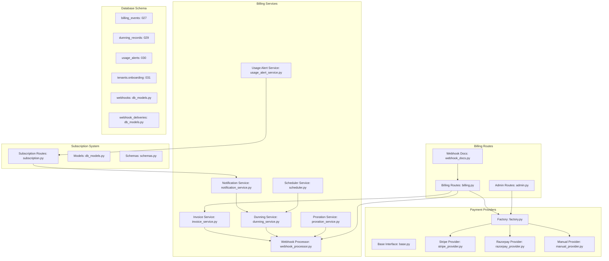
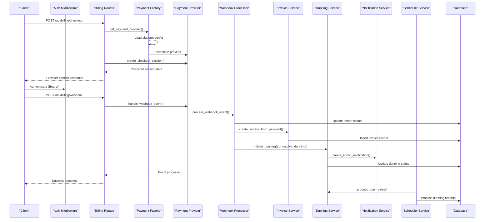
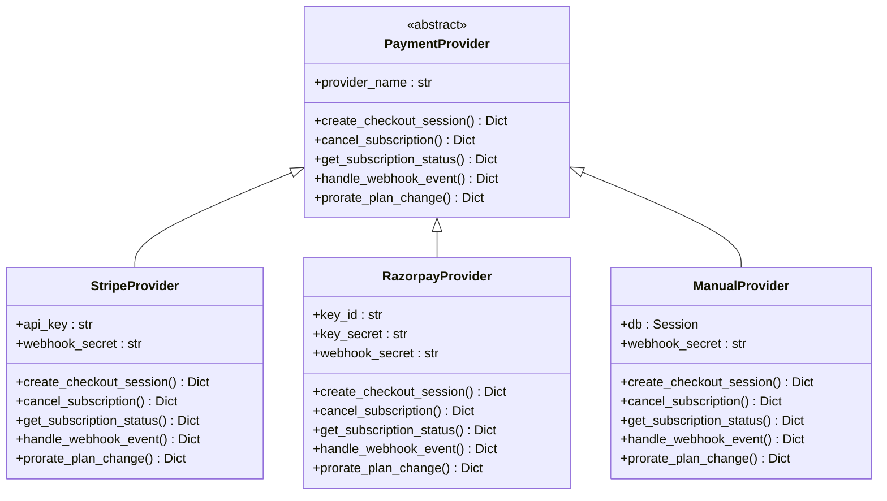
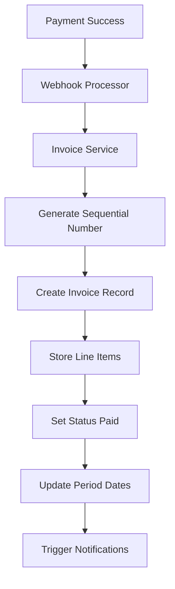
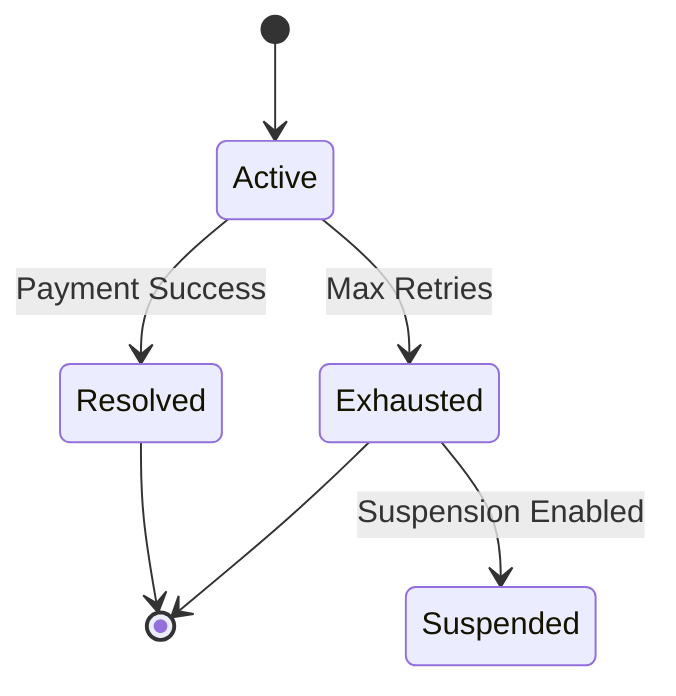
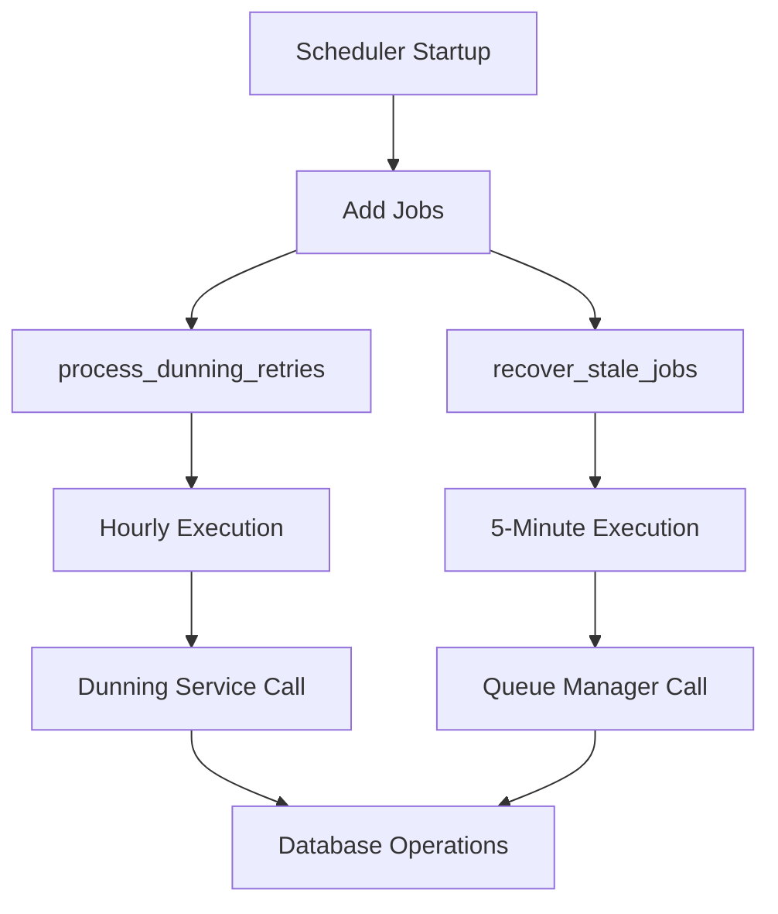

# Subscription & Billing

<cite>
**Referenced Files in This Document**
- [subscription.py](file://app/backend/routes/subscription.py)
- [billing.py](file://app/backend/routes/billing.py)
- [webhook_docs.py](file://app/backend/routes/webhook_docs.py)
- [factory.py](file://app/backend/services/billing/factory.py)
- [base.py](file://app/backend/services/billing/base.py)
- [stripe_provider.py](file://app/backend/services/billing/stripe_provider.py)
- [razorpay_provider.py](file://app/backend/services/billing/razorpay_provider.py)
- [manual_provider.py](file://app/backend/services/billing/manual_provider.py)
- [invoice_service.py](file://app/backend/services/billing/invoice_service.py)
- [webhook_processor.py](file://app/backend/services/billing/webhook_processor.py)
- [dunning_service.py](file://app/backend/services/billing/dunning_service.py)
- [notification_service.py](file://app/backend/services/notification_service.py)
- [scheduler.py](file://app/backend/services/scheduler.py)
- [proration_service.py](file://app/backend/services/proration_service.py)
- [usage_alert_service.py](file://app/backend/services/usage_alert_service.py)
- [admin.py](file://app/backend/routes/admin.py)
- [schemas.py](file://app/backend/models/schemas.py)
- [db_models.py](file://app/backend/models/db_models.py)
- [useSubscription.jsx](file://app/frontend/src/hooks/useSubscription.jsx)
- [main.py](file://app/backend/main.py)
- [auth.py](file://app/backend/middleware/auth.py)
- [analyze.py](file://app/backend/routes/analyze.py)
- [027_billing_events.py](file://alembic/versions/027_billing_events.py)
- [029_dunning_system.py](file://alembic/versions/029_dunning_system.py)
- [030_usage_alerts.py](file://alembic/versions/030_usage_alerts.py)
- [031_onboarding_flag.py](file://alembic/versions/031_onboarding_flag.py)
</cite>

## Update Summary
**Changes Made**
- Added comprehensive webhook event documentation through new webhook_docs route with standardized event registry
- Introduced notification service for administrative alerts and dunning notifications
- Implemented scheduler service for background tasks including dunning retries and stale job recovery
- Enhanced webhook processing with improved audit logging and error handling
- Expanded billing integration with Stripe, Razorpay, and Manual providers including automated webhook processing
- Added webhook signing information and standardized event signatures
- Integrated background scheduler into application lifecycle management

## Table of Contents
1. [Introduction](#introduction)
2. [Project Structure](#project-structure)
3. [Core Components](#core-components)
4. [Architecture Overview](#architecture-overview)
5. [Detailed Component Analysis](#detailed-component-analysis)
6. [Enhanced Webhook Event Documentation](#enhanced-webhook-event-documentation)
7. [Payment Provider System](#payment-provider-system)
8. [Billing Management Endpoints](#billing-management-endpoints)
9. [Invoice Management System](#invoice-management-system)
10. [Dunning and Retry System](#dunning-and-retry-system)
11. [Usage Alerts and Notifications](#usage-alerts-and-notifications)
12. [Background Scheduler and Task Management](#background-scheduler-and-task-management)
13. [Proration Calculations](#proration-calculations)
14. [Platform Configuration Management](#platform-configuration-management)
15. [Database Schema Enhancements](#database-schema-enhancements)
16. [Dependency Analysis](#dependency-analysis)
17. [Performance Considerations](#performance-considerations)
18. [Troubleshooting Guide](#troubleshooting-guide)
19. [Conclusion](#conclusion)

## Introduction
This document provides comprehensive API documentation for the complete SaaS billing system implementation, featuring integrated Stripe and Razorpay payment processing, webhook automation, invoice generation, dunning management, proration calculations, and usage alerts. The system now includes:

- **Multi-Provider Payment Integration**: Seamless Stripe and Razorpay payment processing with unified interface
- **Automated Webhook Processing**: Real-time payment event handling and subscription status updates with comprehensive audit logging
- **Invoice Generation**: Automated invoice creation and management for all payment activities
- **Dunning Management**: Intelligent retry and escalation system for failed payments with tenant suspension workflows
- **Proration Calculations**: Accurate mid-cycle plan change billing adjustments
- **Usage Monitoring**: Configurable threshold-based alerts with 80% and 100% defaults
- **Platform Configuration**: Centralized billing provider management and settings
- **Audit Logging**: Comprehensive billing event tracking and compliance
- **Tenant Onboarding**: Enhanced onboarding tracking and completion flags
- **Webhook Event Registry**: Standardized documentation of all webhook event types and signatures
- **Background Task Processing**: Automated dunning retries and system maintenance tasks

## Project Structure
The enhanced billing system spans multiple backend services, routes, models, and specialized services:

- **Payment Providers**: Factory pattern with Stripe, Razorpay, and Manual implementations
- **Billing Services**: Invoice management, webhook processing, dunning, and proration
- **Subscription Routes**: Enhanced endpoints for plan management and usage tracking
- **Admin Configuration**: Platform-level billing provider setup and management
- **Usage Integration**: Configurable threshold-based alerts and notification dispatch
- **Database Schema**: Dedicated tables for invoices, billing events, dunning, and usage alerts
- **Notification Service**: Administrative alert management and webhook event dispatch
- **Scheduler Service**: Background task automation for dunning retries and system maintenance



**Diagram sources**
- [factory.py:1-94](file://app/backend/services/billing/factory.py#L1-L94)
- [base.py:1-88](file://app/backend/services/billing/base.py#L1-L88)
- [stripe_provider.py:1-153](file://app/backend/services/billing/stripe_provider.py#L1-L153)
- [razorpay_provider.py:1-181](file://app/backend/services/billing/razorpay_provider.py#L1-L181)
- [manual_provider.py:1-176](file://app/backend/services/billing/manual_provider.py#L1-L176)
- [invoice_service.py:1-134](file://app/backend/services/billing/invoice_service.py#L1-L134)
- [webhook_processor.py:1-772](file://app/backend/services/billing/webhook_processor.py#L1-L772)
- [dunning_service.py:1-489](file://app/backend/services/billing/dunning_service.py#L1-L489)
- [notification_service.py:1-62](file://app/backend/services/notification_service.py#L1-L62)
- [scheduler.py:1-111](file://app/backend/services/scheduler.py#L1-L111)
- [proration_service.py:1-143](file://app/backend/services/proration_service.py#L1-L143)
- [usage_alert_service.py:1-272](file://app/backend/services/usage_alert_service.py#L1-L272)
- [billing.py:1-224](file://app/backend/routes/billing.py#L1-L224)
- [subscription.py:1-640](file://app/backend/routes/subscription.py#L1-L640)
- [webhook_docs.py:1-94](file://app/backend/routes/webhook_docs.py#L1-L94)

## Core Components
The comprehensive billing system introduces several key components:

### Multi-Provider Payment Architecture
- **Factory Pattern**: Centralized payment provider instantiation based on platform configuration
- **Unified Interface**: Common `PaymentProvider` base class ensuring consistent behavior
- **Provider Implementations**: Stripe, Razorpay, and Manual providers with provider-specific logic
- **Configuration Management**: Dynamic provider selection and credential loading

### Enhanced Webhook Processing
- **Event Normalization**: Provider-specific events converted to unified format
- **Tenant Mapping**: Automatic tenant lookup and subscription updates
- **Audit Logging**: Comprehensive event tracking with error handling and billing_events table
- **Invoice Generation**: Automatic invoice creation for successful payments
- **Checkout Session Support**: Stripe checkout.session.completed webhook for tenant activation

### Invoice Management System
- **Sequential Numbering**: Year-based invoice numbering (INV-YYYY-NNNNN)
- **Multi-Currency Support**: Currency handling and amount tracking
- **Period Tracking**: Billing period dates and line item management
- **Provider Integration**: Stripe, Razorpay, and Manual invoice support

### Dunning and Retry Management
- **Retry Scheduling**: Configurable retry intervals (1, 3, 7, 14 days)
- **Escalation Logic**: Automatic suspension after maximum retries
- **Notification System**: Retry notifications via webhooks and emails
- **Status Tracking**: Active, exhausted, and resolved dunning states
- **Administrative Notifications**: Critical dunning events trigger admin notifications

### Usage Monitoring and Alerts
- **Threshold Detection**: 80% and 100% usage thresholds with configurable customization
- **Duplicate Prevention**: Unique constraints per billing period
- **Multi-Channel Alerts**: Webhook and email notifications
- **Metric Tracking**: Analyses, storage, and team member limits

### Webhook Event Documentation
- **Standardized Registry**: Comprehensive list of all webhook event types with descriptions
- **Example Payloads**: Representative payloads for each event type
- **Signing Information**: HMAC-SHA256 signature algorithm and header specification
- **Event Categories**: Subscription changes, usage thresholds, dunning events, and tenant status

### Background Task Processing
- **Dunning Retry Automation**: Hourly processing of due dunning retries
- **Stale Job Recovery**: 5-minute recovery of processing jobs with expired leases
- **System Maintenance**: Automated cleanup and monitoring tasks
- **Scheduler Integration**: APScheduler-based background task management

**Section sources**
- [factory.py:13-36](file://app/backend/services/billing/factory.py#L13-L36)
- [webhook_processor.py:634-721](file://app/backend/services/billing/webhook_processor.py#L634-L721)
- [invoice_service.py:18-97](file://app/backend/services/billing/invoice_service.py#L18-L97)
- [dunning_service.py:42-139](file://app/backend/services/billing/dunning_service.py#L42-L139)
- [usage_alert_service.py:21-97](file://app/backend/services/usage_alert_service.py#L21-L97)
- [webhook_docs.py:12-94](file://app/backend/routes/webhook_docs.py#L12-L94)
- [scheduler.py:15-111](file://app/backend/services/scheduler.py#L15-L111)

## Architecture Overview
The enhanced billing system integrates payment providers, automated processing, and comprehensive management into a cohesive architecture:



**Diagram sources**
- [billing.py:46-110](file://app/backend/routes/billing.py#L46-L110)
- [factory.py:39-94](file://app/backend/services/billing/factory.py#L39-L94)
- [webhook_processor.py:654-721](file://app/backend/services/billing/webhook_processor.py#L654-L721)
- [invoice_service.py:47-97](file://app/backend/services/billing/invoice_service.py#L47-L97)
- [dunning_service.py:65-156](file://app/backend/services/billing/dunning_service.py#L65-L156)
- [notification_service.py:23-62](file://app/backend/services/notification_service.py#L23-L62)
- [scheduler.py:15-111](file://app/backend/services/scheduler.py#L15-L111)

## Detailed Component Analysis

### Enhanced Subscription Endpoints
The subscription system now integrates with the comprehensive billing management system:

#### GET /api/subscription/plans
Retrieves available subscription plans with provider-specific pricing and features.

**Response Schema**:
```json
{
  "id": 1,
  "name": "string",
  "display_name": "string", 
  "description": "string",
  "price_monthly": 0,
  "price_yearly": 0,
  "currency": "string",
  "features": ["string"],
  "limits": {}
}
```

**Section sources**
- [subscription.py:182-189](file://app/backend/routes/subscription.py#L182-L189)

#### GET /api/subscription
Enhanced to include comprehensive billing information, usage statistics, and plan details.

**Response Schema**:
```json
{
  "current_plan": {
    "plan": "PlanResponse",
    "status": "string",
    "billing_cycle": "string",
    "current_period_start": "string",
    "current_period_end": "string",
    "price": 0
  },
  "usage": {
    "analyses_used": 0,
    "analyses_limit": 0,
    "storage_used_mb": 0,
    "storage_limit_gb": 0,
    "team_members_count": 0,
    "team_members_limit": 0,
    "percent_used": 0
  },
  "available_plans": ["PlanResponse"],
  "days_until_reset": 0,
  "enabled_features": ["string"]
}
```

**Section sources**
- [subscription.py:192-278](file://app/backend/routes/subscription.py#L192-L278)

#### GET /api/subscription/check/{action}
Enhanced usage checks now consider provider-specific limitations and billing cycles with comprehensive validation.

**Section sources**
- [subscription.py:281-368](file://app/backend/routes/subscription.py#L281-L368)

#### GET /api/subscription/usage-history
Enhanced usage tracking with provider-specific usage patterns and detailed analytics.

**Section sources**
- [subscription.py:371-392](file://app/backend/routes/subscription.py#L371-L392)

#### GET /api/subscription/alerts
New endpoint to retrieve recent usage alerts for the current tenant.

**Section sources**
- [subscription.py:542-551](file://app/backend/routes/subscription.py#L542-L551)

#### GET /api/subscription/alerts/preferences
New endpoint to retrieve notification preferences for usage alerts.

**Section sources**
- [subscription.py:554-564](file://app/backend/routes/subscription.py#L554-L564)

#### PUT /api/subscription/alerts/preferences
New endpoint to update notification preferences for usage alerts (admin only).

**Section sources**
- [subscription.py:567-593](file://app/backend/routes/subscription.py#L567-L593)

**Section sources**
- [subscription.py:182-392](file://app/backend/routes/subscription.py#L182-L392)

## Enhanced Webhook Event Documentation

### Webhook Event Registry
The system now provides comprehensive documentation of all webhook event types through a standardized registry:

**Endpoint**: GET /api/webhooks/events
**Response**: Complete list of webhook events with descriptions and example payloads

**Available Events**:
- `subscription.changed`: Fired when tenant subscription plan or status changes
- `usage.threshold_reached`: Fired when usage reaches 80% or 100% thresholds
- `dunning.started`: Fired when payment fails and dunning retry process begins
- `dunning.resolved`: Fired when dunning is resolved after successful payment
- `dunning.exhausted`: Fired when all dunning retries are exhausted
- `tenant.suspended`: Fired when tenant account is suspended
- `tenant.reactivated`: Fired when suspended tenant is reactivated

**Signing Information**:
- Algorithm: HMAC-SHA256
- Header: X-Webhook-Signature
- Description: Hex-encoded HMAC-SHA256 digest of raw request body

**Section sources**
- [webhook_docs.py:12-94](file://app/backend/routes/webhook_docs.py#L12-L94)

## Payment Provider System

### Factory Pattern Implementation
The payment provider system uses a factory pattern to dynamically instantiate the appropriate provider based on platform configuration:



**Diagram sources**
- [base.py:6-88](file://app/backend/services/billing/base.py#L6-L88)
- [stripe_provider.py:12-153](file://app/backend/services/billing/stripe_provider.py#L12-L153)
- [razorpay_provider.py:12-181](file://app/backend/services/billing/razorpay_provider.py#L12-L181)
- [manual_provider.py:24-176](file://app/backend/services/billing/manual_provider.py#L24-L176)

### Provider Configuration
Each provider requires specific configuration keys stored in the platform configuration system:

**Section sources**
- [factory.py:14-36](file://app/backend/services/billing/factory.py#L14-L36)

## Billing Management Endpoints

### Checkout Session Creation
The `/api/billing/checkout` endpoint creates provider-specific checkout sessions:

**Endpoint**: POST `/api/billing/checkout`
**Authentication**: Required (Bearer)
**Request Body**:
```json
{
  "plan": "string",
  "success_url": "string",
  "cancel_url": "string"
}
```

**Response**: Provider-specific checkout session data
- **Stripe**: `{ session_id, url, provider }`
- **Razorpay**: `{ order_id, key_id, provider }`
- **Manual**: `{ reference_id, provider, message }`

**Section sources**
- [billing.py:46-60](file://app/backend/routes/billing.py#L46-L60)
- [stripe_provider.py:36-64](file://app/backend/services/billing/stripe_provider.py#L36-L64)
- [razorpay_provider.py:42-61](file://app/backend/services/billing/razorpay_provider.py#L42-L61)
- [manual_provider.py:41-55](file://app/backend/services/billing/manual_provider.py#L41-L55)

### Enhanced Webhook Processing
The `/api/billing/webhook` endpoint processes incoming webhook events from payment providers with improved error handling:

**Endpoint**: POST `/api/billing/webhook`
**Authentication**: Not required (provider validates signature)
**Headers**: `X-Signature: string`
**Response**: Normalized webhook event data with provider identification

**Enhanced** With comprehensive error handling, audit logging, and billing_events table integration for all webhook events including Stripe checkout.session.completed

**Section sources**
- [billing.py:63-110](file://app/backend/routes/billing.py#L63-L110)
- [webhook_processor.py:705-772](file://app/backend/services/billing/webhook_processor.py#L705-L772)

### Subscription Status Monitoring
The `/api/billing/subscription/{tenant_id}` endpoint retrieves subscription status:

**Endpoint**: GET `/api/billing/subscription/{tenant_id}`
**Authentication**: Required (admin or same-tenant access)
**Response**: `{ subscription_id, status, current_period_end, provider }`

**Section sources**
- [billing.py:113-131](file://app/backend/routes/billing.py#L113-L131)
- [stripe_provider.py:80-92](file://app/backend/services/billing/stripe_provider.py#L80-L92)
- [razorpay_provider.py:76-88](file://app/backend/services/billing/razorpay_provider.py#L76-L88)
- [manual_provider.py:76-99](file://app/backend/services/billing/manual_provider.py#L76-L99)

### Subscription Cancellation
The `/api/billing/cancel/{tenant_id}` endpoint cancels subscriptions:

**Endpoint**: POST `/api/billing/cancel/{tenant_id}`
**Authentication**: Required (admin or same-tenant access)
**Response**: Provider-specific cancellation result

**Section sources**
- [billing.py:134-153](file://app/backend/routes/billing.py#L134-L153)
- [stripe_provider.py:66-78](file://app/backend/services/billing/stripe_provider.py#L66-L78)
- [razorpay_provider.py:63-74](file://app/backend/services/billing/razorpay_provider.py#L63-L74)
- [manual_provider.py:57-74](file://app/backend/services/billing/manual_provider.py#L57-L74)

### Invoice Management Endpoints
The billing system now includes comprehensive invoice management:

**GET /api/billing/invoices**
**Response**: Paginated list of invoices with detailed information

**GET /api/billing/invoices/{invoice_id}**
**Response**: Single invoice detail with line items and timestamps

**Section sources**
- [billing.py:156-224](file://app/backend/routes/billing.py#L156-L224)
- [invoice_service.py:100-134](file://app/backend/services/billing/invoice_service.py#L100-L134)

## Invoice Management System

### Invoice Generation
The invoice system automatically creates invoices for successful payments:



**Diagram sources**
- [webhook_processor.py:203-225](file://app/backend/services/billing/webhook_processor.py#L203-L225)
- [invoice_service.py:47-97](file://app/backend/services/billing/invoice_service.py#L47-L97)

### Invoice Data Model
Invoices include comprehensive billing information:
- Sequential numbering (INV-YYYY-NNNNN)
- Amount and currency tracking
- Period start/end dates
- Provider-specific identifiers
- Line items with descriptions
- Payment status and timestamps

**Section sources**
- [invoice_service.py:18-97](file://app/backend/services/billing/invoice_service.py#L18-L97)

## Dunning and Retry System

### Dunning Configuration
The system includes configurable retry scheduling and escalation policies:

**Default Configuration**:
- Retry schedule: [1, 3, 7, 14] days
- Maximum retries: 4
- Suspension policy: Enabled after max retries
- Notification policy: Enabled on each retry

### Enhanced Dunning Lifecycle


**Diagram sources**
- [dunning_service.py:64-139](file://app/backend/services/billing/dunning_service.py#L64-L139)
- [dunning_service.py:141-259](file://app/backend/services/billing/dunning_service.py#L141-L259)

### Enhanced Retry Automation
The system automatically processes due retries based on configured schedules:
- Periodic cron/scheduler calls every hour
- Provider-specific retry attempts
- Status updates and notifications
- Escalation to suspension when appropriate
- Stripe invoice payment retry support
- Administrative notifications for critical events

### Administrative Notification Integration
Critical dunning events trigger administrative notifications:
- Dunning exhausted events generate critical severity notifications
- Notifications include tenant details and retry counts
- Admins can monitor dunning status through notification center

**Section sources**
- [dunning_service.py:42-428](file://app/backend/services/billing/dunning_service.py#L42-L428)
- [notification_service.py:23-62](file://app/backend/services/notification_service.py#L23-L62)

## Usage Alerts and Notifications

### Threshold-Based Alerts
The usage alert system monitors plan limits and triggers notifications at configurable thresholds:

**Alert Types**:
- 80% usage threshold (default)
- 100% usage threshold (default)
- Metric-specific alerts (analyses, storage, team members)

### Alert Prevention
Duplicate alerts are prevented within the same billing period using unique constraints:
- Composite unique key: (tenant_id, alert_type, period_key)
- Monthly period key format: YYYY-MM
- Automatic suppression of repeated alerts

### Notification Channels
Alerts are delivered through multiple channels:
- Webhook notifications to external systems
- Email alerts to tenant administrators
- Background processing for reliability

**Section sources**
- [usage_alert_service.py:21-239](file://app/backend/services/usage_alert_service.py#L21-L239)

## Background Scheduler and Task Management

### Scheduler Configuration
The system includes a comprehensive background scheduler for automated task processing:

**Scheduled Tasks**:
- **Dunning Retry Processing**: Every hour to process due dunning retries
- **Stale Job Recovery**: Every 5 minutes to recover processing jobs with expired leases

**Task Details**:
- Dunning retries: Process all dunning records due for retry according to schedule
- Stale job recovery: Reset processing jobs that exceed lease expiration to queued state
- Error handling: Robust error handling with logging and graceful degradation

### Scheduler Integration
The scheduler is integrated into the application lifecycle:

**Startup**: Automatically starts when the application initializes
**Shutdown**: Graceful shutdown when the application terminates
**Configuration**: APScheduler-based with interval triggers and misfire handling

### Task Implementation


**Diagram sources**
- [scheduler.py:78-111](file://app/backend/services/scheduler.py#L78-L111)
- [scheduler.py:15-76](file://app/backend/services/scheduler.py#L15-L76)

**Section sources**
- [scheduler.py:1-111](file://app/backend/services/scheduler.py#L1-111)
- [main.py:307-312](file://app/backend/main.py#L307-L312)

## Proration Calculations

### Mid-Cycle Plan Changes
The proration service calculates accurate billing adjustments for plan changes:

**Calculation Parameters**:
- Old plan price vs new plan price
- Current billing period dates
- Change effective date
- Remaining days in billing period

**Proration Factors**:
- Credit amount for unused portion
- Charge amount for remaining portion
- Net adjustment amount
- Proration factor (0.0 to 1.0)

### Provider-Specific Implementation
- **Stripe**: Automatic proration via provider API
- **Razorpay**: Manual addon/credit calculation
- **Manual**: Provider-agnostic proration logic

**Section sources**
- [proration_service.py:10-143](file://app/backend/services/proration_service.py#L10-L143)
- [stripe_provider.py:94-137](file://app/backend/services/billing/stripe_provider.py#L94-L137)
- [razorpay_provider.py:90-161](file://app/backend/services/billing/razorpay_provider.py#L90-L161)

## Platform Configuration Management

### Billing Configuration Endpoints
Administrators can manage billing provider configurations through dedicated endpoints:

**Endpoint**: GET `/api/admin/billing/config`
**Response**: Current billing configuration with sensitive values masked

**Endpoint**: PUT `/api/admin/billing/config`
**Request Body**: `{ active_provider: string, configs: object }`
**Response**: Confirmation of configuration update

**Endpoint**: GET `/api/admin/billing/providers`
**Response**: Available providers with required configuration fields

### Configuration Storage
Billing configurations are stored in the `platform_configs` table with the following structure:
- `config_key`: Unique identifier (e.g., "billing.active_provider")
- `config_value`: Configuration value (masked for sensitive data)
- `description`: Human-readable description
- `updated_at`: Timestamp of last modification
- `updated_by`: User who made the change

**Section sources**
- [admin.py:946-1066](file://app/backend/routes/admin.py#L946-L1066)
- [db_models.py:367-378](file://app/backend/models/db_models.py#L367-L378)
- [factory.py:39-94](file://app/backend/services/billing/factory.py#L39-L94)

## Database Schema Enhancements

### Billing Events Table
The enhanced webhook system introduces comprehensive audit logging:

**Schema**:
- `id`: Auto-increment primary key
- `provider`: Payment provider name (stripe, razorpay, manual)
- `event_type`: Type of webhook event
- `tenant_id`: Foreign key to tenants table (nullable)
- `raw_payload`: Raw webhook payload (capped at 10,000 chars)
- `result`: Processing result (success, error, ignored)
- `error_detail`: Error details (capped at 2,000 chars)
- `processed_at`: Timestamp of event processing
- `created_at`: Audit record creation timestamp

**Section sources**
- [027_billing_events.py:13-25](file://alembic/versions/027_billing_events.py#L13-L25)

### Dunning Records Table
The dunning system introduces a comprehensive retry tracking mechanism:

**Schema**:
- `id`: UUID primary key
- `tenant_id`: Foreign key to tenants table
- `status`: Active, exhausted, or resolved
- `retry_count`: Current retry attempt number
- `max_retries`: Maximum allowed retries
- `next_retry_at`: Next scheduled retry timestamp
- `last_retry_at`: Last retry attempt timestamp
- `failure_reason`: Reason for payment failure
- `resolved_at`: Resolution timestamp
- `created_at`: Record creation timestamp

**Section sources**
- [029_dunning_system.py:13-42](file://alembic/versions/029_dunning_system.py#L13-L42)

### Usage Alerts Table
The usage alert system tracks threshold breaches with period-based prevention:

**Schema**:
- `id`: UUID primary key
- `tenant_id`: Foreign key to tenants table
- `alert_type`: Metric_threshold combination (e.g., "analyses_80")
- `threshold_percent`: Alert threshold percentage
- `metric_name`: Name of metric being monitored
- `current_value`: Current usage value
- `limit_value`: Plan limit value
- `notified_at`: Alert notification timestamp
- `period_key`: YYYY-MM period identifier
- `UniqueConstraint`: (tenant_id, alert_type, period_key)

**Section sources**
- [030_usage_alerts.py:13-26](file://alembic/versions/030_usage_alerts.py#L13-L26)

### Tenant Onboarding Enhancement
Enhanced tenant tracking with onboarding completion flags:

**Schema**:
- `onboarding_completed`: Boolean flag for onboarding completion
- `onboarding_completed_at`: Timestamp when onboarding was completed

**Section sources**
- [031_onboarding_flag.py:13-15](file://alembic/versions/031_onboarding_flag.py#L13-L15)

### Webhook Infrastructure Tables
Enhanced webhook system includes supporting tables:

**Webhooks Table**:
- `id`, `tenant_id`, `url`, `secret`, `events`, `created_at`, `updated_at`
- Relationship with webhook_deliveries for delivery tracking

**Webhook Deliveries Table**:
- `id`, `webhook_id`, `event`, `payload`, `response_status`, `response_body`
- `success`, `attempt`, `created_at`
- Tracks delivery attempts and responses

**Section sources**
- [db_models.py:505-535](file://app/backend/models/db_models.py#L505-L535)

## Dependency Analysis
The enhanced system introduces new dependencies and relationships:

```mermaid
graph TB
subgraph "Billing Dependencies"
BILL["billing.py"] --> FACT["factory.py"]
FACT --> BASE["base.py"]
FACT --> STR["stripe_provider.py"]
FACT --> RZP["razorpay_provider.py"]
FACT --> MAN["manual_provider.py"]
BILL --> ADMIN["admin.py"]
BILL --> INV["invoice_service.py"]
BILL --> WEB["webhook_processor.py"]
WEB --> DUN["dunning_service.py"]
WEB --> INV
WEB --> ALERT["usage_alert_service.py"]
WEB --> NOTIF["notification_service.py"]
SUB["subscription.py"] --> BILL
SUB --> PRORATE["proration_service.py"]
SUB --> ALERT
WEBDOCS["webhook_docs.py"] --> BILL
SCHED["scheduler.py"] --> DUN
NOTIF --> DBM["db_models.py"]
MIG["027_billing_events.py"] --> DBM
MIG --> MIG29["029_dunning_system.py"]
MIG --> MIG30["030_usage_alerts.py"]
MIG --> MIG31["031_onboarding_flag.py"]
MAIN["main.py"] --> SCHED
MAIN --> BILL
AUTH["auth.py"] --> BILL
ANA["analyze.py"] --> SUB
FE["useSubscription.jsx"] --> SUB
END
```

**Diagram sources**
- [billing.py:1-224](file://app/backend/routes/billing.py#L1-L224)
- [factory.py:1-94](file://app/backend/services/billing/factory.py#L1-L94)
- [admin.py:940-1119](file://app/backend/routes/admin.py#L940-L1119)
- [subscription.py:1-640](file://app/backend/routes/subscription.py#L1-L640)
- [webhook_processor.py:1-772](file://app/backend/services/billing/webhook_processor.py#L1-L772)
- [invoice_service.py:1-134](file://app/backend/services/billing/invoice_service.py#L1-L134)
- [dunning_service.py:1-489](file://app/backend/services/billing/dunning_service.py#L1-L489)
- [notification_service.py:1-62](file://app/backend/services/notification_service.py#L1-L62)
- [scheduler.py:1-111](file://app/backend/services/scheduler.py#L1-L111)
- [proration_service.py:1-143](file://app/backend/services/proration_service.py#L1-L143)
- [usage_alert_service.py:1-272](file://app/backend/services/usage_alert_service.py#L1-L272)
- [webhook_docs.py:1-94](file://app/backend/routes/webhook_docs.py#L1-L94)

**Section sources**
- [billing.py:1-224](file://app/backend/routes/billing.py#L1-L224)
- [factory.py:1-94](file://app/backend/services/billing/factory.py#L1-L94)
- [admin.py:940-1119](file://app/backend/routes/admin.py#L940-L1119)
- [subscription.py:1-640](file://app/backend/routes/subscription.py#L1-L640)
- [webhook_processor.py:1-772](file://app/backend/services/billing/webhook_processor.py#L1-L772)
- [invoice_service.py:1-134](file://app/backend/services/billing/invoice_service.py#L1-L134)
- [dunning_service.py:1-489](file://app/backend/services/billing/dunning_service.py#L1-L489)
- [notification_service.py:1-62](file://app/backend/services/notification_service.py#L1-L62)
- [scheduler.py:1-111](file://app/backend/services/scheduler.py#L1-L111)
- [proration_service.py:1-143](file://app/backend/services/proration_service.py#L1-L143)
- [usage_alert_service.py:1-272](file://app/backend/services/usage_alert_service.py#L1-L272)
- [webhook_docs.py:1-94](file://app/backend/routes/webhook_docs.py#L1-L94)

## Performance Considerations
The enhanced system introduces several performance considerations:

### Provider Selection Optimization
- **Configuration Caching**: Payment provider configuration should be cached to avoid repeated database queries
- **Lazy Loading**: Providers are instantiated only when needed to minimize memory usage
- **Connection Pooling**: External provider APIs should use connection pooling for better performance

### Enhanced Webhook Processing
- **Asynchronous Handling**: Webhook events are processed asynchronously to avoid blocking requests
- **Retry Logic**: Built-in retry mechanisms with exponential backoff for failed deliveries
- **Failure Thresholds**: Automatic disabling of webhooks after excessive failures
- **Audit Logging**: Comprehensive event tracking with capped payload sizes to prevent memory issues
- **Billing Events Table**: Efficient storage and querying of webhook audit data

### Database Optimization
- **Indexing Strategy**: Proper indexing on tenant_id, config_key, and audit fields for fast queries
- **Batch Operations**: Invoice and alert creation uses efficient batch operations
- **Memory Management**: Large datasets are paginated to prevent memory issues
- **Audit Table Design**: Optimized schema for billing event logging and querying

### Usage Tracking Integration
- **Efficient Queries**: Usage calculations optimized with proper indexing
- **Background Processing**: Non-blocking alert and notification dispatch
- **Cache Strategies**: Frequently accessed configuration data cached in memory
- **Scheduler Efficiency**: Background tasks designed for minimal resource impact

### Scheduler Performance
- **Task Isolation**: Separate schedulers for different task types prevent interference
- **Graceful Degradation**: Scheduler failures don't impact core application functionality
- **Resource Management**: Background tasks designed for low memory and CPU footprint

## Troubleshooting Guide

### Payment Provider Issues
- **Provider Not Configured**: Check `/api/admin/billing/config` for proper configuration
- **Missing Dependencies**: Install required packages (stripe, razorpay) for respective providers
- **API Key Errors**: Verify API keys are correctly stored in platform configuration
- **Signature Verification**: Ensure X-Signature header is present for webhook validation

### Enhanced Webhook Processing Problems
- **Event Delivery**: Check billing_events table for failed attempts and error details
- **Provider-Specific Issues**: Review provider documentation for event format differences
- **Audit Logging**: Use billing_events table for debugging webhook processing issues
- **Checkout Session Issues**: Verify tenant metadata is properly stored in Stripe checkout sessions
- **Webhook Documentation**: Use `/api/webhooks/events` endpoint for current event type documentation

### Invoice Management
- **Number Generation**: Verify invoice numbering follows expected INV-YYYY-NNNNN format
- **Amount Matching**: Ensure invoice amounts match provider payment records
- **Period Dates**: Check that billing period dates are correctly captured

### Enhanced Dunning System
- **Retry Scheduling**: Verify dunning configuration matches expected retry intervals
- **Escalation Logic**: Check suspension policies and notification settings
- **Status Tracking**: Monitor dunning_records table for active and exhausted states
- **Stripe Integration**: Verify invoice payment retry functionality works correctly
- **Administrative Notifications**: Check notification_service for critical dunning events

### Usage Alert Issues
- **Threshold Configuration**: Verify alert thresholds and metric limits
- **Duplicate Prevention**: Check unique constraints for period-based alerts
- **Notification Delivery**: Monitor webhook and email delivery status

### Scheduler Issues
- **Task Execution**: Verify scheduler is running and tasks are executing on schedule
- **Background Processing**: Check for errors in dunning retry processing
- **Resource Usage**: Monitor scheduler's impact on system resources
- **Task Recovery**: Verify stale job recovery is working correctly

### Configuration Management
- **Sensitive Data Masking**: Configuration values are automatically masked in API responses
- **Validation Errors**: Provider names must match registry entries exactly
- **Audit Trail**: All configuration changes are logged for security auditing

### Webhook Event Documentation
- **Event Types**: Use `/api/webhooks/events` to verify current supported event types
- **Payload Formats**: Check example payloads for proper event structure
- **Signature Verification**: Ensure HMAC-SHA256 signature validation is working
- **Event Delivery**: Monitor webhook_deliveries table for delivery attempts and responses

**Section sources**
- [webhook_processor.py:675-721](file://app/backend/services/billing/webhook_processor.py#L675-L721)
- [dunning_service.py:385-407](file://app/backend/services/billing/dunning_service.py#L385-L407)
- [usage_alert_service.py:138-224](file://app/backend/services/usage_alert_service.py#L138-L224)
- [admin.py:946-1066](file://app/backend/routes/admin.py#L946-L1066)
- [factory.py:39-94](file://app/backend/services/billing/factory.py#L39-L94)
- [webhook_docs.py:87-94](file://app/backend/routes/webhook_docs.py#L87-L94)
- [scheduler.py:78-111](file://app/backend/services/scheduler.py#L78-L111)
- [notification_service.py:23-62](file://app/backend/services/notification_service.py#L23-L62)

## Conclusion
The comprehensive SaaS billing system provides a robust, extensible foundation for payment processing and subscription management. The multi-provider architecture with Stripe and Razorpay integration offers seamless payment processing, while the enhanced webhook system ensures real-time synchronization with payment providers including comprehensive checkout.session.completed support. The addition of invoice generation, dunning management, proration calculations, and usage alerts creates a complete billing ecosystem that supports scalable subscription-based services. The centralized configuration management enables easy provider switching and maintenance, while comprehensive audit logging ensures compliance and troubleshooting capabilities. The enhanced dunning system with automated retry scheduling and tenant suspension workflows provides reliable payment recovery, and the configurable usage alert system with 80%/100% defaults ensures optimal user experience. The introduction of webhook event documentation, administrative notifications, and background task processing completes the system with enterprise-grade capabilities for billing operations with flexible payment processing and intelligent usage monitoring.