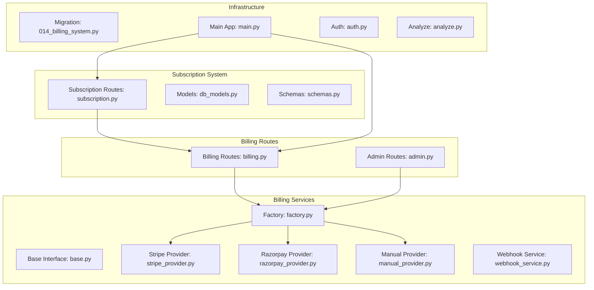
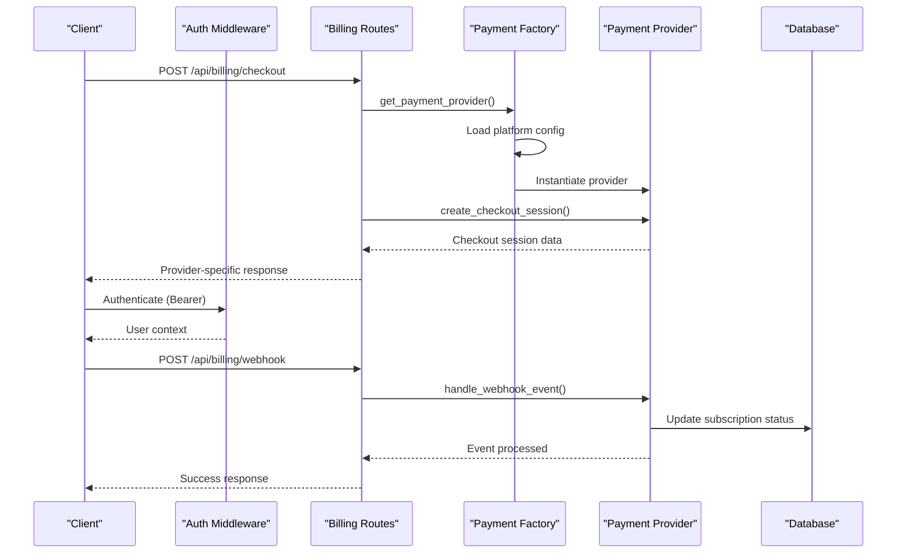
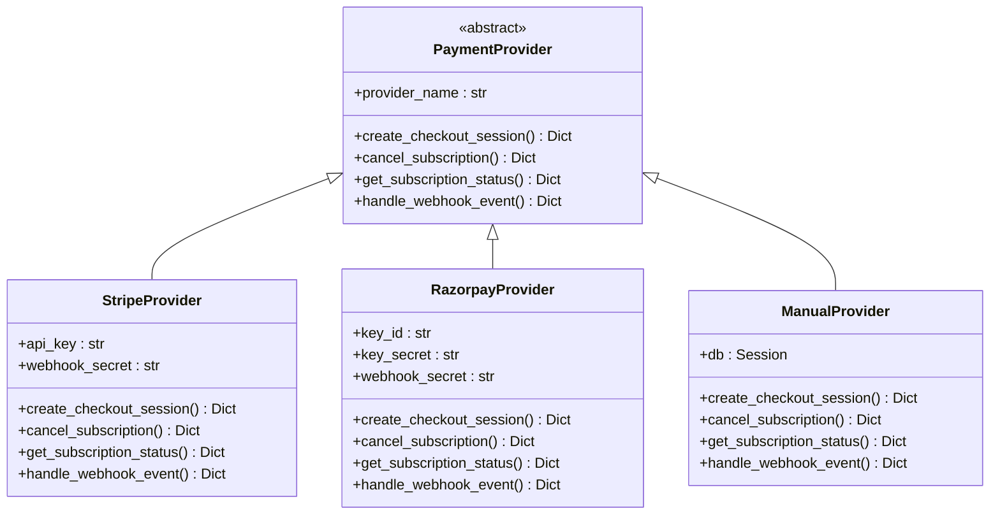

# Subscription & Billing

<cite>
**Referenced Files in This Document**
- [billing.py](file://app/backend/routes/billing.py)
- [factory.py](file://app/backend/services/billing/factory.py)
- [base.py](file://app/backend/services/billing/base.py)
- [stripe_provider.py](file://app/backend/services/billing/stripe_provider.py)
- [razorpay_provider.py](file://app/backend/services/billing/razorpay_provider.py)
- [manual_provider.py](file://app/backend/services/billing/manual_provider.py)
- [webhook_service.py](file://app/backend/services/webhook_service.py)
- [014_billing_system.py](file://alembic/versions/014_billing_system.py)
- [test_billing.py](file://app/backend/tests/test_billing.py)
- [admin.py](file://app/backend/routes/admin.py)
- [subscription.py](file://app/backend/routes/subscription.py)
- [schemas.py](file://app/backend/models/schemas.py)
- [db_models.py](file://app/backend/models/db_models.py)
- [003_subscription_system.py](file://alembic/versions/003_subscription_system.py)
- [useSubscription.jsx](file://app/frontend/src/hooks/useSubscription.jsx)
- [main.py](file://app/backend/main.py)
- [auth.py](file://app/backend/middleware/auth.py)
- [analyze.py](file://app/backend/routes/analyze.py)
</cite>

## Update Summary
**Changes Made**
- Added comprehensive billing management system with factory pattern-based payment provider architecture
- Integrated Stripe, Razorpay, and Manual payment providers with unified interface
- Added checkout session creation, subscription management, and webhook processing endpoints
- Enhanced subscription status monitoring with provider-specific implementations
- Added platform configuration management for billing providers
- Updated usage tracking to work with new billing integration

## Table of Contents
1. [Introduction](#introduction)
2. [Project Structure](#project-structure)
3. [Core Components](#core-components)
4. [Architecture Overview](#architecture-overview)
5. [Detailed Component Analysis](#detailed-component-analysis)
6. [Payment Provider System](#payment-provider-system)
7. [Billing Management Endpoints](#billing-management-endpoints)
8. [Platform Configuration Management](#platform-configuration-management)
9. [Dependency Analysis](#dependency-analysis)
10. [Performance Considerations](#performance-considerations)
11. [Troubleshooting Guide](#troubleshooting-guide)
12. [Conclusion](#conclusion)

## Introduction
This document provides comprehensive API documentation for subscription and usage tracking endpoints, now enhanced with a complete billing management system. The system includes:

- **Enhanced Subscription Management**: Complete billing integration with factory pattern-based payment provider system
- **Multi-Provider Support**: Unified interface supporting Stripe, Razorpay, and Manual invoicing
- **Checkout Sessions**: Provider-specific checkout session creation and management
- **Webhook Processing**: Automated webhook event handling and subscription status updates
- **Subscription Monitoring**: Real-time subscription status tracking across all providers
- **Usage Tracking**: Enhanced usage enforcement with billing integration
- **Configuration Management**: Platform-level billing provider configuration and management

## Project Structure
The enhanced subscription and billing system spans backend routes, services, models, migrations, and tests:

- **Backend Services**: Factory pattern for payment providers, Stripe/Razorpay/Manual implementations
- **Billing Routes**: Checkout sessions, webhook processing, subscription management
- **Platform Config**: Centralized billing configuration management
- **Usage Integration**: Enhanced usage tracking with billing awareness
- **Webhook Dispatch**: Asynchronous webhook delivery with retry logic



**Diagram sources**
- [factory.py:1-91](file://app/backend/services/billing/factory.py#L1-L91)
- [base.py:1-65](file://app/backend/services/billing/base.py#L1-L65)
- [stripe_provider.py:1-100](file://app/backend/services/billing/stripe_provider.py#L1-L100)
- [razorpay_provider.py:1-107](file://app/backend/services/billing/razorpay_provider.py#L1-L107)
- [manual_provider.py:1-102](file://app/backend/services/billing/manual_provider.py#L1-L102)
- [webhook_service.py:1-138](file://app/backend/services/webhook_service.py#L1-L138)
- [billing.py:1-113](file://app/backend/routes/billing.py#L1-L113)
- [admin.py:940-1119](file://app/backend/routes/admin.py#L940-L1119)
- [subscription.py:162-367](file://app/backend/routes/subscription.py#L162-L367)
- [db_models.py:367-378](file://app/backend/models/db_models.py#L367-L378)
- [014_billing_system.py:1-67](file://alembic/versions/014_billing_system.py#L1-L67)
- [main.py:76](file://app/backend/main.py#L76)

**Section sources**
- [factory.py:1-91](file://app/backend/services/billing/factory.py#L1-L91)
- [base.py:1-65](file://app/backend/services/billing/base.py#L1-L65)
- [stripe_provider.py:1-100](file://app/backend/services/billing/stripe_provider.py#L1-L100)
- [razorpay_provider.py:1-107](file://app/backend/services/billing/razorpay_provider.py#L1-L107)
- [manual_provider.py:1-102](file://app/backend/services/billing/manual_provider.py#L1-L102)
- [webhook_service.py:1-138](file://app/backend/services/webhook_service.py#L1-L138)
- [billing.py:1-113](file://app/backend/routes/billing.py#L1-L113)
- [admin.py:940-1119](file://app/backend/routes/admin.py#L940-L1119)
- [subscription.py:162-367](file://app/backend/routes/subscription.py#L162-L367)
- [db_models.py:367-378](file://app/backend/models/db_models.py#L367-L378)
- [014_billing_system.py:1-67](file://alembic/versions/014_billing_system.py#L1-L67)
- [main.py:76](file://app/backend/main.py#L76)

## Core Components
The enhanced system introduces several key components:

### Payment Provider Architecture
- **Factory Pattern**: Centralized payment provider instantiation based on platform configuration
- **Unified Interface**: Common `PaymentProvider` base class ensuring consistent behavior
- **Provider Implementations**: Stripe, Razorpay, and Manual providers with provider-specific logic
- **Configuration Management**: Dynamic provider selection and credential loading

### Billing Management Endpoints
- **Checkout Sessions**: Provider-specific checkout session creation for subscription purchases
- **Webhook Processing**: Automated event handling for payment provider notifications
- **Subscription Management**: Status monitoring, cancellation, and renewal management
- **Admin Configuration**: Platform-level billing provider setup and management

### Enhanced Usage Tracking
- **Billing-Aware Usage**: Integration with payment providers for accurate usage tracking
- **Provider-Specific Logic**: Different handling for each payment provider type
- **Status Synchronization**: Automatic synchronization of subscription status

**Section sources**
- [factory.py:37-91](file://app/backend/services/billing/factory.py#L37-L91)
- [base.py:6-65](file://app/backend/services/billing/base.py#L6-L65)
- [billing.py:39-113](file://app/backend/routes/billing.py#L39-L113)
- [admin.py:946-1066](file://app/backend/routes/admin.py#L946-L1066)

## Architecture Overview
The enhanced subscription system integrates payment providers, billing management, and usage tracking into a cohesive architecture:



**Diagram sources**
- [billing.py:39-69](file://app/backend/routes/billing.py#L39-L69)
- [factory.py:37-91](file://app/backend/services/billing/factory.py#L37-L91)
- [stripe_provider.py:42-56](file://app/backend/services/billing/stripe_provider.py#L42-L56)
- [razorpay_provider.py:42-60](file://app/backend/services/billing/razorpay_provider.py#L42-L60)
- [manual_provider.py:31-45](file://app/backend/services/billing/manual_provider.py#L31-L45)

## Detailed Component Analysis

### Enhanced Subscription Endpoints
The subscription system now integrates with the billing management system:

#### GET /api/subscription/plans
Retrieves available subscription plans with provider-specific pricing and features.

**Section sources**
- [subscription.py:162-169](file://app/backend/routes/subscription.py#L162-L169)

#### GET /api/subscription
Enhanced to include billing provider information and subscription status from payment providers.

**Section sources**
- [subscription.py:172-253](file://app/backend/routes/subscription.py#L172-L253)

#### GET /api/subscription/check/{action}
Usage checks now consider provider-specific limitations and billing cycles.

**Section sources**
- [subscription.py:256-343](file://app/backend/routes/subscription.py#L256-L343)

#### GET /api/subscription/usage-history
Enhanced usage tracking with provider-specific usage patterns.

**Section sources**
- [subscription.py:346-367](file://app/backend/routes/subscription.py#L346-L367)

**Section sources**
- [subscription.py:162-367](file://app/backend/routes/subscription.py#L162-L367)

## Payment Provider System

### Factory Pattern Implementation
The payment provider system uses a factory pattern to dynamically instantiate the appropriate provider based on platform configuration:



**Diagram sources**
- [base.py:6-65](file://app/backend/services/billing/base.py#L6-L65)
- [stripe_provider.py:12-100](file://app/backend/services/billing/stripe_provider.py#L12-L100)
- [razorpay_provider.py:12-107](file://app/backend/services/billing/razorpay_provider.py#L12-L107)
- [manual_provider.py:17-102](file://app/backend/services/billing/manual_provider.py#L17-L102)

### Provider Configuration
Each provider requires specific configuration keys stored in the platform configuration system:

**Section sources**
- [factory.py:14-34](file://app/backend/services/billing/factory.py#L14-L34)
- [014_billing_system.py:38-48](file://alembic/versions/014_billing_system.py#L38-L48)

## Billing Management Endpoints

### Checkout Session Creation
The `/api/billing/checkout` endpoint creates provider-specific checkout sessions:

**Endpoint**: POST `/api/billing/checkout`
**Authentication**: Required (Bearer)
**Request Body**:
```json
{
  "plan": "string",
  "success_url": "string",
  "cancel_url": "string"
}
```

**Response**: Provider-specific checkout session data
- **Stripe**: `{ session_id, url, provider }`
- **Razorpay**: `{ order_id, key_id, provider }`
- **Manual**: `{ reference_id, provider, message }`

**Section sources**
- [billing.py:39-53](file://app/backend/routes/billing.py#L39-L53)
- [stripe_provider.py:42-56](file://app/backend/services/billing/stripe_provider.py#L42-L56)
- [razorpay_provider.py:42-60](file://app/backend/services/billing/razorpay_provider.py#L42-L60)
- [manual_provider.py:31-45](file://app/backend/services/billing/manual_provider.py#L31-L45)

### Webhook Processing
The `/api/billing/webhook` endpoint processes incoming webhook events from payment providers:

**Endpoint**: POST `/api/billing/webhook`
**Authentication**: Not required (provider validates signature)
**Headers**: `X-Signature: string`
**Response**: Normalized webhook event data with provider identification

**Section sources**
- [billing.py:56-69](file://app/backend/routes/billing.py#L56-L69)
- [stripe_provider.py:86-100](file://app/backend/services/billing/stripe_provider.py#L86-L100)
- [razorpay_provider.py:89-107](file://app/backend/services/billing/razorpay_provider.py#L89-L107)
- [manual_provider.py:91-102](file://app/backend/services/billing/manual_provider.py#L91-L102)

### Subscription Status Monitoring
The `/api/billing/subscription/{tenant_id}` endpoint retrieves subscription status:

**Endpoint**: GET `/api/billing/subscription/{tenant_id}`
**Authentication**: Required (admin or same-tenant access)
**Response**: `{ subscription_id, status, current_period_end, provider }`

**Section sources**
- [billing.py:72-90](file://app/backend/routes/billing.py#L72-L90)
- [stripe_provider.py:72-84](file://app/backend/services/billing/stripe_provider.py#L72-L84)
- [razorpay_provider.py:75-87](file://app/backend/services/billing/razorpay_provider.py#L75-L87)
- [manual_provider.py:66-89](file://app/backend/services/billing/manual_provider.py#L66-L89)

### Subscription Cancellation
The `/api/billing/cancel/{tenant_id}` endpoint cancels subscriptions:

**Endpoint**: POST `/api/billing/cancel/{tenant_id}`
**Authentication**: Required (admin or same-tenant access)
**Response**: Provider-specific cancellation result

**Section sources**
- [billing.py:93-112](file://app/backend/routes/billing.py#L93-L112)
- [stripe_provider.py:58-70](file://app/backend/services/billing/stripe_provider.py#L58-L70)
- [razorpay_provider.py:62-73](file://app/backend/services/billing/razorpay_provider.py#L62-L73)
- [manual_provider.py:47-64](file://app/backend/services/billing/manual_provider.py#L47-L64)

## Platform Configuration Management

### Billing Configuration Endpoints
Administrators can manage billing provider configurations through dedicated endpoints:

**Endpoint**: GET `/api/admin/billing/config`
**Response**: Current billing configuration with sensitive values masked

**Endpoint**: PUT `/api/admin/billing/config`
**Request Body**: `{ active_provider: string, configs: object }`
**Response**: Confirmation of configuration update

**Endpoint**: GET `/api/admin/billing/providers`
**Response**: Available providers with required configuration fields

**Section sources**
- [admin.py:946-1066](file://app/backend/routes/admin.py#L946-L1066)

### Configuration Storage
Billing configurations are stored in the `platform_configs` table with the following structure:
- `config_key`: Unique identifier (e.g., "billing.active_provider")
- `config_value`: Configuration value (masked for sensitive data)
- `description`: Human-readable description
- `updated_at`: Timestamp of last modification
- `updated_by`: User who made the change

**Section sources**
- [db_models.py:367-378](file://app/backend/models/db_models.py#L367-L378)
- [014_billing_system.py:38-48](file://alembic/versions/014_billing_system.py#L38-L48)

## Dependency Analysis
The enhanced system introduces new dependencies and relationships:

```mermaid
graph TB
subgraph "Billing Dependencies"
BILL["billing.py"] --> FACT["factory.py"]
FACT --> BASE["base.py"]
FACT --> STR["stripe_provider.py"]
FACT --> RZP["razorpay_provider.py"]
FACT --> MAN["manual_provider.py"]
BILL --> ADMIN["admin.py"]
END
SUB["subscription.py"] --> BILL
WEB["webhook_service.py"] --> BILL
MIG["014_billing_system.py"] --> DBM["db_models.py"]
MAIN["main.py"] --> BILL
AUTH["auth.py"] --> BILL
ANA["analyze.py"] --> SUB
FE["useSubscription.jsx"] --> SUB
```

**Diagram sources**
- [billing.py:1-113](file://app/backend/routes/billing.py#L1-L113)
- [factory.py:1-91](file://app/backend/services/billing/factory.py#L1-L91)
- [admin.py:940-1119](file://app/backend/routes/admin.py#L940-L1119)
- [subscription.py:162-367](file://app/backend/routes/subscription.py#L162-L367)
- [webhook_service.py:1-138](file://app/backend/services/webhook_service.py#L1-L138)
- [014_billing_system.py:1-67](file://alembic/versions/014_billing_system.py#L1-L67)
- [main.py:76](file://app/backend/main.py#L76)

**Section sources**
- [billing.py:1-113](file://app/backend/routes/billing.py#L1-L113)
- [factory.py:1-91](file://app/backend/services/billing/factory.py#L1-L91)
- [admin.py:940-1119](file://app/backend/routes/admin.py#L940-L1119)
- [subscription.py:162-367](file://app/backend/routes/subscription.py#L162-L367)
- [webhook_service.py:1-138](file://app/backend/services/webhook_service.py#L1-L138)
- [014_billing_system.py:1-67](file://alembic/versions/014_billing_system.py#L1-L67)
- [main.py:76](file://app/backend/main.py#L76)

## Performance Considerations
The enhanced system introduces several performance considerations:

### Provider Selection Optimization
- **Configuration Caching**: Payment provider configuration should be cached to avoid repeated database queries
- **Lazy Loading**: Providers are instantiated only when needed to minimize memory usage
- **Connection Pooling**: External provider APIs should use connection pooling for better performance

### Webhook Processing
- **Asynchronous Handling**: Webhook events are processed asynchronously to avoid blocking requests
- **Retry Logic**: Built-in retry mechanisms with exponential backoff for failed deliveries
- **Failure Thresholds**: Automatic disabling of webhooks after excessive failures

### Usage Tracking Integration
- **Batch Operations**: Usage logs are batched and committed efficiently
- **Indexing Strategy**: Proper indexing on tenant_id and created_at for fast queries
- **Memory Management**: Large usage histories are paginated to prevent memory issues

## Troubleshooting Guide

### Payment Provider Issues
- **Provider Not Configured**: Check `/api/admin/billing/config` for proper configuration
- **Missing Dependencies**: Install required packages (stripe, razorpay) for respective providers
- **API Key Errors**: Verify API keys are correctly stored in platform configuration

### Webhook Processing Problems
- **Signature Verification**: Ensure X-Signature header is present for webhook validation
- **Event Delivery**: Check webhook delivery logs for failed attempts
- **Provider-Specific Issues**: Review provider documentation for event format differences

### Subscription Management
- **Status Synchronization**: Manual provider requires manual status updates
- **Cancellation Effects**: Verify subscription cancellation affects usage tracking
- **Provider Migration**: When changing providers, ensure proper data migration

### Configuration Management
- **Sensitive Data Masking**: Configuration values are automatically masked in API responses
- **Validation Errors**: Provider names must match registry entries exactly
- **Audit Trail**: All configuration changes are logged for security auditing

**Section sources**
- [test_billing.py:1-328](file://app/backend/tests/test_billing.py#L1-L328)
- [admin.py:946-1066](file://app/backend/routes/admin.py#L946-L1066)
- [factory.py:37-91](file://app/backend/services/billing/factory.py#L37-L91)

## Conclusion
The enhanced subscription and billing system provides a comprehensive, extensible foundation for payment processing and subscription management. The factory pattern-based architecture supports multiple payment providers seamlessly, while the centralized configuration system enables easy provider switching and management. The integration with usage tracking ensures accurate billing and resource management, while the webhook processing system maintains real-time synchronization with payment providers. This system provides the foundation for scalable subscription-based services with flexible payment processing capabilities.