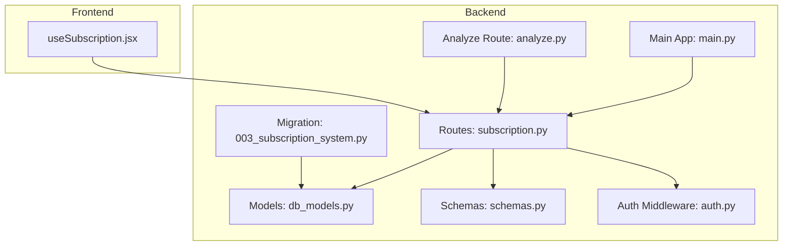
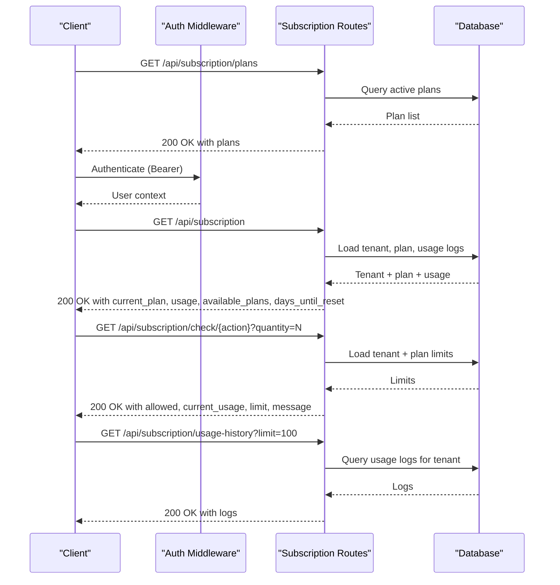
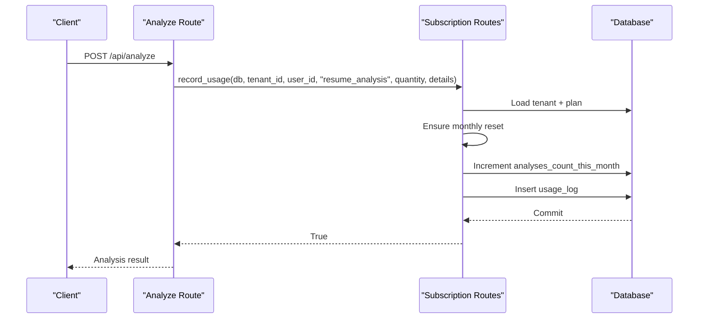
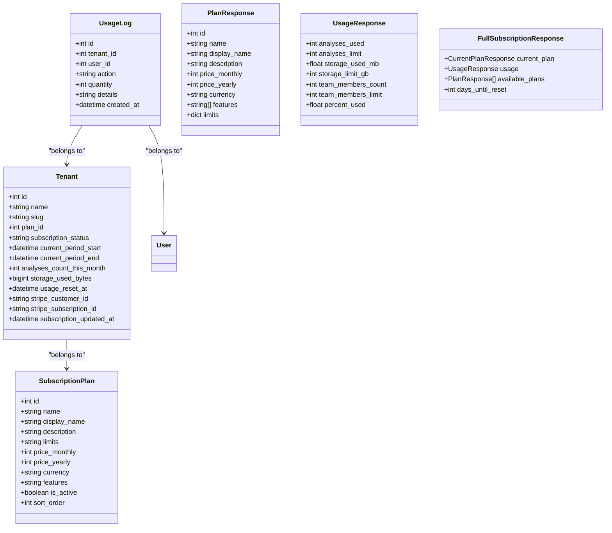
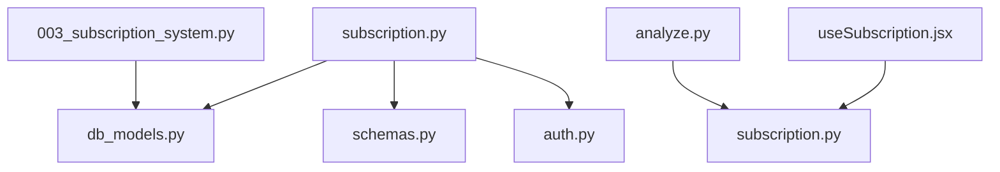

# Subscription & Billing

<cite>
**Referenced Files in This Document**
- [subscription.py](file://app/backend/routes/subscription.py)
- [schemas.py](file://app/backend/models/schemas.py)
- [db_models.py](file://app/backend/models/db_models.py)
- [003_subscription_system.py](file://alembic/versions/003_subscription_system.py)
- [test_subscription.py](file://app/backend/tests/test_subscription.py)
- [test_usage_enforcement.py](file://app/backend/tests/test_usage_enforcement.py)
- [useSubscription.jsx](file://app/frontend/src/hooks/useSubscription.jsx)
- [main.py](file://app/backend/main.py)
- [auth.py](file://app/backend/middleware/auth.py)
- [analyze.py](file://app/backend/routes/analyze.py)
</cite>

## Table of Contents
1. [Introduction](#introduction)
2. [Project Structure](#project-structure)
3. [Core Components](#core-components)
4. [Architecture Overview](#architecture-overview)
5. [Detailed Component Analysis](#detailed-component-analysis)
6. [Dependency Analysis](#dependency-analysis)
7. [Performance Considerations](#performance-considerations)
8. [Troubleshooting Guide](#troubleshooting-guide)
9. [Conclusion](#conclusion)

## Introduction
This document provides comprehensive API documentation for subscription and usage tracking endpoints. It covers:
- Retrieving available subscription plans with feature comparisons
- Checking current plan status, usage limits, and billing information
- Usage tracking endpoints for monitoring API consumption, analysis counts, and feature usage
- Request/response schemas for subscription data, billing cycles, and usage quotas
- Rate limiting, overage handling, and billing integration patterns
- Examples of subscription management workflows and usage monitoring

## Project Structure
The subscription and billing system spans backend routes, models, migrations, tests, and frontend hooks:
- Backend routes define public and admin endpoints for plans, status, usage checks, and usage history
- Models define subscription plans, tenant billing and usage fields, and usage logs
- Migrations seed plans and add usage tracking columns
- Tests validate plan retrieval, usage checks, and admin operations
- Frontend hooks integrate usage checks and subscription status

**Diagram sources**
- [main.py:200-215](file://app/backend/main.py#L200-L215)
- [subscription.py:16-20](file://app/backend/routes/subscription.py#L16-L20)
- [db_models.py:11-92](file://app/backend/models/db_models.py#L11-L92)
- [schemas.py:344-379](file://app/backend/models/schemas.py#L344-L379)
- [003_subscription_system.py:43-252](file://alembic/versions/003_subscription_system.py#L43-L252)
- [auth.py:19-46](file://app/backend/middleware/auth.py#L19-L46)
- [analyze.py:39](file://app/backend/routes/analyze.py#L39)
- [useSubscription.jsx:1-186](file://app/frontend/src/hooks/useSubscription.jsx#L1-L186)

**Section sources**
- [main.py:200-215](file://app/backend/main.py#L200-L215)
- [subscription.py:16-20](file://app/backend/routes/subscription.py#L16-L20)
- [db_models.py:11-92](file://app/backend/models/db_models.py#L11-L92)
- [schemas.py:344-379](file://app/backend/models/schemas.py#L344-L379)
- [003_subscription_system.py:43-252](file://alembic/versions/003_subscription_system.py#L43-L252)
- [auth.py:19-46](file://app/backend/middleware/auth.py#L19-L46)
- [analyze.py:39](file://app/backend/routes/analyze.py#L39)
- [useSubscription.jsx:1-186](file://app/frontend/src/hooks/useSubscription.jsx#L1-L186)

## Core Components
- Subscription routes module defines endpoints for plans, current subscription status, usage checks, and usage history
- Pydantic models define request/response schemas for plans, usage stats, and full subscription responses
- Database models define subscription plans, tenant billing and usage fields, and usage logs
- Migration seeds initial plans and adds usage tracking columns to tenants and creates usage logs table
- Frontend hook integrates usage checks and subscription status display

Key responsibilities:
- Public endpoints: GET /api/subscription/plans, GET /api/subscription, GET /api/subscription/check/{action}, GET /api/subscription/usage-history
- Admin endpoints: POST /api/subscription/admin/reset-usage, POST /api/subscription/admin/change-plan/{plan_id}
- Usage enforcement: record_usage helper increments counters and logs usage after successful analysis

**Section sources**
- [subscription.py:162-367](file://app/backend/routes/subscription.py#L162-L367)
- [schemas.py:344-379](file://app/backend/models/schemas.py#L344-L379)
- [db_models.py:11-92](file://app/backend/models/db_models.py#L11-L92)
- [003_subscription_system.py:119-251](file://alembic/versions/003_subscription_system.py#L119-L251)
- [useSubscription.jsx:13-186](file://app/frontend/src/hooks/useSubscription.jsx#L13-L186)

## Architecture Overview
The subscription system integrates with authentication, analysis routes, and usage logging. The frontend consumes subscription endpoints and usage checks to enforce limits and present usage dashboards.

**Diagram sources**
- [subscription.py:162-367](file://app/backend/routes/subscription.py#L162-L367)
- [auth.py:19-46](file://app/backend/middleware/auth.py#L19-L46)
- [db_models.py:79-92](file://app/backend/models/db_models.py#L79-L92)

## Detailed Component Analysis

### Endpoint: GET /api/subscription/plans
Purpose: Retrieve all available subscription plans for display, including pricing, features, and limits.

- Authentication: Not required
- Response: Array of plan objects
  - id, name, display_name, description
  - price_monthly, price_yearly, currency
  - features (array of strings)
  - limits (object with plan-specific numeric/string flags)

Request
- Method: GET
- Path: /api/subscription/plans
- Authentication: Not required

Response
- 200 OK: Array of plan objects
- Schema: PlanResponse (fields defined in subscription routes)

Notes
- Plans are filtered by is_active and ordered by sort_order
- Features and limits are parsed from JSON stored in the database

**Section sources**
- [subscription.py:162-169](file://app/backend/routes/subscription.py#L162-L169)
- [subscription.py:25-35](file://app/backend/routes/subscription.py#L25-L35)
- [003_subscription_system.py:119-225](file://alembic/versions/003_subscription_system.py#L119-L225)

### Endpoint: GET /api/subscription
Purpose: Retrieve full subscription details for the current tenant, including current plan, usage stats, available plans, and days until reset.

- Authentication: Required
- Response: FullSubscriptionResponse
  - current_plan: CurrentPlanResponse
    - plan: PlanResponse
    - status, billing_cycle, current_period_start, current_period_end, price
  - usage: UsageResponse
    - analyses_used, analyses_limit, storage_used_mb, storage_limit_gb, team_members_count, team_members_limit, percent_used
  - available_plans: Array of PlanResponse
  - days_until_reset: Number of days until monthly reset

Request
- Method: GET
- Path: /api/subscription
- Authentication: Required (Bearer)

Response
- 200 OK: FullSubscriptionResponse
- 401 Unauthorized: If not authenticated

Processing logic
- Loads tenant and plan, ensures monthly reset, calculates storage usage, determines billing cycle, builds usage stats, and lists available plans

**Section sources**
- [subscription.py:172-253](file://app/backend/routes/subscription.py#L172-L253)
- [subscription.py:37-61](file://app/backend/routes/subscription.py#L37-L61)
- [subscription.py:72-158](file://app/backend/routes/subscription.py#L72-L158)
- [subscription.py:117-144](file://app/backend/routes/subscription.py#L117-L144)

### Endpoint: GET /api/subscription/check/{action}
Purpose: Check if performing a specific action would exceed usage limits. Supports resume_analysis, batch_analysis, and storage_upload.

- Authentication: Required
- Path parameters:
  - action: One of resume_analysis, batch_analysis, storage_upload
- Query parameters:
  - quantity: Number of items (default 1)
- Response: UsageCheckResponse
  - allowed: Boolean indicating if action is allowed
  - current_usage: Current usage count for the relevant metric
  - limit: Limit for the metric (negative for unlimited)
  - message: Optional message explaining denial

Supported actions
- resume_analysis: Checks analyses_per_month limit
- batch_analysis: Projects usage increase by quantity
- storage_upload: Checks storage_gb limit (not counted against monthly limit)

**Section sources**
- [subscription.py:256-343](file://app/backend/routes/subscription.py#L256-L343)
- [subscription.py:63-68](file://app/backend/routes/subscription.py#L63-L68)

### Endpoint: GET /api/subscription/usage-history
Purpose: Retrieve recent usage history for the tenant.

- Authentication: Required
- Query parameters:
  - limit: Maximum number of logs to return (default 100)
- Response: Array of usage log objects
  - id, action, quantity, details, created_at, user_email

**Section sources**
- [subscription.py:346-367](file://app/backend/routes/subscription.py#L346-L367)
- [db_models.py:79-92](file://app/backend/models/db_models.py#L79-L92)

### Admin Endpoints
- POST /api/subscription/admin/reset-usage
  - Resets analyses_count_this_month to 0 and updates usage_reset_at
  - Requires admin role
- POST /api/subscription/admin/change-plan/{plan_id}
  - Changes tenant’s plan and updates billing period and status
  - Requires admin role

**Section sources**
- [subscription.py:372-423](file://app/backend/routes/subscription.py#L372-L423)

### Usage Enforcement Integration
Usage enforcement occurs in analysis routes by calling the record_usage helper. After successful analysis, the system:
- Ensures monthly reset
- Checks plan limits
- Increments analyses_count_this_month
- Creates a usage log entry

**Diagram sources**
- [analyze.py:39](file://app/backend/routes/analyze.py#L39)
- [subscription.py:427-477](file://app/backend/routes/subscription.py#L427-L477)

**Section sources**
- [analyze.py:39](file://app/backend/routes/analyze.py#L39)
- [subscription.py:427-477](file://app/backend/routes/subscription.py#L427-L477)

### Data Models and Schemas
Subscription-related models and schemas:

**Diagram sources**
- [db_models.py:11-92](file://app/backend/models/db_models.py#L11-L92)
- [subscription.py:25-61](file://app/backend/routes/subscription.py#L25-L61)

**Section sources**
- [db_models.py:11-92](file://app/backend/models/db_models.py#L11-L92)
- [schemas.py:344-379](file://app/backend/models/schemas.py#L344-L379)
- [subscription.py:25-61](file://app/backend/routes/subscription.py#L25-L61)

## Dependency Analysis
- Routes depend on models and schemas for data representation
- Usage enforcement depends on subscription routes’ record_usage helper
- Frontend hooks depend on subscription endpoints for usage checks and status
- Migration adds subscription and usage tracking columns to tenants and creates usage logs table

**Diagram sources**
- [subscription.py:16-20](file://app/backend/routes/subscription.py#L16-L20)
- [db_models.py:11-92](file://app/backend/models/db_models.py#L11-L92)
- [schemas.py:344-379](file://app/backend/models/schemas.py#L344-L379)
- [auth.py:19-46](file://app/backend/middleware/auth.py#L19-L46)
- [analyze.py:39](file://app/backend/routes/analyze.py#L39)
- [useSubscription.jsx:1-186](file://app/frontend/src/hooks/useSubscription.jsx#L1-L186)
- [003_subscription_system.py:43-252](file://alembic/versions/003_subscription_system.py#L43-L252)

**Section sources**
- [subscription.py:16-20](file://app/backend/routes/subscription.py#L16-L20)
- [db_models.py:11-92](file://app/backend/models/db_models.py#L11-L92)
- [schemas.py:344-379](file://app/backend/models/schemas.py#L344-L379)
- [auth.py:19-46](file://app/backend/middleware/auth.py#L19-L46)
- [analyze.py:39](file://app/backend/routes/analyze.py#L39)
- [useSubscription.jsx:1-186](file://app/frontend/src/hooks/useSubscription.jsx#L1-L186)
- [003_subscription_system.py:43-252](file://alembic/versions/003_subscription_system.py#L43-L252)

## Performance Considerations
- Monthly reset logic compares timestamps and resets counters once per month; ensure timezone-aware timestamps for correctness
- Storage usage calculation aggregates text lengths and snapshot JSON lengths; consider indexing and caching strategies for large datasets
- Usage logs are indexed by tenant and created_at; ensure appropriate indexing for high-volume environments
- Frontend caches subscription data for short intervals to reduce API calls

[No sources needed since this section provides general guidance]

## Troubleshooting Guide
Common issues and resolutions:
- Authentication failures: Ensure Bearer token is included in Authorization header for protected endpoints
- Usage limit exceeded: Use GET /api/subscription/check/{action} to verify limits before performing actions
- Monthly reset not occurring: Verify usage_reset_at is set and monthly boundary logic; ensure UTC timezone
- Storage limit checks: storage_upload action does not count against monthly limit; use storage_gb limit for total storage
- Admin operations: Ensure user has admin role for admin endpoints

Validation and tests
- Tests cover plan retrieval, subscription status, usage checks, usage history, admin reset, and admin plan change
- Integration tests validate usage enforcement in analyze endpoints and batch operations

**Section sources**
- [auth.py:19-46](file://app/backend/middleware/auth.py#L19-L46)
- [subscription.py:256-343](file://app/backend/routes/subscription.py#L256-L343)
- [test_subscription.py:12-384](file://app/backend/tests/test_subscription.py#L12-L384)
- [test_usage_enforcement.py:53-606](file://app/backend/tests/test_usage_enforcement.py#L53-L606)

## Conclusion
The subscription and billing system provides a robust foundation for managing plans, enforcing usage limits, and tracking consumption. Public endpoints expose plan details and current status, while admin endpoints enable operational controls. Usage enforcement integrates with analysis routes to maintain accurate counters and logs. The frontend hooks facilitate client-side checks and optimistic updates for a responsive user experience.