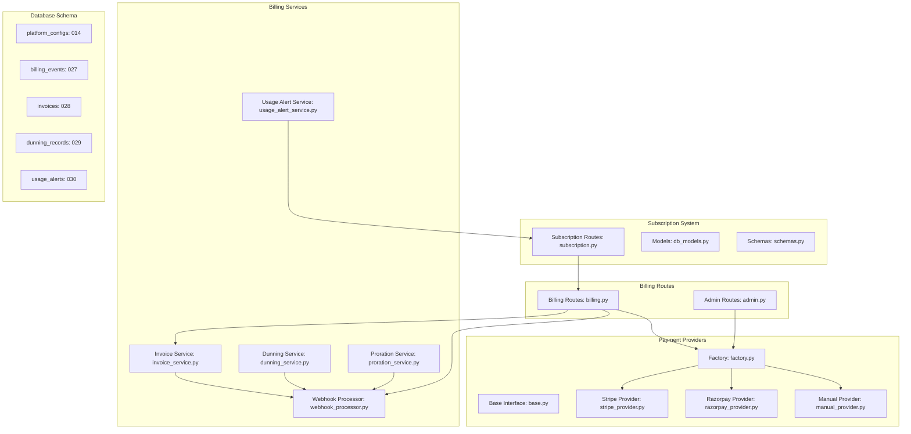
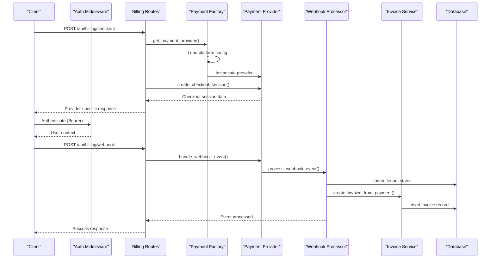
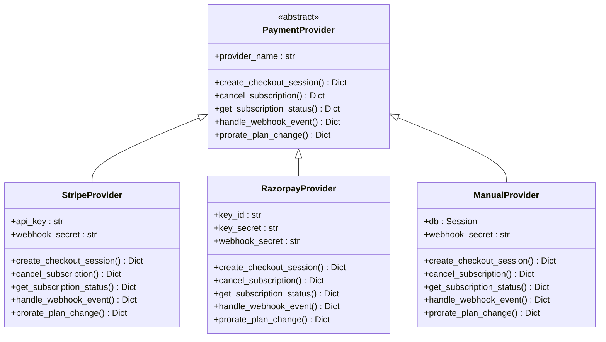
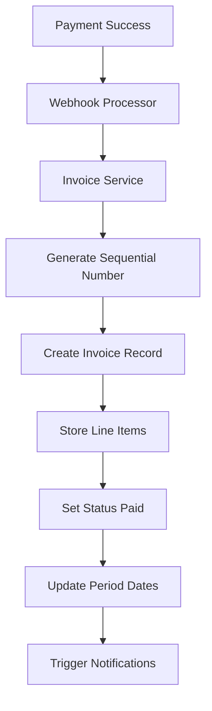
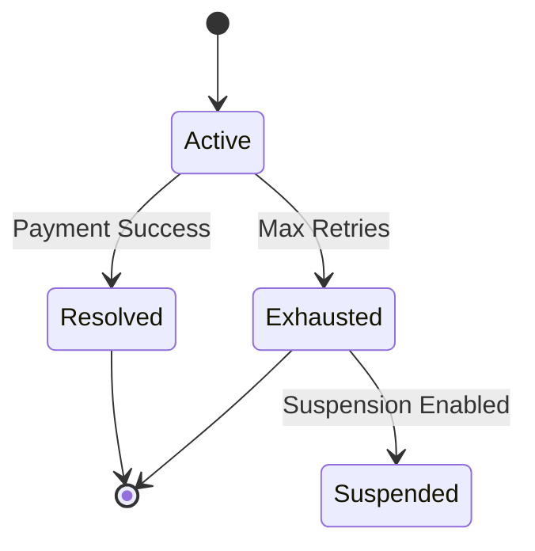

# Subscription & Billing

<cite>
**Referenced Files in This Document**
- [subscription.py](file://app/backend/routes/subscription.py)
- [billing.py](file://app/backend/routes/billing.py)
- [factory.py](file://app/backend/services/billing/factory.py)
- [base.py](file://app/backend/services/billing/base.py)
- [stripe_provider.py](file://app/backend/services/billing/stripe_provider.py)
- [razorpay_provider.py](file://app/backend/services/billing/razorpay_provider.py)
- [manual_provider.py](file://app/backend/services/billing/manual_provider.py)
- [invoice_service.py](file://app/backend/services/billing/invoice_service.py)
- [webhook_processor.py](file://app/backend/services/billing/webhook_processor.py)
- [dunning_service.py](file://app/backend/services/billing/dunning_service.py)
- [proration_service.py](file://app/backend/services/proration_service.py)
- [usage_alert_service.py](file://app/backend/services/usage_alert_service.py)
- [admin.py](file://app/backend/routes/admin.py)
- [schemas.py](file://app/backend/models/schemas.py)
- [db_models.py](file://app/backend/models/db_models.py)
- [useSubscription.jsx](file://app/frontend/src/hooks/useSubscription.jsx)
- [main.py](file://app/backend/main.py)
- [auth.py](file://app/backend/middleware/auth.py)
- [analyze.py](file://app/backend/routes/analyze.py)
</cite>

## Update Summary
**Changes Made**
- Enhanced subscription management with comprehensive billing integration
- Expanded payment provider system supporting Stripe, Razorpay, and Manual providers
- Implemented automated webhook processing with normalized event handling
- Added invoice generation and management with sequential numbering
- Integrated dunning system for failed payment retry and escalation
- Implemented proration calculations for mid-cycle plan changes
- Added usage alerts and notifications with threshold-based monitoring
- Enhanced subscription status tracking with billing cycle detection
- Added platform configuration management for billing providers

## Table of Contents
1. [Introduction](#introduction)
2. [Project Structure](#project-structure)
3. [Core Components](#core-components)
4. [Architecture Overview](#architecture-overview)
5. [Detailed Component Analysis](#detailed-component-analysis)
6. [Payment Provider System](#payment-provider-system)
7. [Billing Management Endpoints](#billing-management-endpoints)
8. [Invoice Management System](#invoice-management-system)
9. [Dunning and Retry System](#dunning-and-retry-system)
10. [Usage Alerts and Notifications](#usage-alerts-and-notifications)
11. [Proration Calculations](#proration-calculations)
12. [Platform Configuration Management](#platform-configuration-management)
13. [Dependency Analysis](#dependency-analysis)
14. [Performance Considerations](#performance-considerations)
15. [Troubleshooting Guide](#troubleshooting-guide)
16. [Conclusion](#conclusion)

## Introduction
This document provides comprehensive API documentation for the complete SaaS billing system implementation, featuring integrated Stripe and Razorpay payment processing, webhook automation, invoice generation, dunning management, proration calculations, and usage alerts. The system now includes:

- **Multi-Provider Payment Integration**: Seamless Stripe and Razorpay payment processing with unified interface
- **Automated Webhook Processing**: Real-time payment event handling and subscription status updates
- **Invoice Generation**: Automated invoice creation and management for all payment activities
- **Dunning Management**: Intelligent retry and escalation system for failed payments
- **Proration Calculations**: Accurate mid-cycle plan change billing adjustments
- **Usage Monitoring**: Threshold-based alerts and notifications for plan limits
- **Platform Configuration**: Centralized billing provider management and settings
- **Audit Logging**: Comprehensive billing event tracking and compliance

## Project Structure
The enhanced billing system spans multiple backend services, routes, models, and specialized services:

- **Payment Providers**: Factory pattern with Stripe, Razorpay, and Manual implementations
- **Billing Services**: Invoice management, webhook processing, dunning, and proration
- **Subscription Routes**: Enhanced endpoints for plan management and usage tracking
- **Admin Configuration**: Platform-level billing provider setup and management
- **Usage Integration**: Threshold-based alerts and notification dispatch
- **Database Schema**: Dedicated tables for invoices, billing events, dunning, and usage alerts



**Diagram sources**
- [factory.py:1-94](file://app/backend/services/billing/factory.py#L1-L94)
- [base.py:1-88](file://app/backend/services/billing/base.py#L1-L88)
- [stripe_provider.py:1-145](file://app/backend/services/billing/stripe_provider.py#L1-L145)
- [razorpay_provider.py:1-180](file://app/backend/services/billing/razorpay_provider.py#L1-L180)
- [manual_provider.py:1-176](file://app/backend/services/billing/manual_provider.py#L1-L176)
- [invoice_service.py:1-134](file://app/backend/services/billing/invoice_service.py#L1-L134)
- [webhook_processor.py:1-200](file://app/backend/services/billing/webhook_processor.py#L1-L200)
- [dunning_service.py:1-200](file://app/backend/services/billing/dunning_service.py#L1-L200)
- [proration_service.py:1-143](file://app/backend/services/proration_service.py#L1-L143)
- [usage_alert_service.py:1-200](file://app/backend/services/usage_alert_service.py#L1-L200)
- [billing.py:1-222](file://app/backend/routes/billing.py#L1-L222)
- [subscription.py:1-594](file://app/backend/routes/subscription.py#L1-L594)

## Core Components
The comprehensive billing system introduces several key components:

### Multi-Provider Payment Architecture
- **Factory Pattern**: Centralized payment provider instantiation based on platform configuration
- **Unified Interface**: Common `PaymentProvider` base class ensuring consistent behavior
- **Provider Implementations**: Stripe, Razorpay, and Manual providers with provider-specific logic
- **Configuration Management**: Dynamic provider selection and credential loading

### Automated Webhook Processing
- **Event Normalization**: Provider-specific events converted to unified format
- **Tenant Mapping**: Automatic tenant lookup and subscription updates
- **Audit Logging**: Comprehensive event tracking with error handling
- **Invoice Generation**: Automatic invoice creation for successful payments

### Invoice Management System
- **Sequential Numbering**: Year-based invoice numbering (INV-YYYY-NNNNN)
- **Multi-Currency Support**: Currency handling and amount tracking
- **Period Tracking**: Billing period dates and line item management
- **Provider Integration**: Stripe, Razorpay, and Manual invoice support

### Dunning and Retry Management
- **Retry Scheduling**: Configurable retry intervals (1, 3, 7, 14 days)
- **Escalation Logic**: Automatic suspension after maximum retries
- **Notification System**: Retry notifications via webhooks and emails
- **Status Tracking**: Active, exhausted, and resolved dunning states

### Usage Monitoring and Alerts
- **Threshold Detection**: 80% and 100% usage thresholds
- **Duplicate Prevention**: Unique constraints per billing period
- **Multi-Channel Alerts**: Webhook and email notifications
- **Metric Tracking**: Analyses, storage, and team member limits

**Section sources**
- [factory.py:13-36](file://app/backend/services/billing/factory.py#L13-L36)
- [webhook_processor.py:634-721](file://app/backend/services/billing/webhook_processor.py#L634-L721)
- [invoice_service.py:18-97](file://app/backend/services/billing/invoice_service.py#L18-L97)
- [dunning_service.py:42-139](file://app/backend/services/billing/dunning_service.py#L42-L139)
- [usage_alert_service.py:21-97](file://app/backend/services/usage_alert_service.py#L21-L97)

## Architecture Overview
The enhanced billing system integrates payment providers, automated processing, and comprehensive management into a cohesive architecture:



**Diagram sources**
- [billing.py:46-110](file://app/backend/routes/billing.py#L46-L110)
- [factory.py:39-94](file://app/backend/services/billing/factory.py#L39-L94)
- [webhook_processor.py:654-721](file://app/backend/services/billing/webhook_processor.py#L654-L721)
- [invoice_service.py:47-97](file://app/backend/services/billing/invoice_service.py#L47-L97)

## Detailed Component Analysis

### Enhanced Subscription Endpoints
The subscription system now integrates with the comprehensive billing management system:

#### GET /api/subscription/plans
Retrieves available subscription plans with provider-specific pricing and features.

**Response Schema**:
```json
{
  "id": 1,
  "name": "string",
  "display_name": "string", 
  "description": "string",
  "price_monthly": 0,
  "price_yearly": 0,
  "currency": "string",
  "features": ["string"],
  "limits": {}
}
```

**Section sources**
- [subscription.py:182-189](file://app/backend/routes/subscription.py#L182-L189)

#### GET /api/subscription
Enhanced to include comprehensive billing information, usage statistics, and plan details.

**Response Schema**:
```json
{
  "current_plan": {
    "plan": "PlanResponse",
    "status": "string",
    "billing_cycle": "string",
    "current_period_start": "string",
    "current_period_end": "string",
    "price": 0
  },
  "usage": {
    "analyses_used": 0,
    "analyses_limit": 0,
    "storage_used_mb": 0,
    "storage_limit_gb": 0,
    "team_members_count": 0,
    "team_members_limit": 0,
    "percent_used": 0
  },
  "available_plans": ["PlanResponse"],
  "days_until_reset": 0,
  "enabled_features": ["string"]
}
```

**Section sources**
- [subscription.py:192-278](file://app/backend/routes/subscription.py#L192-L278)

#### GET /api/subscription/check/{action}
Enhanced usage checks now consider provider-specific limitations and billing cycles with comprehensive validation.

**Section sources**
- [subscription.py:281-368](file://app/backend/routes/subscription.py#L281-L368)

#### GET /api/subscription/usage-history
Enhanced usage tracking with provider-specific usage patterns and detailed analytics.

**Section sources**
- [subscription.py:371-392](file://app/backend/routes/subscription.py#L371-L392)

#### GET /api/subscription/alerts
New endpoint to retrieve recent usage alerts for the current tenant.

**Section sources**
- [subscription.py:542-551](file://app/backend/routes/subscription.py#L542-L551)

#### GET /api/subscription/alerts/preferences
New endpoint to retrieve notification preferences for usage alerts.

**Section sources**
- [subscription.py:554-564](file://app/backend/routes/subscription.py#L554-L564)

#### PUT /api/subscription/alerts/preferences
New endpoint to update notification preferences for usage alerts (admin only).

**Section sources**
- [subscription.py:567-593](file://app/backend/routes/subscription.py#L567-L593)

**Section sources**
- [subscription.py:182-392](file://app/backend/routes/subscription.py#L182-L392)

## Payment Provider System

### Factory Pattern Implementation
The payment provider system uses a factory pattern to dynamically instantiate the appropriate provider based on platform configuration:



**Diagram sources**
- [base.py:6-88](file://app/backend/services/billing/base.py#L6-L88)
- [stripe_provider.py:12-145](file://app/backend/services/billing/stripe_provider.py#L12-L145)
- [razorpay_provider.py:12-180](file://app/backend/services/billing/razorpay_provider.py#L12-L180)
- [manual_provider.py:24-176](file://app/backend/services/billing/manual_provider.py#L24-L176)

### Provider Configuration
Each provider requires specific configuration keys stored in the platform configuration system:

**Section sources**
- [factory.py:14-36](file://app/backend/services/billing/factory.py#L14-L36)

## Billing Management Endpoints

### Checkout Session Creation
The `/api/billing/checkout` endpoint creates provider-specific checkout sessions:

**Endpoint**: POST `/api/billing/checkout`
**Authentication**: Required (Bearer)
**Request Body**:
```json
{
  "plan": "string",
  "success_url": "string",
  "cancel_url": "string"
}
```

**Response**: Provider-specific checkout session data
- **Stripe**: `{ session_id, url, provider }`
- **Razorpay**: `{ order_id, key_id, provider }`
- **Manual**: `{ reference_id, provider, message }`

**Section sources**
- [billing.py:46-60](file://app/backend/routes/billing.py#L46-L60)
- [stripe_provider.py:36-56](file://app/backend/services/billing/stripe_provider.py#L36-L56)
- [razorpay_provider.py:42-60](file://app/backend/services/billing/razorpay_provider.py#L42-L60)
- [manual_provider.py:41-55](file://app/backend/services/billing/manual_provider.py#L41-L55)

### Webhook Processing
The `/api/billing/webhook` endpoint processes incoming webhook events from payment providers:

**Endpoint**: POST `/api/billing/webhook`
**Authentication**: Not required (provider validates signature)
**Headers**: `X-Signature: string`
**Response**: Normalized webhook event data with provider identification

**Section sources**
- [billing.py:63-110](file://app/backend/routes/billing.py#L63-L110)
- [webhook_processor.py:654-721](file://app/backend/services/billing/webhook_processor.py#L654-L721)

### Subscription Status Monitoring
The `/api/billing/subscription/{tenant_id}` endpoint retrieves subscription status:

**Endpoint**: GET `/api/billing/subscription/{tenant_id}`
**Authentication**: Required (admin or same-tenant access)
**Response**: `{ subscription_id, status, current_period_end, provider }`

**Section sources**
- [billing.py:113-131](file://app/backend/routes/billing.py#L113-L131)
- [stripe_provider.py:72-84](file://app/backend/services/billing/stripe_provider.py#L72-L84)
- [razorpay_provider.py:75-87](file://app/backend/services/billing/razorpay_provider.py#L75-L87)
- [manual_provider.py:76-99](file://app/backend/services/billing/manual_provider.py#L76-L99)

### Subscription Cancellation
The `/api/billing/cancel/{tenant_id}` endpoint cancels subscriptions:

**Endpoint**: POST `/api/billing/cancel/{tenant_id}`
**Authentication**: Required (admin or same-tenant access)
**Response**: Provider-specific cancellation result

**Section sources**
- [billing.py:134-153](file://app/backend/routes/billing.py#L134-L153)
- [stripe_provider.py:58-70](file://app/backend/services/billing/stripe_provider.py#L58-L70)
- [razorpay_provider.py:62-73](file://app/backend/services/billing/razorpay_provider.py#L62-L73)
- [manual_provider.py:57-74](file://app/backend/services/billing/manual_provider.py#L57-L74)

### Invoice Management Endpoints
The billing system now includes comprehensive invoice management:

**GET /api/billing/invoices**
**Response**: Paginated list of invoices with detailed information

**GET /api/billing/invoices/{invoice_id}**
**Response**: Single invoice detail with line items and timestamps

**Section sources**
- [billing.py:156-222](file://app/backend/routes/billing.py#L156-L222)
- [invoice_service.py:100-134](file://app/backend/services/billing/invoice_service.py#L100-L134)

## Invoice Management System

### Invoice Generation
The invoice system automatically creates invoices for successful payments:



**Diagram sources**
- [webhook_processor.py:154-175](file://app/backend/services/billing/webhook_processor.py#L154-L175)
- [invoice_service.py:47-97](file://app/backend/services/billing/invoice_service.py#L47-L97)

### Invoice Data Model
Invoices include comprehensive billing information:
- Sequential numbering (INV-YYYY-NNNNN)
- Amount and currency tracking
- Period start/end dates
- Provider-specific identifiers
- Line items with descriptions
- Payment status and timestamps

**Section sources**
- [invoice_service.py:18-97](file://app/backend/services/billing/invoice_service.py#L18-L97)

## Dunning and Retry System

### Dunning Configuration
The system includes configurable retry scheduling and escalation policies:

**Default Configuration**:
- Retry schedule: [1, 3, 7, 14] days
- Maximum retries: 4
- Suspension policy: Enabled after max retries
- Notification policy: Enabled on each retry

### Dunning Lifecycle


**Diagram sources**
- [dunning_service.py:64-139](file://app/backend/services/billing/dunning_service.py#L64-L139)
- [dunning_service.py:141-259](file://app/backend/services/billing/dunning_service.py#L141-L259)

### Retry Automation
The system automatically processes due retries based on configured schedules:
- Periodic cron/scheduler calls
- Provider-specific retry attempts
- Status updates and notifications
- Escalation to suspension when appropriate

**Section sources**
- [dunning_service.py:42-428](file://app/backend/services/billing/dunning_service.py#L42-L428)

## Usage Alerts and Notifications

### Threshold-Based Alerts
The usage alert system monitors plan limits and triggers notifications at configurable thresholds:

**Alert Types**:
- 80% usage threshold
- 100% usage threshold
- Metric-specific alerts (analyses, storage, team members)

### Alert Prevention
Duplicate alerts are prevented within the same billing period using unique constraints:
- Composite unique key: (tenant_id, alert_type, period_key)
- Monthly period key format: YYYY-MM
- Automatic suppression of repeated alerts

### Notification Channels
Alerts are delivered through multiple channels:
- Webhook notifications to external systems
- Email alerts to tenant administrators
- Background processing for reliability

**Section sources**
- [usage_alert_service.py:21-239](file://app/backend/services/usage_alert_service.py#L21-L239)

## Proration Calculations

### Mid-Cycle Plan Changes
The proration service calculates accurate billing adjustments for plan changes:

**Calculation Parameters**:
- Old plan price vs new plan price
- Current billing period dates
- Change effective date
- Remaining days in billing period

**Proration Factors**:
- Credit amount for unused portion
- Charge amount for remaining portion
- Net adjustment amount
- Proration factor (0.0 to 1.0)

### Provider-Specific Implementation
- **Stripe**: Automatic proration via provider API
- **Razorpay**: Manual addon/credit calculation
- **Manual**: Provider-agnostic proration logic

**Section sources**
- [proration_service.py:10-143](file://app/backend/services/proration_service.py#L10-L143)
- [stripe_provider.py:86-130](file://app/backend/services/billing/stripe_provider.py#L86-L130)
- [razorpay_provider.py:89-160](file://app/backend/services/billing/razorpay_provider.py#L89-L160)

## Platform Configuration Management

### Billing Configuration Endpoints
Administrators can manage billing provider configurations through dedicated endpoints:

**Endpoint**: GET `/api/admin/billing/config`
**Response**: Current billing configuration with sensitive values masked

**Endpoint**: PUT `/api/admin/billing/config`
**Request Body**: `{ active_provider: string, configs: object }`
**Response**: Confirmation of configuration update

**Endpoint**: GET `/api/admin/billing/providers`
**Response**: Available providers with required configuration fields

### Configuration Storage
Billing configurations are stored in the `platform_configs` table with the following structure:
- `config_key`: Unique identifier (e.g., "billing.active_provider")
- `config_value`: Configuration value (masked for sensitive data)
- `description`: Human-readable description
- `updated_at`: Timestamp of last modification
- `updated_by`: User who made the change

**Section sources**
- [admin.py:946-1066](file://app/backend/routes/admin.py#L946-L1066)
- [db_models.py:367-378](file://app/backend/models/db_models.py#L367-L378)
- [factory.py:39-94](file://app/backend/services/billing/factory.py#L39-L94)

## Dependency Analysis
The enhanced system introduces new dependencies and relationships:

```mermaid
graph TB
subgraph "Billing Dependencies"
BILL["billing.py"] --> FACT["factory.py"]
FACT --> BASE["base.py"]
FACT --> STR["stripe_provider.py"]
FACT --> RZP["razorpay_provider.py"]
FACT --> MAN["manual_provider.py"]
BILL --> ADMIN["admin.py"]
BILL --> INV["invoice_service.py"]
BILL --> WEB["webhook_processor.py"]
WEB --> DUN["dunning_service.py"]
WEB --> INV
WEB --> ALERT["usage_alert_service.py"]
SUB["subscription.py"] --> BILL
SUB --> PRORATE["proration_service.py"]
SUB --> ALERT
MIG["014_billing_system.py"] --> DBM["db_models.py"]
MIG --> MIG27["027_billing_events.py"]
MIG --> MIG28["028_invoices.py"]
MIG --> MIG29["029_dunning_system.py"]
MIG --> MIG30["030_usage_alerts.py"]
MAIN["main.py"] --> BILL
AUTH["auth.py"] --> BILL
ANA["analyze.py"] --> SUB
FE["useSubscription.jsx"] --> SUB
END
```

**Diagram sources**
- [billing.py:1-222](file://app/backend/routes/billing.py#L1-L222)
- [factory.py:1-94](file://app/backend/services/billing/factory.py#L1-L94)
- [admin.py:940-1119](file://app/backend/routes/admin.py#L940-L1119)
- [subscription.py:1-594](file://app/backend/routes/subscription.py#L1-L594)
- [webhook_processor.py:1-200](file://app/backend/services/billing/webhook_processor.py#L1-L200)
- [invoice_service.py:1-134](file://app/backend/services/billing/invoice_service.py#L1-L134)
- [dunning_service.py:1-200](file://app/backend/services/billing/dunning_service.py#L1-L200)
- [proration_service.py:1-143](file://app/backend/services/proration_service.py#L1-L143)
- [usage_alert_service.py:1-200](file://app/backend/services/usage_alert_service.py#L1-L200)

**Section sources**
- [billing.py:1-222](file://app/backend/routes/billing.py#L1-L222)
- [factory.py:1-94](file://app/backend/services/billing/factory.py#L1-L94)
- [admin.py:940-1119](file://app/backend/routes/admin.py#L940-L1119)
- [subscription.py:1-594](file://app/backend/routes/subscription.py#L1-L594)
- [webhook_processor.py:1-200](file://app/backend/services/billing/webhook_processor.py#L1-L200)
- [invoice_service.py:1-134](file://app/backend/services/billing/invoice_service.py#L1-L134)
- [dunning_service.py:1-200](file://app/backend/services/billing/dunning_service.py#L1-L200)
- [proration_service.py:1-143](file://app/backend/services/proration_service.py#L1-L143)
- [usage_alert_service.py:1-200](file://app/backend/services/usage_alert_service.py#L1-L200)

## Performance Considerations
The enhanced system introduces several performance considerations:

### Provider Selection Optimization
- **Configuration Caching**: Payment provider configuration should be cached to avoid repeated database queries
- **Lazy Loading**: Providers are instantiated only when needed to minimize memory usage
- **Connection Pooling**: External provider APIs should use connection pooling for better performance

### Webhook Processing
- **Asynchronous Handling**: Webhook events are processed asynchronously to avoid blocking requests
- **Retry Logic**: Built-in retry mechanisms with exponential backoff for failed deliveries
- **Failure Thresholds**: Automatic disabling of webhooks after excessive failures

### Database Optimization
- **Indexing Strategy**: Proper indexing on tenant_id, config_key, and audit fields for fast queries
- **Batch Operations**: Invoice and alert creation uses efficient batch operations
- **Memory Management**: Large datasets are paginated to prevent memory issues

### Usage Tracking Integration
- **Efficient Queries**: Usage calculations optimized with proper indexing
- **Background Processing**: Non-blocking alert and notification dispatch
- **Cache Strategies**: Frequently accessed configuration data cached in memory

## Troubleshooting Guide

### Payment Provider Issues
- **Provider Not Configured**: Check `/api/admin/billing/config` for proper configuration
- **Missing Dependencies**: Install required packages (stripe, razorpay) for respective providers
- **API Key Errors**: Verify API keys are correctly stored in platform configuration
- **Signature Verification**: Ensure X-Signature header is present for webhook validation

### Webhook Processing Problems
- **Event Delivery**: Check billing_events table for failed attempts and error details
- **Provider-Specific Issues**: Review provider documentation for event format differences
- **Audit Logging**: Use billing_events table for debugging webhook processing issues

### Invoice Management
- **Number Generation**: Verify invoice numbering follows expected INV-YYYY-NNNNN format
- **Amount Matching**: Ensure invoice amounts match provider payment records
- **Period Dates**: Check that billing period dates are correctly captured

### Dunning System
- **Retry Scheduling**: Verify dunning configuration matches expected retry intervals
- **Escalation Logic**: Check suspension policies and notification settings
- **Status Tracking**: Monitor dunning_records table for active and exhausted states

### Usage Alert Issues
- **Threshold Configuration**: Verify alert thresholds and metric limits
- **Duplicate Prevention**: Check unique constraints for period-based alerts
- **Notification Delivery**: Monitor webhook and email delivery status

### Configuration Management
- **Sensitive Data Masking**: Configuration values are automatically masked in API responses
- **Validation Errors**: Provider names must match registry entries exactly
- **Audit Trail**: All configuration changes are logged for security auditing

**Section sources**
- [webhook_processor.py:675-721](file://app/backend/services/billing/webhook_processor.py#L675-L721)
- [dunning_service.py:385-407](file://app/backend/services/billing/dunning_service.py#L385-L407)
- [usage_alert_service.py:138-224](file://app/backend/services/usage_alert_service.py#L138-L224)
- [admin.py:946-1066](file://app/backend/routes/admin.py#L946-L1066)
- [factory.py:39-94](file://app/backend/services/billing/factory.py#L39-L94)

## Conclusion
The comprehensive SaaS billing system provides a robust, extensible foundation for payment processing and subscription management. The multi-provider architecture with Stripe and Razorpay integration offers seamless payment processing, while the automated webhook system ensures real-time synchronization with payment providers. The addition of invoice generation, dunning management, proration calculations, and usage alerts creates a complete billing ecosystem that supports scalable subscription-based services. The centralized configuration management enables easy provider switching and maintenance, while comprehensive audit logging ensures compliance and troubleshooting capabilities. This system provides the foundation for enterprise-grade billing operations with flexible payment processing and intelligent usage monitoring.