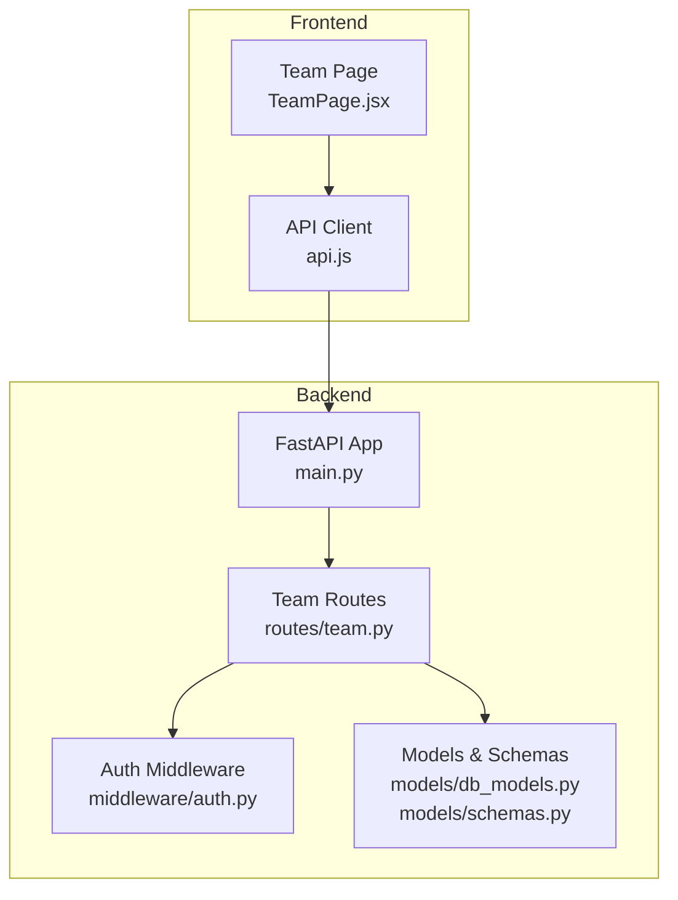
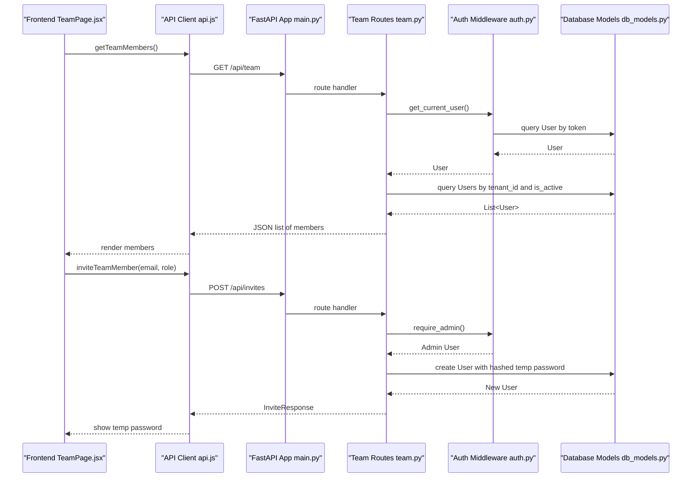
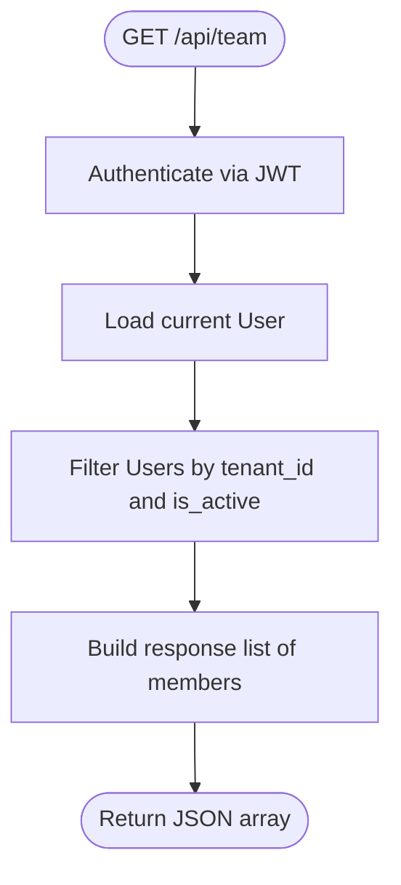
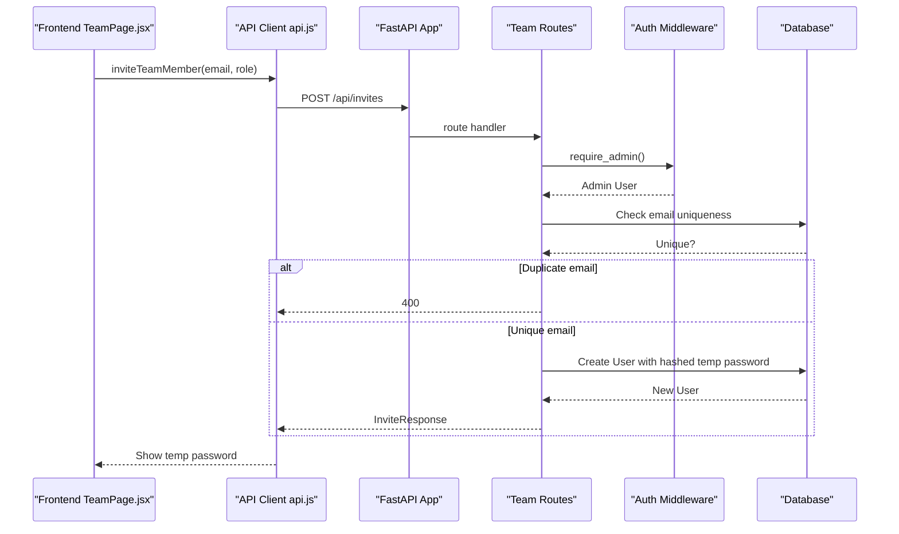
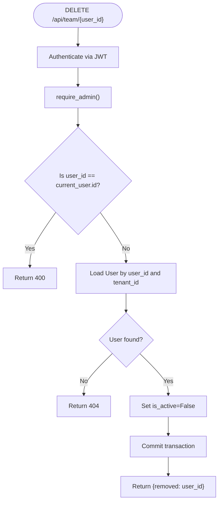
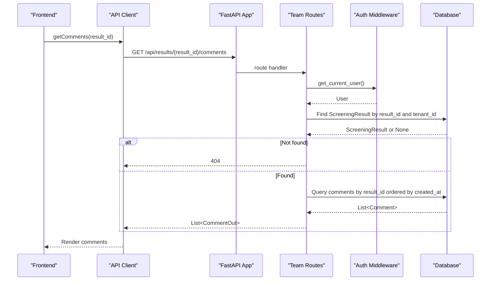
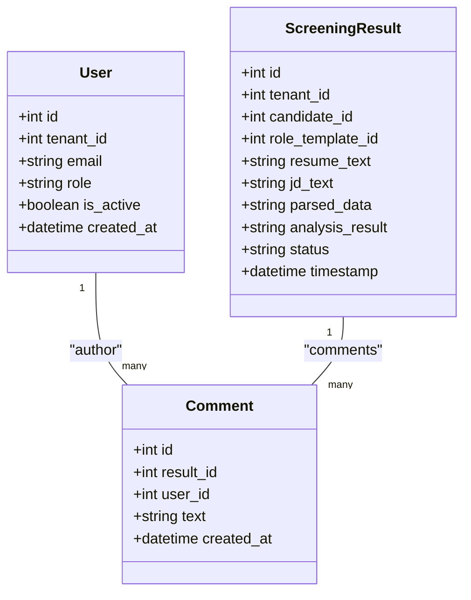
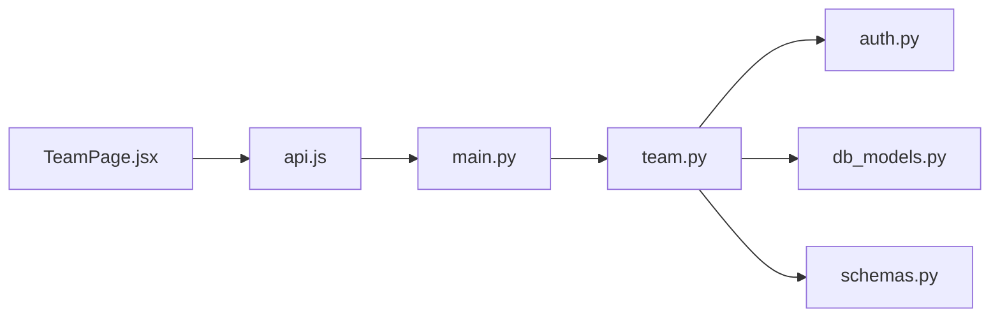

# Team & Collaboration

<cite>
**Referenced Files in This Document**
- [team.py](file://app/backend/routes/team.py)
- [schemas.py](file://app/backend/models/schemas.py)
- [db_models.py](file://app/backend/models/db_models.py)
- [auth.py](file://app/backend/middleware/auth.py)
- [TeamPage.jsx](file://app/frontend/src/pages/TeamPage.jsx)
- [api.js](file://app/frontend/src/lib/api.js)
- [main.py](file://app/backend/main.py)
- [test_routes_phase2.py](file://app/backend/tests/test_routes_phase2.py)
</cite>

## Table of Contents
1. [Introduction](#introduction)
2. [Project Structure](#project-structure)
3. [Core Components](#core-components)
4. [Architecture Overview](#architecture-overview)
5. [Detailed Component Analysis](#detailed-component-analysis)
6. [Dependency Analysis](#dependency-analysis)
7. [Performance Considerations](#performance-considerations)
8. [Troubleshooting Guide](#troubleshooting-guide)
9. [Conclusion](#conclusion)
10. [Appendices](#appendices)

## Introduction
This document provides comprehensive API documentation for team management and collaboration endpoints. It covers:
- Retrieving team members with role assignments and permissions
- Adding new members with role-based access controls
- Removing team members with deactivation semantics
- Collaborative analysis workflows including comments and shared results
- Multi-tenant isolation, permission inheritance, and audit logging considerations
- Request/response schemas, role hierarchies, and access control matrices
- Practical examples for team setup, role management, and collaborative analysis

## Project Structure
The team collaboration features are implemented in the backend FastAPI application and consumed by the React frontend. Key components:
- Backend routes: team collaboration endpoints under the /api/team namespace
- Authentication middleware: JWT-based authentication and admin enforcement
- Data models: multi-tenant users, comments, and team membership
- Frontend pages: Team management UI and API bindings

**Diagram sources**
- [main.py:174-215](file://app/backend/main.py#L174-L215)
- [team.py:15-135](file://app/backend/routes/team.py#L15-L135)
- [auth.py:19-46](file://app/backend/middleware/auth.py#L19-L46)
- [db_models.py:62-192](file://app/backend/models/db_models.py#L62-L192)
- [schemas.py:254-271](file://app/backend/models/schemas.py#L254-L271)
- [TeamPage.jsx:177-257](file://app/frontend/src/pages/TeamPage.jsx#L177-L257)
- [api.js:258-268](file://app/frontend/src/lib/api.js#L258-L268)

**Section sources**
- [main.py:174-215](file://app/backend/main.py#L174-L215)
- [team.py:15-135](file://app/backend/routes/team.py#L15-L135)
- [auth.py:19-46](file://app/backend/middleware/auth.py#L19-L46)
- [db_models.py:62-192](file://app/backend/models/db_models.py#L62-L192)
- [schemas.py:254-271](file://app/backend/models/schemas.py#L254-L271)
- [TeamPage.jsx:177-257](file://app/frontend/src/pages/TeamPage.jsx#L177-L257)
- [api.js:258-268](file://app/frontend/src/lib/api.js#L258-L268)

## Core Components
- Team routes module exposes:
  - GET /api/team: list active team members in the current tenant
  - POST /api/invites: invite new members with role assignment
  - DELETE /api/team/{user_id}: deactivate a team member
  - GET /api/results/{result_id}/comments: retrieve comments for a screening result
  - POST /api/results/{result_id}/comments: add a comment to a screening result
- Authentication middleware enforces:
  - Bearer token authentication
  - Admin-only access for inviting and removing members
- Data models define:
  - User with tenant_id and role
  - Comment linked to result and author
  - Multi-tenant isolation via tenant_id filters

**Section sources**
- [team.py:18-82](file://app/backend/routes/team.py#L18-L82)
- [auth.py:19-46](file://app/backend/middleware/auth.py#L19-L46)
- [db_models.py:62-192](file://app/backend/models/db_models.py#L62-L192)

## Architecture Overview
The team collaboration endpoints follow a clear separation of concerns:
- Routes handle HTTP requests and enforce tenant and role boundaries
- Middleware authenticates requests and enforces admin privileges
- Models encapsulate multi-tenant data and relationships
- Frontend integrates with the API via Axios interceptors and dedicated functions

**Diagram sources**
- [TeamPage.jsx:177-257](file://app/frontend/src/pages/TeamPage.jsx#L177-L257)
- [api.js:258-268](file://app/frontend/src/lib/api.js#L258-L268)
- [main.py:200-215](file://app/backend/main.py#L200-L215)
- [team.py:18-82](file://app/backend/routes/team.py#L18-L82)
- [auth.py:19-46](file://app/backend/middleware/auth.py#L19-L46)
- [db_models.py:62-192](file://app/backend/models/db_models.py#L62-L192)

## Detailed Component Analysis

### Team Management Endpoints

#### GET /api/team
- Purpose: Retrieve active team members in the current tenant
- Authentication: Requires bearer token; user must be active
- Authorization: No special role required; returns members of the caller’s tenant
- Filtering: Filters by tenant_id and is_active
- Response: Array of member objects with id, email, role, created_at

**Diagram sources**
- [team.py:18-31](file://app/backend/routes/team.py#L18-L31)
- [auth.py:19-40](file://app/backend/middleware/auth.py#L19-L40)
- [db_models.py:62-76](file://app/backend/models/db_models.py#L62-L76)

**Section sources**
- [team.py:18-31](file://app/backend/routes/team.py#L18-L31)
- [auth.py:19-40](file://app/backend/middleware/auth.py#L19-L40)
- [db_models.py:62-76](file://app/backend/models/db_models.py#L62-L76)

#### POST /api/invites
- Purpose: Invite a new team member to the current tenant
- Authentication: Requires bearer token; user must be admin
- Authorization: Admin-only endpoint
- Validation: Rejects duplicate emails
- Behavior: Creates a new User with a temporary password; returns temp password for secure sharing
- Response: InviteResponse with id, email, role, temp_password, message

**Diagram sources**
- [TeamPage.jsx:177-257](file://app/frontend/src/pages/TeamPage.jsx#L177-L257)
- [api.js:265-267](file://app/frontend/src/lib/api.js#L265-L267)
- [team.py:34-61](file://app/backend/routes/team.py#L34-L61)
- [auth.py:43-46](file://app/backend/middleware/auth.py#L43-L46)
- [db_models.py:62-76](file://app/backend/models/db_models.py#L62-L76)

**Section sources**
- [team.py:34-61](file://app/backend/routes/team.py#L34-L61)
- [auth.py:43-46](file://app/backend/middleware/auth.py#L43-L46)
- [db_models.py:62-76](file://app/backend/models/db_models.py#L62-L76)

#### DELETE /api/team/{user_id}
- Purpose: Deactivate a team member in the current tenant
- Authentication: Requires bearer token; user must be admin
- Authorization: Admin-only endpoint
- Behavior: Sets is_active=False for the target user; prevents self-removal
- Response: Deactivation confirmation

**Diagram sources**
- [team.py:64-82](file://app/backend/routes/team.py#L64-L82)
- [auth.py:43-46](file://app/backend/middleware/auth.py#L43-L46)
- [db_models.py:62-76](file://app/backend/models/db_models.py#L62-L76)

**Section sources**
- [team.py:64-82](file://app/backend/routes/team.py#L64-L82)
- [auth.py:43-46](file://app/backend/middleware/auth.py#L43-L46)
- [db_models.py:62-76](file://app/backend/models/db_models.py#L62-L76)

### Collaboration Endpoints

#### GET /api/results/{result_id}/comments
- Purpose: Retrieve comments for a screening result
- Authentication: Requires bearer token; user must be active
- Authorization: Implicit tenant isolation via result lookup
- Behavior: Validates result belongs to the current tenant; returns ordered comments
- Response: Array of CommentOut objects

**Diagram sources**
- [team.py:85-107](file://app/backend/routes/team.py#L85-L107)
- [auth.py:19-40](file://app/backend/middleware/auth.py#L19-L40)
- [db_models.py:128-192](file://app/backend/models/db_models.py#L128-L192)

**Section sources**
- [team.py:85-107](file://app/backend/routes/team.py#L85-L107)
- [auth.py:19-40](file://app/backend/middleware/auth.py#L19-L40)
- [db_models.py:128-192](file://app/backend/models/db_models.py#L128-L192)

#### POST /api/results/{result_id}/comments
- Purpose: Add a comment to a screening result
- Authentication: Requires bearer token; user must be active
- Authorization: Implicit tenant isolation via result lookup
- Behavior: Validates result belongs to the current tenant; creates comment owned by current user
- Response: Created CommentOut object

**Section sources**
- [team.py:110-135](file://app/backend/routes/team.py#L110-L135)
- [auth.py:19-40](file://app/backend/middleware/auth.py#L19-L40)
- [db_models.py:128-192](file://app/backend/models/db_models.py#L128-L192)

### Request/Response Schemas

#### Team Member Schema
- Fields: id, email, role, created_at
- Used by: GET /api/team response

**Section sources**
- [team.py:28-31](file://app/backend/routes/team.py#L28-L31)

#### InviteRequest Schema
- Fields: email, role (default "recruiter")
- Used by: POST /api/invites request body

**Section sources**
- [schemas.py:254-257](file://app/backend/models/schemas.py#L254-L257)

#### InviteResponse Schema
- Fields: id, email, role, temp_password, message
- Used by: POST /api/invites response

**Section sources**
- [team.py:55-61](file://app/backend/routes/team.py#L55-L61)

#### CommentCreate Schema
- Fields: text
- Used by: POST /api/results/{result_id}/comments request body

**Section sources**
- [schemas.py:259-261](file://app/backend/models/schemas.py#L259-L261)

#### CommentOut Schema
- Fields: id, text, created_at, author_email
- Used by: GET /api/results/{result_id}/comments and POST /api/results/{result_id}/comments responses

**Section sources**
- [schemas.py:263-271](file://app/backend/models/schemas.py#L263-L271)

### Role Hierarchies and Access Control Matrices
- Roles: admin, recruiter, viewer
- Admin privileges:
  - Invite new members
  - Remove members (except self)
- General access:
  - View team members
  - Add comments to results within the tenant
- Tenant isolation:
  - All queries filter by tenant_id to prevent cross-tenant access

**Diagram sources**
- [db_models.py:62-192](file://app/backend/models/db_models.py#L62-L192)

**Section sources**
- [db_models.py:62-76](file://app/backend/models/db_models.py#L62-L76)
- [db_models.py:128-192](file://app/backend/models/db_models.py#L128-L192)

### Multi-Tenant Isolation
- Tenant boundary enforced by:
  - Filtering User queries by tenant_id
  - Filtering ScreeningResult queries by tenant_id
  - Admin checks scoped to current tenant
- Implications:
  - Users cannot see or modify members from other tenants
  - Comments are isolated to results within the same tenant

**Section sources**
- [team.py:24-26](file://app/backend/routes/team.py#L24-L26)
- [team.py:91-96](file://app/backend/routes/team.py#L91-L96)

### Permission Inheritance and Audit Logging
- Permission inheritance:
  - Admin role enables invite/remove actions
  - Non-admin users can view team and add comments
- Audit logging:
  - No explicit audit log entries are implemented in the reviewed files
  - Consider adding usage logs for team actions (invites, removals) for compliance

**Section sources**
- [auth.py:43-46](file://app/backend/middleware/auth.py#L43-L46)
- [db_models.py:79-93](file://app/backend/models/db_models.py#L79-L93)

### Examples

#### Team Setup Workflow
- Steps:
  - Admin invites members via POST /api/invites
  - New members receive a temporary password in the response
  - Admin shares the temporary password securely
  - New members log in and change their password
- Frontend integration:
  - TeamPage.jsx renders the invite modal and displays members
  - api.js provides getTeamMembers and inviteTeamMember helpers

**Section sources**
- [TeamPage.jsx:177-257](file://app/frontend/src/pages/TeamPage.jsx#L177-L257)
- [api.js:258-268](file://app/frontend/src/lib/api.js#L258-L268)
- [team.py:34-61](file://app/backend/routes/team.py#L34-L61)

#### Role Management Workflow
- Steps:
  - Admin lists current members via GET /api/team
  - Admin removes a member via DELETE /api/team/{user_id}
  - Tenant isolation ensures only members of the current tenant are affected
- Frontend integration:
  - TeamPage.jsx conditionally renders the invite button for admins
  - Uses getTeamMembers to refresh the list after changes

**Section sources**
- [TeamPage.jsx:177-257](file://app/frontend/src/pages/TeamPage.jsx#L177-L257)
- [api.js:258-268](file://app/frontend/src/lib/api.js#L258-L268)
- [team.py:64-82](file://app/backend/routes/team.py#L64-L82)

#### Collaborative Analysis Workflow
- Steps:
  - Admin or authorized users add comments to screening results via POST /api/results/{result_id}/comments
  - Other collaborators view comments via GET /api/results/{result_id}/comments
- Frontend integration:
  - TeamPage.jsx displays team members
  - api.js provides addComment and getComments helpers

**Section sources**
- [TeamPage.jsx:177-257](file://app/frontend/src/pages/TeamPage.jsx#L177-L257)
- [api.js:270-273](file://app/frontend/src/lib/api.js#L270-L273)
- [team.py:85-135](file://app/backend/routes/team.py#L85-L135)

## Dependency Analysis
- Route dependencies:
  - team.py depends on auth middleware for user and admin checks
  - team.py depends on SQLAlchemy models for queries and creation
- Frontend dependencies:
  - TeamPage.jsx consumes api.js functions
  - api.js attaches JWT tokens and handles 401 auto-refresh

**Diagram sources**
- [TeamPage.jsx:177-257](file://app/frontend/src/pages/TeamPage.jsx#L177-L257)
- [api.js:258-268](file://app/frontend/src/lib/api.js#L258-L268)
- [main.py:200-215](file://app/backend/main.py#L200-L215)
- [team.py:15-135](file://app/backend/routes/team.py#L15-L135)
- [auth.py:19-46](file://app/backend/middleware/auth.py#L19-L46)
- [db_models.py:62-192](file://app/backend/models/db_models.py#L62-L192)
- [schemas.py:254-271](file://app/backend/models/schemas.py#L254-L271)

**Section sources**
- [main.py:200-215](file://app/backend/main.py#L200-L215)
- [team.py:15-135](file://app/backend/routes/team.py#L15-L135)
- [auth.py:19-46](file://app/backend/middleware/auth.py#L19-L46)
- [db_models.py:62-192](file://app/backend/models/db_models.py#L62-L192)
- [schemas.py:254-271](file://app/backend/models/schemas.py#L254-L271)
- [TeamPage.jsx:177-257](file://app/frontend/src/pages/TeamPage.jsx#L177-L257)
- [api.js:258-268](file://app/frontend/src/lib/api.js#L258-L268)

## Performance Considerations
- Query efficiency:
  - GET /api/team filters by tenant_id and is_active; ensure indexes exist on these columns
  - GET /api/results/{result_id}/comments orders by created_at; consider indexing created_at
- Token handling:
  - JWT decoding occurs per request; ensure secret key is configured securely
- Frontend caching:
  - Team lists can be cached locally after successful fetches
  - Comments can be cached per result_id

## Troubleshooting Guide
- Authentication failures:
  - 401 Not authenticated or invalid/expired token
  - Ensure access_token is present and valid
- Authorization failures:
  - 403 Admin access required for invites/removals
  - Verify current user role is admin
- Resource not found:
  - 404 for non-existent users or results
  - Confirm tenant_id filtering and resource existence
- Validation errors:
  - 400/422 for missing or invalid fields (e.g., missing email in invite)
- Frontend integration:
  - api.js auto-refreshes on 401; ensure refresh_token is available
  - TeamPage.jsx disables actions for non-admin users

**Section sources**
- [auth.py:23-40](file://app/backend/middleware/auth.py#L23-L40)
- [auth.py:43-46](file://app/backend/middleware/auth.py#L43-L46)
- [team.py:40-41](file://app/backend/routes/team.py#L40-L41)
- [team.py:77-78](file://app/backend/routes/team.py#L77-L78)
- [team.py:95-96](file://app/backend/routes/team.py#L95-L96)
- [api.js:19-43](file://app/frontend/src/lib/api.js#L19-L43)
- [TeamPage.jsx:177-257](file://app/frontend/src/pages/TeamPage.jsx#L177-L257)

## Conclusion
The team collaboration endpoints provide a robust foundation for managing team members and enabling collaborative analysis within a multi-tenant environment. Admin-only operations ensure controlled access to sensitive actions, while tenant isolation prevents cross-tenant data leakage. Extending the system with explicit audit logging for team actions would further strengthen compliance and traceability.

## Appendices

### Endpoint Reference

- GET /api/team
  - Description: List active team members in the current tenant
  - Authentication: Bearer token
  - Authorization: Any active user
  - Response: Array of team member objects

- POST /api/invites
  - Description: Invite a new team member
  - Authentication: Bearer token
  - Authorization: Admin
  - Request: InviteRequest
  - Response: InviteResponse

- DELETE /api/team/{user_id}
  - Description: Deactivate a team member
  - Authentication: Bearer token
  - Authorization: Admin
  - Response: Deactivation confirmation

- GET /api/results/{result_id}/comments
  - Description: Retrieve comments for a screening result
  - Authentication: Bearer token
  - Authorization: Any active user
  - Response: Array of CommentOut

- POST /api/results/{result_id}/comments
  - Description: Add a comment to a screening result
  - Authentication: Bearer token
  - Authorization: Any active user
  - Request: CommentCreate
  - Response: CommentOut

**Section sources**
- [team.py:18-135](file://app/backend/routes/team.py#L18-L135)
- [schemas.py:254-271](file://app/backend/models/schemas.py#L254-L271)