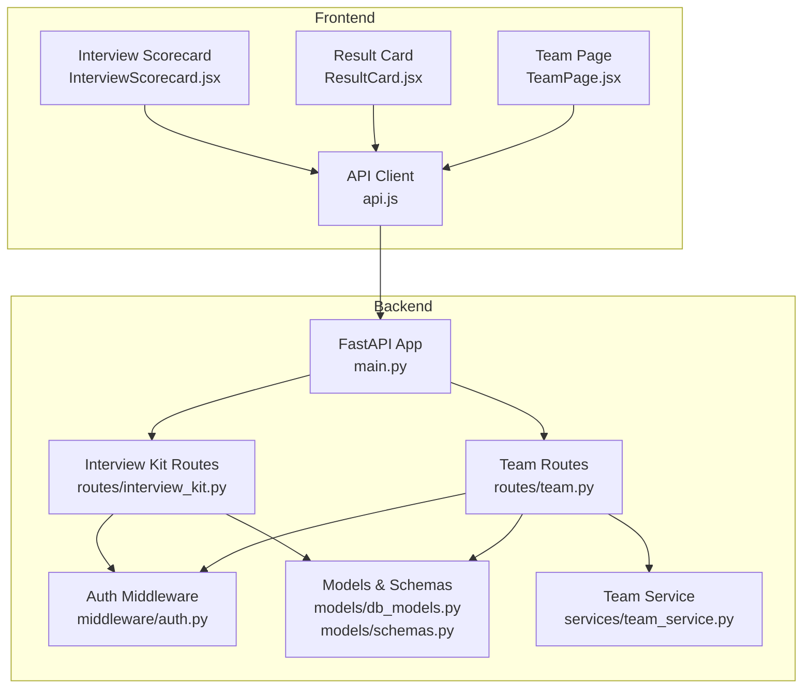
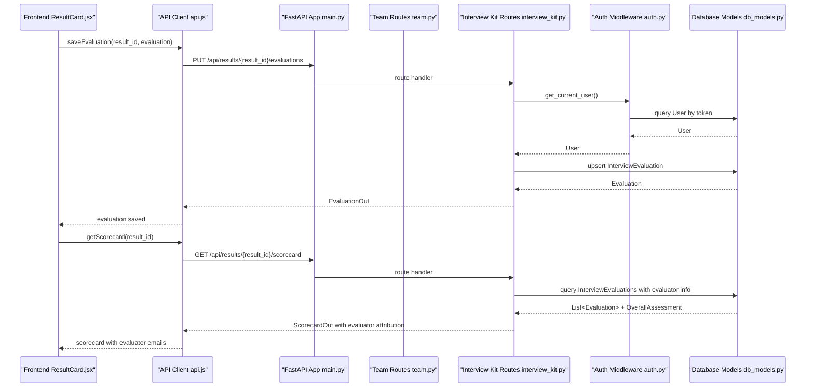
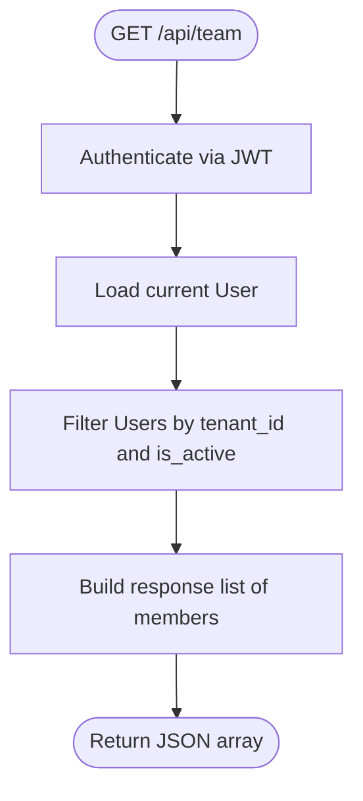
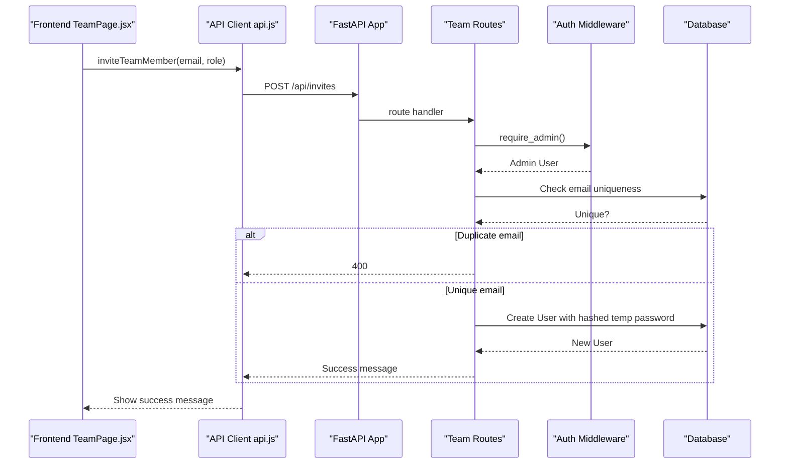
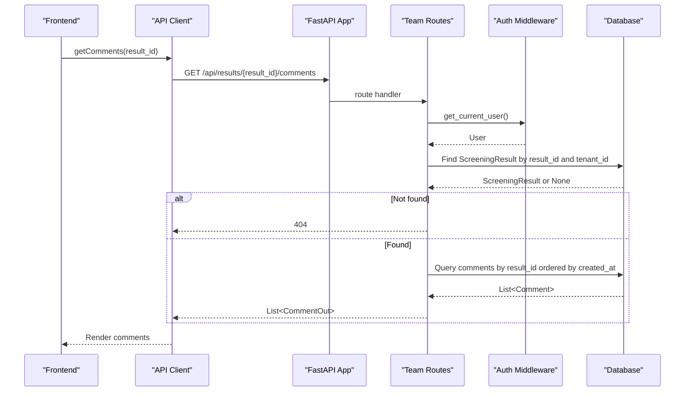
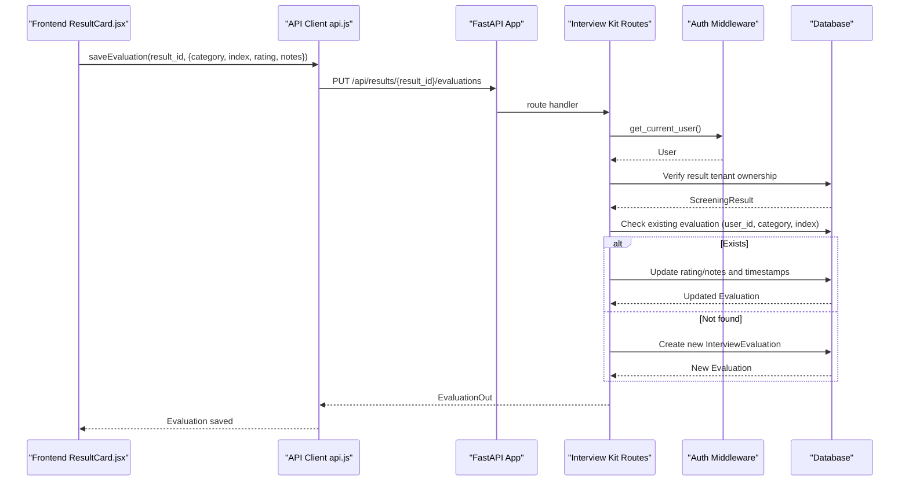
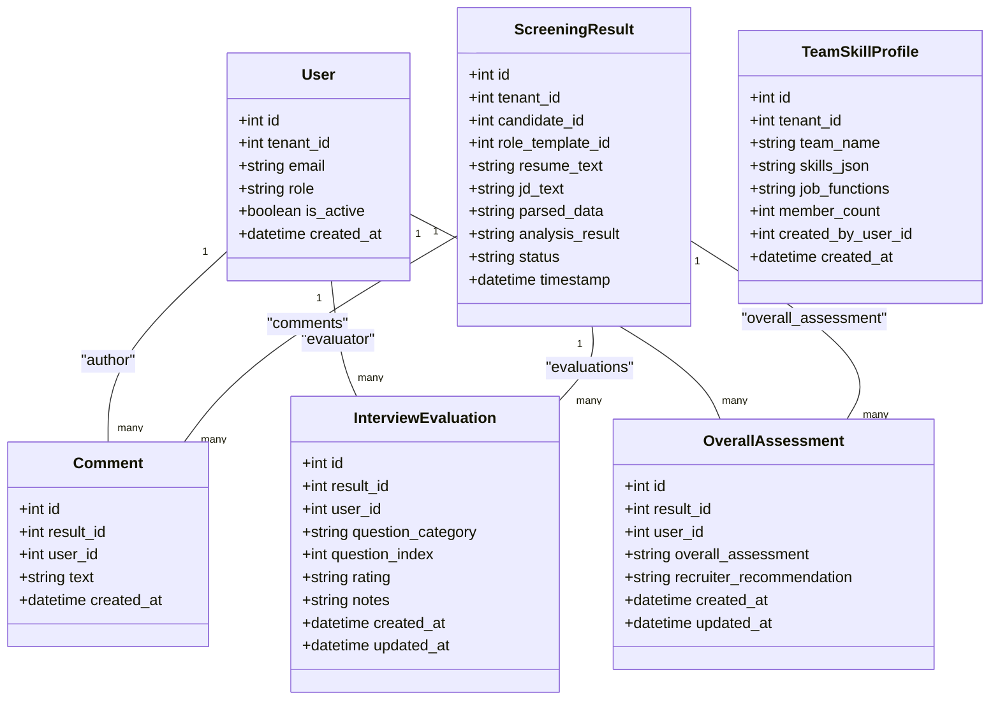
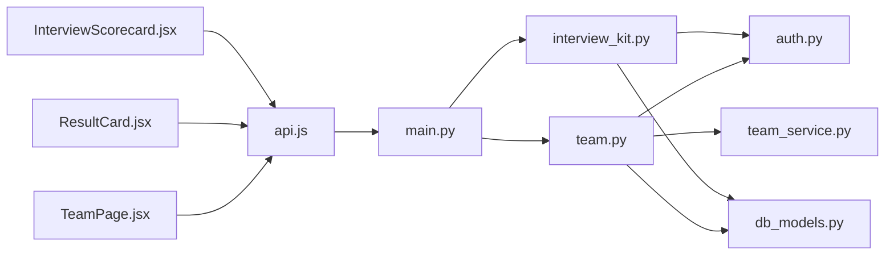

# Team & Collaboration

<cite>
**Referenced Files in This Document**
- [team.py](file://app/backend/routes/team.py)
- [interview_kit.py](file://app/backend/routes/interview_kit.py)
- [schemas.py](file://app/backend/models/schemas.py)
- [db_models.py](file://app/backend/models/db_models.py)
- [team_service.py](file://app/backend/services/team_service.py)
- [auth.py](file://app/backend/middleware/auth.py)
- [TeamPage.jsx](file://app/frontend/src/pages/TeamPage.jsx)
- [ResultCard.jsx](file://app/frontend/src/components/ResultCard.jsx)
- [InterviewScorecard.jsx](file://app/frontend/src/components/InterviewScorecard.jsx)
- [api.js](file://app/frontend/src/lib/api.js)
- [main.py](file://app/backend/main.py)
- [test_routes_phase2.py](file://app/backend/tests/test_routes_phase2.py)
- [test_interview_kit.py](file://app/backend/tests/test_interview_kit.py)
</cite>

## Update Summary
**Changes Made**
- Added comprehensive documentation for new team evaluation capabilities and collaborative assessment workflows
- Documented enhanced team visibility features and evaluator attribution system
- Updated team management endpoints to include evaluation and scorecard functionality
- Added new evaluation CRUD endpoints and overall assessment workflows
- Enhanced team skill profile management with gap analysis capabilities
- Updated frontend integration examples for evaluation workflows

## Table of Contents
1. [Introduction](#introduction)
2. [Project Structure](#project-structure)
3. [Core Components](#core-components)
4. [Architecture Overview](#architecture-overview)
5. [Detailed Component Analysis](#detailed-component-analysis)
6. [Dependency Analysis](#dependency-analysis)
7. [Performance Considerations](#performance-considerations)
8. [Troubleshooting Guide](#troubleshooting-guide)
9. [Conclusion](#conclusion)
10. [Appendices](#appendices)

## Introduction
This document provides comprehensive API documentation for team management and collaboration endpoints, now enhanced with advanced evaluation capabilities and collaborative assessment workflows. It covers:
- Retrieving team members with role assignments and permissions
- Adding new members with role-based access controls
- Removing team members with deactivation semantics
- Collaborative analysis workflows including comments and shared results
- **NEW**: Team evaluation capabilities with per-question assessments and overall recommendations
- **NEW**: Evaluator attribution system showing who rated what questions
- **NEW**: Team skill profile management with gap analysis against job descriptions
- Multi-tenant isolation, permission inheritance, and audit logging considerations
- Request/response schemas, role hierarchies, and access control matrices
- Practical examples for team setup, role management, collaborative analysis, and evaluation workflows

## Project Structure
The team collaboration features are implemented in the backend FastAPI application and consumed by the React frontend. Key components:
- Backend routes: team collaboration endpoints under the /api/team namespace and evaluation endpoints under /api/results
- Authentication middleware: JWT-based authentication and admin enforcement
- Data models: multi-tenant users, comments, team memberships, interview evaluations, and overall assessments
- Frontend pages: Team management UI, evaluation interfaces, and API bindings

**Diagram sources**
- [main.py:174-215](file://app/backend/main.py#L174-L215)
- [team.py:15-295](file://app/backend/routes/team.py#L15-L295)
- [interview_kit.py:1-239](file://app/backend/routes/interview_kit.py#L1-L239)
- [auth.py:19-46](file://app/backend/middleware/auth.py#L19-L46)
- [db_models.py:255-322](file://app/backend/models/db_models.py#L255-L322)
- [schemas.py:500-586](file://app/backend/models/schemas.py#L500-L586)
- [team_service.py:1-205](file://app/backend/services/team_service.py#L1-L205)
- [TeamPage.jsx:177-257](file://app/frontend/src/pages/TeamPage.jsx#L177-L257)
- [ResultCard.jsx:573-644](file://app/frontend/src/components/ResultCard.jsx#L573-L644)
- [InterviewScorecard.jsx:1-215](file://app/frontend/src/components/InterviewScorecard.jsx#L1-L215)
- [api.js:258-268](file://app/frontend/src/lib/api.js#L258-L268)

**Section sources**
- [main.py:174-215](file://app/backend/main.py#L174-L215)
- [team.py:15-295](file://app/backend/routes/team.py#L15-L295)
- [interview_kit.py:1-239](file://app/backend/routes/interview_kit.py#L1-L239)
- [auth.py:19-46](file://app/backend/middleware/auth.py#L19-L46)
- [db_models.py:255-322](file://app/backend/models/db_models.py#L255-L322)
- [schemas.py:500-586](file://app/backend/models/schemas.py#L500-L586)
- [team_service.py:1-205](file://app/backend/services/team_service.py#L1-L205)
- [TeamPage.jsx:177-257](file://app/frontend/src/pages/TeamPage.jsx#L177-L257)
- [ResultCard.jsx:573-644](file://app/frontend/src/components/ResultCard.jsx#L573-L644)
- [InterviewScorecard.jsx:1-215](file://app/frontend/src/components/InterviewScorecard.jsx#L1-L215)
- [api.js:258-268](file://app/frontend/src/lib/api.js#L258-L268)

## Core Components
- Team routes module exposes:
  - GET /api/team: list active team members in the current tenant
  - POST /api/invites: invite new members with role assignment
  - DELETE /api/team/{user_id}: deactivate a team member
  - GET /api/results/{result_id}/comments: retrieve comments for a screening result
  - POST /api/results/{result_id}/comments: add a comment to a screening result
  - **NEW**: Team skill profile management with CRUD operations and gap analysis
- **NEW** Interview kit routes module exposes:
  - PUT /api/results/{result_id}/evaluations: upsert individual question evaluations
  - GET /api/results/{result_id}/evaluations: retrieve all evaluations for a result
  - PUT /api/results/{result_id}/evaluations/overall: save overall assessment
  - GET /api/results/{result_id}/scorecard: generate comprehensive evaluation scorecard
- Authentication middleware enforces:
  - Bearer token authentication
  - Admin-only access for inviting and removing members
- Data models define:
  - User with tenant_id and role
  - Comment linked to result and author
  - InterviewEvaluation with per-question ratings and notes
  - OverallAssessment with recommendation values
  - TeamSkillProfile for team composition analysis
  - Multi-tenant isolation via tenant_id filters

**Section sources**
- [team.py:18-295](file://app/backend/routes/team.py#L18-L295)
- [interview_kit.py:38-239](file://app/backend/routes/interview_kit.py#L38-L239)
- [auth.py:19-46](file://app/backend/middleware/auth.py#L19-L46)
- [db_models.py:255-322](file://app/backend/models/db_models.py#L255-L322)

## Architecture Overview
The team collaboration endpoints follow a clear separation of concerns with enhanced evaluation capabilities:
- Routes handle HTTP requests and enforce tenant and role boundaries
- Middleware authenticates requests and enforces admin privileges
- Models encapsulate multi-tenant data and relationships including evaluations
- Frontend integrates with the API via Axios interceptors and dedicated functions
- **NEW**: Evaluation workflows support collaborative assessment with attribution

**Diagram sources**
- [ResultCard.jsx:620-639](file://app/frontend/src/components/ResultCard.jsx#L620-L639)
- [api.js:258-268](file://app/frontend/src/lib/api.js#L258-L268)
- [main.py:200-215](file://app/backend/main.py#L200-L215)
- [interview_kit.py:40-239](file://app/backend/routes/interview_kit.py#L40-L239)
- [auth.py:19-40](file://app/backend/middleware/auth.py#L19-L40)
- [db_models.py:282-322](file://app/backend/models/db_models.py#L282-322)

## Detailed Component Analysis

### Team Management Endpoints

#### GET /api/team
- Purpose: Retrieve active team members in the current tenant
- Authentication: Requires bearer token; user must be active
- Authorization: No special role required; returns members of the caller's tenant
- Filtering: Filters by tenant_id and is_active
- Response: Array of member objects with id, email, role, created_at

**Diagram sources**
- [team.py:52-65](file://app/backend/routes/team.py#L52-L65)
- [auth.py:19-40](file://app/backend/middleware/auth.py#L19-L40)
- [db_models.py:62-76](file://app/backend/models/db_models.py#L62-L76)

**Section sources**
- [team.py:52-65](file://app/backend/routes/team.py#L52-L65)
- [auth.py:19-40](file://app/backend/middleware/auth.py#L19-L40)
- [db_models.py:62-76](file://app/backend/models/db_models.py#L62-L76)

#### POST /api/invites
- Purpose: Invite a new team member to the current tenant
- Authentication: Requires bearer token; user must be admin
- Authorization: Admin-only endpoint
- Validation: Rejects duplicate emails
- Behavior: Creates a new User with a temporary password; returns temp password for secure sharing
- Response: Success message confirming invitation

**Diagram sources**
- [TeamPage.jsx:177-257](file://app/frontend/src/pages/TeamPage.jsx#L177-L257)
- [api.js:265-267](file://app/frontend/src/lib/api.js#L265-L267)
- [team.py:68-93](file://app/backend/routes/team.py#L68-L93)
- [auth.py:43-46](file://app/backend/middleware/auth.py#L43-L46)
- [db_models.py:62-76](file://app/backend/models/db_models.py#L62-L76)

**Section sources**
- [team.py:68-93](file://app/backend/routes/team.py#L68-L93)
- [auth.py:43-46](file://app/backend/middleware/auth.py#L43-L46)
- [db_models.py:62-76](file://app/backend/models/db_models.py#L62-L76)

#### DELETE /api/team/{user_id}
- Purpose: Deactivate a team member in the current tenant
- Authentication: Requires bearer token; user must be admin
- Authorization: Admin-only endpoint
- Behavior: Sets is_active=False for the target user; prevents self-removal
- Response: Deactivation confirmation

**Diagram sources**
- [team.py:96-114](file://app/backend/routes/team.py#L96-L114)
- [auth.py:43-46](file://app/backend/middleware/auth.py#L43-L46)
- [db_models.py:62-76](file://app/backend/models/db_models.py#L62-L76)

**Section sources**
- [team.py:96-114](file://app/backend/routes/team.py#L96-L114)
- [auth.py:43-46](file://app/backend/middleware/auth.py#L43-L46)
- [db_models.py:62-76](file://app/backend/models/db_models.py#L62-L76)

### Collaboration Endpoints

#### GET /api/results/{result_id}/comments
- Purpose: Retrieve comments for a screening result
- Authentication: Requires bearer token; user must be active
- Authorization: Implicit tenant isolation via result lookup
- Behavior: Validates result belongs to the current tenant; returns ordered comments
- Response: Array of CommentOut objects

**Diagram sources**
- [team.py:117-139](file://app/backend/routes/team.py#L117-L139)
- [auth.py:19-40](file://app/backend/middleware/auth.py#L19-L40)
- [db_models.py:128-192](file://app/backend/models/db_models.py#L128-L192)

**Section sources**
- [team.py:117-139](file://app/backend/routes/team.py#L117-L139)
- [auth.py:19-40](file://app/backend/middleware/auth.py#L19-L40)
- [db_models.py:128-192](file://app/backend/models/db_models.py#L128-L192)

#### POST /api/results/{result_id}/comments
- Purpose: Add a comment to a screening result
- Authentication: Requires bearer token; user must be active
- Authorization: Implicit tenant isolation via result lookup
- Behavior: Validates result belongs to the current tenant; creates comment owned by current user
- Response: Created CommentOut object

**Section sources**
- [team.py:142-166](file://app/backend/routes/team.py#L142-L166)
- [auth.py:19-40](file://app/backend/middleware/auth.py#L19-L40)
- [db_models.py:128-192](file://app/backend/models/db_models.py#L128-L192)

### **NEW** Team Evaluation Endpoints

#### PUT /api/results/{result_id}/evaluations
- Purpose: Upsert individual question evaluation for a screening result
- Authentication: Requires bearer token; user must be active
- Authorization: Tenant isolation enforced via result lookup
- Validation: 
  - question_category must be one of: technical, behavioral, culture_fit, experience_deep_dive
  - rating must be one of: strong, adequate, weak
- Behavior: Creates new evaluation if doesn't exist, updates existing if found
- Response: EvaluationOut with id, category, index, rating, notes, updated_at

**Diagram sources**
- [ResultCard.jsx:620-639](file://app/frontend/src/components/ResultCard.jsx#L620-L639)
- [interview_kit.py:40-79](file://app/backend/routes/interview_kit.py#L40-L79)
- [auth.py:19-40](file://app/backend/middleware/auth.py#L19-L40)
- [db_models.py:282-302](file://app/backend/models/db_models.py#L282-302)

**Section sources**
- [interview_kit.py:40-79](file://app/backend/routes/interview_kit.py#L40-L79)
- [schemas.py:501-523](file://app/backend/models/schemas.py#L501-L523)
- [db_models.py:282-302](file://app/backend/models/db_models.py#L282-302)

#### GET /api/results/{result_id}/evaluations
- Purpose: Retrieve all evaluations for a screening result
- Authentication: Requires bearer token; user must be active
- Authorization: Tenant isolation enforced via result lookup
- Behavior: Returns evaluations filtered by current user_id, ordered by category and index
- Response: Array of EvaluationOut objects

**Section sources**
- [interview_kit.py:84-98](file://app/backend/routes/interview_kit.py#L84-L98)
- [schemas.py:525-534](file://app/backend/models/schemas.py#L525-L534)
- [db_models.py:282-302](file://app/backend/models/db_models.py#L282-302)

#### PUT /api/results/{result_id}/evaluations/overall
- Purpose: Upsert overall assessment and recommendation for a screening result
- Authentication: Requires bearer token; user must be active
- Authorization: Tenant isolation enforced via result lookup
- Validation: recruiter_recommendation must be one of: advance, hold, reject
- Behavior: Creates or updates OverallAssessment with recommendation
- Response: Object with status (created/updated) and id

**Section sources**
- [interview_kit.py:103-137](file://app/backend/routes/interview_kit.py#L103-L137)
- [schemas.py:536-548](file://app/backend/models/schemas.py#L536-L548)
- [db_models.py:304-321](file://app/backend/models/db_models.py#L304-L321)

#### GET /api/results/{result_id}/scorecard
- Purpose: Generate comprehensive evaluation scorecard with team attribution
- Authentication: Requires bearer token; user must be active
- Authorization: Tenant isolation enforced via result lookup
- Behavior: Aggregates evaluations, calculates dimension summaries, and includes evaluator attribution
- Response: ScorecardOut with evaluator emails, dimension summaries, strengths, and concerns

**Section sources**
- [interview_kit.py:142-239](file://app/backend/routes/interview_kit.py#L142-L239)
- [schemas.py:550-586](file://app/backend/models/schemas.py#L550-L586)
- [db_models.py:282-322](file://app/backend/models/db_models.py#L282-322)

### **NEW** Team Skill Profile Management

#### POST /api/team/profiles
- Purpose: Create a new team skill profile
- Authentication: Requires bearer token; user must be active
- Authorization: Tenant isolation enforced
- Behavior: Creates TeamSkillProfile with skills, job functions, and member count
- Response: Complete profile with id, team_name, skills, job_functions, member_count

#### GET /api/team/profiles
- Purpose: List all team skill profiles for the current tenant
- Authentication: Requires bearer token; user must be active
- Authorization: Tenant isolation enforced
- Response: Array of team profile objects

#### PUT /api/team/profiles/{profile_id}
- Purpose: Update an existing team skill profile
- Authentication: Requires bearer token; user must be active
- Authorization: Tenant isolation enforced
- Response: Updated profile or 404 if not found

#### DELETE /api/team/profiles/{profile_id}
- Purpose: Delete a team skill profile
- Authentication: Requires bearer token; user must be active
- Authorization: Tenant isolation enforced
- Response: Deletion confirmation or 404 if not found

#### GET /api/team/profiles/{profile_id}/gap-analysis
- Purpose: Compare team profile against a job description to identify skill gaps
- Authentication: Requires bearer token; user must be active
- Authorization: Tenant isolation enforced
- Parameters: Either jd_text or role_template_id (mutually exclusive)
- Response: Gap analysis with team_has, team_gaps, redundant_in_jd, priority_skills, recommendation

**Section sources**
- [team.py:195-295](file://app/backend/routes/team.py#L195-L295)
- [team_service.py:31-205](file://app/backend/services/team_service.py#L31-L205)
- [db_models.py:359-380](file://app/backend/models/db_models.py#L359-L380)

### Request/Response Schemas

#### Team Member Schema
- Fields: id, email, role, created_at
- Used by: GET /api/team response

**Section sources**
- [team.py:62-65](file://app/backend/routes/team.py#L62-L65)

#### InviteRequest Schema
- Fields: email, role (default "recruiter")
- Used by: POST /api/invites request body

**Section sources**
- [schemas.py:254-257](file://app/backend/models/schemas.py#L254-L257)

#### CommentCreate Schema
- Fields: text
- Used by: POST /api/results/{result_id}/comments request body

**Section sources**
- [schemas.py:259-261](file://app/backend/models/schemas.py#L259-L261)

#### CommentOut Schema
- Fields: id, text, created_at, author_email
- Used by: GET /api/results/{result_id}/comments and POST /api/results/{result_id}/comments responses

**Section sources**
- [schemas.py:263-271](file://app/backend/models/schemas.py#L263-L271)

#### **NEW** EvaluationUpsert Schema
- Fields: question_category, question_index, rating, notes
- Validation: question_category must be one of technical, behavioral, culture_fit, experience_deep_dive
- Validation: rating must be one of strong, adequate, weak
- Used by: PUT /api/results/{result_id}/evaluations request body

**Section sources**
- [schemas.py:501-523](file://app/backend/models/schemas.py#L501-L523)

#### **NEW** EvaluationOut Schema
- Fields: id, question_category, question_index, rating, notes, updated_at
- Used by: PUT /api/results/{result_id}/evaluations and GET /api/results/{result_id}/evaluations responses

**Section sources**
- [schemas.py:525-534](file://app/backend/models/schemas.py#L525-L534)

#### **NEW** OverallAssessmentUpsert Schema
- Fields: overall_assessment, recruiter_recommendation
- Validation: recruiter_recommendation must be one of advance, hold, reject
- Used by: PUT /api/results/{result_id}/evaluations/overall request body

**Section sources**
- [schemas.py:536-548](file://app/backend/models/schemas.py#L536-L548)

#### **NEW** EvaluatorInfo Schema
- Fields: user_id, email, rating, question_index, notes
- Used by: ScorecardOut evaluator attribution

**Section sources**
- [schemas.py:550-556](file://app/backend/models/schemas.py#L550-L556)

#### **NEW** ScorecardDimension Schema
- Fields: category, total_questions, evaluated_count, strong_count, adequate_count, weak_count, key_notes, evaluators
- Used by: ScorecardOut dimension summaries

**Section sources**
- [schemas.py:559-568](file://app/backend/models/schemas.py#L559-L568)

#### **NEW** ScorecardOut Schema
- Fields: candidate_name, role_title, fit_score, recommendation, evaluator_email, evaluated_at, technical_summary, behavioral_summary, culture_fit_summary, experience_deep_dive_summary, overall_assessment, recruiter_recommendation, strengths_confirmed, concerns_identified
- Used by: GET /api/results/{result_id}/scorecard response

**Section sources**
- [schemas.py:570-586](file://app/backend/models/schemas.py#L570-L586)

### Role Hierarchies and Access Control Matrices
- Roles: admin, recruiter, viewer
- Admin privileges:
  - Invite new members
  - Remove members (except self)
- General access:
  - View team members
  - Add comments to results within the tenant
  - **NEW**: Create and update evaluations for screening results
  - **NEW**: Save overall assessments with recommendations
- Tenant isolation:
  - All queries filter by tenant_id to prevent cross-tenant access
  - **NEW**: Evaluation access is scoped to results within the same tenant
- **NEW**: Evaluator attribution:
  - Each evaluation includes evaluator email for transparency
  - Scorecard aggregates evaluator information across dimensions

**Diagram sources**
- [db_models.py:62-322](file://app/backend/models/db_models.py#L62-L322)

**Section sources**
- [db_models.py:62-76](file://app/backend/models/db_models.py#L62-L76)
- [db_models.py:128-192](file://app/backend/models/db_models.py#L128-L192)
- [db_models.py:282-322](file://app/backend/models/db_models.py#L282-L322)

### Multi-Tenant Isolation
- Tenant boundary enforced by:
  - Filtering User queries by tenant_id
  - Filtering ScreeningResult queries by tenant_id
  - Admin checks scoped to current tenant
  - **NEW**: Evaluation access restricted to results within the same tenant
- Implications:
  - Users cannot see or modify members from other tenants
  - Comments are isolated to results within the same tenant
  - **NEW**: Evaluations and overall assessments are isolated to results within the same tenant

**Section sources**
- [team.py:58-60](file://app/backend/routes/team.py#L58-L60)
- [team.py:123-125](file://app/backend/routes/team.py#L123-L125)
- [interview_kit.py:28-35](file://app/backend/routes/interview_kit.py#L28-L35)

### Permission Inheritance and Audit Logging
- Permission inheritance:
  - Admin role enables invite/remove actions
  - Non-admin users can view team and add comments
  - **NEW**: All users can participate in evaluations and assessments
- Audit logging:
  - No explicit audit log entries are implemented in the reviewed files
  - Consider adding usage logs for team actions (invites, removals) and evaluation activities for compliance

**Section sources**
- [auth.py:43-46](file://app/backend/middleware/auth.py#L43-L46)
- [db_models.py:79-93](file://app/backend/models/db_models.py#L79-L93)

### **NEW** Examples

#### Team Setup Workflow
- Steps:
  - Admin invites members via POST /api/invites
  - New members receive a temporary password in the response
  - Admin shares the temporary password securely
  - New members log in and change their password
- Frontend integration:
  - TeamPage.jsx renders the invite modal and displays members
  - api.js provides getTeamMembers and inviteTeamMember helpers

**Section sources**
- [TeamPage.jsx:177-257](file://app/frontend/src/pages/TeamPage.jsx#L177-L257)
- [api.js:258-268](file://app/frontend/src/lib/api.js#L258-L268)
- [team.py:68-93](file://app/backend/routes/team.py#L68-L93)

#### Role Management Workflow
- Steps:
  - Admin lists current members via GET /api/team
  - Admin removes a member via DELETE /api/team/{user_id}
  - Tenant isolation ensures only members of the current tenant are affected
- Frontend integration:
  - TeamPage.jsx conditionally renders the invite button for admins
  - Uses getTeamMembers to refresh the list after changes

**Section sources**
- [TeamPage.jsx:177-257](file://app/frontend/src/pages/TeamPage.jsx#L177-L257)
- [api.js:258-268](file://app/frontend/src/lib/api.js#L258-L268)
- [team.py:96-114](file://app/backend/routes/team.py#L96-L114)

#### **NEW** Collaborative Evaluation Workflow
- Steps:
  - Team members evaluate candidates using PUT /api/results/{result_id}/evaluations
  - Each evaluation includes rating and optional notes
  - Team members can view their own evaluations via GET /api/results/{result_id}/evaluations
  - Overall assessment with recommendation saved via PUT /api/results/{result_id}/evaluations/overall
  - Scorecard generated with evaluator attribution via GET /api/results/{result_id}/scorecard
- Frontend integration:
  - ResultCard.jsx provides evaluation interface with rating buttons
  - InterviewScorecard.jsx displays comprehensive evaluation results
  - api.js provides saveEvaluation and getScorecard helpers

**Section sources**
- [ResultCard.jsx:620-639](file://app/frontend/src/components/ResultCard.jsx#L620-L639)
- [InterviewScorecard.jsx:1-215](file://app/frontend/src/components/InterviewScorecard.jsx#L1-L215)
- [api.js:270-273](file://app/frontend/src/lib/api.js#L270-L273)
- [interview_kit.py:40-239](file://app/backend/routes/interview_kit.py#L40-L239)

#### **NEW** Team Skill Profile and Gap Analysis Workflow
- Steps:
  - Create team profile via POST /api/team/profiles with skills and job functions
  - Compare against job descriptions via GET /api/team/profiles/{profile_id}/gap-analysis
  - Review team_has, team_gaps, and recommendations
  - Update or delete profiles as needed
- Frontend integration:
  - TeamSkillsPage.jsx manages team profiles
  - SkillClassificationEditor.jsx displays team context (team_has, team_gaps)

**Section sources**
- [TeamSkillsPage.jsx:107-373](file://app/frontend/src/pages/TeamSkillsPage.jsx#L107-L373)
- [SkillClassificationEditor.jsx:617-646](file://app/frontend/src/components/SkillClassificationEditor.jsx#L617-L646)
- [team.py:195-295](file://app/backend/routes/team.py#L195-L295)

## Dependency Analysis
- Route dependencies:
  - team.py depends on auth middleware for user and admin checks
  - team.py depends on SQLAlchemy models for queries and creation
  - **NEW**: interview_kit.py depends on auth middleware and evaluation models
- Frontend dependencies:
  - TeamPage.jsx consumes api.js functions
  - ResultCard.jsx consumes api.js evaluation functions
  - InterviewScorecard.jsx consumes api.js scorecard functions
  - api.js attaches JWT tokens and handles 401 auto-refresh

**Diagram sources**
- [TeamPage.jsx:177-257](file://app/frontend/src/pages/TeamPage.jsx#L177-L257)
- [ResultCard.jsx:573-644](file://app/frontend/src/components/ResultCard.jsx#L573-L644)
- [InterviewScorecard.jsx:1-215](file://app/frontend/src/components/InterviewScorecard.jsx#L1-L215)
- [api.js:258-268](file://app/frontend/src/lib/api.js#L258-L268)
- [main.py:200-215](file://app/backend/main.py#L200-L215)
- [team.py:15-295](file://app/backend/routes/team.py#L15-L295)
- [interview_kit.py:1-239](file://app/backend/routes/interview_kit.py#L1-L239)
- [auth.py:19-46](file://app/backend/middleware/auth.py#L19-L46)
- [db_models.py:255-322](file://app/backend/models/db_models.py#L255-L322)
- [team_service.py:1-205](file://app/backend/services/team_service.py#L1-L205)

**Section sources**
- [main.py:200-215](file://app/backend/main.py#L200-L215)
- [team.py:15-295](file://app/backend/routes/team.py#L15-L295)
- [interview_kit.py:1-239](file://app/backend/routes/interview_kit.py#L1-L239)
- [auth.py:19-46](file://app/backend/middleware/auth.py#L19-L46)
- [db_models.py:255-322](file://app/backend/models/db_models.py#L255-L322)
- [team_service.py:1-205](file://app/backend/services/team_service.py#L1-L205)
- [TeamPage.jsx:177-257](file://app/frontend/src/pages/TeamPage.jsx#L177-L257)
- [ResultCard.jsx:573-644](file://app/frontend/src/components/ResultCard.jsx#L573-L644)
- [InterviewScorecard.jsx:1-215](file://app/frontend/src/components/InterviewScorecard.jsx#L1-L215)
- [api.js:258-268](file://app/frontend/src/lib/api.js#L258-L268)

## Performance Considerations
- Query efficiency:
  - GET /api/team filters by tenant_id and is_active; ensure indexes exist on these columns
  - GET /api/results/{result_id}/comments orders by created_at; consider indexing created_at
  - **NEW**: Evaluation queries use composite indexes (result_id, user_id, category, index)
  - **NEW**: Scorecard generation uses eager loading with joinedload for evaluator relationships
- Token handling:
  - JWT decoding occurs per request; ensure secret key is configured securely
- Frontend caching:
  - Team lists can be cached locally after successful fetches
  - Comments can be cached per result_id
  - **NEW**: Evaluation data can be cached per result_id and user_id combination

## Troubleshooting Guide
- Authentication failures:
  - 401 Not authenticated or invalid/expired token
  - Ensure access_token is present and valid
- Authorization failures:
  - 403 Admin access required for invites/removals
  - Verify current user role is admin
  - **NEW**: 403 for evaluation access to results outside current tenant
- Resource not found:
  - 404 for non-existent users, results, or team profiles
  - Confirm tenant_id filtering and resource existence
- Validation errors:
  - 400/422 for missing or invalid fields (e.g., missing email in invite)
  - **NEW**: 422 for invalid evaluation categories or ratings
  - **NEW**: 422 for invalid overall assessment recommendations
- Frontend integration:
  - api.js auto-refreshes on 401; ensure refresh_token is available
  - TeamPage.jsx disables actions for non-admin users
  - **NEW**: ResultCard.jsx handles evaluation save states and error messages

**Section sources**
- [auth.py:23-40](file://app/backend/middleware/auth.py#L23-L40)
- [auth.py:43-46](file://app/backend/middleware/auth.py#L43-L46)
- [team.py:74-75](file://app/backend/routes/team.py#L74-L75)
- [team.py:109-110](file://app/backend/routes/team.py#L109-L110)
- [team.py:123-125](file://app/backend/routes/team.py#L123-L125)
- [interview_kit.py:508-523](file://app/backend/routes/interview_kit.py#L508-L523)
- [interview_kit.py:541-548](file://app/backend/routes/interview_kit.py#L541-L548)
- [api.js:19-43](file://app/frontend/src/lib/api.js#L19-L43)
- [TeamPage.jsx:177-257](file://app/frontend/src/pages/TeamPage.jsx#L177-L257)
- [ResultCard.jsx:620-639](file://app/frontend/src/components/ResultCard.jsx#L620-L639)

## Conclusion
The team collaboration endpoints now provide a comprehensive foundation for managing team members, enabling collaborative analysis, and supporting advanced evaluation workflows within a multi-tenant environment. The addition of evaluation capabilities with per-question assessments, overall recommendations, and evaluator attribution significantly enhances collaborative decision-making. Admin-only operations ensure controlled access to sensitive actions, while tenant isolation prevents cross-tenant data leakage. The new team skill profile management with gap analysis provides strategic insights for team composition. Extending the system with explicit audit logging for evaluation activities would further strengthen compliance and traceability.

## Appendices

### Endpoint Reference

- GET /api/team
  - Description: List active team members in the current tenant
  - Authentication: Bearer token
  - Authorization: Any active user
  - Response: Array of team member objects

- POST /api/invites
  - Description: Invite a new team member
  - Authentication: Bearer token
  - Authorization: Admin
  - Request: InviteRequest
  - Response: Success message

- DELETE /api/team/{user_id}
  - Description: Deactivate a team member
  - Authentication: Bearer token
  - Authorization: Admin
  - Response: Deactivation confirmation

- GET /api/results/{result_id}/comments
  - Description: Retrieve comments for a screening result
  - Authentication: Bearer token
  - Authorization: Any active user
  - Response: Array of CommentOut

- POST /api/results/{result_id}/comments
  - Description: Add a comment to a screening result
  - Authentication: Bearer token
  - Authorization: Any active user
  - Request: CommentCreate
  - Response: CommentOut

- **NEW** PUT /api/results/{result_id}/evaluations
  - Description: Upsert individual question evaluation
  - Authentication: Bearer token
  - Authorization: Any active user
  - Request: EvaluationUpsert
  - Response: EvaluationOut

- **NEW** GET /api/results/{result_id}/evaluations
  - Description: Retrieve all evaluations for a result
  - Authentication: Bearer token
  - Authorization: Any active user
  - Response: Array of EvaluationOut

- **NEW** PUT /api/results/{result_id}/evaluations/overall
  - Description: Save overall assessment and recommendation
  - Authentication: Bearer token
  - Authorization: Any active user
  - Request: OverallAssessmentUpsert
  - Response: Status object

- **NEW** GET /api/results/{result_id}/scorecard
  - Description: Generate comprehensive evaluation scorecard
  - Authentication: Bearer token
  - Authorization: Any active user
  - Response: ScorecardOut

- **NEW** POST /api/team/profiles
  - Description: Create team skill profile
  - Authentication: Bearer token
  - Authorization: Any active user
  - Request: TeamProfileCreate
  - Response: Team profile object

- **NEW** GET /api/team/profiles
  - Description: List team skill profiles
  - Authentication: Bearer token
  - Authorization: Any active user
  - Response: Array of team profile objects

- **NEW** PUT /api/team/profiles/{profile_id}
  - Description: Update team skill profile
  - Authentication: Bearer token
  - Authorization: Any active user
  - Request: TeamProfileUpdate
  - Response: Team profile object

- **NEW** DELETE /api/team/profiles/{profile_id}
  - Description: Delete team skill profile
  - Authentication: Bearer token
  - Authorization: Any active user
  - Response: Deletion confirmation

- **NEW** GET /api/team/profiles/{profile_id}/gap-analysis
  - Description: Compare team profile against job description
  - Authentication: Bearer token
  - Authorization: Any active user
  - Query: Either jd_text or role_template_id
  - Response: Gap analysis object

**Section sources**
- [team.py:52-166](file://app/backend/routes/team.py#L52-L166)
- [interview_kit.py:40-239](file://app/backend/routes/interview_kit.py#L40-L239)
- [team.py:195-295](file://app/backend/routes/team.py#L195-L295)
- [schemas.py:254-586](file://app/backend/models/schemas.py#L254-L586)
- [test_interview_kit.py:35-262](file://app/backend/tests/test_interview_kit.py#L35-L262)