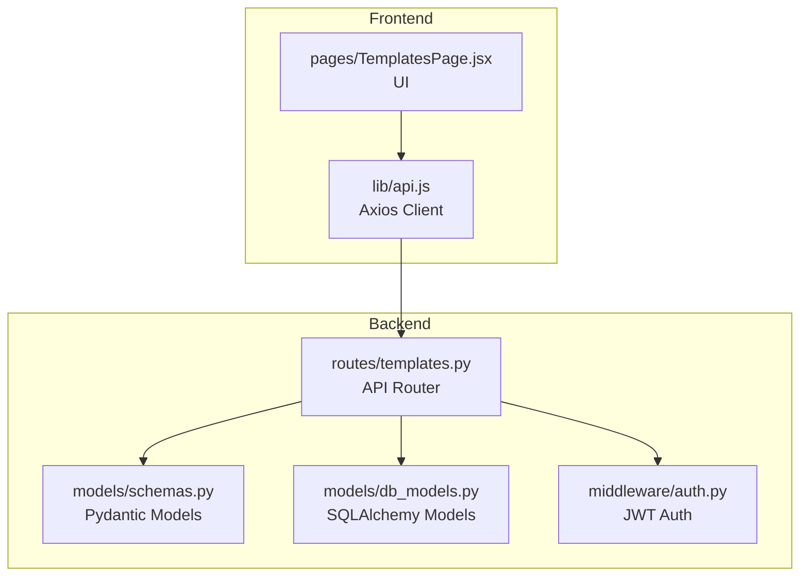
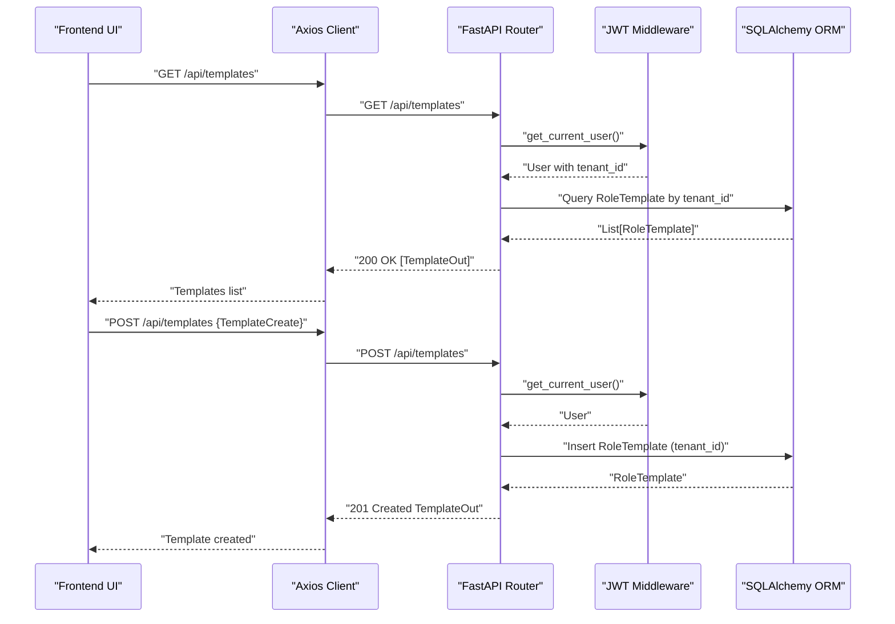
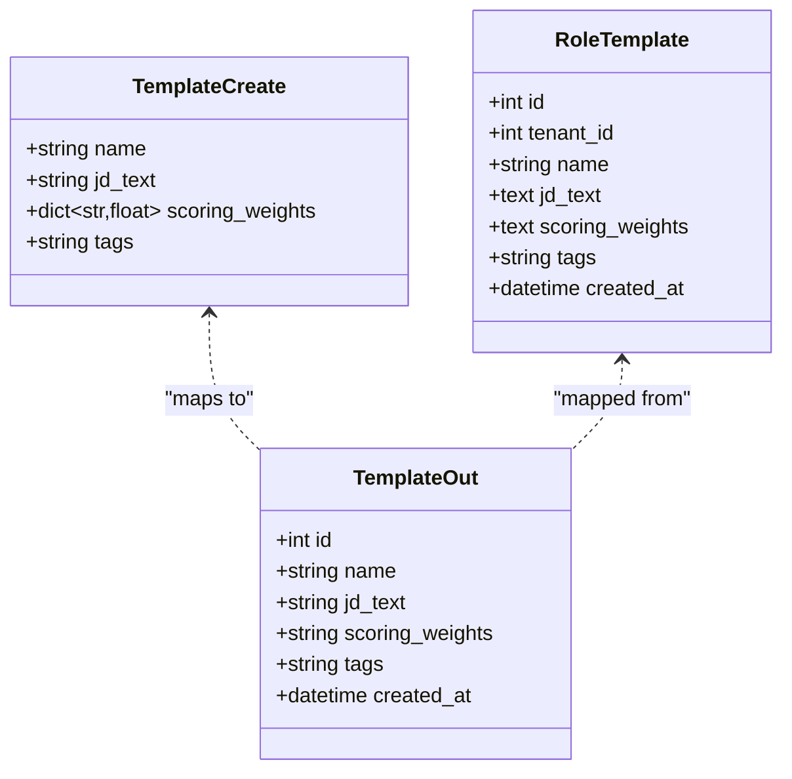
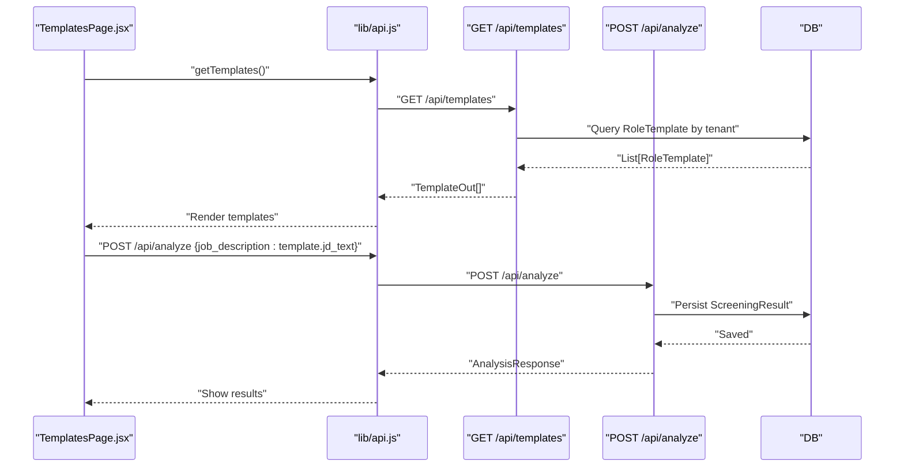
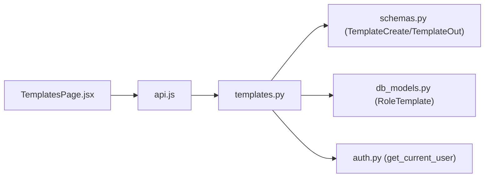

# Template Management

<cite>
**Referenced Files in This Document**
- [templates.py](file://app/backend/routes/templates.py)
- [schemas.py](file://app/backend/models/schemas.py)
- [db_models.py](file://app/backend/models/db_models.py)
- [auth.py](file://app/backend/middleware/auth.py)
- [api.js](file://app/frontend/src/lib/api.js)
- [TemplatesPage.jsx](file://app/frontend/src/pages/TemplatesPage.jsx)
- [test_routes_phase1.py](file://app/backend/tests/test_routes_phase1.py)
- [analyze.py](file://app/backend/route/analyze.py)
</cite>

## Table of Contents
1. [Introduction](#introduction)
2. [Project Structure](#project-structure)
3. [Core Components](#core-components)
4. [Architecture Overview](#architecture-overview)
5. [Detailed Component Analysis](#detailed-component-analysis)
6. [Dependency Analysis](#dependency-analysis)
7. [Performance Considerations](#performance-considerations)
8. [Troubleshooting Guide](#troubleshooting-guide)
9. [Conclusion](#conclusion)
10. [Appendices](#appendices)

## Introduction
This document provides comprehensive API documentation for job description template management. It covers endpoint definitions, request/response schemas, authentication and authorization, tenant scoping, and integration with analysis workflows. It also includes examples of creating, sharing (via tags), and using templates in analysis processes.

## Project Structure
Template management is implemented as a FastAPI router with Pydantic models for request/response validation and SQLAlchemy ORM models for persistence. The frontend integrates with the backend via a thin API client wrapper.

**Diagram sources**
- [templates.py:13-85](file://app/backend/routes/templates.py#L13-L85)
- [schemas.py:210-227](file://app/backend/models/schemas.py#L210-L227)
- [db_models.py:151-164](file://app/backend/models/db_models.py#L151-L164)
- [auth.py:19-40](file://app/backend/middleware/auth.py#L19-L40)
- [api.js:208-225](file://app/frontend/src/lib/api.js#L208-L225)
- [TemplatesPage.jsx:82-107](file://app/frontend/src/pages/TemplatesPage.jsx#L82-L107)

**Section sources**
- [templates.py:1-86](file://app/backend/routes/templates.py#L1-L86)
- [schemas.py:210-227](file://app/backend/models/schemas.py#L210-L227)
- [db_models.py:151-164](file://app/backend/models/db_models.py#L151-L164)
- [auth.py:1-47](file://app/backend/middleware/auth.py#L1-L47)
- [api.js:208-225](file://app/frontend/src/lib/api.js#L208-L225)
- [TemplatesPage.jsx:1-195](file://app/frontend/src/pages/TemplatesPage.jsx#L1-L195)

## Core Components
- Template endpoints
  - GET /api/templates: List templates scoped to the current tenant
  - POST /api/templates: Create a new template
  - GET /api/templates/{id}: Retrieve a template by ID
  - PUT /api/templates/{id}: Update a template by ID
  - DELETE /api/templates/{id}: Delete a template by ID
- Authentication and authorization
  - JWT bearer token required
  - Tenant-scoped access enforced on reads/writes
- Data models
  - TemplateCreate: request schema for creation/update
  - TemplateOut: response schema for listing and retrieval
  - RoleTemplate: persisted entity with tenant foreign key

**Section sources**
- [templates.py:16-85](file://app/backend/routes/templates.py#L16-L85)
- [schemas.py:210-227](file://app/backend/models/schemas.py#L210-L227)
- [db_models.py:151-164](file://app/backend/models/db_models.py#L151-L164)
- [auth.py:19-40](file://app/backend/middleware/auth.py#L19-L40)

## Architecture Overview
The template management flow connects frontend UI actions to backend routes, validated by Pydantic models, persisted via SQLAlchemy, and secured by JWT middleware. The tenant ID is derived from the authenticated user and used to scope all template operations.

**Diagram sources**
- [templates.py:16-45](file://app/backend/routes/templates.py#L16-L45)
- [auth.py:19-40](file://app/backend/middleware/auth.py#L19-L40)
- [db_models.py:151-164](file://app/backend/models/db_models.py#L151-L164)
- [api.js:208-225](file://app/frontend/src/lib/api.js#L208-L225)
- [TemplatesPage.jsx:89-97](file://app/frontend/src/pages/TemplatesPage.jsx#L89-L97)

## Detailed Component Analysis

### Endpoint Definitions

- GET /api/templates
  - Purpose: List all templates for the current tenant, ordered by creation date descending.
  - Authentication: Required (JWT bearer).
  - Authorization: Tenant-scoped; only templates belonging to the current user’s tenant are returned.
  - Response: Array of TemplateOut objects.
  - Example usage: Load templates in the Templates page.

- POST /api/templates
  - Purpose: Create a new template.
  - Authentication: Required (JWT bearer).
  - Request body: TemplateCreate (name, jd_text, optional scoring_weights, optional tags).
  - Behavior: Assigns tenant_id from current user; persists JSON-encoded scoring_weights if provided.
  - Response: TemplateOut (includes generated id and created_at).

- GET /api/templates/{id}
  - Purpose: Retrieve a specific template by ID.
  - Authentication: Required (JWT bearer).
  - Authorization: Tenant-scoped; returns 404 if template does not belong to the current tenant.
  - Response: TemplateOut.

- PUT /api/templates/{id}
  - Purpose: Update an existing template by ID.
  - Authentication: Required (JWT bearer).
  - Request body: TemplateCreate.
  - Behavior: Updates name, jd_text, scoring_weights (JSON-encoded), and tags; returns updated TemplateOut.
  - Response: TemplateOut.

- DELETE /api/templates/{id}
  - Purpose: Remove a template by ID.
  - Authentication: Required (JWT bearer).
  - Authorization: Tenant-scoped; returns 404 if not found.
  - Response: Object with deleted property set to the deleted template id.

**Section sources**
- [templates.py:16-85](file://app/backend/routes/templates.py#L16-L85)
- [schemas.py:210-227](file://app/backend/models/schemas.py#L210-L227)
- [auth.py:19-40](file://app/backend/middleware/auth.py#L19-L40)
- [api.js:208-225](file://app/frontend/src/lib/api.js#L208-L225)
- [TemplatesPage.jsx:82-107](file://app/frontend/src/pages/TemplatesPage.jsx#L82-L107)

### Request and Response Schemas

- TemplateCreate (request)
  - Fields:
    - name: string
    - jd_text: string
    - scoring_weights: optional object mapping dimension names to floats
    - tags: optional string
  - Notes: scoring_weights is stored as a JSON string in the database.

- TemplateOut (response)
  - Fields:
    - id: integer
    - name: string
    - jd_text: string
    - scoring_weights: optional JSON string (dimensions and weights)
    - tags: optional string
    - created_at: datetime
  - Notes: created_at is server-assigned.

- RoleTemplate (database model)
  - Columns:
    - id: integer (primary key)
    - tenant_id: integer (foreign key to tenants)
    - name: string
    - jd_text: text
    - scoring_weights: text (JSON string)
    - tags: string
    - created_at: datetime
  - Relationships:
    - belongs to Tenant (one-to-many)
    - related to ScreeningResult (one-to-many)
    - related to TranscriptAnalysis (one-to-many)

**Diagram sources**
- [schemas.py:210-227](file://app/backend/models/schemas.py#L210-L227)
- [db_models.py:151-164](file://app/backend/models/db_models.py#L151-L164)

**Section sources**
- [schemas.py:210-227](file://app/backend/models/schemas.py#L210-L227)
- [db_models.py:151-164](file://app/backend/models/db_models.py#L151-L164)

### Sharing and Version Control
- Sharing
  - No explicit sharing model is implemented in the backend. Templates are tenant-scoped.
  - Tags can be used to categorize templates for internal grouping and filtering in the UI.
- Version control
  - No built-in version history is present in the template model. Each update replaces the previous template record.

**Section sources**
- [templates.py:16-85](file://app/backend/routes/templates.py#L16-L85)
- [db_models.py:151-164](file://app/backend/models/db_models.py#L151-L164)

### Template Inheritance and Bulk Operations
- Inheritance
  - There is no template inheritance mechanism in the current implementation.
- Bulk operations
  - There is no dedicated bulk template creation or update endpoint. Bulk operations can be implemented by repeating individual requests in the client.

**Section sources**
- [templates.py:16-85](file://app/backend/routes/templates.py#L16-L85)
- [api.js:208-225](file://app/frontend/src/lib/api.js#L208-L225)

### Integration with Analysis Workflows
- Using templates in analysis
  - The frontend supports “Use Template” to populate the job description field with a selected template’s jd_text.
  - The analysis endpoints accept either a text job description or a job file; templates can be used as the source of the job description text.
- Relationship to results
  - ScreeningResult and TranscriptAnalysis both maintain references to RoleTemplate via role_template_id, enabling historical association between templates and analysis outcomes.

**Diagram sources**
- [TemplatesPage.jsx:82-107](file://app/frontend/src/pages/TemplatesPage.jsx#L82-L107)
- [api.js:208-225](file://app/frontend/src/lib/api.js#L208-L225)
- [templates.py:16-26](file://app/backend/routes/templates.py#L16-L26)
- [analyze.py:354-501](file://app/backend/route/analyze.py#L354-L501)

**Section sources**
- [TemplatesPage.jsx:105-107](file://app/frontend/src/pages/TemplatesPage.jsx#L105-L107)
- [api.js:208-225](file://app/frontend/src/lib/api.js#L208-L225)
- [templates.py:16-26](file://app/backend/routes/templates.py#L16-L26)
- [analyze.py:354-501](file://app/backend/route/analyze.py#L354-L501)

## Dependency Analysis
- Router depends on:
  - Pydantic models for validation (TemplateCreate, TemplateOut)
  - SQLAlchemy models for persistence (RoleTemplate)
  - JWT middleware for authentication and tenant scoping
- Frontend depends on:
  - Axios client for HTTP calls
  - React components for UI interactions

**Diagram sources**
- [templates.py:1-13](file://app/backend/routes/templates.py#L1-L13)
- [schemas.py:210-227](file://app/backend/models/schemas.py#L210-L227)
- [db_models.py:151-164](file://app/backend/models/db_models.py#L151-L164)
- [auth.py:19-40](file://app/backend/middleware/auth.py#L19-L40)
- [api.js:208-225](file://app/frontend/src/lib/api.js#L208-L225)
- [TemplatesPage.jsx:1-4](file://app/frontend/src/pages/TemplatesPage.jsx#L1-L4)

**Section sources**
- [templates.py:1-13](file://app/backend/routes/templates.py#L1-L13)
- [schemas.py:210-227](file://app/backend/models/schemas.py#L210-L227)
- [db_models.py:151-164](file://app/backend/models/db_models.py#L151-L164)
- [auth.py:19-40](file://app/backend/middleware/auth.py#L19-L40)
- [api.js:208-225](file://app/frontend/src/lib/api.js#L208-L225)
- [TemplatesPage.jsx:1-4](file://app/frontend/src/pages/TemplatesPage.jsx#L1-L4)

## Performance Considerations
- Tenant scoping filters reduce result sets to a single tenant.
- Listing templates orders by created_at desc; consider pagination for large datasets.
- Scoring weights are stored as JSON strings; keep the object small to minimize storage overhead.
- Frontend caching of templates can reduce repeated network calls.

[No sources needed since this section provides general guidance]

## Troubleshooting Guide
- 401 Unauthorized
  - Cause: Missing or invalid JWT bearer token.
  - Resolution: Authenticate and ensure the token is attached to requests.
- 403 Forbidden
  - Cause: Admin-only route attempted by non-admin user.
  - Resolution: Use an admin account or remove admin-only decorators.
- 404 Not Found
  - Cause: Template ID not found under the current tenant.
  - Resolution: Verify tenant scoping and template existence.
- 422 Unprocessable Entity
  - Cause: Request body validation failed (e.g., missing required fields).
  - Resolution: Ensure TemplateCreate fields conform to schema.
- 429 Too Many Requests
  - Cause: Usage limit exceeded for analysis endpoints.
  - Resolution: Upgrade plan or reduce usage.

**Section sources**
- [auth.py:23-40](file://app/backend/middleware/auth.py#L23-L40)
- [templates.py:59-60](file://app/backend/routes/templates.py#L59-L60)
- [test_routes_phase1.py:95-97](file://app/backend/tests/test_routes_phase1.py#L95-L97)

## Conclusion
Template management provides a simple, tenant-scoped CRUD interface for job description templates. While sharing and version control are not built-in, tags enable categorization, and templates integrate seamlessly with analysis workflows. The implementation is straightforward and extensible for future enhancements such as explicit sharing and version histories.

[No sources needed since this section summarizes without analyzing specific files]

## Appendices

### Endpoint Reference

- GET /api/templates
  - Description: List templates for the current tenant.
  - Response: Array of TemplateOut.
- POST /api/templates
  - Description: Create a new template.
  - Request: TemplateCreate.
  - Response: TemplateOut.
- GET /api/templates/{id}
  - Description: Retrieve a template by ID.
  - Response: TemplateOut.
- PUT /api/templates/{id}
  - Description: Update a template by ID.
  - Request: TemplateCreate.
  - Response: TemplateOut.
- DELETE /api/templates/{id}
  - Description: Delete a template by ID.
  - Response: Object with deleted property.

**Section sources**
- [templates.py:16-85](file://app/backend/routes/templates.py#L16-L85)
- [schemas.py:210-227](file://app/backend/models/schemas.py#L210-L227)

### Example Workflows

- Create a template
  - Frontend: Open the template modal, fill name and job description, click Save.
  - Backend: POST /api/templates with TemplateCreate payload; returns TemplateOut.
- Use a template in analysis
  - Frontend: Click “Use Template” to populate the job description field with template.jd_text.
  - Backend: POST /api/analyze with job_description set to the template text; returns AnalysisResponse.
- Update and delete a template
  - Frontend: Edit template via modal; PUT /api/templates/{id} updates; DELETE /api/templates/{id} removes.

**Section sources**
- [TemplatesPage.jsx:105-107](file://app/frontend/src/pages/TemplatesPage.jsx#L105-L107)
- [api.js:208-225](file://app/frontend/src/lib/api.js#L208-L225)
- [templates.py:29-85](file://app/backend/routes/templates.py#L29-L85)
- [analyze.py:354-501](file://app/backend/route/analyze.py#L354-L501)