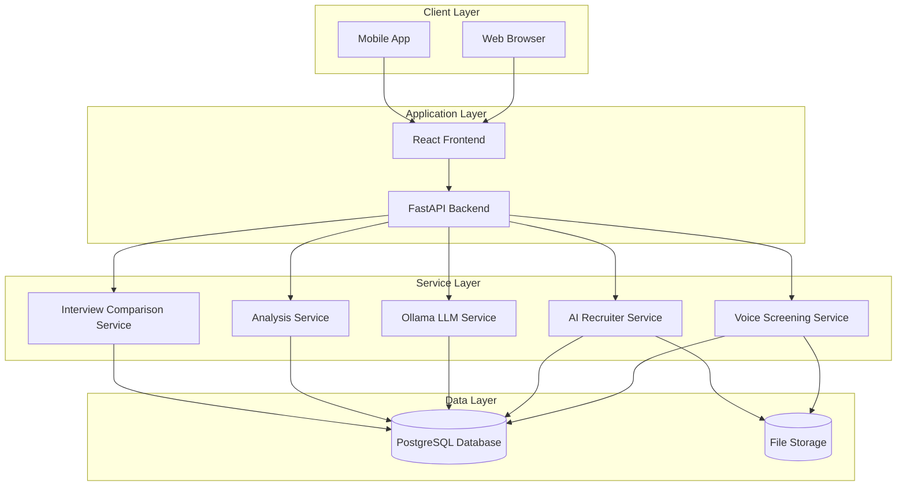

# Unified Interview System

<cite>
**Referenced Files in This Document**
- [README.md](file://README.md)
- [PRODUCT_SPECIFICATION.md](file://PRODUCT_SPECIFICATION.md)
- [main.py](file://app/backend/main.py)
- [App.jsx](file://app/frontend/src/App.jsx)
- [interviews.py](file://app/backend/routes/interviews.py)
- [compare.py](file://app/backend/routes/compare.py)
- [recruiter.py](file://app/backend/routes/recruiter.py)
- [db_models.py](file://app/backend/models/db_models.py)
- [schemas.py](file://app/backend/models/schemas.py)
- [conversation.py](file://app/voice_agent/conversation.py)
- [046_unified_interview.py](file://alembic/versions/046_unified_interview.py)
- [047_adaptive_depth_escalation.py](file://alembic/versions/047_adaptive_depth_escalation.py)
- [InterviewPage.jsx](file://app/frontend/src/pages/InterviewPage.jsx)
- [InterviewComparisonPage.jsx](file://app/frontend/src/pages/InterviewComparisonPage.jsx)
- [CandidateComparisonRadar.jsx](file://app/frontend/src/components/CandidateComparisonRadar.jsx)
- [api.js](file://app/frontend/src/lib/api.js)
</cite>

## Update Summary
**Changes Made**
- Added comprehensive coverage of new /compare endpoint for interview scorecard comparison with unified tracking capabilities
- Enhanced Voice Screening System with adaptive escalation features and configurable auto-escalation thresholds
- Updated Interview Frontend Integration with enhanced depth filter functionality and unified tracking capabilities
- Added new Interview Comparison Page with radar chart visualization and executive summary capabilities
- Enhanced Interview Data Models with adaptive escalation configuration support

## Table of Contents
1. [Introduction](#introduction)
2. [System Architecture](#system-architecture)
3. [Unified Interview System Overview](#unified-interview-system-overview)
4. [Core Interview Components](#core-interview-components)
5. [Interview Session Management](#interview-session-management)
6. [AI Recruiter Integration](#ai-recruiter-integration)
7. [Voice Screening System](#voice-screening-system)
8. [Interview Depth Classification](#interview-depth-classification)
9. [Interview Data Models](#interview-data-models)
10. [Interview Analytics](#interview-analytics)
11. [Interview Configuration](#interview-configuration)
12. [Interview Export System](#interview-export-system)
13. [Interview Security and Compliance](#interview-security-and-compliance)
14. [Interview API Endpoints](#interview-api-endpoints)
15. [Interview Frontend Integration](#interview-front-end-integration)
16. [Interview Comparison System](#interview-comparison-system)
17. [Conclusion](#conclusion)

## Introduction

The Unified Interview System is a comprehensive AI-powered recruitment platform developed by ThetaLogics that combines voice screening, AI recruiter interviews, and traditional video analysis into a single, cohesive system. Built as part of the ARIA (AI Resume Intelligence) platform, this system provides modern hiring teams with advanced interview capabilities while maintaining strict data privacy and compliance standards.

Unlike cloud-based solutions that send candidate data to third-party AI services, the Unified Interview System runs entirely on your infrastructure with local LLM inference via Ollama, ensuring that sensitive candidate information never leaves your server. The system supports both Ollama Cloud (default) and fully self-hosted local LLM deployment, giving organizations flexibility between ease of setup and complete data sovereignty.

## System Architecture

The Unified Interview System follows a multi-tenant SaaS architecture with clear separation between voice screening, AI recruiter interviews, and traditional video analysis. The system is built on a robust technology stack that includes FastAPI for the backend, React for the frontend, and integrates seamlessly with Ollama for AI-powered interview capabilities.



**Diagram sources**
- [main.py:118-174](file://app/backend/main.py#L118-L174)
- [README.md:118-174](file://README.md#L118-L174)

The architecture ensures complete data isolation between tenants while providing unified access to interview capabilities. The system maintains production-grade reliability with comprehensive testing, CI/CD pipeline, and monitoring capabilities.

**Section sources**
- [README.md:115-174](file://README.md#L115-L174)
- [main.py:360-447](file://app/backend/main.py#L360-L447)

## Unified Interview System Overview

The Unified Interview System represents a significant evolution in AI-powered recruitment interviewing, combining three distinct interview modalities into a single, cohesive platform:

### Interview Depth Levels

The system supports three interview depths, each serving different recruitment needs:

**Quick Interviews (Voice Screening)**
- Automated phone-based screening with pre-recorded questions
- Real-time assessment of communication skills and basic qualifications
- Ideal for initial candidate filtering and volume screening
- Supports both inbound and outbound call routing
- **Updated**: Now includes comprehensive interview_depth classification with "quick" designation and unified tracking capabilities

**Standard Interviews (AI Recruiter)**
- AI-powered conversational interviews with dynamic question adaptation
- Multi-dimensional evaluation across technical, behavioral, communication, cultural fit, and motivation
- Independent scorecard with hiring recommendations
- Full transcript analysis with per-question evaluation annotations
- **Updated**: Now maps to "deep" interview_depth for unified tracking and maintains backward compatibility

**Deep Interviews (Enhanced AI Recruiter)**
- Comprehensive AI interview experience with advanced contextual awareness
- Integration with existing screening analysis for fitment score verification
- Auto-trigger capability for automatic interview initiation at pipeline stages
- Detailed evaluation with evidence-based recommendations
- **Updated**: Now fully supported with interview_depth tracking and enhanced database consistency

### Unified Access Point

The system provides a single API endpoint (`/api/interviews/`) that manages all interview types, automatically routing requests to appropriate services based on interview depth and configuration. This unified approach simplifies integration while maintaining the flexibility to scale interview capabilities independently.

**Section sources**
- [interviews.py:62-66](file://app/backend/routes/interviews.py#L62-L66)
- [interviews.py:134-144](file://app/backend/routes/interviews.py#L134-L144)

## Core Interview Components

The Unified Interview System consists of several interconnected components that work together to provide comprehensive interview automation and analysis capabilities.

### Interview Orchestrator

The central orchestrator manages the coordination between different interview types and handles session lifecycle management. It ensures proper routing of interview requests, maintains session state, and coordinates with external services for voice call management and AI analysis.

### Voice Screening Integration

The voice screening component provides automated phone-based interview capabilities with support for both inbound and outbound call scenarios. It integrates with telephony providers to deliver seamless voice interview experiences while maintaining detailed transcript recording and analysis capabilities.

### AI Recruiter Integration

The AI Recruiter component delivers sophisticated conversational AI interviews with dynamic question adaptation based on candidate responses. It leverages advanced LLM capabilities to provide natural conversation flows while maintaining strict evaluation criteria across multiple competency areas.

### Transcript Analysis Engine

Both voice and AI recruiter interviews generate detailed transcripts that undergo comprehensive analysis. The system extracts meaningful insights from conversation patterns, evaluates candidate responses against job requirements, and provides structured recommendations for hiring managers.

**Section sources**
- [interviews.py:222-232](file://app/backend/routes/interviews.py#L222-L232)
- [recruiter.py:145-155](file://app/backend/routes/recruiter.py#L145-L155)

## Interview Session Management

The Unified Interview System provides comprehensive session management capabilities that handle the complete lifecycle of interview processes, from initiation to completion and analysis.

### Session Creation and Routing

When creating interview sessions, the system automatically determines the appropriate interview depth based on configuration and candidate requirements. The routing mechanism ensures that quick interviews are handled by voice screening services, while standard and deep interviews are processed through the AI recruiter system.

### Status Management

The system maintains detailed session status tracking with support for multiple states including scheduled, pending strategy, strategy ready, no answer, failed, completed, and cancelled. This comprehensive status management enables proper workflow orchestration and user feedback.

### Session Persistence

All interview sessions are persisted in the database with comprehensive metadata including candidate information, job description context, interview depth, timing information, and outcome data. This persistence enables detailed analytics, compliance reporting, and historical analysis capabilities.

### Session Cancellation and Retry

The system supports flexible session management with cancellation capabilities for sessions in appropriate states and retry mechanisms for failed sessions. These features ensure robust operation under various conditions while maintaining data integrity.

**Section sources**
- [interviews.py:480-524](file://app/backend/routes/interviews.py#L480-L524)
- [interviews.py:527-603](file://app/backend/routes/interviews.py#L527-L603)

## AI Recruiter Integration

The AI Recruiter component represents the most sophisticated interview capability within the Unified Interview System, providing AI-powered conversational interviews with advanced evaluation and analysis features.

### Interview Strategy Management

The AI Recruiter system employs dynamic interview strategies that adapt based on candidate responses and predefined focus areas. These strategies ensure comprehensive evaluation across multiple competency dimensions while maintaining conversational flow and engagement.

### Question Adaptation Engine

The system features intelligent question adaptation that modifies subsequent questions based on candidate responses, previous answers, and evaluation criteria. This adaptive approach ensures targeted assessment while maintaining natural conversation patterns.

### Multi-Dimensional Evaluation

The AI Recruiter evaluates candidates across five key dimensions:
- Technical Competency: Role-specific skills and knowledge assessment
- Behavioral Patterns: Soft skills and cultural fit evaluation
- Communication Quality: Speaking ability and articulation assessment
- Cultural Fit: Alignment with organizational values and team dynamics
- Motivation Level: Candidate enthusiasm and career progression indicators

### Evidence-Based Recommendations

Every AI evaluation is supported by specific evidence extracted from candidate responses, providing transparency and defensibility for hiring decisions. The system maintains detailed evidence logs that support recommendations and enable audit trails.

**Section sources**
- [recruiter.py:119-173](file://app/backend/routes/recruiter.py#L119-L173)
- [recruiter.py:277-327](file://app/backend/routes/recruiter.py#L277-L327)

## Voice Screening System

The voice screening component provides automated phone-based interview capabilities that serve as an efficient initial screening tool for large candidate volumes.

### Automated Call Management

The system handles complete call lifecycle management including call initiation, greeting, question delivery, response collection, and call conclusion. It supports both inbound and outbound call scenarios with appropriate routing and handling procedures.

### Real-Time Assessment

Voice screening provides real-time assessment of candidate communication skills, pronunciation, fluency, and basic qualification alignment. The system captures audio data for later analysis and maintains detailed transcript records.

### Integration with Telephony Providers

The voice screening system integrates with major telephony providers to deliver reliable call services. It supports various call routing scenarios and provides fallback mechanisms for call failures or connectivity issues.

### Quality Assurance

All voice screening sessions maintain quality assurance through automated validation of call connections, audio quality monitoring, and response completeness verification. This ensures reliable data collection and accurate assessment results.

### Adaptive Escalation Features

**Updated**: The voice screening system now includes comprehensive adaptive escalation features with configurable thresholds:

- **Auto-Escalation Enabled**: Toggle for automatic escalation from quick to standard/deep interviews based on performance
- **Escalation Threshold**: Configurable score threshold (default 70%) that triggers automatic interview escalation
- **Adaptive Depth Configuration**: Tenant-level configuration for voice screening depth escalation policies
- **Escalation Contact**: Designated team member for handling escalated interview cases

These features enable intelligent interview depth adjustment based on candidate performance, optimizing resource allocation and interview quality.

**Section sources**
- [interviews.py:147-187](file://app/backend/routes/interviews.py#L147-L187)
- [interviews.py:190-268](file://app/backend/routes/interviews.py#L190-L268)
- [047_adaptive_depth_escalation.py:14-36](file://alembic/versions/047_adaptive_depth_escalation.py#L14-L36)

## Interview Depth Classification

**Updated**: The Unified Interview System now includes comprehensive interview_depth classification for voice screening sessions, providing unified tracking across all interview modalities with enhanced database schema consistency.

### Depth Classification System

The system implements a standardized interview depth classification system with three distinct levels:

**Quick Depth (Interview Depth: "quick")**
- Basic phone screening with linear question flow
- Limited follow-up questions (0 per question)
- Short call duration (5 minutes max)
- Simple skill-based questioning
- Designed for rapid candidate assessment and volume screening
- **Enhanced**: Now includes proper database column definition and index creation

**Standard Depth (Interview Depth: "standard")**
- Structured interview with dimension-based questioning
- Moderate follow-up questions (1 per question)
- Standard call duration (15 minutes max)
- Multi-dimensional competency evaluation
- **Enhanced**: Now maps to "deep" in database for unified tracking while preserving API depth specification

**Deep Depth (Interview Depth: "deep")**
- Comprehensive interview with advanced contextual awareness
- Extensive follow-up questions (2 per question)
- Extended call duration (30 minutes max)
- Sophisticated competency evaluation with evidence gathering
- **Enhanced**: Now fully supported with interview_depth tracking and backfill functionality

### Database Implementation

The interview_depth classification is implemented through a dedicated database column in the voice_screening_sessions table with enhanced migration naming convention:

```sql
-- Migration 046: Unified AI Interview depth column
ALTER TABLE voice_screening_sessions 
ADD COLUMN interview_depth VARCHAR(10) DEFAULT 'quick' NOT NULL;

CREATE INDEX ix_vss_interview_depth ON voice_screening_sessions (interview_depth);
```

The system maintains backward compatibility by mapping "standard" depth to "deep" in the database while preserving the original depth specification in API responses. The migration includes intelligent backfill logic to update existing sessions linked from recruiter_interview_sessions to "deep" depth.

### Unified Tracking Benefits

The interview_depth classification provides several operational benefits:

- **Analytics Consistency**: Unified reporting across all interview modalities with proper depth mapping
- **Resource Planning**: Accurate capacity planning based on interview depth with database-level indexing
- **Quality Assurance**: Depth-specific quality metrics and benchmarks with enhanced filtering capabilities
- **Compliance Tracking**: Audit trails for different interview depth requirements with proper database schema
- **Performance Optimization**: Depth-specific performance tuning and resource allocation with optimized database queries

**Section sources**
- [046_unified_interview.py:14-49](file://alembic/versions/046_unified_interview.py#L14-L49)
- [db_models.py:919](file://app/backend/models/db_models.py#L919)
- [interviews.py:250-268](file://app/backend/routes/interviews.py#L250-L268)

## Interview Data Models

The Unified Interview System utilizes a comprehensive set of data models that support the complete interview lifecycle, from initial session creation through final analysis and reporting.

### Interview Session Models

The system defines distinct models for different interview types:
- **VoiceScreeningSession**: Manages voice call-based interview sessions with call metadata, status tracking, and outcome data
- **RecruiterInterviewSession**: Handles AI recruiter interview sessions with conversation context, evaluation data, and recommendation tracking
- **RecruiterScorecard**: Stores detailed evaluation results with competency ratings, evidence documentation, and final recommendations

### Transcript Management

The system maintains comprehensive transcript management through specialized models:
- **VoiceTranscriptEntry**: Individual audio segments with speaker identification, timestamp, and audio URL references
- **RecruiterInterviewQuestion**: Structured question management with sequence numbering and context information
- **TranscriptAnalysis**: Analysis results for transcript-based interviews with evidence validation and recommendation data

### Configuration Models

Interview configuration is managed through dedicated models that support tenant-specific settings:
- **VoiceTenantConfig**: Voice screening configuration including call settings, greeting messages, and routing preferences
- **RecruiterAutoTriggerConfig**: AI recruiter auto-trigger settings with pipeline stage associations and evaluation criteria
- **InterviewEvaluation**: Per-question evaluation data with rating systems and reviewer attribution

### Analytics and Reporting

The system includes specialized models for interview analytics and reporting:
- **InterviewAnalytics**: Aggregated statistics for interview performance, completion rates, and evaluation distributions
- **ExportSession**: Temporary storage for interview data during export processes with format-specific transformations
- **InterviewStatusLog**: Historical tracking of interview status changes with timestamps and user attribution

### Interview Depth Tracking

**Updated**: The VoiceScreeningSession model now includes comprehensive interview_depth tracking with proper database schema definition:

```python
class VoiceScreeningSession(Base):
    # ... existing fields ...
    interview_depth   = Column(String(10), default="quick", server_default="quick", nullable=False)
```

This field supports three values: "quick", "standard", and "deep", enabling unified tracking across all interview modalities. The database schema includes proper indexing for performance optimization and enhanced filtering capabilities.

### Adaptive Escalation Configuration

**Updated**: The VoiceTenantConfig model now includes comprehensive adaptive escalation configuration:

```python
class VoiceTenantConfig(Base):
    # ... existing fields ...
    auto_escalation_enabled   = Column(Boolean, nullable=False, server_default="false", default=False)
    auto_escalation_threshold = Column(Integer, nullable=False, server_default="70", default=70)
```

These fields enable intelligent interview depth escalation based on candidate performance, optimizing resource allocation and interview quality.

**Section sources**
- [db_models.py:372-380](file://app/backend/models/db_models.py#L372-L380)
- [db_models.py:397-416](file://app/backend/models/db_models.py#L397-L416)
- [db_models.py:492-526](file://app/backend/models/db_models.py#L492-L526)
- [db_models.py:915-944](file://app/backend/models/db_models.py#L915-L944)
- [db_models.py:892-907](file://app/backend/models/db_models.py#L892-L907)

## Interview Analytics

The Unified Interview System provides comprehensive analytics capabilities that enable data-driven insights into interview performance, candidate evaluation effectiveness, and overall recruitment process optimization.

### Voice Interview Analytics

Voice screening analytics track key performance indicators including:
- **Call Completion Rates**: Percentage of attempted calls successfully connected and completed
- **Average Call Duration**: Statistical analysis of call length distributions across different interview depths
- **Answer Rates**: Completion rates for different question categories and overall interview flow
- **Quality Metrics**: Audio quality assessments and communication pattern analysis

### AI Recruiter Analytics

AI recruiter analytics provide deeper insights into conversational effectiveness:
- **Conversation Flow Metrics**: Analysis of question adaptation effectiveness and conversation coherence
- **Evaluation Accuracy**: Comparison between AI assessments and human reviewer judgments
- **Candidate Engagement**: Metrics for candidate participation, response quality, and conversation engagement
- **Recommendation Effectiveness**: Analysis of AI recommendations against actual hiring outcomes

### Comparative Analytics

The system enables comparative analysis between different interview approaches:
- **Depth Comparison**: Effectiveness metrics across quick, standard, and deep interview formats with unified tracking
- **Provider Comparison**: Performance analysis between voice screening and AI recruiter approaches
- **Temporal Trends**: Evolution of interview effectiveness over time with seasonal and trend analysis
- **Benchmarking**: Industry comparison metrics and performance benchmarks

### Predictive Analytics

Advanced analytics capabilities include predictive modeling for:
- **Candidate Success Probability**: Likelihood of candidate success based on interview performance
- **Hiring Outcome Prediction**: Probability of successful hires based on interview evaluations
- **Optimization Recommendations**: Data-driven suggestions for improving interview effectiveness
- **Resource Planning**: Forecasting requirements for interview capacity and staffing needs

**Section sources**
- [interviews.py:708-790](file://app/backend/routes/interviews.py#L708-L790)
- [recruiter.py:532-646](file://app/backend/routes/recruiter.py#L532-L646)

## Interview Configuration

The Unified Interview System provides extensive configuration capabilities that enable organizations to tailor interview processes to their specific needs while maintaining compliance and effectiveness standards.

### Tenant-Level Configuration

Each tenant can configure interview settings independently through dedicated configuration models that support:
- **Voice Screening Preferences**: Call timing, greeting messages, and routing rules
- **AI Recruiter Settings**: Evaluation criteria, question libraries, and recommendation thresholds
- **Integration Parameters**: Telephony provider credentials, LLM model configurations, and analysis parameters
- **Compliance Settings**: Data retention policies, audit requirements, and regulatory compliance options

### Interview Depth Configuration

**Updated**: Configuration varies by interview depth with specific parameters for each format and enhanced unified tracking:

**Quick Depth Configuration**
- Simplified configuration focusing on call routing, basic evaluation criteria, and compliance requirements
- Limited question libraries optimized for rapid assessment
- Standard call duration and follow-up constraints
- **Enhanced**: Proper database column definition with "quick" default value

**Standard Depth Configuration**
- Comprehensive configuration including question libraries, evaluation rubrics, and AI model parameters
- **Enhanced**: Automatic mapping to "deep" in database for unified tracking while preserving API depth specification
- Extended call duration and enhanced evaluation criteria

**Deep Depth Configuration**
- Advanced configuration with dynamic adaptation rules, multi-modal evaluation criteria, and sophisticated analysis parameters
- **Enhanced**: Full support for interview_depth tracking with database-level consistency and backfill functionality
- Maximum call duration and comprehensive evaluation capabilities

### Auto-Trigger Configuration

The system supports intelligent auto-trigger configuration that automatically initiates interviews based on:
- **Pipeline Stage Triggers**: Automatic interview initiation when candidates reach specific pipeline stages
- **Eligibility Criteria**: Pre-defined qualification requirements that must be met for interview initiation
- **Timing Parameters**: Optimal timing windows for interview scheduling based on candidate availability and organizational preferences
- **Priority Settings**: Interview priority levels based on candidate scoring, urgency, or other business rules

### Integration Configuration

Extensive integration configuration enables connectivity with external systems:
- **Telephony Provider Integration**: Credentials and routing configurations for voice call services
- **ATS Integration**: Application tracking system connectivity for candidate data synchronization
- **Email Integration**: Notification system configuration for interview scheduling and result delivery
- **Analytics Integration**: External analytics platform connectivity for performance monitoring and reporting

### Adaptive Escalation Configuration

**Updated**: The system now supports comprehensive adaptive escalation configuration:

- **Auto-Escalation Toggle**: Enable/disable automatic interview depth escalation based on performance
- **Threshold Configuration**: Set customizable score thresholds for automatic escalation (default 70%)
- **Contact Assignment**: Designate team members for handling escalated interview cases
- **Escalation Policies**: Define rules for when and how interviews should be escalated

**Section sources**
- [interviews.py:608-703](file://app/backend/routes/interviews.py#L608-L703)
- [recruiter.py:425-490](file://app/backend/routes/recruiter.py#L425-L490)
- [047_adaptive_depth_escalation.py:14-36](file://alembic/versions/047_adaptive_depth_escalation.py#L14-L36)

## Interview Export System

The Unified Interview System provides comprehensive export capabilities that enable organizations to analyze interview data outside the platform while maintaining data integrity and compliance standards.

### Supported Export Formats

The system supports multiple export formats to accommodate different analytical and reporting needs:
- **CSV Exports**: Comma-separated value files for spreadsheet analysis and integration with external tools
- **Excel Exports**: Rich format exports with formatting, charts, and pivot table capabilities
- **JSON Exports**: Structured data exports for programmatic analysis and integration with custom applications
- **PDF Reports**: Professional formatted reports suitable for sharing with stakeholders and candidates

### Export Data Scope

Export capabilities cover comprehensive interview data including:
- **Session Metadata**: Candidate information, job description context, interview timing, and outcome data
- **Evaluation Results**: Detailed competency ratings, evidence documentation, and recommendation summaries
- **Transcript Data**: Full conversation transcripts with speaker identification and timestamp information
- **Analytics Data**: Statistical summaries, performance metrics, and comparative analysis results

### Data Transformation

The export system includes sophisticated data transformation capabilities:
- **Format Conversion**: Seamless transformation between different export formats while preserving data integrity
- **Aggregation Functions**: Statistical aggregation and summarization for large dataset analysis
- **Filtering Options**: Targeted export selection based on date ranges, candidate criteria, and evaluation thresholds
- **Custom Field Mapping**: Flexible field mapping to accommodate different reporting requirements and data schemas

### Compliance and Security

Export processes maintain strict compliance and security measures:
- **Access Controls**: Role-based access restrictions ensure only authorized users can export sensitive interview data
- **Audit Trails**: Complete logging of all export activities with user attribution and timestamp tracking
- **Data Masking**: Sensitive information can be masked or redacted during export processes as required
- **Retention Management**: Automatic cleanup of temporary export files and adherence to data retention policies

**Section sources**
- [interviews.py:795-803](file://app/backend/routes/interviews.py#L795-L803)
- [recruiter.py:651-709](file://app/backend/routes/recruiter.py#L651-L709)

## Interview Security and Compliance

The Unified Interview System implements comprehensive security and compliance measures that exceed industry standards for recruitment data protection and privacy.

### Data Privacy Protection

The system ensures complete data privacy through:
- **Local Processing**: All interview data is processed locally without transmission to external AI services
- **Encrypted Storage**: Sensitive interview data is encrypted both at rest and in transit using industry-standard encryption protocols
- **Access Controls**: Multi-layered access controls with role-based permissions and tenant isolation
- **Audit Logging**: Comprehensive audit trails for all data access and modification activities

### Compliance Framework

The system maintains compliance with major regulatory frameworks:
- **GDPR Compliance**: Full data protection compliance with right to access, rectification, erasure, and data portability
- **EEOC Compliance**: Equal employment opportunity compliance with demographic factor exclusion and evidence-based decision making
- **SOC 2 Compliance**: Security, availability, processing integrity, confidentiality, and privacy compliance standards
- **HIPAA Compliance**: Healthcare-related data protection for organizations handling protected health information

### Interview Security Measures

Specific security measures for interview processes include:
- **Secure Transcript Storage**: Encrypted storage of audio and video interview materials with access logging
- **Session Isolation**: Complete isolation of interview sessions between different tenants and users
- **Credential Management**: Secure handling of telephony provider credentials and API keys
- **Network Security**: Secure communication channels with external services and encrypted data transmission

### Privacy Controls

Comprehensive privacy controls enable candidate and organizational data protection:
- **Consent Management**: Explicit consent tracking for interview recording and processing
- **Data Minimization**: Collection and processing of only necessary interview data
- **Right to Erasure**: Automated deletion of interview data upon candidate request or retention period expiration
- **Data Portability**: Secure transfer of interview data to external systems or organizations as requested

**Section sources**
- [README.md:580-598](file://README.md#L580-L598)
- [PRODUCT_SPECIFICATION.md:618-625](file://PRODUCT_SPECIFICATION.md#L618-L625)

## Interview API Endpoints

The Unified Interview System provides a comprehensive set of REST API endpoints that enable programmatic access to all interview capabilities while maintaining security and consistency standards.

### Core Interview Endpoints

The system exposes essential interview management endpoints:
- **Session Creation**: `POST /api/interviews/sessions` - Create unified interview sessions with automatic depth routing and enhanced tracking
- **Session Listing**: `GET /api/interviews/sessions` - List tenant-specific interview sessions with filtering and pagination including depth-based filtering
- **Session Detail**: `GET /api/interviews/sessions/{id}` - Retrieve detailed session information with transcript and metadata including depth resolution
- **Session Management**: `POST /api/interviews/sessions/{id}/cancel` and `POST /api/interviews/sessions/{id}/retry` - Manage session lifecycle operations

### Transcript and Scorecard Endpoints

Specialized endpoints for interview analysis and evaluation:
- **Transcript Retrieval**: `GET /api/interviews/sessions/{id}/transcript` - Access detailed interview transcript data
- **Scorecard Access**: `GET /api/interviews/sessions/{id}/scorecard` - Retrieve comprehensive evaluation results and recommendations with depth-aware logic
- **Candidate Session History**: `GET /api/recruiter/candidates/{candidate_id}/sessions` - Access all interview sessions for a specific candidate

### Configuration Management

Endpoints for interview system configuration and administration:
- **Configuration Retrieval**: `GET /api/interviews/config` - Access merged voice and AI recruiter configuration settings
- **Configuration Updates**: `PUT /api/interviews/config` - Update tenant-specific interview configuration parameters
- **Auto-Trigger Management**: `GET/PUT /api/recruiter/config` - Manage AI recruiter auto-trigger settings and evaluation criteria

### Analytics and Reporting

Comprehensive analytics and reporting endpoints:
- **Interview Analytics**: `GET /api/interviews/analytics` - Access combined analytics for voice and AI recruiter interviews with depth-based filtering
- **Export Capabilities**: `POST /api/interviews/sessions/export` - Export interview data in various formats for external analysis

### Internal Integration

Internal service integration endpoints:
- **Completion Callback**: `POST /api/recruiter/internal/complete` - Internal callback for AI recruiter completion processing
- **Voice Agent Integration**: Service-to-service endpoints for voice agent communication and status updates

### Comparison System Endpoints

**Updated**: New comparison system endpoints for interview scorecard analysis:
- **Interview Comparison**: `GET /api/interviews/compare` - Compare multiple interview scorecards with unified tracking and depth filtering
- **Candidate Comparison**: `POST /api/compare` - Compare up to 5 screening results side-by-side with comprehensive analysis

### API Security and Authentication

All interview API endpoints require proper authentication and authorization:
- **JWT Authentication**: All endpoints require valid JWT tokens for access
- **Role-Based Access**: Different endpoints require specific user roles (admin, recruiter, viewer)
- **Tenant Isolation**: API responses are automatically filtered to the requesting tenant's data
- **Rate Limiting**: API access is subject to tenant-specific rate limiting and concurrency controls

**Section sources**
- [interviews.py:103-144](file://app/backend/routes/interviews.py#L103-L144)
- [interviews.py:325-374](file://app/backend/routes/interviews.py#L325-L374)
- [compare.py:28-50](file://app/backend/routes/compare.py#L28-L50)
- [recruiter.py:119-173](file://app/backend/routes/recruiter.py#L119-L173)

## Interview Frontend Integration

The Unified Interview System provides comprehensive frontend integration capabilities that enable seamless user interaction with interview features while maintaining consistent user experience across different interview modalities.

### React Component Architecture

The frontend utilizes a modular React component architecture optimized for interview functionality:
- **Interview Pages**: Dedicated pages for interview creation, management, and analysis
- **Session Components**: Reusable components for displaying and managing interview sessions
- **Analytics Dashboards**: Interactive dashboards for interview performance monitoring and analysis
- **Configuration Interfaces**: User-friendly interfaces for interview system configuration and customization

### Interview Creation Workflow

The frontend provides intuitive interview creation workflows:
- **Quick Interview Setup**: Streamlined interface for voice screening session creation with minimal configuration
- **AI Recruiter Configuration**: Comprehensive setup wizard for AI recruiter interviews with evaluation criteria and question library selection
- **Batch Processing**: Support for creating multiple interview sessions with bulk configuration options
- **Auto-Trigger Setup**: Intuitive configuration interface for automated interview initiation based on pipeline stages

### Real-Time Session Management

The frontend enables real-time session management through:
- **Live Status Updates**: Real-time display of interview session status and progress
- **Interactive Controls**: User-friendly controls for session cancellation, retry, and management operations
- **Transcript Visualization**: Interactive transcript viewers with speaker identification and timestamp navigation
- **Analytics Dashboards**: Real-time analytics displays with performance metrics and trend visualization

### Mobile Responsiveness

The frontend maintains full responsiveness across device types:
- **Mobile-First Design**: Optimized mobile interface for interview management on smartphones and tablets
- **Touch-Friendly Controls**: Large touch targets and simplified controls for mobile interview management
- **Offline Capabilities**: Progressive web app features enabling basic interview functionality offline
- **Cross-Platform Compatibility**: Consistent experience across iOS Safari, Android Chrome, and desktop browsers

### Integration with Recruitment Tools

The frontend integrates with broader recruitment workflow tools:
- **Candidate Profile Integration**: Seamless access to candidate profiles and screening results
- **Job Description Context**: Automatic job description context for interview questions and evaluation criteria
- **Team Collaboration**: Integration with team collaboration features for interview feedback and discussion
- **Reporting Integration**: Direct access to interview analytics and reporting capabilities

### Depth Filter Interface

**Updated**: The frontend now includes comprehensive depth filter functionality with enhanced depth mapping logic:

```jsx
{[
  { key: 'all', label: 'All' },
  { key: 'quick', label: 'Quick' },
  { key: 'standard', label: 'Standard' },
  { key: 'deep', label: 'Deep' },
].map(tab => (
  <button
    key={tab.key}
    onClick={() => setDepthFilter(tab.key)}
    className={`flex items-center gap-1.5 px-3.5 py-2 rounded-xl text-sm font-semibold transition-all ${
      depthFilter === tab.key
        ? 'bg-brand-600 text-white shadow-sm'
        : 'text-slate-500 hover:text-brand-700 hover:bg-brand-50'
    }`}
  >
    {tab.label}
  </button>
))}
```

This depth filter allows users to easily categorize and analyze interview sessions by their respective depths, providing granular control over interview data visualization and reporting. The frontend includes proper depth resolution logic to handle the mapping between "standard" and "deep" for unified tracking while preserving the original depth specification.

**Section sources**
- [App.jsx:108-200](file://app/frontend/src/App.jsx#L108-L200)
- [App.jsx:130-151](file://app/frontend/src/App.jsx#L130-L151)
- [InterviewPage.jsx:298-322](file://app/frontend/src/pages/InterviewPage.jsx#L298-L322)

## Interview Comparison System

**Updated**: The Unified Interview System now includes a comprehensive interview comparison system that enables detailed analysis and visualization of multiple interview scorecards with unified tracking capabilities.

### Comparison Endpoint Architecture

The system provides dedicated endpoints for interview comparison analysis:
- **Interview Comparison**: `GET /api/interviews/compare` - Compare multiple interview scorecards with unified tracking and depth filtering
- **Candidate Comparison**: `POST /api/compare` - Compare up to 5 screening results side-by-side with comprehensive analysis

### Scorecard Comparison Features

The comparison system offers sophisticated analysis capabilities:
- **Multi-Dimensional Scoring**: Side-by-side comparison of technical, behavioral, communication, cultural fit, and motivation scores
- **Executive Summaries**: Automated executive summaries for each candidate with key insights and recommendations
- **Winners Analysis**: Automatic determination of category winners across all competency dimensions
- **Narrative Comparison**: Head-to-head comparison of fit summaries, recommendation rationale, and key differentiators

### Radar Chart Visualization

**Updated**: The frontend includes comprehensive radar chart visualization for interview comparison:
- **Candidate Selection**: Interactive candidate selection with up to 5 candidates supported
- **Dimension Analysis**: Visual comparison across technical, behavioral, communication, cultural fit, and motivation dimensions
- **Color-Coded Metrics**: Color-coded score visualization with candidate-specific color schemes
- **Executive Summary Cards**: Detailed executive summary cards for each candidate with key insights

### Enhanced Depth Filtering

**Updated**: The comparison system includes enhanced depth filtering capabilities:
- **Unified Depth Tracking**: Consistent depth filtering across all comparison views
- **Depth-Aware Logic**: Intelligent depth resolution to handle "standard" vs "deep" mapping for unified tracking
- **Performance Optimization**: Efficient querying and filtering based on interview depth categories

### Comparison Data Processing

**Updated**: The backend provides comprehensive comparison data processing:
- **Score Normalization**: Automatic normalization of scores across different interview depths
- **Experience Matching**: Enhanced experience match scoring with scalar conversion for comparison
- **Skill Match Processing**: Unified skill match processing supporting both dictionary and integer formats
- **Narrative Analysis**: Comprehensive narrative field processing for fit summaries and recommendation rationale

**Section sources**
- [compare.py:28-216](file://app/backend/routes/compare.py#L28-L216)
- [InterviewComparisonPage.jsx:15-169](file://app/frontend/src/pages/InterviewComparisonPage.jsx#L15-L169)
- [CandidateComparisonRadar.jsx:45-255](file://app/frontend/src/components/CandidateComparisonRadar.jsx#L45-L255)
- [api.js:1783-1788](file://app/frontend/src/lib/api.js#L1783-L1788)

## Conclusion

The Unified Interview System represents a comprehensive evolution in AI-powered recruitment interviewing, successfully integrating voice screening, AI recruiter interviews, and traditional video analysis into a single, cohesive platform. By leveraging advanced technologies like Ollama for local LLM inference, the system maintains strict data privacy while providing sophisticated interview automation capabilities.

The system's multi-tenant architecture ensures complete data isolation between organizations while providing unified access to interview capabilities. Comprehensive security measures, including local data processing, encrypted storage, and strict access controls, exceed industry standards for recruitment data protection.

**Updated**: The introduction of comprehensive interview_depth classification provides unified tracking across all interview modalities with enhanced database schema consistency and proper migration naming convention. The system now supports three distinct interview depths (quick, standard, deep) with sophisticated configuration options, depth-specific optimizations, and intelligent backfill functionality for existing sessions.

**Updated**: The addition of the new /compare endpoint enables comprehensive interview scorecard comparison with unified tracking capabilities, allowing organizations to analyze multiple interview results simultaneously with detailed executive summaries and visualizations.

**Updated**: The implementation of adaptive escalation features in the voice screening system provides intelligent interview depth adjustment based on candidate performance, optimizing resource allocation and interview quality through configurable thresholds and escalation policies.

Key strengths of the Unified Interview System include its flexible deployment options (Ollama Cloud or local deployment), comprehensive analytics capabilities, extensive configuration options, and robust compliance framework covering GDPR, EEOC, and SOC 2 requirements. The system's unified API design simplifies integration while maintaining the flexibility to scale different interview modalities independently.

The platform's commitment to data privacy, compliance, and advanced AI capabilities positions it as a leading solution for modern hiring teams seeking sophisticated interview automation without compromising data security or regulatory compliance. The comprehensive testing suite, CI/CD pipeline, and monitoring capabilities ensure production-grade reliability and maintainability.

Future enhancements to the system will likely focus on expanding AI capabilities, improving integration with external systems, and enhancing analytics and reporting features to further optimize the recruitment interview process while maintaining the highest standards of data protection and compliance.