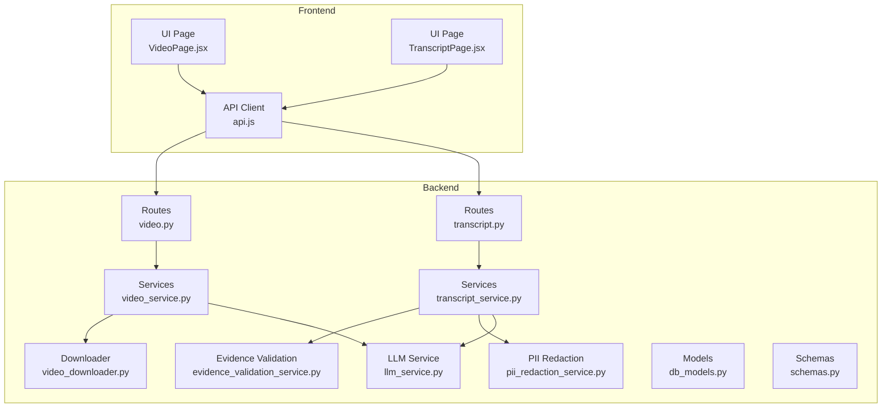
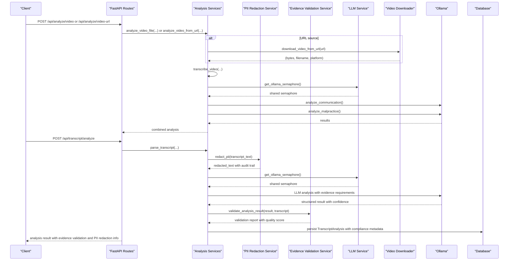
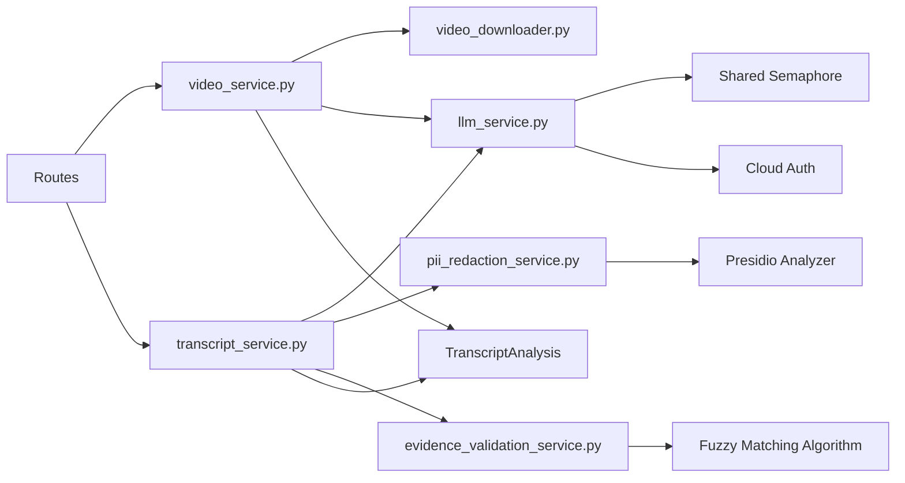

# Video Interview API

<cite>
**Referenced Files in This Document**
- [video.py](file://app/backend/routes/video.py)
- [transcript.py](file://app/backend/routes/transcript.py)
- [video_service.py](file://app/backend/services/video_service.py)
- [transcript_service.py](file://app/backend/services/transcript_service.py)
- [video_downloader.py](file://app/backend/services/video_downloader.py)
- [llm_service.py](file://app/backend/services/llm_service.py)
- [evidence_validation_service.py](file://app/backend/services/evidence_validation_service.py)
- [pii_redaction_service.py](file://app/backend/services/pii_redaction_service.py)
- [db_models.py](file://app/backend/models/db_models.py)
- [schemas.py](file://app/backend/models/schemas.py)
- [api.js](file://app/frontend/src/lib/api.js)
- [VideoPage.jsx](file://app/frontend/src/pages/VideoPage.jsx)
- [TranscriptPage.jsx](file://app/frontend/src/pages/TranscriptPage.jsx)
- [test_video_routes.py](file://app/backend/tests/test_video_routes.py)
- [test_transcript_api.py](file://app/backend/tests/test_transcript_api.py)
</cite>

## Update Summary
**Changes Made**
- Enhanced with new evidence validation service and confidence scoring system
- Added enterprise-grade compliance features including PII redaction and audit trail capabilities
- Integrated PII redaction service with automatic anonymization and audit trail
- Added evidence validation service with hallucination detection and quality scoring
- Enhanced transcript analysis with confidence scores and recommendation rationale
- Added comprehensive validation metrics and bias mitigation documentation

## Table of Contents
1. [Introduction](#introduction)
2. [Project Structure](#project-structure)
3. [Core Components](#core-components)
4. [Architecture Overview](#architecture-overview)
5. [Detailed Component Analysis](#detailed-component-analysis)
6. [Enterprise Compliance Features](#enterprise-compliance-features)
7. [Dependency Analysis](#dependency-analysis)
8. [Performance Considerations](#performance-considerations)
9. [Troubleshooting Guide](#troubleshooting-guide)
10. [Conclusion](#conclusion)
11. [Appendices](#appendices)

## Introduction
This document provides comprehensive API documentation for video interview processing endpoints. It covers:
- Uploading video files from local sources
- Analyzing videos from public URLs (YouTube, Zoom, Microsoft Teams, Google Drive, Loom, Dropbox)
- Automatic transcription and analysis with enterprise-grade compliance
- Manual transcript generation and analysis with evidence validation
- Retrieving processing status and results with confidence scoring
- Request/response schemas for video metadata, transcription quality metrics, and interview analysis data
- File format support, processing behavior, and error handling
- **Enhanced**: Evidence validation service with hallucination detection and confidence scoring
- **Enhanced**: PII redaction service with automatic anonymization and audit trail capabilities
- **Enhanced**: Enterprise compliance features for legal defensibility and bias mitigation

## Project Structure
The video and transcript analysis functionality is implemented in the backend FastAPI application with dedicated routes and services. The frontend provides client-side helpers for invoking these endpoints. Enterprise compliance features are integrated throughout the analysis pipeline.

**Diagram sources**
- [video.py:1-73](file://app/backend/routes/video.py#L1-L73)
- [transcript.py:1-220](file://app/backend/routes/transcript.py#L1-L220)
- [video_service.py:1-426](file://app/backend/services/video_service.py#L1-L426)
- [transcript_service.py:1-374](file://app/backend/services/transcript_service.py#L1-L374)
- [evidence_validation_service.py:1-411](file://app/backend/services/evidence_validation_service.py#L1-L411)
- [pii_redaction_service.py:1-234](file://app/backend/services/pii_redaction_service.py#L1-L234)
- [llm_service.py:1-314](file://app/backend/services/llm_service.py#L1-L314)
- [video_downloader.py:1-263](file://app/backend/services/video_downloader.py#L1-L263)
- [db_models.py:194-210](file://app/backend/models/db_models.py#L194-L210)
- [schemas.py:294-340](file://app/backend/models/schemas.py#L294-L340)
- [api.js:297-351](file://app/frontend/src/lib/api.js#L297-L351)
- [VideoPage.jsx:506-624](file://app/frontend/src/pages/VideoPage.jsx#L506-L624)
- [TranscriptPage.jsx:1-200](file://app/frontend/src/pages/TranscriptPage.jsx#L1-L200)

**Section sources**
- [video.py:1-73](file://app/backend/routes/video.py#L1-L73)
- [transcript.py:1-220](file://app/backend/routes/transcript.py#L1-L220)
- [video_service.py:1-426](file://app/backend/services/video_service.py#L1-L426)
- [transcript_service.py:1-374](file://app/backend/services/transcript_service.py#L1-L374)
- [evidence_validation_service.py:1-411](file://app/backend/services/evidence_validation_service.py#L1-L411)
- [pii_redaction_service.py:1-234](file://app/backend/services/pii_redaction_service.py#L1-L234)
- [llm_service.py:1-314](file://app/backend/services/llm_service.py#L1-L314)
- [video_downloader.py:1-263](file://app/backend/services/video_downloader.py#L1-L263)
- [db_models.py:194-210](file://app/backend/models/db_models.py#L194-L210)
- [schemas.py:294-340](file://app/backend/models/schemas.py#L294-L340)
- [api.js:297-351](file://app/frontend/src/lib/api.js#L297-L351)
- [VideoPage.jsx:506-624](file://app/frontend/src/pages/VideoPage.jsx#L506-L624)
- [TranscriptPage.jsx:1-200](file://app/frontend/src/pages/TranscriptPage.jsx#L1-L200)

## Core Components
- Video analysis routes:
  - POST /api/analyze/video: Upload a local video file for analysis
  - POST /api/analyze/video-url: Analyze a public URL (supports Zoom, Teams, Drive, Loom, Dropbox, YouTube)
- Transcript analysis routes:
  - POST /api/transcript/analyze: Analyze a transcript file or text against a job description with enterprise compliance
  - GET /api/transcript/analyses: List transcript analyses for the tenant
  - GET /api/transcript/analyses/{id}: Retrieve a specific transcript analysis

Key behaviors:
- Video processing includes automatic transcription, communication quality scoring, and malpractice detection.
- Transcript processing includes fit scoring, technical depth, communication quality, JD alignment, strengths, areas for improvement, and recommendation with evidence validation.
- **Enhanced**: Automatic PII redaction with anonymization and audit trail for legal compliance.
- **Enhanced**: Evidence validation service with hallucination detection and confidence scoring.
- **Enhanced**: Comprehensive bias mitigation with confidence levels and recommendation rationale.
- **Enhanced**: Enterprise-grade compliance with full audit trails and legal defensibility.

**Section sources**
- [video.py:19-73](file://app/backend/routes/video.py#L19-L73)
- [transcript.py:28-220](file://app/backend/routes/transcript.py#L28-L220)
- [transcript_service.py:62-374](file://app/backend/services/transcript_service.py#L62-L374)
- [evidence_validation_service.py:37-221](file://app/backend/services/evidence_validation_service.py#L37-L221)
- [pii_redaction_service.py:26-130](file://app/backend/services/pii_redaction_service.py#L26-L130)
- [llm_service.py:35-46](file://app/backend/services/llm_service.py#L35-L46)

## Architecture Overview
The system orchestrates multiple steps for video and transcript analysis with enhanced enterprise compliance:
- Video upload or URL ingestion
- Transcription using faster-whisper
- Parallel communication and malpractice analysis via Ollama
- Transcript parsing and analysis with enterprise compliance features
- **Enhanced**: PII redaction service with automatic anonymization and audit trail
- **Enhanced**: Evidence validation service with hallucination detection and quality scoring
- **Enhanced**: Confidence scoring system with recommendation rationale
- Persistence of results in the database with full compliance metadata

**Diagram sources**
- [video.py:21-73](file://app/backend/routes/video.py#L21-L73)
- [transcript.py:42-132](file://app/backend/routes/transcript.py#L42-L132)
- [transcript_service.py:340-374](file://app/backend/services/transcript_service.py#L340-L374)
- [pii_redaction_service.py:53-130](file://app/backend/services/pii_redaction_service.py#L53-L130)
- [evidence_validation_service.py:56-221](file://app/backend/services/evidence_validation_service.py#L56-L221)
- [llm_service.py:41-46](file://app/backend/services/llm_service.py#L41-L46)
- [video_downloader.py:125-175](file://app/backend/services/video_downloader.py#L125-L175)
- [db_models.py:196-209](file://app/backend/models/db_models.py#L196-L209)

## Detailed Component Analysis

### Video Upload Endpoint
- Endpoint: POST /api/analyze/video
- Purpose: Upload a local video file for analysis
- Supported file types: mp4, webm, avi, mov, mkv, m4v
- Size limit: 200 MB
- Request form fields:
  - video: UploadFile (required)
  - candidate_id: int (optional)
- Response fields (combined with request payload):
  - candidate_id: int (echoed)
  - filename: string (uploaded file name)
  - source: string (original filename or platform label)
  - transcript: string
  - language: string
  - duration_s: number
  - segments: array of segment objects
  - communication_score: integer
  - confidence_level: string
  - clarity_score: integer
  - articulation_score: integer
  - key_phrases: array of strings
  - strengths: array of strings
  - red_flags: array of strings
  - summary: string
  - words_per_minute: integer
  - malpractice: object containing:
    - malpractice_score: integer
    - malpractice_risk: string
    - reliability_rating: string
    - flags: array of flag objects
    - positive_signals: array of strings
    - overall_assessment: string
    - follow_up_questions: array of strings
    - pause_count: integer
    - pauses: array of pause objects

Processing flow:
- Validates file extension and size
- Reads file bytes
- Calls analyze_video_file with bytes and filename
- Returns combined result

Error handling:
- 400 for invalid extension or oversized file
- 422 for analysis failures

**Section sources**
- [video.py:24-46](file://app/backend/routes/video.py#L24-L46)
- [video_service.py:388-401](file://app/backend/services/video_service.py#L388-L401)
- [test_video_routes.py:43-127](file://app/backend/tests/test_video_routes.py#L43-L127)

### Video URL Endpoint
- Endpoint: POST /api/analyze/video-url
- Purpose: Analyze a public URL for supported platforms
- Supported platforms: Zoom, Microsoft Teams, Google Drive, Loom, Dropbox, YouTube
- Request body:
  - url: string (required, must start with http:// or https://)
  - candidate_id: int (optional)
- Response fields:
  - Same as video upload plus:
    - source_url: string (original URL)
    - platform: string (resolved platform)
    - filename: string (derived filename)

Processing flow:
- Validates URL scheme
- Calls analyze_video_from_url
- Downloads video from URL (if needed) and runs full analysis
- Returns combined result

Error handling:
- 400 for invalid URL scheme
- 422 for download or analysis failures

**Section sources**
- [video.py:56-73](file://app/backend/routes/video.py#L56-L73)
- [video_service.py:404-426](file://app/backend/services/video_service.py#L404-L426)
- [video_downloader.py:125-175](file://app/backend/services/video_downloader.py#L125-L175)
- [test_video_routes.py:131-220](file://app/backend/tests/test_video_routes.py#L131-L220)

### Transcript Analysis Endpoint
- Endpoint: POST /api/transcript/analyze
- Purpose: Analyze a transcript against a job description with enterprise compliance
- Supported transcript formats: txt, vtt, srt
- Size limit: 5 MB
- Request form fields:
  - transcript_file: UploadFile (optional)
  - transcript_text: string (optional)
  - candidate_id: int (optional)
  - role_template_id: int (required)
  - source_platform: string (optional)
- Response fields:
  - id: int (persisted record id)
  - candidate_id: int (optional)
  - candidate_name: string (optional)
  - role_template_id: int
  - role_template_name: string (echoed)
  - source_platform: string (optional)
  - analysis_result: object containing:
    - fit_score: integer (0–100)
    - technical_depth: integer (0–100)
    - communication_quality: integer (0–100)
    - jd_alignment: array of objects with:
      - requirement: string
      - demonstrated: boolean
      - evidence: string or null
      - confidence: string (high|medium|low)
    - strengths: array of objects with:
      - strength: string
      - evidence: string
    - areas_for_improvement: array of objects with:
      - area: string
      - reason: string
      - evidence: string or null
    - red_flags: array of objects with:
      - flag: string
      - evidence: string
      - severity: string (high|medium|low)
    - evidence_validation: object containing:
      - total_claims: integer
      - verified_claims: integer
      - hallucinated_claims: integer
      - fuzzy_matches: integer
      - unsupported_claims: array of up to 3 unsupported claims
    - evidence_quality_score: float (0-100)
    - pii_redacted: boolean
    - pii_redaction_count: integer
    - bias_note: string
    - recommendation: string (proceed | hold | reject)
    - recommendation_rationale: string
  - created_at: datetime

Processing flow:
- Validates transcript input (file or text)
- Loads role template by id (tenant-scoped)
- Loads candidate by id (tenant-scoped)
- Parses transcript (auto-detect format)
- **Enhanced**: Automatically applies PII redaction service for anonymization
- Calls analyze_transcript with cleaned text and job description
- **Enhanced**: Integrates evidence validation service for hallucination detection
- **Enhanced**: Adds confidence scoring and recommendation rationale
- Persists TranscriptAnalysis record with compliance metadata
- Returns created record with normalized analysis and enterprise features

Error handling:
- 400 for missing transcript input, invalid file extension, oversized file, missing role template
- 404 for nonexistent role template or candidate
- Graceful fallback to default analysis if LLM unavailable

**Section sources**
- [transcript.py:42-132](file://app/backend/routes/transcript.py#L42-L132)
- [transcript_service.py:62-374](file://app/backend/services/transcript_service.py#L62-L374)
- [pii_redaction_service.py:53-130](file://app/backend/services/pii_redaction_service.py#L53-L130)
- [evidence_validation_service.py:56-221](file://app/backend/services/evidence_validation_service.py#L56-L221)
- [db_models.py:196-209](file://app/backend/models/db_models.py#L196-L209)
- [test_transcript_api.py:131-313](file://app/backend/tests/test_transcript_api.py#L131-L313)

### Transcript Listing and Retrieval
- GET /api/transcript/analyses: Lists all transcript analyses for the tenant, ordered newest first
- GET /api/transcript/analyses/{id}: Retrieves a specific transcript analysis by id

Response fields:
- List endpoint:
  - analyses: array of items with:
    - id: int
    - candidate_id: int (optional)
    - candidate_name: string (optional)
    - role_template_id: int
    - role_template_name: string (optional)
    - source_platform: string (optional)
    - fit_score: integer (optional)
    - recommendation: string (optional)
    - created_at: datetime
  - total: integer
- Single item endpoint:
  - Same as POST response with full analysis_result including enterprise compliance features

**Section sources**
- [transcript.py:135-220](file://app/backend/routes/transcript.py#L135-L220)
- [test_transcript_api.py:357-583](file://app/backend/tests/test_transcript_api.py#L357-L583)

### Data Models and Schemas
- TranscriptAnalysis persistence model:
  - Fields: id, tenant_id, candidate_id, role_template_id, transcript_text, source_platform, analysis_result, created_at
- Transcript analysis result schema:
  - Fit score, technical depth, communication quality, JD alignment with confidence, strengths with evidence, areas_for_improvement with evidence, red_flags with severity, bias_note, recommendation, recommendation_rationale
- **Enhanced**: Evidence validation metrics (total_claims, verified_claims, hallucinated_claims, fuzzy_matches, unsupported_claims)
- **Enhanced**: PII redaction metadata (pii_redacted, pii_redaction_count, bias_note)
- **Enhanced**: Enterprise compliance features (evidence_quality_score, confidence levels)
- Frontend API helpers:
  - analyzeVideo, analyzeVideoFromUrl, analyzeTranscript, getTranscriptAnalyses, getTranscriptAnalysis

**Section sources**
- [db_models.py:196-209](file://app/backend/models/db_models.py#L196-L209)
- [schemas.py:294-340](file://app/backend/models/schemas.py#L294-L340)
- [api.js:297-351](file://app/frontend/src/lib/api.js#L297-L351)

## Enterprise Compliance Features

### PII Redaction Service
The system includes comprehensive PII redaction capabilities for enterprise compliance:

**Features:**
- **Presidio-based detection** (enterprise-grade): PERSON, EMAIL_ADDRESS, PHONE_NUMBER, LOCATION, ORG, URL, US_SSN, CREDIT_CARD
- **Regex fallback**: Automatic fallback when Presidio is unavailable
- **Audit trail**: Complete redaction map with original values and confidence scores
- **Confidence scoring**: Per-entity type confidence ratings (Presidio only)
- **Validation metrics**: Preservation ratio and quality assessment

**Processing flow:**
1. Analyzes text for PII entities using Presidio when available
2. Builds redaction map with original values and confidence scores
3. Anonymizes with context-preserving placeholders
4. Calculates average confidence per entity type
5. Returns RedactionResult with redacted text and audit trail

**Metrics:**
- Redaction Count: Number of entities redacted
- Entity Types: PERSON, EMAIL, PHONE, LOCATION, ORG, URL, SSN, CARD
- Confidence Scores: Per entity type (Presidio only)
- Preservation Ratio: Content preserved after redaction

**Section sources**
- [pii_redaction_service.py:26-233](file://app/backend/services/pii_redaction_service.py#L26-L233)

### Evidence Validation Service
The system validates all LLM claims against transcript evidence to prevent hallucinations:

**Features:**
- Validates all LLM claims against transcript evidence
- Multiple matching strategies: exact, fuzzy (75% threshold), keyword
- Hallucination detection with confidence scoring
- Evidence quality scoring (0-100)
- Detailed validation reports with unsupported claims
- Handles both old and new evidence formats

**Validation Process:**
1. Validates JD alignment evidence with exact and fuzzy matching
2. Checks strengths, red flags, and areas for improvement claims
3. Calculates evidence quality score: (verified_claims / total_claims) × 100
4. Generates validation report with detailed metrics

**Quality Rating Scale:**
- 90-100: Excellent
- 75-89: Good
- 60-74: Fair
- <60: Poor

**Section sources**
- [evidence_validation_service.py:37-411](file://app/backend/services/evidence_validation_service.py#L37-L411)

### Confidence Scoring System
The system implements comprehensive confidence scoring for all assessments:

**Confidence Levels:**
- High: Strong evidence and clear demonstration
- Medium: Some evidence but less definitive
- Low: Limited or weak evidence

**Scoring Areas:**
- JD Alignment: Evidence-based requirement demonstration
- Strengths: Direct transcript evidence support
- Areas for Improvement: Gap identification with supporting evidence
- Red Flags: Concerning statements with contextual evidence
- Technical Depth: Skill demonstration with specific examples

**Recommendation Rationale:**
- Each recommendation includes 2-3 sentence explanation
- Cites specific evidence from the transcript
- Provides clear justification for hiring decisions

**Section sources**
- [transcript_service.py:179-200](file://app/backend/services/transcript_service.py#L179-L200)
- [evidence_validation_service.py:373-398](file://app/backend/services/evidence_validation_service.py#L373-L398)

## Dependency Analysis
- Routes depend on services for processing logic
- Services depend on external libraries:
  - faster-whisper for transcription
  - httpx for asynchronous HTTP requests
  - Ollama for LLM-based analysis
- **Enhanced** Enterprise compliance services:
  - PII redaction service with Presidio integration
  - Evidence validation service with multiple matching strategies
  - Confidence scoring system for all assessments
- Downloader resolves platform-specific URLs and enforces size/timeouts
- Database stores transcript analyses and enforces tenant isolation
- **Enhanced** Compliance metadata tracking for legal defensibility

**Diagram sources**
- [video.py:11](file://app/backend/routes/video.py#L11)
- [transcript.py:20](file://app/backend/routes/transcript.py#L20)
- [video_service.py:16](file://app/backend/services/video_service.py#L16)
- [transcript_service.py:15](file://app/backend/services/transcript_service.py#L15)
- [pii_redaction_service.py:34-51](file://app/backend/services/pii_redaction_service.py#L34-L51)
- [evidence_validation_service.py:47](file://app/backend/services/evidence_validation_service.py#L47)
- [llm_service.py:35-46](file://app/backend/services/llm_service.py#L35-L46)
- [video_downloader.py:13](file://app/backend/services/video_downloader.py#L13)
- [db_models.py:196-209](file://app/backend/models/db_models.py#L196-L209)

**Section sources**
- [video.py:11](file://app/backend/routes/video.py#L11)
- [transcript.py:20](file://app/backend/routes/transcript.py#L20)
- [video_service.py:16](file://app/backend/services/video_service.py#L16)
- [transcript_service.py:15](file://app/backend/services/transcript_service.py#L15)
- [pii_redaction_service.py:34-51](file://app/backend/services/pii_redaction_service.py#L34-L51)
- [evidence_validation_service.py:47](file://app/backend/services/evidence_validation_service.py#L47)
- [llm_service.py:35-46](file://app/backend/services/llm_service.py#L35-L46)
- [video_downloader.py:13](file://app/backend/services/video_downloader.py#L13)
- [db_models.py:196-209](file://app/backend/models/db_models.py#L196-L209)

## Performance Considerations
- Video processing:
  - Transcription uses faster-whisper with CPU and quantization settings
  - Communication and malpractice analysis run in parallel to reduce latency
  - Cloud-aware token optimization reduces unnecessary token usage on local deployments
  - Shared semaphore prevents resource contention across concurrent requests
  - Large files are streamed and validated for size limits
- Transcript processing:
  - Parsing strips timestamps and speaker labels for VTT/SRT
  - LLM calls are configured with timeouts and JSON format
  - **Enhanced** Automatic PII redaction with minimal performance impact
  - **Enhanced** Evidence validation adds processing overhead but ensures accuracy
  - **Enhanced** Confidence scoring system provides immediate feedback
- Frontend:
  - Upload and URL analysis include explicit timeouts
  - Streaming resume analysis is available for other endpoints
  - **Enhanced** Real-time compliance indicators and validation metrics

**Section sources**
- [video_service.py:359-385](file://app/backend/services/video_service.py#L359-L385)
- [transcript_service.py:196-240](file://app/backend/services/transcript_service.py#L196-L240)
- [pii_redaction_service.py:198-221](file://app/backend/services/pii_redaction_service.py#L198-L221)
- [evidence_validation_service.py:208-221](file://app/backend/services/evidence_validation_service.py#L208-L221)
- [llm_service.py:41-46](file://app/backend/services/llm_service.py#L41-L46)

## Troubleshooting Guide
Common issues and resolutions:
- Video upload errors:
  - Unsupported file type: Ensure extension is one of mp4, webm, avi, mov, mkv, m4v
  - File too large: Reduce to under 200 MB
  - Analysis failure: Check Whisper availability and Ollama connectivity
- URL analysis errors:
  - Invalid URL scheme: Must start with http:// or https://
  - Access denied or authentication required: Ensure the recording is publicly accessible
  - Download timeout: Try uploading the file directly
- Transcript analysis errors:
  - Missing transcript input: Provide either transcript_file or transcript_text
  - Invalid file extension: Use txt, vtt, or srt
  - Oversized file: Keep under 5 MB
  - Missing role template: Provide a valid role_template_id for the tenant
  - LLM unavailable: The system returns a fallback analysis with neutral scores
- **Enhanced** Enterprise compliance issues:
  - PII redaction failures: Check Presidio installation or use regex fallback
  - Evidence validation errors: Review transcript quality and LLM response format
  - Confidence scoring inconsistencies: Verify evidence citations are present
  - Compliance audit trail issues: Ensure all enterprise features are enabled
- **Enhanced** Cloud deployment issues:
  - Ollama Cloud connection failures: Verify OLLAMA_API_KEY environment variable is set
  - Token limit errors: Cloud deployments automatically use higher token limits (800-1200 tokens)
  - Resource contention: Shared semaphore prevents concurrent LLM requests beyond capacity

**Section sources**
- [video.py:30-46](file://app/backend/routes/video.py#L30-L46)
- [video.py:61-73](file://app/backend/routes/video.py#L61-L73)
- [transcript.py:56-74](file://app/backend/routes/transcript.py#L56-L74)
- [transcript.py:77-93](file://app/backend/routes/transcript.py#L77-L93)
- [pii_redaction_service.py:48-51](file://app/backend/services/pii_redaction_service.py#L48-L51)
- [evidence_validation_service.py:354-356](file://app/backend/services/evidence_validation_service.py#L354-L356)
- [test_video_routes.py:51-67](file://app/backend/tests/test_video_routes.py#L51-L67)
- [test_transcript_api.py:240-296](file://app/backend/tests/test_transcript_api.py#L240-L296)

## Conclusion
The Video Interview API provides robust endpoints for analyzing video interviews and transcripts with comprehensive enterprise compliance features. It supports multiple input sources, automatic transcription, and intelligent analysis powered by LLMs. The system enforces strict validation, handles errors gracefully, and persists results for later retrieval. **Enhanced** enterprise-grade features include PII redaction with audit trails, evidence validation with hallucination detection, confidence scoring system, and comprehensive bias mitigation. These features ensure legal defensibility, compliance with regulations, and reliable decision-making processes.

## Appendices

### API Definitions

- POST /api/analyze/video
  - Form fields:
    - video: UploadFile (required)
    - candidate_id: int (optional)
  - Response: Combined analysis result with enterprise compliance features

- POST /api/analyze/video-url
  - JSON body:
    - url: string (required)
    - candidate_id: int (optional)
  - Response: Combined analysis result with platform and filename

- POST /api/transcript/analyze
  - Form fields:
    - transcript_file: UploadFile (optional)
    - transcript_text: string (optional)
    - candidate_id: int (optional)
    - role_template_id: int (required)
    - source_platform: string (optional)
  - Response: Transcript analysis record with id, enterprise compliance metadata, and evidence validation

- GET /api/transcript/analyses
  - Response: List of transcript analyses with fit_score, recommendation, and compliance metrics

- GET /api/transcript/analyses/{id}
  - Response: Full transcript analysis record with enterprise features

**Section sources**
- [video.py:24-73](file://app/backend/routes/video.py#L24-L73)
- [transcript.py:42-220](file://app/backend/routes/transcript.py#L42-L220)

### Request/Response Schemas

- Video Analysis Result
  - Fields: source, filename, transcript, language, duration_s, segments, communication_score, confidence_level, clarity_score, articulation_score, key_phrases, strengths, red_flags, summary, words_per_minute, malpractice

- Transcript Analysis Result
  - Fields: fit_score, technical_depth, communication_quality, jd_alignment with confidence, strengths with evidence, areas_for_improvement with evidence, red_flags with severity, bias_note, recommendation, recommendation_rationale

- Transcript Analysis Record
  - Fields: id, candidate_id, candidate_name, role_template_id, role_template_name, source_platform, analysis_result with enterprise compliance, created_at

- **Enhanced** Enterprise Compliance Metadata
  - PII Redaction: pii_redacted, pii_redaction_count, bias_note
  - Evidence Validation: evidence_validation, evidence_quality_score
  - Confidence Scoring: confidence levels for all assessments

**Section sources**
- [video_service.py:25-426](file://app/backend/services/video_service.py#L25-L426)
- [transcript_service.py:196-374](file://app/backend/services/transcript_service.py#L196-L374)
- [schemas.py:302-321](file://app/backend/models/schemas.py#L302-L321)

### File Format Support
- Video uploads: mp4, webm, avi, mov, mkv, m4v
- Transcript files: txt, vtt, srt
- Size limits: 200 MB for videos, 5 MB for transcripts

**Section sources**
- [video.py:18](file://app/backend/routes/video.py#L18)
- [transcript.py:29](file://app/backend/routes/transcript.py#L29)

### Processing Queues and Asynchronous Behavior
- Video processing runs transcription and analysis in parallel
- **Enhanced** Shared semaphore controls concurrent LLM requests across all services
- **Enhanced** Enterprise compliance services run asynchronously with validation metrics
- URL downloads enforce timeouts and size limits
- Transcript processing is synchronous but lightweight with enhanced validation

**Section sources**
- [video_service.py:372-375](file://app/backend/services/video_service.py#L372-L375)
- [transcript_service.py:340-374](file://app/backend/services/transcript_service.py#L340-L374)
- [llm_service.py:41-46](file://app/backend/services/llm_service.py#L41-L46)
- [video_downloader.py:13](file://app/backend/services/video_downloader.py#L13)

### Enterprise Configuration Parameters

**Enhanced** Environment variables for enterprise compliance:

- ENABLE_PII_REDACTION: true (default: enables automatic PII redaction)
- ENABLE_EVIDENCE_VALIDATION: true (default: enables evidence validation)
- EVIDENCE_FUZZY_THRESHOLD: 0.75 (similarity threshold for fuzzy matching)
- PRESIDIO_ANALYZER: installed (enterprise-grade PII detection)
- REGEX_FALLBACK: enabled (when Presidio unavailable)

**Section sources**
- [pii_redaction_service.py:34-51](file://app/backend/services/pii_redaction_service.py#L34-L51)
- [evidence_validation_service.py:47](file://app/backend/services/evidence_validation_service.py#L47)
- [transcript_service.py:21](file://app/backend/services/transcript_service.py#L21)

### Example Workflows

- Video from URL:
  - Client calls POST /api/analyze/video-url with url and optional candidate_id
  - Backend resolves platform, downloads video, transcribes, and returns analysis
  - Frontend displays results and allows follow-up actions

- Manual transcript analysis:
  - Client calls POST /api/transcript/analyze with transcript_file or transcript_text and role_template_id
  - Backend parses transcript, applies PII redaction, calls LLM with evidence requirements, validates claims, persists result, and returns id
  - Client lists or retrieves analyses by id with enterprise compliance metadata

- **Enhanced** Enterprise compliance workflow:
  - System automatically detects PII entities and applies redaction with audit trail
  - Evidence validation service verifies all LLM claims against transcript
  - Confidence scoring system provides assessment reliability metrics
  - Bias mitigation documentation included in analysis results
  - Full compliance metadata stored for legal defensibility

**Section sources**
- [api.js:310-351](file://app/frontend/src/lib/api.js#L310-L351)
- [VideoPage.jsx:587-604](file://app/frontend/src/pages/VideoPage.jsx#L587-L604)
- [TranscriptPage.jsx:142-165](file://app/frontend/src/pages/TranscriptPage.jsx#L142-L165)
- [test_video_routes.py:144-175](file://app/backend/tests/test_video_routes.py#L144-L175)
- [test_transcript_api.py:530-583](file://app/backend/tests/test_transcript_api.py#L530-L583)