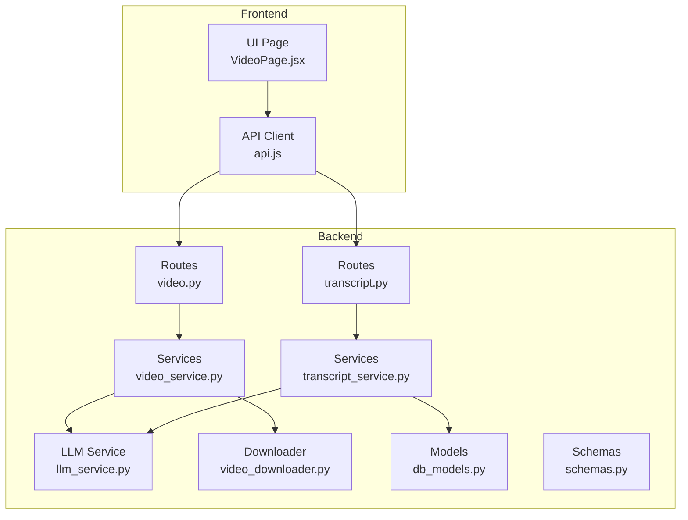
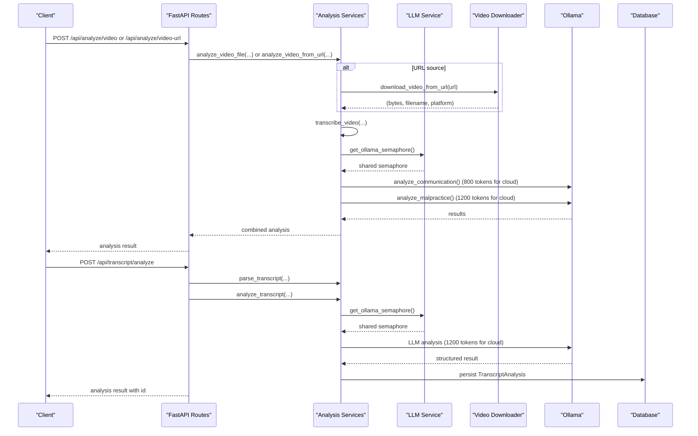
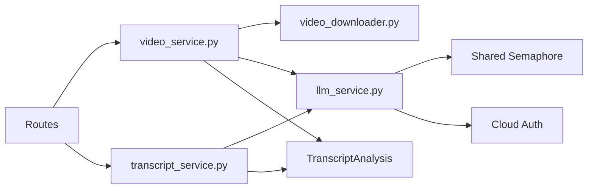

# Video Interview API

<cite>
**Referenced Files in This Document**
- [video.py](file://app/backend/routes/video.py)
- [transcript.py](file://app/backend/routes/transcript.py)
- [video_service.py](file://app/backend/services/video_service.py)
- [transcript_service.py](file://app/backend/services/transcript_service.py)
- [video_downloader.py](file://app/backend/services/video_downloader.py)
- [llm_service.py](file://app/backend/services/llm_service.py)
- [db_models.py](file://app/backend/models/db_models.py)
- [schemas.py](file://app/backend/models/schemas.py)
- [api.js](file://app/frontend/src/lib/api.js)
- [VideoPage.jsx](file://app/frontend/src/pages/VideoPage.jsx)
- [test_video_routes.py](file://app/backend/tests/test_video_routes.py)
- [test_transcript_api.py](file://app/backend/tests/test_transcript_api.py)
</cite>

## Update Summary
**Changes Made**
- Enhanced cloud-aware configurations for communication analysis (800 tokens for cloud vs 350 for local)
- Enhanced cloud-aware configurations for malpractice analysis (1200 tokens for cloud vs 600 for local)
- Integrated shared semaphore control for Ollama requests
- Added comprehensive cloud authentication support for Ollama Cloud deployments
- Updated performance considerations to reflect token optimization strategies

## Table of Contents
1. [Introduction](#introduction)
2. [Project Structure](#project-structure)
3. [Core Components](#core-components)
4. [Architecture Overview](#architecture-overview)
5. [Detailed Component Analysis](#detailed-component-analysis)
6. [Dependency Analysis](#dependency-analysis)
7. [Performance Considerations](#performance-considerations)
8. [Troubleshooting Guide](#troubleshooting-guide)
9. [Conclusion](#conclusion)
10. [Appendices](#appendices)

## Introduction
This document provides comprehensive API documentation for video interview processing endpoints. It covers:
- Uploading video files from local sources
- Analyzing videos from public URLs (YouTube, Zoom, Microsoft Teams, Google Drive, Loom, Dropbox)
- Automatic transcription and analysis
- Manual transcript generation and analysis
- Retrieving processing status and results
- Request/response schemas for video metadata, transcription quality metrics, and interview analysis data
- File format support, processing behavior, and error handling
- **Enhanced**: Cloud-aware configurations for optimized token usage and shared semaphore control for concurrent LLM requests

## Project Structure
The video and transcript analysis functionality is implemented in the backend FastAPI application with dedicated routes and services. The frontend provides client-side helpers for invoking these endpoints.

**Diagram sources**
- [video.py:1-73](file://app/backend/routes/video.py#L1-L73)
- [transcript.py:1-220](file://app/backend/routes/transcript.py#L1-L220)
- [video_service.py:1-426](file://app/backend/services/video_service.py#L1-L426)
- [transcript_service.py:1-240](file://app/backend/services/transcript_service.py#L1-L240)
- [llm_service.py:1-314](file://app/backend/services/llm_service.py#L1-L314)
- [video_downloader.py:1-263](file://app/backend/services/video_downloader.py#L1-L263)
- [db_models.py:194-210](file://app/backend/models/db_models.py#L194-L210)
- [schemas.py:294-340](file://app/backend/models/schemas.py#L294-L340)
- [api.js:297-351](file://app/frontend/src/lib/api.js#L297-L351)
- [VideoPage.jsx:506-624](file://app/frontend/src/pages/VideoPage.jsx#L506-L624)

**Section sources**
- [video.py:1-73](file://app/backend/routes/video.py#L1-L73)
- [transcript.py:1-220](file://app/backend/routes/transcript.py#L1-L220)
- [video_service.py:1-426](file://app/backend/services/video_service.py#L1-L426)
- [transcript_service.py:1-240](file://app/backend/services/transcript_service.py#L1-L240)
- [llm_service.py:1-314](file://app/backend/services/llm_service.py#L1-L314)
- [video_downloader.py:1-263](file://app/backend/services/video_downloader.py#L1-L263)
- [db_models.py:194-210](file://app/backend/models/db_models.py#L194-L210)
- [schemas.py:294-340](file://app/backend/models/schemas.py#L294-L340)
- [api.js:297-351](file://app/frontend/src/lib/api.js#L297-L351)
- [VideoPage.jsx:506-624](file://app/frontend/src/pages/VideoPage.jsx#L506-L624)

## Core Components
- Video analysis routes:
  - POST /api/analyze/video: Upload a local video file for analysis
  - POST /api/analyze/video-url: Analyze a public URL (supports Zoom, Teams, Drive, Loom, Dropbox, YouTube)
- Transcript analysis routes:
  - POST /api/transcript/analyze: Analyze a transcript file or text against a job description
  - GET /api/transcript/analyses: List transcript analyses for the tenant
  - GET /api/transcript/analyses/{id}: Retrieve a specific transcript analysis

Key behaviors:
- Video processing includes automatic transcription, communication quality scoring, and malpractice detection.
- Transcript processing includes fit scoring, technical depth, communication quality, JD alignment, strengths, areas for improvement, and recommendation.
- **Enhanced**: Automatic cloud-aware token optimization for improved analysis quality on Ollama Cloud vs local deployments.
- **Enhanced**: Shared semaphore control prevents LLM contention across all analysis services.

**Section sources**
- [video.py:19-73](file://app/backend/routes/video.py#L19-L73)
- [transcript.py:28-220](file://app/backend/routes/transcript.py#L28-L220)
- [video_service.py:25-426](file://app/backend/services/video_service.py#L25-L426)
- [transcript_service.py:62-240](file://app/backend/services/transcript_service.py#L62-L240)
- [llm_service.py:35-46](file://app/backend/services/llm_service.py#L35-L46)

## Architecture Overview
The system orchestrates multiple steps for video and transcript analysis with enhanced cloud awareness:
- Video upload or URL ingestion
- Transcription using faster-whisper
- Parallel communication and malpractice analysis via Ollama with cloud-aware token optimization
- Transcript parsing and analysis via Ollama with shared semaphore control
- Persistence of results in the database

**Diagram sources**
- [video.py:21-73](file://app/backend/routes/video.py#L21-L73)
- [transcript.py:28-132](file://app/backend/routes/transcript.py#L28-L132)
- [video_service.py:359-426](file://app/backend/services/video_service.py#L359-L426)
- [transcript_service.py:196-240](file://app/backend/services/transcript_service.py#L196-L240)
- [llm_service.py:41-46](file://app/backend/services/llm_service.py#L41-L46)
- [video_downloader.py:125-175](file://app/backend/services/video_downloader.py#L125-L175)
- [db_models.py:196-209](file://app/backend/models/db_models.py#L196-L209)

## Detailed Component Analysis

### Video Upload Endpoint
- Endpoint: POST /api/analyze/video
- Purpose: Upload a local video file for analysis
- Supported file types: mp4, webm, avi, mov, mkv, m4v
- Size limit: 200 MB
- Request form fields:
  - video: UploadFile (required)
  - candidate_id: int (optional)
- Response fields (combined with request payload):
  - candidate_id: int (echoed)
  - filename: string (uploaded file name)
  - source: string (original filename or platform label)
  - transcript: string
  - language: string
  - duration_s: number
  - segments: array of segment objects
  - communication_score: integer
  - confidence_level: string
  - clarity_score: integer
  - articulation_score: integer
  - key_phrases: array of strings
  - strengths: array of strings
  - red_flags: array of strings
  - summary: string
  - words_per_minute: integer
  - malpractice: object containing:
    - malpractice_score: integer
    - malpractice_risk: string
    - reliability_rating: string
    - flags: array of flag objects
    - positive_signals: array of strings
    - overall_assessment: string
    - follow_up_questions: array of strings
    - pause_count: integer
    - pauses: array of pause objects

Processing flow:
- Validates file extension and size
- Reads file bytes
- Calls analyze_video_file with bytes and filename
- Returns combined result

Error handling:
- 400 for invalid extension or oversized file
- 422 for analysis failures

**Section sources**
- [video.py:24-46](file://app/backend/routes/video.py#L24-L46)
- [video_service.py:388-401](file://app/backend/services/video_service.py#L388-L401)
- [test_video_routes.py:43-127](file://app/backend/tests/test_video_routes.py#L43-L127)

### Video URL Endpoint
- Endpoint: POST /api/analyze/video-url
- Purpose: Analyze a public URL for supported platforms
- Supported platforms: Zoom, Microsoft Teams, Google Drive, Loom, Dropbox, YouTube
- Request body:
  - url: string (required, must start with http:// or https://)
  - candidate_id: int (optional)
- Response fields:
  - Same as video upload plus:
    - source_url: string (original URL)
    - platform: string (resolved platform)
    - filename: string (derived filename)

Processing flow:
- Validates URL scheme
- Calls analyze_video_from_url
- Downloads video from URL (if needed) and runs full analysis
- Returns combined result

Error handling:
- 400 for invalid URL scheme
- 422 for download or analysis failures

**Section sources**
- [video.py:56-73](file://app/backend/routes/video.py#L56-L73)
- [video_service.py:404-426](file://app/backend/services/video_service.py#L404-L426)
- [video_downloader.py:125-175](file://app/backend/services/video_downloader.py#L125-L175)
- [test_video_routes.py:131-220](file://app/backend/tests/test_video_routes.py#L131-L220)

### Transcript Analysis Endpoint
- Endpoint: POST /api/transcript/analyze
- Purpose: Analyze a transcript against a job description
- Supported transcript formats: txt, vtt, srt
- Size limit: 5 MB
- Request form fields:
  - transcript_file: UploadFile (optional)
  - transcript_text: string (optional)
  - candidate_id: int (optional)
  - role_template_id: int (required)
  - source_platform: string (optional)
- Response fields:
  - id: int (persisted record id)
  - candidate_id: int (optional)
  - candidate_name: string (optional)
  - role_template_id: int
  - role_template_name: string (echoed)
  - source_platform: string (optional)
  - analysis_result: object containing:
    - fit_score: integer (0–100)
    - technical_depth: integer (0–100)
    - communication_quality: integer (0–100)
    - jd_alignment: array of objects with:
      - requirement: string
      - demonstrated: boolean
      - evidence: string or null
    - strengths: array of strings
    - areas_for_improvement: array of strings
    - bias_note: string
    - recommendation: string (proceed | hold | reject)
  - created_at: datetime

Processing flow:
- Validates transcript input (file or text)
- Loads role template by id (tenant-scoped)
- Loads candidate by id (tenant-scoped)
- Parses transcript (auto-detect format)
- Calls analyze_transcript with cleaned text and job description
- Persists TranscriptAnalysis record
- Returns created record with normalized analysis

Error handling:
- 400 for missing transcript input, invalid file extension, oversized file, missing role template
- 404 for nonexistent role template or candidate
- Graceful fallback to default analysis if LLM unavailable

**Section sources**
- [transcript.py:42-132](file://app/backend/routes/transcript.py#L42-L132)
- [transcript_service.py:62-240](file://app/backend/services/transcript_service.py#L62-L240)
- [db_models.py:196-209](file://app/backend/models/db_models.py#L196-L209)
- [test_transcript_api.py:131-313](file://app/backend/tests/test_transcript_api.py#L131-L313)

### Transcript Listing and Retrieval
- GET /api/transcript/analyses: Lists all transcript analyses for the tenant, ordered newest first
- GET /api/transcript/analyses/{id}: Retrieves a specific transcript analysis by id

Response fields:
- List endpoint:
  - analyses: array of items with:
    - id: int
    - candidate_id: int (optional)
    - candidate_name: string (optional)
    - role_template_id: int
    - role_template_name: string (optional)
    - source_platform: string (optional)
    - fit_score: integer (optional)
    - recommendation: string (optional)
    - created_at: datetime
  - total: integer
- Single item endpoint:
  - Same as POST response with full analysis_result

**Section sources**
- [transcript.py:135-220](file://app/backend/routes/transcript.py#L135-L220)
- [test_transcript_api.py:357-583](file://app/backend/tests/test_transcript_api.py#L357-L583)

### Data Models and Schemas
- TranscriptAnalysis persistence model:
  - Fields: id, tenant_id, candidate_id, role_template_id, transcript_text, source_platform, analysis_result, created_at
- Transcript analysis result schema:
  - Fit score, technical depth, communication quality, JD alignment, strengths, areas_for_improvement, bias_note, recommendation
- Frontend API helpers:
  - analyzeVideo, analyzeVideoFromUrl, analyzeTranscript, getTranscriptAnalyses, getTranscriptAnalysis

**Section sources**
- [db_models.py:196-209](file://app/backend/models/db_models.py#L196-L209)
- [schemas.py:294-340](file://app/backend/models/schemas.py#L294-L340)
- [api.js:297-351](file://app/frontend/src/lib/api.js#L297-L351)

### Cloud-Aware Configurations
**Enhanced** The system now automatically detects Ollama Cloud deployments and optimizes token usage accordingly:

#### Communication Analysis Token Optimization
- **Local Deployment**: Uses 350 tokens for concise analysis
- **Cloud Deployment**: Uses 800 tokens for comprehensive analysis
- Automatic detection via `ollama.com` domain in OLLAMA_BASE_URL

#### Malpractice Analysis Token Optimization  
- **Local Deployment**: Uses 600 tokens for balanced analysis
- **Cloud Deployment**: Uses 1200 tokens for detailed integrity assessment
- Automatic detection via `_is_ollama_cloud_local()` function

#### Shared Semaphore Control
- **Enhanced** All LLM requests (video analysis, transcript analysis, resume analysis) share a single semaphore
- Prevents LLM contention across services
- Ollama with qwen3.5:4b only supports Parallel:1, so requests are serialized
- Global semaphore instance ensures consistent resource management

#### Cloud Authentication Support
- **Enhanced** Automatic API key authentication for Ollama Cloud
- Detects cloud deployment via `is_ollama_cloud()` function
- Uses `OLLAMA_API_KEY` environment variable for authorization
- Logs warnings when cloud is detected but API key is missing

**Section sources**
- [video_service.py:161-163](file://app/backend/services/video_service.py#L161-L163)
- [video_service.py:276-278](file://app/backend/services/video_service.py#L276-L278)
- [transcript_service.py:217-218](file://app/backend/services/transcript_service.py#L217-L218)
- [llm_service.py:15-33](file://app/backend/services/llm_service.py#L15-L33)
- [llm_service.py:41-46](file://app/backend/services/llm_service.py#L41-L46)

## Dependency Analysis
- Routes depend on services for processing logic
- Services depend on external libraries:
  - faster-whisper for transcription
  - httpx for asynchronous HTTP requests
  - Ollama for LLM-based analysis
- **Enhanced** LLM Service provides shared semaphore and cloud detection utilities
- Downloader resolves platform-specific URLs and enforces size/timeouts
- Database stores transcript analyses and enforces tenant isolation

**Diagram sources**
- [video.py:11](file://app/backend/routes/video.py#L11)
- [transcript.py:20](file://app/backend/routes/transcript.py#L20)
- [video_service.py:16](file://app/backend/services/video_service.py#L16)
- [transcript_service.py:15](file://app/backend/services/transcript_service.py#L15)
- [llm_service.py:35-46](file://app/backend/services/llm_service.py#L35-L46)
- [video_downloader.py:13](file://app/backend/services/video_downloader.py#L13)
- [db_models.py:196-209](file://app/backend/models/db_models.py#L196-L209)

**Section sources**
- [video.py:11](file://app/backend/routes/video.py#L11)
- [transcript.py:20](file://app/backend/routes/transcript.py#L20)
- [video_service.py:16](file://app/backend/services/video_service.py#L16)
- [transcript_service.py:15](file://app/backend/services/transcript_service.py#L15)
- [llm_service.py:35-46](file://app/backend/services/llm_service.py#L35-L46)
- [video_downloader.py:13](file://app/backend/services/video_downloader.py#L13)
- [db_models.py:196-209](file://app/backend/models/db_models.py#L196-L209)

## Performance Considerations
- Video processing:
  - Transcription uses faster-whisper with CPU and quantization settings
  - Communication and malpractice analysis run in parallel to reduce latency
  - **Enhanced** Cloud-aware token optimization reduces unnecessary token usage on local deployments
  - **Enhanced** Shared semaphore prevents resource contention across concurrent requests
  - Large files are streamed and validated for size limits
- Transcript processing:
  - Parsing strips timestamps and speaker labels for VTT/SRT
  - LLM calls are configured with timeouts and JSON format
  - **Enhanced** Automatic cloud detection optimizes token allocation based on deployment type
- Frontend:
  - Upload and URL analysis include explicit timeouts
  - Streaming resume analysis is available for other endpoints

**Section sources**
- [video_service.py:359-385](file://app/backend/services/video_service.py#L359-L385)
- [transcript_service.py:196-240](file://app/backend/services/transcript_service.py#L196-L240)
- [llm_service.py:41-46](file://app/backend/services/llm_service.py#L41-L46)

## Troubleshooting Guide
Common issues and resolutions:
- Video upload errors:
  - Unsupported file type: Ensure extension is one of mp4, webm, avi, mov, mkv, m4v
  - File too large: Reduce to under 200 MB
  - Analysis failure: Check Whisper availability and Ollama connectivity
- URL analysis errors:
  - Invalid URL scheme: Must start with http:// or https://
  - Access denied or authentication required: Ensure the recording is publicly accessible
  - Download timeout: Try uploading the file directly
- Transcript analysis errors:
  - Missing transcript input: Provide either transcript_file or transcript_text
  - Invalid file extension: Use txt, vtt, or srt
  - Oversized file: Keep under 5 MB
  - Missing role template: Provide a valid role_template_id for the tenant
  - LLM unavailable: The system returns a fallback analysis with neutral scores
- **Enhanced** Cloud deployment issues:
  - Ollama Cloud connection failures: Verify OLLAMA_API_KEY environment variable is set
  - Token limit errors: Cloud deployments automatically use higher token limits (800-1200 tokens)
  - Resource contention: Shared semaphore prevents concurrent LLM requests beyond capacity

**Section sources**
- [video.py:30-46](file://app/backend/routes/video.py#L30-L46)
- [video.py:61-73](file://app/backend/routes/video.py#L61-L73)
- [transcript.py:56-74](file://app/backend/routes/transcript.py#L56-L74)
- [transcript.py:77-93](file://app/backend/routes/transcript.py#L77-L93)
- [test_video_routes.py:51-67](file://app/backend/tests/test_video_routes.py#L51-L67)
- [test_transcript_api.py:240-296](file://app/backend/tests/test_transcript_api.py#L240-L296)

## Conclusion
The Video Interview API provides robust endpoints for analyzing video interviews and transcripts. It supports multiple input sources, automatic transcription, and intelligent analysis powered by LLMs. The system enforces strict validation, handles errors gracefully, and persists results for later retrieval. **Enhanced** cloud-aware configurations optimize token usage for different deployment scenarios, while shared semaphore control ensures efficient resource utilization across all analysis services.

## Appendices

### API Definitions

- POST /api/analyze/video
  - Form fields:
    - video: UploadFile (required)
    - candidate_id: int (optional)
  - Response: Combined analysis result (see Core Components)

- POST /api/analyze/video-url
  - JSON body:
    - url: string (required)
    - candidate_id: int (optional)
  - Response: Combined analysis result with platform and filename

- POST /api/transcript/analyze
  - Form fields:
    - transcript_file: UploadFile (optional)
    - transcript_text: string (optional)
    - candidate_id: int (optional)
    - role_template_id: int (required)
    - source_platform: string (optional)
  - Response: Transcript analysis record with id and normalized result

- GET /api/transcript/analyses
  - Response: List of transcript analyses with fit_score and recommendation

- GET /api/transcript/analyses/{id}
  - Response: Full transcript analysis record

**Section sources**
- [video.py:24-73](file://app/backend/routes/video.py#L24-L73)
- [transcript.py:42-220](file://app/backend/routes/transcript.py#L42-L220)

### Request/Response Schemas

- Video Analysis Result
  - Fields: source, filename, transcript, language, duration_s, segments, communication_score, confidence_level, clarity_score, articulation_score, key_phrases, strengths, red_flags, summary, words_per_minute, malpractice

- Transcript Analysis Result
  - Fields: fit_score, technical_depth, communication_quality, jd_alignment, strengths, areas_for_improvement, bias_note, recommendation

- Transcript Analysis Record
  - Fields: id, candidate_id, candidate_name, role_template_id, role_template_name, source_platform, analysis_result, created_at

**Section sources**
- [video_service.py:25-426](file://app/backend/services/video_service.py#L25-L426)
- [transcript_service.py:196-240](file://app/backend/services/transcript_service.py#L196-L240)
- [schemas.py:302-321](file://app/backend/models/schemas.py#L302-L321)

### File Format Support
- Video uploads: mp4, webm, avi, mov, mkv, m4v
- Transcript files: txt, vtt, srt
- Size limits: 200 MB for videos, 5 MB for transcripts

**Section sources**
- [video.py:18](file://app/backend/routes/video.py#L18)
- [transcript.py:29](file://app/backend/routes/transcript.py#L29)

### Processing Queues and Asynchronous Behavior
- Video processing runs transcription and analysis in parallel
- **Enhanced** Shared semaphore controls concurrent LLM requests across all services
- URL downloads enforce timeouts and size limits
- Transcript processing is synchronous but lightweight

**Section sources**
- [video_service.py:372-375](file://app/backend/services/video_service.py#L372-L375)
- [llm_service.py:41-46](file://app/backend/services/llm_service.py#L41-L46)
- [video_downloader.py:13](file://app/backend/services/video_downloader.py#L13)

### Cloud Configuration Parameters

**Enhanced** Environment variables for cloud deployment:

- OLLAMA_BASE_URL: Base URL for Ollama service (default: http://localhost:11434)
- OLLAMA_API_KEY: API key for Ollama Cloud authentication (required for cloud)
- OLLAMA_MODEL: Model name for analysis (default: qwen3.5:4b)
- LLM_NARRATIVE_TIMEOUT: Timeout for narrative analysis (default: 150 seconds)

**Section sources**
- [llm_service.py:20-33](file://app/backend/services/llm_service.py#L20-L33)
- [video_service.py:21](file://app/backend/services/video_service.py#L21)
- [transcript_service.py:20-21](file://app/backend/services/transcript_service.py#L20-L21)

### Example Workflows

- Video from URL:
  - Client calls POST /api/analyze/video-url with url and optional candidate_id
  - Backend resolves platform, downloads video, transcribes, and returns analysis
  - Frontend displays results and allows follow-up actions

- Manual transcript analysis:
  - Client calls POST /api/transcript/analyze with transcript_file or transcript_text and role_template_id
  - Backend parses transcript, calls LLM with cloud-aware token optimization, persists result, and returns id
  - Client lists or retrieves analyses by id

- **Enhanced** Cloud deployment workflow:
  - System automatically detects Ollama Cloud via ollama.com domain
  - Uses increased token limits (800-1200 tokens) for comprehensive analysis
  - Applies shared semaphore for concurrent request management
  - Authenticates with OLLAMA_API_KEY if provided

**Section sources**
- [api.js:310-351](file://app/frontend/src/lib/api.js#L310-L351)
- [VideoPage.jsx:587-604](file://app/frontend/src/pages/VideoPage.jsx#L587-L604)
- [test_video_routes.py:144-175](file://app/backend/tests/test_video_routes.py#L144-L175)
- [test_transcript_api.py:530-583](file://app/backend/tests/test_transcript_api.py#L530-L583)