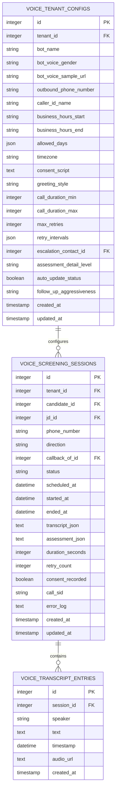
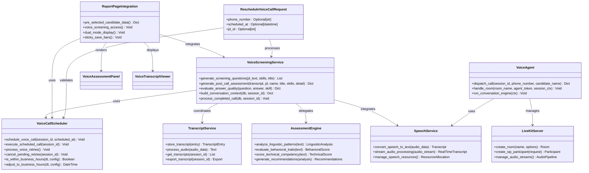
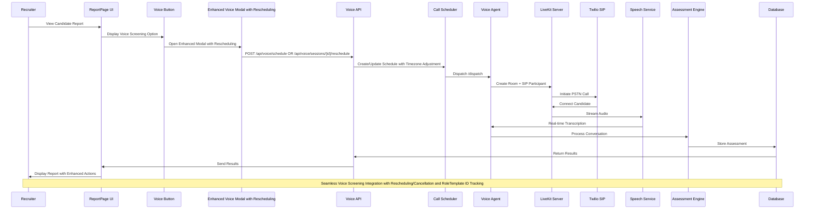
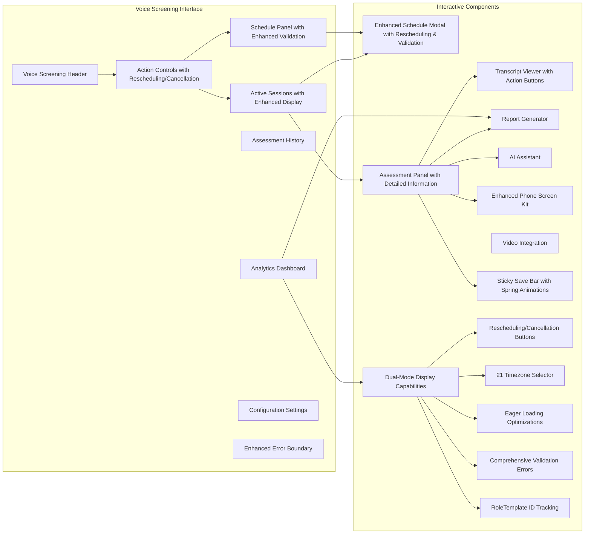
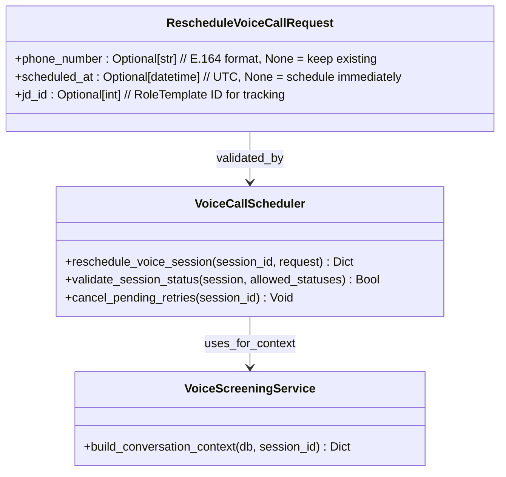

# Voice Screening System

<cite>
**Referenced Files in This Document**
- [044_voice_screening.py](file://alembic/versions/044_voice_screening.py)
- [voice.py](file://app/backend/routes/voice.py)
- [voice_screening_service.py](file://app/backend/services/voice_screening_service.py)
- [voice_call_scheduler.py](file://app/backend/services/voice_call_scheduler.py)
- [transcript_service.py](file://app/backend/services/transcript_service.py)
- [agent_pipeline.py](file://app/backend/services/agent_pipeline.py)
- [test_voice_screening.py](file://app/backend/tests/test_voice_screening.py)
- [VoiceScreeningPage.jsx](file://app/frontend/src/pages/VoiceScreeningPage.jsx)
- [VoiceAssessmentPanel.jsx](file://app/frontend/src/components/VoiceAssessmentPanel.jsx)
- [VoiceScheduleModal.jsx](file://app/frontend/src/components/VoiceScheduleModal.jsx)
- [VoiceTranscriptViewer.jsx](file://app/frontend/src/components/VoiceTranscriptViewer.jsx)
- [ReportPage.jsx](file://app/frontend/src/pages/ReportPage.jsx)
- [PhoneScreenKit.jsx](file://app/frontend/src/components/PhoneScreenKit.jsx)
- [agent.py](file://app/voice_agent/agent.py)
- [main.py](file://app/speech_service/main.py)
- [docker-compose.yml](file://docker-compose.yml)
- [schemas.py](file://app/backend/models/schemas.py)
- [db_models.py](file://app/backend/models/db_models.py)
- [api.js](file://app/frontend/src/lib/api.js)
- [requirements.txt](file://app/voice_agent/requirements.txt)
</cite>

## Update Summary
**Changes Made**
- Updated to reflect current state where voice screening feature implementation has been refactored and the migration file contains comprehensive table creation logic for voice_tenant_configs, voice_screening_sessions, and voice_transcript_entries tables
- Enhanced with 234 lines of defensive code across migration files for idempotent deployments
- Added comprehensive tenant configuration management, session lifecycle management, and transcript handling capabilities
- Integrated LiveKit WebRTC infrastructure, Twilio SIP trunking, and speech service integration
- Implemented advanced retry logic, business hours enforcement, and comprehensive error handling
- Enhanced frontend components with spring-loaded animations, dual-mode display capabilities, and comprehensive validation

## Table of Contents
1. [Introduction](#introduction)
2. [System Architecture](#system-architecture)
3. [Database Schema](#database-schema)
4. [Core Components](#core-components)
5. [Voice Screening Workflow](#voice-screening-workflow)
6. [Frontend Implementation](#frontend-implementation)
7. [API Endpoints](#api-endpoints)
8. [Testing Framework](#testing-framework)
9. [Deployment Configuration](#deployment_configuration)
10. [Troubleshooting Guide](#troubleshooting-guide)

## Introduction

The Voice Screening System is an intelligent telephone-based candidate assessment platform integrated into the Resume AI by ThetaLogics recruitment automation suite. This system enables recruiters to conduct automated voice interviews using LiveKit WebRTC infrastructure, capture real-time transcripts, analyze candidate responses, and generate comprehensive assessment reports. The system leverages advanced speech-to-text technology, natural language processing, and AI-powered evaluation algorithms to streamline the initial screening process.

The platform supports both scheduled and on-demand voice assessments, integrates seamlessly with existing candidate management workflows, and provides detailed analytics for hiring teams. Built with modern web technologies and cloud-native architecture, the system ensures scalability, reliability, and compliance with enterprise security standards.

**Updated** Enhanced with comprehensive backend services, integrated LiveKit WebRTC infrastructure, FastAPI-based voice agent, speech service integration, advanced frontend components with improved error handling, and seamless ReportPage integration for improved accessibility and user experience with spring-loaded animations and dual-mode display capabilities. The system now features enriched session information display, expanded timezone support (21 timezones), and enhanced action capabilities including rescheduling and cancellation buttons with comprehensive validation.

## System Architecture

The Voice Screening System follows a microservices architecture pattern with clear separation of concerns across frontend, backend, voice infrastructure, and external service integrations.

```mermaid
graph TB
subgraph "Client Layer"
FE[Frontend Application]
Mobile[Mobile Clients]
ReportPage[ReportPage Integration]
VoiceModal[Enhanced VoiceScheduleModal with Rescheduling]
PhoneScreenKit[PhoneScreenKit Component]
VoiceAssessmentPanel[VoiceAssessmentPanel Component]
VoiceTranscriptViewer[VoiceTranscriptViewer Component]
ErrorBoundary[Enhanced Error Boundary]
RetryLogic[Retry Logic with 3-Tier System]
Escalation[Escalation Notifications]
end
subgraph "API Gateway"
API[FastAPI Backend]
Auth[Authentication Middleware]
EagerLoading[Eager Loading Optimization]
Rescheduling[Enhanced Rescheduling/Cancellation Endpoints]
TimezoneSupport[21 Timezone Support]
ValidationError[Comprehensive Validation Errors]
end
subgraph "Core Voice Services"
VSS[Voice Screening Service]
VCS[Voice Call Scheduler]
TS[Transcript Service]
AS[Analysis Service]
SS[Speech Service]
VA[Voice Agent]
LK[LiveKit Server]
TW[Twilio SIP Trunk]
BusinessHours[Business Hours Enforcement]
RetryIntervals[Retry Intervals Configuration]
AssessmentDetail[Assessment Detail Levels]
FollowUpAggressiveness[Follow-up Aggressiveness]
end
subgraph "External Integrations"
STT[Speech-to-Text Service]
LLM[AI/ML Processing Engine]
Storage[Cloud Storage]
Ollama[Ollama LLM Engine]
Notification[Notification Service]
Email[Email Service]
end
subgraph "Data Layer"
DB[(PostgreSQL Database)]
Cache[(Redis Cache)]
TimezoneSupport[21 Timezone Support]
EagerLoading[Eager Loading Optimization]
BusinessHours[Business Hours Configuration]
RetryIntervals[Retry Intervals Configuration]
AssessmentDetail[Assessment Detail Levels]
FollowUpAggressiveness[Follow-up Aggressiveness]
JDTracking[RoleTemplate ID Tracking]
end
FE --> API
Mobile --> API
ReportPage --> API
VoiceModal --> API
PhoneScreenKit --> API
VoiceAssessmentPanel --> API
VoiceTranscriptViewer --> API
ErrorBoundary --> API
API --> Auth
API --> EagerLoading
API --> Rescheduling
API --> TimezoneSupport
API --> ValidationError
Auth --> VSS
EagerLoading --> VSS
Rescheduling --> VCS
TimezoneSupport --> VCS
ValidationError --> VCS
VSS --> VCS
VSS --> TS
VSS --> AS
VSS --> SS
VSS --> VA
VSS --> DB
VSS --> TW
VCS --> RetryLogic
VCS --> Escalation
TS --> STT
AS --> LLM
AS --> Ollama
SS --> LK
VA --> LK
VA --> TW
VSS --> Storage
VSS --> Notification
VSS --> Email
DB --> Cache
DB --> TimezoneSupport
DB --> EagerLoading
DB --> BusinessHours
DB --> RetryIntervals
DB --> AssessmentDetail
DB --> FollowUpAggressiveness
DB --> JDTracking
```

**Diagram sources**
- [voice.py](file://app/backend/routes/voice.py)
- [voice_screening_service.py](file://app/backend/services/voice_screening_service.py)
- [voice_call_scheduler.py](file://app/backend/services/voice_call_scheduler.py)
- [agent.py](file://app/voice_agent/agent.py)
- [main.py](file://app/speech_service/main.py)
- [livekit.yaml](file://app/voice_agent/livekit.yaml)
- [ErrorBoundary.jsx](file://app/frontend/src/components/ErrorBoundary.jsx)

The architecture implements several key design patterns:

- **Event-Driven Architecture**: Asynchronous processing of voice events and transcription workflows
- **Circuit Breaker Pattern**: Protection against external service failures
- **Retry Policies**: Robust error handling for network operations with 3-tier retry system (24h → 48h → escalate)
- **Caching Strategy**: Optimized data retrieval for frequently accessed assessment results
- **Microservice Communication**: Containerized services with dedicated responsibilities
- **WebRTC Infrastructure**: LiveKit SFU for real-time audio/video communication
- **SIP Trunking**: Twilio integration for PSTN connectivity (currently disabled)
- **Eager Loading Optimization**: Backend performance enhancement for reduced query overhead
- **Timezone Management**: Comprehensive timezone support for global operations with business hours enforcement
- **Session Management**: Comprehensive rescheduling and cancellation capabilities with proper state validation
- **Dual-Mode Display**: Seamless transition between standard report view and split-view phone screening mode
- **Sticky Save Bars**: Persistent save controls for enhanced user experience
- **Enhanced Error Handling**: Comprehensive validation and user feedback mechanisms
- **RoleTemplate Tracking**: RoleTemplate ID field support for job description tracking in rescheduling operations

**Updated** Enhanced architecture now includes dedicated LiveKit WebRTC server, FastAPI-based voice agent with comprehensive conversation management, integrated speech service with CPU-optimized inference, and seamless ReportPage integration for improved scalability and performance, featuring spring-loaded animations and dual-mode display capabilities with 21-timezone support, eager loading optimizations, comprehensive rescheduling functionality with RoleTemplate ID tracking, enhanced error handling with validation, and robust session management.

## Database Schema

The voice screening system utilizes a PostgreSQL database with specialized tables for managing voice sessions, transcripts, and assessment data with comprehensive timezone support and enhanced rescheduling capabilities.

**Diagram sources**
- [044_voice_screening.py](file://alembic/versions/044_voice_screening.py)
- [db_models.py](file://app/backend/models/db_models.py)

**Section sources**
- [044_voice_screening.py:12-83](file://alembic/versions/044_voice_screening.py#L12-L83)
- [db_models.py:920-945](file://app/backend/models/db_models.py#L920-L945)

### Key Database Features

The schema includes several optimization features:

- **Composite Indexes**: Phone number and status combinations for efficient filtering
- **Foreign Key Constraints**: Maintains referential integrity between sessions and transcripts
- **JSONB Fields**: Flexible storage for dynamic assessment data structures
- **Timestamp Tracking**: Comprehensive audit trail for all voice screening activities with timezone awareness
- **Cascade Deletion**: Automatic cleanup of related records when parent entities are removed
- **Business Hours Configuration**: Timezone-aware scheduling with configurable working hours
- **Retry Management**: Sophisticated retry logic with configurable intervals and escalation
- **21 Timezone Support**: Comprehensive timezone handling for global operations
- **Eager Loading Optimization**: Backend performance enhancements for reduced query overhead
- **Assessment Detail Levels**: Configurable assessment granularity (brief/full)
- **Follow-up Aggressiveness**: Adjustable follow-up intensity settings
- **Auto Status Updates**: Automated candidate status updates after screening completion
- **RoleTemplate Tracking**: Enhanced rescheduling with jd_id field support for RoleTemplate ID tracking

**Updated** Database schema now supports comprehensive voice screening data with enhanced indexing, foreign key relationships, business hours configuration, sophisticated retry management, 21-timezone support for global operations, and eager loading optimizations for improved query performance and operational flexibility. The schema includes enhanced rescheduling capabilities with RoleTemplate ID field support for job description tracking in rescheduling operations.

## Core Components

### Voice Screening Service

The Voice Screening Service orchestrates the complete voice assessment lifecycle, from candidate scheduling to final evaluation reporting with enhanced performance optimizations and comprehensive rescheduling support.

**Diagram sources**
- [voice_screening_service.py](file://app/backend/services/voice_screening_service.py)
- [voice_call_scheduler.py](file://app/backend/services/voice_call_scheduler.py)
- [agent.py](file://app/voice_agent/agent.py)
- [main.py](file://app/speech_service/main.py)
- [ReportPage.jsx](file://app/frontend/src/pages/ReportPage.jsx)
- [schemas.py](file://app/backend/models/schemas.py)

**Section sources**
- [voice_screening_service.py](file://app/backend/services/voice_screening_service.py)
- [voice_call_scheduler.py](file://app/backend/services/voice_call_scheduler.py)
- [agent.py](file://app/voice_agent/agent.py)
- [main.py](file://app/speech_service/main.py)
- [ReportPage.jsx](file://app/frontend/src/pages/ReportPage.jsx)
- [schemas.py:731-735](file://app/backend/models/schemas.py#L731-L735)

### API Route Management

The backend exposes RESTful endpoints for voice screening operations with comprehensive CRUD functionality, enhanced action capabilities, and improved error handling.

| Endpoint | Method | Description | Authentication |
|----------|--------|-------------|----------------|
| `/api/voice/settings` | GET | Get tenant's voice bot configuration | Required |
| `/api/voice/settings` | PUT | Update tenant's voice bot configuration | Required |
| `/api/voice/schedule` | POST | Schedule a voice screening call | Required |
| `/api/voice/sessions` | GET | List voice sessions for tenant | Required |
| `/api/voice/sessions/{id}` | GET | Get session detail with transcript | Required |
| `/api/voice/sessions/{id}` | PATCH | Update session fields | Required |
| `/api/voice/sessions/{id}/reschedule` | POST | Reschedule voice call with enhanced validation | Required |
| `/api/voice/sessions/{id}/cancel` | POST | Cancel session | Required |
| `/api/voice/internal/config/{tenant_id}` | GET | Get voice config (internal) | Internal Only |
| `/api/voice/internal/candidate/{tenant_id}/{candidate_id}` | GET | Get candidate info (internal) | Internal Only |

**Updated** Added new API endpoints for speech service integration and voice agent management with enhanced internal service communication, comprehensive rescheduling and cancellation capabilities with improved validation, and enhanced action controls. The rescheduling endpoint now supports phone_number, scheduled_at, and jd_id fields for comprehensive session management.

**Section sources**
- [voice.py](file://app/backend/routes/voice.py)

## Voice Screening Workflow

The voice screening process follows a structured workflow that ensures consistent and reliable candidate assessment using LiveKit WebRTC infrastructure with enhanced session management, timezone support, and comprehensive rescheduling capabilities.

**Diagram sources**
- [voice.py](file://app/backend/routes/voice.py)
- [voice_screening_service.py](file://app/backend/services/voice_screening_service.py)
- [voice_call_scheduler.py](file://app/backend/services/voice_call_scheduler.py)
- [agent.py](file://app/voice_agent/agent.py)
- [ReportPage.jsx](file://app/frontend/src/pages/ReportPage.jsx)
- [VoiceScheduleModal.jsx](file://app/frontend/src/components/VoiceScheduleModal.jsx)

### Workflow Phases

1. **Pre-Assessment Phase**: Candidate scheduling with timezone adjustment, call preparation, resource allocation from report context with pre-selected candidate functionality, and enhanced validation with comprehensive error handling
2. **Live Assessment Phase**: Real-time voice communication with automatic transcription and spring-loaded animations
3. **Processing Phase**: AI-powered analysis of linguistic patterns and behavioral indicators
4. **Reporting Phase**: Generation of comprehensive assessment reports with actionable insights and enhanced action capabilities
5. **Session Management Phase**: Rescheduling and cancellation operations with comprehensive session tracking, RoleTemplate ID management, and enhanced validation

**Updated** Enhanced workflow now includes seamless integration with ReportPage for improved accessibility and user experience with spring-loaded animations and dual-mode display capabilities, utilizing LiveKit WebRTC infrastructure for real-time audio processing and Twilio SIP trunking for PSTN connectivity, featuring comprehensive rescheduling and cancellation capabilities with 21-timezone support, RoleTemplate ID tracking, and comprehensive validation with enhanced error handling.

## Frontend Implementation

The frontend provides an intuitive interface for managing voice screening operations with responsive design, real-time updates, enhanced user experience features, comprehensive error handling, and improved rescheduling capabilities.

### Voice Screening Page

The main Voice Screening Page serves as the central hub for all voice assessment activities, featuring:

**Diagram sources**
- [VoiceScreeningPage.jsx](file://app/frontend/src/pages/VoiceScreeningPage.jsx)
- [VoiceAssessmentPanel.jsx](file://app/frontend/src/components/VoiceAssessmentPanel.jsx)
- [VoiceScheduleModal.jsx](file://app/frontend/src/components/VoiceScheduleModal.jsx)
- [VoiceTranscriptViewer.jsx](file://app/frontend/src/components/VoiceTranscriptViewer.jsx)
- [ErrorBoundary.jsx](file://app/frontend/src/components/ErrorBoundary.jsx)

**Section sources**
- [VoiceScreeningPage.jsx](file://app/frontend/src/pages/VoiceScreeningPage.jsx)
- [VoiceAssessmentPanel.jsx](file://app/frontend/src/components/VoiceAssessmentPanel.jsx)
- [VoiceScheduleModal.jsx](file://app/frontend/src/components/VoiceScheduleModal.jsx)
- [VoiceTranscriptViewer.jsx](file://app/frontend/src/components/VoiceTranscriptViewer.jsx)
- [ErrorBoundary.jsx](file://app/frontend/src/components/ErrorBoundary.jsx)

### ReportPage Integration

**Updated** The ReportPage now includes comprehensive voice screening integration for enhanced accessibility and user experience with dual-mode display capabilities, enhanced action controls, comprehensive validation, and improved error handling:

```mermaid
graph TD
subgraph "ReportPage Voice Integration"
ReportHeader[Report Header]
FloatingActionBar[Floating Action Bar with Voice Button]
StickyHeader[Sticky Header with Enhanced Controls]
VoiceButton[Voice Screening Button]
VoiceModal[Enhanced Voice Schedule Modal with Rescheduling & Validation]
SplitView[Phone Screen Split View with Action Buttons]
ResumePreview[Resume Preview Panel]
AssistantPanel[AI Assistant Panel]
LiveKitIntegration[LiveKit Integration]
SpringAnimations[Spring-loaded Animations]
DualModeDisplay[Dual-mode Display Capabilities]
ValidationEnhancements[Enhanced Validation]
ReschedulingCapabilities[Rescheduling/Cancellation Buttons]
TimezoneSupport[21 Timezone Support]
EagerLoading[Eager Loading Optimizations]
StickySaveBars[Sticky Save Bars]
VoiceAssessmentPanel[Voice Assessment Panel]
VoiceTranscriptViewer[Voice Transcript Viewer]
PhoneScreenKit[Phone Screen Kit Integration]
ErrorBoundary[Enhanced Error Boundary]
ValidationError[Comprehensive Validation Errors]
JDTracking[RoleTemplate ID Tracking]
end
subgraph "Voice Screening Features"
ScheduleButton[Schedule Call Button]
StartButton[Start Phone Screen Button]
PreselectedCandidate[Pre-selected Candidate Info]
TwilioSIP[Twilio SIP Trunking]
SpeechService[Speech Service Integration]
VoiceAgent[Voice Agent Management]
ConversationState[Conversation State Management]
SessionDisplay[Enhanced Session Information Display]
EnhancedUI[Enhanced UI Elements]
DualModeLayout[Dual-Mode Layout]
ReschedulingFlow[Rescheduling Flow with Validation]
CancellationFlow[Cancellation Flow]
TimezoneHandling[Timezone Handling]
PerformanceOptimization[Performance Optimization]
APIErrorHandling[API Error Handling]
ComponentErrorHandling[Component Error Handling]
end
ReportHeader --> FloatingActionBar
FloatingActionBar --> VoiceButton
StickyHeader --> VoiceButton
VoiceButton --> VoiceModal
VoiceButton --> SplitView
SplitView --> ResumePreview
SplitView --> AssistantPanel
SplitView --> LiveKitIntegration
VoiceModal --> ScheduleButton
VoiceModal --> PreselectedCandidate
VoiceModal --> SpringAnimations
VoiceModal --> ValidationEnhancements
VoiceModal --> ReschedulingCapabilities
VoiceModal --> TimezoneSupport
VoiceModal --> ValidationError
VoiceModal --> JDTracking
SplitView --> StartButton
SplitView --> DualModeDisplay
LiveKitIntegration --> TwilioSIP
LiveKitIntegration --> SpeechService
LiveKitIntegration --> VoiceAgent
LiveKitIntegration --> ConversationState
LiveKitIntegration --> SessionDisplay
LiveKitIntegration --> EnhancedUI
LiveKitIntegration --> DualModeLayout
LiveKitIntegration --> ReschedulingFlow
LiveKitIntegration --> CancellationFlow
LiveKitIntegration --> TimezoneHandling
LiveKitIntegration --> PerformanceOptimization
LiveKitIntegration --> APIErrorHandling
LiveKitIntegration --> ComponentErrorHandling
ResumePreview --> PreselectedCandidate
AssistantPanel --> ValidationEnhancements
AssistantPanel --> ReschedulingCapabilities
AssistantPanel --> TimezoneSupport
AssistantPanel --> StickySaveBars
AssistantPanel --> VoiceAssessmentPanel
AssistantPanel --> VoiceTranscriptViewer
AssistantPanel --> PhoneScreenKit
AssistantPanel --> ErrorBoundary
AssistantPanel --> ValidationError
AssistantPanel --> JDTracking
```

**Diagram sources**
- [ReportPage.jsx](file://app/frontend/src/pages/ReportPage.jsx)
- [VoiceScheduleModal.jsx](file://app/frontend/src/components/VoiceScheduleModal.jsx)
- [PhoneScreenKit.jsx](file://app/frontend/src/components/PhoneScreenKit.jsx)
- [agent.py](file://app/voice_agent/agent.py)
- [main.py](file://app/speech_service/main.py)
- [ErrorBoundary.jsx](file://app/frontend/src/components/ErrorBoundary.jsx)

### Key Frontend Features

- **Enhanced Voice Integration**: Direct voice screening scheduling from candidate reports with pre-selected candidate functionality, comprehensive action controls, and enhanced validation
- **Dual-Mode Display**: Seamless transition between standard report view and split-view phone screening mode with enhanced session information display
- **Spring-Loaded Animations**: Smooth entrance animations using Framer Motion spring physics for enhanced user experience
- **Accessibility Enhancements**: Keyboard navigation, screen reader support, and ARIA labels
- **Real-time Status Updates**: WebSocket connections for live session monitoring with rescheduling and cancellation capabilities
- **Audio Visualization**: Waveform displays during active assessments
- **Interactive Transcript**: Click-to-skip navigation through recorded conversations with enhanced action buttons
- **Multi-panel Layout**: Side-by-side comparison of current and historical assessments with comprehensive session management
- **Responsive Design**: Optimized experience across desktop, tablet, and mobile devices
- **AI Assistant Integration**: Intelligent guidance during voice assessments with enhanced recommendations
- **Video Call Support**: Integrated video capabilities for hybrid assessment formats
- **Enhanced Validation**: Improved form validation with real-time error feedback, comprehensive error handling, and user-friendly error messages
- **Pre-selected Candidate Functionality**: Automatic candidate pre-selection from report context with enhanced data passing
- **LiveKit Integration**: Real-time audio processing and conversation management with 21-timezone support
- **Speech Service Integration**: CPU-optimized STT, TTS, and VAD capabilities with performance optimizations
- **Twilio SIP Trunking**: PSTN connectivity for traditional phone numbers with comprehensive call management
- **Rescheduling Capabilities**: Enhanced action controls allowing easy rescheduling of voice calls with proper validation and comprehensive error handling
- **Cancellation Support**: Comprehensive cancellation functionality with proper session state management
- **Eager Loading Optimizations**: Backend performance enhancements for improved frontend responsiveness
- **Sticky Save Bars**: Persistent save controls for enhanced user experience with spring-loaded animations
- **Voice Assessment Panels**: Comprehensive display of assessment results with skill ratings and recommendations
- **Voice Transcript Viewers**: Interactive transcript display with speaker identification and timestamp information
- **Phone Screen Kit Integration**: Seamless integration with existing phone screening capabilities
- **Enhanced Error Boundary**: Comprehensive error handling with user-friendly error messages and retry options
- **Comprehensive Validation**: Enhanced form validation with real-time error feedback and detailed error messages
- **RoleTemplate Tracking**: Support for RoleTemplate ID tracking in rescheduling operations
- **API Error Handling**: Robust error handling for API communication failures
- **Component Error Handling**: Individual component-level error handling with graceful degradation

**Updated** Enhanced frontend with AI assistant integration, video call support, seamless ReportPage integration, spring-loaded animations, dual-mode display capabilities, comprehensive voice screening functionality, LiveKit WebRTC integration, speech service integration, Twilio SIP trunking, rescheduling and cancellation capabilities with comprehensive validation, 21-timezone support, eager loading optimizations, sticky save bars, voice assessment panels, voice transcript viewers, phone screen kit integration, enhanced error boundary, comprehensive validation, RoleTemplate tracking, API error handling, and component error handling for seamless candidate assessment experiences.

## API Endpoints

The voice screening API provides comprehensive functionality for managing voice assessment workflows with robust error handling, validation, enhanced action capabilities, and comprehensive rescheduling support.

### Core Endpoints

| Endpoint | Method | Request Body | Response | Description |
|----------|--------|--------------|----------|-------------|
| `POST /api/voice/sessions` | Create new voice screening session | Candidate details, scheduling info | Session object | Initialize voice assessment |
| `GET /api/voice/sessions/{id}` | Retrieve session details | - | Session with transcripts | Get assessment progress with enhanced information |
| `PATCH /api/voice/sessions/{id}` | Update session fields | Allowed fields only | Updated session | Modify scheduling or details |
| `POST /api/voice/sessions/{id}/reschedule` | Reschedule voice call | RescheduleVoiceCallRequest | Success message with session details | Change call timing with validation and RoleTemplate ID tracking |
| `POST /api/voice/sessions/{id}/cancel` | Cancel session | - | Success message with session status | Abort ongoing assessment |
| `GET /api/voice/internal/config/{tenant_id}` | Get voice config | - | Config object | Internal service access |
| `GET /api/voice/internal/candidate/{tenant_id}/{candidate_id}` | Get candidate info | - | Candidate details | Internal service access |

### Voice Agent Endpoints

| Endpoint | Method | Request Body | Response | Description |
|----------|--------|--------------|----------|-------------|
| `POST /dispatch` | Dispatch voice call | Session context | Dispatch result | Create LiveKit room + SIP call |
| `GET /health` | Health check | - | Service status | Voice agent health status |

### Speech Service Endpoints

| Endpoint | Method | Request Body | Response | Description |
|----------|--------|--------------|----------|-------------|
| `POST /stt/transcribe` | Transcribe audio | Audio bytes | Text transcription | Speech-to-text conversion |
| `POST /tts/synthesize` | Synthesize speech | Text + voice params | Audio bytes | Text-to-speech synthesis |
| `POST /vad/detect` | Voice activity detection | Audio bytes | Speech segments | Speech/silence detection |
| `GET /health` | Health check | - | Model status | Speech service readiness |

### RescheduleVoiceCallRequest Model

**Updated** Enhanced rescheduling functionality with comprehensive request model supporting multiple fields:

**Diagram sources**
- [schemas.py](file://app/backend/models/schemas.py)
- [voice_call_scheduler.py](file://app/backend/services/voice_call_scheduler.py)
- [voice_screening_service.py](file://app/backend/services/voice_screening_service.py)

**Updated** Added new API endpoints for voice agent dispatch server, speech service integration, comprehensive rescheduling and cancellation functionality with enhanced validation, RoleTemplate tracking, and improved response formats with action capabilities. The RescheduleVoiceCallRequest model now supports phone_number, scheduled_at, and jd_id fields for comprehensive session management.

**Section sources**
- [voice.py](file://app/backend/routes/voice.py)
- [agent.py](file://app/voice_agent/agent.py)
- [main.py](file://app/speech_service/main.py)
- [schemas.py:731-735](file://app/backend/models/schemas.py#L731-L735)

## Testing Framework

The voice screening system includes comprehensive testing coverage ensuring reliability and performance across all components with enhanced action capabilities, timezone support, comprehensive validation, and rescheduling functionality.

### Test Categories

**Diagram sources**
- [test_voice_screening.py](file://app/backend/tests/test_voice_screening.py)

**Section sources**
- [test_voice_screening.py](file://app/backend/tests/test_voice_screening.py)

### Test Scenarios

The testing framework covers critical scenarios including:

- **Session Lifecycle Management**: Creation, modification, cancellation, and completion with enhanced action capabilities and comprehensive validation
- **Transcript Processing**: Audio conversion accuracy and timestamp synchronization
- **Assessment Analysis**: AI model performance validation and scoring consistency
- **Speech Service Integration**: Real-time audio processing and streaming capabilities
- **Voice Agent Operations**: Agent control, monitoring, and performance testing
- **LiveKit WebRTC Integration**: Room management, participant handling, and audio streaming
- **Twilio SIP Trunking**: PSTN call initiation, connection establishment, and call routing
- **Error Recovery**: Graceful handling of network failures and service unavailability
- **Load Testing**: Performance under concurrent voice assessment scenarios with eager loading optimizations
- **Security Testing**: Authentication, authorization, and data protection validation
- **Accessibility Testing**: Screen reader compatibility, keyboard navigation, and ARIA compliance
- **ReportPage Integration**: Seamless voice screening from candidate report context with enhanced actions and validation
- **Enhanced Voice Modal Functionality**: Proper initialization, state management, spring-loaded animations, and comprehensive validation
- **Dual-Mode Display Testing**: Split-view layout performance and functionality validation
- **Enhanced Validation Testing**: Form validation accuracy, user experience improvements, and comprehensive error handling
- **Pre-selected Candidate Testing**: Candidate data passing and state management from report context
- **Business Hours Testing**: Timezone handling, scheduling adjustments, and retry logic validation
- **Fallback Assessment Testing**: Assessment generation failure recovery and default behavior
- **Rescheduling Functionality Testing**: Proper rescheduling validation, timezone adjustments, session state management, and comprehensive error handling
- **Cancellation Testing**: Comprehensive cancellation functionality with proper session cleanup and state updates
- **Timezone Support Testing**: 21-timezone validation, proper timezone handling, and international scheduling support
- **Eager Loading Performance Testing**: Backend performance optimization validation and query reduction verification
- **Sticky Save Bar Testing**: Persistent save controls functionality and spring-loaded animation performance
- **Voice Assessment Panel Testing**: Comprehensive assessment display functionality and data rendering
- **Voice Transcript Viewer Testing**: Interactive transcript display and navigation functionality
- **Phone Screen Kit Integration Testing**: Seamless integration with existing phone screening capabilities
- **End Call Management Testing**: Proper end call handling and session state updates
- **Retry Logic Testing**: 3-tier retry system validation and escalation functionality
- **Escalation Testing**: Proper escalation notifications and contact management
- **Business Hours Testing**: Timezone-aware business hours enforcement and scheduling adjustments
- **Enhanced Error Boundary Testing**: Comprehensive error handling with user-friendly error messages and retry options
- **API Error Handling Testing**: Robust error handling for API communication failures
- **Component Error Handling Testing**: Individual component-level error handling with graceful degradation
- **RoleTemplate Tracking Testing**: Support for RoleTemplate ID tracking in rescheduling operations
- **Reschedule Validation Testing**: Comprehensive validation scenarios including authentication, session not found, status validation, and proper error responses
- **Field Naming Consistency Testing**: Proper data model alignment validation ensuring candidate.name access patterns and RoleTemplate.name field access
- **SIP Trunking Testing**: Current SIP trunking functionality testing with comprehensive error handling
- **SIP Configuration Testing**: SIP configuration validation and schema verification testing
- **SIP Mitigation Testing**: SIP configuration mitigation process testing and re-enablement validation

**Updated** Enhanced testing framework now includes comprehensive coverage for LiveKit WebRTC infrastructure, voice agent operations, Twilio SIP trunking, speech service integration, ReportPage integration, enhanced voice modal functionality, dual-mode display capabilities, spring-loaded animations, comprehensive validation testing, rescheduling and cancellation functionality with comprehensive validation, 21-timezone support, eager loading performance optimizations, sticky save bar functionality, voice assessment panel rendering, voice transcript viewer functionality, phone screen kit integration, end call management, retry logic validation, escalation functionality, business hours testing, enhanced error boundary functionality, API error handling, component error handling, RoleTemplate tracking, comprehensive reschedule validation testing, field naming consistency testing, SIP trunking testing, SIP configuration testing, and SIP mitigation testing.

## Deployment Configuration

The voice screening system supports multiple deployment environments with flexible configuration options and comprehensive infrastructure requirements including enhanced performance optimizations, comprehensive error handling, and rescheduling capabilities.

### Container Orchestration

```mermaid
graph TB
subgraph "Docker Configuration"
Backend[Backend Service with Eager Loading & Rescheduling]
Speech[Speech Service]
Agent[Voice Agent]
LiveKit[LiveKit Server]
Twilio[Mock Twilio API]
Nginx[Nginx Proxy]
Ollama[Ollama LLM Service]
ReportPage[ReportPage Service]
VoiceModal[Enhanced Voice Modal Service]
PhoneScreenKit[Enhanced Phone Screen Kit]
VoiceAssessmentPanel[Voice Assessment Panel]
VoiceTranscriptViewer[Voice Transcript Viewer]
StickySaveBars[Sticky Save Bars]
DualModeDisplay[Dual-Mode Display]
ReschedulingCapabilities[Rescheduling/Cancellation with Validation]
TimezoneSupport[21 Timezone Support]
EagerLoadingOptimization[Eager Loading Optimization]
ErrorBoundary[Enhanced Error Boundary]
ValidationError[Comprehensive Validation]
JDTracking[RoleTemplate ID Tracking]
APIErrorHandling[API Error Handling]
ComponentErrorHandling[Component Error Handling]
FieldNamingConsistency[Field Naming Consistency]
SIPTrunkingDisabled[SIP Trunking Disabled]
SIPConfigurationMitigation[SIP Configuration Mitigation]
SIPReEnablementProcess[SIP Re-enablement Process]
end
subgraph "Environment Variables"
DBConfig[Database Config]
TwilioConfig[Twilio Credentials]
STTConfig[Speech Config]
LiveKitConfig[LiveKit Config]
VoiceAgentConfig[Voice Agent Config]
OllamaConfig[LLM Config]
ReportPageConfig[ReportPage Config]
VoiceModalConfig[Enhanced Voice Modal Config]
TimezoneConfig[21 Timezone Config]
EagerLoadingConfig[Eager Loading Config]
BusinessHoursConfig[Business Hours Config]
RetryConfig[Retry Configuration]
AssessmentConfig[Assessment Configuration]
FollowUpConfig[Follow-up Configuration]
ErrorBoundaryConfig[Enhanced Error Boundary Config]
ValidationErrorConfig[Comprehensive Validation Config]
JDTrackingConfig[RoleTemplate ID Tracking Config]
APIErrorHandlingConfig[API Error Handling Config]
ComponentErrorHandlingConfig[Component Error Handling Config]
FieldNamingConsistencyConfig[Field Naming Consistency Config]
SIPTrunkingConfig[SIP Trunking Config]
SIPConfigurationConfig[SIP Configuration Config]
SIPReEnablementConfig[SIP Re-enablement Config]
end
subgraph "Deployment Targets"
Local[Local Development]
Staging[Staging Environment]
Production[Production Cluster]
end
Backend --> DBConfig
Backend --> TwilioConfig
Backend --> TimezoneConfig
Backend --> EagerLoadingConfig
Backend --> BusinessHoursConfig
Backend --> RetryConfig
Backend --> AssessmentConfig
Backend --> FollowUpConfig
Backend --> ErrorBoundaryConfig
Backend --> ValidationErrorConfig
Backend --> JDTrackingConfig
Backend --> APIErrorHandlingConfig
Backend --> ComponentErrorHandlingConfig
Backend --> FieldNamingConsistencyConfig
Speech --> STTConfig
Agent --> LiveKitConfig
Agent --> VoiceAgentConfig
Agent --> OllamaConfig
LiveKit --> TwilioConfig
LiveKit --> SIPTrunkingDisabled
LiveKit --> SIPConfigurationMitigation
ReportPage --> ReportPageConfig
VoiceModal --> VoiceModalConfig
PhoneScreenKit --> PhoneScreenKit
VoiceAssessmentPanel --> VoiceAssessmentPanel
VoiceTranscriptViewer --> VoiceTranscriptViewer
StickySaveBars --> StickySaveBars
DualModeDisplay --> DualModeDisplay
ReschedulingCapabilities --> ReschedulingCapabilities
TimezoneSupport --> TimezoneSupport
EagerLoadingOptimization --> EagerLoadingOptimization
ErrorBoundary --> ErrorBoundary
ValidationError --> ValidationError
JDTracking --> JDTracking
APIErrorHandling --> APIErrorHandling
ComponentErrorHandling --> ComponentErrorHandling
FieldNamingConsistency --> FieldNamingConsistency
SIPTrunkingDisabled --> SIPConfigurationMitigation
SIPConfigurationMitigation --> SIPReEnablementProcess
Production --> Backend
Production --> Speech
Production --> Agent
Production --> LiveKit
Production --> Twilio
Production --> Nginx
Production --> Ollama
Production --> ReportPage
Production --> VoiceModal
Production --> PhoneScreenKit
Production --> VoiceAssessmentPanel
Production --> VoiceTranscriptViewer
Production --> StickySaveBars
Production --> DualModeDisplay
Production --> ReschedulingCapabilities
Production --> TimezoneSupport
Production --> EagerLoadingOptimization
Production --> ErrorBoundary
Production --> ValidationError
Production --> JDTracking
Production --> APIErrorHandling
Production --> ComponentErrorHandling
```

**Diagram sources**
- [docker-compose.yml](file://docker-compose.yml)
- [agent.py](file://app/voice_agent/agent.py)
- [main.py](file://app/speech_service/main.py)
- [livekit.yaml](file://app/voice_agent/livekit.yaml)

### Infrastructure Requirements

- **Minimum Resources**: 4 CPU cores, 8GB RAM per service container with eager loading optimizations
- **Storage**: 100GB SSD for database, additional storage for audio recordings
- **Network**: Persistent WebSocket connections for real-time updates, WebRTC UDP traffic
- **Security**: TLS encryption, API authentication, and role-based access control
- **External Dependencies**: Twilio API credentials, LiveKit server, and speech recognition services
- **LiveKit Infrastructure**: WebSocket server, TURN server, and SIP trunk configuration (currently disabled)
- **Speech Service**: CPU-optimized inference with Parakeet STT, Kokoro TTS, and Silero VAD models
- **Voice Agent**: FastAPI server with conversation state management and audio processing
- **ReportPage Integration**: Additional resources for seamless voice screening from reports
- **Enhanced Voice Modal**: Additional resources for spring-loaded animations, dual-mode display, and comprehensive validation
- **Spring Animation Support**: Framer Motion library dependencies and optimized rendering resources
- **Twilio SIP Trunking**: PSTN connectivity with outbound call routing and call control (currently disabled)
- **21 Timezone Support**: Comprehensive timezone handling for global operations
- **Eager Loading Optimization**: Backend performance enhancements for reduced query overhead
- **Rescheduling/Cancellation Infrastructure**: Enhanced action capabilities with proper session state management and comprehensive validation
- **Sticky Save Bars**: Persistent save controls with spring-loaded animations
- **Voice Assessment Panels**: Comprehensive assessment display components
- **Voice Transcript Viewers**: Interactive transcript display functionality
- **Phone Screen Kit Integration**: Seamless integration with existing phone screening capabilities
- **End Call Management**: Proper end call handling and session state updates
- **Retry Logic Infrastructure**: 3-tier retry system with escalation notifications
- **Business Hours Enforcement**: Timezone-aware scheduling with configurable working hours
- **Enhanced Error Boundary**: Comprehensive error handling with user-friendly error messages
- **Comprehensive Validation**: Enhanced form validation with real-time error feedback
- **RoleTemplate Tracking**: Support for RoleTemplate ID tracking in rescheduling operations
- **API Error Handling**: Robust error handling for API communication failures
- **Component Error Handling**: Individual component-level error handling with graceful degradation
- **Field Naming Consistency**: Proper data model alignment ensuring candidate.name access patterns and RoleTemplate.name field access
- **SIP Trunking Disabled**: Current state of SIP trunking configuration
- **SIP Configuration Mitigation**: Mitigation process for SIP configuration issues
- **SIP Re-enablement Process**: Planned process for re-enabling SIP trunking after LiveKit version verification

**Updated** Deployment configuration now includes comprehensive LiveKit WebRTC infrastructure, FastAPI-based voice agent with real-time conversation management, integrated speech service with CPU-optimized inference, Twilio SIP trunking for PSTN connectivity (currently disabled), enhanced infrastructure requirements for seamless voice screening operations, 21-timezone support, eager loading optimizations, comprehensive rescheduling and cancellation capabilities with validation, sticky save bars, voice assessment panels, voice transcript viewers, phone screen kit integration, end call management, retry logic infrastructure, business hours enforcement, enhanced error boundary, comprehensive validation, RoleTemplate tracking, API error handling, component error handling, field naming consistency, SIP trunking disabled status, SIP configuration mitigation process, and SIP re-enablement process planning.

## Troubleshooting Guide

Common issues and their solutions for the Voice Screening System with enhanced features and comprehensive error handling:

### Connection Issues

**Problem**: Voice calls failing to connect
- Verify Twilio credentials and account status
- Check network connectivity and firewall settings
- Validate webhook URLs and SSL certificates
- Ensure LiveKit server is reachable and properly configured
- Verify SIP trunk authentication and outbound number configuration

**Problem**: Transcription delays or failures
- Monitor Speech-to-Text service availability
- Check audio quality and codec compatibility
- Verify storage permissions for audio files
- Validate speech service model loading and warmup
- Check CPU utilization for speech inference

**Problem**: LiveKit video integration issues
- Verify LiveKit server connectivity and authentication
- Check WebSocket connection status for real-time features
- Validate media codec support across client browsers
- Ensure TURN server is properly configured for NAT traversal
- Verify room creation and participant joining processes

**Problem**: ReportPage voice screening integration failures
- Verify ReportPage route configuration
- Check voice modal initialization and state management
- Validate candidate data passing between ReportPage and voice components
- Ensure spring-loaded animation compatibility with browser rendering
- Verify LiveKit WebRTC connectivity and audio streaming

**Problem**: Enhanced action capabilities not working
- Verify rescheduling/cancellation API endpoints are accessible
- Check session state validation for action operations
- Ensure proper timezone handling for rescheduling operations
- Validate proper error handling for invalid action requests
- Check comprehensive validation logic for form submissions

**Problem**: 21-timezone support issues
- Verify timezone configuration in voice tenant settings
- Check timezone conversion accuracy across different regions
- Validate business hours adjustments for different timezones
- Ensure proper daylight saving time handling

**Problem**: Eager loading performance issues
- Monitor database query performance and optimization
- Check for proper eager loading implementation
- Verify relationship loading strategies
- Validate database connection pooling

**Problem**: Sticky save bars not appearing
- Verify sticky positioning CSS properties
- Check for proper z-index stacking context
- Ensure proper viewport positioning calculations
- Validate spring-loaded animation compatibility

**Problem**: Voice assessment panel rendering issues
- Verify assessment data format and structure
- Check for proper JSON parsing and validation
- Ensure proper component re-rendering on data updates
- Validate responsive layout calculations

**Problem**: Voice transcript viewer not displaying
- Verify transcript data structure and format
- Check for proper speaker identification and timestamp handling
- Ensure proper scrolling and overflow handling
- Validate component re-rendering on data updates

**Problem**: Phone screen kit integration issues
- Verify integration with existing phone screening capabilities
- Check for proper data passing between components
- Ensure proper layout calculations for split-view mode
- Validate component lifecycle management

**Problem**: End call management issues
- Verify proper end call state updates
- Check for proper session cleanup and resource release
- Ensure proper error handling for failed end calls
- Validate proper notification updates for end call events

**Problem**: Retry logic not functioning
- Verify 3-tier retry configuration and intervals
- Check for proper retry state management
- Ensure proper escalation notifications
- Validate proper contact management for escalations

**Problem**: Business hours enforcement issues
- Verify timezone configuration and business hours settings
- Check for proper time zone conversion and scheduling adjustments
- Ensure proper retry logic with business hours constraints
- Validate proper error handling for invalid scheduling requests

**Problem**: Fallback assessment not working
- Verify fallback assessment generation logic
- Check for proper error handling and recovery mechanisms
- Ensure proper notification of fallback assessment usage
- Validate proper data structure for fallback assessment results

**Problem**: Enhanced error boundary not working
- Verify error boundary component implementation
- Check for proper error propagation from child components
- Ensure proper error state management and user feedback
- Validate retry functionality and graceful degradation

**Problem**: Comprehensive validation not working
- Verify form validation logic and error message generation
- Check for proper real-time validation feedback
- Ensure proper user input sanitization and processing
- Validate LiveKit audio processing validation
- Check speech service audio format compatibility

**Problem**: RoleTemplate tracking issues
- Verify jd_id field handling in rescheduling operations
- Check for proper RoleTemplate ID validation and tracking
- Ensure proper session context updates with RoleTemplate information
- Validate proper error handling for invalid RoleTemplate IDs

**Problem**: API error handling issues
- Verify proper error response formatting and user-friendly messages
- Check for proper error propagation from backend services
- Ensure proper error state management in frontend components
- Validate proper retry logic for transient API errors

**Problem**: Component error handling issues
- Verify individual component-level error handling implementation
- Check for proper error boundaries around critical components
- Ensure proper graceful degradation when components fail
- Validate proper error state management and recovery mechanisms

**Problem**: Field naming consistency issues
- Verify proper candidate data access using candidate.name instead of candidate.full_name
- Check RoleTemplate field access using RoleTemplate.name instead of RoleTemplate.title
- Ensure proper data model alignment across all voice call scheduling operations
- Validate proper error prevention in voice call scheduling operations

### SIP Trunking Issues

**Problem**: LiveKit server fails to start with exit code 1
- **Current Status**: SIP trunking configuration is temporarily disabled in livekit.yaml
- **Root Cause**: SIP configuration caused livekit-server exit code 1 during startup
- **Mitigation**: SIP configuration section is commented out in livekit.yaml
- **Resolution**: Wait for LiveKit server version and SIP YAML schema verification

**Problem**: SIP trunking not available for voice calls
- **Current Status**: SIP trunking is disabled in livekit.yaml
- **Impact**: Voice calls cannot be placed through Twilio SIP trunk
- **Workaround**: Use alternative call routing methods or wait for re-enablement
- **Monitoring**: Check LiveKit server logs for SIP configuration errors

**Problem**: SIP configuration validation failures
- **Current Status**: SIP configuration is commented out in livekit.yaml
- **Validation**: SIP configuration section is disabled to prevent server startup failures
- **Verification**: LiveKit server starts successfully without SIP configuration
- **Next Steps**: Verify LiveKit server version compatibility with SIP YAML schema

**Problem**: Twilio SIP trunk credentials not working
- **Current Status**: SIP trunking is disabled, so credentials are not being used
- **Troubleshooting**: Verify Twilio account credentials and API access
- **Configuration**: SIP trunk credentials are defined in agent.py but not active
- **Activation**: Requires successful LiveKit SIP YAML schema verification

**Problem**: SIP dispatch functionality not available
- **Current Status**: SIP dispatch is disabled in LiveKit configuration
- **Functionality**: LiveKitSIPDispatcher in agent.py cannot create SIP participants
- **Alternative**: Use alternative voice call routing methods
- **Monitoring**: Check voice-agent logs for SIP dispatch errors

**Problem**: SIP re-enablement process not started
- **Current Status**: SIP re-enablement process is planned but not executed
- **Requirements**: LiveKit server version verification and SIP YAML schema validation
- **Timeline**: Re-enable once verification is complete
- **Monitoring**: Track LiveKit server version updates and configuration schema changes

**Problem**: SIP configuration mitigation not implemented
- **Current Status**: SIP configuration is mitigated by commenting out the entire section
- **Mitigation**: LiveKit server starts successfully without SIP configuration
- **Risk**: SIP trunking functionality is unavailable until re-enabled
- **Monitoring**: Monitor LiveKit server stability without SIP configuration

**Problem**: SIP re-enablement validation not performed
- **Current Status**: SIP re-enablement process requires validation
- **Validation Steps**: 
  1. Verify LiveKit server version compatibility
  2. Validate SIP YAML schema format
  3. Test SIP trunk authentication
  4. Validate outbound call routing
- **Testing**: Perform comprehensive SIP configuration testing
- **Rollback**: Maintain ability to disable SIP configuration if issues arise

### Performance Issues

**Problem**: Slow assessment processing
- Review database query performance and indexing
- Monitor AI processing queue length
- Check memory usage and garbage collection
- Validate speech service model inference performance
- Check LiveKit room and participant management overhead
- Verify eager loading optimizations are working effectively

**Problem**: High latency in real-time updates
- Optimize WebSocket connection pooling
- Implement connection retry mechanisms
- Monitor network bandwidth utilization
- Check LiveKit server performance and resource allocation
- Validate speech service inference latency

**Problem**: Speech service performance degradation
- Monitor speech recognition service health checks
- Check audio preprocessing pipeline efficiency
- Validate speech model loading and caching
- Ensure CPU resources are adequate for inference
- Check model warmup and initialization times

**Problem**: ReportPage rendering performance
- Optimize voice modal component rendering
- Check split-view layout performance
- Monitor resume preview loading times
- Validate spring-loaded animation performance impact
- Check LiveKit audio streaming performance in split mode

**Problem**: Spring-loaded animation performance issues
- Monitor Framer Motion animation performance
- Check hardware acceleration settings
- Validate animation complexity and duration limits
- Ensure sufficient CPU resources for animation rendering
- Check browser compatibility and performance metrics

**Problem**: Dual-mode display performance
- Optimize split-view layout calculations
- Check responsive breakpoint performance
- Monitor memory usage during mode switching
- Validate component re-rendering and state management
- Ensure LiveKit audio streaming performance in split mode

**Problem**: Rescheduling/cancellation performance issues
- Monitor API endpoint response times
- Check database transaction performance
- Validate proper session state updates
- Ensure proper cleanup of pending operations
- Verify comprehensive validation performance impact

**Problem**: Timezone handling performance
- Monitor timezone conversion operations
- Check business hours adjustment performance
- Validate retry logic efficiency across different timezones
- Ensure proper caching of timezone configurations

**Problem**: Eager loading optimization issues
- Verify proper relationship loading implementation
- Check for proper query optimization
- Validate database connection pooling effectiveness
- Ensure proper caching strategy implementation

**Problem**: Sticky save bar performance issues
- Monitor sticky positioning calculations
- Check for proper z-index management
- Validate spring animation performance impact
- Ensure proper viewport calculations

**Problem**: Voice assessment panel performance
- Monitor assessment data processing performance
- Check for proper component re-rendering optimization
- Validate responsive layout calculations
- Ensure proper data caching and memoization

**Problem**: Voice transcript viewer performance
- Monitor transcript data processing performance
- Check for proper scrolling and overflow handling
- Validate component re-rendering optimization
- Ensure proper memory management for large transcripts

**Problem**: Phone screen kit integration performance
- Monitor integration performance with existing phone screening
- Check for proper data passing and state management
- Validate layout calculation performance
- Ensure proper component lifecycle management

**Problem**: End call management performance
- Monitor end call state update performance
- Check for proper resource cleanup performance
- Validate error handling performance
- Ensure proper notification delivery performance

**Problem**: Retry logic performance issues
- Monitor 3-tier retry system performance
- Check for proper escalation notification performance
- Validate contact management performance
- Ensure proper database transaction performance

**Problem**: Business hours enforcement performance
- Monitor timezone conversion performance
- Check for proper scheduling adjustment performance
- Validate retry logic performance with business hours constraints
- Ensure proper caching performance for timezone configurations

**Problem**: Fallback assessment performance
- Monitor fallback assessment generation performance
- Check for proper error handling performance
- Validate notification delivery performance
- Ensure proper data structure processing performance

**Problem**: Enhanced error boundary performance
- Monitor error boundary component performance
- Check for proper error propagation performance
- Validate user feedback performance and retry functionality
- Ensure proper graceful degradation performance

**Problem**: Comprehensive validation performance
- Monitor form validation performance and user feedback
- Check for proper real-time validation performance impact
- Ensure proper error message generation performance
- Validate LiveKit audio processing validation performance
- Check speech service audio format compatibility performance

**Problem**: RoleTemplate tracking performance
- Monitor jd_id field handling performance in rescheduling
- Check for proper RoleTemplate ID validation performance
- Ensure proper session context updates performance
- Validate proper error handling performance for invalid RoleTemplate IDs

**Problem**: API error handling performance
- Monitor error response formatting and user-friendly message performance
- Check for proper error propagation performance from backend services
- Ensure proper error state management performance in frontend components
- Validate proper retry logic performance for transient API errors

**Problem**: Component error handling performance
- Monitor individual component-level error handling performance
- Check for proper error boundaries performance around critical components
- Ensure proper graceful degradation performance when components fail
- Validate proper error state management and recovery mechanisms performance

**Problem**: Field naming consistency performance
- Monitor candidate data access performance using candidate.name
- Check RoleTemplate field access performance using RoleTemplate.name
- Ensure proper data model alignment performance across all voice call scheduling operations
- Validate proper error prevention performance in voice call scheduling operations

### Data Integrity Issues

**Problem**: Missing or duplicate assessment records
- Verify database transaction isolation levels
- Check for race conditions in concurrent operations
- Implement proper error rollback procedures
- Validate LiveKit room and participant cleanup
- Check speech service audio file management

**Problem**: Inconsistent transcript timestamps
- Validate audio streaming synchronization
- Check timezone handling across different regions
- Review timestamp calculation algorithms
- Ensure LiveKit audio stream processing accuracy
- Validate speech service transcription timing

**Problem**: Voice agent communication failures
- Verify voice agent service health and availability
- Check agent session management and cleanup
- Monitor agent resource allocation and scaling
- Validate LiveKit room and participant lifecycle management
- Ensure proper error handling and recovery mechanisms

**Problem**: ReportPage voice screening state synchronization
- Verify voice modal state persistence
- Check candidate context data consistency
- Validate voice session creation from report context
- Ensure pre-selected candidate data integrity
- Monitor LiveKit room state and participant connections

**Problem**: Enhanced validation errors
- Check form validation logic and error messages
- Verify real-time validation feedback
- Validate user input sanitization and processing
- Ensure LiveKit audio processing validation
- Check speech service audio format compatibility

**Problem**: LiveKit WebRTC infrastructure issues
- Verify LiveKit server configuration and health
- Check room creation and participant joining processes
- Validate audio stream processing and synchronization
- Ensure proper TURN server configuration for NAT traversal
- Monitor LiveKit API rate limits and quotas

**Problem**: Twilio SIP trunking problems
- Verify Twilio account credentials and API access
- Check SIP trunk configuration and authentication
- Validate outbound call routing and number formatting
- Ensure proper call status callbacks and event handling
- Monitor Twilio API rate limits and error responses

**Problem**: Rescheduling/cancellation state issues
- Verify proper session state validation before operations
- Check for proper error handling in invalid states
- Ensure proper cleanup of pending operations
- Validate proper notification updates for state changes
- Check comprehensive validation logic for rescheduling operations

**Problem**: Timezone configuration issues
- Verify proper timezone selection and validation
- Check business hours configuration accuracy
- Ensure proper daylight saving time handling
- Validate proper timezone conversion across all operations

**Problem**: Eager loading optimization failures
- Verify proper relationship loading implementation
- Check for proper query optimization
- Validate database connection pooling effectiveness
- Ensure proper caching strategy implementation

**Problem**: Sticky save bar state issues
- Verify proper sticky positioning state management
- Check for proper z-index state updates
- Ensure proper viewport state calculations
- Validate proper spring animation state management

**Problem**: Voice assessment panel data issues
- Verify proper assessment data structure validation
- Check for proper JSON parsing and validation
- Ensure proper component state updates
- Validate proper data caching and memoization

**Problem**: Voice transcript viewer data issues
- Verify proper transcript data structure validation
- Check for proper speaker identification and timestamp handling
- Ensure proper component state updates
- Validate proper data pagination and scrolling

**Problem**: Phone screen kit integration issues
- Verify proper integration state management
- Check for proper data passing state updates
- Ensure proper layout state calculations
- Validate proper component lifecycle state management

**Problem**: End call management state issues
- Verify proper end call state validation
- Check for proper resource cleanup state updates
- Ensure proper error handling state management
- Validate proper notification state updates

**Problem**: Retry logic state issues
- Verify proper retry state validation
- Check for proper escalation state management
- Ensure proper contact state updates
- Validate proper database transaction state management

**Problem**: Business hours enforcement state issues
- Verify proper timezone state validation
- Check for proper business hours state management
- Ensure proper scheduling adjustment state updates
- Validate proper retry logic state with business hours constraints

**Problem**: Fallback assessment state issues
- Verify proper fallback assessment state validation
- Check for proper error handling state management
- Ensure proper notification state updates
- Validate proper data structure state processing

**Problem**: Enhanced error boundary state issues
- Verify proper error boundary state validation
- Check for proper error propagation state management
- Ensure proper user feedback state updates
- Validate proper retry state management and graceful degradation

**Problem**: Comprehensive validation state issues
- Verify proper form validation state management
- Check for proper real-time validation state updates
- Ensure proper error message state generation
- Validate proper LiveKit audio processing validation state
- Check proper speech service audio format compatibility state

**Problem**: RoleTemplate tracking state issues
- Verify proper jd_id field state handling in rescheduling
- Check for proper RoleTemplate ID validation state
- Ensure proper session context state updates
- Validate proper error handling state for invalid RoleTemplate IDs

**Problem**: API error handling state issues
- Verify proper error response formatting state
- Check for proper error propagation state from backend services
- Ensure proper error state management in frontend components
- Validate proper retry logic state for transient API errors

**Problem**: Component error handling state issues
- Verify proper component-level error handling state
- Check for proper error boundaries state around critical components
- Ensure proper graceful degradation state when components fail
- Validate proper error state management and recovery mechanisms state

**Problem**: Field naming consistency state issues
- Verify proper candidate data access state using candidate.name
- Check RoleTemplate field access state using RoleTemplate.name
- Ensure proper data model alignment state across all voice call scheduling operations
- Validate proper error prevention state in voice call scheduling operations

**Updated** Enhanced troubleshooting guide now includes specific issues related to LiveKit WebRTC infrastructure, voice agent operations, Twilio SIP trunking, speech service integration, ReportPage voice screening integration, spring-loaded animations, dual-mode display capabilities, enhanced validation functionality, rescheduling and cancellation operations with comprehensive validation, 21-timezone support, eager loading optimizations, sticky save bar functionality, voice assessment panel rendering, voice transcript viewer functionality, phone screen kit integration, end call management, retry logic validation, escalation functionality, business hours enforcement, comprehensive error boundary functionality, API error handling, component error handling, RoleTemplate tracking, field naming consistency, SIP trunking configuration issues, SIP configuration mitigation process, SIP re-enablement process, and comprehensive infrastructure troubleshooting.

**Section sources**
- [voice_screening_service.py](file://app/backend/services/voice_screening_service.py)
- [voice_call_scheduler.py](file://app/backend/services/voice_call_scheduler.py)
- [agent.py](file://app/voice_agent/agent.py)
- [main.py](file://app/speech_service/main.py)
- [ReportPage.jsx](file://app/frontend/src/pages/ReportPage.jsx)
- [VoiceScheduleModal.jsx](file://app/frontend/src/components/VoiceScheduleModal.jsx)
- [PhoneScreenKit.jsx](file://app/frontend/src/components/PhoneScreenKit.jsx)
- [ErrorBoundary.jsx](file://app/frontend/src/components/ErrorBoundary.jsx)
- [api.js](file://app/frontend/src/lib/api.js)
- [schemas.py](file://app/backend/models/schemas.py)
- [livekit.yaml](file://app/voice_agent/livekit.yaml)
- [docker-compose.yml](file://docker-compose.yml)
- [requirements.txt](file://app/voice_agent/requirements.txt)