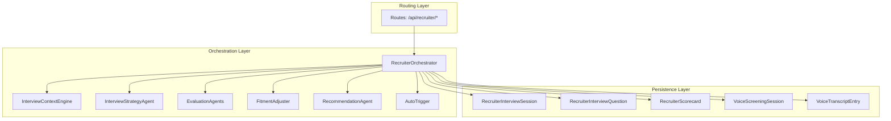
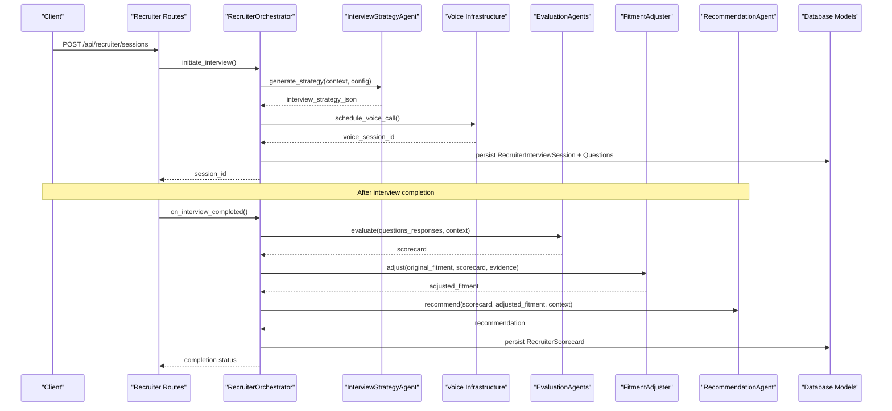
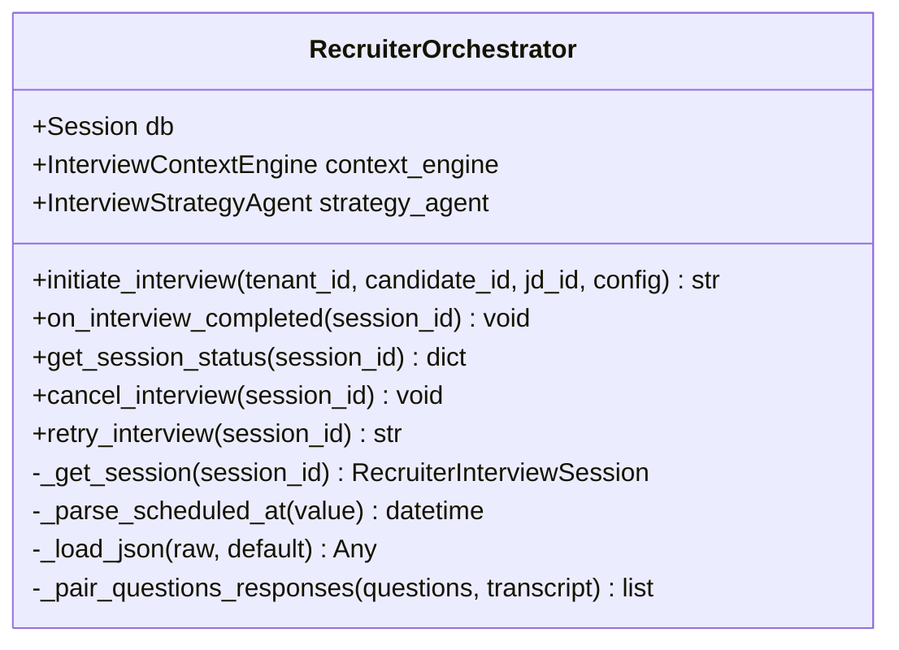
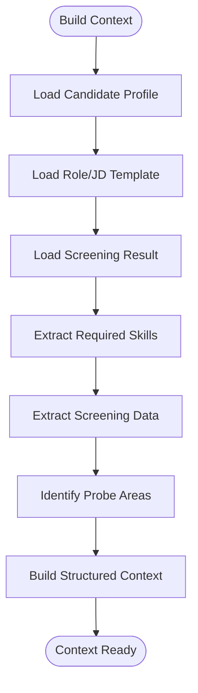
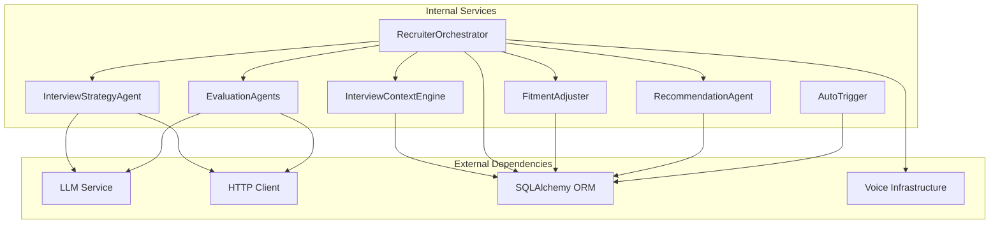

# AI Recruiter Module

<cite>
**Referenced Files in This Document**
- [__init__.py](file://app/backend/services/recruiter/__init__.py)
- [orchestrator.py](file://app/backend/services/recruiter/orchestrator.py)
- [context_engine.py](file://app/backend/services/recruiter/context_engine.py)
- [strategy_agent.py](file://app/backend/services/recruiter/strategy_agent.py)
- [evaluation_agents.py](file://app/backend/services/recruiter/evaluation_agents.py)
- [recommendation_agent.py](file://app/backend/services/recruiter/recommendation_agent.py)
- [fitment_adjuster.py](file://app/backend/services/recruiter/fitment_adjuster.py)
- [auto_trigger.py](file://app/backend/services/recruiter/auto_trigger.py)
- [recruiter.py](file://app/backend/routes/recruiter.py)
- [db_models.py](file://app/backend/models/db_models.py)
- [schemas.py](file://app/backend/models/schemas.py)
</cite>

## Table of Contents
1. [Introduction](#introduction)
2. [Project Structure](#project-structure)
3. [Core Components](#core-components)
4. [Architecture Overview](#architecture-overview)
5. [Detailed Component Analysis](#detailed-component-analysis)
6. [Dependency Analysis](#dependency-analysis)
7. [Performance Considerations](#performance-considerations)
8. [Troubleshooting Guide](#troubleshooting-guide)
9. [Conclusion](#conclusion)

## Introduction
The AI Recruiter Module automates the initial screening phase of the recruitment process by conducting structured phone interviews powered by AI. It integrates with the existing screening pipeline, leveraging LLMs for strategy generation and evaluation, while maintaining compatibility with voice call infrastructure. The module supports both manual initiation and automated triggers based on candidate screening results, providing comprehensive scoring, recommendations, and actionable insights.

## Project Structure
The AI Recruiter functionality is organized into distinct layers: orchestration, context building, strategy generation, evaluation, recommendation, and persistence. The routing layer exposes REST endpoints for session management, configuration, analytics, and exports.

**Diagram sources**
- [recruiter.py:1-704](file://app/backend/routes/recruiter.py#L1-L704)
- [orchestrator.py:35-429](file://app/backend/services/recruiter/orchestrator.py#L35-L429)
- [context_engine.py:19-308](file://app/backend/services/recruiter/context_engine.py#L19-L308)
- [strategy_agent.py:18-365](file://app/backend/services/recruiter/strategy_agent.py#L18-L365)
- [evaluation_agents.py:1-364](file://app/backend/services/recruiter/evaluation_agents.py#L1-L364)
- [recommendation_agent.py:9-194](file://app/backend/services/recruiter/recommendation_agent.py#L9-L194)
- [fitment_adjuster.py:9-211](file://app/backend/services/recruiter/fitment_adjuster.py#L9-L211)
- [auto_trigger.py:23-156](file://app/backend/services/recruiter/auto_trigger.py#L23-L156)
- [db_models.py:964-1090](file://app/backend/models/db_models.py#L964-L1090)

**Section sources**
- [__init__.py:1-29](file://app/backend/services/recruiter/__init__.py#L1-L29)
- [recruiter.py:1-704](file://app/backend/routes/recruiter.py#L1-L704)

## Core Components
The AI Recruiter Module comprises five core services that collaborate to deliver end-to-end interview automation:

- **RecruiterOrchestrator**: Central coordinator managing interview lifecycle, strategy generation, voice session scheduling, and post-processing.
- **InterviewContextEngine**: Aggregates candidate profile, screening results, role requirements, and skill matching into structured context.
- **InterviewStrategyAgent**: Generates structured interview plans using LLMs with deterministic fallback capabilities.
- **EvaluationAgents**: Applies specialized evaluators for technical, behavioral, communication, and cultural fit dimensions.
- **FitmentAdjuster**: Adjusts initial fitment scores based on interview evidence with confidence-aware adjustments.
- **RecommendationAgent**: Synthesizes evaluation results into final recommendations with weighted scoring.
- **AutoTrigger**: Automatically initiates interviews based on configurable thresholds and pipeline stages.

**Section sources**
- [orchestrator.py:35-429](file://app/backend/services/recruiter/orchestrator.py#L35-L429)
- [context_engine.py:19-308](file://app/backend/services/recruiter/context_engine.py#L19-L308)
- [strategy_agent.py:18-365](file://app/backend/services/recruiter/strategy_agent.py#L18-L365)
- [evaluation_agents.py:1-364](file://app/backend/services/recruiter/evaluation_agents.py#L1-L364)
- [fitment_adjuster.py:9-211](file://app/backend/services/recruiter/fitment_adjuster.py#L9-L211)
- [recommendation_agent.py:9-194](file://app/backend/services/recruiter/recommendation_agent.py#L9-L194)
- [auto_trigger.py:23-156](file://app/backend/services/recruiter/auto_trigger.py#L23-L156)

## Architecture Overview
The AI Recruiter follows a modular architecture with clear separation of concerns. The orchestration layer coordinates all activities, while specialized agents handle domain-specific tasks. Data persistence is handled through dedicated models for sessions, questions, scorecards, and voice transcripts.

**Diagram sources**
- [recruiter.py:113-167](file://app/backend/routes/recruiter.py#L113-L167)
- [orchestrator.py:43-155](file://app/backend/services/recruiter/orchestrator.py#L43-L155)
- [strategy_agent.py:25-67](file://app/backend/services/recruiter/strategy_agent.py#L25-L67)
- [evaluation_agents.py:85-364](file://app/backend/services/recruiter/evaluation_agents.py#L85-L364)
- [fitment_adjuster.py:15-93](file://app/backend/services/recruiter/fitment_adjuster.py#L15-L93)
- [recommendation_agent.py:12-88](file://app/backend/services/recruiter/recommendation_agent.py#L12-L88)
- [db_models.py:964-1066](file://app/backend/models/db_models.py#L964-L1066)

## Detailed Component Analysis

### RecruiterOrchestrator
The orchestrator serves as the central coordinator, managing the complete interview lifecycle from initiation to completion. It handles multi-tenancy validation, strategy generation, voice session scheduling, and post-processing workflows.

Key responsibilities:
- Tenant-scoped validation and access control
- Strategy generation and question persistence
- Voice call scheduling and coordination
- Post-interview processing pipeline
- Session status management and cancellation/retry logic

**Diagram sources**
- [orchestrator.py:35-429](file://app/backend/services/recruiter/orchestrator.py#L35-L429)

**Section sources**
- [orchestrator.py:35-429](file://app/backend/services/recruiter/orchestrator.py#L35-L429)

### InterviewContextEngine
The context engine aggregates comprehensive information about candidates, roles, and screening results to build structured interview context. It identifies probe areas requiring validation during the interview.

Core functionality:
- Candidate profile aggregation (skills, education, experience, gaps)
- Role requirement extraction and skill matching
- Screening result integration and risk signal analysis
- Probe area identification for targeted validation

**Diagram sources**
- [context_engine.py:22-106](file://app/backend/services/recruiter/context_engine.py#L22-L106)

**Section sources**
- [context_engine.py:19-308](file://app/backend/services/recruiter/context_engine.py#L19-L308)

### InterviewStrategyAgent
Generates structured interview plans using LLM prompts with comprehensive coverage of technical depth, behavioral assessment, communication evaluation, and cultural fit. Includes deterministic fallback strategies when LLMs are unavailable.

Strategy generation includes:
- Logical question sequencing (rapport → technical → behavioral → motivation)
- Dimension-specific time allocation
- Branching rules for adaptive questioning
- Skill-targeted probing based on candidate profile

**Section sources**
- [strategy_agent.py:18-365](file://app/backend/services/recruiter/strategy_agent.py#L18-L365)

### EvaluationAgents
Provides specialized evaluation capabilities across four dimensions:

**TechnicalEvaluator**: Validates technical competency against required skills using LLM analysis with deterministic fallback scoring.

**BehavioralEvaluator**: Assesses STAR responses, leadership, teamwork, and problem-solving abilities.

**CommunicationEvaluator**: Analyzes response quality, clarity, articulation, and active listening indicators.

**CulturalFitEvaluator**: Evaluates motivation alignment with role and organizational fit.

Each evaluator includes robust error handling and fallback mechanisms to ensure reliable operation.

**Section sources**
- [evaluation_agents.py:1-364](file://app/backend/services/recruiter/evaluation_agents.py#L1-L364)

### FitmentAdjuster
Adjusts initial fitment scores based on interview evidence with confidence-aware modifications. Implements conservative adjustment limits and risk signal validation.

Adjustment logic:
- Base adjustment moves halfway toward interview average
- Technical performance boosters and penalties
- Communication quality impact modifiers
- Risk signal validation and dismissal assessment
- Confidence scoring based on evaluation consistency

**Section sources**
- [fitment_adjuster.py:9-211](file://app/backend/services/recruiter/fitment_adjuster.py#L9-L211)

### RecommendationAgent
Synthesizes evaluation results into comprehensive recommendations with weighted scoring and confidence assessment.

Scoring methodology:
- Weighted combination: Technical (35%), Behavioral (25%), Communication (20%), Cultural Fit (20%)
- Adjusted fitment blending for final score calculation
- Confidence derivation based on score spread and fitment confidence
- Human validation requirements for borderline cases

**Section sources**
- [recommendation_agent.py:9-194](file://app/backend/services/recruiter/recommendation_agent.py#L9-L194)

### AutoTrigger
Automatically initiates AI recruiter interviews based on configurable criteria and pipeline stage transitions.

Trigger conditions:
- Tenant-enabled configuration
- Pipeline stage matching
- Fitment score thresholds
- Candidate phone number availability
- Role template association

**Section sources**
- [auto_trigger.py:23-156](file://app/backend/services/recruiter/auto_trigger.py#L23-L156)

## Dependency Analysis
The AI Recruiter Module exhibits clean architectural boundaries with minimal cross-dependencies, promoting maintainability and testability.

**Diagram sources**
- [orchestrator.py:21-30](file://app/backend/services/recruiter/orchestrator.py#L21-L30)
- [strategy_agent.py:10-23](file://app/backend/services/recruiter/strategy_agent.py#L10-L23)
- [evaluation_agents.py:10-15](file://app/backend/services/recruiter/evaluation_agents.py#L10-L15)
- [context_engine.py:7-14](file://app/backend/services/recruiter/context_engine.py#L7-L14)
- [db_models.py:964-1090](file://app/backend/models/db_models.py#L964-L1090)

**Section sources**
- [__init__.py:6-28](file://app/backend/services/recruiter/__init__.py#L6-L28)

## Performance Considerations
The AI Recruiter Module incorporates several performance optimization strategies:

- **Asynchronous LLM Calls**: Non-blocking HTTP requests with semaphores for concurrent processing
- **Deterministic Fallbacks**: Graceful degradation when LLM services are unavailable
- **Structured JSON Parsing**: Robust parsing with multiple format tolerances
- **Efficient Database Queries**: Selective loading with proper indexing on tenant-scoped fields
- **Memory Management**: Streaming responses for large exports and selective JSON loading

## Troubleshooting Guide

### Common Issues and Solutions

**LLM Service Unavailable**
- Symptom: Interview strategy generation fails with fallback activation
- Solution: Check OLLAMA_BASE_URL and OLLAMA_MODEL environment variables
- Impact: Deterministic strategy generation continues without LLM assistance

**Voice Call Scheduling Failures**
- Symptom: Voice session creation succeeds but call scheduling fails
- Solution: Verify voice_call_scheduler integration and external telephony provider
- Impact: Interview session created but voice call not scheduled

**Candidate Validation Errors**
- Symptom: "Candidate not found or not in your tenant" errors
- Solution: Confirm tenant membership and candidate existence
- Impact: Session creation blocked for security compliance

**Session Status Conflicts**
- Symptom: Cannot cancel/retry sessions in current status
- Solution: Check session lifecycle status and timing
- Impact: Operations restricted to appropriate lifecycle phases

**Section sources**
- [orchestrator.py:157-367](file://app/backend/services/recruiter/orchestrator.py#L157-L367)
- [recruiter.py:324-414](file://app/backend/routes/recruiter.py#L324-L414)

## Conclusion
The AI Recruiter Module provides a comprehensive, production-ready solution for automated phone-based candidate screening. Its modular architecture ensures maintainability while delivering sophisticated AI-driven interview capabilities. The integration with existing screening infrastructure and voice call systems creates a seamless workflow for modern recruitment processes. The module's robust error handling, deterministic fallbacks, and comprehensive analytics support make it suitable for enterprise deployment with reliable performance guarantees.