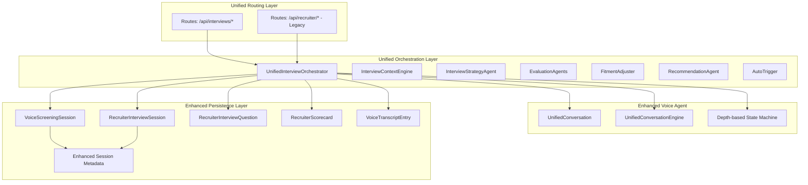
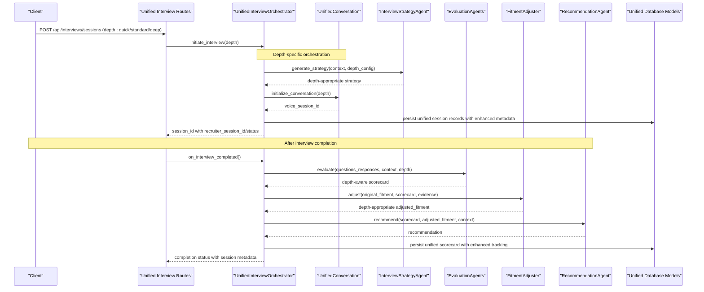
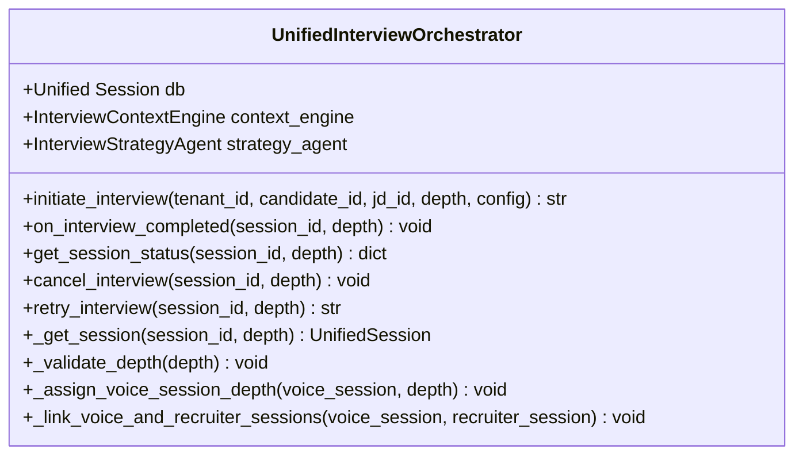
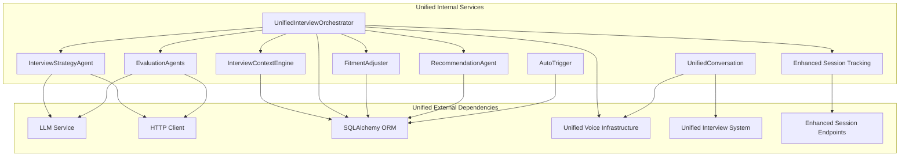

# AI Recruiter Module

<cite>
**Referenced Files in This Document**
- [interviews.py](file://app/backend/routes/interviews.py)
- [orchestrator.py](file://app/backend/services/recruiter/orchestrator.py)
- [conversation.py](file://app/voice_agent/conversation.py)
- [recruiter.py](file://app/backend/routes/recruiter.py)
- [recruiter_conversation.py](file://app/voice_agent/recruiter_conversation.py)
- [db_models.py](file://app/backend/models/db_models.py)
- [schemas.py](file://app/backend/models/schemas.py)
- [045_ai_recruiter.py](file://alembic/versions/045_ai_recruiter.py)
</cite>

## Update Summary
**Changes Made**
- Enhanced integration with VoiceScreeningSessionOut schema to include recruiter_session_id and recruiter_status fields
- Improved session tracking through unified voice-screening and recruiter interview coordination
- Added bidirectional session metadata linking between voice screening and AI recruiter processes
- Updated unified interview system to provide comprehensive session visibility across both components

## Table of Contents
1. [Introduction](#introduction)
2. [Project Structure](#project-structure)
3. [Core Components](#core-components)
4. [Architecture Overview](#architecture-overview)
5. [Unified Interview System](#unified-interview-system)
6. [Enhanced Depth Selection](#enhanced-depth-selection)
7. [Enhanced Session Tracking](#enhanced-session-tracking)
8. [Detailed Component Analysis](#detailed-component-analysis)
9. [Dependency Analysis](#dependency-analysis)
10. [Performance Considerations](#performance-considerations)
11. [Troubleshooting Guide](#troubleshooting-guide)
12. [Conclusion](#conclusion)

## Introduction
The AI Recruiter Module is now fully integrated into the Unified AI Interview System, providing comprehensive AI-powered interview capabilities within a unified architecture. The module retains its AI-powered interview capabilities while operating under the new unified system with enhanced depth selection (quick, standard, deep) and improved session management. It automates the initial screening phase of the recruitment process by conducting structured phone interviews powered by AI, integrating seamlessly with the unified interview infrastructure.

**Updated** Enhanced integration with VoiceScreeningSessionOut schema now provides comprehensive session tracking through recruiter_session_id and recruiter_status fields, enabling better coordination between AI recruiter interviews and voice screening processes.

## Project Structure
The AI Recruiter Module is now integrated into the Unified AI Interview System with a unified architecture that supports three interview depths: quick (3-5 minutes), standard (10-15 minutes), and deep (20-30 minutes). The system maintains separate routing layers while sharing common orchestration and persistence components.



**Diagram sources**
- [interviews.py:103-268](file://app/backend/routes/interviews.py#L103-L268)
- [orchestrator.py:35-429](file://app/backend/services/recruiter/orchestrator.py#L35-L429)
- [conversation.py:103-200](file://app/voice_agent/conversation.py#L103-L200)
- [db_models.py:908-1091](file://app/backend/models/db_models.py#L908-L1091)

**Section sources**
- [interviews.py:1-1034](file://app/backend/routes/interviews.py#L1-L1034)
- [orchestrator.py:35-429](file://app/backend/services/recruiter/orchestrator.py#L35-L429)

## Core Components
The AI Recruiter Module operates within the Unified AI Interview System with enhanced capabilities:

- **UnifiedInterviewOrchestrator**: Central coordinator managing unified interview lifecycle across all depths, strategy generation, voice session scheduling, and post-processing.
- **InterviewContextEngine**: Aggregates candidate profile, screening results, role requirements, and skill matching into structured context for unified interview depths.
- **InterviewStrategyAgent**: Generates structured interview plans using LLMs with depth-appropriate complexity and deterministic fallback capabilities.
- **EvaluationAgents**: Applies specialized evaluators for technical, behavioral, communication, and cultural fit dimensions with depth-aware scoring.
- **FitmentAdjuster**: Adjusts initial fitment scores based on interview evidence with confidence-aware adjustments tailored to interview depth.
- **RecommendationAgent**: Synthesizes evaluation results into final recommendations with weighted scoring appropriate for each interview depth.
- **AutoTrigger**: Automatically initiates interviews based on configurable thresholds and pipeline stages, supporting unified depth selection.
- **UnifiedConversation**: Advanced voice conversation engine handling all interview depths with unified state management and depth-based question strategies.
- **Enhanced Session Tracking**: Bidirectional session linking between voice screening and AI recruiter processes through unified metadata fields.

**Section sources**
- [orchestrator.py:35-429](file://app/backend/services/recruiter/orchestrator.py#L35-L429)
- [conversation.py:103-200](file://app/voice_agent/conversation.py#L103-L200)

## Architecture Overview
The AI Recruiter Module is now part of a unified architecture that manages all interview types through a single orchestration layer. The system supports three interview depths with shared infrastructure while maintaining depth-specific capabilities.



**Diagram sources**
- [interviews.py:103-268](file://app/backend/routes/interviews.py#L103-L268)
- [orchestrator.py:43-155](file://app/backend/services/recruiter/orchestrator.py#L43-L155)
- [conversation.py:103-200](file://app/voice_agent/conversation.py#L103-L200)

## Unified Interview System
The AI Recruiter Module is now fully integrated into the Unified AI Interview System, which provides a comprehensive platform for managing all types of AI-powered interviews. The unified system offers:

- **Single Interface**: Unified API endpoints (`/api/interviews/*`) replacing legacy routes
- **Shared Infrastructure**: Common orchestration, persistence, and analytics across all interview types
- **Unified Configuration**: Merged settings for voice and recruiter interview configurations
- **Cross-Platform Analytics**: Combined reporting and metrics for all interview depths
- **Legacy Compatibility**: Maintained `/api/recruiter/*` endpoints for backward compatibility
- **Enhanced Session Visibility**: Comprehensive tracking across both voice screening and AI recruiter processes

**Section sources**
- [interviews.py:1-1034](file://app/backend/routes/interviews.py#L1-L1034)
- [recruiter.py:60-62](file://app/backend/routes/recruiter.py#L60-L62)

## Enhanced Depth Selection
The unified system introduces sophisticated depth selection capabilities:

### Interview Depths
- **Quick (3-5 minutes)**: Automated screening with preset skill questions, pass/fail outcomes
- **Standard (10-15 minutes)**: LLM-generated strategy with 3-dimension scoring, 1 follow-up per question
- **Deep (20-30 minutes)**: Comprehensive strategy with 5-dimension + fitment scoring, 2 follow-ups

### Depth Management Features
- **Unified Session Creation**: Single endpoint supporting all depth levels
- **Intelligent Depth Assignment**: Automatic depth selection based on candidate profile and role requirements
- **Depth-Based Resource Allocation**: Optimized LLM usage, question strategies, and evaluation complexity
- **Unified Analytics**: Cross-depth comparison and performance metrics
- **Seamless Transitions**: Ability to escalate from quick to standard/deep based on screening results

**Section sources**
- [interviews.py:64-66](file://app/backend/routes/interviews.py#L64-L66)
- [conversation.py:25-28](file://app/voice_agent/conversation.py#L25-L28)
- [conversation.py:77-88](file://app/voice_agent/conversation.py#L77-L88)

## Enhanced Session Tracking
The AI Recruiter Module now provides comprehensive session tracking through enhanced integration with the VoiceScreeningSessionOut schema, enabling bidirectional coordination between voice screening and AI recruiter processes.

### Enhanced Metadata Fields
The VoiceScreeningSessionOut schema now includes two critical fields for improved session coordination:

- **recruiter_session_id**: Unique identifier linking voice screening sessions to their corresponding AI recruiter interview sessions
- **recruiter_status**: Current status of the associated AI recruiter interview session

### Bidirectional Session Linking
The unified system maintains bidirectional relationships between voice screening and AI recruiter sessions:

```mermaid
graph LR
subgraph "Voice Screening Session"
VS1[VoiceScreeningSession]
VS1 --> VS2[VoiceScreeningSessionOut]
VS2 --> VS3[recruiter_session_id]
VS2 --> VS4[recruiter_status]
end
subgraph "AI Recruiter Session"
RS1[RecruiterInterviewSession]
RS1 --> RS2[RecruiterInterviewSessionOut]
end
VS3 <- --> RS1
VS4 --> RS2
```

**Diagram sources**
- [schemas.py:694-725](file://app/backend/models/schemas.py#L694-L725)
- [interviews.py:363-373](file://app/backend/routes/interviews.py#L363-L373)

### Session Tracking Implementation
The enhanced session tracking works through several key mechanisms:

1. **Automatic Association**: When a voice screening session triggers an AI recruiter interview, the system automatically creates a bidirectional link
2. **Real-time Status Updates**: Changes in either session type are reflected in the enhanced metadata
3. **Comprehensive Query Support**: APIs can retrieve both voice screening and AI recruiter session information in a single response
4. **Cross-Session Analytics**: Unified reporting capabilities across both interview types

**Section sources**
- [schemas.py:721-723](file://app/backend/models/schemas.py#L721-L723)
- [interviews.py:363-373](file://app/backend/routes/interviews.py#L363-L373)
- [db_models.py:966-1000](file://app/backend/models/db_models.py#L966-L1000)

## Detailed Component Analysis

### UnifiedInterviewOrchestrator
The orchestrator serves as the central coordinator for the unified interview system, managing interview lifecycle across all depths while maintaining depth-specific capabilities.

Key responsibilities:
- **Unified Session Management**: Handle all interview depths through single orchestration interface
- **Depth-Aware Strategy Generation**: Generate appropriate strategies based on selected depth level
- **Voice Session Coordination**: Manage voice call scheduling and depth-specific call handling
- **Unified Post-Processing**: Handle evaluation, scoring, and recommendation generation across depths
- **Cross-Depth Analytics**: Provide unified metrics and reporting for all interview types
- **Enhanced Session Tracking**: Maintain bidirectional links between voice screening and AI recruiter sessions



**Diagram sources**
- [orchestrator.py:35-429](file://app/backend/services/recruiter/orchestrator.py#L35-L429)

**Section sources**
- [orchestrator.py:35-429](file://app/backend/services/recruiter/orchestrator.py#L35-L429)

### UnifiedConversation Engine
The advanced voice conversation engine handles all interview depths through a unified state machine with depth-appropriate question strategies and resource allocation.

Core functionality:
- **Depth-Based Question Loading**: Load appropriate question sets based on selected depth
- **Unified State Management**: Single state machine handling all interview phases across depths
- **Dynamic Budget Management**: Time and question budget allocation based on interview depth
- **Adaptive Follow-Up Logic**: Depth-appropriate follow-up question generation and management
- **Unified Evaluation Tracking**: Consistent evaluation framework across all interview depths
- **Enhanced Session Coordination**: Seamless integration with AI recruiter session tracking

**Section sources**
- [conversation.py:103-200](file://app/voice_agent/conversation.py#L103-L200)
- [conversation.py:149-188](file://app/voice_agent/conversation.py#L149-L188)

### Enhanced Session Management
The unified system provides comprehensive session management across all interview depths with enhanced tracking capabilities:

- **Unified Session Creation**: Single endpoint supporting quick, standard, and deep interview creation
- **Depth-Aware Status Tracking**: Status management appropriate for each interview depth
- **Cross-Depth Analytics**: Unified metrics and reporting across all interview types
- **Seamless Escalation**: Ability to escalate from quick to standard/deep based on screening results
- **Unified Export Capabilities**: Single export interface for all interview types and depths
- **Enhanced Metadata Integration**: Automatic inclusion of recruiter_session_id and recruiter_status in all session responses

**Section sources**
- [interviews.py:103-268](file://app/backend/routes/interviews.py#L103-L268)
- [interviews.py:271-322](file://app/backend/routes/interviews.py#L271-L322)
- [interviews.py:363-373](file://app/backend/routes/interviews.py#L363-L373)

## Dependency Analysis
The AI Recruiter Module maintains clean architectural boundaries within the unified system while sharing common infrastructure.



**Diagram sources**
- [orchestrator.py:21-30](file://app/backend/services/recruiter/orchestrator.py#L21-L30)
- [conversation.py:136-140](file://app/voice_agent/conversation.py#L136-L140)
- [interviews.py:56](file://app/backend/routes/interviews.py#L56)

**Section sources**
- [orchestrator.py:35-429](file://app/backend/services/recruiter/orchestrator.py#L35-L429)

## Performance Considerations
The unified AI Interview System incorporates several performance optimization strategies:

- **Unified Resource Management**: Shared LLM resources with depth-based allocation
- **Intelligent Depth Selection**: Automatic depth assignment to optimize resource usage
- **Unified Caching Strategies**: Shared caching for context, strategies, and evaluation results
- **Depth-Aware Concurrency Control**: Semaphore-based LLM calls with depth-appropriate limits
- **Unified Database Optimization**: Shared indexing and query optimization across all interview types
- **Cross-Depth Analytics**: Efficient aggregated reporting and metrics collection
- **Enhanced Session Tracking**: Optimized queries for bidirectional session metadata retrieval

## Troubleshooting Guide

### Common Issues and Solutions

**Unified Interview System Issues**
- Symptom: Interview creation fails with depth validation errors
- Solution: Verify depth parameter is one of quick, standard, or deep
- Impact: Session creation blocked for invalid depth specification

**Depth Selection Problems**
- Symptom: Interviews not escalating from quick to standard/deep
- Solution: Check screening results and auto-trigger configuration
- Impact: Missed opportunities for deeper assessment

**Enhanced Session Tracking Issues**
- Symptom: Missing recruiter_session_id or recruiter_status in session responses
- Solution: Verify that voice screening sessions are properly linked to AI recruiter sessions and that the enhanced schema is being used
- Impact: Incomplete session tracking and coordination between voice screening and AI recruiter processes

**Bidirectional Session Linking Failures**
- Symptom: Voice screening sessions show null values for recruiter_session_id/status
- Solution: Check that the AI recruiter session was successfully created and linked during the voice screening process
- Impact: Loss of cross-session visibility and coordination capabilities

**Unified Voice Agent Issues**
- Symptom: Voice calls not connecting for unified interview depths
- Solution: Verify voice infrastructure integration and depth-specific configurations
- Impact: Interview session created but voice call not scheduled

**Cross-Depth Analytics Failures**
- Symptom: Missing unified analytics for specific interview depths
- Solution: Check database migration for interview_depth column and indexing
- Impact: Incomplete reporting for unified interview system

**Legacy Route Compatibility**
- Symptom: `/api/recruiter/*` endpoints not functioning
- Solution: Verify feature flag RECRUITER_ENABLED and route dependencies
- Impact: Legacy integrations may fail while unified routes work

**Section sources**
- [interviews.py:112-117](file://app/backend/routes/interviews.py#L112-L117)
- [interviews.py:138-142](file://app/backend/routes/interviews.py#L138-L142)
- [recruiter.py:70-77](file://app/backend/routes/recruiter.py#L70-L77)

## Conclusion
The AI Recruiter Module is now a fully integrated component of the Unified AI Interview System, providing comprehensive AI-powered interview capabilities with enhanced depth selection and unified session management. The module's integration into the unified architecture ensures maintainability while delivering sophisticated interview automation across three distinct depth levels. The enhanced integration with VoiceScreeningSessionOut schema, featuring the new recruiter_session_id and recruiter_status fields, enables comprehensive session tracking and improved coordination between voice screening and AI recruiter processes. The unified system's shared infrastructure, common orchestration, and cross-platform analytics create a seamless workflow for modern recruitment processes. The module's robust error handling, depth-aware capabilities, comprehensive analytics, and enhanced session tracking support make it suitable for enterprise deployment with reliable performance guarantees across all interview depths.