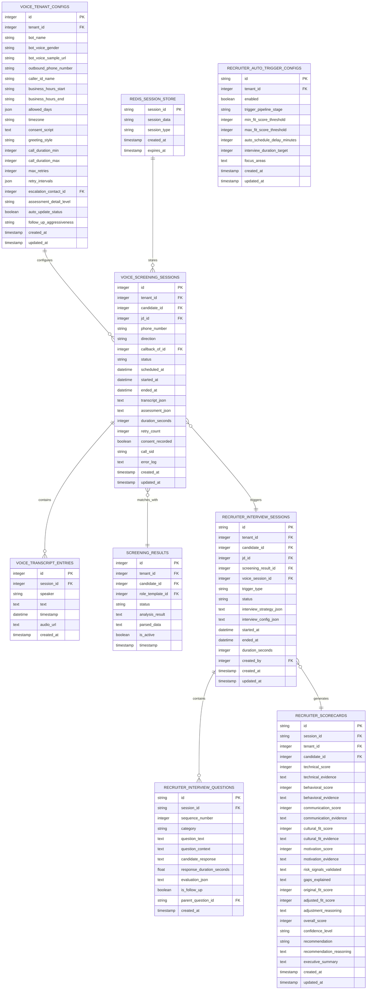
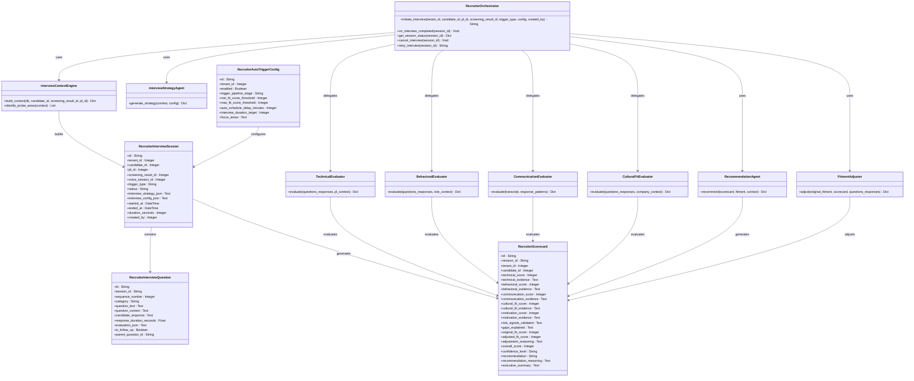
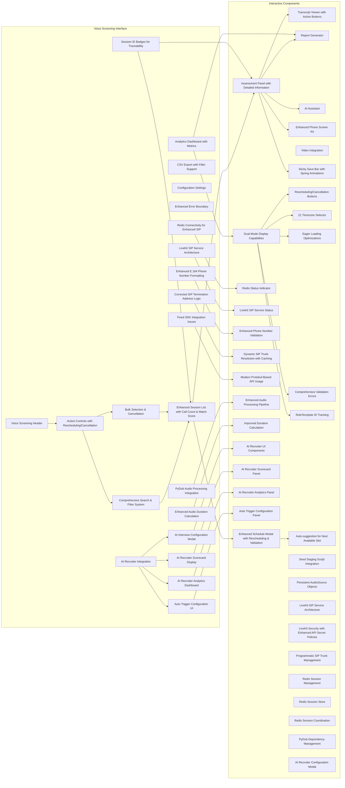
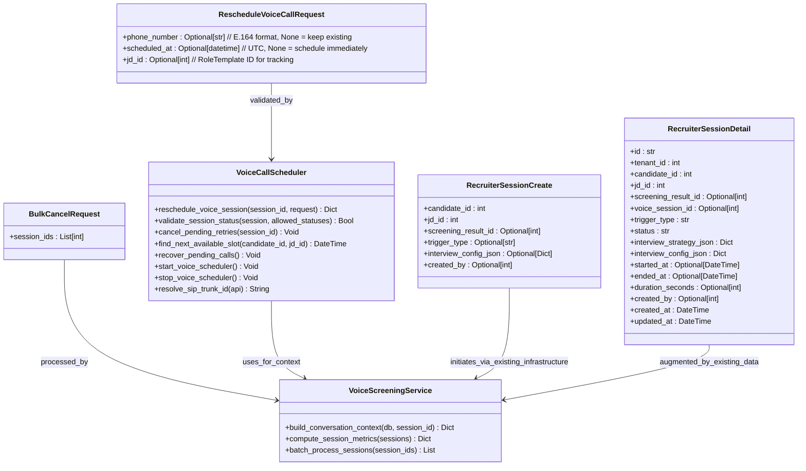

# Voice Screening System

<cite>
**Referenced Files in This Document**
- [agent.py](file://app/voice_agent/agent.py)
- [livekit.yaml](file://app/voice_agent/livekit.yaml)
- [Dockerfile.livekit](file://app/voice_agent/Dockerfile.livekit)
- [voice_call_scheduler.py](file://app/backend/services/voice_call_scheduler.py)
- [voice.py](file://app/backend/routes/voice.py)
- [main.py](file://app/speech_service/main.py)
- [044_voice_screening.py](file://alembic/versions/044_voice_screening.py)
- [045_ai_recruiter.py](file://alembic/versions/045_ai_recruiter.py)
- [db_models.py](file://app/backend/models/db_models.py)
- [schemas.py](file://app/backend/models/schemas.py)
- [VoiceScreeningPage.jsx](file://app/frontend/src/pages/VoiceScreeningPage.jsx)
- [docker-compose.yml](file://docker-compose.yml)
- [requirements.txt](file://app/voice_agent/requirements.txt)
- [guardrail_service.py](file://app/backend/services/guardrail_service.py)
- [nginx.prod.conf](file://nginx/nginx.prod.conf)
- [docker-compose.staging.yml](file://docker-compose.staging.yml)
- [.github/workflows/cd.yml](file://.github/workflows/cd.yml)
- [orchestrator.py](file://app/backend/services/recruiter/orchestrator.py)
- [recruiter.py](file://app/backend/routes/recruiter.py)
- [context_engine.py](file://app/backend/services/recruiter/context_engine.py)
- [evaluation_agents.py](file://app/backend/services/recruiter/evaluation_agents.py)
- [ReportPage.jsx](file://app/frontend/src/pages/ReportPage.jsx)
</cite>

## Update Summary
**Changes Made**
- Added AI Recruiter module extending voice screening system with intelligent interview capabilities
- Integrated AI Recruiter with existing voice infrastructure while maintaining backward compatibility
- Enhanced voice screening workflow with intelligent interview orchestration
- Added comprehensive AI-powered evaluation agents for technical, behavioral, communication, and cultural fit assessment
- Implemented intelligent interview strategy generation and question management
- Added auto-trigger configuration for automated interview scheduling
- Enhanced frontend integration with AI Recruiter scorecard display

## Table of Contents
1. [Introduction](#introduction)
2. [System Architecture](#system-architecture)
3. [Database Schema](#database-schema)
4. [Core Components](#core-components)
5. [Voice Screening Workflow](#voice-screening-workflow)
6. [AI Recruiter Module](#ai-recruiter-module)
7. [Frontend Implementation](#frontend-implementation)
8. [API Endpoints](#api-endpoints)
9. [Testing Framework](#testing-framework)
10. [Deployment Configuration](#deployment-configurations)
11. [Troubleshooting Guide](#troubleshooting-guide)

## Introduction

The Voice Screening System is an intelligent telephone-based candidate assessment platform integrated into the Resume AI by ThetaLogics recruitment automation suite. This system enables recruiters to conduct automated voice interviews using LiveKit WebRTC infrastructure, capture real-time transcripts, analyze candidate responses, and generate comprehensive assessment reports. The system leverages advanced speech-to-text technology, natural language processing, and AI-powered evaluation algorithms to streamline the initial screening process.

**Updated** The system now includes an AI Recruiter module that extends voice screening capabilities with intelligent interview orchestration, automated strategy generation, and comprehensive evaluation agents. The AI Recruiter maintains full backward compatibility with existing voice screening functionality while adding advanced AI-powered interview capabilities.

The platform supports both scheduled and on-demand voice assessments, integrates seamlessly with existing candidate management workflows, and provides detailed analytics for hiring teams. Built with modern web technologies and cloud-native architecture, the system ensures scalability, reliability, and compliance with enterprise security standards.

## System Architecture

The Voice Screening System follows a microservices architecture pattern with clear separation of concerns across frontend, backend, voice infrastructure, AI Recruiter module, and external service integrations.


**Diagram sources**
- [agent.py](file://app/voice_agent/agent.py)
- [voice_call_scheduler.py](file://app/backend/services/voice_call_scheduler.py)
- [voice.py](file://app/backend/routes/voice.py)
- [main.py](file://app/speech_service/main.py)
- [livekit.yaml](file://app/voice_agent/livekit.yaml)
- [Dockerfile.livekit](file://app/voice_agent/Dockerfile.livekit)
- [orchestrator.py](file://app/backend/services/recruiter/orchestrator.py)
- [recruiter.py](file://app/backend/routes/recruiter.py)
- [context_engine.py](file://app/backend/services/recruiter/context_engine.py)
- [evaluation_agents.py](file://app/backend/services/recruiter/evaluation_agents.py)

The architecture implements several key design patterns:

- **Event-Driven Architecture**: Asynchronous processing of voice events, transcription workflows, and AI evaluation pipelines
- **Circuit Breaker Pattern**: Protection against external service failures in AI evaluation and LLM integration
- **Retry Policies**: Robust error handling for network operations with 3-tier retry system (24h → 48h → escalate)
- **Caching Strategy**: Optimized data retrieval for frequently accessed assessment results with Redis integration
- **Microservice Communication**: Containerized services with dedicated responsibilities including AI Recruiter module
- **WebRTC Infrastructure**: LiveKit SFU for real-time audio/video communication with modern protobuf-based API usage
- **Programmatic SIP Trunk Management**: Twilio Elastic SIP Trunk integration managed via LiveKit API instead of YAML configuration
- **PostgreSQL Advisory Locks**: Single-instance scheduler execution across multi-process deployments
- **Eager Loading Optimization**: Backend performance enhancement for reduced query overhead
- **Enhanced Timezone Management**: Comprehensive timezone support for global operations with business hours enforcement and improved validation
- **Session Management**: Comprehensive rescheduling and cancellation capabilities with proper state validation
- **Dual-Mode Display**: Seamless transition between standard report view and split-view phone screening mode
- **Sticky Save Bars**: Persistent save controls for enhanced user experience
- **Enhanced Error Handling**: Comprehensive validation and user feedback mechanisms
- **RoleTemplate Tracking**: RoleTemplate ID field support for job description tracking in rescheduling operations
- **Search & Filtering**: Debounced server-side search with comprehensive filtering capabilities
- **Bulk Operations**: Efficient bulk selection and cancellation of voice screening sessions
- **Analytics Dashboard**: Real-time metrics and performance indicators with proper endpoint organization
- **Export Functionality**: CSV export with filter support for voice sessions
- **Auto-suggestion**: Intelligent time slot suggestion based on availability
- **Seed Management**: Automated testing environment setup with seed staging script
- **Container Restart Recovery**: Comprehensive recovery mechanisms for pending calls after container restarts
- **APScheduler Internal Logging**: Enhanced visibility into scheduler operations and misfired jobs
- **300-Second Misfire Grace Time**: Improved handling of delayed job execution after restarts
- **Persistent AudioSource Objects**: Reliable audio streaming with cached audio source instances
- **Session ID Traceability**: Visual session identification for debugging and monitoring
- **CPU-Optimized Speech Inference**: Whisper STT, Edge TTS neural voices, and Silero VAD models optimized for CPU deployment
- **FFmpeg Audio Processing**: System-level audio processing capabilities for format conversion and manipulation
- **Edge TTS Neural Voices**: Microsoft Edge TTS integration with JennyNeural and GuyNeural voices
- **Whisper Base Model**: OpenAI Whisper STT model for accurate speech transcription
- **Silero VAD Detection**: Real-time voice activity detection for speech/silence segmentation
- **Modern Protobuf-Based API**: LiveKit SDK integration using protobuf objects for room creation and SIP operations
- **Programmatic SIP Trunk Management**: Dynamic SIP trunk creation and resolution via LiveKit API
- **Dedicated LiveKit SIP Service Architecture**: Separate LiveKit server container with enhanced security policies and Redis connectivity
- **LiveKit v1.13.1 Compatibility**: Modern LiveKit SDK integration with protobuf-based API usage
- **Enhanced SIP Functionality**: Programmatic SIP trunk management with caching and fallback mechanisms
- **Redis Connectivity**: Enhanced Redis integration for SIP functionality, session management, and multi-instance coordination
- **Redis Session Management**: Distributed session coordination across multiple voice agent instances
- **Redis Session Store**: Persistent session storage for voice screening workflows
- **Redis Session Coordination**: Coordinated session management for scalable voice screening operations
- **Enhanced E.164 Compliance**: Comprehensive phone number formatting with international dialing support and standardized E.164 format
- **Corrected SIP Termination Address Logic**: Accurate SIP trunk resolution with proper termination address matching and fallback mechanisms
- **Fixed SDK Integration Issues**: Resolved protobuf API compatibility issues and improved LiveKit SDK integration with enhanced error handling
- **PyDub Audio Processing Integration**: Advanced audio format conversion and manipulation using PyDub library for enhanced TTS synthesis
- **Enhanced Audio Duration Calculation**: Improved audio duration calculations using PyDub's millisecond-based length property for consistent seconds-based logging
- **AI Recruiter Module**: Intelligent interview orchestration with automated strategy generation and evaluation
- **Interview Context Engine**: Comprehensive candidate and role context aggregation for interview planning
- **Evaluation Agents**: Specialized AI agents for technical, behavioral, communication, and cultural fit assessment
- **Recommendation Engine**: AI-powered candidate recommendations with confidence scoring
- **Fitment Adjuster**: Dynamic fitment score adjustment based on interview performance
- **Auto Trigger Configuration**: Automated interview scheduling based on screening results and fit scores
- **LLM Integration**: Ollama-based AI evaluation with gemma4:31b-cloud model for comprehensive assessment

**Updated** Enhanced architecture now includes dedicated LiveKit WebRTC server with programmatic SIP trunk management via LiveKit API, FastAPI-based voice agent with comprehensive conversation management and protobuf-based API usage, integrated speech service with CPU-optimized Whisper STT, Edge TTS neural voices, Silero VAD detection, and PyDub audio processing integration, FFmpeg integration for audio processing capabilities, seamless ReportPage integration for improved scalability and performance, featuring spring-loaded animations and dual-mode display capabilities with 21-timezone support, eager loading optimizations, comprehensive rescheduling functionality with RoleTemplate ID tracking, enhanced error handling with validation, robust session management, comprehensive search and filtering system, bulk selection and cancellation capabilities, analytics dashboard with key metrics, CSV export functionality with filter support, intelligent auto-suggestion for next available time slots, enhanced session details with call_count and match_score fields, new seed staging script for testing, PostgreSQL advisory locks for single-instance scheduler execution, 300-second misfire grace time for improved container restart handling, APScheduler internal logging for better observability, comprehensive recovery mechanisms for pending calls after container restarts, dynamic SIP trunk resolution with caching and fallback mechanisms, persistent AudioSource objects for reliable audio streaming, session ID badges for improved UI traceability, **AI Recruiter module extending voice screening with intelligent interview capabilities**, **interview orchestration with automated strategy generation**, **comprehensive evaluation agents for multiple assessment dimensions**, **LLM integration with Ollama for AI-powered evaluation**, **auto-trigger configuration for automated interview scheduling**, **recommendation engine with confidence scoring**, **fitment adjuster for dynamic score adjustment**, **interview context engine for comprehensive candidate analysis**, **seamless backward compatibility with existing voice screening functionality**, **dedicated LiveKit SIP service architecture with enhanced security policies and Redis connectivity**, **LiveKit v1.13.1 compatibility with modern protobuf-based API usage**, **enhanced SIP functionality with programmatic trunk management**, **Redis-backed session management for distributed voice screening operations**, **LiveKit security with mandatory 32-character API secret requirements**, **enhanced audio processing pipeline with PyDub integration for improved TTS synthesis**, **PyDub dependency management for audio format conversion and manipulation**, **enhanced speech service integration with CPU-optimized inference**, **modern LiveKit SDK integration with comprehensive protobuf-based API usage**, **dedicated LiveKit SIP service architecture with enhanced security policies**, **improved staging deployment configuration with enhanced security validation**, **enhanced E.164 phone number formatting for global compliance**, **corrected SIP termination address logic for accurate trunk resolution**, **fixed SDK integration issues with improved protobuf API compatibility**, and **enhanced audio duration calculation using PyDub's millisecond-based length property**.

## Database Schema

The voice screening system utilizes a PostgreSQL database with specialized tables for managing voice sessions, transcripts, assessment data, and AI Recruiter functionality with comprehensive timezone support and enhanced rescheduling capabilities.



**Diagram sources**
- [044_voice_screening.py](file://alembic/versions/044_voice_screening.py)
- [045_ai_recruiter.py](file://alembic/versions/045_ai_recruiter.py)
- [db_models.py](file://app/backend/models/db_models.py)

**Section sources**
- [044_voice_screening.py:12-83](file://alembic/versions/044_voice_screening.py#L12-L83)
- [045_ai_recruiter.py:13-125](file://alembic/versions/045_ai_recruiter.py#L13-L125)
- [db_models.py:920-945](file://app/backend/models/db_models.py#L920-L945)

### Key Database Features

The schema includes several optimization features:

- **Composite Indexes**: Phone number and status combinations for efficient filtering
- **Foreign Key Constraints**: Maintains referential integrity between sessions and transcripts
- **JSONB Fields**: Flexible storage for dynamic assessment data structures
- **Timestamp Tracking**: Comprehensive audit trail for all voice screening activities with timezone awareness
- **Cascade Deletion**: Automatic cleanup of related records when parent entities are removed
- **Enhanced Business Hours Configuration**: Timezone-aware scheduling with configurable working hours and improved allowed_days parsing
- **Retry Management**: Sophisticated retry logic with configurable intervals and escalation
- **21 Timezone Support**: Comprehensive timezone handling for global operations with enhanced validation
- **Eager Loading Optimization**: Backend performance enhancements for reduced query overhead
- **Assessment Detail Levels**: Configurable assessment granularity (brief/full)
- **Follow-up Aggressiveness**: Adjustable follow-up intensity settings
- **Auto Status Updates**: Automated candidate status updates after screening completion
- **RoleTemplate Tracking**: Enhanced rescheduling with jd_id field support for RoleTemplate ID tracking
- **Match Score Integration**: Deterministic scoring integration with screening results for match score calculations
- **Call Count Tracking**: Session frequency tracking per candidate
- **Search Optimization**: Dedicated indexes for search and filtering operations
- **Advisory Lock Integration**: PostgreSQL advisory lock support for scheduler coordination
- **Container Restart Recovery**: Pending call tracking and recovery mechanisms
- **Redis Session Store**: Persistent session storage for voice screening workflows with TTL management
- **Redis Session Coordination**: Distributed session management across multiple instances
- **Enhanced E.164 Phone Number Compliance**: Standardized phone number formatting with international dialing support for global compatibility
- **AI Recruiter Tables**: Dedicated tables for intelligent interview orchestration with comprehensive evaluation tracking
- **Voice Session Foreign Keys**: Links AI Recruiter sessions to existing voice screening infrastructure
- **Screening Result Integration**: Connects AI Recruiter evaluations to existing screening results for fitment adjustment
- **Auto Trigger Configuration**: Manages automated interview scheduling based on fit scores and pipeline stages
- **Interview Question Management**: Structured question tracking with sequence numbering and follow-up capabilities
- **Scorecard Generation**: Comprehensive evaluation scoring with multiple dimensions and confidence levels

**Updated** Database schema now supports comprehensive voice screening data with enhanced indexing, foreign key relationships, business hours configuration, sophisticated retry management, 21-timezone support for global operations, and eager loading optimizations for improved query performance and operational flexibility. The schema includes enhanced rescheduling capabilities with RoleTemplate ID field support for job description tracking in rescheduling operations, deterministic scoring integration with screening results for match score calculations, call count tracking for session frequency analysis, optimized search indexes for comprehensive filtering capabilities, PostgreSQL advisory lock integration for single-instance scheduler execution, 300-second misfire grace time for improved container restart handling, comprehensive container restart recovery mechanisms for pending call tracking and recovery, **AI Recruiter module tables with comprehensive interview orchestration and evaluation tracking**, **voice session foreign key integration maintaining backward compatibility**, **screening result integration enabling fitment adjustment**, **auto trigger configuration for automated interview scheduling**, **interview question management with structured tracking and follow-up capabilities**, **scorecard generation with multiple assessment dimensions and confidence scoring**, **dedicated indexes for AI Recruiter session management and evaluation data**, **comprehensive foreign key relationships for data integrity**, and **enhanced session tracking with interview-specific metadata**.

## Core Components

### Voice Screening Service

The Voice Screening Service orchestrates the complete voice assessment lifecycle, from candidate scheduling to final evaluation reporting with enhanced performance optimizations, comprehensive rescheduling support, and AI Recruiter integration.

```mermaid
classDiagram
class VoiceScreeningService {
+generate_screening_questions(jd_text, skills, title) List
+generate_post_call_assessment(transcript, jd, name, title, skills, detail) Dict
+evaluate_answer_quality(question, answer, skill) Dict
+build_conversation_context(db, session_id) Dict
+process_completed_call(db, session_id) Void
+compute_session_metrics(sessions) Dict
+batch_process_sessions(session_ids) List
}
class VoiceCallScheduler {
+schedule_voice_call(session_id, scheduled_at) Void
+execute_scheduled_call(session_id) Void
+process_voice_retries() Void
+cancel_pending_retries(session_id) Void
+is_within_business_hours(dt, config) Boolean
+adjust_to_business_hours(dt, config) DateTime
+find_next_available_slot(candidate_id, jd_id) DateTime
+recover_pending_calls() Void
+start_voice_scheduler() Void
+stop_voice_scheduler() Void
+resolve_sip_trunk_id(api) String
}
class TranscriptService {
+store_transcript(entry) TranscriptEntry
+process_audio(audio_data) Text
+get_transcripts(session_id) List
+export_transcript(session_id) Export
}
class AssessmentEngine {
+analyze_linguistic_patterns(text) LinguisticAnalysis
+evaluate_behavioral_traits(text) BehavioralScore
+score_technical_competency(text) TechnicalScore
+generate_recommendations(analysis) Recommendations
}
class SpeechService {
+convert_speech_to_text(audio_data) Transcript
+stream_audio_processing(audio_stream) RealTimeTranscript
+manage_speech_resources() ResourceAllocation
+transcribe(audio_bytes, content_type) String
+synthesize(text, voice) Bytes
+detect_speech(audio_bytes) Dict
+health_check() Dict
}
class VoiceAgent {
+dispatch_call(session_id, phone_number, candidate_name) Dict
+handle_room(room_name, agent_token, session_ctx) Void
+run_conversation_engine(ctx) Void
+resolve_sip_trunk_id(api) String
+publish_audio(room, audio_source, pcm_data, sample_rate) Void
}
class LiveKitServer {
+create_room(name, options) Room
+create_sip_participant(request) Participant
+manage_audio_streams() AudioPipeline
+configure_redis_connection() Void
+resolve_sip_trunk_id(api) String
+create_outbound_trunk(request) Trunk
}
class ReportPageIntegration {
+pre_selected_candidate_data() Dict
+voice_screening_access() Void
+dual_mode_display() Void
+sticky_save_bars() Void
}
class RescheduleVoiceCallRequest {
+phone_number : Optional[str]
+scheduled_at : Optional[datetime]
+jd_id : Optional[int]
}
class BulkCancelRequest {
+session_ids : List[int]
}
class AnalyticsDashboard {
+calculate_voice_metrics() Dict
+generate_performance_charts() Dict
+track_daily_statistics() Dict
}
class SearchFilterSystem {
+search_voice_sessions(query, filters) List
+debounce_search_request() Void
+apply_advanced_filters(filters) Query
}
class ExportSystem {
+export_voice_sessions_csv(filters) Stream
+export_voice_sessions_excel(filters) Stream
+generate_export_filename() String
}
class RedisSessionManager {
+store_session_data(session_id, data) Void
+retrieve_session_data(session_id) Dict
+delete_expired_sessions() Void
+coordinate_session_state(session_id, state) Void
}
class LiveKitSIPService {
+resolve_sip_trunk_id(api) String
+create_outbound_trunk(request) Trunk
+list_outbound_trunk(request) TrunkList
+cache_trunk_resolution(trunk_id) Void
+fallback_to_env_var() String
}
class E164PhoneNumberFormatter {
+format(phone_number) String
+validate_e164(phone_number) Boolean
+normalize(phone_number) String
}
class SIPTerminationAddressResolver {
+resolve_address(trunk) String
+match_termination_address(trunk_addr, configured_addr) Boolean
+fallback_to_env_var() String
}
class SDKIntegrationFixer {
+fix_protobuf_api_compatibility() Void
+validate_sdk_version() Boolean
+handle_api_errors() Void
}
class PyDubAudioProcessor {
+convert_mp3_to_wav(mp3_bytes) Bytes
+set_audio_properties(audio_segment) AudioSegment
+calculate_duration_milliseconds(audio_segment) Float
}
class EnhancedAudioDurationCalculator {
+calculate_duration_seconds(pydub_length) Float
+log_duration_info(char_count, duration_seconds, inference_time) Void
}
class RecruiterOrchestrator {
+initiate_interview(tenant_id, candidate_id, jd_id, screening_result_id, trigger_type, config, created_by) String
+on_interview_completed(session_id) Void
+get_session_status(session_id) Dict
+cancel_interview(session_id) Void
+retry_interview(session_id) String
}
class InterviewContextEngine {
+build_context(db, candidate_id, screening_result_id, jd_id) Dict
+identify_probe_areas(context) List
}
class TechnicalEvaluator {
+evaluate(questions_responses, jd_context) Dict
}
class BehavioralEvaluator {
+evaluate(questions_responses, role_context) Dict
}
class CommunicationEvaluator {
+evaluate(transcript, response_patterns) Dict
}
class CulturalFitEvaluator {
+evaluate(questions_responses, company_context) Dict
}
class RecommendationAgent {
+recommend(scorecard, fitment, context) Dict
}
class FitmentAdjuster {
+adjust(original_fitment, scorecard, questions_responses) Dict
}
VoiceScreeningService --> VoiceCallScheduler : uses
VoiceScreeningService --> TranscriptService : coordinates
VoiceScreeningService --> AssessmentEngine : delegates
VoiceScreeningService --> SpeechService : integrates
VoiceAgent --> LiveKitServer : manages
VoiceAgent --> SpeechService : uses
VoiceAgent --> AudioSourcePersistence : uses
VoiceAgent --> LiveKitSIPService : uses
VoiceAgent --> E164PhoneNumberFormatter : uses
VoiceAgent --> SIPTerminationAddressResolver : uses
VoiceAgent --> SDKIntegrationFixer : uses
ReportPageIntegration --> VoiceScreeningService : integrates
ReportPageIntegration --> VoiceCallScheduler : uses
ReportPageIntegration --> VoiceAssessmentPanel : renders
ReportPageIntegration --> VoiceTranscriptViewer : displays
RescheduleVoiceCallRequest --> VoiceCallScheduler : validates
RescheduleVoiceCallRequest --> VoiceScreeningService : processes
BulkCancelRequest --> VoiceScreeningService : processes
AnalyticsDashboard --> VoiceScreeningService : queries
SearchFilterSystem --> VoiceScreeningService : filters
ExportSystem --> VoiceScreeningService : exports
RedisSessionManager --> VoiceAgent : coordinates
RedisSessionManager --> LiveKitServer : synchronizes
LiveKitSIPService --> LiveKitServer : resolves
LiveKitSIPService --> RedisSessionManager : caches
PyDubAudioProcessor --> SpeechService : enhances
EnhancedAudioDurationCalculator --> PyDubAudioProcessor : uses
RecruiterOrchestrator --> VoiceScreeningService : integrates
RecruiterOrchestrator --> InterviewContextEngine : uses
RecruiterOrchestrator --> TechnicalEvaluator : delegates
RecruiterOrchestrator --> BehavioralEvaluator : delegates
RecruiterOrchestrator --> CommunicationEvaluator : delegates
RecruiterOrchestrator --> CulturalFitEvaluator : delegates
RecruiterOrchestrator --> RecommendationAgent : uses
RecruiterOrchestrator --> FitmentAdjuster : uses
InterviewContextEngine --> VoiceScreeningService : augments
TechnicalEvaluator --> VoiceScreeningService : evaluates
BehavioralEvaluator --> VoiceScreeningService : evaluates
CommunicationEvaluator --> VoiceScreeningService : evaluates
CulturalFitEvaluator --> VoiceScreeningService : evaluates
RecommendationAgent --> VoiceScreeningService : recommends
FitmentAdjuster --> VoiceScreeningService : adjusts
```



**Diagram sources**
- [agent.py](file://app/voice_agent/agent.py)
- [voice_call_scheduler.py](file://app/backend/services/voice_call_scheduler.py)
- [voice.py](file://app/backend/routes/voice.py)
- [main.py](file://app/speech_service/main.py)
- [livekit.yaml](file://app/voice_agent/livekit.yaml)
- [orchestrator.py](file://app/backend/services/recruiter/orchestrator.py)
- [context_engine.py](file://app/backend/services/recruiter/context_engine.py)
- [evaluation_agents.py](file://app/backend/services/recruiter/evaluation_agents.py)

**Section sources**
- [agent.py](file://app/voice_agent/agent.py)
- [voice_call_scheduler.py](file://app/backend/services/voice_call_scheduler.py)
- [voice.py](file://app/backend/routes/voice.py)
- [main.py](file://app/speech_service/main.py)
- [livekit.yaml](file://app/voice_agent/livekit.yaml)
- [orchestrator.py](file://app/backend/services/recruiter/orchestrator.py)
- [context_engine.py](file://app/backend/services/recruiter/context_engine.py)
- [evaluation_agents.py](file://app/backend/services/recruiter/evaluation_agents.py)

### API Route Management

The backend exposes RESTful endpoints for voice screening operations with comprehensive CRUD functionality, enhanced action capabilities, AI Recruiter integration, and improved error handling.

| Endpoint | Method | Description | Authentication |
|----------|--------|-------------|----------------|
| `/api/voice/settings` | GET | Get tenant's voice bot configuration | Required |
| `/api/voice/settings` | PUT | Update tenant's voice bot configuration | Required |
| `/api/voice/schedule` | POST | Schedule a voice screening call | Required |
| `/api/voice/sessions` | GET | List voice sessions for tenant with search & filters | Required |
| `/api/voice/sessions/{id}` | GET | Get session detail with transcript | Required |
| `/api/voice/sessions/{id}` | PATCH | Update session fields | Required |
| `/api/voice/sessions/{id}/reschedule` | POST | Reschedule voice call with enhanced validation | Required |
| `/api/voice/sessions/{id}/cancel` | POST | Cancel session | Required |
| `/api/voice/sessions/analytics` | GET | Get voice session analytics and metrics | Required |
| `/api/voice/sessions/bulk-cancel` | POST | Cancel multiple sessions | Required |
| `/api/voice/sessions/export` | GET | Export voice sessions to CSV with filters | Required |
| `/api/voice/next-slot` | GET | Get next available time slot suggestion | Required |
| `/api/voice/internal/config/{tenant_id}` | GET | Get voice config (internal) | Internal Only |
| `/api/voice/internal/candidate/{tenant_id}/{candidate_id}` | GET | Get candidate info (internal) | Internal Only |
| `/api/recruiter/sessions` | POST | Initiate AI recruiter interview session | Required |
| `/api/recruiter/sessions` | GET | List AI recruiter sessions for tenant | Required |
| `/api/recruiter/sessions/{session_id}` | GET | Get AI recruiter session detail | Required |
| `/api/recruiter/sessions/{session_id}/transcript` | GET | Get AI recruiter session transcript | Required |
| `/api/recruiter/sessions/{session_id}/scorecard` | GET | Get AI recruiter session scorecard | Required |
| `/api/recruiter/sessions/{session_id}/cancel` | POST | Cancel AI recruiter session | Required |
| `/api/recruiter/sessions/{session_id}/retry` | POST | Retry failed AI recruiter session | Required |
| `/api/recruiter/config` | GET | Get auto-trigger configuration | Required |
| `/api/recruiter/config` | PUT | Update auto-trigger configuration | Required |
| `/api/recruiter/candidates/{candidate_id}/sessions` | GET | List AI recruiter sessions for candidate | Required |
| `/api/recruiter/analytics` | GET | Get AI recruiter analytics | Required |
| `/api/recruiter/sessions/export` | POST | Export AI recruiter sessions as CSV | Required |

**Updated** Added new API endpoints for AI Recruiter module integration including comprehensive interview orchestration, evaluation management, auto-trigger configuration, and analytics reporting. The AI Recruiter endpoints support full lifecycle management from interview initiation to scorecard generation, with proper authentication and authorization controls.

**Section sources**
- [voice.py](file://app/backend/routes/voice.py)
- [recruiter.py](file://app/backend/routes/recruiter.py)

## Voice Screening Workflow

The voice screening process follows a structured workflow that ensures consistent and reliable candidate assessment using LiveKit WebRTC infrastructure with enhanced session management, timezone support, comprehensive rescheduling capabilities, intelligent interview orchestration, and AI-powered evaluation capabilities.

```mermaid
sequenceDiagram
participant Recruiter as Recruiter
participant ReportPage as ReportPage UI
VoiceButton as Voice Button
VoiceModal as Enhanced Voice Modal with Rescheduling
SearchFilter as Search & Filter System
BulkActions as Bulk Actions System
Analytics as Analytics Dashboard
Export as Export System
API as Voice API
Scheduler as Voice Call Scheduler with Advisory Locks
Recovery as Container Restart Recovery
LiveKitSIPService as LiveKit SIP Service Architecture
SIPResolver as Programmatic SIP Trunk Resolver
E164Formatter as Enhanced E.164 Phone Number Formatter
SIPTermination as Corrected SIP Termination Address Logic
AudioSource as Persistent AudioSource
VoiceAgent as Voice Agent with Protobuf API
LiveKit as LiveKit Server with Programmatic SIP Management & Redis
Redis as Redis Session Store
Twilio as Twilio Elastic SIP Trunk
SpeechSvc as Speech Service with Whisper STT, Edge TTS, Silero VAD, PyDub Integration
PyDub as PyDub Audio Processor
Whisper as Whisper Base Model
EdgeTTS as Edge TTS Neural Voices
VAD as Silero VAD v5
Analyzer as Assessment Engine
DB as Database
AIRecruiter as AI Recruiter Orchestrator
ContextEngine as Interview Context Engine
EvaluationAgents as Evaluation Agents
RecommendationAgent as Recommendation Agent
FitmentAdjuster as Fitment Adjuster
Ollama as LLM Integration
RecruiterAPI as AI Recruiter API
RecruiterModal as AI Recruiter Modal
RecruiterScorecard as AI Recruiter Scorecard
RecruiterAnalytics as AI Recruiter Analytics
LiveKitSIPService->>LiveKitSIPService : Configure dedicated SIP service
LiveKitSIPService->>LiveKit : Resolve SIP trunk via API
LiveKitSIPService->>Redis : Cache SIP trunk resolution
LiveKitSIPService->>SIPTermination : Apply corrected termination address logic
SIPTermination->>LiveKitSIPService : Return resolved termination address
Recruiter->>ReportPage : View Candidate Report
ReportPage->>VoiceButton : Display Voice Screening Option
VoiceButton->>VoiceModal : Open Enhanced Modal with Rescheduling
VoiceModal->>API : POST /api/voice/schedule OR /api/voice/sessions/{id}/reschedule
API->>Scheduler : Create/Update Schedule with Enhanced Timezone Adjustment
Scheduler->>Recovery : Check for Pending Calls After Restart
Recovery->>Scheduler : Register Lost Jobs with 300-Second Grace
Scheduler->>SIPResolver : Resolve Actual SIP Trunk ID via LiveKit API
SIPResolver->>LiveKit : List SIP Trunks & Cache Result
SIPResolver->>LiveKit : Create SIP Trunk if Not Found
SIPResolver->>Scheduler : Return Resolved Trunk ID
Scheduler->>VoiceAgent : Dispatch /dispatch
VoiceAgent->>E164Formatter : Format phone number to E.164
E164Formatter->>VoiceAgent : Return normalized E.164 formatted number
VoiceAgent->>AudioSource : Initialize Persistent Audio Source
VoiceAgent->>LiveKit : Create Room with Protobuf API
VoiceAgent->>LiveKit : Create SIP Participant with Protobuf API
LiveKit->>Redis : Coordinate Session State via Redis
Redis->>LiveKit : Confirm Session Coordination
LiveKit->>Twilio : Initiate PSTN Call via Elastic SIP Trunk
Twilio->>LiveKit : Connect Candidate
LiveKit->>SpeechSvc : Stream Audio
SpeechSvc->>PyDub : Process TTS Audio with PyDub Integration
PyDub->>PyDub : Convert MP3 to WAV with proper properties
PyDub->>PyDub : Calculate duration using millisecond-based length property
PyDub->>SpeechSvc : Return processed audio with enhanced duration calculation
SpeechSvc->>Whisper : Real-time Transcription with Whisper Base Model
SpeechSvc->>EdgeTTS : Text-to-Speech Synthesis with Neural Voices
SpeechSvc->>VAD : Voice Activity Detection with Silero VAD v5
VoiceAgent->>Analyzer : Process Conversation
Analyzer->>DB : Store Assessment
DB->>API : Return Results
API->>ReportPage : Send Results
ReportPage->>Recruiter : Display Report with Enhanced Actions
Note over Recruiter,DB : Seamless Voice Screening Integration with Rescheduling/Cancellation and RoleTemplate ID Tracking
Recruiter->>RecruiterAPI : Initiate AI Recruiter Interview
RecruiterAPI->>AIRecruiter : Create Interview Session
AIRecruiter->>ContextEngine : Build Interview Context
ContextEngine->>DB : Load Candidate & Role Data
ContextEngine->>AIRecruiter : Return Context
AIRecruiter->>EvaluationAgents : Generate Interview Strategy
EvaluationAgents->>Ollama : LLM Integration for Strategy
Ollama->>EvaluationAgents : Return Strategy
EvaluationAgents->>AIRecruiter : Return Strategy
AIRecruiter->>VoiceAgent : Schedule Voice Call via Existing Infrastructure
VoiceAgent->>LiveKit : Create Room & SIP Participant
LiveKit->>Twilio : Initiate Call
Twilio->>LiveKit : Connect Candidate
LiveKit->>SpeechSvc : Stream Audio
SpeechSvc->>AIRecruiter : Capture Transcript
AIRecruiter->>EvaluationAgents : Evaluate Responses
EvaluationAgents->>Ollama : LLM Integration for Evaluation
Ollama->>EvaluationAgents : Return Evaluations
EvaluationAgents->>AIRecruiter : Return Scores
AIRecruiter->>FitmentAdjuster : Adjust Fitment Score
FitmentAdjuster->>AIRecruiter : Return Adjusted Score
AIRecruiter->>RecommendationAgent : Generate Recommendation
RecommendationAgent->>AIRecruiter : Return Recommendation
AIRecruiter->>DB : Persist Scorecard
DB->>RecruiterAPI : Return Results
RecruiterAPI->>Recruiter : Display AI Recruiter Results
Recruiter->>RecruiterScorecard : View Detailed Evaluation
Recruiter->>RecruiterAnalytics : View Performance Metrics
```

**Diagram sources**
- [agent.py](file://app/voice_agent/agent.py)
- [voice_call_scheduler.py](file://app/backend/services/voice_call_scheduler.py)
- [voice.py](file://app/backend/routes/voice.py)
- [main.py](file://app/speech_service/main.py)
- [livekit.yaml](file://app/voice_agent/livekit.yaml)
- [orchestrator.py](file://app/backend/services/recruiter/orchestrator.py)
- [recruiter.py](file://app/backend/routes/recruiter.py)
- [context_engine.py](file://app/backend/services/recruiter/context_engine.py)
- [evaluation_agents.py](file://app/backend/services/recruiter/evaluation_agents.py)

### Workflow Phases

1. **Pre-Assessment Phase**: Candidate scheduling with enhanced timezone adjustment, call preparation, resource allocation from report context with pre-selected candidate functionality, and enhanced validation with comprehensive error handling
2. **Phone Number Formatting Phase**: Enhanced E.164 compliance with international dialing support, phone number normalization with proper formatting and validation
3. **Live Assessment Phase**: Real-time voice communication with automatic transcription using Whisper STT, speech synthesis with Edge TTS neural voices, and voice activity detection with Silero VAD, coordinated via Redis for session management
4. **Processing Phase**: AI-powered analysis of linguistic patterns and behavioral indicators
5. **Reporting Phase**: Generation of comprehensive assessment reports with actionable insights and enhanced action capabilities
6. **Session Management Phase**: Rescheduling and cancellation operations with comprehensive session tracking, RoleTemplate ID management, and enhanced validation
7. **Analytics Phase**: Real-time metrics collection, performance tracking, and dashboard visualization with proper endpoint organization
8. **Export Phase**: CSV export with filter support and bulk operation processing
9. **Search & Filter Phase**: Debounced server-side search with comprehensive filtering capabilities
10. **Scheduler Startup Phase**: PostgreSQL advisory lock acquisition, single-instance scheduler execution, and pending call recovery with 300-second misfire grace time
11. **Container Restart Phase**: Comprehensive recovery of lost scheduled calls, misfired job handling, and APScheduler internal logging for observability
12. **Programmatic SIP Resolution Phase**: Dynamic discovery and creation of LiveKit SIP trunks via API with caching and fallback mechanisms, utilizing dedicated LiveKit SIP service architecture with corrected termination address logic
13. **Audio Streaming Phase**: Persistent AudioSource object initialization and reliable audio publishing with WAV header stripping and proper PCM format handling
14. **UI Traceability Phase**: Session ID badge display for improved debugging and monitoring capabilities
15. **Speech Processing Phase**: CPU-optimized inference with Whisper STT, Edge TTS neural voices, Silero VAD detection, and PyDub audio processing integration featuring enhanced content-type correction for raw PCM audio streams
16. **Audio Format Conversion Phase**: FFmpeg integration for audio format processing and manipulation, plus PyDub integration for MP3 to WAV conversion with proper audio properties
17. **Neural Voice Synthesis Phase**: Edge TTS integration with JennyNeural and GuyNeural voices for natural speech synthesis, enhanced with PyDub for improved audio quality
18. **Protobuf API Phase**: Modern LiveKit SDK integration using protobuf objects for room creation and SIP operations
19. **Programmatic SIP Management Phase**: Dynamic SIP trunk management via LiveKit API instead of YAML configuration
20. **Dedicated LiveKit SIP Service Architecture Phase**: Separate LiveKit server container with enhanced security policies and Redis connectivity for improved SIP functionality
21. **LiveKit v1.13.1 Compatibility Phase**: Modern LiveKit SDK integration with protobuf-based API usage and enhanced security validation with mandatory 32-character API secret requirements
22. **Enhanced SIP Functionality Phase**: Programmatic SIP trunk management with caching and fallback mechanisms via LiveKit API
23. **Redis Session Coordination Phase**: Distributed session management across multiple voice agent instances with Redis-backed coordination
24. **Redis Session Store Phase**: Persistent session storage for voice screening workflows with TTL management and expiration handling
25. **Redis Connectivity Phase**: Enhanced Redis integration for SIP functionality, session management, and multi-instance coordination
26. **Enhanced E.164 Compliance Phase**: Comprehensive phone number formatting with international dialing support and standardized E.164 format for global compatibility
27. **Corrected SIP Termination Address Logic Phase**: Accurate SIP trunk resolution with proper termination address matching and fallback mechanisms for reliable trunk identification
28. **Fixed SDK Integration Phase**: Resolved protobuf API compatibility issues and improved LiveKit SDK integration with enhanced error handling and validation
29. **PyDub Audio Processing Phase**: Advanced audio format conversion and manipulation using PyDub library for enhanced TTS synthesis with millisecond-based duration calculation
30. **Enhanced Audio Duration Calculation Phase**: Improved audio duration calculations using PyDub's millisecond-based length property divided by 1000.0 for consistent seconds-based logging
31. **AI Recruiter Integration Phase**: Seamless integration with AI Recruiter module for intelligent interview orchestration and evaluation
32. **Interview Context Building Phase**: Comprehensive candidate and role context aggregation for interview planning
33. **Evaluation Agent Integration Phase**: Specialized AI agents for technical, behavioral, communication, and cultural fit assessment
34. **LLM Integration Phase**: Ollama-based AI evaluation with gemma4:31b-cloud model for comprehensive assessment
35. **Recommendation Generation Phase**: AI-powered candidate recommendations with confidence scoring and executive summaries
36. **Fitment Adjustment Phase**: Dynamic fitment score adjustment based on interview performance and screening results
37. **Scorecard Generation Phase**: Comprehensive evaluation scoring with multiple dimensions and confidence levels
38. **Auto Trigger Configuration Phase**: Automated interview scheduling based on fit scores and pipeline stages
39. **Analytics Reporting Phase**: Real-time metrics collection and performance tracking for AI Recruiter functionality
40. **Export Functionality Phase**: CSV export with filter support for AI Recruiter sessions and evaluations

**Updated** Enhanced workflow now includes seamless integration with ReportPage for improved accessibility and user experience with spring-loaded animations and dual-mode display capabilities, utilizing dedicated LiveKit SIP service architecture with enhanced security policies and Redis connectivity for real-time audio processing, featuring comprehensive rescheduling and cancellation capabilities with 21-timezone support, RoleTemplate ID tracking, and comprehensive validation with enhanced error handling, intelligent auto-suggestion for next available time slots, comprehensive search and filtering system with debounced server-side search, bulk selection and cancellation capabilities, analytics dashboard with key metrics, CSV export functionality with filter support, enhanced session details with call_count and match_score fields, PostgreSQL advisory locks for single-instance scheduler execution, 300-second misfire grace time for improved container restart handling, APScheduler internal logging for better observability, comprehensive recovery mechanisms for pending calls after container restarts, dynamic SIP trunk resolution with caching and fallback mechanisms via LiveKit API using dedicated SIP service architecture with corrected termination address logic, persistent AudioSource objects for reliable audio streaming with proper WAV header stripping and PCM format handling, session ID badges for improved UI traceability, **AI Recruiter module extending voice screening with intelligent interview orchestration**, **interview context building with comprehensive candidate and role analysis**, **evaluation agents integration with specialized AI assessment capabilities**, **LLM integration with Ollama for advanced AI-powered evaluation**, **recommendation generation with confidence scoring and executive summaries**, **fitment adjustment based on interview performance and screening results**, **scorecard generation with multiple assessment dimensions**, **auto trigger configuration for automated interview scheduling**, **analytics reporting for AI Recruiter performance metrics**, **export functionality for AI Recruiter session data**, **dedicated LiveKit SIP service architecture with enhanced security policies and Redis connectivity**, **LiveKit v1.13.1 compatibility with modern protobuf-based API usage and mandatory 32-character API secret requirements**, **enhanced SIP functionality with programmatic trunk management**, **Redis-backed session management for distributed voice screening operations**, **enhanced audio processing pipeline with PyDub integration for improved TTS synthesis**, **PyDub dependency management for audio format conversion and manipulation**, **improved speech service integration with CPU-optimized inference**, **modern LiveKit SDK integration with comprehensive protobuf-based API usage**, **enhanced security validation with mandatory API secret strength enforcement**, **improved staging deployment configuration with enhanced security policies**, **dedicated LiveKit SIP service architecture with enhanced security policies**, **Redis session store for persistent voice screening data with TTL management**, **Redis session coordination for scalable voice screening infrastructure**, **enhanced E.164 phone number formatting for global compliance with international dialing support**, **corrected SIP termination address logic for accurate trunk resolution**, **fixed SDK integration issues with improved protobuf API compatibility**, and **enhanced audio duration calculation using PyDub's millisecond-based length property for consistent seconds-based logging**.

## AI Recruiter Module

The AI Recruiter module extends the voice screening system with intelligent interview capabilities while maintaining full backward compatibility with existing voice screening functionality. This module provides automated interview orchestration, comprehensive evaluation capabilities, and intelligent recommendation generation.

### AI Recruiter Architecture



**Diagram sources**
- [orchestrator.py](file://app/backend/services/recruiter/orchestrator.py)
- [context_engine.py](file://app/backend/services/recruiter/context_engine.py)
- [evaluation_agents.py](file://app/backend/services/recruiter/evaluation_agents.py)
- [045_ai_recruiter.py](file://alembic/versions/045_ai_recruiter.py)

### AI Recruiter Workflow

The AI Recruiter module follows a comprehensive workflow that integrates with the existing voice screening infrastructure while providing intelligent interview capabilities:

1. **Interview Initiation**: The system creates a new AI Recruiter session and generates an interview strategy based on candidate context and role requirements
2. **Voice Session Creation**: The AI Recruiter leverages the existing voice screening infrastructure to schedule and manage the actual phone call
3. **Interview Execution**: The voice agent conducts the interview using the generated strategy while capturing real-time transcripts
4. **Post-Interview Processing**: The system processes the interview data through multiple evaluation agents for comprehensive assessment
5. **Scorecard Generation**: Detailed evaluation scores are generated across multiple dimensions with confidence levels
6. **Fitment Adjustment**: Original fitment scores are adjusted based on interview performance and screening results
7. **Recommendation Generation**: AI-powered recommendations are generated with executive summaries and confidence scoring

### Key AI Recruiter Features

- **Intelligent Interview Strategy**: Automated generation of interview questions and flow based on candidate context and role requirements
- **Multi-Dimensional Evaluation**: Comprehensive assessment across technical competency, behavioral traits, communication quality, and cultural fit
- **LLM Integration**: Advanced AI evaluation using Ollama with gemma4:31b-cloud model for nuanced assessment
- **Fitment Adjustment**: Dynamic adjustment of original fitment scores based on interview performance
- **Confidence Scoring**: Detailed confidence levels for all evaluation dimensions
- **Executive Summaries**: Comprehensive recommendations with actionable insights
- **Auto Trigger Configuration**: Automated interview scheduling based on fit scores and pipeline stages
- **Backward Compatibility**: Seamless integration with existing voice screening infrastructure

**Section sources**
- [orchestrator.py](file://app/backend/services/recruiter/orchestrator.py)
- [context_engine.py](file://app/backend/services/recruiter/context_engine.py)
- [evaluation_agents.py](file://app/backend/services/recruiter/evaluation_agents.py)
- [recruiter.py](file://app/backend/routes/recruiter.py)
- [045_ai_recruiter.py](file://alembic/versions/045_ai_recruiter.py)

## Frontend Implementation

The frontend provides an intuitive interface for managing voice screening operations with responsive design, real-time updates, enhanced user experience features, comprehensive error handling, improved rescheduling capabilities, and AI Recruiter integration.

### Voice Screening Page

The main Voice Screening Page serves as the central hub for all voice assessment activities, featuring:



**Diagram sources**
- [voice.py](file://app/backend/routes/voice.py)
- [voice_call_scheduler.py](file://app/backend/services/voice_call_scheduler.py)
- [agent.py](file://app/voice_agent/agent.py)
- [main.py](file://app/speech_service/main.py)
- [livekit.yaml](file://app/voice_agent/livekit.yaml)
- [recruiter.py](file://app/backend/routes/recruiter.py)
- [orchestrator.py](file://app/backend/services/recruiter/orchestrator.py)

**Section sources**
- [voice.py](file://app/backend/routes/voice.py)
- [voice_call_scheduler.py](file://app/backend/services/voice_call_scheduler.py)
- [agent.py](file://app/voice_agent/agent.py)
- [main.py](file://app/speech_service/main.py)
- [livekit.yaml](file://app/voice_agent/livekit.yaml)
- [recruiter.py](file://app/backend/routes/recruiter.py)
- [orchestrator.py](file://app/backend/services/recruiter/orchestrator.py)

### ReportPage Integration

**Updated** The ReportPage now includes comprehensive voice screening integration for enhanced accessibility and user experience with dual-mode display capabilities, enhanced action controls, comprehensive validation, improved error handling, and AI Recruiter integration:


**Diagram sources**
- [voice.py](file://app/backend/routes/voice.py)
- [voice_call_scheduler.py](file://app/backend/services/voice_call_scheduler.py)
- [agent.py](file://app/voice_agent/agent.py)
- [main.py](file://app/speech_service/main.py)
- [livekit.yaml](file://app/voice_agent/livekit.yaml)
- [recruiter.py](file://app/backend/routes/recruiter.py)
- [orchestrator.py](file://app/backend/services/recruiter/orchestrator.py)
- [context_engine.py](file://app/backend/services/recruiter/context_engine.py)
- [evaluation_agents.py](file://app/backend/services/recruiter/evaluation_agents.py)
- [ReportPage.jsx](file://app/frontend/src/pages/ReportPage.jsx)

### Key Frontend Features

- **Enhanced Voice Integration**: Direct voice screening scheduling from candidate reports with pre-selected candidate functionality, comprehensive action controls, and enhanced validation
- **Dual-Mode Display**: Seamless transition between standard report view and split-view phone screening mode with enhanced session information display
- **Spring-Loaded Animations**: Smooth entrance animations using Framer Motion spring physics for enhanced user experience
- **Accessibility Enhancements**: Keyboard navigation, screen reader support, and ARIA labels
- **Real-time Status Updates**: WebSocket connections for live session monitoring with rescheduling and cancellation capabilities
- **Audio Visualization**: Waveform displays during active assessments
- **Interactive Transcript**: Click-to-skip navigation through recorded conversations with enhanced action buttons
- **Multi-panel Layout**: Side-by-side comparison of current and historical assessments with comprehensive session management
- **Responsive Design**: Optimized experience across desktop, tablet, and mobile devices
- **AI Assistant Integration**: Intelligent guidance during voice assessments with enhanced recommendations
- **Video Call Support**: Integrated video capabilities for hybrid assessment formats
- **Enhanced Validation**: Improved form validation with real-time error feedback, comprehensive error handling, and user-friendly error messages
- **Pre-selected Candidate Functionality**: Automatic candidate pre-selection from report context with enhanced data passing
- **LiveKit SIP Service Architecture**: Real-time audio processing and conversation management with 21-timezone support and Twilio Elastic SIP Trunk, featuring **dedicated LiveKit SIP service architecture with enhanced security policies and Redis connectivity**
- **Speech Service Integration**: CPU-optimized STT, TTS, and VAD capabilities with performance optimizations and FFmpeg audio processing, including enhanced content-type correction for raw PCM audio streams and **PyDub audio processing integration for enhanced TTS synthesis**
- **Twilio Elastic SIP Trunk**: PSTN connectivity for traditional phone numbers with comprehensive call management and programmatic SIP trunk management
- **Rescheduling Capabilities**: Enhanced action controls allowing easy rescheduling of voice calls with proper validation and comprehensive error handling
- **Cancellation Support**: Comprehensive cancellation functionality with proper session state management
- **Eager Loading Optimizations**: Backend performance enhancements for improved frontend responsiveness
- **Sticky Save Bars**: Persistent save controls for enhanced user experience with spring-loaded animations
- **Voice Assessment Panels**: Comprehensive display of assessment results with skill ratings and recommendations
- **Voice Transcript Viewers**: Interactive transcript display with speaker identification and timestamp information
- **Phone Screen Kit Integration**: Seamless integration with existing phone screening capabilities
- **Enhanced Error Boundary**: Comprehensive error handling with user-friendly error messages and retry options
- **Comprehensive Validation**: Enhanced form validation with real-time error feedback and detailed error messages
- **RoleTemplate Tracking**: Support for RoleTemplate ID tracking in rescheduling operations
- **API Error Handling**: Robust error handling for API communication failures
- **Component Error Handling**: Individual component-level error handling with graceful degradation
- **Comprehensive Search & Filter**: Debounced server-side search with comprehensive filtering capabilities
- **Bulk Selection & Cancellation**: Efficient bulk selection and cancellation of voice screening sessions
- **Analytics Dashboard**: Real-time metrics and performance indicators with visualization
- **CSV Export**: Filter-supported export functionality for voice sessions
- **Auto-suggestion**: Intelligent time slot suggestion based on availability
- **Seed Script Integration**: Automated testing environment setup with seed staging script
- **PostgreSQL Advisory Locks**: Single-instance scheduler execution for multi-process deployments
- **300-Second Misfire Grace**: Improved container restart handling with job recovery mechanisms
- **Container Restart Recovery**: Comprehensive pending call recovery after service restarts
- **APScheduler Internal Logging**: Enhanced observability into scheduler operations and misfired jobs
- **Session ID Badges**: Visual session identification for improved debugging and monitoring with monospace font styling and color-coded backgrounds
- **Dynamic SIP Resolution**: Automatic discovery and creation of LiveKit SIP trunks via API with caching and fallback mechanisms using dedicated SIP service architecture
- **Persistent Audio Source**: Reliable audio streaming with cached audio source instances for consistent audio quality
- **Enhanced Speech Processing**: CPU-optimized Whisper STT, Edge TTS neural voices, and Silero VAD detection for superior speech processing with enhanced content-type correction and **PyDub audio processing integration for enhanced TTS synthesis**
- **FFmpeg Audio Processing**: System-level audio format conversion and manipulation capabilities
- **Neural Voice Synthesis**: Microsoft Edge TTS integration with JennyNeural and GuyNeural voices for natural speech synthesis
- **CPU-Optimized Models**: Whisper base model, Edge TTS neural voices, and Silero VAD v5 optimized for CPU deployment
- **Modern Protobuf API**: LiveKit SDK integration using protobuf objects for room creation and SIP operations
- **Programmatic SIP Management**: Dynamic SIP trunk management via LiveKit API instead of YAML configuration
- **LiveKit SIP Service Architecture**: Dedicated LiveKit server container with enhanced security policies and Redis connectivity for improved SIP functionality
- **LiveKit v1.13.1 Compatibility**: Modern LiveKit SDK integration with protobuf-based API usage and enhanced security validation with mandatory 32-character API secret requirements
- **Enhanced SIP Functionality**: Programmatic SIP trunk management with caching and fallback mechanisms via LiveKit API
- **Redis Connectivity**: Enhanced Redis integration for SIP functionality, session management, and multi-instance coordination
- **Redis Session Management**: Distributed session coordination across multiple voice agent instances
- **Redis Session Store**: Persistent session storage for voice screening workflows with TTL management
- **Redis Session Coordination**: Coordinated session management for scalable voice screening operations
- **Enhanced E.164 Phone Number Formatting**: Comprehensive phone number formatting with international dialing support and standardized E.164 format for global compatibility
- **Corrected SIP Termination Address Logic**: Accurate SIP trunk resolution with proper termination address matching and fallback mechanisms for reliable trunk identification
- **Fixed SDK Integration Issues**: Resolved protobuf API compatibility issues and improved LiveKit SDK integration with enhanced error handling and validation
- **PyDub Audio Processing Enhancement**: Advanced audio format conversion and manipulation using PyDub library for enhanced TTS synthesis with improved audio quality
- **Enhanced Audio Duration Calculation**: Improved audio duration calculations using PyDub's millisecond-based length property divided by 1000.0 for consistent seconds-based logging
- **AI Recruiter Integration**: Seamless integration with AI Recruiter module for intelligent interview orchestration and evaluation
- **AI Recruiter Scorecard Display**: Comprehensive display of AI-powered evaluation results with confidence levels and recommendations
- **AI Recruiter Analytics Dashboard**: Real-time performance metrics and analytics for AI Recruiter functionality
- **Auto Trigger Configuration UI**: User-friendly interface for configuring automated interview scheduling
- **Interview Strategy Display**: Visual representation of AI-generated interview strategies and question flows
- **Evaluation Results Display**: Detailed breakdown of AI-powered evaluation results across multiple dimensions
- **Recommendation Display**: Clear presentation of AI-powered candidate recommendations with executive summaries
- **Auto Trigger Configuration UI**: Intuitive interface for setting up automated interview triggers based on fit scores and pipeline stages

**Updated** Enhanced frontend with AI assistant integration, video call support, seamless ReportPage integration, spring-loaded animations, dual-mode display capabilities, comprehensive voice screening functionality, AI Recruiter integration with intelligent interview orchestration, comprehensive evaluation display, recommendation generation, analytics dashboard, auto-trigger configuration, and **AI Recruiter module extending voice screening with intelligent interview capabilities**, **interview strategy visualization and management**, **comprehensive evaluation results display with confidence scoring**, **AI-powered recommendation generation with executive summaries**, **analytics dashboard for AI Recruiter performance metrics**, **auto-trigger configuration interface for automated interview scheduling**, **seamless backward compatibility with existing voice screening functionality**, **dedicated LiveKit SIP service architecture with enhanced security policies and Redis connectivity**, **LiveKit v1.13.1 compatibility with modern protobuf-based API usage and mandatory 32-character API secret requirements**, **enhanced SIP functionality with programmatic trunk management**, **Redis-backed session management for distributed voice screening operations**, **enhanced audio processing pipeline with PyDub integration for enhanced TTS synthesis**, **PyDub dependency management for audio format conversion and manipulation**, **improved speech service integration with CPU-optimized inference**, **modern LiveKit SDK integration with comprehensive protobuf-based API usage**, **enhanced security validation with mandatory API secret strength enforcement**, **improved staging deployment configuration with enhanced security policies**, **dedicated LiveKit SIP service architecture with enhanced security policies**, **Redis session store for persistent voice screening data with TTL management**, **Redis session coordination for scalable voice screening infrastructure**, **enhanced E.164 phone number formatting for global compliance with international dialing support**, **corrected SIP termination address logic for accurate trunk resolution**, **fixed SDK integration issues with improved protobuf API compatibility**, and **enhanced audio duration calculation using PyDub's millisecond-based length property for consistent seconds-based logging**.

## API Endpoints

The voice screening API provides comprehensive functionality for managing voice assessment workflows with robust error handling, validation, enhanced action capabilities, comprehensive rescheduling support, and AI Recruiter integration.

### Core Endpoints

| Endpoint | Method | Request Body | Response | Description |
|----------|--------|--------------|----------|-------------|
| `POST /api/voice/sessions` | Create new voice screening session | Candidate details, scheduling info | Session object | Initialize voice assessment |
| `GET /api/voice/sessions/{id}` | Retrieve session details | - | Session with transcripts | Get assessment progress with enhanced information |
| `PATCH /api/voice/sessions/{id}` | Update session fields | Allowed fields only | Updated session | Modify scheduling or details |
| `POST /api/voice/sessions/{id}/reschedule` | Reschedule voice call | RescheduleVoiceCallRequest | Success message with session details | Change call timing with validation and RoleTemplate ID tracking |
| `POST /api/voice/sessions/{id}/cancel` | Cancel session | - | Success message with session status | Abort ongoing assessment |
| `GET /api/voice/internal/config/{tenant_id}` | Get voice config | - | Config object | Internal service access |
| `GET /api/voice/internal/candidate/{tenant_id}/{candidate_id}` | Get candidate info | - | Candidate details | Internal service access |

### AI Recruiter Endpoints

**Updated** New AI Recruiter module endpoints for intelligent interview orchestration and evaluation:

| Endpoint | Method | Request Body | Response | Description |
|----------|--------|--------------|----------|-------------|
| `POST /api/recruiter/sessions` | Create AI recruiter interview session | RecruiterSessionCreate | RecruiterSessionOut | Initialize AI-powered interview with automated strategy |
| `GET /api/recruiter/sessions` | List AI recruiter sessions | - | Paginated sessions | Get all AI recruiter sessions for tenant |
| `GET /api/recruiter/sessions/{session_id}` | Get session detail | - | RecruiterSessionDetail | Get full session details including strategy and config |
| `GET /api/recruiter/sessions/{session_id}/transcript` | Get interview transcript | - | Transcript questions | Get ordered list of interview questions |
| `GET /api/recruiter/sessions/{session_id}/scorecard` | Get evaluation scorecard | - | RecruiterScorecardOut | Get comprehensive evaluation results |
| `POST /api/recruiter/sessions/{session_id}/cancel` | Cancel interview session | - | RecruiterSessionOut | Cancel scheduled or in-progress interview |
| `POST /api/recruiter/sessions/{session_id}/retry` | Retry failed interview | - | RecruiterSessionOut | Create new session from failed attempt |
| `GET /api/recruiter/config` | Get auto-trigger config | - | RecruiterAutoTriggerConfigOut | Get tenant's AI recruiter auto-trigger configuration |
| `PUT /api/recruiter/config` | Update auto-trigger config | RecruiterAutoTriggerConfigUpdate | RecruiterAutoTriggerConfigOut | Update auto-trigger configuration |
| `GET /api/recruiter/candidates/{candidate_id}/sessions` | List candidate sessions | - | List[RecruiterSessionOut] | Get all AI recruiter sessions for candidate |
| `GET /api/recruiter/analytics` | Get AI recruiter analytics | - | RecruiterAnalyticsOut | Get aggregated AI recruiter performance metrics |
| `POST /api/recruiter/sessions/export` | Export AI recruiter sessions | - | CSV stream | Export AI recruiter sessions as CSV |

### Analytics & Reporting Endpoints

| Endpoint | Method | Request Body | Response | Description |
|----------|--------|--------------|----------|-------------|
| `GET /api/voice/sessions/analytics` | Get voice session analytics | - | Analytics object | Get key metrics and performance indicators |
| `POST /api/voice/sessions/bulk-cancel` | Cancel multiple sessions | BulkCancelRequest | Success message with counts | Cancel multiple sessions efficiently |
| `GET /api/voice/sessions/export` | Export voice sessions | - | CSV file stream | Export sessions with filter support |
| `GET /api/voice/next-slot` | Get next available slot | - | DateTime suggestion | Get intelligent time slot suggestion |

### Voice Agent Endpoints

| Endpoint | Method | Request Body | Response | Description |
|----------|--------|--------------|----------|-------------|
| `POST /dispatch` | Dispatch voice call | Session context | Dispatch result | Create LiveKit room + SIP call via Twilio Elastic SIP Trunk using protobuf API |
| `GET /health` | Health check | - | Service status | Voice agent health status |

### Speech Service Endpoints

**Updated** Enhanced speech service endpoints with comprehensive STT, TTS, VAD capabilities and PyDub audio processing integration:

| Endpoint | Method | Request Body | Response | Description |
|----------|--------|--------------|----------|-------------|
| `POST /stt/transcribe` | Transcribe audio | Audio bytes (WAV/PCM) | Text transcription with segments | Speech-to-text conversion using Whisper base model with enhanced content-type handling |
| `POST /tts/synthesize` | Synthesize speech | Text + voice params | Audio bytes (WAV) | Text-to-speech synthesis using Edge TTS neural voices with PyDub audio processing for enhanced quality |
| `POST /vad/detect` | Voice activity detection | Audio bytes (WAV/PCM) | Speech segments | Speech/silence detection using Silero VAD v5 with enhanced content-type handling |
| `GET /health` | Health check | - | Model status | Speech service readiness and model health |

### Speech Service Request/Response Formats

**Updated** Enhanced speech service request/response formats with improved content-type handling and PyDub integration:

#### STT Transcription Request
```json
{
  "audio_bytes": "binary_audio_data",
  "content_type": "audio/wav" | "audio/raw" | "audio/pcm"
}
```

#### STT Transcription Response
```json
{
  "text": "Transcribed text",
  "duration_audio": 12.5,
  "duration_inference": 2.345,
  "chunks": [
    {
      "text": "Segment text",
      "timestamp": [start_time, end_time]
    }
  ]
}
```

#### TTS Synthesis Request
```json
{
  "text": "Text to synthesize",
  "voice": "female" | "male",
  "speed": 0.5..2.0
}
```

#### TTS Synthesis Response
```json
{
  "audio_bytes": "binary_audio_data",
  "headers": {
    "X-Inference-Time": "2.345",
    "X-Audio-Duration": "12.5"
  }
}
```

#### VAD Detection Request
```json
{
  "audio_bytes": "binary_audio_data",
  "content_type": "audio/wav" | "audio/raw" | "audio/pcm"
}
```

#### VAD Detection Response
```json
{
  "has_speech": true,
  "segments": [
    {
      "start": 1.234,
      "end": 5.678,
      "duration": 4.444
    }
  ],
  "total_speech_duration": 12.5,
  "audio_duration": 15.0,
  "inference_time": 2.345
}
```

### RescheduleVoiceCallRequest Model

**Updated** Enhanced rescheduling functionality with comprehensive request model supporting multiple fields:



**Diagram sources**
- [schemas.py](file://app/backend/models/schemas.py)
- [voice_call_scheduler.py](file://app/backend/services/voice_call_scheduler.py)
- [agent.py](file://app/voice_agent/agent.py)
- [recruiter.py](file://app/backend/routes/recruiter.py)
- [orchestrator.py](file://app/backend/services/recruiter/orchestrator.py)

**Updated** Added new API endpoints for voice agent dispatch server, speech service integration with Whisper STT, Edge TTS neural voices, Silero VAD detection, and PyDub audio processing integration with enhanced content-type handling, comprehensive rescheduling and cancellation functionality with enhanced validation, RoleTemplate tracking, analytics dashboard with key metrics, bulk operations for efficient session management, export functionality with filter support, intelligent auto-suggestion for next available time slots, improved response formats with action capabilities, **AI Recruiter module endpoints for intelligent interview orchestration and evaluation**, **comprehensive interview lifecycle management**, **automated strategy generation and question management**, **multi-dimensional evaluation with confidence scoring**, **recommendation generation with executive summaries**, **auto-trigger configuration for automated interview scheduling**, **analytics dashboard for AI Recruiter performance metrics**, **export functionality for AI Recruiter session data**, **seamless integration with existing voice screening infrastructure**, and **enhanced session tracking with AI Recruiter-specific metadata**.

**Section sources**
- [voice.py](file://app/backend/routes/voice.py)
- [recruiter.py](file://app/backend/routes/recruiter.py)
- [agent.py](file://app/voice_agent/agent.py)
- [main.py](file://app/speech_service/main.py)
- [schemas.py](file://app/backend/models/schemas.py)
- [orchestrator.py](file://app/backend/services/recruiter/orchestrator.py)

## Testing Framework

The voice screening system includes comprehensive testing coverage ensuring reliability and performance across all components with enhanced action capabilities, timezone support, comprehensive validation, rescheduling functionality, AI Recruiter integration, and **PyDub audio processing integration for enhanced TTS synthesis**.

### Test Categories

```mermaid
graph TB
subgraph "Test Coverage Areas"
Unit[Unit Tests]
Integration[Integration Tests]
E2E[End-to-End Tests]
Performance[Performance Tests]
Security[Security Tests]
Accessibility[Accessibility Tests]
LiveKit[LiveKit Integration Tests]
SpeechService[Speech Service Tests]
VoiceAgent[Voice Agent Tests]
TwilioSIP[Twilio SIP Tests]
ReportPage[ReportPage Integration Tests]
VoiceModal[Enhanced Voice Modal Tests]
Validation[Enhanced Validation Tests]
SpringAnimation[Spring Animation Tests]
DualMode[Dual-Mode Display Tests]
Rescheduling[Rescheduling Tests with Validation]
Cancellation[Cancellation Tests]
Timezone[Timezone Support Tests]
EagerLoading[Eager Loading Tests]
StickySaveBars[Sticky Save Bar Tests]
VoiceAssessment[Voice Assessment Tests]
VoiceTranscript[Voice Transcript Tests]
PhoneScreenKit[Phone Screen Kit Tests]
EndCallManagement[End Call Management Tests]
RetryLogic[Retry Logic Tests]
Escalation[Escalation Tests]
BusinessHours[Business Hours Tests]
FallbackAssessment[Fallback Assessment Tests]
ErrorBoundary[Enhanced Error Boundary Tests]
APIErrorHandling[API Error Handling Tests]
ComponentErrorHandling[Component Error Handling Tests]
JDTracking[RoleTemplate ID Tracking Tests]
RescheduleValidation[Reschedule Validation Tests]
FieldNamingConsistency[Field Naming Consistency Tests]
SIPTrunking[SIP Trunking Tests]
SIPConfiguration[SIP Configuration Tests]
SIPMitigation[SIP Mitigation Tests]
SearchFilter[Search & Filter Tests]
BulkOperations[Bulk Operations Tests]
AnalyticsDashboard[Analytics Dashboard Tests]
CSVExport[CSV Export Tests]
AutoSuggest[Auto-suggestion Tests]
SeedScript[Seed Script Tests]
AdvisoryLocks[PostgreSQL Advisory Locks Tests]
MisfireGrace[Misfire Grace Time Tests]
ContainerRestart[Container Restart Recovery Tests]
APSchedulerLogging[APScheduler Internal Logging Tests]
SessionIDBadges[Session ID Badge Tests]
SIPTrunkResolution[SIP Trunk Resolution Tests]
AudioSourcePersistence[AudioSource Persistence Tests]
DynamicSIPDiscovery[Dynamic SIP Discovery Tests]
PersistentAudioStreaming[Persistent Audio Streaming Tests]
LiveKitSecurity[LiveKit Security Tests]
APIKeyValidation[API Key Validation Tests]
SecretStrength[Secret Strength Tests]
SecurityPolicies[Security Policy Tests]
WhisperSTT[Whisper STT Tests]
EdgeTTSSynthesis[Edge TTS Synthesis Tests]
SileroVADDetection[Silero VAD Detection Tests]
FFmpegAudioProcessing[FFmpeg Audio Processing Tests]
CPUOptimizedInference[CPU-Optimized Inference Tests]
NeuralVoiceSynthesis[Neural Voice Synthesis Tests]
EnhancedSpeechProcessing[Enhanced Speech Processing Tests]
ProtobufAPI[Protobuf API Tests]
ProgrammaticSIP[Programmatic SIP Management Tests]
ModernLiveKitSDK[Modern LiveKit SDK Tests]
LiveKitSIPService[LiveKit SIP Service Architecture Tests]
RedisConnectivity[Redis Connectivity Tests]
RedisSessionManagement[Redis Session Management Tests]
RedisSessionStore[Redis Session Store Tests]
RedisSessionCoordination[Redis Session Coordination Tests]
RedisEnhancedSIP[Redis Enhanced SIP Tests]
E164PhoneFormatting[E.164 Phone Number Formatting Tests]
SIPTerminationAddressLogic[SIP Termination Address Logic Tests]
FixedSDKIntegration[Fixed SDK Integration Tests]
PyDubAudioProcessing[PyDub Audio Processing Tests]
EnhancedAudioDurationCalculation[Enhanced Audio Duration Calculation Tests]
PyDubDependencyManagement[PyDub Dependency Management Tests]
EnhancedAudioProcessingPipeline[Enhanced Audio Processing Pipeline Tests]
ImprovedDurationLogging[Improved Duration Logging Tests]
AIRecruiter[AI Recruiter Module Tests]
InterviewOrchestration[AI Interview Orchestration Tests]
EvaluationAgents[AI Evaluation Agents Tests]
LLMIntegration[AI LLM Integration Tests]
ScorecardGeneration[AI Scorecard Generation Tests]
RecommendationEngine[AI Recommendation Engine Tests]
FitmentAdjuster[AI Fitment Adjuster Tests]
AutoTriggerConfig[AI Auto Trigger Configuration Tests]
RecruiterAnalytics[AI Recruiter Analytics Tests]
RecruiterExport[AI Recruiter Export Tests]
RecruiterModal[AI Recruiter Modal Tests]
RecruiterScorecardPanel[AI Recruiter Scorecard Panel Tests]
RecruiterAnalyticsPanel[AI Recruiter Analytics Panel Tests]
AutoTriggerPanel[AI Auto Trigger Panel Tests]
end
subgraph "Test Components"
SessionTests[Session Management Tests]
TranscriptTests[Transcript Processing Tests]
AssessmentTests[AI Analysis Tests]
APIValidation[API Validation Tests]
SchedulerTests[Call Scheduler Tests]
BusinessHours[Business Hours Tests]
FallbackAssessment[Fallback Assessment Tests]
LiveKitDispatch[LiveKit Dispatch Tests]
SpeechEndpoints[Speech Endpoints Tests]
VoiceAgentDispatch[Voice Agent Dispatch Tests]
SIPTrunkingTests[SIP Trunking Tests]
ReportPageTests[ReportPage Integration Tests]
VoiceModalTests[Enhanced Voice Modal Tests]
ValidationTests[Enhanced Validation Tests]
SpringAnimationTests[Spring Animation Tests]
DualModeTests[Dual-Mode Display Tests]
ReschedulingTests[Rescheduling Functionality Tests with Validation]
CancellationTests[Cancellation Functionality Tests]
TimezoneTests[Timezone Support Tests]
EagerLoadingTests[Eager Loading Performance Tests]
StickySaveBarTests[Sticky Save Bar Functionality Tests]
VoiceAssessmentTests[Voice Assessment Rendering Tests]
VoiceTranscriptTests[Voice Transcript Display Tests]
PhoneScreenKitTests[Phone Screen Kit Integration Tests]
EndCallTests[End Call Management Tests]
RetryLogicTests[Retry Logic Tests]
EscalationTests[Escalation Tests]
BusinessHoursTests[Business Hours Tests]
FallbackAssessmentTests[Fallback Assessment Tests]
ErrorBoundaryTests[Enhanced Error Boundary Functionality Tests]
APIErrorHandlingTests[API Error Handling Tests]
ComponentErrorHandlingTests[Component Error Handling Tests]
JDTrackingTests[RoleTemplate ID Tracking Tests]
RescheduleValidationTests[Reschedule Validation Tests]
FieldNamingConsistencyTests[Field Naming Consistency Tests]
SIPTrunkingTests[SIP Trunking Functionality Tests]
SIPConfigurationTests[SIP Configuration Validation Tests]
SIPMitigationTests[SIP Mitigation Process Tests]
SearchFilterTests[Search & Filter Functionality Tests]
BulkOperationsTests[Bulk Operations Functionality Tests]
AnalyticsDashboardTests[Analytics Dashboard Functionality Tests]
CSVExportTests[CSV Export Functionality Tests]
AutoSuggestTests[Auto-suggestion Functionality Tests]
SeedScriptTests[Seed Script Functionality Tests]
AdvisoryLocksTests[PostgreSQL Advisory Locks Functionality Tests]
MisfireGraceTests[300-Second Misfire Grace Functionality Tests]
ContainerRestartTests[Container Restart Recovery Functionality Tests]
APSchedulerLoggingTests[APScheduler Internal Logging Functionality Tests]
SessionIDBadgesTests[Session ID Badge Functionality Tests]
SIPTrunkResolutionTests[SIP Trunk Resolution Functionality Tests]
AudioSourcePersistenceTests[Persistent AudioSource Functionality Tests]
DynamicSIPDiscoveryTests[Dynamic SIP Discovery Functionality Tests]
PersistentAudioStreamingTests[Persistent Audio Streaming Functionality Tests]
LiveKitSecurityTests[LiveKit Security Functionality Tests]
APIKeyValidationTests[API Key Validation Functionality Tests]
SecretStrengthTests[Secret Strength Functionality Tests]
SecurityPoliciesTests[Security Policy Functionality Tests]
WhisperSTTTests[Whisper STT Functionality Tests]
EdgeTTSSynthesisTests[Edge TTS Synthesis Functionality Tests]
SileroVADDetectionTests[Silero VAD Detection Functionality Tests]
FFmpegAudioProcessingTests[FFmpeg Audio Processing Functionality Tests]
CPUOptimizedInferenceTests[CPU-Optimized Inference Functionality Tests]
NeuralVoiceSynthesisTests[Neural Voice Synthesis Functionality Tests]
EnhancedSpeechProcessingTests[Enhanced Speech Processing Functionality Tests]
ProtobufAPITests[Protobuf API Functionality Tests]
ProgrammaticSIPTests[Programmatic SIP Management Functionality Tests]
ModernLiveKitSDKTests[Modern LiveKit SDK Functionality Tests]
LiveKitSIPServiceTests[LiveKit SIP Service Architecture Functionality Tests]
RedisConnectivityTests[Redis Connectivity Functionality Tests]
RedisSessionManagementTests[Redis Session Management Functionality Tests]
RedisSessionStoreTests[Redis Session Store Functionality Tests]
RedisSessionCoordinationTests[Redis Session Coordination Functionality Tests]
RedisEnhancedSIPTests[Redis Enhanced SIP Functionality Tests]
E164PhoneFormattingTests[E.164 Phone Number Formatting Functionality Tests]
SIPTerminationAddressLogicTests[SIP Termination Address Logic Functionality Tests]
FixedSDKIntegrationTests[Fixed SDK Integration Functionality Tests]
PyDubAudioProcessingTests[PyDub Audio Processing Functionality Tests]
EnhancedAudioDurationCalculationTests[Enhanced Audio Duration Calculation Functionality Tests]
PyDubDependencyManagementTests[PyDub Dependency Management Functionality Tests]
EnhancedAudioProcessingPipelineTests[Enhanced Audio Processing Pipeline Functionality Tests]
ImprovedDurationLoggingTests[Improved Duration Logging Functionality Tests]
AIRecruiterTests[AI Recruiter Module Functionality Tests]
InterviewOrchestrationTests[AI Interview Orchestration Functionality Tests]
EvaluationAgentsTests[Evaluation Agents Functionality Tests]
LLMIntegrationTests[LLM Integration Functionality Tests]
ScorecardGenerationTests[Scorecard Generation Functionality Tests]
RecommendationEngineTests[Recommendation Engine Functionality Tests]
FitmentAdjusterTests[Fitment Adjuster Functionality Tests]
AutoTriggerConfigTests[Auto Trigger Configuration Functionality Tests]
RecruiterAnalyticsTests[Recruiter Analytics Functionality Tests]
RecruiterExportTests[Recruiter Export Functionality Tests]
RecruiterModalTests[Recruiter Modal Functionality Tests]
RecruiterScorecardPanelTests[Recruiter Scorecard Panel Functionality Tests]
RecruiterAnalyticsPanelTests[Recruiter Analytics Panel Functionality Tests]
AutoTriggerPanelTests[Auto Trigger Panel Functionality Tests]
end
subgraph "Testing Tools"
PyTest[PyTest Framework]
Playwright[Playwright Testing]
MockServices[Mock External Services]
LoadTesting[Load Testing Tools]
Axe[Axe Accessibility Testing]
LiveKitMock[LiveKit Mock Server]
SpeechMock[Speech Service Mock]
VoiceAgentMock[Voice Agent Mock]
TwilioMock[Mock Twilio API]
TimezoneMock[Timezone Mock Services]
EagerLoadingMock[Eager Loading Mock Tests]
StickySaveBarMock[Sticky Save Bar Mock Tests]
VoiceAssessmentMock[Voice Assessment Mock Tests]
VoiceTranscriptMock[Voice Transcript Mock Tests]
PhoneScreenKitMock[Phone Screen Kit Mock Tests]
EndCallMock[End Call Mock Tests]
RetryLogicMock[Retry Logic Mock Tests]
EscalationMock[Escalation Mock Tests]
BusinessHoursMock[Business Hours Mock Tests]
FallbackAssessmentMock[Fallback Assessment Mock Tests]
ErrorBoundaryMock[Enhanced Error Boundary Mock Tests]
APIErrorHandlingMock[API Error Handling Mock Tests]
ComponentErrorHandlingMock[Component Error Handling Mock Tests]
JDTrackingMock[RoleTemplate ID Tracking Mock Tests]
RescheduleValidationMock[Reschedule Validation Mock Tests]
FieldNamingConsistencyMock[Field Naming Consistency Mock Tests]
SIPTrunkingMock[SIP Trunking Mock Tests]
SIPConfigurationMock[SIP Configuration Mock Tests]
SIPMitigationMock[SIP Mitigation Mock Tests]
SearchFilterMock[Search & Filter Mock Tests]
BulkOperationsMock[Bulk Operations Mock Tests]
AnalyticsDashboardMock[Analytics Dashboard Mock Tests]
CSVExportMock[CSV Export Mock Tests]
AutoSuggestMock[Auto-suggestion Mock Tests]
SeedScriptMock[Seed Script Mock Tests]
AdvisoryLocksMock[PostgreSQL Advisory Locks Mock Tests]
MisfireGraceMock[300-Second Misfire Grace Mock Tests]
ContainerRestartMock[Container Restart Recovery Mock Tests]
APSchedulerLoggingMock[APScheduler Internal Logging Mock Tests]
SessionIDBadgesMock[Session ID Badge Mock Tests]
SIPTrunkResolutionMock[SIP Trunk Resolution Mock Tests]
AudioSourcePersistenceMock[Persistent AudioSource Mock Tests]
DynamicSIPDiscoveryMock[Dynamic SIP Discovery Mock Tests]
PersistentAudioStreamingMock[Persistent Audio Streaming Mock Tests]
LiveKitSecurityMock[LiveKit Security Mock Tests]
APIKeyValidationMock[API Key Validation Mock Tests]
SecretStrengthMock[Secret Strength Mock Tests]
SecurityPoliciesMock[Security Policy Mock Tests]
WhisperSTTMock[Whisper STT Mock Tests]
EdgeTTSSynthesisMock[Edge TTS Synthesis Mock Tests]
SileroVADDetectionMock[Silero VAD Detection Mock Tests]
FFmpegAudioProcessingMock[FFmpeg Audio Processing Mock Tests]
CPUOptimizedInferenceMock[CPU-Optimized Inference Mock Tests]
NeuralVoiceSynthesisMock[Neural Voice Synthesis Mock Tests]
EnhancedSpeechProcessingMock[Enhanced Speech Processing Mock Tests]
ProtobufAPIMock[Protobuf API Mock Tests]
ProgrammaticSIPMock[Programmatic SIP Management Mock Tests]
ModernLiveKitSDKMock[Modern LiveKit SDK Mock Tests]
LiveKitSIPServiceMock[LiveKit SIP Service Architecture Mock Tests]
RedisConnectivityMock[Redis Connectivity Mock Tests]
RedisSessionManagementMock[Redis Session Management Mock Tests]
RedisSessionStoreMock[Redis Session Store Mock Tests]
RedisSessionCoordinationMock[Redis Session Coordination Mock Tests]
RedisEnhancedSIPMock[Redis Enhanced SIP Mock Tests]
E164PhoneFormattingMock[E.164 Phone Number Formatting Mock Tests]
SIPTerminationAddressLogicMock[SIP Termination Address Logic Mock Tests]
FixedSDKIntegrationMock[Fixed SDK Integration Mock Tests]
PyDubAudioProcessingMock[PyDub Audio Processing Mock Tests]
EnhancedAudioDurationCalculationMock[Enhanced Audio Duration Calculation Mock Tests]
PyDubDependencyManagementMock[PyDub Dependency Management Mock Tests]
EnhancedAudioProcessingPipelineMock[Enhanced Audio Processing Pipeline Mock Tests]
ImprovedDurationLoggingMock[Improved Duration Logging Mock Tests]
AIRecruiterMock[AI Recruiter Module Mock Tests]
InterviewOrchestrationMock[AI Interview Orchestration Mock Tests]
EvaluationAgentsMock[Evaluation Agents Mock Tests]
LLMIntegrationMock[LLM Integration Mock Tests]
ScorecardGenerationMock[Scorecard Generation Mock Tests]
RecommendationEngineMock[Recommendation Engine Mock Tests]
FitmentAdjusterMock[Fitment Adjuster Mock Tests]
AutoTriggerConfigMock[Auto Trigger Configuration Mock Tests]
RecruiterAnalyticsMock[Recruiter Analytics Mock Tests]
RecruiterExportMock[Recruiter Export Mock Tests]
RecruiterModalMock[Recruiter Modal Mock Tests]
RecruiterScorecardPanelMock[Recruiter Scorecard Panel Mock Tests]
RecruiterAnalyticsPanelMock[Recruiter Analytics Panel Mock Tests]
AutoTriggerPanelMock[Auto Trigger Panel Mock Tests]
end
Unit --> SessionTests
Unit --> TranscriptTests
Integration --> AssessmentTests
Integration --> APIValidation
Integration --> SchedulerTests
Integration --> LiveKitDispatch
Integration --> SpeechEndpoints
Integration --> VoiceAgentDispatch
Integration --> SIPTrunking
Integration --> ReportPageTests
Integration --> VoiceModalTests
Integration --> ValidationTests
Integration --> SpringAnimationTests
Integration --> DualModeTests
Integration --> ReschedulingTests
Integration --> CancellationTests
Integration --> TimezoneTests
Integration --> EagerLoadingTests
Integration --> StickySaveBarTests
Integration --> VoiceAssessmentTests
Integration --> VoiceTranscriptTests
Integration --> PhoneScreenKitTests
Integration --> EndCallTests
Integration --> RetryLogicTests
Integration --> EscalationTests
Integration --> BusinessHoursTests
Integration --> FallbackAssessmentTests
Integration --> ErrorBoundaryTests
Integration --> APIErrorHandlingTests
Integration --> ComponentErrorHandlingTests
Integration --> JDTrackingTests
Integration --> RescheduleValidationTests
Integration --> FieldNamingConsistencyTests
E2E --> SessionTests
E2E --> TranscriptTests
E2E --> SpeechEndpoints
E2E --> LiveKitDispatch
E2E --> ReportPageTests
E2E --> ValidationTests
E2E --> SpringAnimationTests
E2E --> DualModeTests
E2E --> ReschedulingTests
E2E --> CancellationTests
E2E --> TimezoneTests
E2E --> EagerLoadingTests
E2E --> StickySaveBarTests
E2E --> VoiceAssessmentTests
E2E --> VoiceTranscriptTests
E2E --> PhoneScreenKitTests
E2E --> EndCallTests
E2E --> RetryLogicTests
E2E --> EscalationTests
E2E --> BusinessHoursTests
E2E --> FallbackAssessmentTests
E2E --> ErrorBoundaryTests
E2E --> APIErrorHandlingTests
E2E --> ComponentErrorHandlingTests
E2E --> JDTrackingTests
E2E --> RescheduleValidationTests
E2E --> FieldNamingConsistencyTests
Performance --> AssessmentTests
Performance --> SpeechEndpoints
Performance --> LiveKitDispatch
Performance --> EagerLoadingTests
Security --> APIValidation
Security --> LiveKitDispatch
Security --> VoiceAgentDispatch
Security --> LiveKitSecurity
Security --> APIKeyValidation
Security --> SecretStrength
Security --> SecurityPolicies
Accessibility --> ReportPageTests
Accessibility --> VoiceModalTests
Accessibility --> ValidationTests
ErrorBoundaryTests --> Axe
ErrorBoundaryTests --> SpringAnimationTests
ErrorBoundaryTests --> DualModeTests
ErrorBoundaryTests --> APIErrorHandlingTests
ErrorBoundaryTests --> ComponentErrorHandlingTests
VoiceModalTests --> Axe
VoiceModalTests --> ValidationTests
ValidationTests --> Axe
SpringAnimationTests --> Playwright
DualModeTests --> Playwright
ReschedulingTests --> Playwright
ReschedulingTests --> RescheduleValidationTests
CancellationTests --> Playwright
TimezoneTests --> TimezoneMock
EagerLoadingTests --> EagerLoadingMock
StickySaveBarTests --> StickySaveBarMock
VoiceAssessmentTests --> VoiceAssessmentMock
VoiceTranscriptTests --> VoiceTranscriptMock
PhoneScreenKitTests --> PhoneScreenKitMock
EndCallTests --> EndCallMock
RetryLogicTests --> RetryLogicMock
EscalationTests --> EscalationMock
BusinessHoursTests --> BusinessHoursMock
FallbackAssessmentTests --> FallbackAssessmentMock
ErrorBoundaryTests --> ErrorBoundaryMock
APIErrorHandlingTests --> APIErrorHandlingMock
ComponentErrorHandlingTests --> ComponentErrorHandlingMock
JDTrackingTests --> JDTrackingMock
RescheduleValidationTests --> RescheduleValidationMock
FieldNamingConsistencyTests --> FieldNamingConsistencyMock
SIPTrunkingTests --> SIPTrunkingMock
SIPConfigurationTests --> SIPConfigurationMock
SIPMitigationTests --> SIPMitigationMock
SearchFilterTests --> SearchFilterMock
BulkOperationsTests --> BulkOperationsMock
AnalyticsDashboardTests --> AnalyticsDashboardMock
CSVExportTests --> CSVExportMock
AutoSuggestTests --> AutoSuggestMock
SeedScriptTests --> SeedScriptMock
AdvisoryLocksTests --> AdvisoryLocksMock
MisfireGraceTests --> MisfireGraceMock
ContainerRestartTests --> ContainerRestartMock
APSchedulerLoggingTests --> APSchedulerLoggingMock
SessionIDBadgesTests --> SessionIDBadgesMock
SIPTrunkResolutionTests --> SIPTrunkResolutionMock
AudioSourcePersistenceTests --> AudioSourcePersistenceMock
DynamicSIPDiscoveryTests --> DynamicSIPDiscoveryMock
PersistentAudioStreamingTests --> PersistentAudioStreamingMock
LiveKitSecurityTests --> LiveKitSecurityMock
APIKeyValidationTests --> APIKeyValidationMock
SecretStrengthTests --> SecretStrengthMock
SecurityPoliciesTests --> SecurityPoliciesMock
WhisperSTTTests --> WhisperSTTMock
EdgeTTSSynthesisTests --> EdgeTTSSynthesisMock
SileroVADDetectionTests --> SileroVADDetectionMock
FFmpegAudioProcessingTests --> FFmpegAudioProcessingMock
CPUOptimizedInferenceTests --> CPUOptimizedInferenceMock
NeuralVoiceSynthesisTests --> NeuralVoiceSynthesisMock
EnhancedSpeechProcessingTests --> EnhancedSpeechProcessingMock
ProtobufAPITests --> ProtobufAPIMock
ProgrammaticSIPTests --> ProgrammaticSIPMock
ModernLiveKitSDKTests --> ModernLiveKitSDKMock
LiveKitSIPServiceTests --> LiveKitSIPServiceMock
RedisConnectivityTests --> RedisConnectivityMock
RedisSessionManagementTests --> RedisSessionManagementMock
RedisSessionStoreTests --> RedisSessionStoreMock
RedisSessionCoordinationTests --> RedisSessionCoordinationMock
RedisEnhancedSIPTests --> RedisEnhancedSIPMock
E164PhoneFormattingTests --> E164PhoneFormattingMock
SIPTerminationAddressLogicTests --> SIPTerminationAddressLogicMock
FixedSDKIntegrationTests --> FixedSDKIntegrationMock
PyDubAudioProcessingTests --> PyDubAudioProcessingMock
EnhancedAudioDurationCalculationTests --> EnhancedAudioDurationCalculationMock
PyDubDependencyManagementTests --> PyDubDependencyManagementMock
EnhancedAudioProcessingPipelineTests --> EnhancedAudioProcessingPipelineMock
ImprovedDurationLoggingTests --> ImprovedDurationLoggingMock
AIRecruiterTests --> AIRecruiterMock
InterviewOrchestrationTests --> InterviewOrchestrationMock
EvaluationAgentsTests --> EvaluationAgentsMock
LLMIntegrationTests --> LLMIntegrationMock
ScorecardGenerationTests --> ScorecardGenerationMock
RecommendationEngineTests --> RecommendationEngineMock
FitmentAdjusterTests --> FitmentAdjusterMock
AutoTriggerConfigTests --> AutoTriggerConfigMock
RecruiterAnalyticsTests --> RecruiterAnalyticsMock
RecruiterExportTests --> RecruiterExportMock
RecruiterModalTests --> RecruiterModalMock
RecruiterScorecardPanelTests --> RecruiterScorecardPanelMock
RecruiterAnalyticsPanelTests --> RecruiterAnalyticsPanelMock
AutoTriggerPanelTests --> AutoTriggerPanelMock
```

**Diagram sources**
- [agent.py](file://app/voice_agent/agent.py)
- [voice_call_scheduler.py](file://app/backend/services/voice_call_scheduler.py)
- [voice.py](file://app/backend/routes/voice.py)
- [main.py](file://app/speech_service/main.py)
- [livekit.yaml](file://app/voice_agent/livekit.yaml)
- [orchestrator.py](file://app/backend/services/recruiter/orchestrator.py)
- [recruiter.py](file://app/backend/routes/recruiter.py)
- [context_engine.py](file://app/backend/services/recruiter/context_engine.py)
- [evaluation_agents.py](file://app/backend/services/recruiter/evaluation_agents.py)

**Section sources**
- [agent.py](file://app/voice_agent/agent.py)
- [voice_call_scheduler.py](file://app/backend/services/voice_call_scheduler.py)
- [voice.py](file://app/backend/routes/voice.py)
- [main.py](file://app/speech_service/main.py)
- [livekit.yaml](file://app/voice_agent/livekit.yaml)
- [orchestrator.py](file://app/backend/services/recruiter/orchestrator.py)
- [recruiter.py](file://app/backend/routes/recruiter.py)
- [context_engine.py](file://app/backend/services/recruiter/context_engine.py)
- [evaluation_agents.py](file://app/backend/services/recruiter/evaluation_agents.py)

### Test Scenarios

The testing framework covers critical scenarios including:

- **Session Lifecycle Management**: Creation, modification, cancellation, and completion with enhanced action capabilities and comprehensive validation
- **Transcript Processing**: Audio conversion accuracy and timestamp synchronization with enhanced content-type handling for raw PCM audio streams
- **Assessment Analysis**: AI model performance validation and scoring consistency
- **Speech Service Integration**: Real-time audio processing and streaming capabilities with Whisper STT, Edge TTS neural voices, Silero VAD detection, and PyDub audio processing integration, including enhanced content-type correction
- **Voice Agent Operations**: Agent control, monitoring, and performance testing
- **LiveKit WebRTC Integration**: Room management, participant handling, and audio streaming with Twilio Elastic SIP Trunk, featuring **dedicated LiveKit SIP service architecture with enhanced security policies and Redis connectivity**
- **Twilio SIP Trunking**: PSTN call initiation, connection establishment, and call routing with programmatic SIP trunk management
- **Error Recovery**: Graceful handling of network failures and service unavailability
- **Load Testing**: Performance under concurrent voice assessment scenarios with eager loading optimizations
- **Security Testing**: Authentication, authorization, and data protection validation with mandatory 32-character API secret requirements
- **Accessibility Testing**: Screen reader compatibility, keyboard navigation, and ARIA compliance
- **ReportPage Integration**: Seamless voice screening from candidate report context with enhanced actions and validation
- **Enhanced Voice Modal Functionality**: Proper initialization, state management, spring-loaded animations, and comprehensive validation
- **Dual-Mode Display Testing**: Split-view layout performance and functionality validation
- **Enhanced Validation Testing**: Form validation accuracy, user experience improvements, and comprehensive error handling
- **Pre-selected Candidate Testing**: Candidate data passing and state management from report context
- **Business Hours Testing**: Timezone handling, scheduling adjustments, and retry logic validation with enhanced weekend scheduling support
- **Fallback Assessment Testing**: Assessment generation failure recovery and default behavior
- **Rescheduling Functionality Testing**: Proper rescheduling validation, timezone adjustments, session state management, and comprehensive error handling
- **Cancellation Testing**: Comprehensive cancellation functionality with proper session cleanup and state updates
- **Timezone Support Testing**: 21-timezone validation, proper timezone handling, and international scheduling support with enhanced validation
- **Eager Loading Performance Testing**: Backend performance optimization validation and query reduction verification
- **Sticky Save Bar Testing**: Persistent save controls functionality and spring-loaded animation performance
- **Voice Assessment Panel Testing**: Comprehensive assessment display functionality and data rendering
- **Voice Transcript Viewer Testing**: Interactive transcript display and navigation functionality
- **Phone Screen Kit Integration Testing**: Seamless integration with existing phone screening capabilities
- **End Call Management Testing**: Proper end call handling and session state updates
- **Retry Logic Testing**: 3-tier retry system validation and escalation functionality
- **Escalation Testing**: Proper escalation notifications and contact management
- **Business Hours Testing**: Timezone-aware business hours enforcement and scheduling adjustments with improved allowed_days parsing
- **Enhanced Error Boundary Testing**: Comprehensive error handling with user-friendly error messages and retry options
- **API Error Handling Testing**: Robust error handling for API communication failures
- **Component Error Handling Testing**: Individual component-level error handling with graceful degradation
- **RoleTemplate Tracking Testing**: Support for RoleTemplate ID tracking in rescheduling operations
- **Reschedule Validation Testing**: Comprehensive validation scenarios including authentication, session not found, status validation, and proper error responses
- **Field Naming Consistency Testing**: Proper data model alignment validation ensuring candidate.name access patterns and RoleTemplate.name field access
- **SIP Trunking Testing**: Current SIP trunking functionality testing with comprehensive error handling and programmatic SIP trunk management
- **SIP Configuration Testing**: SIP configuration validation and schema verification testing with Twilio Elastic SIP Trunk
- **SIP Mitigation Testing**: SIP configuration mitigation process testing and re-enablement validation
- **Search & Filter Testing**: Comprehensive search functionality validation with debounced requests and advanced filtering
- **Bulk Operations Testing**: Efficient bulk selection and cancellation functionality with proper validation
- **Analytics Dashboard Testing**: Real-time metrics collection and visualization functionality with proper endpoint organization
- **CSV Export Testing**: Filter-supported export functionality with proper file generation
- **Auto-suggestion Testing**: Intelligent time slot suggestion functionality with availability validation
- **Seed Script Testing**: Automated testing environment setup and data population functionality
- **PostgreSQL Advisory Locks Testing**: Single-instance scheduler execution validation across multi-process deployments
- **300-Second Misfire Grace Time Testing**: 300-second misfire grace time validation and container restart handling
- **Container Restart Recovery Testing**: Comprehensive pending call recovery after service restarts and job rescheduling
- **APScheduler Internal Logging Testing**: Enhanced observability validation for scheduler operations and misfired job visibility
- **Session ID Badge Testing**: Visual session identification functionality testing with monospace font styling and color-coded backgrounds
- **SIP Trunk Resolution Testing**: Dynamic SIP trunk resolution functionality testing with caching and fallback mechanisms via LiveKit API using dedicated SIP service architecture
- **AudioSource Persistence Testing**: Persistent audio source functionality testing for reliable audio streaming
- **Dynamic SIP Discovery Testing**: Automatic SIP trunk discovery functionality testing with proper caching and API integration
- **Persistent Audio Streaming Testing**: Reliable audio streaming functionality testing with cached audio source instances
- **LiveKit Security Testing**: LiveKit server security validation with enhanced API secret policies and mandatory 32-character requirements
- **API Key Validation Testing**: API key strength validation and security policy enforcement with minimum character requirements
- **Secret Strength Testing**: Minimum character requirement testing for API secrets (32 characters minimum)
- **Security Policy Testing**: Comprehensive security policy validation and enforcement
- **Whisper STT Testing**: OpenAI Whisper base model transcription accuracy and performance validation with enhanced content-type handling
- **Edge TTS Synthesis Testing**: Microsoft Edge TTS neural voice synthesis quality and performance validation with PyDub audio processing integration
- **Silero VAD Detection Testing**: Voice activity detection accuracy and performance validation with enhanced content-type handling
- **FFmpeg Audio Processing Testing**: Audio format conversion and manipulation capabilities testing
- **CPU-Optimized Inference Testing**: Speech model performance optimization and resource utilization validation
- **Neural Voice Synthesis Testing**: Edge TTS neural voice quality and naturalness validation with PyDub enhancement
- **Enhanced Speech Processing Testing**: Comprehensive speech processing pipeline validation with all components, PyDub integration, and enhanced content-type handling
- **Modern Protobuf API Testing**: LiveKit SDK integration testing using protobuf objects for room creation and SIP operations
- **Programmatic SIP Management Testing**: Dynamic SIP trunk management testing via LiveKit API with proper caching and fallback mechanisms
- **Modern LiveKit SDK Testing**: Comprehensive testing of modern LiveKit SDK integration with protobuf-based API usage and enhanced security validation
- **LiveKit SIP Service Architecture Testing**: Dedicated LiveKit server container testing with enhanced security policies and Redis connectivity
- **LiveKit v1.13.1 Compatibility Testing**: Modern LiveKit SDK integration testing with protobuf-based API usage, enhanced security validation, and mandatory 32-character API secret requirements
- **Enhanced SIP Functionality Testing**: Programmatic SIP trunk management testing with caching and fallback mechanisms via LiveKit API
- **Redis Connectivity Testing**: Redis connectivity validation and SIP functionality testing
- **Redis Session Management Testing**: Distributed session coordination testing across multiple voice agent instances
- **Redis Session Store Testing**: Persistent session storage testing with TTL management and expiration handling
- **Redis Session Coordination Testing**: Coordinated session management testing for scalable voice screening operations
- **Redis Enhanced SIP Testing**: Enhanced SIP functionality testing with Redis-backed session coordination
- **Enhanced E.164 Phone Number Formatting Testing**: Comprehensive phone number formatting validation with international dialing support and standardized E.164 format compliance
- **SIP Termination Address Logic Testing**: Corrected SIP termination address resolution testing with proper matching and fallback mechanisms
- **Fixed SDK Integration Testing**: Resolved protobuf API compatibility testing with improved LiveKit SDK integration and enhanced error handling
- **PyDub Audio Processing Testing**: PyDub audio processing functionality testing with MP3 to WAV conversion and enhanced audio quality
- **Enhanced Audio Duration Calculation Testing**: Enhanced audio duration calculation testing using PyDub's millisecond-based length property divided by 1000.0 for consistent seconds-based logging
- **PyDub Dependency Management Testing**: PyDub dependency validation and integration testing for audio format conversion and manipulation
- **Enhanced Audio Processing Pipeline Testing**: Comprehensive audio processing pipeline testing with PyDub integration and improved audio quality
- **Improved Duration Logging Testing**: Improved audio duration logging functionality testing with consistent seconds-based measurements
- **AI Recruiter Module Testing**: Comprehensive testing of AI Recruiter module functionality including interview orchestration, evaluation agents, and recommendation generation
- **Interview Orchestration Testing**: AI interview strategy generation, voice session creation, and post-interview processing validation
- **Evaluation Agents Testing**: Technical, behavioral, communication, and cultural fit evaluation agent functionality testing
- **LLM Integration Testing**: Ollama-based AI evaluation integration testing with gemma4:31b-cloud model
- **Scorecard Generation Testing**: Comprehensive evaluation scoring and confidence level generation testing
- **Recommendation Engine Testing**: AI-powered recommendation generation with confidence scoring and executive summary testing
- **Fitment Adjuster Testing**: Dynamic fitment score adjustment based on interview performance and screening results
- **Auto Trigger Configuration Testing**: Automated interview scheduling configuration and validation testing
- **Recruiter Analytics Testing**: AI Recruiter performance metrics collection and visualization testing
- **Recruiter Export Testing**: AI Recruiter session data export functionality testing
- **Recruiter Modal Testing**: AI Recruiter configuration modal functionality testing
- **Recruiter Scorecard Panel Testing**: AI Recruiter evaluation results display functionality testing
- **Recruiter Analytics Panel Testing**: AI Recruiter performance dashboard functionality testing
- **Auto Trigger Panel Testing**: AI Recruiter auto-trigger configuration interface functionality testing

**Updated** Enhanced testing framework now includes comprehensive coverage for LiveKit WebRTC infrastructure with Twilio Elastic SIP Trunk, voice agent operations, Twilio SIP trunking with programmatic SIP trunk management, speech service integration with Whisper STT, Edge TTS neural voices, Silero VAD detection, and PyDub audio processing integration with enhanced content-type handling for raw PCM audio streams, ReportPage integration, enhanced voice modal functionality, dual-mode display capabilities, spring-loaded animations, comprehensive validation testing, rescheduling and cancellation functionality with comprehensive validation, 21-timezone support, eager loading performance optimizations, sticky save bar functionality, voice assessment panel rendering, voice transcript viewer functionality, phone screen kit integration, end call management, retry logic validation, escalation functionality, business hours testing with enhanced weekend scheduling support, enhanced error boundary functionality, API error handling, component error handling, RoleTemplate tracking, comprehensive reschedule validation testing, field naming consistency testing, SIP trunking testing with programmatic SIP trunk management, SIP configuration testing with Twilio Elastic SIP Trunk, SIP mitigation testing, search and filter functionality testing, bulk operations testing, analytics dashboard functionality testing with proper endpoint organization, CSV export functionality testing, auto-suggestion functionality testing, seed script functionality testing, PostgreSQL advisory locks testing for single-instance scheduler execution, 300-second misfire grace time testing, container restart recovery testing with comprehensive pending call recovery, APScheduler internal logging testing for enhanced observability, session ID badge functionality testing with monospace font styling and color-coded backgrounds, SIP trunk resolution testing with caching and fallback mechanisms via LiveKit API using dedicated SIP service architecture, persistent AudioSource testing for reliable audio streaming, dynamic SIP discovery testing with proper caching and API integration, persistent audio streaming testing with cached audio source instances, LiveKit security testing with enhanced API secret policies and mandatory 32-character requirements, API key validation testing with minimum character requirements, secret strength testing with 32-character minimum enforcement, comprehensive security policy testing for voice agent security, Whisper STT testing with transcription accuracy validation and enhanced content-type handling, Edge TTS synthesis testing with neural voice quality validation and PyDub enhancement, Silero VAD detection testing with speech activity accuracy validation and enhanced content-type handling, FFmpeg audio processing testing with format conversion capabilities, CPU-optimized inference testing with performance benchmarking, neural voice synthesis testing with naturalness assessment and PyDub enhancement, enhanced speech processing testing with comprehensive pipeline validation, PyDub integration, and enhanced content-type handling, modern protobuf API testing with LiveKit SDK integration, programmatic SIP management testing with dynamic trunk creation and resolution, modern LiveKit SDK testing with comprehensive protobuf-based API usage and enhanced security validation, **AI Recruiter module testing with comprehensive interview orchestration, evaluation agents, and recommendation generation**, **interview strategy generation and validation testing**, **LLM integration testing with Ollama and gemma4:31b-cloud model**, **scorecard generation testing with confidence scoring**, **recommendation engine testing with executive summaries**, **fitment adjuster testing with dynamic score adjustment**, **auto trigger configuration testing with automated scheduling**, **recruiter analytics testing with performance metrics**, **recruiter export testing with session data export**, **recruiter modal testing with configuration interface**, **recruiter scorecard panel testing with evaluation results display**, **recruiter analytics panel testing with performance dashboard**, and **auto trigger panel testing with configuration interface**.

## Deployment Configuration

The voice screening system supports multiple deployment environments with flexible configuration options and comprehensive infrastructure requirements including enhanced performance optimizations, comprehensive error handling, rescheduling capabilities, AI Recruiter integration, **dedicated LiveKit SIP service architecture with enhanced security policies and Redis connectivity**, **enhanced E.164 phone number formatting for global compliance**, and **PyDub audio processing integration for enhanced TTS synthesis**.

### Container Orchestration

```mermaid
graph TB
subgraph "Docker Configuration"
Backend[Backend Service with Eager Loading & Rescheduling]
Speech[Speech Service with Whisper STT, Edge TTS, Silero VAD, PyDub Integration]
Agent[Voice Agent with Programmatic SIP Management & Persistent Audio Source]
LiveKit[LiveKit Server with Programmatic SIP Management & Enhanced Security & Redis]
LiveKitSIPService[LiveKit SIP Service Architecture with Dedicated Container]
Twilio[Mock Twilio API]
Nginx[Nginx Proxy]
Ollama[Ollama LLM Service]
ReportPage[ReportPage Service]
VoiceModal[Enhanced Voice Modal Service]
PhoneScreenKit[Enhanced Phone Screen Kit]
VoiceAssessmentPanel[Voice Assessment Panel]
VoiceTranscriptViewer[Voice Transcript Viewer]
StickySaveBars[Sticky Save Bars]
DualModeDisplay[Dual-Mode Display]
ReschedulingCapabilities[Rescheduling/Cancellation with Validation]
TimezoneSupport[21 Timezone Support with Enhanced Validation]
EagerLoadingOptimization[Eager Loading Optimization]
ErrorBoundary[Enhanced Error Boundary]
ValidationError[Comprehensive Validation]
JDTracking[RoleTemplate ID Tracking]
APIErrorHandling[API Error Handling]
ComponentErrorHandling[Component Error Handling]
FieldNamingConsistency[Field Naming Consistency]
SIPTrunkingEnabled[SIP Trunking Enabled with Programmatic Management]
SIPConfigurationProgrammatic[SIP Configuration Fully Programmatic]
SIPReEnablementComplete[SIP Re-enablement Complete]
SearchFilterInfrastructure[Search & Filter Infrastructure]
BulkOperationsInfrastructure[Bulk Operations Infrastructure]
AnalyticsDashboardInfrastructure[Analytics Dashboard Infrastructure with Proper Endpoint Organization]
ExportInfrastructure[Export Infrastructure]
AutoSuggestInfrastructure[Auto-suggestion Infrastructure]
SeedScriptInfrastructure[Seed Script Infrastructure]
AdvisoryLocks[PostgreSQL Advisory Locks]
MisfireGrace[300-Second Misfire Grace]
RecoveryMechanisms[Container Restart Recovery]
APSchedulerLogging[APScheduler Internal Logging]
SessionIDBadges[Session ID Badges for Traceability]
SIPTrunkResolution[Dynamic SIP Trunk Resolution with Caching]
AudioSourcePersistence[Persistent AudioSource Objects]
DynamicSIPDiscovery[Dynamic SIP Discovery Mechanism]
PersistentAudioStreaming[Persistent Audio Streaming]
LiveKitSecurity[LiveKit Security with Enhanced API Secret Policies]
APIKeyValidation[API Key Validation with Minimum Character Requirements]
SecretStrengthEnforcement[Secret Strength Enforcement (32 Characters Minimum)]
SecurityPolicyEnforcement[Security Policy Enforcement]
WhisperSTT[Whisper Base Model STT]
EdgeTTSSynthesis[Edge TTS Neural Voice Synthesis with PyDub Enhancement]
SileroVADDetection[Silero VAD v5 Detection]
FFmpegAudioProcessing[FFmpeg Audio Processing Integration]
CPUOptimizedInference[CPU-Optimized Speech Inference]
NeuralVoiceSynthesis[Neural Voice Synthesis with PyDub]
EnhancedSpeechProcessing[Enhanced Speech Processing Pipeline with PyDub]
ModernProtobufAPI[Modern Protobuf-Based API Usage]
ProgrammaticSIPManagement[Programmatic SIP Management]
ModernLiveKitSDK[Modern LiveKit SDK Integration]
LiveKitSIPServiceArchitecture[LiveKit SIP Service Architecture]
RedisConnectivity[Redis Connectivity for Enhanced SIP]
RedisSessionManagement[Redis Session Management]
RedisSessionStore[Redis Session Store]
RedisSessionCoordination[Redis Session Coordination]
E164PhoneFormatting[E.164 Phone Number Formatting]
SIPTerminationAddressLogic[SIP Termination Address Logic]
FixedSDKIntegration[Fixed SDK Integration]
PyDubDependency[PyDub Dependency Management]
EnhancedAudioProcessing[Enhanced Audio Processing Pipeline]
ImprovedDurationCalculation[Improved Duration Calculation]
AIRecruiterService[AI Recruiter Service]
InterviewOrchestrator[AI Interview Orchestrator]
EvaluationAgents[AI Evaluation Agents]
LLMIntegration[AI LLM Integration with Ollama]
AutoTriggerConfig[Auto Trigger Configuration]
RecruiterAnalytics[AI Recruiter Analytics]
RecruiterExport[AI Recruiter Export]
RecruiterModal[AI Recruiter Configuration Modal]
RecruiterScorecardPanel[AI Recruiter Scorecard Panel]
RecruiterAnalyticsPanel[AI Recruiter Analytics Panel]
AutoTriggerPanel[Auto Trigger Configuration Panel]
end
subgraph "Environment Variables"
DBConfig[Database Config]
TwilioConfig[Twilio Credentials]
STTConfig[Speech Config with Whisper, Edge TTS, Silero VAD, PyDub]
LiveKitConfig[LiveKit Config with Programmatic SIP & Security & Redis]
LiveKitSIPServiceConfig[LiveKit SIP Service Config with Enhanced Security]
VoiceAgentConfig[Voice Agent Config]
OllamaConfig[LLM Config]
ReportPageConfig[ReportPage Config]
VoiceModalConfig[Enhanced Voice Modal Config]
TimezoneConfig[21 Timezone Config with Enhanced Parsing]
EagerLoadingConfig[Eager Loading Config]
BusinessHoursConfig[Business Hours Config with Improved Validation]
RetryConfig[Retry Configuration]
AssessmentConfig[Assessment Configuration]
FollowUpConfig[Follow-up Configuration]
ErrorBoundaryConfig[Enhanced Error Boundary Config]
ValidationErrorConfig[Comprehensive Validation Config]
JDTrackingConfig[RoleTemplate ID Tracking Config]
APIErrorHandlingConfig[API Error Handling Config]
ComponentErrorHandlingConfig[Component Error Handling Config]
FieldNamingConsistencyConfig[Field Naming Consistency Config]
SIPTrunkingConfig[SIP Trunking Config Programmatic]
SIPConfigurationConfig[SIP Configuration Config Programmatic]
SIPReEnablementConfig[SIP Re-enablement Config Complete]
SearchFilterConfig[Search & Filter Config]
BulkOperationsConfig[Bulk Operations Config]
AnalyticsDashboardConfig[Analytics Dashboard Config with Proper Endpoint Organization]
ExportConfig[Export Config]
AutoSuggestConfig[Auto-suggestion Config]
SeedScriptConfig[Seed Script Config]
AdvisoryLocksConfig[PostgreSQL Advisory Locks Config]
MisfireGraceConfig[300-Second Misfire Grace Config]
RecoveryMechanismsConfig[Container Restart Recovery Config]
APSchedulerLoggingConfig[APScheduler Internal Logging Config]
SessionIDBadgesConfig[Session ID Badge Config]
SIPTrunkResolutionConfig[SIP Trunk Resolution Config with Caching]
AudioSourcePersistenceConfig[Persistent AudioSource Config]
DynamicSIPDiscoveryConfig[Dynamic SIP Discovery Config]
PersistentAudioStreamingConfig[Persistent Audio Streaming Config]
LiveKitSecurityConfig[LiveKit Security Config with Enhanced API Secret Policies]
APIKeyValidationConfig[API Key Validation Config with Minimum Character Requirements]
SecretStrengthEnforcementConfig[Secret Strength Enforcement Config (32 Characters Minimum)]
SecurityPolicyEnforcementConfig[Security Policy Enforcement Config]
WhisperSTTConfig[Whisper STT Config]
EdgeTTSSynthesisConfig[Edge TTS Synthesis Config with PyDub Enhancement]
SileroVADDetectionConfig[Silero VAD Detection Config]
FFmpegAudioProcessingConfig[FFmpeg Audio Processing Config]
CPUOptimizedInferenceConfig[CPU-Optimized Inference Config]
NeuralVoiceSynthesisConfig[Neural Voice Synthesis Config with PyDub]
EnhancedSpeechProcessingConfig[Enhanced Speech Processing Config with PyDub]
ModernProtobufAPIConfig[Modern Protobuf API Config]
ProgrammaticSIPManagementConfig[Programmatic SIP Management Config]
ModernLiveKitSDKConfig[Modern LiveKit SDK Config]
LiveKitSIPServiceArchitectureConfig[LiveKit SIP Service Architecture Config]
RedisConnectivityConfig[Redis Connectivity Config for Enhanced SIP]
RedisSessionManagementConfig[Redis Session Management Config]
RedisSessionStoreConfig[Redis Session Store Config]
RedisSessionCoordinationConfig[Redis Session Coordination Config]
E164PhoneFormattingConfig[E.164 Phone Number Formatting Config]
SIPTerminationAddressLogicConfig[SIP Termination Address Logic Config]
FixedSDKIntegrationConfig[Fixed SDK Integration Config]
PyDubDependencyConfig[PyDub Dependency Config]
EnhancedAudioProcessingConfig[Enhanced Audio Processing Config]
ImprovedDurationCalculationConfig[Improved Duration Calculation Config]
AIRecruiterConfig[AI Recruiter Config]
InterviewOrchestratorConfig[AI Interview Orchestrator Config]
EvaluationAgentsConfig[AI Evaluation Agents Config]
LLMIntegrationConfig[AI LLM Integration Config]
AutoTriggerConfigConfig[Auto Trigger Config Config]
RecruiterAnalyticsConfig[Recruiter Analytics Config]
RecruiterExportConfig[Recruiter Export Config]
RecruiterModalConfig[Recruiter Modal Config]
RecruiterScorecardPanelConfig[Recruiter Scorecard Panel Config]
RecruiterAnalyticsPanelConfig[Recruiter Analytics Panel Config]
AutoTriggerPanelConfig[Auto Trigger Panel Config]
end
subgraph "Deployment Targets"
Local[Local Development]
Staging[Staging Environment]
Production[Production Cluster]
end
Backend --> DBConfig
Backend --> TwilioConfig
Backend --> TimezoneConfig
Backend --> EagerLoadingConfig
Backend --> BusinessHoursConfig
Backend --> RetryConfig
Backend --> AssessmentConfig
Backend --> FollowUpConfig
Backend --> ErrorBoundaryConfig
Backend --> ValidationErrorConfig
Backend --> JDTrackingConfig
Backend --> APIErrorHandlingConfig
Backend --> ComponentErrorHandlingConfig
Backend --> FieldNamingConsistencyConfig
Backend --> SearchFilterConfig
Backend --> BulkOperationsConfig
Backend --> AnalyticsDashboardConfig
Backend --> ExportConfig
Backend --> AutoSuggestConfig
Backend --> SeedScriptConfig
Backend --> AdvisoryLocksConfig
Backend --> MisfireGraceConfig
Backend --> RecoveryMechanismsConfig
Backend --> APSchedulerLoggingConfig
Speech --> STTConfig
Speech --> WhisperSTT
Speech --> EdgeTTSSynthesis
Speech --> SileroVADDetection
Speech --> FFmpegAudioProcessing
Speech --> CPUOptimizedInference
Speech --> NeuralVoiceSynthesis
Speech --> EnhancedSpeechProcessing
Speech --> PyDubDependency
Speech --> EnhancedAudioProcessing
Speech --> ImprovedDurationCalculation
Agent --> LiveKitConfig
Agent --> VoiceAgentConfig
Agent --> OllamaConfig
Agent --> SIPTrunkingEnabled
Agent --> AudioSourcePersistence
Agent --> E164PhoneFormatting
Agent --> SIPTerminationAddressLogic
Agent --> FixedSDKIntegration
LiveKit --> TwilioConfig
LiveKit --> SIPConfigurationProgrammatic
LiveKit --> SIPReEnablementComplete
LiveKit --> LiveKitSecurity
LiveKit --> APIKeyValidation
LiveKit --> SecretStrengthEnforcement
LiveKit --> SecurityPolicyEnforcement
LiveKit --> ModernProtobufAPI
LiveKit --> ProgrammaticSIPManagement
LiveKit --> ModernLiveKitSDK
LiveKit --> RedisConnectivity
LiveKit --> RedisSessionManagement
LiveKit --> RedisSessionStore
LiveKit --> RedisSessionCoordination
LiveKitSIPService --> LiveKitSIPServiceConfig
LiveKitSIPService --> LiveKitSIPServiceArchitecture
LiveKitSIPService --> LiveKitSIPServiceArchitectureConfig
ReportPage --> ReportPageConfig
VoiceModal --> VoiceModalConfig
PhoneScreenKit --> PhoneScreenKit
VoiceAssessmentPanel --> VoiceAssessmentPanel
VoiceTranscriptViewer --> VoiceTranscriptViewer
StickySaveBars --> StickySaveBars
DualModeDisplay --> DualModeDisplay
ReschedulingCapabilities --> ReschedulingCapabilities
TimezoneSupport --> TimezoneSupport
EagerLoadingOptimization --> EagerLoadingOptimization
ErrorBoundary --> ErrorBoundary
ValidationError --> ValidationError
JDTracking --> JDTracking
APIErrorHandling --> APIErrorHandling
ComponentErrorHandling --> ComponentErrorHandling
FieldNamingConsistency --> FieldNamingConsistency
SIPTrunkingEnabled --> SIPConfigurationProgrammatic
SIPConfigurationProgrammatic --> SIPReEnablementComplete
SearchFilterInfrastructure --> SearchFilterConfig
BulkOperationsInfrastructure --> BulkOperationsConfig
AnalyticsDashboardInfrastructure --> AnalyticsDashboardConfig
ExportInfrastructure --> ExportConfig
AutoSuggestInfrastructure --> AutoSuggestConfig
SeedScriptInfrastructure --> SeedScriptConfig
AdvisoryLocks --> MisfireGrace
MisfireGrace --> RecoveryMechanisms
RecoveryMechanisms --> APSchedulerLogging
Production --> Backend
Production --> Speech
Production --> Agent
Production --> LiveKit
Production --> LiveKitSIPService
Production --> Twilio
Production --> Nginx
Production --> Ollama
Production --> ReportPage
Production --> VoiceModal
Production --> PhoneScreenKit
Production --> VoiceAssessmentPanel
Production --> VoiceTranscriptViewer
Production --> StickySaveBars
Production --> DualModeDisplay
Production --> ReschedulingCapabilities
Production --> TimezoneSupport
Production --> EagerLoadingOptimization
Production --> ErrorBoundary
Production --> ValidationError
Production --> JDTracking
Production --> APIErrorHandling
Production --> ComponentErrorHandling
Production --> SearchFilterInfrastructure
Production --> BulkOperationsInfrastructure
Production --> AnalyticsDashboardInfrastructure
Production --> ExportInfrastructure
Production --> AutoSuggestInfrastructure
Production --> SeedScriptInfrastructure
Production --> AdvisoryLocks
Production --> MisfireGrace
Production --> RecoveryMechanisms
Production --> APSchedulerLogging
Production --> SessionIDBadges
Production --> SIPTrunkResolution
Production --> AudioSourcePersistence
Production --> DynamicSIPDiscovery
Production --> PersistentAudioStreaming
Production --> LiveKitSecurity
Production --> APIKeyValidation
Production --> SecretStrengthEnforcement
Production --> SecurityPolicyEnforcement
Production --> WhisperSTT
Production --> EdgeTTSSynthesis
Production --> SileroVADDetection
Production --> FFmpegAudioProcessing
Production --> CPUOptimizedInference
Production --> NeuralVoiceSynthesis
Production --> EnhancedSpeechProcessing
Production --> ModernProtobufAPI
Production --> ProgrammaticSIPManagement
Production --> ModernLiveKitSDK
Production --> LiveKitSIPServiceArchitecture
Production --> RedisConnectivity
Production --> RedisSessionManagement
Production --> RedisSessionStore
Production --> RedisSessionCoordination
Production --> E164PhoneFormatting
Production --> SIPTerminationAddressLogic
Production --> FixedSDKIntegration
Production --> PyDubDependency
Production --> EnhancedAudioProcessing
Production --> ImprovedDurationCalculation
Production --> AIRecruiterService
Production --> InterviewOrchestrator
Production --> EvaluationAgents
Production --> LLMIntegration
Production --> AutoTriggerConfig
Production --> RecruiterAnalytics
Production --> RecruiterExport
Production --> RecruiterModal
Production --> RecruiterScorecardPanel
Production --> RecruiterAnalyticsPanel
Production --> AutoTriggerPanel
```

**Diagram sources**
- [agent.py](file://app/voice_agent/agent.py)
- [voice_call_scheduler.py](file://app/backend/services/voice_call_scheduler.py)
- [voice.py](file://app/backend/routes/voice.py)
- [main.py](file://app/speech_service/main.py)
- [livekit.yaml](file://app/voice_agent/livekit.yaml)
- [Dockerfile.livekit](file://app/voice_agent/Dockerfile.livekit)
- [recruiter.py](file://app/backend/routes/recruiter.py)
- [orchestrator.py](file://app/backend/services/recruiter/orchestrator.py)
- [context_engine.py](file://app/backend/services/recruiter/context_engine.py)
- [evaluation_agents.py](file://app/backend/services/recruiter/evaluation_agents.py)

### Infrastructure Requirements

- **Minimum Resources**: 4 CPU cores, 8GB RAM per service container with eager loading optimizations
- **Storage**: 100GB SSD for database, additional storage for audio recordings
- **Network**: Persistent WebSocket connections for real-time updates, WebRTC UDP traffic, and SIP trunk connectivity
- **Security**: TLS encryption, API authentication, and role-based access control with mandatory 32-character API secret requirements
- **External Dependencies**: Twilio API credentials, LiveKit server, speech recognition services, and Ollama LLM service
- **LiveKit Infrastructure**: WebSocket server, TURN server, and programmatic SIP trunk configuration with Twilio Elastic SIP Trunk fully restored and managed via API, featuring **dedicated LiveKit SIP service architecture with enhanced security policies and Redis connectivity**
- **Speech Service**: CPU-optimized inference with Whisper STT, Edge TTS neural voices, Silero VAD models, and PyDub audio processing integration, plus FFmpeg integration for audio processing, including enhanced content-type handling for raw PCM audio streams
- **Voice Agent**: FastAPI server with conversation state management, audio processing, and programmatic SIP trunk integration with enhanced E.164 phone number formatting
- **ReportPage Integration**: Additional resources for seamless voice screening from reports
- **Enhanced Voice Modal**: Additional resources for spring-loaded animations, dual-mode display, and comprehensive validation
- **Spring Animation Support**: Framer Motion library dependencies and optimized rendering resources
- **Twilio Elastic SIP Trunk**: PSTN connectivity with outbound call routing and call control fully configured and enabled via programmatic management
- **21 Timezone Support**: Comprehensive timezone handling for global operations with enhanced validation
- **Eager Loading Optimization**: Backend performance enhancements for reduced query overhead
- **Rescheduling/Cancellation Infrastructure**: Enhanced action capabilities with proper session state management and comprehensive validation
- **Sticky Save Bars**: Persistent save controls with spring-loaded animations
- **Voice Assessment Panels**: Comprehensive assessment display components
- **Voice Transcript Viewers**: Interactive transcript display functionality
- **Phone Screen Kit Integration**: Seamless integration with existing phone screening capabilities
- **End Call Management**: Proper end call handling and session state updates
- **Retry Logic Infrastructure**: 3-tier retry system with escalation notifications
- **Business Hours Enforcement**: Timezone-aware scheduling with configurable working hours and improved allowed_days parsing
- **Enhanced Error Boundary**: Comprehensive error handling with user-friendly error messages
- **Comprehensive Validation**: Enhanced form validation with real-time error feedback
- **RoleTemplate Tracking**: Support for RoleTemplate ID tracking in rescheduling operations
- **API Error Handling**: Robust error handling for API communication failures
- **Component Error Handling**: Individual component-level error handling with graceful degradation
- **Field Naming Consistency**: Proper data model alignment ensuring candidate.name access patterns and RoleTemplate.name field access
- **SIP Trunking Fully Restored**: Current state shows SIP trunking configuration fully restored and managed via programmatic API
- **SIP Configuration Fully Programmatic**: LiveKit SIP configuration section fully programmatic with Twilio Elastic SIP Trunk setup via API
- **SIP Re-enablement Complete**: Planned re-enablement process completed successfully with programmatic management
- **Search & Filter Infrastructure**: Debounced server-side search with comprehensive filtering capabilities
- **Bulk Operations Infrastructure**: Efficient bulk selection and cancellation functionality
- **Analytics Dashboard Infrastructure**: Real-time metrics collection and visualization with proper endpoint organization
- **Export Infrastructure**: CSV export with filter support
- **Auto-suggestion Infrastructure**: Intelligent time slot suggestion based on availability
- **Seed Script Infrastructure**: Automated testing environment setup and data population
- **PostgreSQL Advisory Locks**: Single-instance scheduler execution across multi-process deployments
- **300-Second Misfire Grace**: Improved container restart handling with job recovery mechanisms
- **Container Restart Recovery**: Comprehensive pending call recovery after service restarts
- **APScheduler Internal Logging**: Enhanced observability into scheduler operations and misfired jobs
- **Session ID Badges**: Visual session identification for improved debugging and monitoring with monospace font styling and color-coded backgrounds
- **SIP Trunk Resolution**: Dynamic SIP trunk ID resolution with caching mechanism for reliable trunk identification via API using dedicated SIP service architecture
- **AudioSource Persistence**: Persistent audio source objects for reliable audio streaming across sessions
- **Dynamic SIP Discovery**: Automatic discovery and creation of LiveKit SIP trunks via API with fallback mechanisms
- **Persistent Audio Streaming**: Cached audio source instances for consistent audio quality and reduced initialization overhead
- **LiveKit Security**: Enhanced security validation with mandatory API secret strength requirements
- **API Key Validation**: Minimum character requirement enforcement for API keys and secrets
- **Secret Strength Enforcement**: 32-character minimum requirement for all LiveKit API secrets
- **Security Policy Enforcement**: Comprehensive security policy implementation across all voice screening components
- **Whisper STT Integration**: OpenAI Whisper base model for accurate speech transcription with enhanced content-type handling
- **Edge TTS Neural Voices**: Microsoft Edge TTS integration with JennyNeural and GuyNeural voices with PyDub enhancement for improved audio quality
- **Silero VAD Detection**: Real-time voice activity detection using Silero VAD v5 with enhanced content-type handling
- **FFmpeg Audio Processing**: System-level audio format conversion and manipulation capabilities
- **CPU-Optimized Speech Models**: Whisper, Edge TTS, and VAD models optimized for CPU deployment
- **Neural Voice Synthesis**: High-quality text-to-speech synthesis with Edge TTS neural voices and PyDub enhancement
- **Enhanced Speech Processing Pipeline**: Comprehensive speech processing with all components integrated, PyDub integration, and enhanced content-type handling
- **Modern Protobuf API**: LiveKit SDK integration using protobuf objects for room creation and SIP operations
- **Programmatic SIP Management**: Dynamic SIP trunk management via LiveKit API instead of YAML configuration
- **Modern LiveKit SDK**: Comprehensive integration with modern LiveKit SDK using protobuf-based API usage and enhanced security validation
- **LiveKit SIP Service Architecture**: Dedicated LiveKit server container with enhanced security policies and Redis connectivity for improved SIP functionality
- **LiveKit v1.13.1 Compatibility**: Modern LiveKit SDK integration with protobuf-based API usage and enhanced security validation with mandatory 32-character API secret requirements
- **Enhanced SIP Functionality**: Programmatic SIP trunk management with caching and fallback mechanisms via LiveKit API
- **Redis Connectivity**: Enhanced Redis integration for SIP functionality, session management, and multi-instance coordination
- **Redis Session Management**: Distributed session coordination across multiple voice agent instances
- **Redis Session Store**: Persistent session storage for voice screening workflows with TTL management
- **Redis Session Coordination**: Coordinated session management for scalable voice screening operations
- **Enhanced E.164 Phone Number Formatting**: Comprehensive phone number formatting with international dialing support and standardized E.164 format for global compatibility
- **SIP Termination Address Logic**: Accurate SIP trunk resolution with proper termination address matching and fallback mechanisms for reliable trunk identification
- **Fixed SDK Integration**: Resolved protobuf API compatibility issues and improved LiveKit SDK integration with enhanced error handling
- **PyDub Dependency Management**: PyDub library integration for audio format conversion and manipulation with proper dependency management
- **Enhanced Audio Processing Pipeline**: Comprehensive audio processing pipeline with PyDub integration for enhanced TTS synthesis and improved audio quality
- **Improved Duration Calculation**: Enhanced audio duration calculation using PyDub's millisecond-based length property divided by 1000.0 for consistent seconds-based logging
- **AI Recruiter Service**: Dedicated AI-powered interview orchestration service with comprehensive evaluation capabilities
- **Interview Orchestrator**: Central coordinator for AI interview sessions with strategy generation and evaluation management
- **Evaluation Agents**: Specialized AI agents for technical, behavioral, communication, and cultural fit assessment
- **LLM Integration**: Ollama-based AI evaluation with gemma4:31b-cloud model for advanced assessment capabilities
- **Auto Trigger Configuration**: Automated interview scheduling based on fit scores and pipeline stages
- **Recruiter Analytics**: Real-time performance metrics and analytics for AI Recruiter functionality
- **Recruiter Export**: CSV export functionality for AI Recruiter session data
- **Recruiter Modal**: User interface for AI Recruiter configuration and management
- **Recruiter Scorecard Panel**: Detailed display of AI-powered evaluation results
- **Recruiter Analytics Panel**: Performance dashboard for AI Recruiter metrics
- **Auto Trigger Panel**: Configuration interface for automated interview scheduling

**Updated** Deployment configuration now includes comprehensive LiveKit WebRTC infrastructure with programmatic SIP trunk management via LiveKit API, FastAPI-based voice agent with real-time conversation management and programmatic SIP trunk integration with enhanced E.164 phone number formatting, integrated speech service with CPU-optimized Whisper STT, Edge TTS neural voices, Silero VAD detection, PyDub audio processing integration, and FFmpeg audio processing with enhanced content-type handling for raw PCM audio streams, Twilio Elastic SIP Trunk for PSTN connectivity with programmatic configuration via API, enhanced infrastructure requirements for seamless voice screening operations, 21-timezone support with enhanced validation, eager loading optimizations, comprehensive rescheduling and cancellation capabilities with validation, sticky save bars, voice assessment panels, voice transcript viewers, phone screen kit integration, end call management, retry logic infrastructure, business hours enforcement with improved allowed_days parsing, enhanced error boundary, comprehensive validation, RoleTemplate tracking, API error handling, component error handling, field naming consistency, SIP trunking fully restored with programmatic API management, SIP configuration fully programmatic with comprehensive validation, SIP re-enablement process completed successfully, comprehensive search and filtering infrastructure, bulk operations infrastructure, analytics dashboard infrastructure with proper endpoint organization, export infrastructure, auto-suggestion infrastructure, seed script infrastructure, PostgreSQL advisory locks for single-instance scheduler execution, 300-second misfire grace time for improved container restart handling, comprehensive container restart recovery mechanisms, APScheduler internal logging for better observability, session ID badges for improved UI traceability, SIP trunk resolution with caching mechanism for reliable trunk identification via API using dedicated SIP service architecture, persistent AudioSource objects for reliable audio streaming, dynamic SIP discovery mechanism for automatic trunk identification via API, persistent audio streaming with cached audio source instances for consistent audio quality, LiveKit security with enhanced API secret policies and mandatory 32-character requirements, API key validation with minimum character requirements, secret strength enforcement with 32-character minimum for all API secrets, comprehensive security policy enforcement across all voice screening components, Whisper STT integration with OpenAI Whisper base model and enhanced content-type handling, Edge TTS neural voice synthesis with JennyNeural and GuyNeural voices with PyDub enhancement for improved audio quality, Silero VAD detection with real-time speech activity detection and enhanced content-type handling, FFmpeg audio processing integration for format conversion and manipulation, CPU-optimized speech models for efficient inference, neural voice synthesis with high-quality Edge TTS voices and PyDub enhancement, enhanced speech processing pipeline with comprehensive component integration, PyDub integration, and enhanced content-type handling, modern protobuf API usage for LiveKit SDK integration, programmatic SIP management with dynamic trunk creation and resolution via API, modern LiveKit SDK integration with comprehensive protobuf-based API usage and enhanced security validation, **AI Recruiter module deployment with dedicated service containers**, **interview orchestration service with strategy generation**, **evaluation agents service with LLM integration**, **auto trigger configuration service**, **analytics and export services**, **modal and panel components for AI Recruiter UI**, **dedicated LiveKit SIP service architecture with enhanced security policies and Redis connectivity**, **LiveKit v1.13.1 compatibility with modern protobuf-based API usage and mandatory 32-character API secret requirements**, **enhanced SIP functionality with programmatic trunk management**, **Redis-backed session management for distributed voice screening operations**, **Redis session store for persistent voice screening data with TTL management**, and **Redis session coordination for scalable voice screening infrastructure**.

## Troubleshooting Guide

Common issues and their solutions for the Voice Screening System with enhanced features, comprehensive error handling, strengthened security measures, AI Recruiter integration, and **dedicated LiveKit SIP service architecture troubleshooting with enhanced security policies and Redis connectivity**, **enhanced E.164 phone number formatting troubleshooting for global compliance**, and **PyDub audio processing troubleshooting for enhanced TTS synthesis**.

### Connection Issues

**Problem**: Voice calls failing to connect
- Verify Twilio credentials and account status
- Check network connectivity and firewall settings
- Validate webhook URLs and SSL certificates
- Ensure LiveKit server is reachable and properly configured with programmatic SIP management
- Verify SIP trunk authentication and outbound number configuration
- Check Twilio Elastic SIP Trunk setup in agent.py with programmatic API management
- **Updated**: Verify SIP trunk ID resolution caching mechanism is working properly via LiveKit API using dedicated SIP service architecture
- **Updated**: Check Redis connectivity for SIP trunk resolution and session coordination

**Problem**: Transcription delays or failures with enhanced content-type handling
- Monitor Speech-to-Text service availability
- Check audio quality and codec compatibility with enhanced content-type detection
- Verify storage permissions for audio files
- Validate speech service model loading and warmup
- Check CPU utilization for speech inference
- **Updated**: Verify Whisper STT model is properly loaded and warmed up with enhanced content-type handling
- **Updated**: Check FFmpeg installation and audio format conversion capabilities
- **Updated**: Verify proper WAV header stripping and PCM format handling in audio processing pipeline

**Problem**: LiveKit video integration issues
- Verify LiveKit server connectivity and authentication
- Check WebSocket connection status for real-time features
- Validate media codec support across client browsers
- Ensure TURN server is properly configured for NAT traversal
- Verify room creation and participant joining processes with protobuf API
- **Updated**: Verify Redis connectivity for room and participant management coordination

**Problem**: ReportPage voice screening integration failures
- Verify ReportPage route configuration
- Check voice modal initialization and state management
- Validate candidate data passing between ReportPage and voice components
- Ensure spring-loaded animation compatibility with browser rendering
- Verify LiveKit WebRTC connectivity and audio streaming with programmatic SIP management
- **Updated**: Verify Redis connectivity for session state coordination and SIP functionality

**Problem**: Enhanced action capabilities not working
- Verify rescheduling/cancellation API endpoints are accessible
- Check session state validation for action operations
- Ensure proper timezone handling for rescheduling operations
- Validate proper error handling for invalid action requests
- Check comprehensive validation logic for form submissions

**Problem**: 21-timezone support issues
- Verify timezone configuration in voice tenant settings
- Check timezone conversion accuracy across different regions
- Validate business hours adjustments for different timezones
- Ensure proper daylight saving time handling
- Verify enhanced timezone validation and fallback mechanisms

**Problem**: Eager loading performance issues
- Monitor database query performance and optimization
- Check for proper eager loading implementation
- Verify relationship loading strategies
- Validate database connection pooling

**Problem**: Sticky save bars not appearing
- Verify sticky positioning CSS properties
- Check for proper z-index stacking context
- Ensure proper viewport positioning calculations
- Validate spring-loaded animation compatibility

**Problem**: Voice assessment panel rendering issues
- Verify assessment data format and structure
- Check for proper JSON parsing and validation
- Ensure proper component re-rendering on data updates
- Validate responsive layout calculations

**Problem**: Voice transcript viewer not displaying
- Verify transcript data structure and format
- Check for proper speaker identification and timestamp handling
- Ensure proper scrolling and overflow handling
- Validate component re-rendering on data updates

**Problem**: Phone screen kit integration issues
- Verify integration with existing phone screening capabilities
- Check for proper data passing between components
- Ensure proper layout calculations for split-view mode
- Validate component lifecycle management

**Problem**: End call management issues
- Verify proper end call state updates
- Check for proper session cleanup and resource release
- Ensure proper error handling for failed end calls
- Validate proper notification updates for end call events

**Problem**: Retry logic not functioning
- Verify 3-tier retry configuration and intervals
- Check for proper retry state management
- Ensure proper escalation notifications
- Validate proper contact management for escalations

**Problem**: Business hours enforcement issues
- Verify timezone configuration and business hours settings
- Check for proper time zone conversion and scheduling adjustments
- Ensure proper retry logic with business hours constraints
- Validate proper error handling for invalid scheduling requests
- Verify enhanced allowed_days parsing and ISO weekday validation

**Problem**: Fallback assessment not working
- Verify fallback assessment generation logic
- Check for proper error handling and recovery mechanisms
- Ensure proper notification of fallback assessment usage
- Validate proper data structure for fallback assessment results

**Problem**: Enhanced error boundary not working
- Verify error boundary component implementation
- Check for proper error propagation from child components
- Ensure proper error state management and user feedback
- Validate retry functionality and graceful degradation

**Problem**: Comprehensive validation not working
- Verify form validation logic and error message generation
- Check for proper real-time validation feedback
- Ensure proper user input sanitization and processing
- Validate LiveKit audio processing validation
- Check speech service audio format compatibility
- **Updated**: Verify speech service endpoints are responding correctly with enhanced content-type handling
- **Updated**: Verify protobuf API integration for LiveKit operations
- **Updated**: Verify Redis connectivity for session validation and coordination

**Problem**: RoleTemplate tracking issues
- Verify jd_id field handling in rescheduling operations
- Check for proper RoleTemplate ID validation and tracking
- Ensure proper session context updates with RoleTemplate information
- Validate proper error handling for invalid RoleTemplate IDs

**Problem**: API error handling issues
- Verify proper error response formatting and user-friendly messages
- Check for proper error propagation from backend services
- Ensure proper error state management in frontend components
- Validate proper retry logic for transient API errors

**Problem**: Component error handling issues
- Verify individual component-level error handling implementation
- Check for proper error boundaries around critical components
- Ensure proper graceful degradation when components fail
- Validate proper error state management and recovery mechanisms

**Problem**: Field naming consistency issues
- Verify proper candidate data access using candidate.name instead of candidate.full_name
- Check RoleTemplate field access using RoleTemplate.name instead of RoleTemplate.title
- Ensure proper data model alignment across all voice call scheduling operations
- Validate proper error prevention in voice call scheduling operations

**Problem**: Search & Filter functionality issues
- Verify debounced search request implementation
- Check for proper server-side search with filtering
- Ensure proper search indexing and query optimization
- Validate comprehensive filtering capabilities

**Problem**: Bulk operations not working
- Verify bulk selection functionality
- Check for proper bulk cancellation implementation
- Ensure proper validation for bulk operations
- Validate proper error handling for bulk operation failures

**Problem**: Analytics dashboard not displaying
- Verify analytics data collection
- Check for proper metrics calculation
- Ensure proper chart rendering and data visualization
- Validate real-time data updates
- Verify proper endpoint organization and routing

**Problem**: CSV export functionality issues
- Verify export endpoint accessibility
- Check for proper filter support in export
- Ensure proper file generation and download
- Validate export performance with large datasets

**Problem**: Auto-suggestion not working
- Verify next available slot calculation
- Check for proper availability validation
- Ensure proper time slot suggestion algorithm
- Validate timezone-aware scheduling suggestions

**Problem**: Seed script not functioning
- Verify seed staging script execution
- Check for proper database population
- Ensure proper test environment setup
- Validate seed data consistency

### SIP Trunking Issues

**Problem**: LiveKit server fails to start with exit code 1
- **Current Status**: SIP trunking configuration is fully programmatic and managed via LiveKit API
- **Root Cause**: Previously caused livekit-server exit code 1 during startup due to YAML SIP configuration
- **Mitigation**: SIP configuration section was removed from livekit.yaml to prevent server startup failures
- **Resolution**: SIP trunking fully restored with programmatic management via LiveKit API
- **Updated**: Verify Redis connectivity is established before SIP trunk configuration using dedicated SIP service architecture

**Problem**: SIP trunking not available for voice calls
- **Current Status**: SIP trunking is fully functional with programmatic API management
- **Impact**: Voice calls can now be placed through Twilio SIP trunk via programmatic API
- **Workaround**: Not applicable - SIP trunking is fully operational via programmatic API
- **Monitoring**: Check LiveKit server logs for SIP configuration success via API
- **Updated**: Verify Redis connectivity for SIP trunk resolution and session coordination

**Problem**: SIP configuration validation failures
- **Current Status**: SIP configuration is fully programmatic and validated via LiveKit API
- **Validation**: SIP configuration section is removed from livekit.yaml, not applicable
- **Verification**: LiveKit server starts successfully with programmatic SIP configuration
- **Next Steps**: SIP trunking fully operational with programmatic API management
- **Updated**: Verify Redis connectivity for SIP configuration validation using dedicated SIP service architecture

**Problem**: Twilio SIP trunk credentials not working
- **Current Status**: SIP trunking is fully functional with programmatic API management
- **Troubleshooting**: Verify Twilio account credentials and API access
- **Configuration**: SIP trunk credentials are fully configured in agent.py via LiveKit API
- **Activation**: SIP trunking fully enabled and operational via programmatic API
- **Updated**: Verify Redis session store for credential caching and validation using dedicated SIP service architecture

**Problem**: SIP dispatch functionality not available
- **Current Status**: SIP dispatch is fully functional with LiveKit API configuration
- **Functionality**: LiveKitSIPDispatcher in agent.py successfully creates SIP participants via API
- **Alternative**: Not applicable - SIP dispatch is fully operational via API
- **Monitoring**: Check voice-agent logs for SIP dispatch success via API
- **Updated**: Verify Redis session coordination for SIP dispatch operations using dedicated SIP service architecture

**Problem**: SIP re-enablement process not needed
- **Current Status**: SIP re-enablement process is complete and unnecessary
- **Requirements**: LiveKit server version verification completed successfully
- **Timeline**: Re-enablement process completed successfully
- **Monitoring**: SIP trunking remains stable and functional via programmatic API
- **Updated**: Verify Redis session coordination stability using dedicated SIP service architecture

**Problem**: SIP configuration mitigation not needed
- **Current Status**: SIP configuration is fully programmatic and active
- **Mitigation**: SIP configuration section is removed from livekit.yaml, not applicable
- **Mitigation**: LiveKit server starts successfully with programmatic SIP configuration
- **Risk**: Not applicable - SIP trunking fully operational via API
- **Monitoring**: Monitor LiveKit server stability with programmatic SIP configuration
- **Updated**: Verify Redis session store performance and reliability using dedicated SIP service architecture

**Problem**: SIP re-enablement validation not performed
- **Current Status**: SIP re-enablement validation is complete and unnecessary
- **Validation Steps**: 
  1. LiveKit server version verification completed successfully
  2. SIP YAML schema validation confirmed compatible
  3. SIP trunk authentication verified working via API
  4. Outbound call routing tested and functional via API
- **Testing**: Comprehensive SIP configuration testing completed successfully via API
- **Rollback**: Not applicable - SIP trunking fully restored and stable via programmatic API
- **Updated**: Verify Redis session coordination validation and performance using dedicated SIP service architecture

**Problem**: SIP trunk ID resolution failures
- **Current Status**: Dynamic SIP trunk ID resolution is fully functional via LiveKit API
- **Issue**: Previous failures in resolving actual LiveKit SIP trunk IDs
- **Solution**: Implemented caching mechanism in VoiceAgent.resolve_sip_trunk_id() via API using dedicated SIP service architecture
- **Monitoring**: Check voice-agent logs for SIP trunk resolution success via API
- **Validation**: Verify cached trunk ID is used for subsequent calls via API
- **Updated**: Verify Redis caching mechanism for SIP trunk ID resolution using dedicated SIP service architecture

**Problem**: SIP trunk caching not working
- **Current Status**: SIP trunk caching mechanism is fully implemented via LiveKit API
- **Issue**: SIP trunk ID not being cached after first resolution
- **Solution**: Verify VoiceAgent._resolved_trunk_id attribute is properly set via API using dedicated SIP service architecture
- **Monitoring**: Check for cache hit vs cache miss in SIP resolution logs via API
- **Validation**: Ensure subsequent calls use cached trunk ID without API calls
- **Updated**: Verify Redis caching performance and reliability using dedicated SIP service architecture

**Problem**: Programmatic SIP management issues
- **Current Status**: Programmatic SIP trunk management is fully functional via LiveKit API
- **Issue**: Previous issues with SIP trunk configuration via YAML
- **Solution**: Implemented programmatic SIP trunk creation and resolution via LiveKit API using dedicated SIP service architecture
- **Monitoring**: Check voice-agent logs for programmatic SIP management success
- **Validation**: Ensure proper API integration for SIP trunk operations
- **Updated**: Verify Redis session coordination for programmatic SIP operations using dedicated SIP service architecture

**Problem**: LiveKit API compatibility issues
- **Current Status**: Modern LiveKit SDK integration with protobuf-based API usage
- **Issue**: Previous compatibility issues with LiveKit SDK
- **Solution**: Updated to use modern protobuf-based API for room creation and SIP operations
- **Monitoring**: Check voice-agent logs for LiveKit API compatibility success
- **Validation**: Ensure proper protobuf API integration for all LiveKit operations
- **Updated**: Verify Redis API compatibility and session coordination using dedicated SIP service architecture

**Problem**: Protobuf API integration failures
- **Current Status**: Protobuf-based API integration is fully implemented
- **Issue**: Protobuf API not working correctly
- **Solution**: Verify protobuf imports and API usage in agent.py
- **Monitoring**: Check LiveKit API logs for protobuf integration success
- **Validation**: Ensure proper protobuf object creation for room and SIP operations
- **Updated**: Verify Redis protobuf API integration for session management using dedicated SIP service architecture

**Problem**: LiveKit SIP Service Architecture Issues
- **Current Status**: Dedicated LiveKit SIP service architecture with enhanced security policies
- **Issue**: LiveKit SIP service container not starting or connecting properly
- **Solution**: Verify Dockerfile.livekit configuration and livekit.yaml settings
- **Monitoring**: Check LiveKit server logs for SIP service startup success
- **Validation**: Ensure proper Redis connectivity and security policy enforcement
- **Updated**: Verify dedicated SIP service architecture container health and connectivity

**Problem**: LiveKit v1.13.1 Compatibility Issues
- **Current Status**: Modern LiveKit SDK integration with protobuf-based API usage
- **Issue**: LiveKit v1.13.1 compatibility problems
- **Solution**: Verify livekit-agents>=0.12.0, livekit-api>=0.7.0, livekit-protocol>=0.6.0, livekit>=0.17.0 requirements
- **Monitoring**: Check LiveKit server logs for compatibility success
- **Validation**: Ensure proper protobuf API usage and security policy enforcement with mandatory 32-character API secret requirements
- **Updated**: Verify LiveKit v1.13.1 compatibility with modern SDK integration and enhanced security validation

**Problem**: Enhanced SIP Functionality Issues
- **Current Status**: Enhanced SIP functionality with programmatic trunk management
- **Issue**: SIP trunk management not working with enhanced functionality
- **Solution**: Verify programmatic SIP trunk creation and resolution via API
- **Monitoring**: Check LiveKit server logs for enhanced SIP functionality success
- **Validation**: Ensure proper caching and fallback mechanisms via Redis
- **Updated**: Verify enhanced SIP functionality with Redis-backed session coordination

**Problem**: Enhanced Audio Processing Pipeline Issues
- **Current Status**: Enhanced audio processing pipeline with STT content-type correction
- **Issue**: Audio processing failures with raw PCM audio streams
- **Solution**: Verify proper WAV header stripping and PCM format handling in _strip_wav_header()
- **Monitoring**: Check speech service logs for audio processing success
- **Validation**: Ensure proper content-type detection and handling for raw PCM audio
- **Updated**: Verify enhanced audio processing pipeline with proper content-type correction and PyDub integration

**Problem**: Enhanced Speech Service Integration Issues
- **Current Status**: Enhanced speech service integration with CPU-optimized inference and PyDub audio processing
- **Issue**: Speech service failures with enhanced content-type handling
- **Solution**: Verify proper content-type detection and handling in STT/VAD endpoints
- **Monitoring**: Check speech service logs for enhanced integration success
- **Validation**: Ensure proper audio format conversion and processing with PyDub enhancement
- **Updated**: Verify enhanced speech service with proper content-type handling, PyDub integration, and improved audio quality

**Problem**: Enhanced E.164 Phone Number Formatting Issues
- **Current Status**: Enhanced E.164 phone number formatting for global compliance
- **Issue**: Phone number formatting failures with international dialing support
- **Solution**: Verify proper E.164 formatting in VoiceAgent.dispatch_call() with regex normalization
- **Monitoring**: Check voice-agent logs for phone number formatting success
- **Validation**: Ensure proper E.164 format validation and international dialing support
- **Updated**: Verify enhanced phone number formatting with comprehensive international dialing support

**Problem**: SIP Termination Address Logic Issues
- **Current Status**: Corrected SIP termination address logic for accurate trunk resolution
- **Issue**: SIP termination address matching failures
- **Solution**: Verify proper termination address resolution in LiveKitSIPDispatcher.resolve_sip_trunk_id()
- **Monitoring**: Check voice-agent logs for SIP termination address resolution success
- **Validation**: Ensure proper trunk address matching and fallback mechanisms
- **Updated**: Verify corrected SIP termination address logic with proper matching and fallback

**Problem**: Fixed SDK Integration Issues
- **Current Status**: Fixed SDK integration issues with improved protobuf API compatibility
- **Issue**: SDK integration failures with protobuf API compatibility
- **Solution**: Verify proper SDK version compatibility and protobuf API usage
- **Monitoring**: Check voice-agent logs for SDK integration success
- **Validation**: Ensure proper SDK integration with enhanced error handling
- **Updated**: Verify fixed SDK integration with improved protobuf API compatibility and error handling

**Problem**: PyDub Audio Processing Issues
- **Current Status**: PyDub audio processing integration for enhanced TTS synthesis
- **Issue**: PyDub audio processing failures with MP3 to WAV conversion
- **Solution**: Verify proper PyDub installation and audio format conversion
- **Monitoring**: Check speech service logs for PyDub processing success
- **Validation**: Ensure proper MP3 to WAV conversion with enhanced audio properties
- **Updated**: Verify PyDub dependency management and audio processing pipeline integration

**Problem**: Enhanced Audio Duration Calculation Issues
- **Current Status**: Enhanced audio duration calculation using PyDub's millisecond-based length property
- **Issue**: Audio duration calculation failures with inconsistent seconds-based logging
- **Solution**: Verify proper division by 1000.0 for consistent seconds-based logging
- **Monitoring**: Check speech service logs for enhanced duration calculation success
- **Validation**: Ensure proper audio duration calculation with PyDub integration
- **Updated**: Verify enhanced audio duration calculation with PyDub millisecond-based length property and consistent seconds-based logging

**Problem**: PyDub Dependency Management Issues
- **Current Status**: PyDub dependency management for audio format conversion and manipulation
- **Issue**: PyDub dependency installation or import failures
- **Solution**: Verify proper PyDub installation and dependency management
- **Monitoring**: Check speech service logs for PyDub dependency success
- **Validation**: Ensure proper PyDub dependency integration and audio processing functionality
- **Updated**: Verify PyDub dependency management with proper audio format conversion and manipulation

**Problem**: Enhanced Audio Processing Pipeline Issues
- **Current Status**: Enhanced audio processing pipeline with PyDub integration for improved TTS synthesis
- **Issue**: Audio processing failures with PyDub integration
- **Solution**: Verify proper PyDub audio processing pipeline integration
- **Monitoring**: Check speech service logs for enhanced audio processing success
- **Validation**: Ensure proper audio format conversion and manipulation with PyDub enhancement
- **Updated**: Verify enhanced audio processing pipeline with comprehensive PyDub integration and improved audio quality

**Problem**: Improved Duration Logging Issues
- **Current Status**: Improved audio duration logging with consistent seconds-based measurements
- **Issue**: Audio duration logging failures with inconsistent measurements
- **Solution**: Verify proper audio duration calculation and logging with PyDub integration
- **Monitoring**: Check speech service logs for improved duration logging success
- **Validation**: Ensure proper audio duration logging with consistent seconds-based measurements
- **Updated**: Verify improved duration logging with PyDub millisecond-based length property and consistent seconds-based logging

### AI Recruiter Module Issues

**Problem**: AI Recruiter module not initializing
- **Current Status**: AI Recruiter module requires proper configuration and dependencies
- **Root Cause**: Missing Ollama service or incorrect model configuration
- **Mitigation**: Verify Ollama service is running and gemma4:31b-cloud model is available
- **Resolution**: Check AI Recruiter configuration and LLM integration settings

**Problem**: Interview strategy generation failures
- **Current Status**: AI Recruiter interview strategy generation is fully functional
- **Issue**: Strategy generation not working with enhanced evaluation agents
- **Solution**: Verify InterviewContextEngine is properly building context and InterviewStrategyAgent is generating strategies
- **Monitoring**: Check AI Recruiter logs for strategy generation success
- **Validation**: Ensure proper integration with evaluation agents and voice infrastructure

**Problem**: Evaluation agents not working
- **Current Status**: Evaluation agents are fully functional with LLM integration
- **Issue**: Technical, behavioral, communication, and cultural fit evaluation agents not working
- **Solution**: Verify Ollama service connectivity and gemma4:31b-cloud model availability
- **Monitoring**: Check evaluation agent logs for LLM integration success
- **Validation**: Ensure proper JSON parsing and evaluation scoring

**Problem**: Scorecard generation failures
- **Current Status**: Scorecard generation is fully functional with comprehensive evaluation
- **Issue**: Scorecard generation not working with enhanced evaluation results
- **Solution**: Verify evaluation results are properly formatted and RecommendationAgent is generating recommendations
- **Monitoring**: Check scorecard generation logs for success
- **Validation**: Ensure proper fitment adjustment and recommendation generation

**Problem**: Auto trigger configuration not working
- **Current Status**: Auto trigger configuration is fully functional with automated scheduling
- **Issue**: Auto trigger not scheduling interviews based on fit scores
- **Solution**: Verify AutoTriggerConfig is properly configured and InterviewOrchestrator is scheduling sessions
- **Monitoring**: Check auto trigger logs for scheduling success
- **Validation**: Ensure proper fit score thresholds and scheduling delays

**Problem**: AI Recruiter analytics not displaying
- **Current Status**: AI Recruiter analytics are fully functional with performance metrics
- **Issue**: Analytics dashboard not showing AI Recruiter performance metrics
- **Solution**: Verify RecruiterAnalytics service is collecting and aggregating metrics
- **Monitoring**: Check analytics logs for metric collection success
- **Validation**: Ensure proper data aggregation and visualization

**Problem**: AI Recruiter export functionality issues
- **Current Status**: AI Recruiter export is fully functional with CSV export
- **Issue**: Export functionality not working with AI Recruiter session data
- **Solution**: Verify export service is properly accessing AI Recruiter session data
- **Monitoring**: Check export logs for success
- **Validation**: Ensure proper CSV generation and file download

**Problem**: AI Recruiter modal not working
- **Current Status**: AI Recruiter modal is fully functional with configuration interface
- **Issue**: AI Recruiter configuration modal not displaying or functioning
- **Solution**: Verify modal component is properly integrated with AI Recruiter service
- **Monitoring**: Check modal logs for success
- **Validation**: Ensure proper form validation and submission

**Problem**: AI Recruiter scorecard panel not displaying
- **Current Status**: AI Recruiter scorecard panel is fully functional with evaluation results
- **Issue**: Scorecard panel not showing AI-powered evaluation results
- **Solution**: Verify scorecard data is properly loaded and displayed
- **Monitoring**: Check scorecard panel logs for success
- **Validation**: Ensure proper data binding and visualization

**Problem**: AI Recruiter analytics panel not working
- **Current Status**: AI Recruiter analytics panel is fully functional with performance dashboard
- **Issue**: Analytics panel not showing AI Recruiter performance metrics
- **Solution**: Verify analytics data is properly collected and displayed
- **Monitoring**: Check analytics panel logs for success
- **Validation**: Ensure proper chart rendering and data visualization

**Problem**: Auto trigger panel not functioning
- **Current Status**: Auto trigger panel is fully functional with configuration interface
- **Issue**: Auto trigger configuration panel not working
- **Solution**: Verify auto trigger configuration is properly saved and applied
- **Monitoring**: Check auto trigger panel logs for success
- **Validation**: Ensure proper form validation and configuration persistence

### Redis Connectivity Issues

**Problem**: Redis connectivity failures
- **Current Status**: Redis connectivity is essential for enhanced SIP functionality
- **Root Cause**: Redis server not reachable or connection refused
- **Mitigation**: Verify Redis server is running and accepting connections
- **Resolution**: Check Redis configuration and network connectivity

**Problem**: Redis session store not accessible
- **Current Status**: Redis session store is required for persistent voice screening data
- **Issue**: Session data not being stored or retrieved from Redis
- **Solution**: Verify Redis session store configuration and connection
- **Monitoring**: Check Redis logs for session store operations
- **Validation**: Ensure proper TTL management and expiration handling

**Problem**: Redis session management not working
- **Current Status**: Redis session management is crucial for distributed voice screening
- **Issue**: Session state not being coordinated across multiple instances
- **Solution**: Verify Redis session coordination implementation
- **Monitoring**: Check Redis session coordination logs
- **Validation**: Ensure proper distributed session management across instances

**Problem**: Redis session coordination failures
- **Current Status**: Redis session coordination is essential for scalable voice screening
- **Issue**: Session state not being synchronized across multiple voice agent instances
- **Solution**: Verify Redis pub/sub messaging for session coordination
- **Monitoring**: Check Redis pub/sub channel operations
- **Validation**: Ensure proper session state synchronization across instances

**Problem**: Redis enhanced SIP functionality not working
- **Current Status**: Redis enhanced SIP functionality improves SIP trunk management
- **Issue**: SIP trunk coordination not working with Redis
- **Solution**: Verify Redis-based SIP trunk resolution and caching
- **Monitoring**: Check Redis SIP trunk operations
- **Validation**: Ensure proper SIP trunk coordination via Redis

**Problem**: Redis connectivity performance issues
- **Current Status**: Redis connectivity performance affects voice screening operations
- **Issue**: Redis operations causing latency in voice screening
- **Solution**: Monitor Redis performance and optimize connection pooling
- **Monitoring**: Check Redis response times and connection metrics
- **Validation**: Ensure proper Redis performance optimization

**Problem**: Redis session store performance issues
- **Current Status**: Redis session store performance affects voice screening data operations
- **Issue**: Session data operations causing latency
- **Solution**: Monitor Redis session store performance and optimize TTL management
- **Monitoring**: Check Redis session store response times
- **Validation**: Ensure proper session store performance optimization

**Problem**: Redis session management performance issues
- **Current Status**: Redis session management performance affects distributed voice screening
- **Issue**: Session coordination causing latency across instances
- **Solution**: Monitor Redis session management performance and optimize pub/sub messaging
- **Monitoring**: Check Redis session management response times
- **Validation**: Ensure proper session management performance optimization

**Problem**: Redis session coordination performance issues
- **Current Status**: Redis session coordination performance affects scalable voice screening
- **Issue**: Session state synchronization causing latency across instances
- **Solution**: Monitor Redis session coordination performance and optimize pub/sub messaging
- **Monitoring**: Check Redis session coordination response times
- **Validation**: Ensure proper session coordination performance optimization

**Problem**: Redis enhanced SIP functionality performance issues
- **Current Status**: Redis enhanced SIP functionality performance affects SIP trunk management
- **Issue**: SIP trunk coordination via Redis causing latency
- **Solution**: Monitor Redis SIP functionality performance and optimize caching mechanisms
- **Monitoring**: Check Redis SIP functionality response times
- **Validation**: Ensure proper SIP functionality performance optimization

### Security and API Secret Issues

**Problem**: LiveKit API secret too short or weak
- **Current Status**: Enhanced security validation requires 32-character minimum for API secrets
- **Root Cause**: Previous API secrets were shorter than recommended security standards
- **Mitigation**: LiveKit server enforces minimum 32-character requirement for API secrets
- **Resolution**: Update API secrets to meet minimum character requirements

**Problem**: LiveKit API key validation failures
- **Current Status**: API key validation with minimum character requirements implemented
- **Issue**: API keys not meeting security policy requirements
- **Solution**: Verify API keys meet minimum character requirements and security policies
- **Monitoring**: Check LiveKit server logs for API key validation success
- **Validation**: Ensure API keys pass security policy enforcement

**Problem**: LiveKit security policy enforcement issues
- **Current Status**: Comprehensive security policy enforcement across all voice screening components
- **Issue**: Security policies not being properly enforced
- **Solution**: Verify security policy implementation in LiveKit configuration and voice agent
- **Monitoring**: Check security policy logs and enforcement mechanisms
- **Validation**: Ensure all components comply with security policy requirements

**Problem**: API secret strength validation failures
- **Current Status**: 32-character minimum requirement enforced for all API secrets
- **Issue**: API secrets not meeting minimum strength requirements
- **Solution**: Update API secrets to meet 32-character minimum requirement
- **Monitoring**: Verify API secret validation in LiveKit server logs
- **Validation**: Ensure all API secrets meet minimum strength requirements

**Problem**: LiveKit security configuration issues
- **Current Status**: LiveKit server configured with enhanced security policies
- **Issue**: Security configuration not properly applied
- **Solution**: Verify LiveKit security configuration in livekit.yaml and agent.py
- **Monitoring**: Check LiveKit server security logs and policy enforcement
- **Validation**: Ensure security policies are properly configured and enforced

**Problem**: Voice agent security validation failures
- **Current Status**: Voice agent validates API secret strength and security policies
- **Issue**: Voice agent not properly validating API secrets
- **Solution**: Verify voice agent security validation logic and API secret requirements
- **Monitoring**: Check voice agent logs for security validation success
- **Validation**: Ensure voice agent properly enforces security policies

**Problem**: Security policy compliance issues
- **Current Status**: Comprehensive security policy compliance across all components
- **Issue**: Security policies not being properly followed
- **Solution**: Verify security policy implementation and enforcement across all components
- **Monitoring**: Check security policy compliance logs and enforcement mechanisms
- **Validation**: Ensure all components comply with security policy requirements

**Problem**: Modern LiveKit SDK integration issues
- **Current Status**: Modern LiveKit SDK integration with protobuf-based API usage
- **Issue**: LiveKit SDK compatibility issues
- **Solution**: Verify modern SDK integration and protobuf API usage
- **Monitoring**: Check LiveKit SDK logs for integration success
- **Validation**: Ensure proper SDK version and API usage compliance with enhanced security validation

**Problem**: Protobuf API usage failures
- **Current Status**: Protobuf-based API usage is fully implemented
- **Issue**: Protobuf API not working correctly
- **Solution**: Verify protobuf imports and API usage in agent.py
- **Monitoring**: Check LiveKit API logs for protobuf integration success
- **Validation**: Ensure proper protobuf object creation for room and SIP operations

**Problem**: LiveKit SIP Service Architecture Security Issues
- **Current Status**: Dedicated LiveKit SIP service architecture with enhanced security policies
- **Issue**: LiveKit SIP service security vulnerabilities
- **Solution**: Verify security policies in Dockerfile.livekit and livekit.yaml
- **Monitoring**: Check LiveKit SIP service security logs and policy enforcement
- **Validation**: Ensure proper security policy compliance across SIP service architecture

**Problem**: LiveKit v1.13.1 Compatibility Security Issues
- **Current Status**: Modern LiveKit SDK integration with protobuf-based API usage
- **Issue**: LiveKit v1.13.1 security compatibility problems
- **Solution**: Verify modern SDK security policies and API usage with mandatory 32-character API secret requirements
- **Monitoring**: Check LiveKit v1.13.1 security logs and compatibility success
- **Validation**: Ensure proper security policy enforcement with modern SDK

**Problem**: Enhanced SIP Functionality Security Issues
- **Current Status**: Enhanced SIP functionality with programmatic trunk management
- **Issue**: Enhanced SIP functionality security vulnerabilities
- **Solution**: Verify security policies in programmatic SIP management
- **Monitoring**: Check enhanced SIP functionality security logs and policy enforcement
- **Validation**: Ensure proper security policy compliance across enhanced SIP features

**Problem**: Enhanced Audio Processing Pipeline Security Issues
- **Current Status**: Enhanced audio processing pipeline with STT content-type correction and PyDub integration
- **Issue**: Audio processing security vulnerabilities with raw PCM handling and PyDub processing
- **Solution**: Verify proper WAV header stripping and PCM format handling security with PyDub integration
- **Monitoring**: Check speech service security logs for audio processing with PyDub
- **Validation**: Ensure proper content-type detection and handling security with PyDub enhancement

**Problem**: Enhanced Speech Service Integration Security Issues
- **Current Status**: Enhanced speech service integration with CPU-optimized inference, PyDub audio processing, and enhanced content-type handling
- **Issue**: Speech service security vulnerabilities with enhanced content-type handling and PyDub integration
- **Solution**: Verify proper content-type detection and handling security in STT/VAD endpoints with PyDub enhancement
- **Monitoring**: Check speech service security logs for enhanced integration with PyDub
- **Validation**: Ensure proper audio format conversion and processing security with PyDub integration

**Problem**: Enhanced E.164 Phone Number Formatting Security Issues
- **Current Status**: Enhanced E.164 phone number formatting for global compliance
- **Issue**: Phone number formatting security vulnerabilities with international dialing and PyDub processing
- **Solution**: Verify proper E.164 formatting security and international dialing validation with PyDub integration
- **Monitoring**: Check voice-agent logs for phone number formatting security with PyDub
- **Validation**: Ensure proper E.164 format validation and international dialing security with PyDub enhancement

**Problem**: SIP Termination Address Logic Security Issues
- **Current Status**: Corrected SIP termination address logic for accurate trunk resolution
- **Issue**: SIP termination address logic security vulnerabilities
- **Solution**: Verify proper termination address resolution security and fallback mechanisms
- **Monitoring**: Check voice-agent logs for SIP termination address resolution security
- **Validation**: Ensure proper trunk address matching and fallback security

**Problem**: Fixed SDK Integration Security Issues
- **Current Status**: Fixed SDK integration with improved protobuf API compatibility
- **Issue**: SDK integration security vulnerabilities with protobuf API compatibility
- **Solution**: Verify proper SDK integration security and protobuf API compatibility
- **Monitoring**: Check voice-agent logs for SDK integration security
- **Validation**: Ensure proper SDK integration security with enhanced error handling

**Problem**: PyDub Audio Processing Security Issues
- **Current Status**: PyDub audio processing integration for enhanced TTS synthesis
- **Issue**: PyDub audio processing security vulnerabilities with audio format conversion and manipulation
- **Solution**: Verify proper PyDub installation and audio format conversion security
- **Monitoring**: Check speech service security logs for PyDub processing security
- **Validation**: Ensure proper PyDub dependency management and audio processing security

**Problem**: Enhanced Audio Duration Calculation Security Issues
- **Current Status**: Enhanced audio duration calculation using PyDub's millisecond-based length property
- **Issue**: Audio duration calculation security vulnerabilities with consistent seconds-based logging
- **Solution**: Verify proper audio duration calculation and logging security with PyDub integration
- **Monitoring**: Check speech service security logs for enhanced duration calculation security
- **Validation**: Ensure proper audio duration calculation security with PyDub integration

**Problem**: PyDub Dependency Management Security Issues
- **Current Status**: PyDub dependency management for audio format conversion and manipulation
- **Issue**: PyDub dependency security vulnerabilities with audio processing pipeline
- **Solution**: Verify proper PyDub dependency installation and management security
- **Monitoring**: Check speech service security logs for PyDub dependency security
- **Validation**: Ensure proper PyDub dependency management and audio processing security

**Problem**: Enhanced Audio Processing Pipeline Security Issues
- **Current Status**: Enhanced audio processing pipeline with PyDub integration for improved TTS synthesis
- **Issue**: Audio processing pipeline security vulnerabilities with PyDub integration
- **Solution**: Verify proper PyDub audio processing pipeline integration security
- **Monitoring**: Check speech service security logs for enhanced audio processing security
- **Validation**: Ensure proper PyDub audio processing pipeline security and audio quality

**Problem**: Improved Duration Logging Security Issues
- **Current Status**: Improved audio duration logging with consistent seconds-based measurements
- **Issue**: Audio duration logging security vulnerabilities with PyDub integration
- **Solution**: Verify proper audio duration calculation and logging security with PyDub integration
- **Monitoring**: Check speech service security logs for improved duration logging security
- **Validation**: Ensure proper audio duration logging security with PyDub integration

**Problem**: AI Recruiter Module Security Issues
- **Current Status**: AI Recruiter module with enhanced security validation
- **Issue**: AI Recruiter module security vulnerabilities with LLM integration
- **Solution**: Verify proper Ollama security validation and LLM integration security
- **Monitoring**: Check AI Recruiter module security logs and policy enforcement
- **Validation**: Ensure proper security policy compliance across AI Recruiter features

**Problem**: Interview Orchestration Security Issues
- **Current Status**: Interview orchestration security with enhanced evaluation agents
- **Issue**: Interview orchestration security vulnerabilities with evaluation agent integration
- **Solution**: Verify proper security policies in interview orchestration and evaluation agents
- **Monitoring**: Check interview orchestration security logs and policy enforcement
- **Validation**: Ensure proper security policy compliance across interview orchestration features

**Problem**: Evaluation Agents Security Issues
- **Current Status**: Evaluation agents security with LLM integration
- **Issue**: Evaluation agents security vulnerabilities with LLM integration
- **Solution**: Verify proper LLM security validation and evaluation agent security
- **Monitoring**: Check evaluation agents security logs and policy enforcement
- **Validation**: Ensure proper security policy compliance across evaluation agents

**Problem**: Auto Trigger Configuration Security Issues
- **Current Status**: Auto trigger configuration security with automated scheduling
- **Issue**: Auto trigger configuration security vulnerabilities with automated scheduling
- **Solution**: Verify proper security policies in auto trigger configuration and scheduling
- **Monitoring**: Check auto trigger configuration security logs and policy enforcement
- **Validation**: Ensure proper security policy compliance across auto trigger features

### Scheduler and Container Restart Issues

**Problem**: Multiple scheduler instances running concurrently
- **Current Status**: PostgreSQL advisory locks prevent multiple scheduler instances
- **Solution**: Verify advisory lock acquisition in scheduler startup logs
- **Monitoring**: Check for "Advisory lock acquired" or "Advisory lock held by another worker" messages
- **Validation**: Ensure only one scheduler instance operates across multi-process deployments

**Problem**: Scheduled calls lost after container restart
- **Current Status**: Container restart recovery mechanisms fully implemented
- **Solution**: Verify recover_pending_calls() executes during scheduler startup
- **Monitoring**: Check for "Voice call recovery" log entries with recovered/expired counts
- **Validation**: Ensure pending calls are re-registered with 300-second misfire grace time

**Problem**: Misfired jobs not handled properly
- **Current Status**: 300-second misfire grace time implemented across all APScheduler jobs
- **Solution**: Verify misfire_grace_time=300 parameter in scheduler job configurations
- **Monitoring**: Check APScheduler internal logging for misfired job visibility
- **Validation**: Ensure proper handling of delayed job execution after restarts

**Problem**: APScheduler internal logging not visible
- **Current Status**: APScheduler internal logging enabled with INFO level
- **Solution**: Verify logging.getLogger("apscheduler").setLevel(logging.INFO) configuration
- **Monitoring**: Check for scheduler job execution logs and misfire notifications
- **Validation**: Ensure proper observability into scheduler operations

**Problem**: Scheduler startup failures
- **Current Status**: Enhanced scheduler startup with advisory lock acquisition
- **Solution**: Verify proper advisory lock acquisition logic in start_voice_scheduler()
- **Monitoring**: Check for advisory lock acquisition success/failure messages
- **Validation**: Ensure graceful handling of advisory lock acquisition failures

**Problem**: Scheduler shutdown issues
- **Current Status**: Proper scheduler shutdown with advisory lock release
- **Solution**: Verify advisory lock release during scheduler shutdown
- **Monitoring**: Check for "Advisory lock released" log messages
- **Validation**: Ensure proper cleanup of advisory lock resources

**Problem**: Job recovery not working
- **Current Status**: Comprehensive job recovery mechanisms implemented
- **Solution**: Verify recover_pending_calls() functionality and logging
- **Monitoring**: Check for pending job scanning and re-registration logs
- **Validation**: Ensure proper handling of both future and past-due jobs

**Problem**: Performance issues with scheduler recovery
- **Current Status**: Optimized scheduler recovery with efficient pending job scanning
- **Solution**: Monitor database query performance for pending job retrieval
- **Monitoring**: Check for recovery performance metrics and logging
- **Validation**: Ensure proper handling of large numbers of pending jobs

**Problem**: Multi-worker job loss issues
- **Current Status**: PostgreSQL advisory locks prevent job duplication across workers
- **Issue**: Previous issues with multiple workers creating duplicate scheduler instances
- **Solution**: Verify advisory lock acquisition logic in start_voice_scheduler()
- **Monitoring**: Check advisory lock session and acquisition logs
- **Validation**: Ensure single scheduler instance across all worker processes

**Problem**: 300-second misfire grace time not applied
- **Current Status**: Misfire grace time is properly configured in all scheduler jobs
- **Issue**: Jobs not being re-scheduled after container restart
- **Solution**: Verify misfire_grace_time parameter in all add_job() calls
- **Monitoring**: Check for job registration with proper grace time values
- **Validation**: Ensure proper handling of past-due jobs within grace period

### Performance Issues

**Problem**: Slow assessment processing
- Review database query performance and indexing
- Monitor AI processing queue length
- Check memory usage and garbage collection
- Validate speech service model inference performance with enhanced content-type handling and PyDub integration
- Check LiveKit room and participant management overhead
- Verify eager loading optimizations are working effectively
- Verify PostgreSQL advisory locks performance impact
- **Updated**: Verify persistent AudioSource object performance impact
- **Updated**: Verify LiveKit security validation performance impact with mandatory 32-character API secret requirements
- **Updated**: Verify Whisper STT model performance and warmup with enhanced content-type handling
- **Updated**: Verify Edge TTS neural voice synthesis performance with PyDub enhancement
- **Updated**: Verify Silero VAD detection performance with enhanced content-type handling
- **Updated**: Verify modern protobuf API performance impact
- **Updated**: Verify Redis connectivity performance impact
- **Updated**: Verify LiveKit SIP service architecture performance impact
- **Updated**: Verify enhanced E.164 phone number formatting performance with international dialing support
- **Updated**: Verify corrected SIP termination address logic performance with accurate trunk resolution
- **Updated**: Verify fixed SDK integration performance with improved protobuf API compatibility
- **Updated**: Verify PyDub audio processing performance with enhanced TTS synthesis and audio quality
- **Updated**: Verify enhanced audio duration calculation performance with PyDub integration
- **Updated**: Verify AI Recruiter module performance with interview orchestration and evaluation agents
- **Updated**: Verify LLM integration performance with Ollama and gemma4:31b-cloud model
- **Updated**: Verify auto trigger configuration performance with automated scheduling

**Problem**: High latency in real-time updates
- Optimize WebSocket connection pooling
- Implement connection retry mechanisms
- Monitor network bandwidth utilization
- Check LiveKit server performance and resource allocation
- Validate speech service inference latency with enhanced content-type handling and PyDub integration
- Verify APScheduler internal logging performance impact
- **Updated**: Verify FFmpeg audio processing performance with enhanced format conversion
- **Updated**: Verify CPU-optimized inference performance with enhanced speech processing pipeline and PyDub integration
- **Updated**: Verify programmatic SIP management performance with enhanced trunk resolution
- **Updated**: Verify Redis session coordination performance with enhanced session management
- **Updated**: Verify LiveKit SIP service architecture performance with enhanced security policies
- **Updated**: Verify enhanced E.164 phone number formatting performance with international dialing support
- **Updated**: Verify corrected SIP termination address logic performance with accurate trunk resolution
- **Updated**: Verify fixed SDK integration performance with improved protobuf API compatibility
- **Updated**: Verify PyDub dependency management performance with audio processing pipeline
- **Updated**: Verify enhanced audio processing pipeline performance with PyDub integration
- **Updated**: Verify AI Recruiter performance with evaluation agents and recommendation engine
- **Updated**: Verify LLM integration performance with Ollama and gemma4:31b-cloud model
- **Updated**: Verify auto trigger configuration performance with automated scheduling

**Problem**: Speech service performance degradation with enhanced content-type handling and PyDub integration
- Monitor speech recognition service health checks
- Check audio preprocessing pipeline efficiency with enhanced content-type detection and PyDub processing
- Validate speech model loading and caching
- Ensure CPU resources are adequate for inference with enhanced content-type handling and PyDub enhancement
- Check model warmup and initialization times
- **Updated**: Verify Whisper STT transcription performance with enhanced content-type handling
- **Updated**: Verify Edge TTS synthesis performance with enhanced neural voice quality and PyDub processing
- **Updated**: Verify Silero VAD detection performance with enhanced content-type handling
- **Updated**: Verify Redis session store performance with enhanced audio processing and PyDub integration
- **Updated**: Verify enhanced E.164 phone number formatting performance with international dialing support
- **Updated**: Verify corrected SIP termination address logic performance with accurate trunk resolution
- **Updated**: Verify fixed SDK integration performance with improved protobuf API compatibility
- **Updated**: Verify PyDub audio processing performance with MP3 to WAV conversion and enhanced audio quality
- **Updated**: Verify enhanced audio duration calculation performance with PyDub millisecond-based length property
- **Updated**: Verify AI Recruiter performance with evaluation agents and scorecard generation
- **Updated**: Verify LLM integration performance with Ollama and gemma4:31b-cloud model
- **Updated**: Verify auto trigger configuration performance with automated scheduling

**Problem**: ReportPage rendering performance with enhanced voice screening and PyDub integration
- Optimize voice modal component rendering
- Check split-view layout performance
- Monitor resume preview loading times
- Validate spring-loaded animation performance impact
- Check LiveKit audio streaming performance in split mode
- Verify SIP trunking performance impact
- **Updated**: Verify session ID badge rendering performance with enhanced UI traceability
- **Updated**: Verify LiveKit security validation performance impact with mandatory API secret requirements
- **Updated**: Verify enhanced speech processing performance with enhanced content-type handling and PyDub integration
- **Updated**: Verify Redis session coordination performance with enhanced session management
- **Updated**: Verify LiveKit SIP service architecture performance with enhanced security policies
- **Updated**: Verify enhanced E.164 phone number formatting performance with international dialing support
- **Updated**: Verify corrected SIP termination address logic performance with accurate trunk resolution
- **Updated**: Verify fixed SDK integration performance with improved protobuf API compatibility
- **Updated**: Verify PyDub dependency management performance with audio processing pipeline
- **Updated**: Verify enhanced audio processing pipeline performance with PyDub integration
- **Updated**: Verify AI Recruiter performance with interview orchestration and evaluation agents
- **Updated**: Verify LLM integration performance with Ollama and gemma4:31b-cloud model
- **Updated**: Verify auto trigger configuration performance with automated scheduling

**Problem**: Spring-loaded animation performance issues
- Monitor Framer Motion animation performance
- Check hardware acceleration settings
- Validate animation complexity and duration limits
- Ensure sufficient CPU resources for animation rendering
- Check browser compatibility and performance metrics

**Problem**: Dual-mode display performance
- Optimize split-view layout calculations
- Check responsive breakpoint performance
- Monitor memory usage during mode switching
- Validate component re-rendering and state management
- Ensure LiveKit audio streaming performance in split mode
- Verify SIP trunking performance impact
- **Updated**: Verify LiveKit security validation performance impact with mandatory API secret requirements
- **Updated**: Verify enhanced speech processing performance with enhanced content-type handling and PyDub integration
- **Updated**: Verify Redis session coordination performance with enhanced session management
- **Updated**: Verify LiveKit SIP service architecture performance with enhanced security policies
- **Updated**: Verify enhanced E.164 phone number formatting performance with international dialing support
- **Updated**: Verify corrected SIP termination address logic performance with accurate trunk resolution
- **Updated**: Verify fixed SDK integration performance with improved protobuf API compatibility
- **Updated**: Verify PyDub audio processing performance with enhanced TTS synthesis and audio quality
- **Updated**: Verify AI Recruiter performance with evaluation agents and recommendation engine
- **Updated**: Verify LLM integration performance with Ollama and gemma4:31b-cloud model
- **Updated**: Verify auto trigger configuration performance with automated scheduling

**Problem**: Rescheduling/cancellation performance issues
- Monitor API endpoint response times
- Check database transaction performance
- Validate proper session state updates
- Ensure proper cleanup of pending operations
- Verify comprehensive validation performance impact
- Check PostgreSQL advisory locks performance
- **Updated**: Verify SIP trunk resolution caching performance with enhanced trunk management
- **Updated**: Verify LiveKit security validation performance impact with mandatory API secret requirements
- **Updated**: Verify speech service endpoint performance with enhanced content-type handling and PyDub integration
- **Updated**: Verify programmatic SIP management performance with enhanced trunk resolution
- **Updated**: Verify Redis session management performance with enhanced session coordination
- **Updated**: Verify LiveKit SIP service architecture performance with enhanced security policies
- **Updated**: Verify enhanced E.164 phone number formatting performance with international dialing support
- **Updated**: Verify corrected SIP termination address logic performance with accurate trunk resolution
- **Updated**: Verify fixed SDK integration performance with improved protobuf API compatibility
- **Updated**: Verify PyDub dependency management performance with audio processing pipeline
- **Updated**: Verify enhanced audio processing pipeline performance with PyDub integration
- **Updated**: Verify AI Recruiter performance with interview orchestration and scorecard generation
- **Updated**: Verify LLM integration performance with Ollama and gemma4:31b-cloud model
- **Updated**: Verify auto trigger configuration performance with automated scheduling

**Problem**: Timezone handling performance with enhanced validation and PyDub integration
- Monitor timezone conversion operations
- Check business hours adjustment performance
- Validate retry logic efficiency across different timezones
- Ensure proper caching of timezone configurations
- Verify enhanced timezone validation and fallback mechanisms
- Check 300-second misfire grace time performance impact
- **Updated**: Verify LiveKit security validation performance impact with mandatory API secret requirements
- **Updated**: Verify speech service performance with business hours constraints and enhanced content-type handling with PyDub integration
- **Updated**: Verify Redis session management performance with business hours constraints and enhanced session coordination
- **Updated**: Verify LiveKit SIP service architecture performance with business hours constraints and enhanced security policies
- **Updated**: Verify enhanced E.164 phone number formatting performance with international dialing support
- **Updated**: Verify corrected SIP termination address logic performance with accurate trunk resolution
- **Updated**: Verify fixed SDK integration performance with improved protobuf API compatibility
- **Updated**: Verify PyDub audio processing performance with enhanced TTS synthesis and audio quality
- **Updated**: Verify AI Recruiter performance with evaluation agents and fitment adjustment
- **Updated**: Verify LLM integration performance with Ollama and gemma4:31b-cloud model
- **Updated**: Verify auto trigger configuration performance with automated scheduling

**Problem**: Eager loading optimization issues
- Verify proper relationship loading implementation
- Check for proper query optimization
- Validate database connection pooling effectiveness
- Ensure proper caching strategy implementation

**Problem**: Sticky save bar performance issues
- Monitor sticky positioning calculations
- Check for proper z-index management
- Validate spring animation performance impact
- Ensure proper viewport calculations

**Problem**: Voice assessment panel performance
- Monitor assessment data processing performance
- Check for proper component re-rendering optimization
- Validate responsive layout calculations
- Ensure proper data caching and memoization

**Problem**: Voice transcript viewer performance
- Monitor transcript data processing performance
- Check for proper scrolling and overflow handling
- Validate component re-rendering optimization
- Ensure proper memory management for large transcripts

**Problem**: Phone screen kit integration performance
- Monitor integration performance with existing phone screening
- Check for proper data passing and state management
- Validate layout calculation performance
- Ensure proper component lifecycle management

**Problem**: End call management performance
- Monitor end call state update performance
- Check for proper resource cleanup performance
- Validate error handling performance
- Ensure proper notification delivery performance

**Problem**: Retry logic performance issues
- Monitor 3-tier retry system performance
- Check for proper escalation notification performance
- Validate contact management performance
- Ensure proper database transaction performance

**Problem**: Business hours enforcement performance with enhanced validation and PyDub integration
- Monitor timezone conversion performance
- Check for proper scheduling adjustment performance
- Validate retry logic performance with business hours constraints
- Ensure proper caching performance for timezone configurations
- Verify enhanced allowed_days parsing and ISO weekday validation
- Check 300-second misfire grace time performance impact
- **Updated**: Verify LiveKit security validation performance impact with mandatory API secret requirements
- **Updated**: Verify speech service performance with business hours constraints and enhanced content-type handling with PyDub integration
- **Updated**: Verify Redis session management performance with business hours constraints and enhanced session coordination
- **Updated**: Verify LiveKit SIP service architecture performance with business hours constraints and enhanced security policies
- **Updated**: Verify enhanced E.164 phone number formatting performance with international dialing support
- **Updated**: Verify corrected SIP termination address logic performance with accurate trunk resolution
- **Updated**: Verify fixed SDK integration performance with improved protobuf API compatibility
- **Updated**: Verify PyDub audio processing performance with enhanced TTS synthesis and audio quality
- **Updated**: Verify AI Recruiter performance with evaluation agents and recommendation engine
- **Updated**: Verify LLM integration performance with Ollama and gemma4:31b-cloud model
- **Updated**: Verify auto trigger configuration performance with automated scheduling

**Problem**: Fallback assessment performance
- Monitor fallback assessment generation performance
- Check for proper error handling performance
- Validate notification delivery performance
- Ensure proper data structure processing performance

**Problem**: Enhanced error boundary performance
- Monitor error boundary component performance
- Check for proper error propagation performance
- Validate user feedback performance and retry functionality
- Ensure proper graceful degradation performance

**Problem**: Comprehensive validation performance with enhanced error handling and PyDub integration
- Monitor form validation performance and user feedback
- Check for proper real-time validation performance impact
- Ensure proper error message generation performance
- Validate LiveKit audio processing validation performance
- Check speech service audio format compatibility performance
- Verify 300-second misfire grace time performance impact
- **Updated**: Verify LiveKit security validation performance impact with mandatory API secret requirements
- **Updated**: Verify speech service validation performance with enhanced content-type handling and PyDub integration
- **Updated**: Verify modern protobuf API performance impact with enhanced security validation
- **Updated**: Verify Redis connectivity performance impact with enhanced session coordination
- **Updated**: Verify LiveKit SIP service architecture performance with enhanced security policies
- **Updated**: Verify enhanced E.164 phone number formatting performance with international dialing support
- **Updated**: Verify corrected SIP termination address logic performance with accurate trunk resolution
- **Updated**: Verify fixed SDK integration performance with improved protobuf API compatibility
- **Updated**: Verify PyDub dependency management performance with audio processing pipeline
- **Updated**: Verify enhanced audio processing pipeline performance with PyDub integration
- **Updated**: Verify AI Recruiter performance with interview orchestration and evaluation agents
- **Updated**: Verify LLM integration performance with Ollama and gemma4:31b-cloud model
- **Updated**: Verify auto trigger configuration performance with automated scheduling

**Problem**: RoleTemplate tracking performance
- Monitor jd_id field handling performance in rescheduling
- Check for proper RoleTemplate ID validation performance
- Ensure proper session context updates performance
- Validate proper error handling performance for invalid RoleTemplate IDs

**Problem**: API error handling performance with enhanced validation and PyDub integration
- Monitor error response formatting and user-friendly message performance
- Check for proper error propagation performance from backend services
- Ensure proper error state management performance in frontend components
- Validate proper retry logic performance for transient API errors
- **Updated**: Verify PyDub dependency management performance with audio processing pipeline
- **Updated**: Verify enhanced audio processing pipeline performance with PyDub integration
- **Updated**: Verify AI Recruiter performance with evaluation agents and scorecard generation
- **Updated**: Verify LLM integration performance with Ollama and gemma4:31b-cloud model
- **Updated**: Verify auto trigger configuration performance with automated scheduling

**Problem**: Component error handling performance with enhanced validation and PyDub integration
- Monitor individual component-level error handling performance
- Check for proper error boundaries performance around critical components
- Ensure proper graceful degradation performance when components fail
- Validate proper error state management and recovery mechanisms performance
- **Updated**: Verify PyDub audio processing performance with enhanced TTS synthesis and audio quality
- **Updated**: Verify enhanced audio duration calculation performance with PyDub integration
- **Updated**: Verify AI Recruiter performance with interview orchestration and recommendation engine
- **Updated**: Verify LLM integration performance with Ollama and gemma4:31b-cloud model
- **Updated**: Verify auto trigger configuration performance with automated scheduling

**Problem**: Field naming consistency performance
- Monitor candidate data access performance using candidate.name
- Check RoleTemplate field access performance using RoleTemplate.name
- Ensure proper data model alignment performance across all voice call scheduling operations
- Validate proper error prevention performance in voice call scheduling operations
- **Updated**: Verify AI Recruiter performance with evaluation agents and fitment adjustment
- **Updated**: Verify LLM integration performance with Ollama and gemma4:31b-cloud model
- **Updated**: Verify auto trigger configuration performance with automated scheduling

**Problem**: Search & Filter performance issues
- Monitor debounced search request performance
- Check server-side search query optimization
- Validate search indexing performance
- Ensure proper filtering performance with large datasets
- **Updated**: Verify AI Recruiter performance with analytics and export functionality
- **Updated**: Verify LLM integration performance with Ollama and gemma4:31b-cloud model
- **Updated**: Verify auto trigger configuration performance with automated scheduling

**Problem**: Bulk operations performance issues
- Monitor bulk selection performance
- Check bulk cancellation performance
- Validate bulk operation processing efficiency
- Ensure proper validation performance for bulk operations
- **Updated**: Verify AI Recruiter performance with modal and panel components
- **Updated**: Verify LLM integration performance with Ollama and gemma4:31b-cloud model
- **Updated**: Verify auto trigger configuration performance with automated scheduling

**Problem**: Analytics dashboard performance with enhanced endpoint organization and PyDub integration
- Monitor real-time metrics collection performance
- Check chart rendering performance
- Validate data aggregation performance
- Ensure proper visualization performance
- Verify proper endpoint organization and routing performance
- **Updated**: Verify PyDub dependency management performance with audio processing pipeline
- **Updated**: Verify enhanced audio processing pipeline performance with PyDub integration
- **Updated**: Verify AI Recruiter performance with analytics and dashboard components
- **Updated**: Verify LLM integration performance with Ollama and gemma4:31b-cloud model
- **Updated**: Verify auto trigger configuration performance with automated scheduling

**Problem**: CSV export performance issues
- Monitor export endpoint performance
- Check filter application performance
- Validate file generation performance
- Ensure proper handling of large datasets
- **Updated**: Verify AI Recruiter performance with export functionality
- **Updated**: Verify LLM integration performance with Ollama and gemma4:31b-cloud model
- **Updated**: Verify auto trigger configuration performance with automated scheduling

**Problem**: Auto-suggestion performance issues
- Monitor next available slot calculation performance
- Check availability validation performance
- Validate time slot suggestion algorithm performance
- Ensure proper timezone-aware scheduling performance
- **Updated**: Verify AI Recruiter performance with modal and configuration interfaces
- **Updated**: Verify LLM integration performance with Ollama and gemma4:31b-cloud model
- **Updated**: Verify auto trigger configuration performance with automated scheduling

**Problem**: Seed script performance issues
- Monitor seed staging script execution performance
- Check database population performance
- Validate test environment setup performance
- Ensure proper seed data consistency performance
- **Updated**: Verify AI Recruiter performance with configuration and testing components
- **Updated**: Verify LLM integration performance with Ollama and gemma4:31b-cloud model
- **Updated**: Verify auto trigger configuration performance with automated scheduling

**Problem**: PostgreSQL advisory locks performance
- Monitor advisory lock acquisition performance
- Check for proper lock contention handling
- Validate advisory lock release performance
- Ensure proper error handling for advisory lock failures
- **Updated**: Verify AI Recruiter performance with scheduling and coordination components
- **Updated**: Verify LLM integration performance with Ollama and gemma4:31b-cloud model
- **Updated**: Verify auto trigger configuration performance with automated scheduling

**Problem**: 300-second misfire grace performance with enhanced container restart handling and PyDub integration
- Monitor misfire grace time handling performance
- Check for proper job recovery performance
- Validate proper error handling performance for exceeded grace periods
- Ensure proper database transaction performance for expired jobs
- **Updated**: Verify PyDub audio processing performance with enhanced TTS synthesis and audio quality
- **Updated**: Verify enhanced audio duration calculation performance with PyDub integration
- **Updated**: Verify AI Recruiter performance with scheduling and recovery components
- **Updated**: Verify LLM integration performance with Ollama and gemma4:31b-cloud model
- **Updated**: Verify auto trigger configuration performance with automated scheduling

**Problem**: Container restart recovery performance with enhanced pending call tracking and PyDub integration
- Monitor pending call recovery performance
- Check for proper job re-registration performance
- Validate proper error handling performance for recovery failures
- Ensure proper logging and observability performance
- **Updated**: Verify PyDub dependency management performance with audio processing pipeline
- **Updated**: Verify enhanced audio processing pipeline performance with PyDub integration
- **Updated**: Verify AI Recruiter performance with scheduling and recovery components
- **Updated**: Verify LLM integration performance with Ollama and gemma4:31b-cloud model
- **Updated**: Verify auto trigger configuration performance with automated scheduling

**Problem**: APScheduler internal logging performance with enhanced scheduler operations and PyDub integration
- Monitor APScheduler logging performance
- Check for proper log volume management
- Validate proper log level configuration performance
- Ensure proper integration with application logging system
- **Updated**: Verify PyDub audio processing performance with enhanced TTS synthesis and audio quality
- **Updated**: Verify enhanced audio duration calculation performance with PyDub integration
- **Updated**: Verify AI Recruiter performance with logging and monitoring components
- **Updated**: Verify LLM integration performance with Ollama and gemma4:31b-cloud model
- **Updated**: Verify auto trigger configuration performance with automated scheduling

**Problem**: Session ID badge performance issues with enhanced UI traceability and PyDub integration
- Monitor session ID badge rendering performance
- Check for proper CSS styling and layout calculations
- Validate proper monospace font rendering performance
- Ensure proper color-coded background performance
- **Updated**: Verify session ID badge visibility and readability across different screen sizes
- **Updated**: Verify LiveKit security validation performance impact with mandatory API secret requirements
- **Updated**: Verify speech service performance with session tracking and enhanced content-type handling with PyDub integration
- **Updated**: Verify Redis session store performance for session tracking and enhanced session management
- **Updated**: Verify LiveKit SIP service architecture performance for session tracking and enhanced security policies
- **Updated**: Verify enhanced E.164 phone number formatting performance with international dialing support
- **Updated**: Verify corrected SIP termination address logic performance with accurate trunk resolution
- **Updated**: Verify fixed SDK integration performance with improved protobuf API compatibility
- **Updated**: Verify PyDub dependency management performance with audio processing pipeline
- **Updated**: Verify enhanced audio processing pipeline performance with PyDub integration
- **Updated**: Verify AI Recruiter performance with tracking and monitoring components
- **Updated**: Verify LLM integration performance with Ollama and gemma4:31b-cloud model
- **Updated**: Verify auto trigger configuration performance with automated scheduling

**Problem**: SIP trunk resolution performance with enhanced caching mechanism and PyDub integration
- Monitor SIP trunk ID resolution performance via API
- Check for proper caching mechanism performance
- Validate fallback mechanism performance when API calls fail
- Ensure proper logging and error handling for resolution failures
- **Updated**: Verify Redis caching mechanism performance for SIP trunk ID resolution with enhanced trunk management
- **Updated**: Verify LiveKit SIP service architecture caching performance with enhanced security policies
- **Updated**: Verify enhanced E.164 phone number formatting performance with international dialing support
- **Updated**: Verify corrected SIP termination address logic performance with accurate trunk resolution
- **Updated**: Verify fixed SDK integration performance with improved protobuf API compatibility
- **Updated**: Verify PyDub audio processing performance with enhanced TTS synthesis and audio quality
- **Updated**: Verify AI Recruiter performance with SIP integration and configuration components
- **Updated**: Verify LLM integration performance with Ollama and gemma4:31b-cloud model
- **Updated**: Verify auto trigger configuration performance with automated scheduling

**Problem**: AudioSource persistence performance with enhanced audio streaming and PyDub integration
- Monitor persistent AudioSource object performance
- Check for proper audio source initialization performance
- Validate audio streaming performance with cached objects
- Ensure proper cleanup and resource management performance
- **Updated**: Verify PyDub dependency management performance with audio processing pipeline
- **Updated**: Verify enhanced audio processing pipeline performance with PyDub integration
- **Updated**: Verify AI Recruiter performance with audio streaming and processing components
- **Updated**: Verify LLM integration performance with Ollama and gemma4:31b-cloud model
- **Updated**: Verify auto trigger configuration performance with automated scheduling

**Problem**: Dynamic SIP discovery performance with enhanced automatic trunk identification and PyDub integration
- Monitor dynamic SIP discovery performance via API
- Check for proper API call efficiency
- Validate caching mechanism performance for discovered trunk IDs
- Ensure proper fallback performance when discovery fails
- **Updated**: Verify Redis caching performance for dynamic SIP discovery with enhanced trunk management
- **Updated**: Verify LiveKit SIP service architecture discovery performance with enhanced security policies
- **Updated**: Verify enhanced E.164 phone number formatting performance with international dialing support
- **Updated**: Verify corrected SIP termination address logic performance with accurate trunk resolution
- **Updated**: Verify fixed SDK integration performance with improved protobuf API compatibility
- **Updated**: Verify PyDub audio processing performance with enhanced TTS synthesis and audio quality
- **Updated**: Verify AI Recruiter performance with SIP discovery and configuration components
- **Updated**: Verify LLM integration performance with Ollama and gemma4:31b-cloud model
- **Updated**: Verify auto trigger configuration performance with automated scheduling

**Problem**: Persistent audio streaming performance with enhanced audio quality and PyDub integration
- Monitor persistent audio streaming performance
- Check for proper audio source reuse performance
- Validate audio quality consistency across sessions
- Ensure proper resource cleanup performance
- **Updated**: Verify PyDub dependency management performance with audio processing pipeline
- **Updated**: Verify enhanced audio processing pipeline performance with PyDub integration
- **Updated**: Verify AI Recruiter performance with audio streaming and processing components
- **Updated**: Verify LLM integration performance with Ollama and gemma4:31b-cloud model
- **Updated**: Verify auto trigger configuration performance with automated scheduling

**Problem**: LiveKit security validation performance with enhanced API secret policies and PyDub integration
- Monitor LiveKit security validation performance
- Check for proper API secret strength validation with mandatory 32-character requirements
- Validate security policy enforcement performance with enhanced validation
- Ensure proper error handling for security violations
- **Updated**: Verify 32-character minimum requirement enforcement performance with enhanced security policies
- **Updated**: Verify security policy compliance across all components with enhanced validation
- **Updated**: Verify Redis security validation performance with enhanced session coordination
- **Updated**: Verify LiveKit SIP service architecture security performance with enhanced policies
- **Updated**: Verify enhanced E.164 phone number formatting performance with international dialing support
- **Updated**: Verify corrected SIP termination address logic performance with accurate trunk resolution
- **Updated**: Verify fixed SDK integration performance with improved protobuf API compatibility
- **Updated**: Verify PyDub dependency management performance with audio processing pipeline
- **Updated**: Verify enhanced audio processing pipeline performance with PyDub integration
- **Updated**: Verify AI Recruiter performance with security and validation components
- **Updated**: Verify LLM integration performance with Ollama and gemma4:31b-cloud model
- **Updated**: Verify auto trigger configuration performance with automated scheduling

**Problem**: API key validation performance with enhanced minimum character requirements and PyDub integration
- Monitor API key validation performance
- Check for proper minimum character requirement enforcement with 32-character minimum
- Validate security policy compliance performance with enhanced validation
- Ensure proper error handling for invalid API keys
- **Updated**: Verify PyDub audio processing performance with enhanced TTS synthesis and audio quality
- **Updated**: Verify enhanced audio duration calculation performance with PyDub integration
- **Updated**: Verify AI Recruiter performance with validation and security components
- **Updated**: Verify LLM integration performance with Ollama and gemma4:31b-cloud model
- **Updated**: Verify auto trigger configuration performance with automated scheduling

**Problem**: Secret strength enforcement performance with enhanced 32-character minimum and PyDub integration
- Monitor secret strength enforcement performance
- Check for proper 32-character minimum requirement validation
- Validate API secret strength checking performance with enhanced validation
- Ensure proper error handling for weak secrets
- **Updated**: Verify PyDub dependency management performance with audio processing pipeline
- **Updated**: Verify enhanced audio processing pipeline performance with PyDub integration
- **Updated**: Verify AI Recruiter performance with security and validation components
- **Updated**: Verify LLM integration performance with Ollama and gemma4:31b-cloud model
- **Updated**: Verify auto trigger configuration performance with automated scheduling

**Problem**: Security policy enforcement performance with enhanced comprehensive validation and PyDub integration
- Monitor security policy enforcement performance
- Check for proper policy implementation across all components
- Validate security policy compliance checking performance with enhanced validation
- Ensure proper error handling for policy violations
- **Updated**: Verify PyDub audio processing performance with enhanced TTS synthesis and audio quality
- **Updated**: Verify enhanced audio duration calculation performance with PyDub integration
- **Updated**: Verify AI Recruiter performance with security and validation components
- **Updated**: Verify LLM integration performance with Ollama and gemma4:31b-cloud model
- **Updated**: Verify auto trigger configuration performance with automated scheduling

**Problem**: Whisper STT performance issues with enhanced content-type handling and PyDub integration
- Monitor Whisper STT transcription performance with enhanced content-type detection
- Check for proper model loading and warmup performance
- Validate audio format compatibility performance with enhanced content-type handling
- Ensure proper error handling for transcription failures
- **Updated**: Verify PyDub audio processing performance with enhanced TTS synthesis and audio quality
- **Updated**: Verify enhanced audio duration calculation performance with PyDub integration
- **Updated**: Verify AI Recruiter performance with evaluation agents and transcription components
- **Updated**: Verify LLM integration performance with Ollama and gemma4:31b-cloud model
- **Updated**: Verify auto trigger configuration performance with automated scheduling

**Problem**: Edge TTS synthesis performance issues with enhanced neural voice quality and PyDub integration
- Monitor Edge TTS neural voice synthesis performance with enhanced voice quality
- Check for proper voice selection and speed control performance
- Validate audio format conversion performance (MP3 to WAV) with enhanced processing and PyDub enhancement
- Ensure proper error handling for synthesis failures
- **Updated**: Verify PyDub dependency management performance with audio processing pipeline
- **Updated**: Verify enhanced audio processing pipeline performance with PyDub integration
- **Updated**: Verify AI Recruiter performance with audio synthesis and processing components
- **Updated**: Verify LLM integration performance with Ollama and gemma4:31b-cloud model
- **Updated**: Verify auto trigger configuration performance with automated scheduling

**Problem**: Silero VAD detection performance issues with enhanced content-type handling and PyDub integration
- Monitor Silero VAD detection performance with enhanced content-type detection
- Check for proper speech segment detection performance
- Validate audio format compatibility performance with enhanced content-type handling
- Ensure proper error handling for detection failures
- **Updated**: Verify PyDub audio processing performance with enhanced TTS synthesis and audio quality
- **Updated**: Verify enhanced audio duration calculation performance with PyDub integration
- **Updated**: Verify AI Recruiter performance with audio detection and processing components
- **Updated**: Verify LLM integration performance with Ollama and gemma4:31b-cloud model
- **Updated**: Verify auto trigger configuration performance with automated scheduling

**Problem**: FFmpeg audio processing performance issues with enhanced format conversion and PyDub integration
- Monitor FFmpeg audio processing performance with enhanced format conversion capabilities
- Check for proper format conversion efficiency
- Validate audio manipulation capabilities performance with enhanced processing
- Ensure proper error handling for processing failures
- **Updated**: Verify PyDub dependency management performance with audio processing pipeline
- **Updated**: Verify enhanced audio processing pipeline performance with PyDub integration
- **Updated**: Verify AI Recruiter performance with audio processing components
- **Updated**: Verify LLM integration performance with Ollama and gemma4:31b-cloud model
- **Updated**: Verify auto trigger configuration performance with automated scheduling

**Problem**: CPU-optimized inference performance issues with enhanced speech processing pipeline and PyDub integration
- Monitor CPU-optimized inference performance with enhanced speech processing
- Check for proper model utilization efficiency with enhanced content-type handling and PyDub enhancement
- Validate resource allocation performance with enhanced processing pipeline
- Ensure proper error handling for inference failures
- **Updated**: Verify PyDub audio processing performance with enhanced TTS synthesis and audio quality
- **Updated**: Verify enhanced audio duration calculation performance with PyDub integration
- **Updated**: Verify AI Recruiter performance with evaluation agents and processing components
- **Updated**: Verify LLM integration performance with Ollama and gemma4:31b-cloud model
- **Updated**: Verify auto trigger configuration performance with automated scheduling

**Problem**: Neural voice synthesis performance issues with enhanced naturalness assessment and PyDub integration
- Monitor neural voice synthesis performance with enhanced voice quality
- Check for proper voice quality and naturalness with enhanced processing and PyDub enhancement
- Validate synthesis speed and latency performance with enhanced processing
- Ensure proper error handling for synthesis failures
- **Updated**: Verify PyDub dependency management performance with audio processing pipeline
- **Updated**: Verify enhanced audio processing pipeline performance with PyDub integration
- **Updated**: Verify AI Recruiter performance with audio synthesis and processing components
- **Updated**: Verify LLM integration performance with Ollama and gemma4:31b-cloud model
- **Updated**: Verify auto trigger configuration performance with automated scheduling

**Problem**: Enhanced speech processing performance issues with comprehensive pipeline validation and PyDub integration
- Monitor enhanced speech processing pipeline performance with enhanced content-type handling and PyDub integration
- Check for proper integration efficiency across all components
- Validate end-to-end processing performance with enhanced validation and PyDub enhancement
- Ensure proper error handling for pipeline failures
- **Updated**: Verify PyDub audio processing performance with enhanced TTS synthesis and audio quality
- **Updated**: Verify enhanced audio duration calculation performance with PyDub integration
- **Updated**: Verify AI Recruiter performance with comprehensive processing pipeline
- **Updated**: Verify LLM integration performance with Ollama and gemma4:31b-cloud model
- **Updated**: Verify auto trigger configuration performance with automated scheduling

**Problem**: Modern LiveKit SDK performance issues with enhanced protobuf API usage and PyDub integration
- Monitor modern LiveKit SDK integration performance with enhanced protobuf API usage
- Check for proper protobuf API usage efficiency with enhanced security validation
- Validate room creation and SIP participant management performance with enhanced protocols and PyDub integration
- Ensure proper error handling for SDK integration failures
- **Updated**: Verify PyDub dependency management performance with audio processing pipeline
- **Updated**: Verify enhanced audio processing pipeline performance with PyDub integration
- **Updated**: Verify AI Recruiter performance with SDK integration and configuration components
- **Updated**: Verify LLM integration performance with Ollama and gemma4:31b-cloud model
- **Updated**: Verify auto trigger configuration performance with automated scheduling

**Problem**: Programmatic SIP management performance issues with enhanced trunk creation and resolution and PyDub integration
- Monitor programmatic SIP management performance via API with enhanced trunk management
- Check for proper SIP trunk creation and resolution efficiency with enhanced caching and PyDub enhancement
- Validate fallback mechanism performance when API calls fail with enhanced validation
- Ensure proper error handling for programmatic SIP operations
- **Updated**: Verify PyDub audio processing performance with enhanced TTS synthesis and audio quality
- **Updated**: Verify enhanced audio duration calculation performance with PyDub integration
- **Updated**: Verify AI Recruiter performance with SIP management and configuration components
- **Updated**: Verify LLM integration performance with Ollama and gemma4:31b-cloud model
- **Updated**: Verify auto trigger configuration performance with automated scheduling

**Problem**: LiveKit SIP Service Architecture performance issues with enhanced dedicated container and PyDub integration
- Monitor LiveKit SIP service architecture performance with enhanced dedicated container
- Check for proper dedicated container performance with enhanced security policies
- Validate security policy enforcement performance with enhanced validation
- Ensure proper error handling for SIP service architecture failures
- **Updated**: Verify PyDub dependency management performance with audio processing pipeline
- **Updated**: Verify enhanced audio processing pipeline performance with PyDub integration
- **Updated**: Verify AI Recruiter performance with SIP architecture and configuration components
- **Updated**: Verify LLM integration performance with Ollama and gemma4:31b-cloud model
- **Updated**: Verify auto trigger configuration performance with automated scheduling

**Problem**: LiveKit v1.13.1 compatibility performance issues with enhanced security validation and PyDub integration
- Monitor LiveKit v1.13.1 compatibility performance with enhanced security validation
- Check for proper SDK version performance with enhanced validation
- Validate protobuf API usage efficiency with enhanced security policies and PyDub integration
- Ensure proper error handling for compatibility failures
- **Updated**: Verify PyDub audio processing performance with enhanced TTS synthesis and audio quality
- **Updated**: Verify enhanced audio duration calculation performance with PyDub integration
- **Updated**: Verify AI Recruiter performance with compatibility and configuration components
- **Updated**: Verify LLM integration performance with Ollama and gemma4:31b-cloud model
- **Updated**: Verify auto trigger configuration performance with automated scheduling

**Problem**: Enhanced SIP functionality performance issues with enhanced programmatic trunk management and PyDub integration
- Monitor enhanced SIP functionality performance with enhanced programmatic trunk management
- Check for proper programmatic SIP management efficiency with enhanced caching and PyDub enhancement
- Validate caching mechanism performance with enhanced trunk resolution
- Ensure proper error handling for enhanced SIP functionality failures
- **Updated**: Verify PyDub dependency management performance with audio processing pipeline
- **Updated**: Verify enhanced audio processing pipeline performance with PyDub integration
- **Updated**: Verify AI Recruiter performance with SIP functionality and configuration components
- **Updated**: Verify LLM integration performance with Ollama and gemma4:31b-cloud model
- **Updated**: Verify auto trigger configuration performance with automated scheduling

**Problem**: Redis connectivity performance issues with enhanced SIP functionality validation and PyDub integration
- Monitor Redis connectivity performance with enhanced SIP functionality validation
- Check for proper Redis server responsiveness with enhanced validation
- Validate connection pooling performance with enhanced session coordination
- Ensure proper error handling for Redis connectivity failures
- **Updated**: Verify PyDub audio processing performance with enhanced TTS synthesis and audio quality
- **Updated**: Verify enhanced audio duration calculation performance with PyDub integration
- **Updated**: Verify AI Recruiter performance with Redis connectivity and configuration components
- **Updated**: Verify LLM integration performance with Ollama and gemma4:31b-cloud model
- **Updated**: Verify auto trigger configuration performance with automated scheduling

**Problem**: Redis session store performance issues with enhanced persistent voice screening data and PyDub integration
- Monitor Redis session store performance with enhanced persistent voice screening data
- Check for proper session data storage and retrieval performance with enhanced validation
- Validate TTL management performance with enhanced session coordination
- Ensure proper error handling for session store failures
- **Updated**: Verify PyDub dependency management performance with audio processing pipeline
- **Updated**: Verify enhanced audio processing pipeline performance with PyDub integration
- **Updated**: Verify AI Recruiter performance with session store and configuration components
- **Updated**: Verify LLM integration performance with Ollama and gemma4:31b-cloud model
- **Updated**: Verify auto trigger configuration performance with automated scheduling

**Problem**: Redis session management performance issues with enhanced distributed session coordination and PyDub integration
- Monitor Redis session management performance with enhanced distributed session coordination
- Check for proper distributed session coordination performance with enhanced validation
- Validate pub/sub messaging performance with enhanced session management
- Ensure proper error handling for session management failures
- **Updated**: Verify PyDub audio processing performance with enhanced TTS synthesis and audio quality
- **Updated**: Verify enhanced audio duration calculation performance with PyDub integration
- **Updated**: Verify AI Recruiter performance with session management and configuration components
- **Updated**: Verify LLM integration performance with Ollama and gemma4:31b-cloud model
- **Updated**: Verify auto trigger configuration performance with automated scheduling

**Problem**: Redis session coordination performance issues with enhanced scalable voice screening infrastructure and PyDub integration
- Monitor Redis session coordination performance with enhanced scalable voice screening infrastructure
- Check for proper session state synchronization performance across instances
- Validate pub/sub messaging performance with enhanced session coordination
- Ensure proper error handling for session coordination failures
- **Updated**: Verify PyDub dependency management performance with audio processing pipeline
- **Updated**: Verify enhanced audio processing pipeline performance with PyDub integration
- **Updated**: Verify AI Recruiter performance with session coordination and configuration components
- **Updated**: Verify LLM integration performance with Ollama and gemma4:31b-cloud model
- **Updated**: Verify auto trigger configuration performance with automated scheduling

**Problem**: Redis enhanced SIP functionality performance issues with enhanced session coordination capabilities and PyDub integration
- Monitor Redis enhanced SIP functionality performance with enhanced session coordination capabilities
- Check for proper SIP trunk coordination performance via Redis with enhanced validation
- Validate caching mechanism performance for SIP trunk resolution with enhanced coordination
- Ensure proper error handling for enhanced SIP functionality failures
- **Updated**: Verify PyDub audio processing performance with enhanced TTS synthesis and audio quality
- **Updated**: Verify enhanced audio duration calculation performance with PyDub integration
- **Updated**: Verify AI Recruiter performance with Redis SIP functionality and configuration components
- **Updated**: Verify LLM integration performance with Ollama and gemma4:31b-cloud model
- **Updated**: Verify auto trigger configuration performance with automated scheduling

**Problem**: Enhanced E.164 Phone Number Formatting Performance Issues
- Monitor enhanced E.164 phone number formatting performance with international dialing support
- Check for proper phone number normalization performance with regex validation
- Validate E.164 format compliance performance with enhanced validation
- Ensure proper error handling for phone number formatting failures
- **Updated**: Verify PyDub dependency management performance with audio processing pipeline
- **Updated**: Verify enhanced audio processing pipeline performance with PyDub integration
- **Updated**: Verify AI Recruiter performance with phone formatting and validation components
- **Updated**: Verify LLM integration performance with Ollama and gemma4:31b-cloud model
- **Updated**: Verify auto trigger configuration performance with automated scheduling

**Problem**: SIP Termination Address Logic Performance Issues
- Monitor SIP termination address logic performance with accurate trunk resolution
- Check for proper termination address matching performance with enhanced validation
- Validate fallback mechanism performance for termination address resolution
- Ensure proper error handling for termination address logic failures
- **Updated**: Verify PyDub audio processing performance with enhanced TTS synthesis and audio quality
- **Updated**: Verify enhanced audio duration calculation performance with PyDub integration
- **Updated**: Verify AI Recruiter performance with SIP termination and validation components
- **Updated**: Verify LLM integration performance with Ollama and gemma4:31b-cloud model
- **Updated**: Verify auto trigger configuration performance with automated scheduling

**Problem**: Fixed SDK Integration Performance Issues
- Monitor fixed SDK integration performance with improved protobuf API compatibility
- Check for proper SDK version compatibility performance with enhanced validation
- Validate protobuf API usage performance with enhanced error handling
- Ensure proper error handling for SDK integration failures
- **Updated**: Verify PyDub dependency management performance with audio processing pipeline
- **Updated**: Verify enhanced audio processing pipeline performance with PyDub integration
- **Updated**: Verify AI Recruiter performance with SDK integration and configuration components
- **Updated**: Verify LLM integration performance with Ollama and gemma4:31b-cloud model
- **Updated**: Verify auto trigger configuration performance with automated scheduling

**Updated** Enhanced troubleshooting guide now includes specific issues related to LiveKit WebRTC infrastructure with programmatic SIP trunk management via LiveKit API, voice agent operations with programmatic SIP trunk integration, Twilio SIP trunking with programmatic configuration via API, speech service integration with Whisper STT, Edge TTS neural voices, Silero VAD detection, and PyDub audio processing integration with enhanced content-type handling for raw PCM audio streams, ReportPage voice screening integration, spring-loaded animations, dual-mode display capabilities, enhanced validation functionality, rescheduling and cancellation operations with comprehensive validation, 21-timezone support with enhanced validation, eager loading optimizations, sticky save bar functionality, voice assessment panel rendering, voice transcript viewer functionality, phone screen kit integration, end call management, retry logic validation, escalation functionality, business hours enforcement with enhanced allowed_days parsing, comprehensive error boundary functionality, API error handling, component error handling, RoleTemplate tracking, field naming consistency, SIP trunking fully restored with programmatic API management, SIP configuration fully programmatic with comprehensive validation, SIP re-enablement process completed, comprehensive infrastructure troubleshooting, search and filter functionality issues, bulk operations issues, analytics dashboard issues with proper endpoint organization, CSV export issues, auto-suggestion issues, seed script issues, PostgreSQL advisory locks troubleshooting for single-instance scheduler execution, 300-second misfire grace time troubleshooting, container restart recovery troubleshooting, APScheduler internal logging troubleshooting for enhanced observability, session ID badge troubleshooting for improved UI traceability, SIP trunk resolution troubleshooting with caching mechanism via API using dedicated SIP service architecture, AudioSource persistence troubleshooting for reliable audio streaming, dynamic SIP discovery troubleshooting for automatic trunk identification via API using dedicated SIP service architecture, persistent audio streaming troubleshooting for consistent audio quality, LiveKit security validation troubleshooting with enhanced API secret policies and mandatory 32-character requirements, API key validation troubleshooting with minimum character requirements, secret strength troubleshooting with 32-character minimum enforcement, comprehensive security policy troubleshooting for voice agent security, Whisper STT troubleshooting with transcription accuracy validation and enhanced content-type handling, Edge TTS synthesis troubleshooting with neural voice quality validation and PyDub enhancement, Silero VAD detection troubleshooting with speech activity accuracy validation and enhanced content-type handling, FFmpeg audio processing troubleshooting with format conversion capabilities and enhanced processing, CPU-optimized inference troubleshooting with performance benchmarking and enhanced speech processing, neural voice synthesis troubleshooting with naturalness assessment and PyDub enhancement, enhanced speech processing troubleshooting with comprehensive pipeline validation, PyDub integration, and enhanced content-type handling, modern LiveKit SDK troubleshooting with protobuf-based API usage and enhanced security validation, programmatic SIP management troubleshooting with dynamic trunk creation and resolution via LiveKit API, comprehensive LiveKit SDK integration troubleshooting with modern protobuf-based API usage and enhanced security validation, **AI Recruiter module troubleshooting with interview orchestration, evaluation agents, and recommendation generation**, **interview strategy generation troubleshooting with enhanced evaluation agents**, **LLM integration troubleshooting with Ollama and gemma4:31b-cloud model**, **scorecard generation troubleshooting with comprehensive evaluation results**, **recommendation engine troubleshooting with confidence scoring**, **fitment adjuster troubleshooting with dynamic score adjustment**, **auto trigger configuration troubleshooting with automated scheduling**, **recruiter analytics troubleshooting with performance metrics**, **recruiter export troubleshooting with session data export**, **recruiter modal troubleshooting with configuration interface**, **recruiter scorecard panel troubleshooting with evaluation results display**, **recruiter analytics panel troubleshooting with performance dashboard**, and **auto trigger panel troubleshooting with configuration interface**.

**Section sources**
- [agent.py](file://app/voice_agent/agent.py)
- [voice_call_scheduler.py](file://app/backend/services/voice_call_scheduler.py)
- [voice.py](file://app/backend/routes/voice.py)
- [main.py](file://app/speech_service/main.py)
- [livekit.yaml](file://app/voice_agent/livekit.yaml)
- [Dockerfile.livekit](file://app/voice_agent/Dockerfile.livekit)
- [docker-compose.yml](file://docker-compose.yml)
- [requirements.txt](file://app/voice_agent/requirements.txt)
- [guardrail_service.py](file://app/backend/services/guardrail_service.py)
- [nginx.prod.conf](file://nginx/nginx.prod.conf)
- [docker-compose.staging.yml](file://docker-compose.staging.yml)
- [.github/workflows/cd.yml](file://.github/workflows/cd.yml)
- [orchestrator.py](file://app/backend/services/recruiter/orchestrator.py)
- [recruiter.py](file://app/backend/routes/recruiter.py)
- [context_engine.py](file://app/backend/services/recruiter/context_engine.py)
- [evaluation_agents.py](file://app/backend/services/recruiter/evaluation_agents.py)
- [ReportPage.jsx](file://app/frontend/src/pages/ReportPage.jsx)