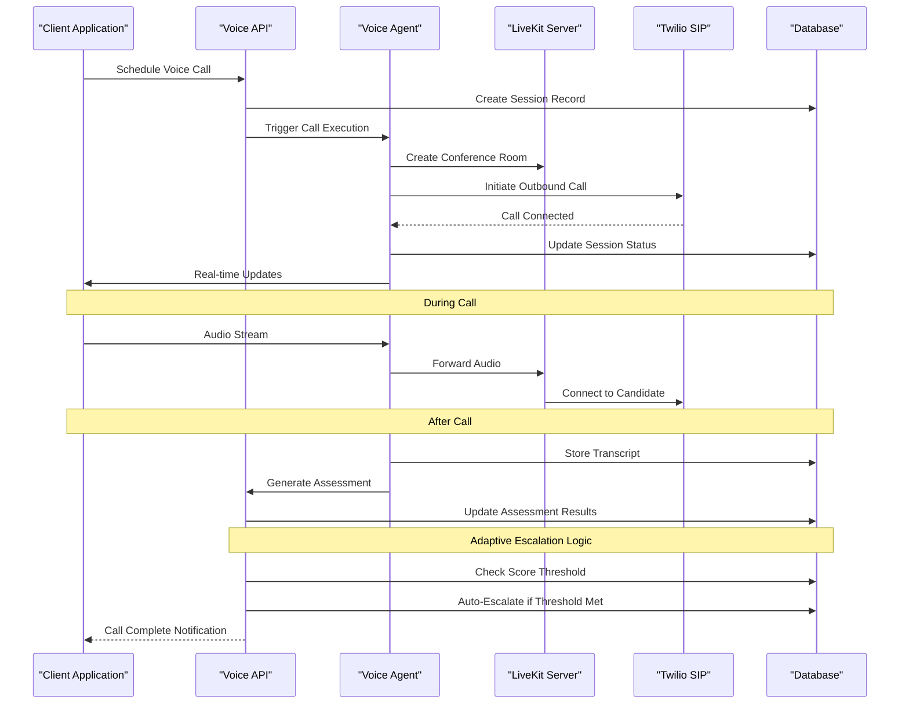
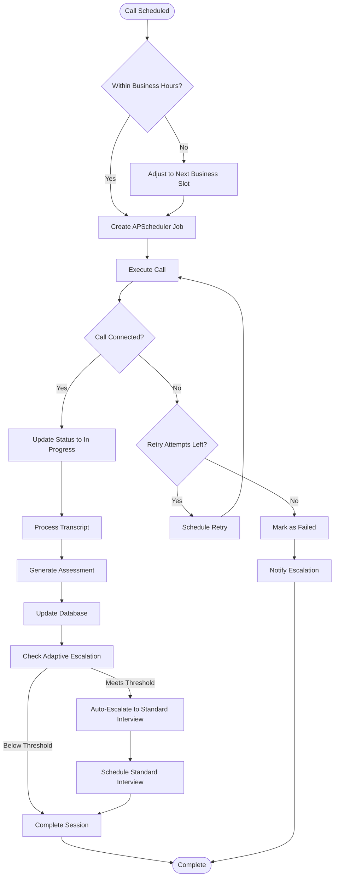
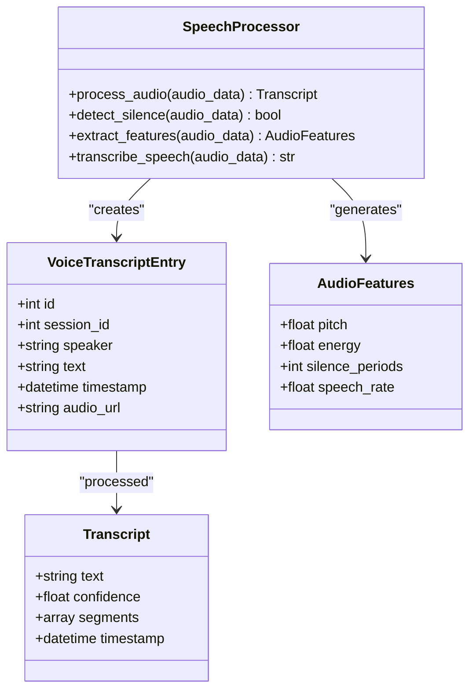
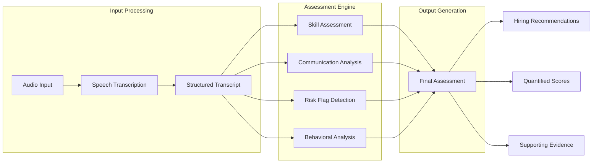
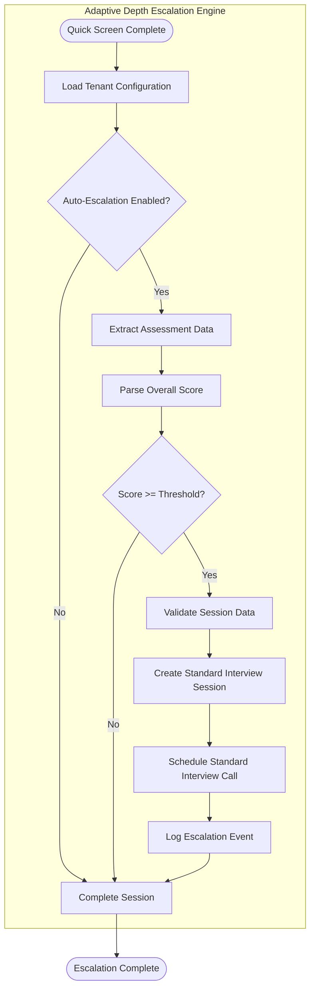
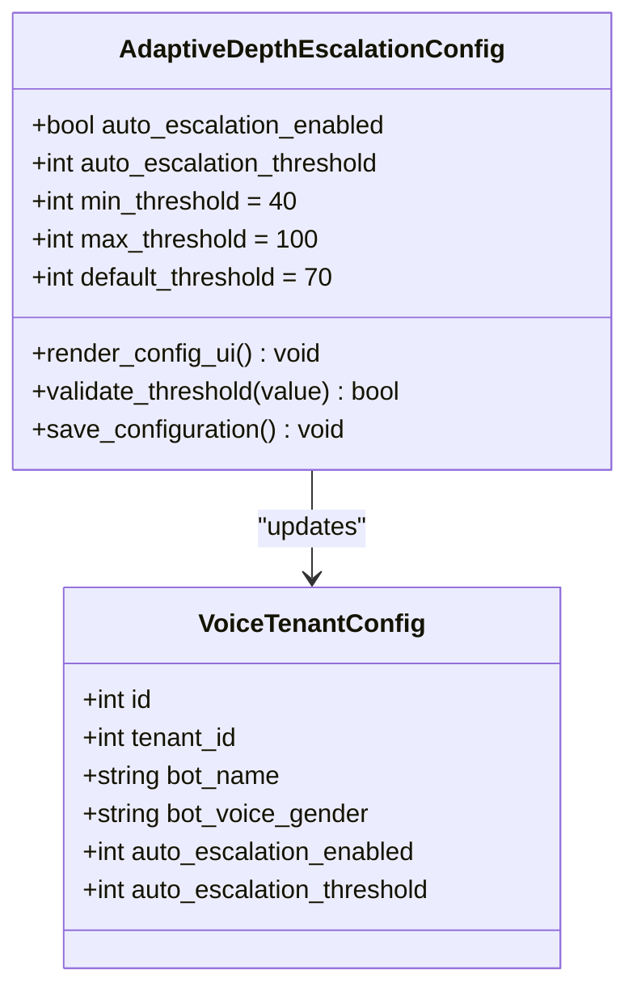
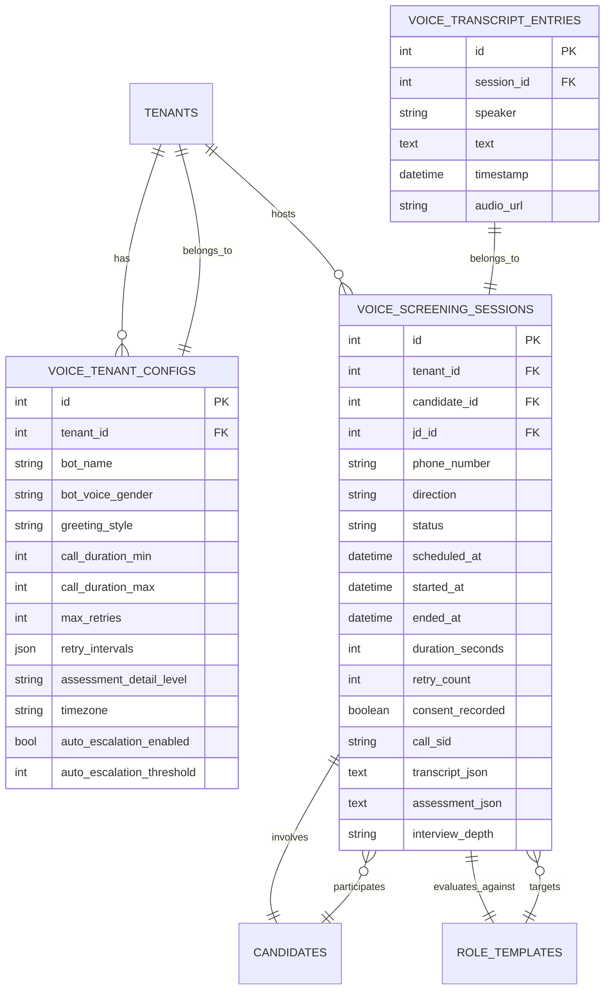
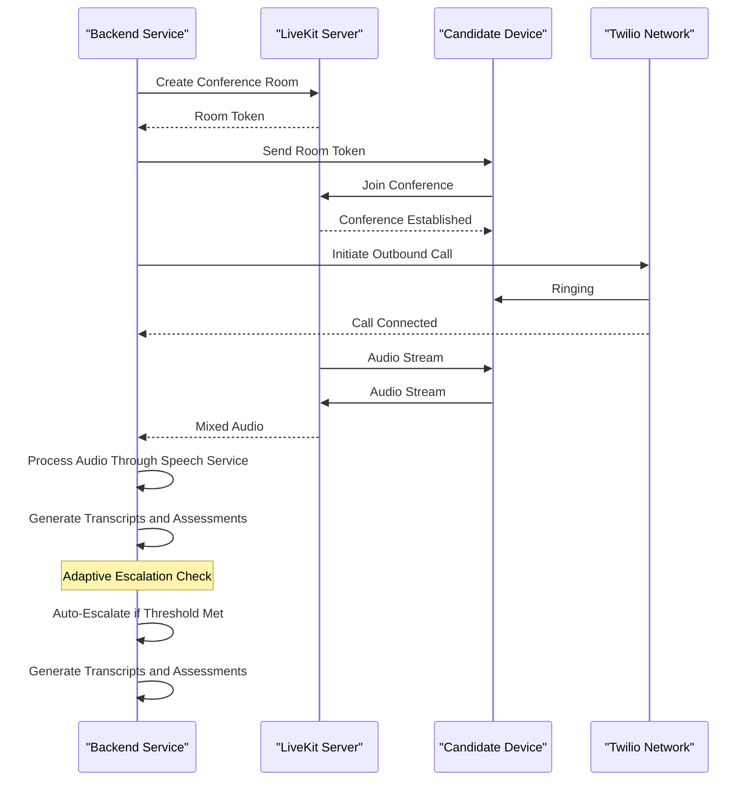

# Voice Screening System

<cite>
**Referenced Files in This Document**
- [README.md](file://README.md)
- [main.py](file://app/backend/main.py)
- [voice.py](file://app/backend/routes/voice.py)
- [interviews.py](file://app/backend/routes/interviews.py)
- [voice_call_scheduler.py](file://app/backend/services/voice_call_scheduler.py)
- [voice_screening_service.py](file://app/backend/services/voice_screening_service.py)
- [db_models.py](file://app/backend/models/db_models.py)
- [schemas.py](file://app/backend/models/schemas.py)
- [docker-compose.yml](file://docker-compose.yml)
- [requirements.txt](file://requirements.txt)
- [App.jsx](file://app/frontend/src/App.jsx)
- [VoiceScreeningPage.jsx](file://app/frontend/src/pages/VoiceScreeningPage.jsx)
- [InterviewPage.jsx](file://app/frontend/src/pages/InterviewPage.jsx)
- [Dockerfile](file://app/voice_agent/Dockerfile)
- [Dockerfile.livekit](file://app/voice_agent/Dockerfile.livekit)
- [047_adaptive_depth_escalation.py](file://alembic/versions/047_adaptive_depth_escalation.py)
</cite>

## Update Summary
**Changes Made**
- Added new adaptive depth escalation capabilities with auto_escalation_enabled and auto_escalation_threshold configuration fields
- Enhanced backend automation for intelligent interview depth management with automatic escalation logic
- Updated data models and API endpoints to support adaptive depth escalation
- Added frontend configuration interface for adaptive depth escalation settings
- Integrated automatic escalation from Quick Screen to Standard interviews based on score thresholds

## Table of Contents
1. [Introduction](#introduction)
2. [System Architecture](#system-architecture)
3. [Voice Screening Components](#voice-screening-components)
4. [Core Functionality](#core-functionality)
5. [Adaptive Depth Escalation](#adaptive-depth-escalation)
6. [Data Models](#data-models)
7. [API Endpoints](#api-endpoints)
8. [Configuration Management](#configuration-management)
9. [Integration Architecture](#integration-architecture)
10. [Performance Considerations](#performance-considerations)
11. [Troubleshooting Guide](#troubleshooting-guide)
12. [Conclusion](#conclusion)

## Introduction

The Voice Screening System is a comprehensive AI-powered telephone screening solution integrated into the ARIA AI Resume Intelligence platform. This system enables organizations to automate initial candidate screening through intelligent voice conversations, leveraging advanced AI technologies for natural language processing, speech recognition, and automated assessment generation.

The system operates as part of a multi-tenant SaaS architecture, providing secure, self-hosted voice screening capabilities with full data privacy controls. It integrates seamlessly with the broader ARIA platform, offering consistent user experiences across resume analysis, video interviews, and voice screening functionalities.

**Updated** Enhanced with adaptive depth escalation capabilities that intelligently escalate promising candidates from Quick Screen to Standard interviews based on automated scoring thresholds.

## System Architecture

The Voice Screening System follows a distributed microservices architecture with clear separation of concerns between voice processing, scheduling, and orchestration components.

```mermaid
graph TB
subgraph "Client Layer"
FE[Frontend Application]
Browser[Web Browser]
end
subgraph "API Gateway"
API[FastAPI Backend]
Nginx[Nginx Reverse Proxy]
end
subgraph "Voice Processing Services"
VoiceAgent[Voice Agent Service]
LiveKit[LiveKit Server]
SpeechService[Speech Processing Service]
End
subgraph "Core Services"
Scheduler[Voice Call Scheduler]
LLM[Ollama LLM Service]
Database[(PostgreSQL Database)]
AutoEscalation[Adaptive Depth Escalation Engine]
end
subgraph "External Integrations"
Twilio[Twilio SIP Trunking]
Storage[File Storage]
end
FE --> Browser
Browser --> Nginx
Nginx --> API
API --> VoiceAgent
VoiceAgent --> LiveKit
VoiceAgent --> SpeechService
VoiceAgent --> Twilio
API --> Scheduler
API --> LLM
API --> Database
API --> AutoEscalation
VoiceAgent --> Database
Scheduler --> Database
LLM --> Database
AutoEscalation --> Database
API --> Storage
VoiceAgent --> Storage
```

**Diagram sources**
- [docker-compose.yml:110-175](file://docker-compose.yml#L110-L175)
- [main.py:360-448](file://app/backend/main.py#L360-L448)
- [047_adaptive_depth_escalation.py:14-36](file://alembic/versions/047_adaptive_depth_escalation.py#L14-L36)

The architecture consists of several key layers:

- **Presentation Layer**: React-based frontend with real-time voice screening interface and adaptive depth escalation configuration
- **API Layer**: FastAPI backend serving REST endpoints and WebSocket connections with adaptive depth escalation logic
- **Voice Processing Layer**: Specialized services for call orchestration and speech processing
- **Intelligent Automation Layer**: New adaptive depth escalation engine that automatically escalates high-performing candidates
- **Data Layer**: PostgreSQL database with comprehensive voice screening data models including adaptive depth escalation configuration
- **External Integration Layer**: LiveKit for WebRTC, Twilio for PSTN connectivity, Ollama for AI processing

## Voice Screening Components

### Voice Agent Service

The Voice Agent Service acts as the central orchestrator for all voice screening operations. It manages call lifecycle, coordinates with external services, and maintains conversation state throughout the screening process.



**Diagram sources**
- [voice_call_scheduler.py:138-231](file://app/backend/services/voice_call_scheduler.py#L138-L231)
- [voice.py:110-160](file://app/backend/routes/voice.py#L110-L160)
- [interviews.py:934-991](file://app/backend/routes/interviews.py#L934-L991)

### Voice Call Scheduler

The scheduler component handles all timing and retry logic for voice screening calls using APScheduler for reliable job management and timezone-aware scheduling.



**Diagram sources**
- [voice_call_scheduler.py:235-334](file://app/backend/services/voice_call_scheduler.py#L235-L334)
- [voice_call_scheduler.py:48-134](file://app/backend/services/voice_call_scheduler.py#L48-L134)
- [interviews.py:1093-1103](file://app/backend/routes/interviews.py#L1093-L1103)

### Speech Processing Service

The speech processing service handles real-time audio transcription and voice activity detection using specialized AI models optimized for telephony applications.



**Diagram sources**
- [voice_screening_service.py:35-100](file://app/backend/services/voice_screening_service.py#L35-L100)
- [db_models.py:946-961](file://app/backend/models/db_models.py#L946-L961)

## Core Functionality

### Automated Call Scheduling

The system provides sophisticated call scheduling with business hours enforcement, timezone support, and intelligent retry mechanisms.

**Key Features:**
- Business hours validation with timezone-aware calculations
- Automatic retry logic with configurable intervals (24h, 48h, escalation)
- Concurrent call handling with resource management
- Real-time status updates and notifications
- CSV export capabilities for reporting

### Intelligent Assessment Generation

The voice screening system generates comprehensive assessments using AI-powered analysis of candidate responses.



**Diagram sources**
- [voice_screening_service.py:166-280](file://app/backend/services/voice_screening_service.py#L166-L280)

### Real-time Conversation Management

The system supports dynamic conversation flow with adaptive questioning based on candidate responses and predefined assessment criteria.

**Conversation Features:**
- Adaptive question generation from job requirements
- Real-time answer quality evaluation
- Context-aware follow-up prompts
- Multi-dimensional assessment scoring
- Consent recording and compliance tracking

## Adaptive Depth Escalation

**New Feature**: The system now includes intelligent adaptive depth escalation capabilities that automatically escalate high-performing candidates from Quick Screen to Standard interviews based on configurable score thresholds.

### Escalation Logic

The adaptive depth escalation system operates through the following intelligent workflow:



**Diagram sources**
- [interviews.py:934-991](file://app/backend/routes/interviews.py#L934-L991)
- [interviews.py:1093-1103](file://app/backend/routes/interviews.py#L1093-L1103)

### Configuration Options

Organizations can configure adaptive depth escalation through comprehensive settings:

**Configuration Fields:**
- `auto_escalation_enabled`: Boolean flag to enable/disable automatic escalation
- `auto_escalation_threshold`: Integer threshold score (0-100) for triggering escalation

**Default Values:**
- `auto_escalation_enabled`: `False` (disabled by default)
- `auto_escalation_threshold`: `70` (70% score threshold)

### Frontend Configuration Interface

The system provides an intuitive configuration interface for managing adaptive depth escalation settings:



**Diagram sources**
- [InterviewPage.jsx:731-774](file://app/frontend/src/pages/InterviewPage.jsx#L731-L774)
- [schemas.py:651-679](file://app/backend/models/schemas.py#L651-L679)

### Backend Implementation

The adaptive depth escalation logic is implemented in the backend with robust error handling and logging:

**Key Features:**
- Configurable threshold validation (40-100 scale)
- Automatic session creation for escalated interviews
- Proper call scheduling with 1-hour delay buffer
- Comprehensive logging and monitoring
- Graceful failure handling with fallback to standard processing

**Section sources**
- [interviews.py:934-991](file://app/backend/routes/interviews.py#L934-L991)
- [InterviewPage.jsx:731-774](file://app/frontend/src/pages/InterviewPage.jsx#L731-L774)
- [schemas.py:651-679](file://app/backend/models/schemas.py#L651-L679)
- [047_adaptive_depth_escalation.py:14-36](file://alembic/versions/047_adaptive_depth_escalation.py#L14-L36)

## Data Models

The voice screening system utilizes a comprehensive set of data models to track call sessions, configurations, and assessment results.



**Diagram sources**
- [db_models.py:876-961](file://app/backend/models/db_models.py#L876-L961)
- [db_models.py:901-903](file://app/backend/models/db_models.py#L901-L903)

### Configuration Management

Each tenant can configure voice screening behavior through comprehensive settings that control bot personality, scheduling preferences, and assessment parameters.

**Configuration Categories:**
- **Bot Personality**: Voice gender, greeting style, bot name
- **Call Scheduling**: Business hours, allowed days, timezone
- **Call Behavior**: Duration limits, retry policies, escalation contacts
- **Assessment Settings**: Detail level, follow-up aggressiveness
- **Compliance**: Consent scripts, caller ID settings
- **Adaptive Depth Escalation**: Auto-escalation enablement and score thresholds

**Updated** Added adaptive depth escalation configuration fields for intelligent interview depth management.

**Section sources**
- [db_models.py:901-903](file://app/backend/models/db_models.py#L901-L903)
- [schemas.py:651-679](file://app/backend/models/schemas.py#L651-L679)

## API Endpoints

The voice screening system exposes a comprehensive REST API for managing voice screening operations.

### Voice Settings Management

| Method | Endpoint | Description |
|--------|----------|-------------|
| GET | `/api/voice/settings` | Retrieve tenant voice screening configuration |
| PUT | `/api/voice/settings` | Update voice screening configuration |

### Call Scheduling Operations

| Method | Endpoint | Description |
|--------|----------|-------------|
| POST | `/api/voice/schedule` | Schedule a new voice screening call |
| GET | `/api/voice/sessions` | List voice screening sessions |
| GET | `/api/voice/sessions/{id}` | Get session details with transcript |
| POST | `/api/voice/sessions/{id}/reschedule` | Reschedule an existing call |
| POST | `/api/voice/sessions/{id}/cancel` | Cancel a scheduled call |
| POST | `/api/voice/sessions/bulk-cancel` | Cancel multiple calls |

### Analytics and Reporting

| Method | Endpoint | Description |
|--------|----------|-------------|
| GET | `/api/voice/sessions/analytics` | Get voice screening analytics |
| GET | `/api/voice/sessions/export` | Export sessions as CSV |
| GET | `/api/voice/next-slot` | Get next available call slot |

### Internal Service Endpoints

| Method | Endpoint | Description |
|--------|----------|-------------|
| GET | `/api/voice/internal/config/{tenant_id}` | Internal configuration retrieval |
| GET | `/api/voice/internal/candidate/{tenant_id}/{candidate_id}` | Internal candidate information |
| PATCH | `/api/voice/sessions/{session_id}` | Internal session updates |

### Interview Management Endpoints

**Updated** Added new endpoints for interview depth management and adaptive escalation:

| Method | Endpoint | Description |
|--------|----------|-------------|
| POST | `/api/interviews/sessions` | Create unified interview session |
| GET | `/api/interviews/sessions/{id}` | Get interview session details |
| POST | `/api/interviews/sessions/{id}/complete` | Complete interview session |
| POST | `/api/interviews/sessions/{id}/escalate` | Manually escalate interview depth |

**Section sources**
- [voice.py:1-658](file://app/backend/routes/voice.py#L1-L658)
- [interviews.py:934-991](file://app/backend/routes/interviews.py#L934-L991)

## Configuration Management

The voice screening system provides extensive configuration options through environment variables and database-driven settings.

### Environment Configuration

| Variable | Description | Default |
|----------|-------------|---------|
| `VOICE_AGENT_URL` | Voice agent service endpoint | `http://voice-agent:8002` |
| `LIVEKIT_API_KEY` | LiveKit server API key | `devkey` |
| `LIVEKIT_API_SECRET` | LiveKit server API secret | `devsecret` |
| `SIP_TRUNK_ID` | Twilio SIP trunk identifier | `twilio-aria` |
| `SIP_OUTBOUND_NUMBER` | Outbound call phone number | `+18722789563` |

### Database Configuration

The system stores configuration data in the database with tenant isolation ensuring each organization can customize settings independently.

**Configuration Fields:**
- Bot identity and presentation settings
- Business hours and scheduling preferences  
- Call behavior and retry policies
- Assessment parameters and detail levels
- Compliance and legal requirements
- **Adaptive depth escalation settings**: Auto-escalation enablement and score thresholds

**Updated** Added adaptive depth escalation configuration fields for intelligent interview depth management.

**Section sources**
- [docker-compose.yml:149-175](file://docker-compose.yml#L149-L175)
- [db_models.py:876-905](file://app/backend/models/db_models.py#L876-L905)
- [db_models.py:901-903](file://app/backend/models/db_models.py#L901-L903)

## Integration Architecture

### LiveKit Integration

The system integrates with LiveKit for WebRTC-based voice communication, providing robust conference capabilities and real-time audio streaming.



**Diagram sources**
- [docker-compose.yml:114-135](file://docker-compose.yml#L114-L135)
- [voice_call_scheduler.py:189-220](file://app/backend/services/voice_call_scheduler.py#L189-L220)
- [interviews.py:1093-1103](file://app/backend/routes/interviews.py#L1093-L1103)

### Twilio Integration

Twilio provides PSTN connectivity for outbound calling capabilities, enabling the system to reach candidates via traditional phone networks.

**Integration Features:**
- SIP trunking for outbound calls
- Call recording and compliance
- Call status tracking and callbacks
- Number masking and branding
- International calling support

### Ollama Integration

The system leverages Ollama for AI-powered voice processing, including speech-to-text conversion, sentiment analysis, and assessment generation.

**AI Capabilities:**
- Real-time speech transcription
- Natural language understanding
- Assessment scoring and categorization
- Context-aware conversation management

**Section sources**
- [docker-compose.yml:24-51](file://docker-compose.yml#L24-L51)
- [voice_screening_service.py:35-100](file://app/backend/services/voice_screening_service.py#L35-L100)

## Performance Considerations

### Scalability Architecture

The voice screening system is designed for horizontal scalability with clear separation of concerns allowing independent scaling of different components.

**Scalability Factors:**
- **Database**: PostgreSQL with connection pooling and indexing strategies
- **Voice Processing**: Containerized services with resource limits
- **API Layer**: Stateless design supporting multiple instances
- **External Services**: Rate limiting and circuit breaker patterns
- **Adaptive Escalation Engine**: Background processing for automatic escalation

### Resource Management

The system implements comprehensive resource management to handle varying loads and ensure optimal performance.

**Resource Controls:**
- Memory limits for speech processing containers
- Connection pooling for database connections
- Throttling for external API calls
- Queue management for background processing
- **Adaptive Escalation**: Background task scheduling for automatic escalation

### Monitoring and Observability

Comprehensive monitoring is implemented across all system components to ensure reliability and performance tracking.

**Monitoring Components:**
- Health checks for all services
- Performance metrics collection
- Error tracking and alerting
- Usage analytics and reporting
- **Adaptive Escalation**: Escalation event tracking and threshold monitoring

**Section sources**
- [interviews.py:934-991](file://app/backend/routes/interviews.py#L934-L991)

## Troubleshooting Guide

### Common Issues and Solutions

**Voice Call Failures**
- **Symptom**: Calls not connecting or failing immediately
- **Causes**: SIP trunk configuration, firewall restrictions, authentication issues
- **Solutions**: Verify Twilio credentials, check network connectivity, validate phone number formatting

**Transcription Quality Issues**
- **Symptom**: Poor audio quality or missing transcripts
- **Causes**: Audio compression, background noise, codec mismatches
- **Solutions**: Adjust audio settings, improve call conditions, verify speech service configuration

**Scheduler Problems**
- **Symptom**: Calls not scheduled or delayed
- **Causes**: Timezone configuration, business hours conflicts, scheduler downtime
- **Solutions**: Verify timezone settings, check business hours configuration, restart scheduler service

**Adaptive Escalation Issues**
- **Symptom**: High-scoring candidates not being escalated
- **Causes**: Auto-escalation disabled, incorrect threshold settings, assessment generation failures
- **Solutions**: Enable auto-escalation, adjust threshold values, verify assessment data integrity

### Diagnostic Commands

**Service Health Checks:**
```bash
# Check voice agent status
docker-compose ps voice-agent

# Verify LiveKit connectivity
curl http://localhost:7880

# Test Ollama availability
curl http://localhost:11434/api/tags
```

**Database Connectivity:**
```bash
# Verify PostgreSQL connection
docker-compose exec postgres psql -U aria -d aria_db -c "SELECT 1"

# Check voice screening tables
docker-compose exec postgres psql -U aria -d aria_db -c "SELECT COUNT(*) FROM voice_screening_sessions"

# Verify adaptive escalation configuration
docker-compose exec postgres psql -U aria -d aria_db -c "SELECT auto_escalation_enabled, auto_escalation_threshold FROM voice_tenant_configs"
```

### Log Analysis

**Important Log Locations:**
- Backend service logs: `/var/log/aria/backend.log`
- Voice agent logs: `/var/log/aria/voice-agent.log`
- LiveKit server logs: `/var/log/livekit/server.log`
- Speech service logs: `/var/log/aria/speech-service.log`

**Common Log Patterns:**
- `ERROR`: Indicates service failures requiring immediate attention
- `WARNING`: Configuration issues or potential problems
- `INFO`: Normal operational messages and status updates
- `DEBUG`: Detailed troubleshooting information
- **Adaptive Escalation**: Escalation events and threshold validation logs

**Section sources**
- [main.py:461-699](file://app/backend/main.py#L461-L699)
- [voice_call_scheduler.py:518-604](file://app/backend/services/voice_call_scheduler.py#L518-L604)
- [interviews.py:934-991](file://app/backend/routes/interviews.py#L934-L991)

## Conclusion

The Voice Screening System represents a sophisticated integration of modern AI technologies, real-time communication protocols, and enterprise-grade infrastructure. By leveraging LiveKit for WebRTC communications, Twilio for PSTN connectivity, and Ollama for AI processing, the system delivers a comprehensive solution for automated candidate screening.

**Enhanced** The system now includes intelligent adaptive depth escalation capabilities that automatically escalate high-performing candidates from Quick Screen to Standard interviews based on configurable score thresholds, significantly improving the efficiency and effectiveness of the screening process.

The multi-tenant architecture ensures data privacy and isolation while maintaining flexibility for organizational customization. The comprehensive API, robust scheduling system, intelligent assessment capabilities, and adaptive depth escalation provide recruiters with powerful tools for efficient candidate evaluation.

Key strengths of the system include:
- **Data Privacy**: All processing occurs within the organization's infrastructure
- **Scalability**: Containerized architecture supporting horizontal scaling
- **Flexibility**: Extensive configuration options for different organizational needs
- **Reliability**: Robust error handling and retry mechanisms
- **Intelligence**: Adaptive depth escalation for optimized candidate evaluation
- **Integration**: Seamless integration with existing HR workflows and tools

The system continues to evolve with ongoing improvements to AI capabilities, user experience enhancements, expanded integration options, and intelligent automation features like adaptive depth escalation, positioning it as a leading solution for modern recruitment automation needs.