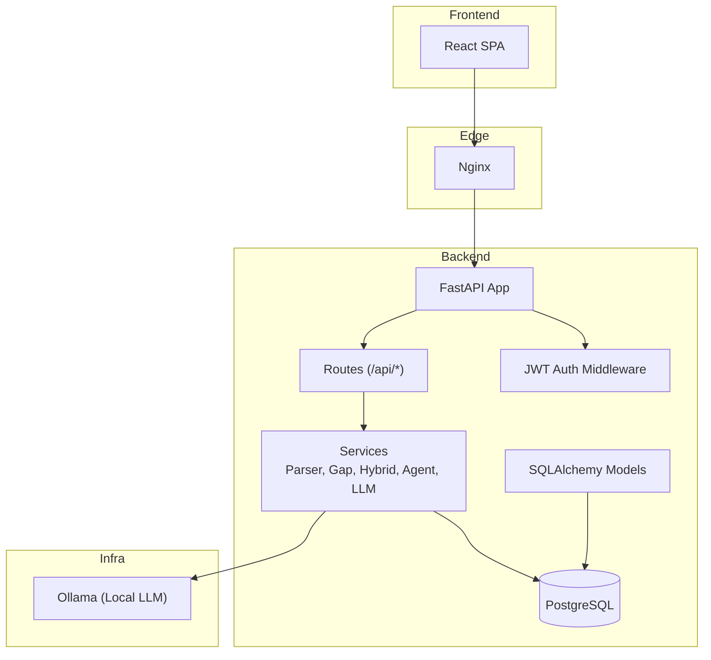
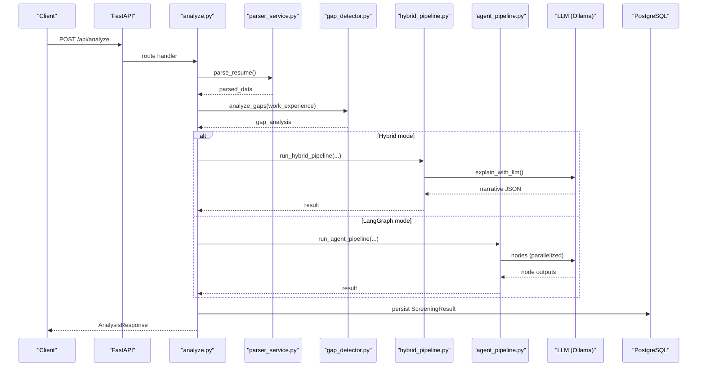
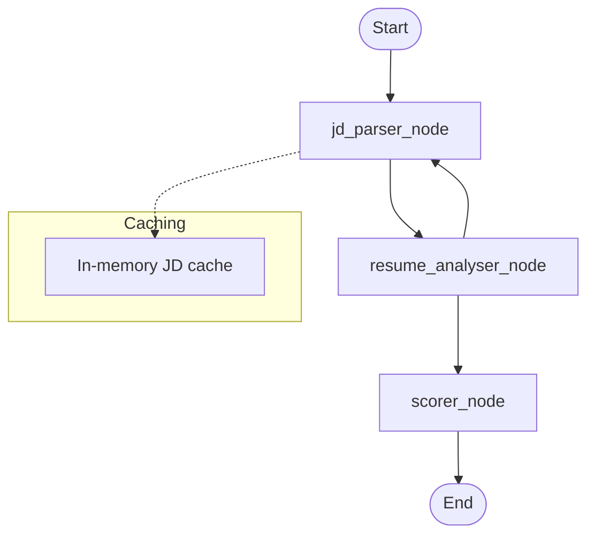
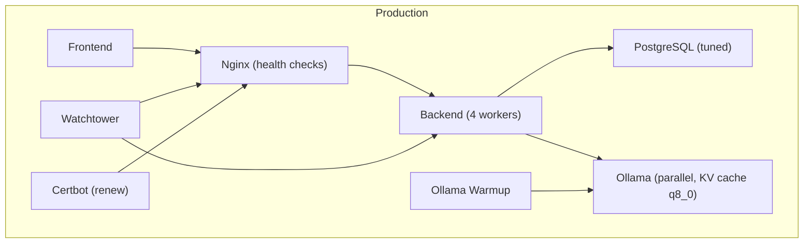
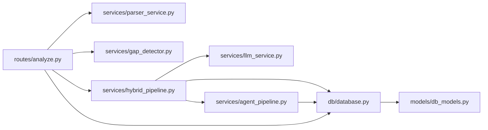

# Advanced Topics

<cite>
**Referenced Files in This Document**
- [README.md](file://README.md)
- [main.py](file://app/backend/main.py)
- [database.py](file://app/backend/db/database.py)
- [analysis_service.py](file://app/backend/services/analysis_service.py)
- [agent_pipeline.py](file://app/backend/services/agent_pipeline.py)
- [llm_service.py](file://app/backend/services/llm_service.py)
- [hybrid_pipeline.py](file://app/backend/services/hybrid_pipeline.py)
- [gap_detector.py](file://app/backend/services/gap_detector.py)
- [parser_service.py](file://app/backend/services/parser_service.py)
- [db_models.py](file://app/backend/models/db_models.py)
- [analyze.py](file://app/backend/routes/analyze.py)
- [auth.py](file://app/backend/middleware/auth.py)
- [subscription.py](file://app/backend/routes/subscription.py)
- [001_enrich_candidates_add_caches.py](file://alembic/versions/001_enrich_candidates_add_caches.py)
- [docker-compose.yml](file://docker-compose.yml)
- [docker-compose.prod.yml](file://docker-compose.prod.yml)
</cite>

## Table of Contents
1. [Introduction](#introduction)
2. [Project Structure](#project-structure)
3. [Core Components](#core-components)
4. [Architecture Overview](#architecture-overview)
5. [Detailed Component Analysis](#detailed-component-analysis)
6. [Dependency Analysis](#dependency-analysis)
7. [Performance Considerations](#performance-considerations)
8. [Troubleshooting Guide](#troubleshooting-guide)
9. [Conclusion](#conclusion)
10. [Appendices](#appendices)

## Introduction
This document provides advanced topics for Resume AI by ThetaLogics, focusing on extending the platform with custom analysis strategies, skills registry enhancements, and AI model integration techniques. It also covers performance optimization, scaling, distributed processing patterns, advanced LangGraph configurations, custom LLM adapters, ATS integrations, database and caching optimizations, security hardening, audit logging, compliance, and advanced deployment scenarios.

## Project Structure
The platform is a FastAPI backend with a React frontend, orchestrated by Docker and Nginx. The backend integrates:
- Document parsing and extraction (PDF/DOCX/legacy DOC/TXT/RTF/HTML/ODT)
- Gap detection and timeline scoring
- Skills registry with dynamic management
- Hybrid pipeline combining deterministic scoring and a single LLM narrative
- Optional LangGraph multi-agent pipeline for advanced orchestration
- Subscription and usage tracking for multi-tenant billing
- Database migrations and caching tables

**Diagram sources**
- [docker-compose.yml:1-101](file://docker-compose.yml#L1-L101)
- [docker-compose.prod.yml:1-227](file://docker-compose.prod.yml#L1-L227)
- [main.py:174-215](file://app/backend/main.py#L174-L215)
- [analyze.py:41-42](file://app/backend/routes/analyze.py#L41-L42)

**Section sources**
- [README.md:23-51](file://README.md#L23-L51)
- [docker-compose.yml:1-101](file://docker-compose.yml#L1-L101)
- [docker-compose.prod.yml:1-227](file://docker-compose.prod.yml#L1-L227)

## Core Components
- Document parsing and extraction: robust multi-format text extraction with fallbacks and Unicode normalization.
- Gap detection: date normalization, interval merging, objective gap classification, and timeline metadata.
- Skills registry: seeded master list, aliases, domain mapping, DB-backed persistence, and hot reload.
- Hybrid pipeline: Python-first deterministic scoring, followed by a single LLM call for narrative.
- LangGraph multi-agent pipeline: modular nodes for JD parsing, resume analysis, and scoring with streaming.
- LLM adapters: Ollama ChatOllama singletons, timeouts, and JSON parsing helpers.
- Subscription and usage: tenant-scoped plans, monthly limits, usage logs, and storage accounting.

**Section sources**
- [parser_service.py:1-552](file://app/backend/services/parser_service.py#L1-L552)
- [gap_detector.py:1-219](file://app/backend/services/gap_detector.py#L1-L219)
- [hybrid_pipeline.py:1-1498](file://app/backend/services/hybrid_pipeline.py#L1-L1498)
- [agent_pipeline.py:1-634](file://app/backend/services/agent_pipeline.py#L1-L634)
- [llm_service.py:1-156](file://app/backend/services/llm_service.py#L1-L156)
- [subscription.py:1-477](file://app/backend/routes/subscription.py#L1-L477)

## Architecture Overview
The system supports two analysis modes:
- Hybrid pipeline: deterministic Python scoring + single LLM narrative for cost and speed.
- LangGraph pipeline: multi-agent nodes with streaming and structured caching.

**Diagram sources**
- [analyze.py:268-501](file://app/backend/routes/analyze.py#L268-L501)
- [parser_service.py:547-552](file://app/backend/services/parser_service.py#L547-L552)
- [gap_detector.py:217-219](file://app/backend/services/gap_detector.py#L217-L219)
- [hybrid_pipeline.py:1353-1407](file://app/backend/services/hybrid_pipeline.py#L1353-L1407)
- [agent_pipeline.py:623-634](file://app/backend/services/agent_pipeline.py#L623-L634)

## Detailed Component Analysis

### Custom Analysis Strategies
- Extend scoring weights: pass a JSON-encoded map of weights to override defaults for skills, experience, architecture, education, timeline, domain, and risk.
- Add new determinstic signals: integrate additional risk signals, domain/architecture heuristics, or education multipliers in the hybrid pipeline.
- Introduce new LLM prompts: add new structured outputs and merge them into the final result schema.

Implementation pointers:
- Weight normalization and scoring: [hybrid_pipeline.py:953-1058](file://app/backend/services/hybrid_pipeline.py#L953-L1058)
- Streaming and non-streaming orchestrators: [hybrid_pipeline.py:1353-1497](file://app/backend/services/hybrid_pipeline.py#L1353-L1497)
- LangGraph node composition: [agent_pipeline.py:520-540](file://app/backend/services/agent_pipeline.py#L520-L540)

**Section sources**
- [hybrid_pipeline.py:953-1058](file://app/backend/services/hybrid_pipeline.py#L953-L1058)
- [hybrid_pipeline.py:1353-1497](file://app/backend/services/hybrid_pipeline.py#L1353-L1497)
- [agent_pipeline.py:520-540](file://app/backend/services/agent_pipeline.py#L520-L540)

### Skills Registry Extension
- Seed and load skills from DB or fallback to master list.
- Hot-reload skills without restart.
- Manage aliases and domain mapping.

Key APIs:
- Upsert master skills and map domains: [hybrid_pipeline.py:350-375](file://app/backend/services/hybrid_pipeline.py#L350-L375)
- Load active skills into an in-memory flashtext processor: [hybrid_pipeline.py:381-406](file://app/backend/services/hybrid_pipeline.py#L381-L406)
- Hot-reload: [hybrid_pipeline.py:408-411](file://app/backend/services/hybrid_pipeline.py#L408-L411)
- Aliases and domain keywords: [hybrid_pipeline.py:184-317](file://app/backend/services/hybrid_pipeline.py#L184-L317)

**Section sources**
- [hybrid_pipeline.py:350-411](file://app/backend/services/hybrid_pipeline.py#L350-L411)
- [hybrid_pipeline.py:184-317](file://app/backend/services/hybrid_pipeline.py#L184-L317)

### AI Model Integration Techniques
- Ollama ChatOllama singletons for reuse and keep-alive sessions.
- JSON parsing helpers and fallback narratives.
- Environment-driven model selection and timeouts.

Patterns:
- Singleton LLM creation and reuse: [agent_pipeline.py:70-99](file://app/backend/services/agent_pipeline.py#L70-L99)
- JSON parsing and fallback: [agent_pipeline.py:125-138](file://app/backend/services/agent_pipeline.py#L125-L138)
- Streaming with heartbeat pings: [hybrid_pipeline.py:1410-1497](file://app/backend/services/hybrid_pipeline.py#L1410-L1497)
- LLM adapter with retries and validation: [llm_service.py:1-156](file://app/backend/services/llm_service.py#L1-L156)

**Section sources**
- [agent_pipeline.py:70-99](file://app/backend/services/agent_pipeline.py#L70-L99)
- [agent_pipeline.py:125-138](file://app/backend/services/agent_pipeline.py#L125-L138)
- [hybrid_pipeline.py:1410-1497](file://app/backend/services/hybrid_pipeline.py#L1410-L1497)
- [llm_service.py:1-156](file://app/backend/services/llm_service.py#L1-L156)

### Advanced LangGraph Configurations
- Three-stage pipeline: JD parser → combined resume analyser → combined scorer.
- Parallelizable nodes with structured caching and in-memory JD cache.
- Streaming with SSE and heartbeat pings.

**Diagram sources**
- [agent_pipeline.py:520-540](file://app/backend/services/agent_pipeline.py#L520-L540)
- [agent_pipeline.py:161-180](file://app/backend/services/agent_pipeline.py#L161-L180)

**Section sources**
- [agent_pipeline.py:1-634](file://app/backend/services/agent_pipeline.py#L1-L634)

### Custom LLM Adapters
- Adapter pattern: wrap LLM calls behind a service interface.
- Robust JSON parsing and fallbacks.
- Timeouts and concurrency control via semaphores.

Examples:
- LLMService with retries and validation: [llm_service.py:7-156](file://app/backend/services/llm_service.py#L7-L156)
- Hybrid pipeline LLM singleton and semaphore: [hybrid_pipeline.py:24-32](file://app/backend/services/hybrid_pipeline.py#L24-L32), [hybrid_pipeline.py:45-66](file://app/backend/services/hybrid_pipeline.py#L45-L66)

**Section sources**
- [llm_service.py:7-156](file://app/backend/services/llm_service.py#L7-L156)
- [hybrid_pipeline.py:24-66](file://app/backend/services/hybrid_pipeline.py#L24-L66)

### Integration with External ATS Systems
- Candidate deduplication by email, file hash, and name+phone.
- Store parser snapshots and candidate profiles for reuse.
- Use role templates and screening results for historical comparisons.

References:
- Dedup logic and candidate profile storage: [analyze.py:147-214](file://app/backend/routes/analyze.py#L147-L214)
- Parser snapshot serialization: [analyze.py:109-116](file://app/backend/routes/analyze.py#L109-L116)
- Role templates and screening results: [db_models.py:151-165](file://app/backend/models/db_models.py#L151-L165), [db_models.py:128-147](file://app/backend/models/db_models.py#L128-L147)

**Section sources**
- [analyze.py:147-214](file://app/backend/routes/analyze.py#L147-L214)
- [analyze.py:109-116](file://app/backend/routes/analyze.py#L109-L116)
- [db_models.py:128-165](file://app/backend/models/db_models.py#L128-L165)

### Advanced Database Optimization, Caching, and Query Tuning
- PostgreSQL tuning in production (shared_buffers, work_mem, connections).
- Alembic migration adds skills and JD cache tables with indexes.
- In-app caches: JD cache, in-memory JD cache, and skills registry.

Recommendations:
- Use connection pooling and pool_pre_ping.
- Indexes on frequently filtered columns (e.g., candidates.resume_file_hash).
- Consider materialized views or summary tables for reporting.

**Section sources**
- [docker-compose.prod.yml:12-22](file://docker-compose.prod.yml#L12-L22)
- [001_enrich_candidates_add_caches.py:42-111](file://alembic/versions/001_enrich_candidates_add_caches.py#L42-L111)
- [database.py:1-33](file://app/backend/db/database.py#L1-L33)

### Security Hardening, Audit Logging, and Compliance
- JWT-based authentication with bearer scheme.
- Structured JSON logging for analysis events.
- Usage logs for audit trails.

References:
- JWT middleware: [auth.py:1-47](file://app/backend/middleware/auth.py#L1-L47)
- Structured analysis logs: [analyze.py:491-501](file://app/backend/routes/analyze.py#L491-L501), [analyze.py:628-636](file://app/backend/routes/analyze.py#L628-L636)
- Usage logging: [subscription.py:427-477](file://app/backend/routes/subscription.py#L427-L477)

**Section sources**
- [auth.py:1-47](file://app/backend/middleware/auth.py#L1-L47)
- [analyze.py:491-501](file://app/backend/routes/analyze.py#L491-L501)
- [analyze.py:628-636](file://app/backend/routes/analyze.py#L628-L636)
- [subscription.py:427-477](file://app/backend/routes/subscription.py#L427-L477)

### Extending Platform with Custom Modules and Formats
- Adding new resume formats: extend parser_service with new extraction logic.
- Custom analysis modules: integrate new scoring components into the hybrid pipeline.
- Visualization components: render new fields from analysis results in the frontend.

References:
- Resume parsers and formats: [parser_service.py:1-552](file://app/backend/services/parser_service.py#L1-L552)
- Hybrid pipeline result assembly: [hybrid_pipeline.py:566-618](file://app/backend/services/hybrid_pipeline.py#L566-L618)
- Analysis route result shaping: [analyze.py:268-501](file://app/backend/routes/analyze.py#L268-L501)

**Section sources**
- [parser_service.py:1-552](file://app/backend/services/parser_service.py#L1-L552)
- [hybrid_pipeline.py:566-618](file://app/backend/services/hybrid_pipeline.py#L566-L618)
- [analyze.py:268-501](file://app/backend/routes/analyze.py#L268-L501)

### Advanced Deployment Scenarios, High Availability, and Disaster Recovery
- Production compose with tuned Postgres, Ollama, and backend workers.
- Watchtower auto-updates containers.
- Nginx health checks and warmup service to avoid cold-starts.
- Certbot renewal for SSL.

**Diagram sources**
- [docker-compose.prod.yml:7-227](file://docker-compose.prod.yml#L7-L227)

**Section sources**
- [docker-compose.prod.yml:1-227](file://docker-compose.prod.yml#L1-L227)

## Dependency Analysis
The backend orchestrates services and routes, with clear separation of concerns:
- Routes depend on services for parsing, gap detection, and analysis.
- Services depend on the database for persistence and on Ollama for LLM inference.
- Models define the schema for tenants, candidates, results, and caches.

**Diagram sources**
- [analyze.py:34-38](file://app/backend/routes/analyze.py#L34-L38)
- [parser_service.py:547-552](file://app/backend/services/parser_service.py#L547-L552)
- [gap_detector.py:217-219](file://app/backend/services/gap_detector.py#L217-L219)
- [hybrid_pipeline.py:1353-1407](file://app/backend/services/hybrid_pipeline.py#L1353-L1407)
- [agent_pipeline.py:623-634](file://app/backend/services/agent_pipeline.py#L623-L634)
- [database.py:1-33](file://app/backend/db/database.py#L1-L33)
- [db_models.py:1-250](file://app/backend/models/db_models.py#L1-L250)

**Section sources**
- [analyze.py:34-38](file://app/backend/routes/analyze.py#L34-L38)
- [hybrid_pipeline.py:1353-1407](file://app/backend/services/hybrid_pipeline.py#L1353-L1407)
- [agent_pipeline.py:623-634](file://app/backend/services/agent_pipeline.py#L623-L634)
- [database.py:1-33](file://app/backend/db/database.py#L1-L33)
- [db_models.py:1-250](file://app/backend/models/db_models.py#L1-L250)

## Performance Considerations
- Concurrency and throughput:
  - Backend workers: increase for I/O-bound workload.
  - Ollama parallelism: tune NUM_PARALLEL and thread counts.
  - Semaphores: limit concurrent LLM calls in hybrid pipeline.
- Memory and model loading:
  - Keep models hot with warmup service.
  - KV cache quantization (q8_0) to reduce RAM usage.
- Database:
  - Tune Postgres parameters for the target workload.
  - Use indexes on hot query filters.
- Parsing:
  - Prefer PyMuPDF over pdfplumber when available.
  - Unicode normalization to improve keyword matching.
- Streaming:
  - Use SSE with heartbeat pings to maintain long-lived connections.

[No sources needed since this section provides general guidance]

## Troubleshooting Guide
- Ollama not reachable or model not loaded:
  - Health checks and warmup service ensure readiness.
  - Increase LLM_NARRATIVE_TIMEOUT for cold-starts.
- Database locked errors:
  - SQLite concurrency limitations; consider PostgreSQL or retry logic.
- SSL certificate issues:
  - Renew certificates and restart Nginx.
- Startup checks and degraded status:
  - Review startup banner diagnostics for DB, skills registry, and Ollama.

**Section sources**
- [main.py:68-149](file://app/backend/main.py#L68-L149)
- [docker-compose.prod.yml:151-184](file://docker-compose.prod.yml#L151-L184)
- [README.md:339-355](file://README.md#L339-L355)

## Conclusion
This advanced guide outlined strategies to extend Resume AI with custom analysis modules, enhance the skills registry, integrate AI models, optimize performance and scaling, configure LangGraph, and implement robust security and compliance controls. The modular architecture supports incremental improvements and production-grade deployments.

[No sources needed since this section summarizes without analyzing specific files]

## Appendices

### Appendix A: Environment Variables and Tunables
- Ollama: base URL, model names, parallelism, flash attention, KV cache type.
- Backend: workers, timeouts, JWT secret, environment, startup required.
- Database: URL normalization and connection args.

**Section sources**
- [docker-compose.yml:59-69](file://docker-compose.yml#L59-L69)
- [docker-compose.prod.yml:81-95](file://docker-compose.prod.yml#L81-L95)
- [database.py:5-20](file://app/backend/db/database.py#L5-L20)

### Appendix B: Migration Notes
- Alembic revision adds candidate profile columns, JD cache, and skills tables with indexes.

**Section sources**
- [001_enrich_candidates_add_caches.py:42-111](file://alembic/versions/001_enrich_candidates_add_caches.py#L42-L111)