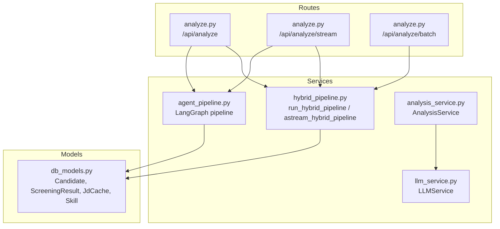
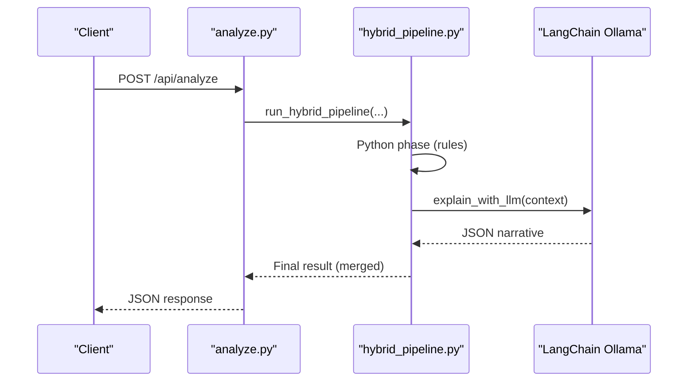
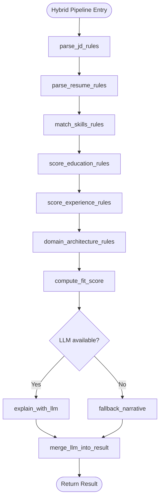
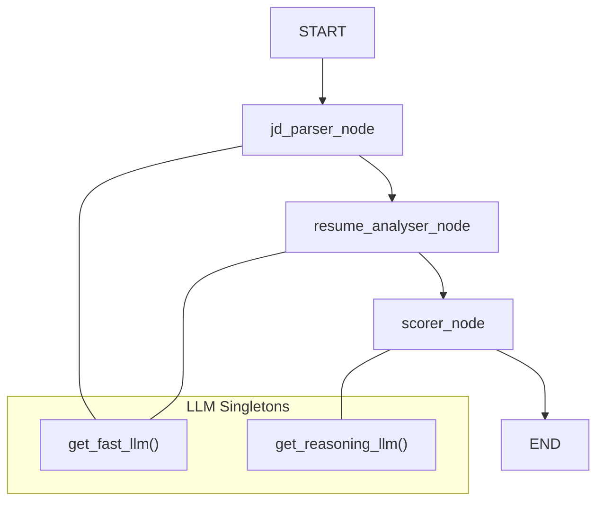
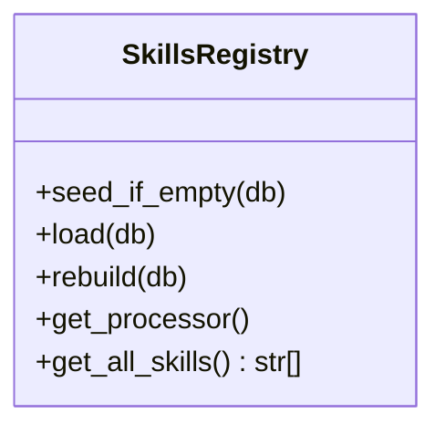
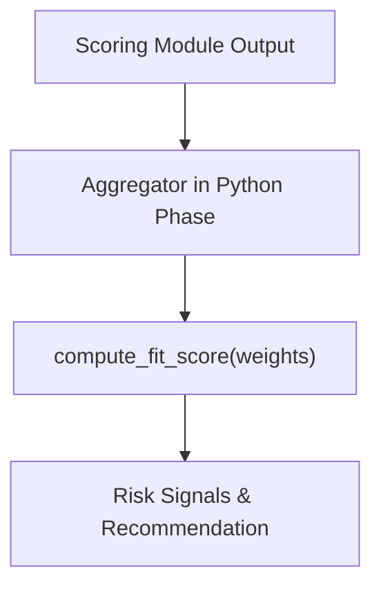
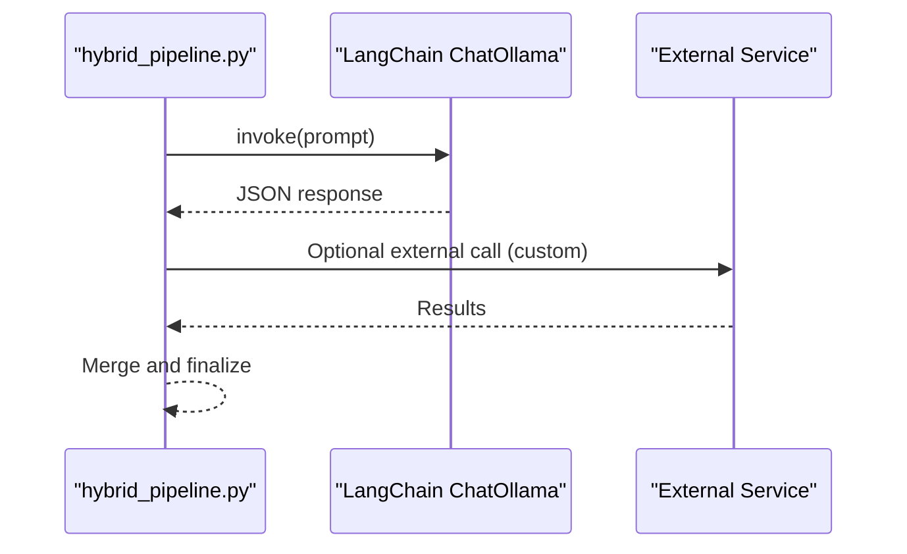
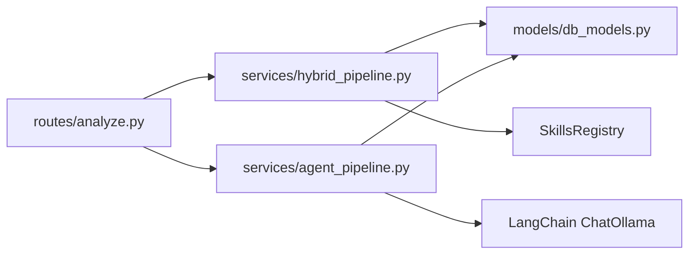

# Custom Analysis Strategies

<cite>
**Referenced Files in This Document**
- [hybrid_pipeline.py](file://app/backend/services/hybrid_pipeline.py)
- [agent_pipeline.py](file://app/backend/services/agent_pipeline.py)
- [llm_service.py](file://app/backend/services/llm_service.py)
- [analysis_service.py](file://app/backend/services/analysis_service.py)
- [analyze.py](file://app/backend/routes/analyze.py)
- [db_models.py](file://app/backend/models/db_models.py)
</cite>

## Table of Contents
1. [Introduction](#introduction)
2. [Project Structure](#project-structure)
3. [Core Components](#core-components)
4. [Architecture Overview](#architecture-overview)
5. [Detailed Component Analysis](#detailed-component-analysis)
6. [Dependency Analysis](#dependency-analysis)
7. [Performance Considerations](#performance-considerations)
8. [Troubleshooting Guide](#troubleshooting-guide)
9. [Conclusion](#conclusion)
10. [Appendices](#appendices)

## Introduction
This document explains how to extend Resume AI’s analysis engine with custom analysis strategies. It covers:
- Extending the hybrid pipeline with custom modules
- Implementing alternative scoring algorithms
- Building domain-specific analysis workflows
- Plugin patterns for skills and rule engines
- Integrating external analysis services
- Advanced LangGraph configurations for custom agent workflows
- Creating custom LLM adapters and reasoning chains
- Proprietary algorithm extensions
- Performance optimization, memory management, and compatibility guidelines

## Project Structure
Resume AI is organized around two complementary analysis pathways:
- A hybrid pipeline combining deterministic Python rules with a single LLM call for narrative
- A LangGraph multi-agent pipeline for fully LLM-driven analysis with streaming and fallbacks

Key modules:
- Services: hybrid pipeline, agent pipeline, LLM service, analysis service
- Routes: FastAPI endpoints orchestrating parsing, caching, deduplication, and persistence
- Models: SQLAlchemy ORM for tenant, candidate, screening results, and caches

**Diagram sources**
- [analyze.py:354-501](file://app/backend/routes/analyze.py#L354-L501)
- [hybrid_pipeline.py:1353-1407](file://app/backend/services/hybrid_pipeline.py#L1353-L1407)
- [agent_pipeline.py:520-540](file://app/backend/services/agent_pipeline.py#L520-L540)
- [llm_service.py:7-156](file://app/backend/services/llm_service.py#L7-L156)
- [analysis_service.py:6-121](file://app/backend/services/analysis_service.py#L6-L121)
- [db_models.py:97-147](file://app/backend/models/db_models.py#L97-L147)

**Section sources**
- [analyze.py:1-813](file://app/backend/routes/analyze.py#L1-L813)
- [hybrid_pipeline.py:1-1498](file://app/backend/services/hybrid_pipeline.py#L1-L1498)
- [agent_pipeline.py:1-634](file://app/backend/services/agent_pipeline.py#L1-L634)
- [llm_service.py:1-156](file://app/backend/services/llm_service.py#L1-L156)
- [analysis_service.py:1-121](file://app/backend/services/analysis_service.py#L1-L121)
- [db_models.py:1-250](file://app/backend/models/db_models.py#L1-L250)

## Core Components
- Hybrid pipeline: Python phase (rules-based scoring) + single LLM narrative call with fallback
- LangGraph pipeline: Modular nodes for JD parsing, resume analysis, and scoring with explainability
- LLM service: Generic adapter for Ollama with robust JSON parsing and fallbacks
- Analysis service: Legacy-style orchestration for simpler flows
- Routes: Deduplication, caching, streaming, and persistence

Key extension points:
- Skills registry and domain keyword maps
- Scoring weights normalization and fit computation
- LLM adapters and prompts
- Agent nodes and graph edges

**Section sources**
- [hybrid_pipeline.py:323-426](file://app/backend/services/hybrid_pipeline.py#L323-L426)
- [hybrid_pipeline.py:964-1058](file://app/backend/services/hybrid_pipeline.py#L964-L1058)
- [agent_pipeline.py:451-518](file://app/backend/services/agent_pipeline.py#L451-L518)
- [llm_service.py:7-156](file://app/backend/services/llm_service.py#L7-L156)
- [analysis_service.py:6-121](file://app/backend/services/analysis_service.py#L6-L121)
- [analyze.py:354-501](file://app/backend/routes/analyze.py#L354-L501)

## Architecture Overview
Two primary architectures coexist to support diverse analysis strategies:

1) Hybrid Pipeline
- Phase 1 (Python): JD parsing, resume profile building, skill matching, education and experience scoring, domain/architecture scoring, deterministic fit computation
- Phase 2 (LLM): Single narrative call generating strengths, weaknesses, explainability, and interview questions; fallback on timeout/error

2) LangGraph Pipeline
- Three-stage, sequential nodes with parallelizable components
- Fast LLM for extraction and combined analysis; reasoning LLM for scoring and explainability
- In-memory JD cache and singletons for LLM instances to reduce overhead

**Diagram sources**
- [analyze.py:354-501](file://app/backend/routes/analyze.py#L354-L501)
- [hybrid_pipeline.py:1353-1407](file://app/backend/services/hybrid_pipeline.py#L1353-L1407)
- [hybrid_pipeline.py:1144-1194](file://app/backend/services/hybrid_pipeline.py#L1144-L1194)

**Section sources**
- [hybrid_pipeline.py:1262-1333](file://app/backend/services/hybrid_pipeline.py#L1262-L1333)
- [agent_pipeline.py:520-540](file://app/backend/services/agent_pipeline.py#L520-L540)

## Detailed Component Analysis

### Hybrid Pipeline Extension Patterns
The hybrid pipeline is designed for extensibility:
- SkillsRegistry: centralized skill list with aliases and domain mapping; supports hot reload and DB-backed seeds
- Scoring modules: separate functions for education, experience, domain/architecture scoring; easy to replace or augment
- Fit computation: weight-normalized aggregation with risk signals and recommendations
- LLM narrative: single call with robust JSON parsing and deterministic fallback

Recommended extension points:
- Add new scoring modules by implementing a function similar to education/experience/domain_architecture scoring and plugging into the Python phase
- Extend SkillsRegistry with custom domains or aliases
- Override fit computation with custom weights or risk rules
- Swap LLM adapter by replacing the LLM singleton and prompt assembly

**Diagram sources**
- [hybrid_pipeline.py:1262-1333](file://app/backend/services/hybrid_pipeline.py#L1262-L1333)
- [hybrid_pipeline.py:1353-1407](file://app/backend/services/hybrid_pipeline.py#L1353-L1407)
- [hybrid_pipeline.py:1144-1194](file://app/backend/services/hybrid_pipeline.py#L1144-L1194)

**Section sources**
- [hybrid_pipeline.py:323-426](file://app/backend/services/hybrid_pipeline.py#L323-L426)
- [hybrid_pipeline.py:753-827](file://app/backend/services/hybrid_pipeline.py#L753-L827)
- [hybrid_pipeline.py:833-894](file://app/backend/services/hybrid_pipeline.py#L833-L894)
- [hybrid_pipeline.py:911-946](file://app/backend/services/hybrid_pipeline.py#L911-L946)
- [hybrid_pipeline.py:964-1058](file://app/backend/services/hybrid_pipeline.py#L964-L1058)
- [hybrid_pipeline.py:1144-1255](file://app/backend/services/hybrid_pipeline.py#L1144-L1255)

### LangGraph Pipeline Customization
The LangGraph pipeline offers modular customization:
- Nodes: JD parser, combined resume analyser, combined scorer
- Prompts: Strong schema enforcement with JSON-only outputs and fallbacks
- Weights: Normalized scoring weights configurable per run
- Fallbacks: Pure-math fallback when LLM calls fail

Customization strategies:
- Add new nodes for domain-specific reasoning or external API calls
- Modify prompts to inject proprietary reasoning chains
- Introduce parallel stages for specialized analyzers
- Tune singletons and caches for performance

**Diagram sources**
- [agent_pipeline.py:522-540](file://app/backend/services/agent_pipeline.py#L522-L540)
- [agent_pipeline.py:70-99](file://app/backend/services/agent_pipeline.py#L70-L99)

**Section sources**
- [agent_pipeline.py:141-180](file://app/backend/services/agent_pipeline.py#L141-L180)
- [agent_pipeline.py:280-322](file://app/backend/services/agent_pipeline.py#L280-L322)
- [agent_pipeline.py:367-448](file://app/backend/services/agent_pipeline.py#L367-L448)
- [agent_pipeline.py:451-518](file://app/backend/services/agent_pipeline.py#L451-L518)

### Skills Registry and Rule Engine Extensions
SkillsRegistry centralizes skill discovery and matching:
- Master skill list and aliases
- Domain keyword mapping
- DB-backed seed and hot reload
- FlashText-based extraction with regex fallback

Extending the registry:
- Seed new skills and domains via DB
- Add aliases for fuzzy matching
- Hot-reload skills without restart
- Integrate custom rule engines by replacing extraction logic

**Diagram sources**
- [hybrid_pipeline.py:323-426](file://app/backend/services/hybrid_pipeline.py#L323-L426)

**Section sources**
- [hybrid_pipeline.py:73-182](file://app/backend/services/hybrid_pipeline.py#L73-L182)
- [hybrid_pipeline.py:429-435](file://app/backend/services/hybrid_pipeline.py#L429-L435)
- [hybrid_pipeline.py:589-598](file://app/backend/services/hybrid_pipeline.py#L589-L598)

### Alternative Scoring Algorithms
Replace or augment scoring by:
- Implementing a new scoring module with a function signature similar to existing modules
- Plugging into the Python phase aggregator
- Using compute_fit_score with custom weights or risk rules
- Providing a pure-math fallback for streaming resilience

**Diagram sources**
- [hybrid_pipeline.py:1278-1296](file://app/backend/services/hybrid_pipeline.py#L1278-L1296)
- [hybrid_pipeline.py:964-1058](file://app/backend/services/hybrid_pipeline.py#L964-L1058)

**Section sources**
- [hybrid_pipeline.py:964-1058](file://app/backend/services/hybrid_pipeline.py#L964-L1058)

### Custom LLM Adapters and Reasoning Chains
Two approaches:
- Hybrid pipeline: LangChain ChatOllama singleton with tuned context sizes and JSON parsing
- Legacy service: Generic LLMService with robust JSON extraction and fallbacks

To customize:
- Replace LLM singleton initialization and prompt templates
- Inject domain-specific reasoning chains into prompts
- Add external service integrations within the LLM context

**Diagram sources**
- [hybrid_pipeline.py:45-66](file://app/backend/services/hybrid_pipeline.py#L45-L66)
- [hybrid_pipeline.py:1144-1194](file://app/backend/services/hybrid_pipeline.py#L1144-L1194)
- [llm_service.py:7-156](file://app/backend/services/llm_service.py#L7-L156)

**Section sources**
- [hybrid_pipeline.py:45-66](file://app/backend/services/hybrid_pipeline.py#L45-L66)
- [llm_service.py:7-156](file://app/backend/services/llm_service.py#L7-L156)

### Domain-Specific Workflows
- Use domain keyword maps to bias domain/architecture scoring
- Tailor prompts in the LangGraph pipeline for industry-specific reasoning
- Add domain-aware risk signals and recommendations
- Leverage in-memory JD cache for repeated screenings under the same role

**Section sources**
- [hybrid_pipeline.py:285-317](file://app/backend/services/hybrid_pipeline.py#L285-L317)
- [agent_pipeline.py:327-364](file://app/backend/services/agent_pipeline.py#L327-L364)

### Integration with External Analysis Services
- Hybrid pipeline: optional external calls within the narrative merge step
- LangGraph: add nodes for external APIs and merge results into state
- Robust error handling and fallbacks ensure reliability

**Section sources**
- [hybrid_pipeline.py:1336-1350](file://app/backend/services/hybrid_pipeline.py#L1336-L1350)
- [agent_pipeline.py:367-448](file://app/backend/services/agent_pipeline.py#L367-L448)

## Dependency Analysis
- Routes depend on services for parsing, gap analysis, and pipeline orchestration
- Hybrid pipeline depends on SkillsRegistry and scoring modules
- LangGraph pipeline depends on LLM singletons and prompt templates
- Persistence via SQLAlchemy models for candidates, screening results, JD cache, and skills

**Diagram sources**
- [analyze.py:34-38](file://app/backend/routes/analyze.py#L34-L38)
- [hybrid_pipeline.py:323-426](file://app/backend/services/hybrid_pipeline.py#L323-L426)
- [agent_pipeline.py:34-35](file://app/backend/services/agent_pipeline.py#L34-L35)
- [db_models.py:97-147](file://app/backend/models/db_models.py#L97-L147)

**Section sources**
- [analyze.py:34-38](file://app/backend/routes/analyze.py#L34-L38)
- [db_models.py:229-250](file://app/backend/models/db_models.py#L229-L250)

## Performance Considerations
- Concurrency control: semaphore limits concurrent LLM calls
- LLM singletons: reuse ChatOllama instances to avoid connection overhead
- Prompt tuning: constrained num_ctx and num_predict to reduce KV cache usage
- In-memory caches: JD cache and skills registry reduce repeated work
- Streaming fallback: heartbeat pings keep connections alive during long LLM calls
- Weight normalization: ensures stable scoring across custom weights

Best practices:
- Keep prompts concise and schema-bound
- Use in-memory caches for repeated inputs
- Normalize weights and clamp outputs
- Prefer deterministic fallbacks for streaming

**Section sources**
- [hybrid_pipeline.py:24-32](file://app/backend/services/hybrid_pipeline.py#L24-L32)
- [hybrid_pipeline.py:45-66](file://app/backend/services/hybrid_pipeline.py#L45-L66)
- [agent_pipeline.py:69-100](file://app/backend/services/agent_pipeline.py#L69-L100)
- [agent_pipeline.py:451-461](file://app/backend/services/agent_pipeline.py#L451-L461)
- [hybrid_pipeline.py:1410-1497](file://app/backend/services/hybrid_pipeline.py#L1410-L1497)

## Troubleshooting Guide
Common issues and remedies:
- LLM timeouts: increase LLM_NARRATIVE_TIMEOUT; fallback narrative is generated
- JSON parsing failures: robust extraction and fallback responses
- Skills registry failures: fallback to master list; hot-reload supported
- Streaming interruptions: heartbeat pings maintain SSE connectivity
- Deduplication edge cases: multi-layer dedup handles email/hash/name+phone

Operational checks:
- Verify OLLAMA_BASE_URL and model environment variables
- Inspect pipeline_errors and fallback narratives
- Confirm DB caches and skills are seeded and up to date

**Section sources**
- [hybrid_pipeline.py:1380-1407](file://app/backend/services/hybrid_pipeline.py#L1380-L1407)
- [hybrid_pipeline.py:1116-1141](file://app/backend/services/hybrid_pipeline.py#L1116-L1141)
- [hybrid_pipeline.py:408-412](file://app/backend/services/hybrid_pipeline.py#L408-L412)
- [agent_pipeline.py:1480-1492](file://app/backend/services/agent_pipeline.py#L1480-L1492)
- [analyze.py:147-214](file://app/backend/routes/analyze.py#L147-L214)

## Conclusion
Resume AI provides two complementary, extensible architectures:
- Hybrid pipeline for fast, deterministic scoring plus narrative
- LangGraph pipeline for modular, LLM-centric workflows with streaming and fallbacks

Extensions can be introduced safely by:
- Leveraging SkillsRegistry and domain keyword maps
- Implementing new scoring modules and integrating them into the Python phase
- Customizing LLM adapters and prompts
- Adding domain-specific reasoning chains and external service integrations
- Ensuring compatibility through standardized state and fallbacks

## Appendices

### A. How to Add a Custom Scoring Module
Steps:
1. Implement a scoring function returning a normalized score and metadata
2. Add it to the Python phase aggregator
3. Include it in compute_fit_score weights
4. Provide a fallback for streaming scenarios

Reference paths:
- [Scoring modules:753-827](file://app/backend/services/hybrid_pipeline.py#L753-L827)
- [Experience scoring:833-894](file://app/backend/services/hybrid_pipeline.py#L833-L894)
- [Domain/architecture scoring:911-946](file://app/backend/services/hybrid_pipeline.py#L911-L946)
- [Fit computation:964-1058](file://app/backend/services/hybrid_pipeline.py#L964-L1058)

### B. How to Customize LangGraph Nodes
Steps:
1. Define a new node function with schema-bound output
2. Add it to the graph and wire edges
3. Update prompts and fallbacks
4. Normalize weights and clamp outputs

Reference paths:
- [Node definitions:161-180](file://app/backend/services/agent_pipeline.py#L161-L180)
- [Combined analyser:280-322](file://app/backend/services/agent_pipeline.py#L280-L322)
- [Scorer node:367-448](file://app/backend/services/agent_pipeline.py#L367-L448)
- [Graph compilation:522-540](file://app/backend/services/agent_pipeline.py#L522-L540)

### C. How to Extend the Skills Registry
Steps:
1. Seed new skills via DB-backed upsert
2. Add aliases and domain mappings
3. Hot-reload skills without restart
4. Integrate custom extraction logic

Reference paths:
- [SkillsRegistry class:323-426](file://app/backend/services/hybrid_pipeline.py#L323-L426)
- [Master skills and aliases:73-283](file://app/backend/services/hybrid_pipeline.py#L73-L283)
- [Domain keyword mapping:285-317](file://app/backend/services/hybrid_pipeline.py#L285-L317)

### D. How to Implement a Custom LLM Adapter
Steps:
1. Wrap LLM provider in a class with consistent interface
2. Implement robust JSON parsing and fallbacks
3. Integrate into hybrid or agent pipeline
4. Tune context sizes and timeouts

Reference paths:
- [LLMService:7-156](file://app/backend/services/llm_service.py#L7-L156)
- [Hybrid LLM singleton:45-66](file://app/backend/services/hybrid_pipeline.py#L45-L66)
- [Agent LLM singletons:70-99](file://app/backend/services/agent_pipeline.py#L70-L99)

### E. How to Add Domain-Specific Reasoning Chains
Steps:
1. Extend domain keyword maps
2. Customize prompts to include reasoning chains
3. Add domain-aware risk signals
4. Integrate with LangGraph or hybrid pipeline

Reference paths:
- [Domain keyword maps:285-317](file://app/backend/services/hybrid_pipeline.py#L285-L317)
- [Prompt templates:143-158](file://app/backend/services/agent_pipeline.py#L143-L158)
- [Prompt templates:186-224](file://app/backend/services/agent_pipeline.py#L186-L224)
- [Prompt templates:327-364](file://app/backend/services/agent_pipeline.py#L327-L364)

### F. How to Integrate External Analysis Services
Steps:
1. Add external calls within the narrative merge step (hybrid) or a new node (LangGraph)
2. Implement robust error handling and fallbacks
3. Ensure schema compatibility and streaming support

Reference paths:
- [Hybrid merge step:1336-1350](file://app/backend/services/hybrid_pipeline.py#L1336-L1350)
- [LangGraph fallbacks:315-321](file://app/backend/services/agent_pipeline.py#L315-L321)
- [LangGraph fallback scores:463-517](file://app/backend/services/agent_pipeline.py#L463-L517)

### G. Compatibility Guidelines
- Maintain backward-compatible result schemas
- Preserve streaming semantics and SSE payloads
- Keep weights normalized and clamped
- Provide deterministic fallbacks for all nodes

Reference paths:
- [Backward-compatible assembly:566-618](file://app/backend/services/agent_pipeline.py#L566-L618)
- [Weight normalization:453-461](file://app/backend/services/agent_pipeline.py#L453-L461)
- [Fallback narratives:1203-1255](file://app/backend/services/hybrid_pipeline.py#L1203-L1255)