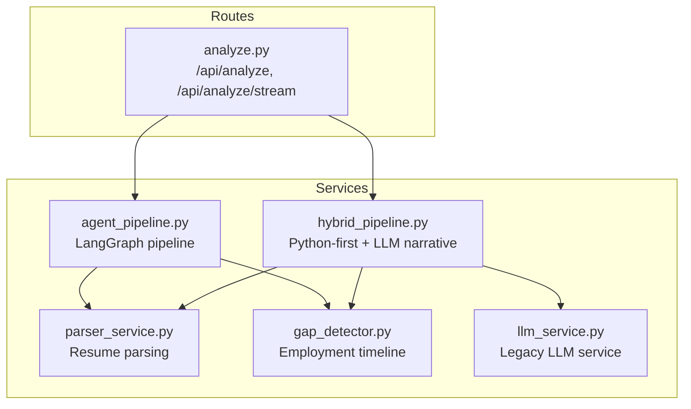
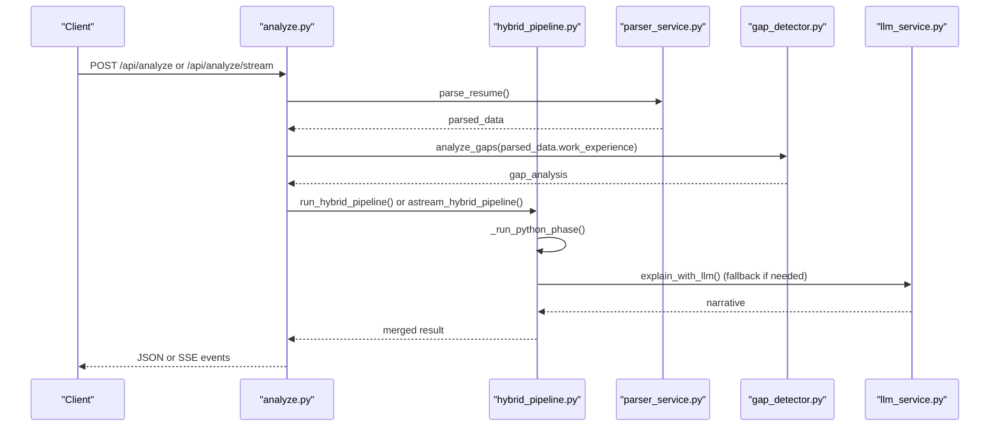
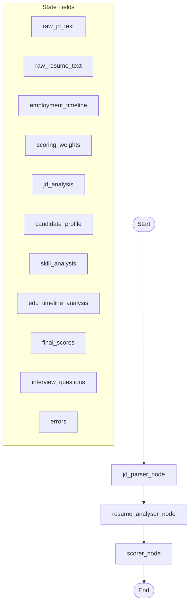
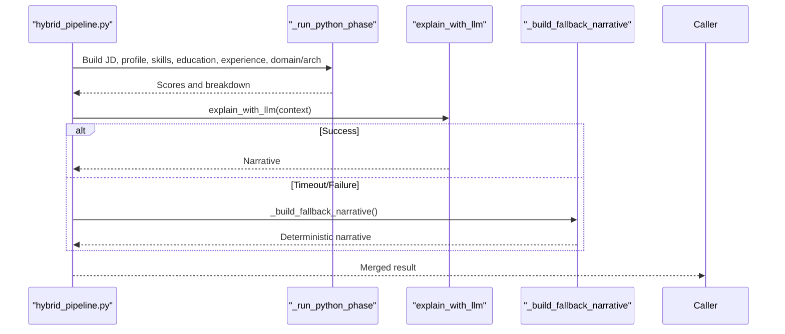
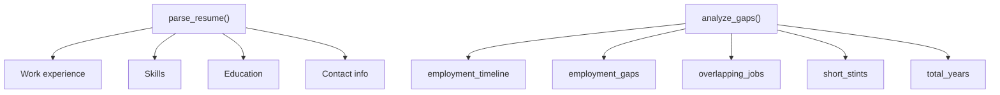
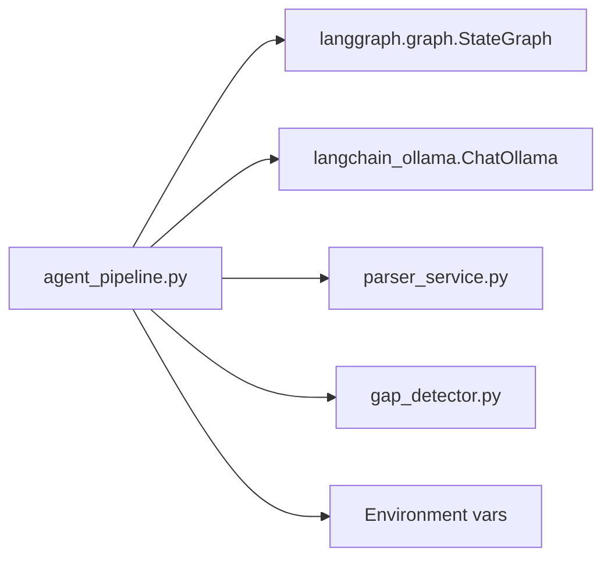

# Custom LangGraph Agents

<cite>
**Referenced Files in This Document**
- [agent_pipeline.py](file://app/backend/services/agent_pipeline.py)
- [analyze.py](file://app/backend/routes/analyze.py)
- [hybrid_pipeline.py](file://app/backend/services/hybrid_pipeline.py)
- [parser_service.py](file://app/backend/services/parser_service.py)
- [gap_detector.py](file://app/backend/services/gap_detector.py)
- [llm_service.py](file://app/backend/services/llm_service.py)
- [test_agent_pipeline.py](file://app/backend/tests/test_agent_pipeline.py)
</cite>

## Table of Contents
1. [Introduction](#introduction)
2. [Project Structure](#project-structure)
3. [Core Components](#core-components)
4. [Architecture Overview](#architecture-overview)
5. [Detailed Component Analysis](#detailed-component-analysis)
6. [Dependency Analysis](#dependency-analysis)
7. [Performance Considerations](#performance-considerations)
8. [Troubleshooting Guide](#troubleshooting-guide)
9. [Conclusion](#conclusion)

## Introduction
This document explains how to implement custom LangGraph agents for the Resume AI analysis system. It focuses on the agent architecture, node creation patterns, and graph construction techniques used in the current system. The guide also covers building specialized agents for different analysis tasks (technical evaluation, cultural fit assessment, risk analysis), designing custom reasoning chains, managing agent memory and state, and integrating external APIs into agent graphs. Practical guidance is provided for performance optimization, error handling, and debugging complex agent interactions.

## Project Structure
The Resume AI system integrates LangGraph agents with a hybrid pipeline that combines deterministic Python components with a single LLM call for narrative generation. The LangGraph agent pipeline is implemented as a stateful, sequential graph with three nodes: job description parsing, combined resume analysis, and scoring/interview generation. The hybrid pipeline complements this with a streaming and non-streaming orchestration that emits structured results and supports graceful fallbacks.

**Diagram sources**
- [analyze.py:1-813](file://app/backend/routes/analyze.py#L1-L813)
- [agent_pipeline.py:1-634](file://app/backend/services/agent_pipeline.py#L1-L634)
- [hybrid_pipeline.py:1-1498](file://app/backend/services/hybrid_pipeline.py#L1-L1498)
- [parser_service.py:1-552](file://app/backend/services/parser_service.py#L1-L552)
- [gap_detector.py:1-219](file://app/backend/services/gap_detector.py#L1-L219)
- [llm_service.py:1-156](file://app/backend/services/llm_service.py#L1-L156)

**Section sources**
- [analyze.py:1-813](file://app/backend/routes/analyze.py#L1-L813)
- [agent_pipeline.py:1-634](file://app/backend/services/agent_pipeline.py#L1-L634)
- [hybrid_pipeline.py:1-1498](file://app/backend/services/hybrid_pipeline.py#L1-L1498)

## Core Components
- LangGraph pipeline: A sequential graph with three nodes that process job descriptions, analyze resumes, and produce scores and interview questions.
- Hybrid pipeline: A Python-first deterministic phase followed by a single LLM call for narrative, with streaming and non-streaming modes.
- Parser and gap detection: Provide structured inputs (skills, education, work history) and objective timeline metrics.
- Legacy LLM service: Provides a fallback mechanism for narrative generation when the hybrid pipeline cannot reach the LLM.

Key implementation highlights:
- State management: The LangGraph pipeline defines a shared state interface with typed fields for inputs, intermediate outputs, and final results.
- Node composition: The resume analyzer node consolidates multiple prior steps into a single call for performance.
- Fallbacks: Each node returns typed-null defaults on exceptions, ensuring graceful degradation.
- Streaming: The hybrid pipeline emits structured SSE events for parsing, scoring, and completion.

**Section sources**
- [agent_pipeline.py:104-121](file://app/backend/services/agent_pipeline.py#L104-L121)
- [agent_pipeline.py:520-543](file://app/backend/services/agent_pipeline.py#L520-L543)
- [hybrid_pipeline.py:1353-1407](file://app/backend/services/hybrid_pipeline.py#L1353-L1407)
- [parser_service.py:193-202](file://app/backend/services/parser_service.py#L193-L202)
- [gap_detector.py:103-219](file://app/backend/services/gap_detector.py#L103-L219)

## Architecture Overview
The system uses two complementary pipelines:
- LangGraph agent pipeline: Stateless graph with typed state and deterministic nodes.
- Hybrid pipeline: Deterministic Python phase plus a single LLM call for narrative, with streaming support.

**Diagram sources**
- [analyze.py:268-318](file://app/backend/routes/analyze.py#L268-L318)
- [analyze.py:506-646](file://app/backend/routes/analyze.py#L506-L646)
- [hybrid_pipeline.py:1262-1407](file://app/backend/services/hybrid_pipeline.py#L1262-L1407)
- [parser_service.py:547-552](file://app/backend/services/parser_service.py#L547-L552)
- [gap_detector.py:217-219](file://app/backend/services/gap_detector.py#L217-L219)
- [llm_service.py:139-156](file://app/backend/services/llm_service.py#L139-L156)

## Detailed Component Analysis

### LangGraph Agent Pipeline
The LangGraph pipeline defines a typed state and three sequential nodes:
- Job description parser: Extracts role, domain, seniority, required skills, and responsibilities.
- Combined resume analyzer: Parses the resume, identifies skills, computes education and timeline scores, and builds a unified analysis.
- Scorer: Computes weighted fit score, risk signals, strengths/weaknesses, and generates interview questions.

**Diagram sources**
- [agent_pipeline.py:104-121](file://app/backend/services/agent_pipeline.py#L104-L121)
- [agent_pipeline.py:522-537](file://app/backend/services/agent_pipeline.py#L522-L537)

Implementation patterns:
- State typing: TypedDict enforces schema boundaries and simplifies debugging.
- Node composition: The resume analyzer consolidates prior steps to reduce latency.
- Fallbacks: Each node returns typed defaults and appends errors to the state’s error list.
- Weight normalization: Scores are computed using normalized weights to maintain consistency.

**Section sources**
- [agent_pipeline.py:104-121](file://app/backend/services/agent_pipeline.py#L104-L121)
- [agent_pipeline.py:161-180](file://app/backend/services/agent_pipeline.py#L161-L180)
- [agent_pipeline.py:280-322](file://app/backend/services/agent_pipeline.py#L280-L322)
- [agent_pipeline.py:367-448](file://app/backend/services/agent_pipeline.py#L367-L448)
- [agent_pipeline.py:453-460](file://app/backend/services/agent_pipeline.py#L453-L460)
- [agent_pipeline.py:522-543](file://app/backend/services/agent_pipeline.py#L522-L543)

### Hybrid Pipeline Orchestration
The hybrid pipeline executes deterministic components first, then calls the LLM for narrative generation. It supports streaming with heartbeat pings and graceful fallbacks when the LLM is unavailable or times out.

**Diagram sources**
- [hybrid_pipeline.py:1262-1407](file://app/backend/services/hybrid_pipeline.py#L1262-L1407)
- [hybrid_pipeline.py:1410-1497](file://app/backend/services/hybrid_pipeline.py#L1410-L1497)

Key behaviors:
- Streaming: Emits parsing, scoring, and complete stages with heartbeat pings.
- Concurrency control: Limits concurrent LLM calls with a semaphore.
- Quality assessment: Determines analysis quality based on parsed data completeness.

**Section sources**
- [hybrid_pipeline.py:1262-1407](file://app/backend/services/hybrid_pipeline.py#L1262-L1407)
- [hybrid_pipeline.py:1410-1497](file://app/backend/services/hybrid_pipeline.py#L1410-L1497)

### Resume Parsing and Gap Detection
The parser extracts structured data from resumes, while the gap detector computes objective timeline metrics used by the agents.

**Diagram sources**
- [parser_service.py:193-202](file://app/backend/services/parser_service.py#L193-L202)
- [gap_detector.py:103-219](file://app/backend/services/gap_detector.py#L103-L219)

**Section sources**
- [parser_service.py:193-202](file://app/backend/services/parser_service.py#L193-L202)
- [gap_detector.py:103-219](file://app/backend/services/gap_detector.py#L103-L219)

### Legacy LLM Service
The legacy LLM service provides a fallback mechanism for narrative generation when the hybrid pipeline cannot reach the LLM.

**Section sources**
- [llm_service.py:139-156](file://app/backend/services/llm_service.py#L139-L156)

## Dependency Analysis
The agent pipeline depends on:
- LangGraph for stateful graph execution.
- LangChain Ollama for LLM calls.
- Parser and gap detector services for structured inputs.
- Environment variables for model selection and timeouts.

**Diagram sources**
- [agent_pipeline.py:33-34](file://app/backend/services/agent_pipeline.py#L33-L34)
- [agent_pipeline.py:39-41](file://app/backend/services/agent_pipeline.py#L39-L41)
- [agent_pipeline.py:522-543](file://app/backend/services/agent_pipeline.py#L522-L543)

**Section sources**
- [agent_pipeline.py:33-41](file://app/backend/services/agent_pipeline.py#L33-L41)
- [agent_pipeline.py:522-543](file://app/backend/services/agent_pipeline.py#L522-L543)

## Performance Considerations
- Model reuse: LLM singletons prevent repeated connection overhead and enable keep-alive sessions.
- Sequential vs parallel: The LangGraph pipeline uses sequential execution to maximize per-call throughput on CPUs.
- Prompt sizing: Carefully limit input sizes to reduce latency and token counts.
- Concurrency control: Hybrid pipeline limits concurrent LLM calls with a semaphore.
- Streaming: Heartbeat pings keep connections alive during long LLM waits.
- Caching: The LangGraph pipeline caches parsed job descriptions to avoid repeated LLM calls.

Practical tips:
- Tune model context windows and prediction limits to balance accuracy and speed.
- Monitor KV-cache usage and adjust num_ctx and num_predict accordingly.
- Use environment variables to configure timeouts and concurrency limits.

**Section sources**
- [agent_pipeline.py:70-99](file://app/backend/services/agent_pipeline.py#L70-L99)
- [agent_pipeline.py:161-180](file://app/backend/services/agent_pipeline.py#L161-L180)
- [hybrid_pipeline.py:24-32](file://app/backend/services/hybrid_pipeline.py#L24-L32)
- [hybrid_pipeline.py:1410-1497](file://app/backend/services/hybrid_pipeline.py#L1410-L1497)

## Troubleshooting Guide
Common issues and resolutions:
- LLM failures: Nodes return typed defaults and append errors to state. Verify environment variables for model and base URL.
- JSON parsing errors: The system includes robust parsing helpers that extract JSON from various formats.
- Streaming interruptions: The hybrid pipeline emits heartbeat pings and falls back to deterministic narratives on timeout or errors.
- State inconsistencies: Typed state fields and assembly helpers ensure consistent output schemas.

Debugging techniques:
- Inspect the state.errors list for granular failure traces.
- Validate prompts and inputs before invoking nodes.
- Use the non-streaming pipeline to reproduce issues deterministically.
- Review SSE event sequences for timing and stage transitions.

**Section sources**
- [agent_pipeline.py:125-138](file://app/backend/services/agent_pipeline.py#L125-L138)
- [agent_pipeline.py:178-179](file://app/backend/services/agent_pipeline.py#L178-L179)
- [agent_pipeline.py:315-321](file://app/backend/services/agent_pipeline.py#L315-L321)
- [agent_pipeline.py:443-448](file://app/backend/services/agent_pipeline.py#L443-L448)
- [hybrid_pipeline.py:1410-1497](file://app/backend/services/hybrid_pipeline.py#L1410-L1497)
- [test_agent_pipeline.py:304-558](file://app/backend/tests/test_agent_pipeline.py#L304-L558)

## Conclusion
The Resume AI system demonstrates a robust approach to implementing LangGraph agents for multi-stage analysis. By combining a typed, stateful graph with deterministic preprocessing and a single LLM call for narrative, it achieves reliability, performance, and user-friendly streaming experiences. The patterns shown here—typed state, node composition, fallbacks, and streaming—provide a strong foundation for building specialized agents tailored to technical evaluation, cultural fit assessment, and risk analysis.