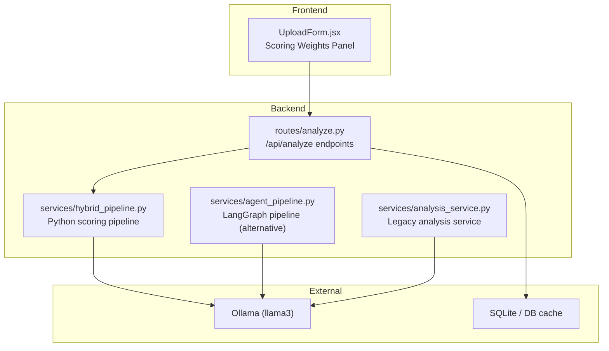
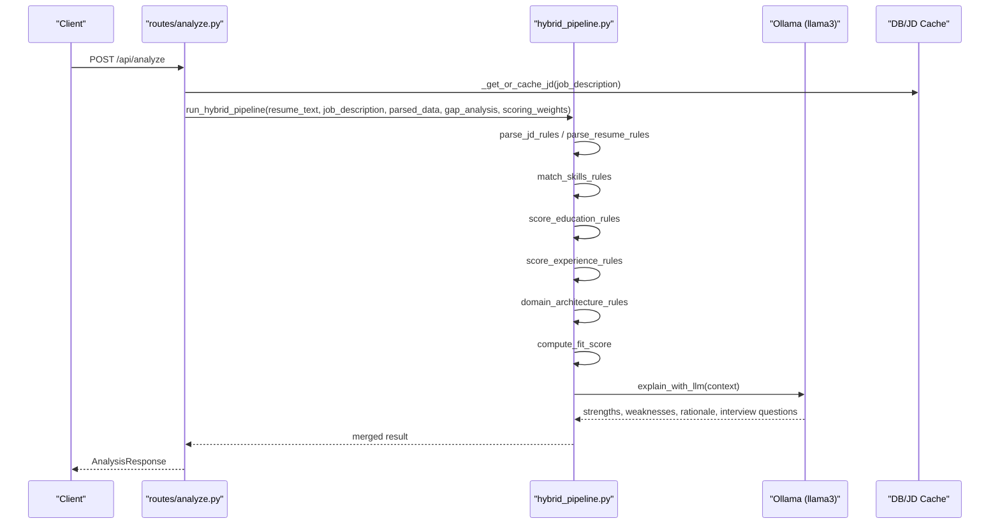
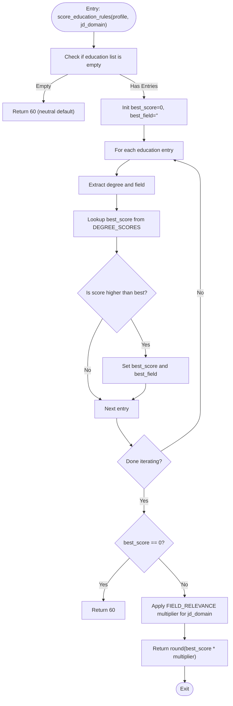
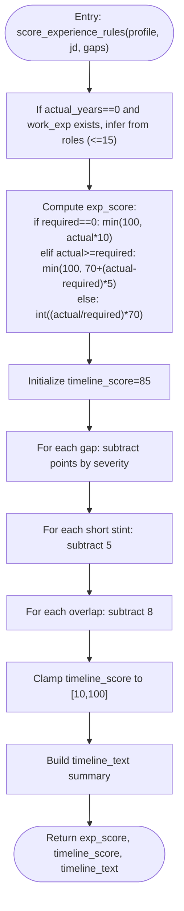
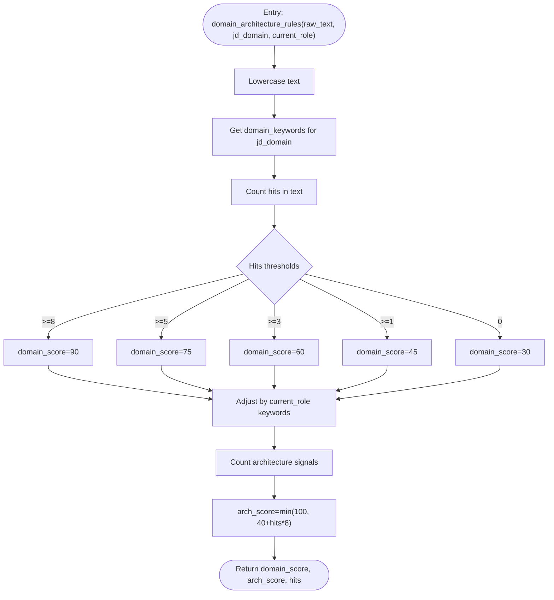
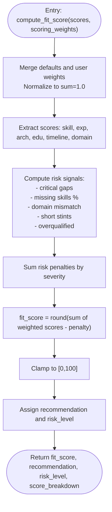
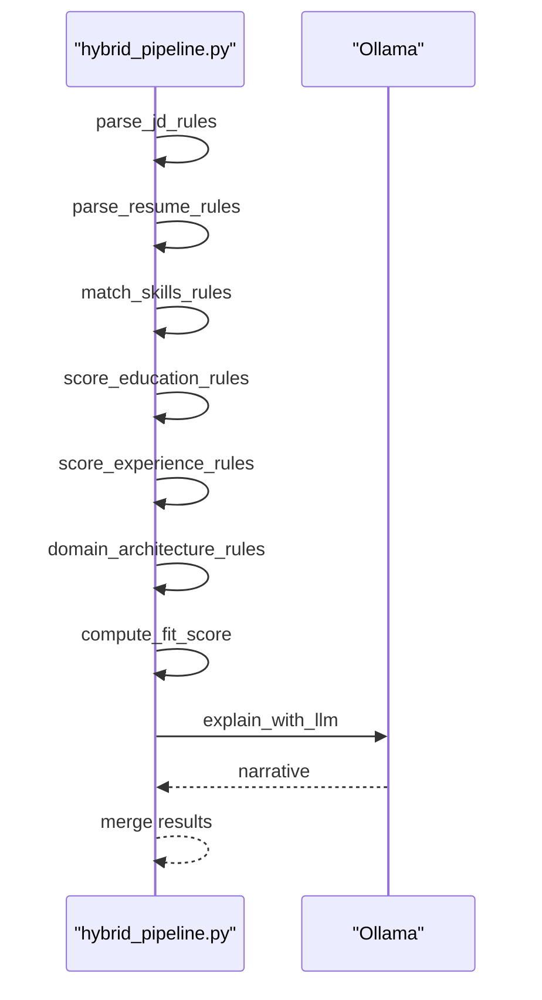
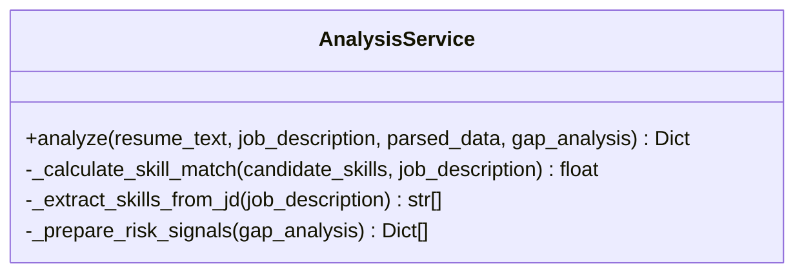
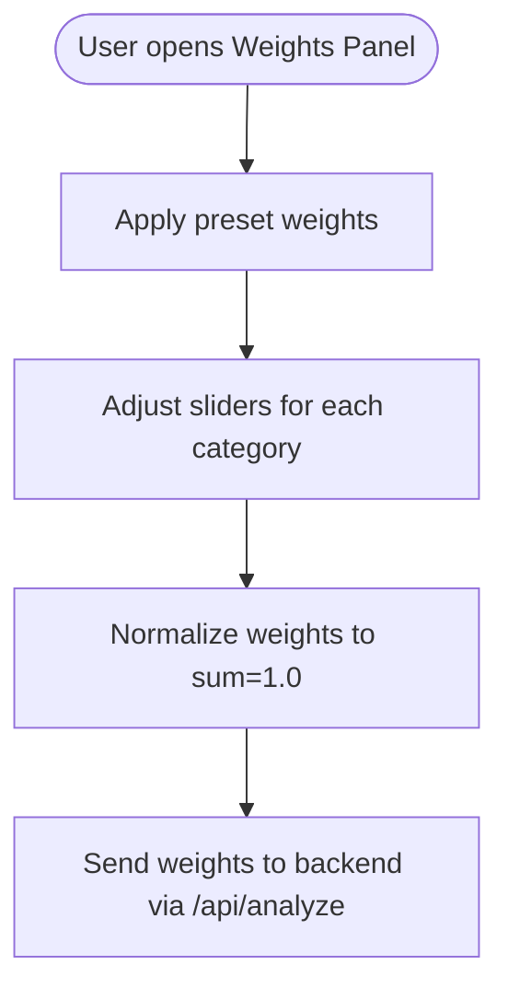
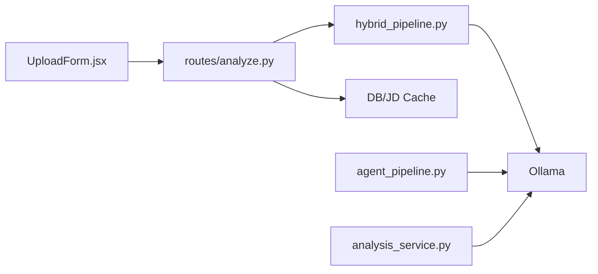

# Custom Scoring Algorithms

<cite>
**Referenced Files in This Document**
- [README.md](file://README.md)
- [analyze.py](file://app/backend/routes/analyze.py)
- [hybrid_pipeline.py](file://app/backend/services/hybrid_pipeline.py)
- [agent_pipeline.py](file://app/backend/services/agent_pipeline.py)
- [analysis_service.py](file://app/backend/services/analysis_service.py)
- [UploadForm.jsx](file://app/frontend/src/components/UploadForm.jsx)
- [test_hybrid_pipeline.py](file://app/backend/tests/test_hybrid_pipeline.py)
- [test_agent_pipeline.py](file://app/backend/tests/test_agent_pipeline.py)
</cite>

## Table of Contents
1. [Introduction](#introduction)
2. [Project Structure](#project-structure)
3. [Core Components](#core-components)
4. [Architecture Overview](#architecture-overview)
5. [Detailed Component Analysis](#detailed-component-analysis)
6. [Dependency Analysis](#dependency-analysis)
7. [Performance Considerations](#performance-considerations)
8. [Troubleshooting Guide](#troubleshooting-guide)
9. [Conclusion](#conclusion)
10. [Appendices](#appendices)

## Introduction
This document explains how to implement custom scoring algorithms in the Resume AI analysis engine. It covers the current scoring mechanisms (skill matching, education relevance, experience calculation), how to create custom weight functions, implement domain-specific scoring matrices, and integrate external scoring APIs. It also documents the scoring pipeline architecture, including the score_education_rules function and degree scoring system, and provides guidance on weighted scoring models, adaptive scoring by seniority, and machine learning-based scoring approaches. Finally, it addresses performance considerations, caching strategies, and maintaining backward compatibility.

## Project Structure
The Resume AI engine is organized around a hybrid scoring pipeline that combines deterministic Python components with a single LLM call for narrative. The backend exposes FastAPI endpoints that orchestrate parsing, scoring, and optional LLM explanation. The frontend provides interactive controls for adjusting scoring weights.

**Diagram sources**
- [analyze.py:34-38](file://app/backend/routes/analyze.py#L34-L38)
- [hybrid_pipeline.py:1262-1407](file://app/backend/services/hybrid_pipeline.py#L1262-L1407)
- [agent_pipeline.py:520-540](file://app/backend/services/agent_pipeline.py#L520-L540)
- [analysis_service.py:1-121](file://app/backend/services/analysis_service.py#L1-L121)

**Section sources**
- [README.md:231-251](file://README.md#L231-L251)
- [analyze.py:34-38](file://app/backend/routes/analyze.py#L34-L38)

## Core Components
- Python scoring pipeline: Implements skill matching, education scoring, experience/timeline scoring, domain/architecture scoring, and weighted fit score computation with risk signals.
- LangGraph scoring pipeline: Alternative path with separate nodes for JD parsing, resume analysis, and scoring with explainability.
- Legacy analysis service: Provides a simpler skill-match calculation and LLM-based narrative.
- Frontend scoring weights panel: Allows users to adjust weights for skills, experience, stability, and education.

Key scoring functions and modules:
- score_education_rules: Degree and field relevance scoring.
- score_experience_rules: Experience score and timeline adjustments.
- domain_architecture_rules: Domain fit and architecture signals.
- compute_fit_score: Weighted aggregation with risk penalties.
- _normalize_weights and _compute_fallback_scores: Weight normalization and fallback scoring.

**Section sources**
- [hybrid_pipeline.py:793-826](file://app/backend/services/hybrid_pipeline.py#L793-L826)
- [hybrid_pipeline.py:833-894](file://app/backend/services/hybrid_pipeline.py#L833-L894)
- [hybrid_pipeline.py:911-946](file://app/backend/services/hybrid_pipeline.py#L911-L946)
- [hybrid_pipeline.py:964-1058](file://app/backend/services/hybrid_pipeline.py#L964-L1058)
- [agent_pipeline.py:453-493](file://app/backend/services/agent_pipeline.py#L453-L493)
- [analysis_service.py:10-121](file://app/backend/services/analysis_service.py#L10-L121)
- [UploadForm.jsx:6-11](file://app/frontend/src/components/UploadForm.jsx#L6-L11)
- [UploadForm.jsx:13-75](file://app/frontend/src/components/UploadForm.jsx#L13-L75)

## Architecture Overview
The scoring pipeline architecture consists of two main paths:
- Hybrid pipeline (default): Deterministic Python scoring (skills, education, experience, domain, architecture) followed by a single LLM call for narrative.
- Agent pipeline (LangGraph): Multi-agent nodes for JD parsing, resume analysis, and scoring with explainability.

**Diagram sources**
- [analyze.py:268-318](file://app/backend/routes/analyze.py#L268-L318)
- [hybrid_pipeline.py:1353-1407](file://app/backend/services/hybrid_pipeline.py#L1353-L1407)
- [hybrid_pipeline.py:1144-1194](file://app/backend/services/hybrid_pipeline.py#L1144-L1194)

**Section sources**
- [analyze.py:268-318](file://app/backend/routes/analyze.py#L268-L318)
- [hybrid_pipeline.py:1262-1407](file://app/backend/services/hybrid_pipeline.py#L1262-L1407)

## Detailed Component Analysis

### Education Scoring: score_education_rules and Degree Matrix
The education scoring function evaluates the highest-scoring degree and applies a field relevance multiplier based on the job domain.

- Degree scoring matrix: A dictionary mapping degree keywords to numeric scores.
- Field relevance matrix: A dictionary mapping domains to relevant fields; used to adjust the base score.
- Neutral default: When no education is provided, returns 60 to avoid penalizing missing data.

**Diagram sources**
- [hybrid_pipeline.py:793-826](file://app/backend/services/hybrid_pipeline.py#L793-L826)
- [hybrid_pipeline.py:757-790](file://app/backend/services/hybrid_pipeline.py#L757-L790)

**Section sources**
- [hybrid_pipeline.py:793-826](file://app/backend/services/hybrid_pipeline.py#L793-L826)
- [hybrid_pipeline.py:757-790](file://app/backend/services/hybrid_pipeline.py#L757-L790)
- [test_hybrid_pipeline.py:227-257](file://app/backend/tests/test_hybrid_pipeline.py#L227-L257)

### Experience and Timeline Scoring: score_experience_rules
Experience scoring is computed from required vs actual years, with bonuses for exceeding requirements and penalties for underqualification. Timeline scoring deducts points for gaps, short stints, and overlapping jobs.

- Experience score: Non-linear scaling with bonuses for overqualification.
- Timeline score: Base 85 minus deductions for gaps, short stints, and overlaps.
- Timeline text: Summarizes gap patterns for interpretability.

**Diagram sources**
- [hybrid_pipeline.py:833-894](file://app/backend/services/hybrid_pipeline.py#L833-L894)

**Section sources**
- [hybrid_pipeline.py:833-894](file://app/backend/services/hybrid_pipeline.py#L833-L894)
- [test_hybrid_pipeline.py:264-332](file://app/backend/tests/test_hybrid_pipeline.py#L264-L332)

### Domain and Architecture Scoring: domain_architecture_rules
Domain fit is computed by counting keyword hits from the domain keyword set. Architecture scoring counts signals of system design experience.

- Domain keywords: A curated mapping of domain-specific terms.
- Current role adjustment: Small bonus/penalty based on current role keywords.
- Architecture signals: Heuristics indicating system design experience.

**Diagram sources**
- [hybrid_pipeline.py:911-946](file://app/backend/services/hybrid_pipeline.py#L911-L946)

**Section sources**
- [hybrid_pipeline.py:911-946](file://app/backend/services/hybrid_pipeline.py#L911-L946)

### Weighted Fit Score and Risk Signals: compute_fit_score
Fit score is a weighted linear combination of component scores, minus risk penalties derived from deterministically computed risk signals.

- Risk signals: Deterministic heuristics derived from parsed data.
- Risk penalty: Aggregated penalty scaled by risk weights.
- Recommendation: Threshold-based classification.

**Diagram sources**
- [hybrid_pipeline.py:964-1058](file://app/backend/services/hybrid_pipeline.py#L964-L1058)

**Section sources**
- [hybrid_pipeline.py:964-1058](file://app/backend/services/hybrid_pipeline.py#L964-L1058)

### Scoring Pipeline Orchestration: run_hybrid_pipeline
The orchestrator executes Python components, computes fit score, and merges LLM narrative.

**Diagram sources**
- [hybrid_pipeline.py:1262-1333](file://app/backend/services/hybrid_pipeline.py#L1262-L1333)
- [hybrid_pipeline.py:1353-1407](file://app/backend/services/hybrid_pipeline.py#L1353-L1407)

**Section sources**
- [hybrid_pipeline.py:1262-1407](file://app/backend/services/hybrid_pipeline.py#L1262-L1407)

### Legacy Analysis Service: AnalysisService
Provides a simpler skill-match calculation and LLM-based narrative.

**Diagram sources**
- [analysis_service.py:6-121](file://app/backend/services/analysis_service.py#L6-L121)

**Section sources**
- [analysis_service.py:10-121](file://app/backend/services/analysis_service.py#L10-L121)

### Frontend Scoring Weights Panel
The frontend exposes presets and sliders to adjust weights for skills, experience, stability, and education.

**Diagram sources**
- [UploadForm.jsx:6-11](file://app/frontend/src/components/UploadForm.jsx#L6-L11)
- [UploadForm.jsx:13-75](file://app/frontend/src/components/UploadForm.jsx#L13-L75)

**Section sources**
- [UploadForm.jsx:432-448](file://app/frontend/src/components/UploadForm.jsx#L432-L448)

## Dependency Analysis
- Routes depend on hybrid pipeline for scoring and on DB/JD cache for job description parsing.
- Hybrid pipeline depends on Python-only scoring functions and LLM for narrative.
- Agent pipeline provides an alternative path with LangGraph nodes and fallback scoring.
- Frontend depends on backend endpoints and sends scoring weights as part of the request.

**Diagram sources**
- [analyze.py:34-38](file://app/backend/routes/analyze.py#L34-L38)
- [hybrid_pipeline.py:1262-1407](file://app/backend/services/hybrid_pipeline.py#L1262-L1407)
- [agent_pipeline.py:520-540](file://app/backend/services/agent_pipeline.py#L520-L540)
- [analysis_service.py:1-121](file://app/backend/services/analysis_service.py#L1-L121)

**Section sources**
- [analyze.py:34-38](file://app/backend/routes/analyze.py#L34-L38)
- [hybrid_pipeline.py:1262-1407](file://app/backend/services/hybrid_pipeline.py#L1262-L1407)
- [agent_pipeline.py:520-540](file://app/backend/services/agent_pipeline.py#L520-L540)
- [analysis_service.py:1-121](file://app/backend/services/analysis_service.py#L1-L121)

## Performance Considerations
- Python phase latency: The hybrid pipeline’s Python phase completes in ~1–2 seconds and is deterministic.
- LLM narrative: The single LLM call for narrative takes ~40 seconds; timeouts are handled gracefully with fallback narratives.
- Concurrency and timeouts: The LLM semaphore limits concurrent calls; timeouts configurable via environment variables.
- Caching: JD parsing is cached in DB; frontend can reuse parsed JDs across requests.
- Weight normalization: Ensures weights sum to 1.0 and preserves proportions when partial weights are provided.

Practical tips:
- Increase LLM_NARRATIVE_TIMEOUT for slower hardware or cold-start scenarios.
- Use DB shared JD cache to avoid repeated parsing for identical job descriptions.
- Keep scoring weights normalized to reduce recomputation overhead.

**Section sources**
- [hybrid_pipeline.py:28-66](file://app/backend/services/hybrid_pipeline.py#L28-L66)
- [hybrid_pipeline.py:1380-1407](file://app/backend/services/hybrid_pipeline.py#L1380-L1407)
- [agent_pipeline.py:453-460](file://app/backend/services/agent_pipeline.py#L453-L460)
- [analyze.py:49-67](file://app/backend/routes/analyze.py#L49-L67)

## Troubleshooting Guide
Common issues and resolutions:
- LLM not available or times out: The pipeline falls back to deterministic narrative and clamps scores to [0,100].
- Invalid or missing weights: Defaults are applied and weights are normalized.
- JD too short: Rejected early with a helpful error message.
- Parsing failures: Graceful fallback results with pipeline errors recorded.

**Section sources**
- [hybrid_pipeline.py:1388-1406](file://app/backend/services/hybrid_pipeline.py#L1388-L1406)
- [agent_pipeline.py:443-448](file://app/backend/services/agent_pipeline.py#L443-L448)
- [agent_pipeline.py:453-460](file://app/backend/services/agent_pipeline.py#L453-L460)
- [analyze.py:255-265](file://app/backend/routes/analyze.py#L255-L265)
- [analyze.py:219-235](file://app/backend/routes/analyze.py#L219-L235)

## Conclusion
The Resume AI engine provides a robust, extensible scoring architecture. The hybrid pipeline offers deterministic Python scoring plus a single LLM narrative, while the agent pipeline demonstrates a modular LangGraph approach. Users can customize scoring via adjustable weights, domain-specific matrices, and adaptive logic. The system emphasizes performance, resilience, and backward compatibility.

## Appendices

### Implementing Custom Weight Functions
- Adjust weights client-side via the frontend weights panel; weights are sent to the backend and normalized.
- Backend normalization ensures weights sum to 1.0 and preserves relative proportions.

**Section sources**
- [UploadForm.jsx:432-448](file://app/frontend/src/components/UploadForm.jsx#L432-L448)
- [agent_pipeline.py:453-460](file://app/backend/services/agent_pipeline.py#L453-L460)

### Implementing Domain-Specific Scoring Matrices
- Modify DEGREE_SCORES and FIELD_RELEVANCE dictionaries to reflect domain priorities.
- Extend DOMAIN_KEYWORDS to include domain-specific terms for domain_architecture_rules.

**Section sources**
- [hybrid_pipeline.py:757-790](file://app/backend/services/hybrid_pipeline.py#L757-L790)
- [hybrid_pipeline.py:285-317](file://app/backend/services/hybrid_pipeline.py#L285-L317)
- [hybrid_pipeline.py:911-946](file://app/backend/services/hybrid_pipeline.py#L911-L946)

### Integrating External Scoring APIs
- The current design relies on Python scoring and a single LLM call. To integrate external APIs:
  - Wrap external scoring endpoints in a new scoring component (similar to domain_architecture_rules).
  - Insert the component into the Python phase of run_hybrid_pipeline.
  - Merge results into the score_breakdown and compute_fit_score.
  - Ensure fallback behavior if external APIs fail.

[No sources needed since this section provides general guidance]

### Adaptive Scoring Based on Job Seniority Levels
- Use the parsed seniority from parse_jd_rules to adjust thresholds or weights dynamically.
- Example adaptations:
  - Increase experience bonus for senior roles.
  - Adjust domain fit thresholds for lead roles.
  - Scale risk penalties differently by seniority.

**Section sources**
- [hybrid_pipeline.py:467-559](file://app/backend/services/hybrid_pipeline.py#L467-L559)

### Machine Learning-Based Scoring Approaches
- Replace or augment Python scoring with ML models:
  - Train a model to predict fit scores from parsed features.
  - Integrate via a new scoring component in the Python phase.
  - Ensure deterministic fallback when ML is unavailable.
- Consider using the agent pipeline’s multi-agent structure to isolate ML components behind LLM prompts.

[No sources needed since this section provides general guidance]