# Domain-Specific Analysis Workflows

<cite>
**Referenced Files in This Document**
- [README.md](file://README.md)
- [analyze.py](file://app/backend/routes/analyze.py)
- [analysis_service.py](file://app/backend/services/analysis_service.py)
- [agent_pipeline.py](file://app/backend/services/agent_pipeline.py)
- [hybrid_pipeline.py](file://app/backend/services/hybrid_pipeline.py)
- [gap_detector.py](file://app/backend/services/gap_detector.py)
- [parser_service.py](file://app/backend/services/parser_service.py)
- [llm_service.py](file://app/backend/services/llm_service.py)
- [db_models.py](file://app/backend/models/db_models.py)
- [test_hybrid_pipeline.py](file://app/backend/tests/test_hybrid_pipeline.py)
</cite>

## Table of Contents
1. [Introduction](#introduction)
2. [Project Structure](#project-structure)
3. [Core Components](#core-components)
4. [Architecture Overview](#architecture-overview)
5. [Detailed Component Analysis](#detailed-component-analysis)
6. [Dependency Analysis](#dependency-analysis)
7. [Performance Considerations](#performance-considerations)
8. [Troubleshooting Guide](#troubleshooting-guide)
9. [Conclusion](#conclusion)
10. [Appendices](#appendices)

## Introduction
This document describes how to develop domain-specific analysis workflows in Resume AI. It explains the current domain classification system centered on the DOMAIN_KEYWORDS mapping and domain detection algorithms, and provides a blueprint for implementing specialized analysis pipelines for industries such as healthcare, finance, automotive, and aerospace. It covers creating domain-specific rule engines, custom skill matching algorithms, and industry-specific scoring criteria. It also addresses regulatory compliance checking, domain expertise validation, specialized qualification assessment, integration with the LangGraph agent system, custom prompt engineering for domain contexts, and maintaining workflow extensibility.

## Project Structure
Resume AI comprises:
- A FastAPI backend with route handlers for analysis and streaming
- Services for parsing resumes, detecting gaps, hybrid scoring, and LLM orchestration
- A LangGraph agent pipeline for multi-stage reasoning
- A SQL model layer supporting multi-tenant usage and caching
- A React frontend for user interaction

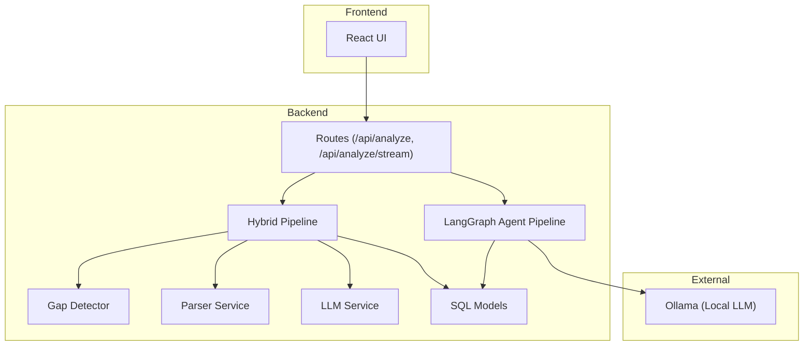

**Diagram sources**
- [analyze.py:1-813](file://app/backend/routes/analyze.py#L1-L813)
- [hybrid_pipeline.py:1-1498](file://app/backend/services/hybrid_pipeline.py#L1-L1498)
- [agent_pipeline.py:1-634](file://app/backend/services/agent_pipeline.py#L1-L634)
- [gap_detector.py:1-219](file://app/backend/services/gap_detector.py#L1-L219)
- [parser_service.py:1-552](file://app/backend/services/parser_service.py#L1-L552)
- [llm_service.py:1-156](file://app/backend/services/llm_service.py#L1-L156)
- [db_models.py:1-250](file://app/backend/models/db_models.py#L1-L250)

**Section sources**
- [README.md:231-251](file://README.md#L231-L251)
- [analyze.py:1-813](file://app/backend/routes/analyze.py#L1-L813)

## Core Components
- Domain classification and detection: The hybrid pipeline uses DOMAIN_KEYWORDS to classify job descriptions into domains (backend, frontend, data_science, ml_ai, devops, embedded, mobile, management, other). It counts keyword hits in the job description to infer the domain.
- Skills registry and matching: A dynamic skills registry (MASTER_SKILLS + SKILL_ALIASES) powers extraction and normalization. The matching engine supports exact, alias, substring, and fuzzy matching with alias expansion.
- Education scoring: Degree scores and field relevance multipliers determine education fit per domain.
- Experience and timeline scoring: Gap detection computes timeline penalties based on gap severity and short stints.
- Domain and architecture scoring: Keyword-based domain fit and architecture signal scoring.
- Fit scoring and risk signals: Weighted aggregation with risk penalties for gaps, missing skills, domain mismatch, and stability issues.
- Narrative generation: A single LLM call synthesizes strengths, weaknesses, rationale, and interview questions.

**Section sources**
- [hybrid_pipeline.py:285-526](file://app/backend/services/hybrid_pipeline.py#L285-L526)
- [hybrid_pipeline.py:654-751](file://app/backend/services/hybrid_pipeline.py#L654-L751)
- [hybrid_pipeline.py:757-826](file://app/backend/services/hybrid_pipeline.py#L757-L826)
- [hybrid_pipeline.py:833-894](file://app/backend/services/hybrid_pipeline.py#L833-L894)
- [hybrid_pipeline.py:911-946](file://app/backend/services/hybrid_pipeline.py#L911-L946)
- [hybrid_pipeline.py:964-1058](file://app/backend/services/hybrid_pipeline.py#L964-L1058)
- [hybrid_pipeline.py:1144-1255](file://app/backend/services/hybrid_pipeline.py#L1144-L1255)

## Architecture Overview
The system supports two analysis modes:
- Hybrid pipeline: Deterministic Python rules for parsing, domain classification, skills matching, education and experience scoring, followed by a single LLM call for narrative synthesis.
- LangGraph agent pipeline: A multi-stage graph with nodes for JD parsing, combined resume analysis, and scoring/interview generation.

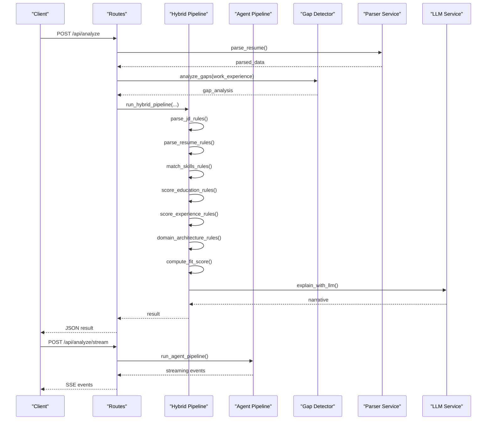

**Diagram sources**
- [analyze.py:268-318](file://app/backend/routes/analyze.py#L268-L318)
- [hybrid_pipeline.py:1262-1407](file://app/backend/services/hybrid_pipeline.py#L1262-L1407)
- [agent_pipeline.py:623-634](file://app/backend/services/agent_pipeline.py#L623-L634)
- [gap_detector.py:103-218](file://app/backend/services/gap_detector.py#L103-L218)
- [parser_service.py:547-552](file://app/backend/services/parser_service.py#L547-L552)
- [llm_service.py:139-156](file://app/backend/services/llm_service.py#L139-L156)

## Detailed Component Analysis

### Domain Classification and Detection
Domain detection is performed by scanning the job description against DOMAIN_KEYWORDS and selecting the domain with the highest hit count. Seniority is inferred heuristically from the role title and required years.

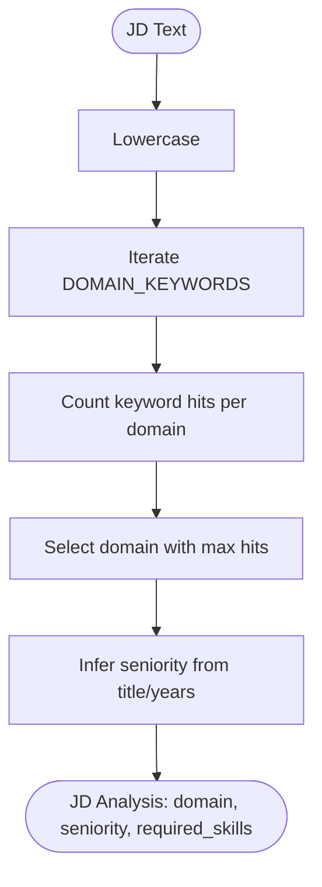

**Diagram sources**
- [hybrid_pipeline.py:467-559](file://app/backend/services/hybrid_pipeline.py#L467-L559)

**Section sources**
- [hybrid_pipeline.py:285-526](file://app/backend/services/hybrid_pipeline.py#L285-L526)

### Skills Registry and Matching Engine
The skills registry maintains a canonical vocabulary and aliases. Matching supports:
- Exact and alias matches
- Substring containment
- Fuzzy matching with a configurable threshold

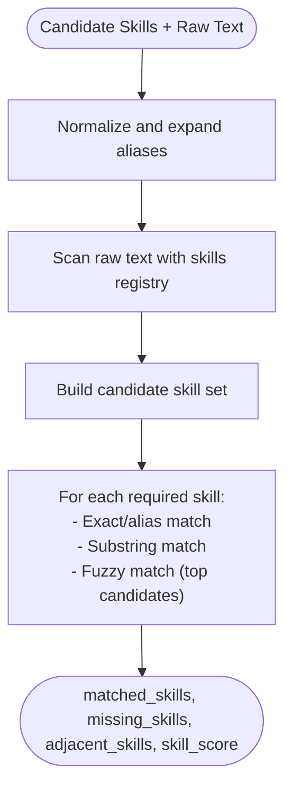

**Diagram sources**
- [hybrid_pipeline.py:654-751](file://app/backend/services/hybrid_pipeline.py#L654-L751)

**Section sources**
- [hybrid_pipeline.py:323-426](file://app/backend/services/hybrid_pipeline.py#L323-L426)
- [hybrid_pipeline.py:654-751](file://app/backend/services/hybrid_pipeline.py#L654-L751)

### Education Scoring and Field Relevance
Education scoring considers degree weights and field relevance multipliers per domain. Irrelevant degrees receive lower scores; missing education data returns a neutral baseline.

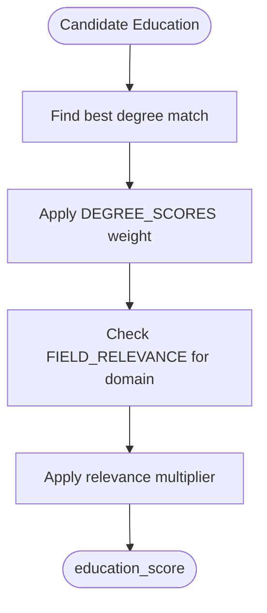

**Diagram sources**
- [hybrid_pipeline.py:757-826](file://app/backend/services/hybrid_pipeline.py#L757-L826)

**Section sources**
- [hybrid_pipeline.py:757-826](file://app/backend/services/hybrid_pipeline.py#L757-L826)

### Experience and Timeline Scoring
Experience scoring rewards meeting or exceeding required years, with diminishing returns. Timeline scoring deducts points for gaps (by severity), short stints, and overlapping jobs.

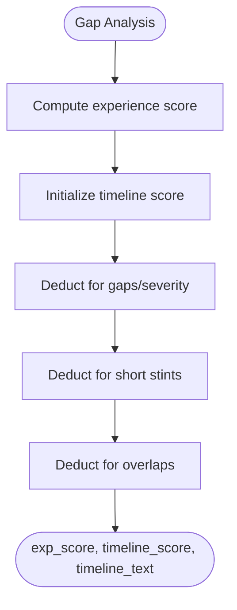

**Diagram sources**
- [hybrid_pipeline.py:833-894](file://app/backend/services/hybrid_pipeline.py#L833-L894)

**Section sources**
- [hybrid_pipeline.py:833-894](file://app/backend/services/hybrid_pipeline.py#L833-L894)

### Domain Fit and Architecture Scoring
Domain fit is computed from keyword hits in the resume text, with optional bonuses for current role alignment. Architecture scoring captures leadership and system design indicators.

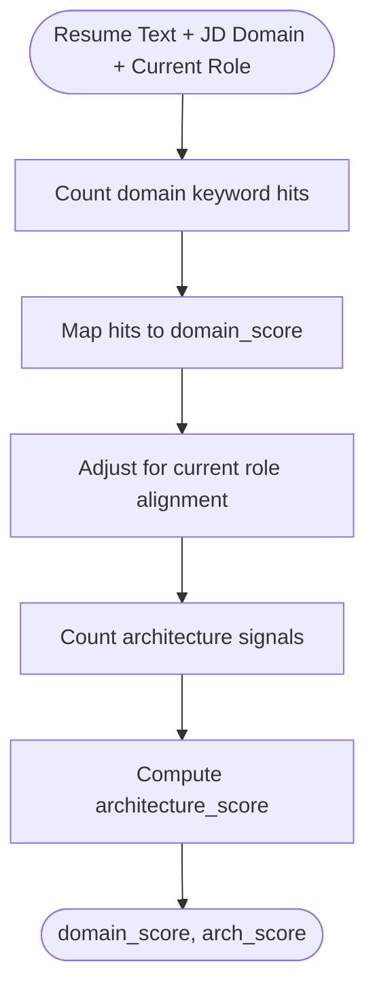

**Diagram sources**
- [hybrid_pipeline.py:911-946](file://app/backend/services/hybrid_pipeline.py#L911-L946)

**Section sources**
- [hybrid_pipeline.py:911-946](file://app/backend/services/hybrid_pipeline.py#L911-L946)

### Fit Score and Risk Signals
Fit score is a weighted combination of skill, experience, architecture, education, timeline, and domain scores minus risk penalties. Risk signals are deterministically computed from gaps, missing skills, domain mismatch, and stability.

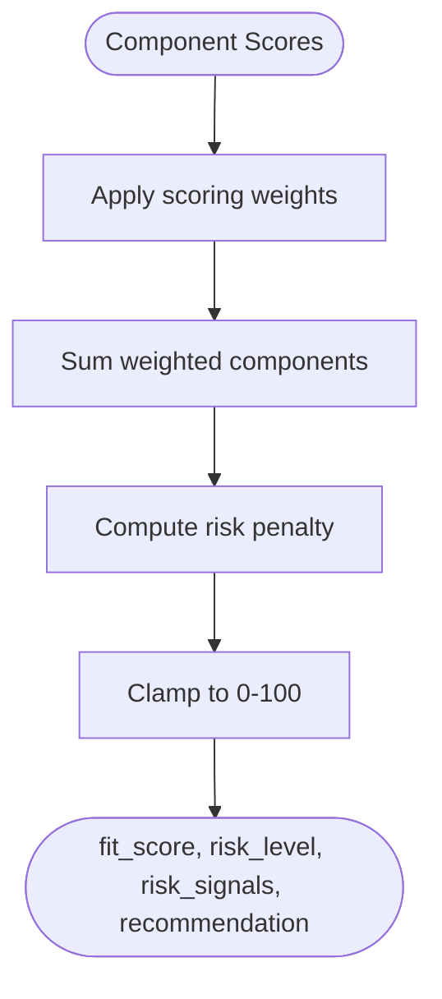

**Diagram sources**
- [hybrid_pipeline.py:964-1058](file://app/backend/services/hybrid_pipeline.py#L964-L1058)

**Section sources**
- [hybrid_pipeline.py:964-1058](file://app/backend/services/hybrid_pipeline.py#L964-L1058)

### Narrative Generation
A single LLM call synthesizes strengths, weaknesses, recommendation rationale, and interview questions based on the computed scores and context.

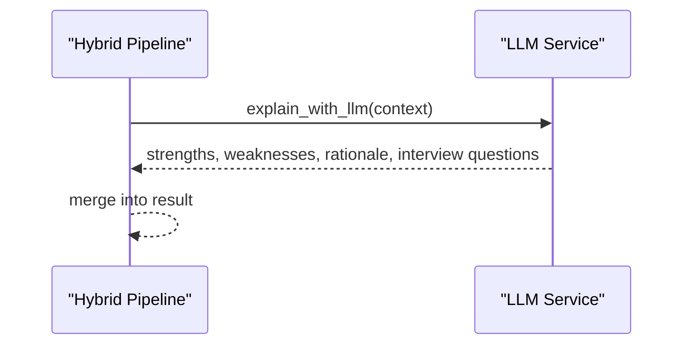

**Diagram sources**
- [hybrid_pipeline.py:1144-1201](file://app/backend/services/hybrid_pipeline.py#L1144-L1201)
- [llm_service.py:13-156](file://app/backend/services/llm_service.py#L13-L156)

**Section sources**
- [hybrid_pipeline.py:1144-1201](file://app/backend/services/hybrid_pipeline.py#L1144-L1201)
- [llm_service.py:13-156](file://app/backend/services/llm_service.py#L13-L156)

### LangGraph Agent Pipeline Integration
The LangGraph pipeline performs domain parsing, combined resume analysis, and scoring with explainability. It uses separate models for fast extraction and reasoning for scoring.

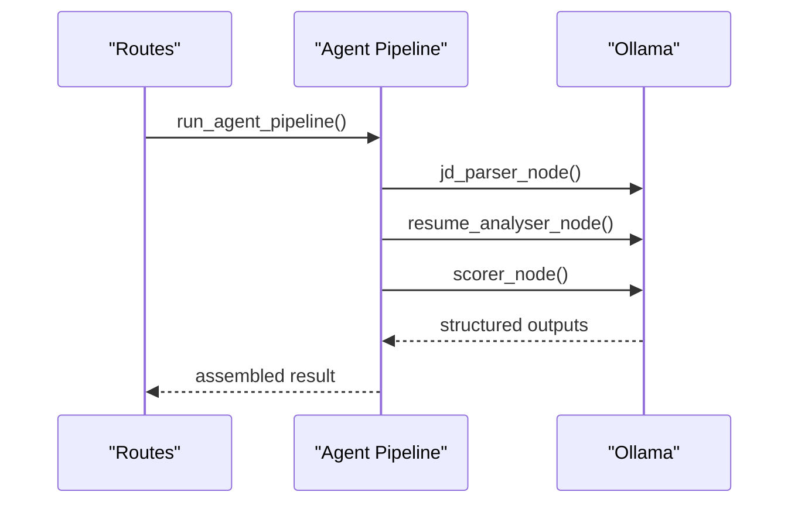

**Diagram sources**
- [agent_pipeline.py:161-180](file://app/backend/services/agent_pipeline.py#L161-L180)
- [agent_pipeline.py:280-322](file://app/backend/services/agent_pipeline.py#L280-L322)
- [agent_pipeline.py:367-448](file://app/backend/services/agent_pipeline.py#L367-L448)

**Section sources**
- [agent_pipeline.py:1-634](file://app/backend/services/agent_pipeline.py#L1-L634)

## Dependency Analysis
The analysis pipeline depends on:
- Parser service for structured resume data
- Gap detector for objective timeline metrics
- Hybrid pipeline for deterministic scoring and narrative
- LangGraph agent pipeline for advanced reasoning
- LLM service for narrative synthesis
- Database models for persistence and caching

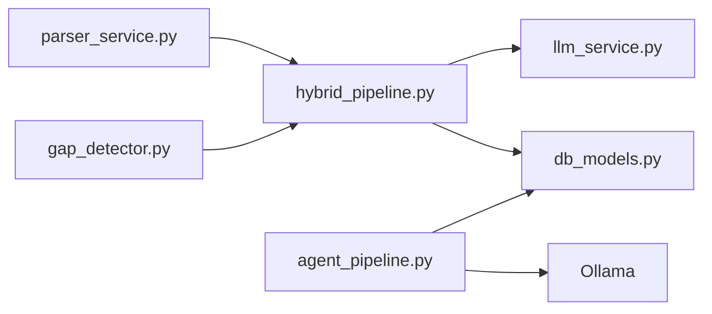

**Diagram sources**
- [parser_service.py:547-552](file://app/backend/services/parser_service.py#L547-L552)
- [gap_detector.py:217-219](file://app/backend/services/gap_detector.py#L217-L219)
- [hybrid_pipeline.py:1262-1407](file://app/backend/services/hybrid_pipeline.py#L1262-L1407)
- [agent_pipeline.py:522-540](file://app/backend/services/agent_pipeline.py#L522-L540)
- [llm_service.py:1-156](file://app/backend/services/llm_service.py#L1-L156)
- [db_models.py:229-250](file://app/backend/models/db_models.py#L229-L250)

**Section sources**
- [analyze.py:34-38](file://app/backend/routes/analyze.py#L34-L38)
- [db_models.py:229-250](file://app/backend/models/db_models.py#L229-L250)

## Performance Considerations
- Hybrid pipeline minimizes LLM calls by performing deterministic scoring first, then generating a single narrative.
- Streaming support reduces perceived latency by emitting parsing and scoring stages progressively.
- Caching: JD parsing cache and skills registry reduce repeated computation.
- Concurrency: LLM semaphore controls concurrent calls to prevent resource exhaustion.

[No sources needed since this section provides general guidance]

## Troubleshooting Guide
Common issues and resolutions:
- LLM not responding: Verify Ollama service, model availability, and environment variables.
- Database locked errors: Restart backend container; SQLite does not support concurrent writes.
- Scanned PDFs: Raise explicit errors with actionable messages; convert to text-based PDFs.
- Excessive risk signals: Review domain keyword thresholds and scoring weights.

**Section sources**
- [README.md:337-375](file://README.md#L337-L375)
- [parser_service.py:175-181](file://app/backend/services/parser_service.py#L175-L181)
- [llm_service.py:21-41](file://app/backend/services/llm_service.py#L21-L41)

## Conclusion
Resume AI’s hybrid pipeline provides a robust foundation for domain-specific analysis. By extending DOMAIN_KEYWORDS, SKILL_ALIASES, and scoring rules, organizations can implement industry-specific workflows for healthcare, finance, automotive, and aerospace. Integration with the LangGraph agent system enables advanced reasoning, while custom prompts and extensible scoring maintain workflow flexibility and accuracy.

[No sources needed since this section summarizes without analyzing specific files]

## Appendices

### Implementing Industry-Specific Workflows

#### Healthcare
- Extend DOMAIN_KEYWORDS with clinical, regulatory, and compliance terms.
- Add domain-specific skills (e.g., EHR, HL7, telehealth platforms).
- Integrate regulatory compliance checks (e.g., HIPAA) into risk signals.
- Create domain expertise validation for certifications (e.g., RN, NP, PHD in relevant fields).
- Specialized qualification assessment: weighted education and certification scores.

#### Finance
- Expand keywords for financial modeling, risk management, and fintech.
- Include domain-specific skills (e.g., quantitative analysis, trading systems).
- Regulatory compliance: incorporate SOX, MiFID, GDPR where applicable.
- Expertise validation: certifications (CFA, FRM, CPA) and relevant experience.

#### Automotive
- Add keywords for embedded systems, functional safety (ISO 26262), and automotive platforms.
- Include skills for AUTOSAR, vector tools, and vehicle networking (CAN, Ethernet).
- Compliance: functional safety, MISRA guidelines.
- Qualifications: embedded engineering, control systems.

#### Aerospace
- Incorporate avionics, DO-178C, DO-254, and aerospace standards.
- Include domain skills (CFD, aerodynamics, propulsion).
- Compliance: DO-178C, DO-254, AS9100.
- Qualifications: aerospace engineering, flight dynamics.

#### Implementation Steps
- Define domain-specific keyword sets and aliases.
- Adjust scoring weights for domain, architecture, and risk penalties.
- Add custom risk signals for industry regulations and certifications.
- Extend education scoring with domain-relevant degrees and certifications.
- Integrate LangGraph prompts tailored to domain reasoning.

[No sources needed since this section provides general guidance]