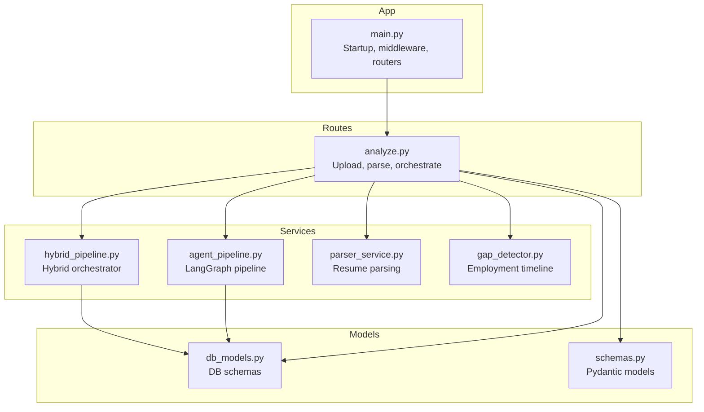
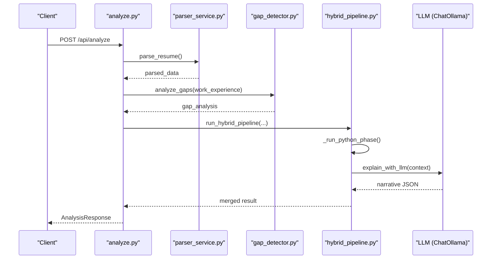
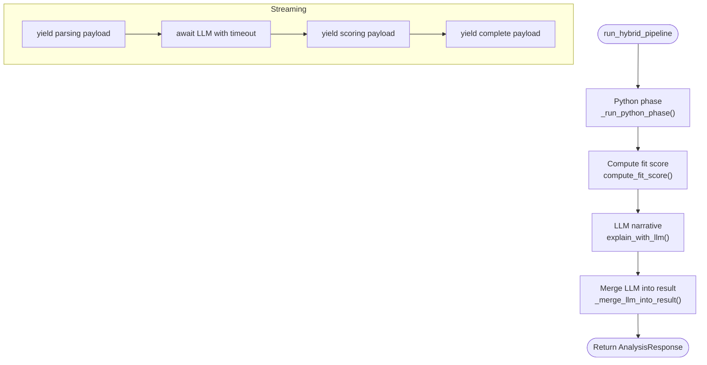
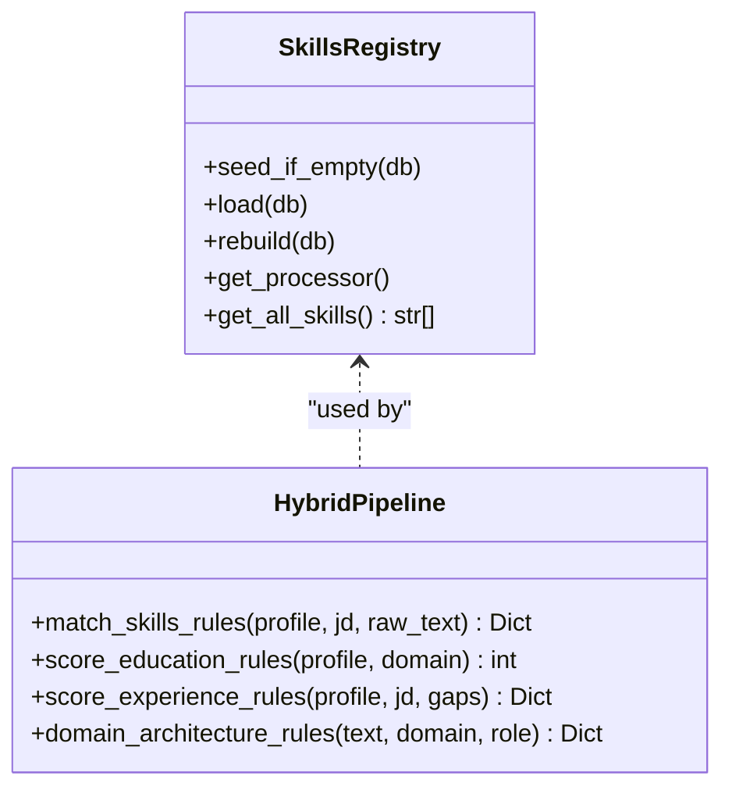
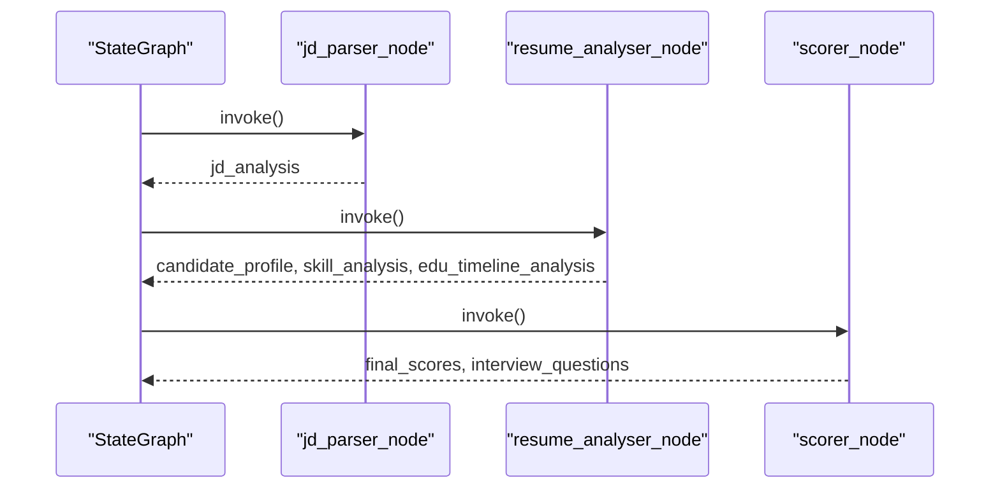
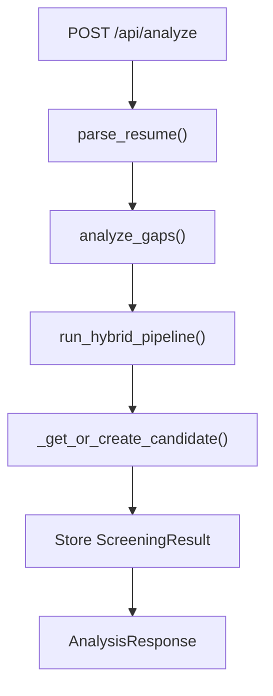
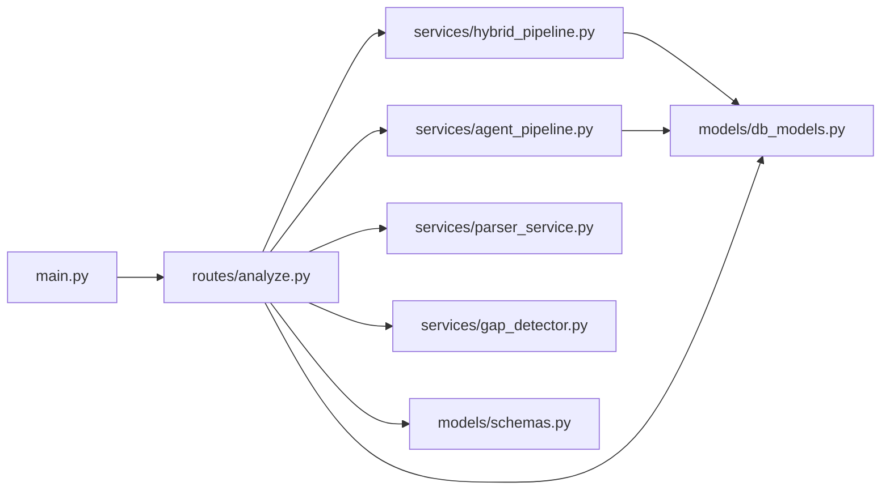

# Pipeline Plugin System

<cite>
**Referenced Files in This Document**
- [hybrid_pipeline.py](file://app/backend/services/hybrid_pipeline.py)
- [agent_pipeline.py](file://app/backend/services/agent_pipeline.py)
- [parser_service.py](file://app/backend/services/parser_service.py)
- [gap_detector.py](file://app/backend/services/gap_detector.py)
- [analyze.py](file://app/backend/routes/analyze.py)
- [main.py](file://app/backend/main.py)
- [db_models.py](file://app/backend/models/db_models.py)
- [schemas.py](file://app/backend/models/schemas.py)
</cite>

## Table of Contents
1. [Introduction](#introduction)
2. [Project Structure](#project-structure)
3. [Core Components](#core-components)
4. [Architecture Overview](#architecture-overview)
5. [Detailed Component Analysis](#detailed-component-analysis)
6. [Dependency Analysis](#dependency-analysis)
7. [Performance Considerations](#performance-considerations)
8. [Troubleshooting Guide](#troubleshooting-guide)
9. [Conclusion](#conclusion)
10. [Appendices](#appendices)

## Introduction
This document describes how to extend the hybrid pipeline architecture in Resume AI with custom plugins. The system currently supports two complementary pipeline styles:
- Hybrid pipeline: deterministic Python stages followed by a single LLM narrative call
- LangGraph agent pipeline: modular, multi-stage graph with parallelizable nodes

The plugin system enables:
- Extending the hybrid pipeline with custom analysis components
- Implementing custom skill extraction plugins
- Building domain-specific matching algorithms
- Integrating external analysis services and proprietary algorithms
- Managing plugin lifecycle, isolation, and error handling

## Project Structure
The Resume AI backend organizes pipeline logic under services, route orchestration under routes, and persistence under models. The hybrid pipeline orchestrator coordinates multiple analysis stages, while the LangGraph pipeline offers a modular, composable alternative.

**Diagram sources**
- [analyze.py:1-813](file://app/backend/routes/analyze.py#L1-L813)
- [hybrid_pipeline.py:1258-1498](file://app/backend/services/hybrid_pipeline.py#L1258-L1498)
- [agent_pipeline.py:520-634](file://app/backend/services/agent_pipeline.py#L520-L634)
- [parser_service.py:130-552](file://app/backend/services/parser_service.py#L130-L552)
- [gap_detector.py:103-219](file://app/backend/services/gap_detector.py#L103-L219)
- [db_models.py:1-250](file://app/backend/models/db_models.py#L1-L250)
- [schemas.py:89-125](file://app/backend/models/schemas.py#L89-L125)
- [main.py:174-215](file://app/backend/main.py#L174-L215)

**Section sources**
- [main.py:174-215](file://app/backend/main.py#L174-L215)
- [analyze.py:1-813](file://app/backend/routes/analyze.py#L1-L813)

## Core Components
The hybrid pipeline defines a deterministic, multi-stage analysis flow:
- Job Description Parsing: extracts role, domain, seniority, required skills, and years
- Resume Profile Builder: consolidates parsed resume data and inferred experience
- Skill Matching Engine: finds matches between candidate skills and job requirements
- Education Scoring: evaluates degree and field relevance
- Experience & Timeline Scoring: computes experience and timeline scores
- Domain & Architecture Scoring: measures domain fit and architecture signals
- Fit Score & Risk Signals: computes weighted fit score and risk indicators
- LLM Narrative: generates strengths, weaknesses, rationale, and interview questions

The LangGraph pipeline provides an alternative with modular nodes and parallelism.

**Section sources**
- [hybrid_pipeline.py:440-827](file://app/backend/services/hybrid_pipeline.py#L440-L827)
- [hybrid_pipeline.py:829-947](file://app/backend/services/hybrid_pipeline.py#L829-L947)
- [hybrid_pipeline.py:949-1058](file://app/backend/services/hybrid_pipeline.py#L949-L1058)
- [hybrid_pipeline.py:1074-1256](file://app/backend/services/hybrid_pipeline.py#L1074-L1256)
- [hybrid_pipeline.py:1258-1498](file://app/backend/services/hybrid_pipeline.py#L1258-L1498)
- [agent_pipeline.py:141-449](file://app/backend/services/agent_pipeline.py#L141-L449)

## Architecture Overview
The hybrid pipeline orchestrator executes Python stages first, then invokes a single LLM call for narrative synthesis. The LangGraph pipeline uses a state machine with nodes for parsing, analysis, and scoring.

**Diagram sources**
- [analyze.py:268-318](file://app/backend/routes/analyze.py#L268-L318)
- [parser_service.py:547-552](file://app/backend/services/parser_service.py#L547-L552)
- [gap_detector.py:217-219](file://app/backend/services/gap_detector.py#L217-L219)
- [hybrid_pipeline.py:1353-1407](file://app/backend/services/hybrid_pipeline.py#L1353-L1407)
- [hybrid_pipeline.py:1144-1194](file://app/backend/services/hybrid_pipeline.py#L1144-L1194)

## Detailed Component Analysis

### Hybrid Pipeline Orchestrator
The orchestrator coordinates deterministic stages and merges LLM narrative. It exposes synchronous and streaming variants.

**Diagram sources**
- [hybrid_pipeline.py:1258-1498](file://app/backend/services/hybrid_pipeline.py#L1258-L1498)
- [hybrid_pipeline.py:1353-1407](file://app/backend/services/hybrid_pipeline.py#L1353-L1407)
- [hybrid_pipeline.py:1410-1498](file://app/backend/services/hybrid_pipeline.py#L1410-L1498)

**Section sources**
- [hybrid_pipeline.py:1258-1498](file://app/backend/services/hybrid_pipeline.py#L1258-L1498)

### Skills Registry and Matching Engine
The skills registry maintains a keyword processor for skill extraction and normalization. The matching engine supports exact, alias, substring, and fuzzy matching.

**Diagram sources**
- [hybrid_pipeline.py:323-423](file://app/backend/services/hybrid_pipeline.py#L323-L423)
- [hybrid_pipeline.py:676-751](file://app/backend/services/hybrid_pipeline.py#L676-L751)
- [hybrid_pipeline.py:793-827](file://app/backend/services/hybrid_pipeline.py#L793-L827)
- [hybrid_pipeline.py:833-895](file://app/backend/services/hybrid_pipeline.py#L833-L895)
- [hybrid_pipeline.py:911-947](file://app/backend/services/hybrid_pipeline.py#L911-L947)

**Section sources**
- [hybrid_pipeline.py:323-423](file://app/backend/services/hybrid_pipeline.py#L323-L423)
- [hybrid_pipeline.py:676-751](file://app/backend/services/hybrid_pipeline.py#L676-L751)

### LangGraph Pipeline
The LangGraph pipeline defines a state machine with nodes for JD parsing, combined resume analysis, and scoring. It supports streaming and caching.

**Diagram sources**
- [agent_pipeline.py:522-541](file://app/backend/services/agent_pipeline.py#L522-L541)
- [agent_pipeline.py:161-180](file://app/backend/services/agent_pipeline.py#L161-L180)
- [agent_pipeline.py:280-322](file://app/backend/services/agent_pipeline.py#L280-L322)
- [agent_pipeline.py:367-449](file://app/backend/services/agent_pipeline.py#L367-L449)

**Section sources**
- [agent_pipeline.py:520-634](file://app/backend/services/agent_pipeline.py#L520-L634)

### Route Orchestration and Persistence
The analyze route coordinates parsing, gap analysis, pipeline execution, and persistence. It also manages usage limits and deduplication.

**Diagram sources**
- [analyze.py:268-318](file://app/backend/routes/analyze.py#L268-L318)
- [analyze.py:147-215](file://app/backend/routes/analyze.py#L147-L215)
- [analyze.py:449-501](file://app/backend/routes/analyze.py#L449-L501)

**Section sources**
- [analyze.py:1-813](file://app/backend/routes/analyze.py#L1-L813)

## Dependency Analysis
The system exhibits clear separation of concerns:
- Routes depend on services for parsing, gap analysis, and pipeline execution
- Services depend on models for persistence and schemas for validation
- The main application wires routes and performs startup checks

**Diagram sources**
- [analyze.py:1-813](file://app/backend/routes/analyze.py#L1-L813)
- [hybrid_pipeline.py:1258-1498](file://app/backend/services/hybrid_pipeline.py#L1258-L1498)
- [agent_pipeline.py:520-634](file://app/backend/services/agent_pipeline.py#L520-L634)
- [parser_service.py:130-552](file://app/backend/services/parser_service.py#L130-L552)
- [gap_detector.py:103-219](file://app/backend/services/gap_detector.py#L103-L219)
- [db_models.py:1-250](file://app/backend/models/db_models.py#L1-L250)
- [schemas.py:89-125](file://app/backend/models/schemas.py#L89-L125)
- [main.py:174-215](file://app/backend/main.py#L174-L215)

**Section sources**
- [main.py:174-215](file://app/backend/main.py#L174-L215)
- [analyze.py:1-813](file://app/backend/routes/analyze.py#L1-L813)

## Performance Considerations
- Concurrency control: the hybrid pipeline uses a semaphore to limit concurrent LLM calls
- Model warm-up: the main application checks Ollama reachability and model readiness
- Streaming: the streaming hybrid pipeline emits heartbeats to keep connections alive
- Caching: shared JD cache reduces repeated parsing costs
- Thread pool: parsing is executed in a thread to avoid blocking the event loop

[No sources needed since this section provides general guidance]

## Troubleshooting Guide
Common issues and remedies:
- LLM unavailability or timeouts: the hybrid pipeline falls back to deterministic narratives
- Startup failures: the main application prints a startup banner and continues even if checks fail
- Usage limits: the analyze route enforces tenant quotas and records usage
- Deduplication: the route implements multi-layer deduplication to prevent redundant processing

**Section sources**
- [hybrid_pipeline.py:1384-1407](file://app/backend/services/hybrid_pipeline.py#L1384-L1407)
- [main.py:68-172](file://app/backend/main.py#L68-L172)
- [analyze.py:323-352](file://app/backend/routes/analyze.py#L323-L352)
- [analyze.py:147-215](file://app/backend/routes/analyze.py#L147-L215)

## Conclusion
Resume AI’s hybrid pipeline provides a robust foundation for extending with custom plugins. By leveraging the existing orchestrators, services, and schemas, developers can implement custom analysis components, integrate external services, and maintain compatibility with the core architecture.

[No sources needed since this section summarizes without analyzing specific files]

## Appendices

### Plugin Extension Guidelines

#### 1. Extend the Hybrid Pipeline
- Add a new stage function in the hybrid pipeline module following the pattern of existing stages
- Integrate the stage into `_run_python_phase()` to compute intermediate scores or metadata
- Merge results into the final result dictionary and ensure schema compatibility

**Section sources**
- [hybrid_pipeline.py:1262-1333](file://app/backend/services/hybrid_pipeline.py#L1262-L1333)
- [hybrid_pipeline.py:1336-1350](file://app/backend/services/hybrid_pipeline.py#L1336-L1350)

#### 2. Create Custom Skill Extraction Plugins
- Implement a function that extracts skills from text or structured data
- Optionally integrate with the skills registry for normalization and alias expansion
- Ensure the function returns a deduplicated list of canonical skill names

**Section sources**
- [hybrid_pipeline.py:589-598](file://app/backend/services/hybrid_pipeline.py#L589-L598)
- [hybrid_pipeline.py:655-674](file://app/backend/services/hybrid_pipeline.py#L655-L674)

#### 3. Implement Domain-Specific Matching Algorithms
- Define domain-specific keywords and scoring logic
- Use the domain architecture stage as a reference for measuring domain fit and architecture signals

**Section sources**
- [hybrid_pipeline.py:911-947](file://app/backend/services/hybrid_pipeline.py#L911-L947)

#### 4. Integrate External Analysis Services
- Wrap external APIs behind a function that returns structured data compatible with the pipeline
- Handle timeouts and errors gracefully, returning fallback values when necessary
- Consider caching responses to reduce latency and cost

**Section sources**
- [hybrid_pipeline.py:1144-1194](file://app/backend/services/hybrid_pipeline.py#L1144-L1194)
- [analyze.py:49-67](file://app/backend/routes/analyze.py#L49-L67)

#### 5. Manage Plugin Lifecycle
- Initialize resources (e.g., LLM singletons) at module load time
- Provide hot-reload capabilities for dynamic updates (e.g., skills registry rebuild)
- Use environment variables to configure plugin behavior and resource limits

**Section sources**
- [agent_pipeline.py:70-100](file://app/backend/services/agent_pipeline.py#L70-L100)
- [hybrid_pipeline.py:28-43](file://app/backend/services/hybrid_pipeline.py#L28-L43)
- [main.py:68-172](file://app/backend/main.py#L68-L172)

#### 6. Ensure Isolation and Error Handling
- Enclose external calls in try/except blocks and log warnings
- Return structured fallbacks that maintain schema compatibility
- Avoid blocking the event loop; use thread pools for heavy I/O

**Section sources**
- [agent_pipeline.py:171-179](file://app/backend/services/agent_pipeline.py#L171-L179)
- [parser_service.py:175-182](file://app/backend/services/parser_service.py#L175-L182)
- [analyze.py:276-291](file://app/backend/routes/analyze.py#L276-L291)

#### 7. Performance Monitoring
- Track stage durations and throughput
- Monitor LLM latency and error rates
- Use structured logging to capture analysis outcomes and pipeline metrics

**Section sources**
- [analyze.py:491-501](file://app/backend/routes/analyze.py#L491-L501)
- [agent_pipeline.py:520-541](file://app/backend/services/agent_pipeline.py#L520-L541)

#### 8. Maintain Compatibility
- Preserve the AnalysisResponse schema and backward-compatible fields
- Ensure new fields are optional and gracefully handled by clients
- Validate inputs and outputs using Pydantic models

**Section sources**
- [schemas.py:89-125](file://app/backend/models/schemas.py#L89-L125)
- [db_models.py:128-147](file://app/backend/models/db_models.py#L128-L147)