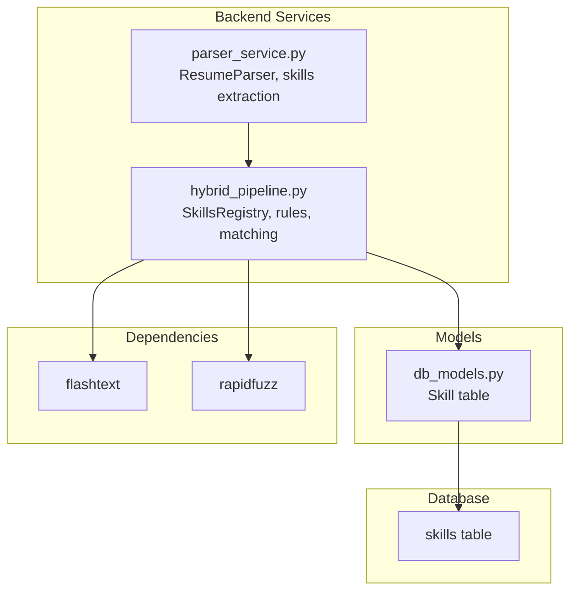
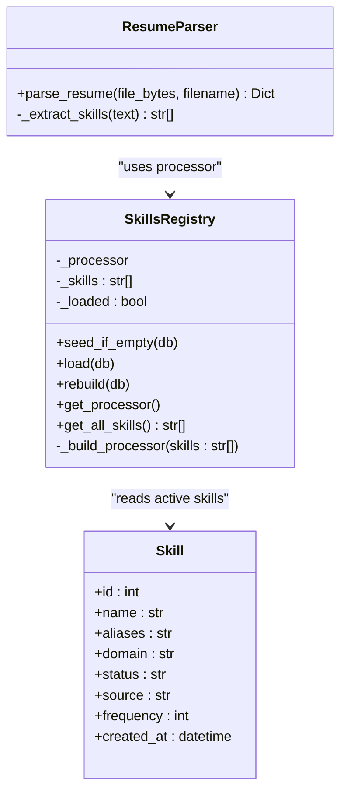
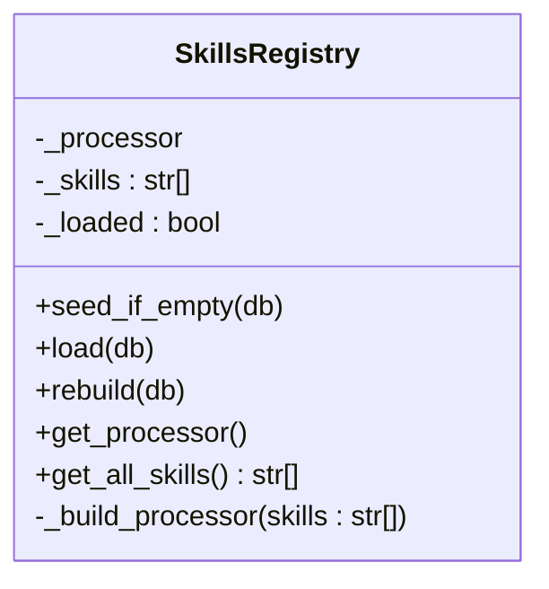
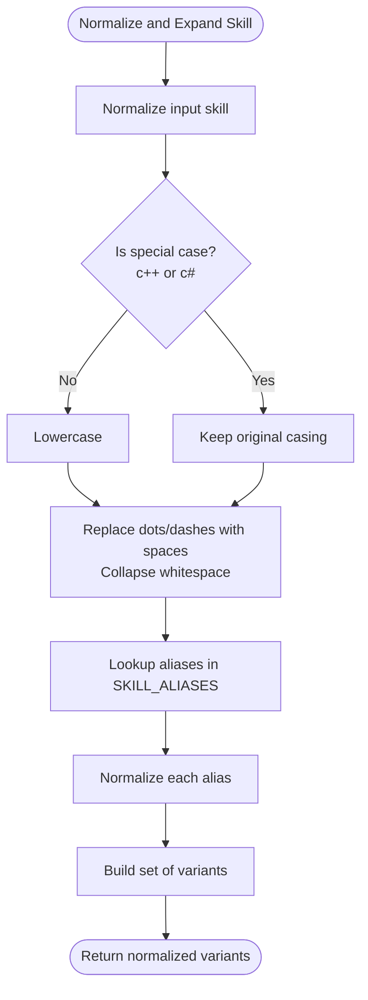
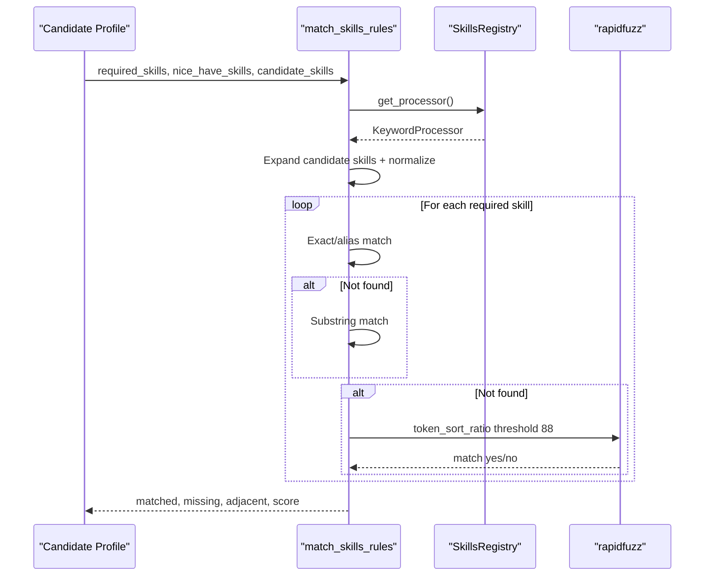
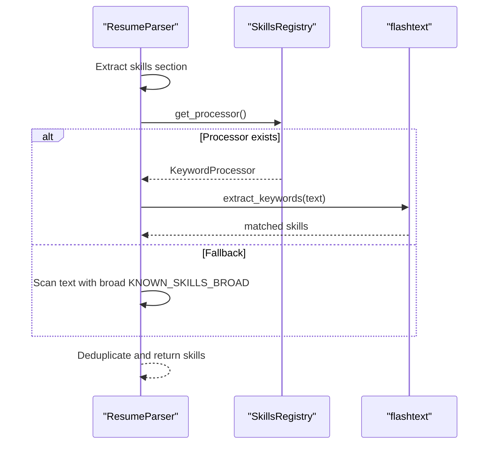
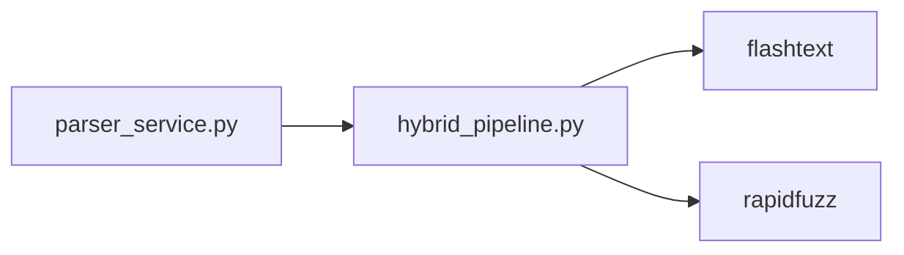

# Skills Registry Extension

<cite>
**Referenced Files in This Document**
- [hybrid_pipeline.py](file://app/backend/services/hybrid_pipeline.py)
- [parser_service.py](file://app/backend/services/parser_service.py)
- [db_models.py](file://app/backend/models/db_models.py)
- [requirements.txt](file://requirements.txt)
- [001_enrich_candidates_add_caches.py](file://alembic/versions/001_enrich_candidates_add_caches.py)
</cite>

## Table of Contents
1. [Introduction](#introduction)
2. [Project Structure](#project-structure)
3. [Core Components](#core-components)
4. [Architecture Overview](#architecture-overview)
5. [Detailed Component Analysis](#detailed-component-analysis)
6. [Dependency Analysis](#dependency-analysis)
7. [Performance Considerations](#performance-considerations)
8. [Troubleshooting Guide](#troubleshooting-guide)
9. [Conclusion](#conclusion)
10. [Appendices](#appendices)

## Introduction
This document explains how to extend the Skills Registry system in Resume AI. It covers:
- Adding new skills to the MASTER_SKILLS list
- Creating custom skill aliases
- Implementing domain-specific skill mappings
- Understanding the SkillsRegistry class architecture and its integration with flashtext and the database
- Skill normalization, fuzzy matching, and performance optimization
- Examples for industry-specific skills and domain keyword mappings
- Database schema considerations, skill status management, and integration with the parser service for skill extraction

## Project Structure
The Skills Registry is implemented in the backend hybrid pipeline service and backed by a database model. The parser service integrates with the registry to extract skills from text.

**Diagram sources**
- [hybrid_pipeline.py](file://app/backend/services/hybrid_pipeline.py)
- [parser_service.py](file://app/backend/services/parser_service.py)
- [db_models.py](file://app/backend/models/db_models.py)

**Section sources**
- [hybrid_pipeline.py](file://app/backend/services/hybrid_pipeline.py)
- [parser_service.py](file://app/backend/services/parser_service.py)
- [db_models.py](file://app/backend/models/db_models.py)

## Core Components
- MASTER_SKILLS: Hardcoded canonical skill list used as the base for seeding the database and building the in-memory flashtext processor.
- SKILL_ALIASES: Dictionary mapping canonical skills to their aliases for normalization and fuzzy matching.
- DOMAIN_KEYWORDS: Mapping of domain categories to keywords used to classify skills during seeding and parsing.
- SkillsRegistry: In-memory flashtext-based skill registry backed by the database, with hot-reload support.
- Parser integration: ResumeParser uses the registry for skill extraction and falls back to regex-based scanning.

Key responsibilities:
- Seed the database from MASTER_SKILLS and SKILL_ALIASES
- Load active skills into memory for fast lookup
- Normalize and expand candidate skills with aliases
- Match required and nice-to-have skills against candidate profiles
- Provide fuzzy matching fallback for approximate matches

**Section sources**
- [hybrid_pipeline.py](file://app/backend/services/hybrid_pipeline.py)
- [parser_service.py](file://app/backend/services/parser_service.py)

## Architecture Overview
The Skills Registry architecture combines a database-backed dynamic registry with an in-memory flashtext processor for fast keyword extraction. It supports hot reloading and integrates with the parser service.

**Diagram sources**
- [hybrid_pipeline.py](file://app/backend/services/hybrid_pipeline.py)
- [db_models.py](file://app/backend/models/db_models.py)
- [parser_service.py](file://app/backend/services/parser_service.py)

## Detailed Component Analysis

### SkillsRegistry Class
SkillsRegistry encapsulates:
- Database-backed skill storage and status management
- In-memory flashtext KeywordProcessor for fast extraction
- Hot-reload capability via rebuild()

- seed_if_empty(db): Upserts MASTER_SKILLS into the skills table with defaults for aliases, domain, status, source, and frequency. Uses PostgreSQL insert-on-conflict to avoid duplicates.
- load(db): Queries active skills from the database, merges canonical and alias terms, and builds the flashtext processor. Falls back to MASTER_SKILLS if DB fails.
- rebuild(db): Resets loaded state and reloads skills for hot-reload.
- get_processor(): Lazy-loads and returns the flashtext processor.
- get_all_skills(): Returns the current in-memory skill list.

Integration points:
- Uses flashtext KeywordProcessor to extract skills from text.
- Uses SKILL_ALIASES to normalize and expand candidate skills during matching.

**Section sources**
- [hybrid_pipeline.py](file://app/backend/services/hybrid_pipeline.py)

### Skill Normalization and Expansion
Normalization and expansion are used to match variations of skills consistently:
- _normalize_skill(s): Lowercases and normalizes punctuation/slashes; preserves special cases like "c++" and "c#".
- _expand_skill(skill): Returns the normalized canonical skill plus all normalized aliases (including raw-form aliases).

**Diagram sources**
- [hybrid_pipeline.py](file://app/backend/services/hybrid_pipeline.py)

**Section sources**
- [hybrid_pipeline.py](file://app/backend/services/hybrid_pipeline.py)

### Fuzzy Matching and Matching Engine
The matching engine performs:
- Exact/alias match against the candidate’s normalized skill set
- Substring match for partial containment (e.g., "React Native" vs "React")
- Fuzzy fallback using rapidfuzz with a token-sort ratio threshold (default 88), capped at a fixed number of candidates for performance

**Diagram sources**
- [hybrid_pipeline.py](file://app/backend/services/hybrid_pipeline.py)

**Section sources**
- [hybrid_pipeline.py](file://app/backend/services/hybrid_pipeline.py)

### Parser Integration for Skill Extraction
The parser service extracts skills using:
- Section-based extraction (e.g., "SKILLS:" blocks)
- Fallback to flashtext-based scanning using the SkillsRegistry processor
- Final fallback to a broad skills list if flashtext is unavailable

**Diagram sources**
- [parser_service.py](file://app/backend/services/parser_service.py)
- [hybrid_pipeline.py](file://app/backend/services/hybrid_pipeline.py)

**Section sources**
- [parser_service.py](file://app/backend/services/parser_service.py)
- [hybrid_pipeline.py](file://app/backend/services/hybrid_pipeline.py)

## Dependency Analysis
External dependencies used by the Skills Registry:
- flashtext: Fast keyword extraction for skill matching
- rapidfuzz: Fuzzy string matching for approximate skill matches

**Diagram sources**
- [requirements.txt](file://requirements.txt)
- [hybrid_pipeline.py](file://app/backend/services/hybrid_pipeline.py)
- [parser_service.py](file://app/backend/services/parser_service.py)

**Section sources**
- [requirements.txt](file://requirements.txt)
- [hybrid_pipeline.py](file://app/backend/services/hybrid_pipeline.py)
- [parser_service.py](file://app/backend/services/parser_service.py)

## Performance Considerations
- In-memory flashtext processor: Builds a single processor from active skills and aliases for O(1) keyword extraction.
- Hot-reload: Rebuild resets the loaded flag and reloads from DB without restarting the app.
- Fuzzy matching caps: Limits fuzzy checks to a small subset of candidate skills to maintain responsiveness.
- Database indexing: Skills table includes unique name and id indexes for efficient lookups.

Recommendations:
- Prefer canonical skills in MASTER_SKILLS to minimize ambiguity.
- Keep SKILL_ALIASES concise and normalized to reduce false positives.
- Monitor frequency updates to refine domain mappings and prioritize popular skills.

[No sources needed since this section provides general guidance]

## Troubleshooting Guide
Common issues and resolutions:
- Skills not recognized:
  - Verify the skill is present in MASTER_SKILLS or active in the skills table.
  - Confirm SKILL_ALIASES includes relevant variations.
  - Ensure the flashtext dependency is installed.
- DB connectivity failures:
  - The registry gracefully falls back to MASTER_SKILLS.
  - Use rebuild() to reload after fixing DB issues.
- Fuzzy matches not triggering:
  - Adjust the rapidfuzz threshold or expand candidate aliases.
  - Confirm normalization rules are not altering intended matches.

**Section sources**
- [hybrid_pipeline.py](file://app/backend/services/hybrid_pipeline.py)
- [requirements.txt](file://requirements.txt)

## Conclusion
The Skills Registry provides a robust, extensible foundation for skill extraction and matching. By extending MASTER_SKILLS, SKILL_ALIASES, and DOMAIN_KEYWORDS, and leveraging the database-backed design, you can scale the system to new industries and domains while maintaining performance and accuracy.

[No sources needed since this section summarizes without analyzing specific files]

## Appendices

### How to Extend the Skills Registry

- Add a new skill to MASTER_SKILLS:
  - Insert the canonical skill name into the list in the hybrid pipeline module.
  - Run seed_if_empty(db) to upsert the skill into the database.

- Create custom skill aliases:
  - Add entries to SKILL_ALIASES mapping the canonical skill to its aliases.
  - The registry automatically adds aliases to the flashtext processor.

- Implement domain-specific skill mappings:
  - Add keywords to DOMAIN_KEYWORDS under the appropriate domain category.
  - During seeding, the system maps skills to domains based on these keywords.

- Hot-reload skills:
  - Call rebuild(db) to refresh the in-memory processor without restarting the service.

- Integrate with parser service:
  - The ResumeParser uses the registry for skill extraction; ensure the registry is loaded before parsing.

- Database schema considerations:
  - The skills table includes name (unique), aliases, domain, status, source, frequency, and timestamps.
  - Indexes on id and name improve query performance.

- Skill status management:
  - Use status values like active, pending, rejected to control visibility.
  - The loader filters by status to build the in-memory processor.

- Skill frequency tracking:
  - The frequency column can be incremented when skills are observed in job descriptions or resumes.
  - Use this to prioritize frequent skills and tune domain mappings.

**Section sources**
- [hybrid_pipeline.py](file://app/backend/services/hybrid_pipeline.py)
- [db_models.py](file://app/backend/models/db_models.py)
- [001_enrich_candidates_add_caches.py](file://alembic/versions/001_enrich_candidates_add_caches.py)
- [parser_service.py](file://app/backend/services/parser_service.py)