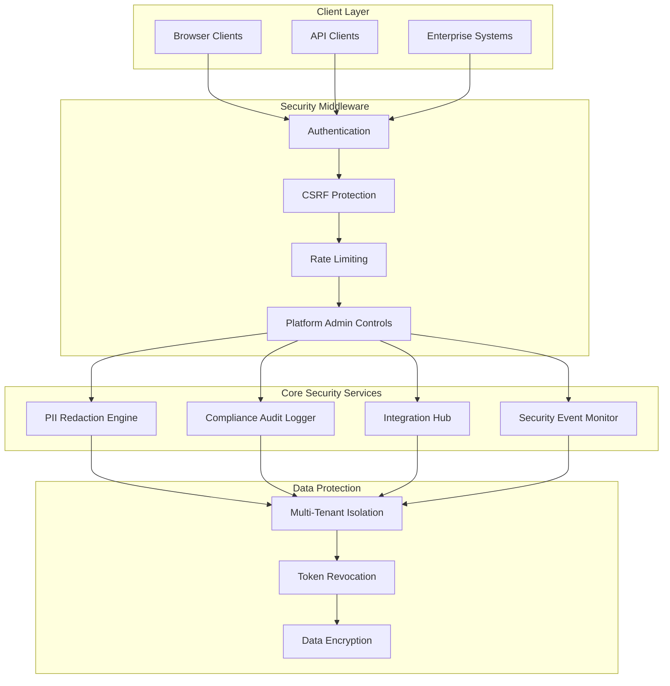
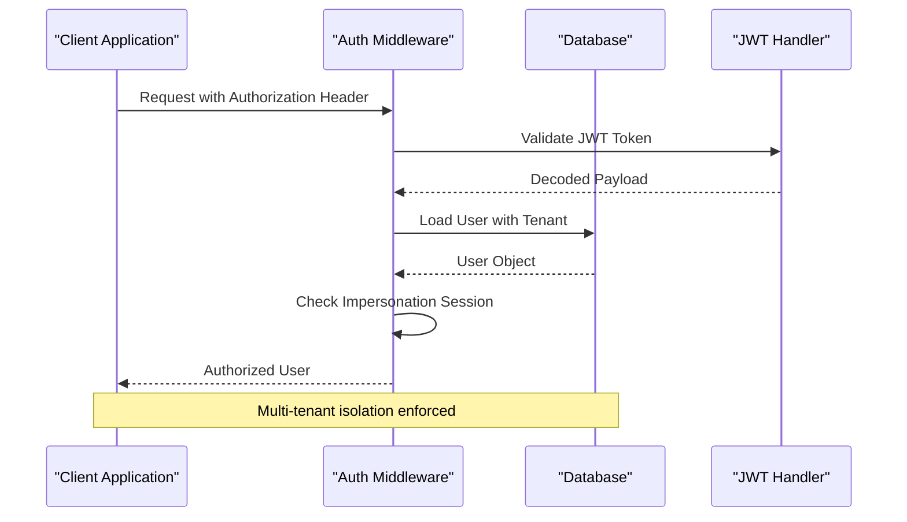
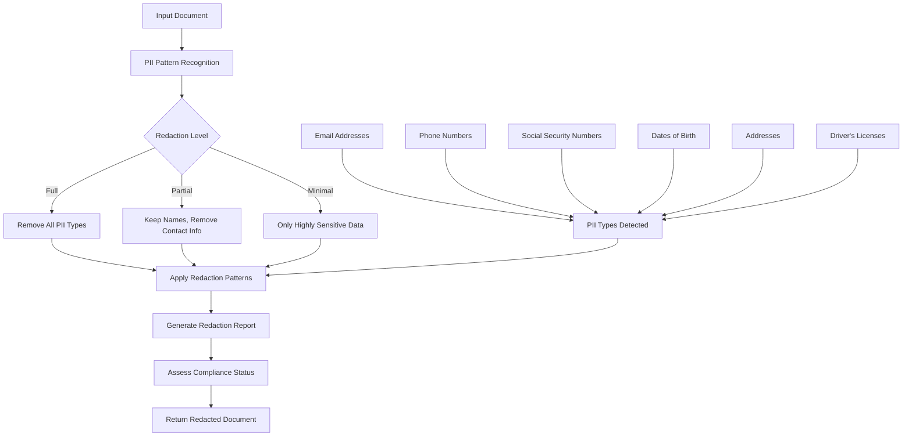
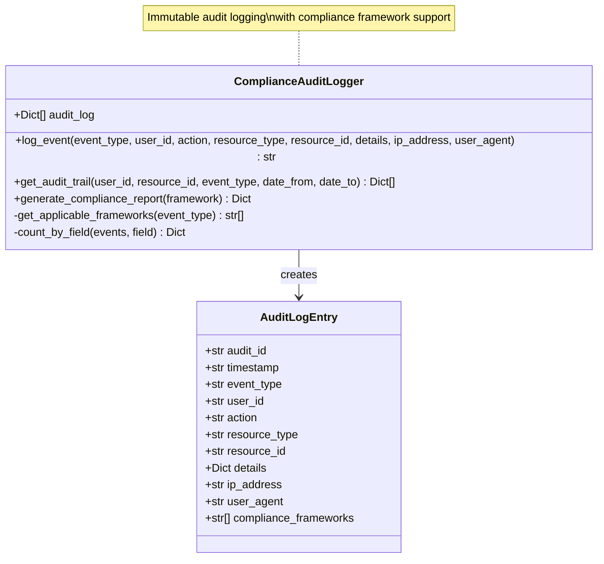
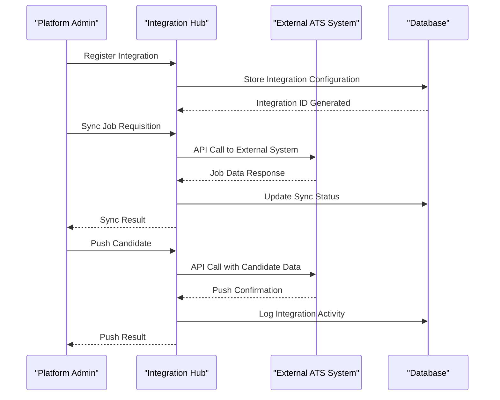
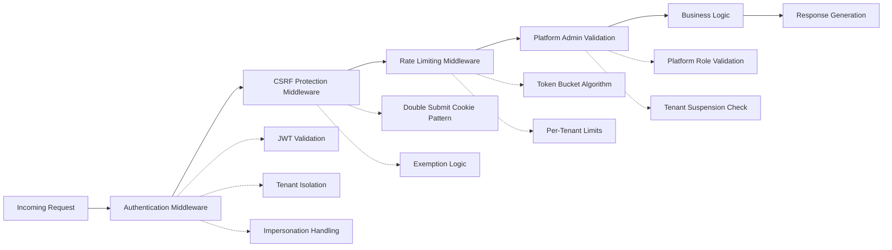
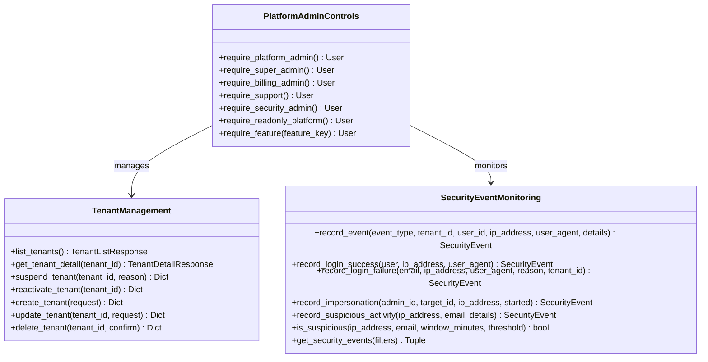
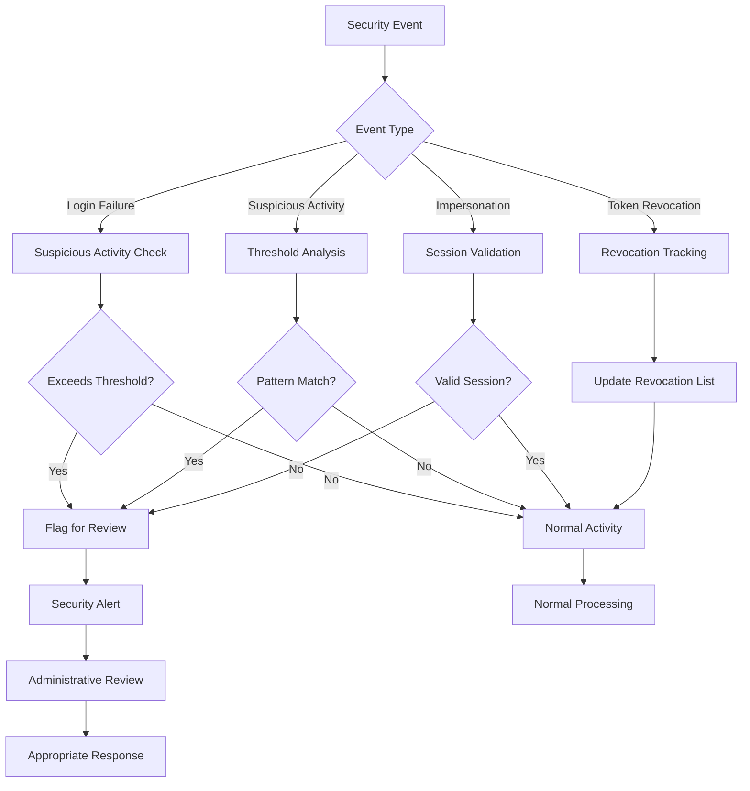
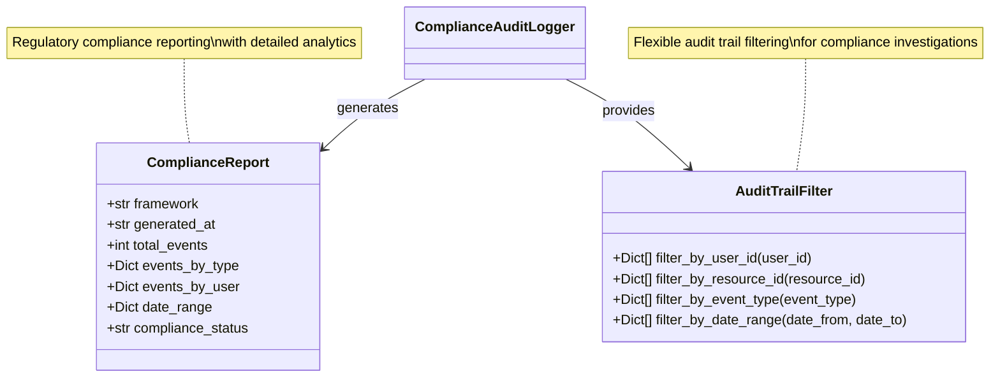
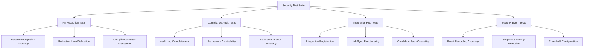

# Enterprise Security and Compliance Framework

<cite>
**Referenced Files in This Document**
- [enterprise_security.py](file://app/backend/services/enterprise_security.py)
- [auth.py](file://app/backend/middleware/auth.py)
- [csrf.py](file://app/backend/middleware/csrf.py)
- [rate_limit.py](file://app/backend/middleware/rate_limit.py)
- [security_event_service.py](file://app/backend/services/security_event_service.py)
- [audit_service.py](file://app/backend/services/audit_service.py)
- [impersonation_service.py](file://app/backend/services/impersonation_service.py)
- [db_models.py](file://app/backend/models/db_models.py)
- [admin.py](file://app/backend/routes/admin.py)
- [test_phase5_enterprise_security.py](file://app/backend/tests/test_phase5_enterprise_security.py)
- [README.md](file://README.md)
</cite>

## Table of Contents
1. [Introduction](#introduction)
2. [Framework Overview](#framework-overview)
3. [Core Security Components](#core-security-components)
4. [PII Redaction System](#pii-redaction-system)
5. [Compliance Audit Framework](#compliance-audit-framework)
6. [Enterprise Integration Hub](#enterprise-integration-hub)
7. [Security Middleware Stack](#security-middleware-stack)
8. [Platform Administration Security](#platform-administration-security)
9. [Security Event Monitoring](#security-event-monitoring)
10. [Data Protection and Privacy](#data-privacy-and-proprietary-data)
11. [Compliance Reporting](#compliance-reporting)
12. [Implementation Guidelines](#implementation-guidelines)
13. [Testing and Validation](#testing-and-validation)
14. [Best Practices](#best-practices)
15. [Troubleshooting Guide](#troubleshooting-guide)
16. [Conclusion](#conclusion)

## Introduction

The Enterprise Security and Compliance Framework represents a comprehensive security architecture designed for production-grade, multi-tenant SaaS platforms handling sensitive recruitment data. This framework addresses the critical security and compliance requirements for enterprise environments while maintaining operational efficiency and regulatory adherence.

The framework encompasses three primary pillars: data protection through automated PII redaction, comprehensive compliance audit logging, and enterprise integration capabilities for ATS/HRIS systems. Built on a robust middleware foundation, it ensures enterprise-grade security controls including authentication, authorization, rate limiting, and cross-site request forgery protection.

## Framework Overview

The Enterprise Security and Compliance Framework operates as a layered security architecture that protects sensitive recruitment data while enabling seamless enterprise integration. The framework emphasizes defense-in-depth principles, combining multiple security controls to create a comprehensive protection strategy.

**Diagram sources**
- [enterprise_security.py:15-376](file://app/backend/services/enterprise_security.py#L15-L376)
- [auth.py:79-239](file://app/backend/middleware/auth.py#L79-L239)
- [csrf.py:15-95](file://app/backend/middleware/csrf.py#L15-L95)
- [rate_limit.py:16-144](file://app/backend/middleware/rate_limit.py#L16-L144)

## Core Security Components

### Multi-Factor Authentication and Authorization

The framework implements a comprehensive authentication system supporting both JWT-based API authentication and session-based browser authentication. The authentication middleware provides tenant-scoped user loading with automatic impersonation support for administrative functions.

**Diagram sources**
- [auth.py:58-137](file://app/backend/middleware/auth.py#L58-L137)

### Cross-Site Request Forgery Protection

The CSRF protection middleware implements a double-submit cookie pattern specifically designed for browser clients using cookie-based authentication. This protection mechanism automatically exempts API clients using Authorization headers and implements token rotation for enhanced security.

**Section sources**
- [csrf.py:15-95](file://app/backend/middleware/csrf.py#L15-L95)

### Rate Limiting and Abuse Prevention

The rate limiting middleware provides per-tenant token bucket rate limiting with configurable limits and automatic caching. This system prevents abuse while accommodating legitimate usage patterns across different tenant tiers.

**Section sources**
- [rate_limit.py:16-144](file://app/backend/middleware/rate_limit.py#L16-L144)

## PII Redaction System

### Automated Data Protection

The PII Redaction Engine provides comprehensive protection for personally identifiable information through automated pattern recognition and redaction. The system supports multiple redaction levels to accommodate different compliance requirements and use cases.

**Diagram sources**
- [enterprise_security.py:32-120](file://app/backend/services/enterprise_security.py#L32-L120)

### Redaction Levels and Compliance

The system implements three distinct redaction levels, each designed for specific compliance scenarios:

- **Full Redaction**: Complete removal of all PII types for maximum privacy protection
- **Partial Redaction**: Preserves identifying information while removing sensitive contact details
- **Minimal Redaction**: Focuses on highly sensitive data like SSNs and DOBs while maintaining contextual information

**Section sources**
- [enterprise_security.py:15-120](file://app/backend/services/enterprise_security.py#L15-L120)

## Compliance Audit Framework

### Immutable Audit Logging

The Compliance Audit Logger provides comprehensive audit trail functionality supporting multiple regulatory frameworks including GDPR, CCPA, EEOC, and SOC 2 Type II requirements. The system maintains immutable audit logs with detailed event tracking and compliance reporting capabilities.

**Diagram sources**
- [enterprise_security.py:123-272](file://app/backend/services/enterprise_security.py#L123-L272)

### Regulatory Framework Support

The audit system automatically applies relevant compliance frameworks based on event types, ensuring proper regulatory adherence across different operational scenarios.

**Section sources**
- [enterprise_security.py:123-272](file://app/backend/services/enterprise_security.py#L123-L272)

## Enterprise Integration Hub

### ATS/HRIS System Connectivity

The Integration Hub provides a scalable foundation for connecting with enterprise systems including ATS platforms, HRIS systems, assessment platforms, and background check services. The system supports multiple integration types with comprehensive error handling and status tracking.

**Diagram sources**
- [enterprise_security.py:275-376](file://app/backend/services/enterprise_security.py#L275-L376)

### Integration Management

The system provides comprehensive integration management including registration, configuration, status monitoring, and error handling. Each integration maintains detailed logging and status tracking for operational oversight.

**Section sources**
- [enterprise_security.py:275-376](file://app/backend/services/enterprise_security.py#L275-L376)

## Security Middleware Stack

### Layered Protection Architecture

The security middleware stack provides comprehensive protection through multiple layers of security controls. Each middleware component addresses specific security concerns while maintaining system performance and usability.

**Diagram sources**
- [auth.py:79-239](file://app/backend/middleware/auth.py#L79-L239)
- [csrf.py:52-94](file://app/backend/middleware/csrf.py#L52-L94)
- [rate_limit.py:123-144](file://app/backend/middleware/rate_limit.py#L123-L144)

### Authentication and Authorization

The authentication system implements industry-standard JWT-based authentication with comprehensive tenant isolation and role-based access control. The system supports both traditional API authentication and browser-based session management.

**Section sources**
- [auth.py:79-239](file://app/backend/middleware/auth.py#L79-L239)

## Platform Administration Security

### Administrative Controls

The platform administration security framework provides comprehensive controls for platform-level management including tenant management, user administration, and system configuration. These controls implement strict segregation of duties and comprehensive audit trails.

**Diagram sources**
- [auth.py:168-239](file://app/backend/middleware/auth.py#L168-L239)
- [admin.py:19-800](file://app/backend/routes/admin.py#L19-L800)
- [security_event_service.py:24-180](file://app/backend/services/security_event_service.py#L24-L180)

### Security Event Monitoring

The security event monitoring system provides comprehensive tracking of security-relevant events including login attempts, impersonation activities, and suspicious behavior detection. The system implements configurable thresholds and automated alerting capabilities.

**Section sources**
- [security_event_service.py:24-180](file://app/backend/services/security_event_service.py#L24-L180)

## Security Event Monitoring

### Threat Detection and Response

The security event monitoring system implements sophisticated threat detection capabilities through configurable thresholds and pattern recognition. The system can detect suspicious login patterns, unauthorized access attempts, and potential security breaches.

**Diagram sources**
- [security_event_service.py:117-180](file://app/backend/services/security_event_service.py#L117-L180)

### Suspicious Activity Detection

The system implements intelligent suspicious activity detection through configurable thresholds and time-window analysis. This capability helps identify potential security threats and unauthorized access patterns.

**Section sources**
- [security_event_service.py:117-180](file://app/backend/services/security_event_service.py#L117-L180)

## Data Privacy and Proprietary Data

### Multi-Tenant Data Isolation

The framework implements comprehensive multi-tenant data isolation ensuring complete separation of customer data across all system components. This isolation extends to database queries, file storage, and processing pipelines.

### Token-Based Authentication

The system implements industry-standard JWT-based authentication with secure token management including automatic expiration, refresh token handling, and comprehensive token revocation capabilities.

**Section sources**
- [auth.py:58-137](file://app/backend/middleware/auth.py#L58-L137)

## Compliance Reporting

### Regulatory Compliance Support

The compliance reporting system provides comprehensive support for multiple regulatory frameworks including GDPR, CCPA, EEOC, and SOC 2 Type II requirements. The system generates detailed compliance reports with audit trail analysis and regulatory-specific insights.

**Diagram sources**
- [enterprise_security.py:223-272](file://app/backend/services/enterprise_security.py#L223-L272)

### Audit Trail Management

The audit trail management system provides comprehensive filtering, searching, and reporting capabilities for security and compliance purposes. The system maintains immutable audit logs with detailed event context and regulatory compliance support.

**Section sources**
- [enterprise_security.py:184-272](file://app/backend/services/enterprise_security.py#L184-L272)

## Implementation Guidelines

### Security Configuration

When implementing the Enterprise Security and Compliance Framework, organizations should follow these key configuration guidelines:

1. **Environment-Specific Settings**: Configure appropriate security settings for development, staging, and production environments
2. **Secret Management**: Implement secure storage for JWT secrets, API keys, and other sensitive credentials
3. **Audit Configuration**: Enable comprehensive audit logging for all security-relevant events
4. **Integration Security**: Implement secure communication channels and authentication for enterprise integrations

### Deployment Considerations

The framework supports both cloud and on-premises deployment scenarios with appropriate security configurations for each environment. Organizations should consider network security, data encryption, and access control policies when deploying the framework.

## Testing and Validation

### Security Testing Framework

The framework includes comprehensive security testing capabilities covering PII redaction accuracy, audit logging completeness, and integration hub functionality. The testing framework validates security controls under various attack scenarios and compliance requirements.

**Diagram sources**
- [test_phase5_enterprise_security.py:19-232](file://app/backend/tests/test_phase5_enterprise_security.py#L19-L232)

### Validation Requirements

Security validation should include penetration testing, compliance auditing, and performance testing under load conditions. The framework provides comprehensive testing capabilities to validate security controls and compliance requirements.

**Section sources**
- [test_phase5_enterprise_security.py:19-232](file://app/backend/tests/test_phase5_enterprise_security.py#L19-L232)

## Best Practices

### Security Implementation Guidelines

Organizations implementing the Enterprise Security and Compliance Framework should follow these best practices:

1. **Defense in Depth**: Implement multiple layers of security controls to protect against various threat vectors
2. **Regular Security Audits**: Conduct periodic security assessments and vulnerability scans
3. **Access Control**: Implement principle of least privilege and regular access reviews
4. **Data Retention**: Establish appropriate data retention and deletion policies
5. **Incident Response**: Develop comprehensive incident response procedures and regularly test them

### Compliance Maintenance

Maintaining compliance requires ongoing effort including regular policy updates, staff training, and continuous monitoring of security controls. The framework's audit capabilities support these maintenance activities through comprehensive logging and reporting.

## Troubleshooting Guide

### Common Security Issues

Common security issues and their resolutions include:

- **Authentication Failures**: Verify JWT configuration, token expiration settings, and user account status
- **CSRF Protection Errors**: Check cookie configuration, header settings, and exemption rules
- **Rate Limiting Issues**: Review per-tenant limits, token bucket configuration, and caching settings
- **Audit Logging Problems**: Verify database connectivity, audit configuration, and permission settings

### Performance Optimization

Security controls can impact system performance. Organizations should monitor security-related metrics and optimize configurations based on usage patterns and compliance requirements.

## Conclusion

The Enterprise Security and Compliance Framework provides a comprehensive security architecture designed for production-grade, multi-tenant SaaS platforms handling sensitive recruitment data. The framework's layered security approach, combined with automated compliance features and enterprise integration capabilities, ensures robust protection while maintaining operational efficiency.

Key strengths of the framework include its comprehensive PII redaction capabilities, immutable audit logging, enterprise integration foundation, and multi-layered security controls. The framework supports multiple regulatory compliance requirements while providing extensive customization options for enterprise-specific security needs.

Organizations implementing this framework can achieve enterprise-grade security posture while maintaining flexibility to adapt to evolving security threats and compliance requirements. The comprehensive testing capabilities and monitoring features support ongoing security maintenance and compliance validation efforts.