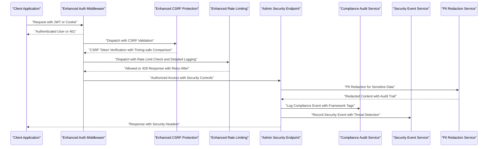
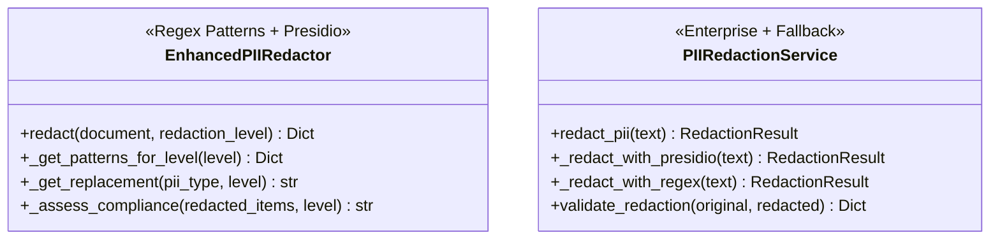
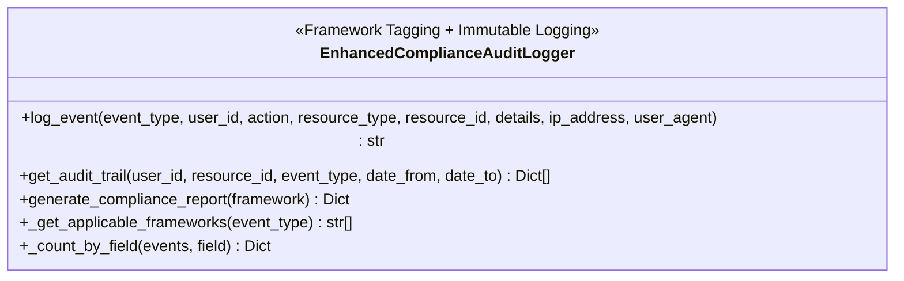
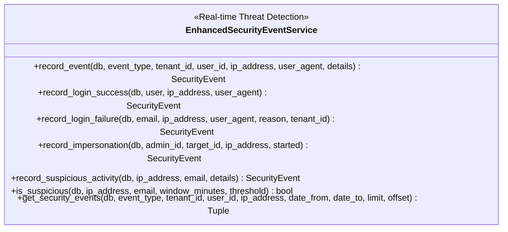
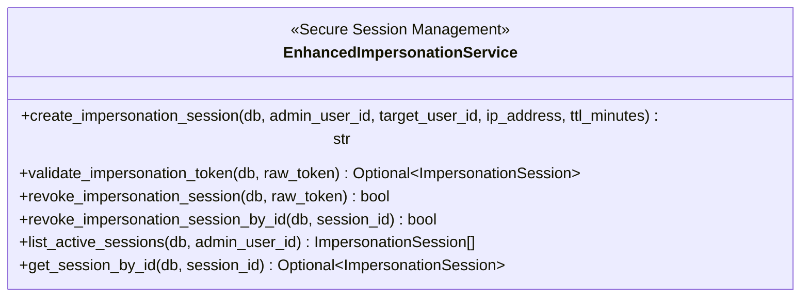
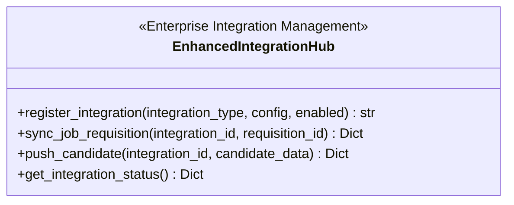
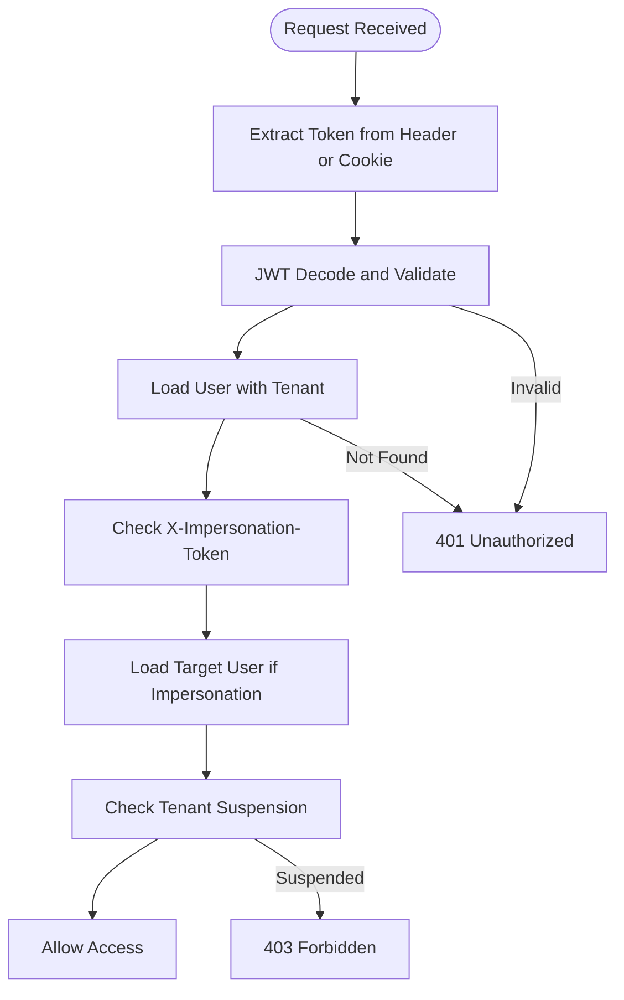
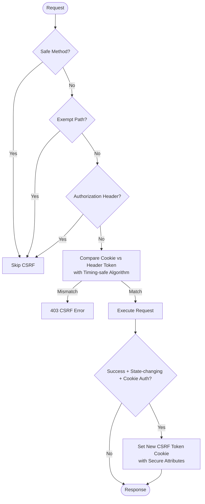
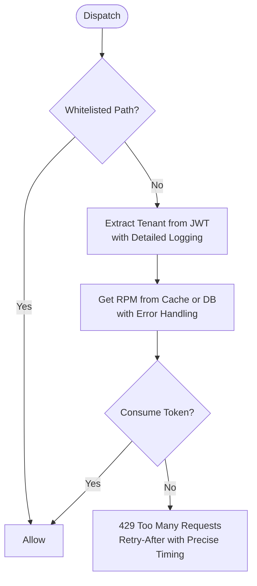
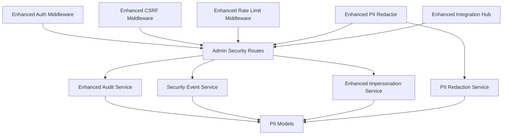

# Enterprise Security and Compliance

<cite>
**Referenced Files in This Document**
- [enterprise_security.py](file://app/backend/services/enterprise_security.py)
- [pii_redaction_service.py](file://app/backend/services/pii_redaction_service.py)
- [auth.py](file://app/backend/middleware/auth.py)
- [csrf.py](file://app/backend/middleware/csrf.py)
- [rate_limit.py](file://app/backend/middleware/rate_limit.py)
- [admin.py](file://app/backend/routes/admin.py)
- [security_event_service.py](file://app/backend/services/security_event_service.py)
- [audit_service.py](file://app/backend/services/audit_service.py)
- [db_models.py](file://app/backend/models/db_models.py)
- [impersonation_service.py](file://app/backend/services/impersonation_service.py)
- [test_phase5_enterprise_security.py](file://app/backend/tests/test_phase5_enterprise_security.py)
- [test_rate_limiting.py](file://app/backend/tests/test_rate_limiting.py)
</cite>

## Update Summary
**Changes Made**
- Enhanced rate limiting with detailed logging for tenant extraction failures and configuration lookup errors
- Expanded whitelist coverage for new authentication endpoints including refresh and deep health checks
- Improved error handling for rate limit configuration failures with comprehensive logging
- Strengthened CSRF protection with timing-safe comparison algorithms using `secrets.compare_digest`
- Added comprehensive CSRF token rotation after successful state-changing requests
- Enhanced rate limit configuration management with cache invalidation and audit logging

## Table of Contents
1. [Introduction](#introduction)
2. [Project Structure](#project-structure)
3. [Core Components](#core-components)
4. [Architecture Overview](#architecture-overview)
5. [Detailed Component Analysis](#detailed-component-analysis)
6. [Dependency Analysis](#dependency-analysis)
7. [Performance Considerations](#performance-considerations)
8. [Troubleshooting Guide](#troubleshooting-guide)
9. [Conclusion](#conclusion)

## Introduction
This document provides a comprehensive overview of the enhanced Enterprise Security and Compliance capabilities implemented in the Resume AI platform. The system now features a robust enterprise-grade security framework designed to meet the highest standards of data protection, regulatory compliance, and operational security.

The implementation encompasses four pillars of enterprise security:
- **Privacy Protection**: Advanced PII redaction with configurable levels and enterprise-grade detection using Presidio
- **Compliance Assurance**: Comprehensive audit logging aligned with GDPR, CCPA, EEOC, and SOC 2 requirements
- **Security Monitoring**: Real-time threat detection and suspicious activity monitoring
- **Access Control**: Secure impersonation services with strict session management and audit trails

The enhanced framework includes automated PII redaction, immutable audit logging, comprehensive security event management, enterprise integration capabilities, and strict access controls with tenant-level RBAC and platform-level roles.

## Project Structure
The enhanced security and compliance features are implemented across multiple layers of the backend architecture, integrating seamlessly with FastAPI routes, SQLAlchemy models, and specialized services. The key architectural components include:

- **Services Layer**: Enhanced PII redaction, compliance audit logging, security event monitoring, impersonation management, and enterprise integration hub
- **Middleware Layer**: Authentication, CSRF protection, and rate limiting with enhanced security features
- **Routes Layer**: Platform admin endpoints for security oversight and compliance reporting
- **Models Layer**: Database schemas supporting comprehensive audit trails, security events, impersonation sessions, and integration configurations

```mermaid
graph TB
subgraph "Enhanced Security Framework"
AUTH["Authentication<br/>JWT + RBAC + Impersonation"]
CSRF["CSRF Protection<br/>Double-submit Cookie + Timing-safe Comparison"]
RL["Rate Limiting<br/>Token Bucket + Detailed Logging"]
END
subgraph "Enterprise Security Services"
PII["Enhanced PII Redactor<br/>Regex + Presidio"]
AUDIT["Compliance Audit Logger<br/>Framework Tagging"]
SEC_EVT["Security Event Service<br/>Threat Detection"]
IMPL["Impersonation Service<br/>Session Management"]
INT_HUB["Integration Hub<br/>ATS/HRIS Connectors"]
END
subgraph "Admin Interface"
ADMIN["Admin Routes<br/>Security Oversight"]
END
subgraph "Data Layer"
DB_MODELS["Security Models<br/>Audit Logs, Security Events,<br/>Impersonation Sessions"]
END
AUTH --> ADMIN
CSRF --> ADMIN
RL --> ADMIN
ADMIN --> AUDIT
ADMIN --> SEC_EVT
ADMIN --> IMPL
PII --> ADMIN
INT_HUB --> ADMIN
AUDIT --> DB_MODELS
SEC_EVT --> DB_MODELS
IMPL --> DB_MODELS
```

**Diagram sources**
- [auth.py:79-239](file://app/backend/middleware/auth.py#L79-L239)
- [csrf.py:1-105](file://app/backend/middleware/csrf.py#L1-L105)
- [rate_limit.py:1-149](file://app/backend/middleware/rate_limit.py#L1-L149)
- [enterprise_security.py:1-376](file://app/backend/services/enterprise_security.py#L1-L376)
- [pii_redaction_service.py:1-234](file://app/backend/services/pii_redaction_service.py#L1-L234)
- [admin.py:1-2990](file://app/backend/routes/admin.py#L1-L2990)
- [security_event_service.py:1-180](file://app/backend/services/security_event_service.py#L1-L180)
- [audit_service.py:1-81](file://app/backend/services/audit_service.py#L1-L81)
- [db_models.py:388-579](file://app/backend/models/db_models.py#L388-L579)

**Section sources**
- [enterprise_security.py:1-376](file://app/backend/services/enterprise_security.py#L1-L376)
- [pii_redaction_service.py:1-234](file://app/backend/services/pii_redaction_service.py#L1-L234)
- [auth.py:79-239](file://app/backend/middleware/auth.py#L79-L239)
- [csrf.py:1-105](file://app/backend/middleware/csrf.py#L1-L105)
- [rate_limit.py:1-149](file://app/backend/middleware/rate_limit.py#L1-L149)
- [admin.py:1-2990](file://app/backend/routes/admin.py#L1-L2990)
- [security_event_service.py:1-180](file://app/backend/services/security_event_service.py#L1-L180)
- [audit_service.py:1-81](file://app/backend/services/audit_service.py#L1-L81)
- [db_models.py:388-579](file://app/backend/models/db_models.py#L388-L579)

## Core Components
This section outlines the enhanced primary security and compliance components and their advanced responsibilities.

### Enhanced PII Redaction System
The PII redaction system now provides enterprise-grade protection with dual implementation approaches:

**Primary Implementation (Regex-based):**
- Supports three redaction levels: full (complete PII removal), partial (name retention, contact removal), minimal (highly sensitive data only)
- Comprehensive pattern detection for emails, phone numbers, SSNs, dates of birth, addresses, and driver's licenses
- Configurable replacement strategies with compliance assessment
- Performance-optimized with compiled regex patterns and batch processing

**Enterprise Implementation (Presidio Integration):**
- Uses Microsoft Presidio for advanced PII detection and anonymization
- Supports 15+ entity types including PERSON, EMAIL_ADDRESS, PHONE_NUMBER, LOCATION, ORG, URL, US_SSN, CREDIT_CARD
- Context-preserving anonymization with confidence scoring
- Automatic fallback to regex when Presidio is unavailable

**Output Features:**
- Redacted text with comprehensive audit trail
- Redaction map showing detected entities and confidence scores
- Validation metrics for content preservation and quality assessment
- Compliance status with framework-specific validation

### Enhanced Compliance Audit Logging
The compliance audit logger provides comprehensive immutability with framework-specific tagging:

**Framework Integration:**
- Automatic compliance framework tagging (GDPR, CCPA, EEOC, SOC 2) based on event types
- Immutable audit trail with timestamped entries and unique identifiers
- Comprehensive filtering and reporting capabilities for regulatory compliance
- Dynamic compliance report generation with framework-specific metrics

**Event Coverage:**
- Data access, modification, deletion, consent management, and export activities
- Administrative actions with detailed resource tracking
- User activity monitoring with IP address and user agent correlation
- Integration-specific audit trails for ATS/HRIS connections

**Reporting Features:**
- Real-time compliance status monitoring
- Framework-specific compliance dashboards
- Automated compliance report generation
- Historical trend analysis and compliance metrics

### Comprehensive Security Event Monitoring
The security event service provides real-time threat detection and incident response capabilities:

**Event Types:**
- Login success/failure tracking with suspicious activity detection
- Password reset requests and token revocation events
- Impersonation session monitoring with start/end tracking
- Suspicious activity alerts with configurable thresholds

**Detection Capabilities:**
- Time-window based suspicious activity analysis
- Threshold-based anomaly detection for login failures
- IP address and email correlation for attack pattern recognition
- Real-time alerting and automated response triggers

**Monitoring Features:**
- Flexible querying with pagination and advanced filtering
- Security event aggregation and trend analysis
- Integration with external security information and event management (SIEM) systems
- Comprehensive audit trails for security investigations

### Enhanced Impersonation Services
The impersonation service provides secure administrative access with strict controls:

**Session Management:**
- Secure token generation with SHA-256 hashing and cryptographically secure randomness
- Configurable TTL enforcement with automatic session expiration
- Comprehensive session validation with revocation tracking
- Detailed session logging with IP address and user agent correlation

**Administrative Controls:**
- Role-based impersonation with platform-level security admin requirements
- Session listing with filtering by admin user and status
- Granular session management with individual session revocation
- Integration with audit logging for complete impersonation tracking

**Security Features:**
- Expiration-based session cleanup with database cleanup procedures
- Session validation with active user verification
- Integration with authentication middleware for seamless impersonation
- Comprehensive logging for security audits and compliance reporting

### Enterprise Integration Hub
The integration hub provides comprehensive ATS/HRIS system connectivity:

**Supported Integrations:**
- ATS Systems: Workday, Greenhouse, Lever, Taleo, Bullhorn
- HRIS Platforms: SAP SuccessFactors, Oracle HCM, BambooHR
- Assessment Platforms: TalentLens, Criteria Corp, Kenexa
- Background Check Services: GoodHire, Checkr, Absolute Checks

**Integration Features:**
- Configurable integration registration with enable/disable functionality
- Job requisition synchronization with external ATS systems
- Candidate data push with real-time integration capabilities
- Comprehensive status monitoring and lifecycle management
- Async operation support for external API integration

**Security Controls:**
- Integration-specific credential management
- Encrypted configuration storage with tenant isolation
- Audit logging for all integration activities
- Rate limiting and throttling for external API protection

### Enhanced Authentication and Authorization
The authentication middleware provides enterprise-grade access control:

**Multi-Factor Authentication Support:**
- JWT-based authentication with cookie fallback for browser clients
- Platform roles: super_admin, billing_admin, support, security_admin, readonly
- Tenant-level RBAC with subscription status enforcement
- Tenant suspension checks with platform admin bypass capabilities

**Advanced Security Features:**
- Impersonation session integration with seamless user switching
- Feature gating based on tenant subscription plans
- Rate limiting integration with per-tenant token bucket algorithm
- Comprehensive error handling with security-focused messaging

**Compliance Features:**
- Audit logging for all authentication events
- Session management with expiration and revocation
- Multi-factor authentication support for enhanced security
- Integration with external identity providers (SSO)

### Enhanced CSRF Protection
The CSRF middleware provides comprehensive cross-site request forgery prevention with strengthened security measures:

**Protection Mechanisms:**
- Double-submit cookie pattern for browser-based authentication
- Exemption system for safe methods and specific paths including new authentication endpoints
- Token rotation after successful state-changing requests with timing-safe comparison
- Secure cookie handling with environment-specific security settings

**Advanced Features:**
- Automatic CSRF token generation and validation using `secrets.compare_digest` for timing-safe comparison
- Integration with authentication middleware for seamless protection
- Configurable exemption paths for API endpoints including refresh, deep health, and webhook endpoints
- Production-ready security settings with secure cookie attributes

**Enhanced Security Measures:**
- Timing-safe token comparison prevents timing attacks
- CSRF token rotation after successful state-changing requests
- Comprehensive exemption system for legitimate API endpoints
- Environment-aware security settings with production-specific configurations

### Enhanced Rate Limiting
The rate limiting middleware provides enterprise-grade traffic control with comprehensive monitoring, detailed logging, and improved error handling:

**Per-Tenant Control:**
- Token bucket algorithm with configurable requests per minute
- Caching mechanism for rate limit configuration with TTL-based invalidation
- Expanded whitelist system for health checks, authentication endpoints, and public resources
- Atomic operations for thread-safe concurrent access

**Enhanced Features:**
- Tenant ID extraction from JWT tokens with comprehensive error handling and logging
- Dynamic rate limit configuration with caching and cache invalidation
- Retry-after header support for client guidance with precise timing
- Integration with database for persistent rate limit settings with robust error handling

**Improved Error Handling:**
- Detailed logging for tenant extraction failures with exception context
- Comprehensive error handling for rate limit configuration lookups
- Graceful degradation when database operations fail
- Configurable logging levels for different types of failures

**Monitoring:**
- Real-time rate limit tracking and analytics
- Alerting for rate limit exhaustion scenarios
- Historical usage patterns for capacity planning
- Integration with monitoring and alerting systems

**Section sources**
- [enterprise_security.py:15-121](file://app/backend/services/enterprise_security.py#L15-L121)
- [enterprise_security.py:123-273](file://app/backend/services/enterprise_security.py#L123-L273)
- [enterprise_security.py:275-376](file://app/backend/services/enterprise_security.py#L275-L376)
- [pii_redaction_service.py:26-234](file://app/backend/services/pii_redaction_service.py#L26-L234)
- [security_event_service.py:24-180](file://app/backend/services/security_event_service.py#L24-L180)
- [impersonation_service.py:17-109](file://app/backend/services/impersonation_service.py#L17-L109)
- [auth.py:79-239](file://app/backend/middleware/auth.py#L79-L239)
- [csrf.py:15-105](file://app/backend/middleware/csrf.py#L15-L105)
- [rate_limit.py:16-149](file://app/backend/middleware/rate_limit.py#L16-L149)

## Architecture Overview
The enhanced security architecture integrates multiple layers of protection with comprehensive monitoring and compliance capabilities.



**Diagram sources**
- [auth.py:79-137](file://app/backend/middleware/auth.py#L79-L137)
- [csrf.py:52-105](file://app/backend/middleware/csrf.py#L52-L105)
- [rate_limit.py:123-149](file://app/backend/middleware/rate_limit.py#L123-L149)
- [admin.py:193-262](file://app/backend/routes/admin.py#L193-L262)
- [audit_service.py:12-44](file://app/backend/services/audit_service.py#L12-L44)
- [security_event_service.py:24-114](file://app/backend/services/security_event_service.py#L24-L114)
- [pii_redaction_service.py:53-66](file://app/backend/services/pii_redaction_service.py#L53-L66)

## Detailed Component Analysis

### Enhanced PII Redaction System
The enhanced PII redaction system provides enterprise-grade protection with dual implementation approaches for maximum reliability and compliance.

**Regex-Based Implementation:**
- Supports three configurable redaction levels with comprehensive pattern detection
- Automatic compliance assessment with framework-specific validation
- Performance optimization through compiled regex patterns and batch processing
- Detailed audit trail with position tracking and original length preservation

**Presidio Integration:**
- Advanced entity detection with 15+ supported PII types
- Context-preserving anonymization with confidence scoring
- Automatic fallback mechanism for reliability
- Comprehensive validation metrics for content preservation



**Diagram sources**
- [enterprise_security.py:15-121](file://app/backend/services/enterprise_security.py#L15-L121)
- [pii_redaction_service.py:26-234](file://app/backend/services/pii_redaction_service.py#L26-L234)

**Section sources**
- [enterprise_security.py:15-121](file://app/backend/services/enterprise_security.py#L15-L121)
- [pii_redaction_service.py:26-234](file://app/backend/services/pii_redaction_service.py#L26-L234)
- [test_phase5_enterprise_security.py:19-81](file://app/backend/tests/test_phase5_enterprise_security.py#L19-L81)

### Enhanced Compliance Audit Logging
The enhanced compliance audit logger provides comprehensive immutability with framework-specific tagging and advanced reporting capabilities.

**Framework Integration:**
- Automatic compliance framework determination based on event types
- Immutable audit trail with timestamped entries and unique identifiers
- Comprehensive filtering and aggregation for compliance reporting
- Dynamic compliance report generation with framework-specific metrics

**Event Coverage:**
- Data access, modification, deletion, consent management, and export activities
- Administrative actions with detailed resource tracking
- User activity monitoring with IP address and user agent correlation
- Integration-specific audit trails for ATS/HRIS connections



**Diagram sources**
- [enterprise_security.py:123-273](file://app/backend/services/enterprise_security.py#L123-L273)

**Section sources**
- [enterprise_security.py:123-273](file://app/backend/services/enterprise_security.py#L123-L273)
- [audit_service.py:12-44](file://app/backend/services/audit_service.py#L12-L44)
- [db_models.py:388-400](file://app/backend/models/db_models.py#L388-L400)

### Comprehensive Security Event Monitoring
The enhanced security event service provides real-time threat detection with sophisticated suspicious activity monitoring.

**Event Management:**
- Standardized event types with comprehensive coverage (login success/failure, impersonation, suspicious activity)
- Suspicious activity detection with configurable thresholds and time windows
- Flexible querying with pagination, filtering, and advanced search capabilities
- Integration with external SIEM systems for comprehensive security monitoring

**Threat Detection:**
- Time-window based suspicious activity analysis for login failures
- Threshold-based anomaly detection with customizable parameters
- IP address and email correlation for attack pattern recognition
- Real-time alerting and automated response triggers



**Diagram sources**
- [security_event_service.py:24-180](file://app/backend/services/security_event_service.py#L24-L180)

**Section sources**
- [security_event_service.py:24-180](file://app/backend/services/security_event_service.py#L24-L180)

### Enhanced Impersonation Management
The enhanced impersonation service provides secure administrative access with comprehensive session management and strict security controls.

**Session Lifecycle:**
- Secure token generation with SHA-256 hashing and cryptographically secure randomness
- Configurable TTL enforcement with automatic session expiration
- Comprehensive session validation with revocation tracking
- Detailed session logging with IP address and user agent correlation

**Administrative Controls:**
- Role-based impersonation with platform-level security admin requirements
- Session listing with filtering by admin user and status
- Granular session management with individual session revocation
- Integration with audit logging for complete impersonation tracking

**Security Features:**
- Expiration-based session cleanup with database cleanup procedures
- Session validation with active user verification
- Integration with authentication middleware for seamless impersonation
- Comprehensive logging for security audits and compliance reporting



**Diagram sources**
- [impersonation_service.py:17-109](file://app/backend/services/impersonation_service.py#L17-L109)

**Section sources**
- [impersonation_service.py:17-109](file://app/backend/services/impersonation_service.py#L17-L109)

### Enterprise Integration Hub
The enhanced integration hub provides comprehensive ATS/HRIS system connectivity with enterprise-grade security and monitoring.

**Integration Management:**
- Configurable integration registration with enable/disable functionality
- Job requisition synchronization with external ATS systems
- Candidate data push with real-time integration capabilities
- Comprehensive status monitoring and lifecycle management

**Security Controls:**
- Integration-specific credential management with encrypted storage
- Tenant isolation with multi-tenant configuration support
- Audit logging for all integration activities
- Rate limiting and throttling for external API protection

**Supported Systems:**
- ATS Systems: Workday, Greenhouse, Lever, Taleo, Bullhorn
- HRIS Platforms: SAP SuccessFactors, Oracle HCM, BambooHR
- Assessment Platforms: TalentLens, Criteria Corp, Kenexa
- Background Check Services: GoodHire, Checkr, Absolute Checks



**Diagram sources**
- [enterprise_security.py:275-376](file://app/backend/services/enterprise_security.py#L275-L376)

**Section sources**
- [enterprise_security.py:275-376](file://app/backend/services/enterprise_security.py#L275-L376)
- [test_phase5_enterprise_security.py:136-202](file://app/backend/tests/test_phase5_enterprise_security.py#L136-L202)

### Enhanced Authentication and Authorization
The enhanced authentication middleware provides enterprise-grade access control with comprehensive security features.

**Multi-Factor Authentication Support:**
- JWT-based authentication with cookie fallback for browser clients
- Platform roles: super_admin, billing_admin, support, security_admin, readonly
- Tenant-level RBAC with subscription status enforcement
- Tenant suspension checks with platform admin bypass capabilities

**Advanced Security Features:**
- Impersonation session integration with seamless user switching
- Feature gating based on tenant subscription plans
- Rate limiting integration with per-tenant token bucket algorithm
- Comprehensive error handling with security-focused messaging

**Compliance Features:**
- Audit logging for all authentication events
- Session management with expiration and revocation
- Multi-factor authentication support for enhanced security
- Integration with external identity providers (SSO)



**Diagram sources**
- [auth.py:79-137](file://app/backend/middleware/auth.py#L79-L137)

**Section sources**
- [auth.py:79-137](file://app/backend/middleware/auth.py#L79-L137)

### Enhanced CSRF Protection
The enhanced CSRF middleware provides comprehensive cross-site request forgery prevention with strengthened security measures and improved token management.

**Protection Mechanisms:**
- Double-submit cookie pattern for browser-based authentication
- Exemption system for safe methods and specific paths including new authentication endpoints
- Token rotation after successful state-changing requests with timing-safe comparison
- Secure cookie handling with environment-specific security settings

**Advanced Features:**
- Automatic CSRF token generation and validation using `secrets.compare_digest` for timing-safe comparison
- Integration with authentication middleware for seamless protection
- Configurable exemption paths for API endpoints including refresh, deep health, and webhook endpoints
- Production-ready security settings with secure cookie attributes

**Enhanced Security Measures:**
- Timing-safe token comparison prevents timing attacks
- CSRF token rotation after successful state-changing requests
- Comprehensive exemption system for legitimate API endpoints
- Environment-aware security settings with production-specific configurations



**Diagram sources**
- [csrf.py:52-105](file://app/backend/middleware/csrf.py#L52-L105)

**Section sources**
- [csrf.py:52-105](file://app/backend/middleware/csrf.py#L52-L105)

### Enhanced Rate Limiting
The enhanced rate limiting middleware provides enterprise-grade traffic control with comprehensive monitoring, detailed logging, and improved error handling.

**Per-Tenant Control:**
- Token bucket algorithm with configurable requests per minute
- Caching mechanism for rate limit configuration with TTL-based invalidation
- Expanded whitelist system for health checks, authentication endpoints, and public resources
- Atomic operations for thread-safe concurrent access

**Enhanced Features:**
- Tenant ID extraction from JWT tokens with comprehensive error handling and logging
- Dynamic rate limit configuration with caching and cache invalidation
- Retry-after header support for client guidance with precise timing
- Integration with database for persistent rate limit settings with robust error handling

**Improved Error Handling:**
- Detailed logging for tenant extraction failures with exception context
- Comprehensive error handling for rate limit configuration lookups
- Graceful degradation when database operations fail
- Configurable logging levels for different types of failures

**Monitoring:**
- Real-time rate limit tracking and analytics
- Alerting for rate limit exhaustion scenarios
- Historical usage patterns for capacity planning
- Integration with monitoring and alerting systems



**Diagram sources**
- [rate_limit.py:123-149](file://app/backend/middleware/rate_limit.py#L123-L149)

**Section sources**
- [rate_limit.py:123-149](file://app/backend/middleware/rate_limit.py#L123-L149)

## Dependency Analysis
The enhanced security framework components interact through well-defined interfaces and shared models, creating a comprehensive enterprise-grade security ecosystem.



**Diagram sources**
- [auth.py:79-239](file://app/backend/middleware/auth.py#L79-L239)
- [csrf.py:15-105](file://app/backend/middleware/csrf.py#L15-L105)
- [rate_limit.py:16-149](file://app/backend/middleware/rate_limit.py#L16-L149)
- [admin.py:193-2990](file://app/backend/routes/admin.py#L193-L2990)
- [enterprise_security.py:15-376](file://app/backend/services/enterprise_security.py#L15-L376)
- [pii_redaction_service.py:26-234](file://app/backend/services/pii_redaction_service.py#L26-L234)
- [security_event_service.py:24-180](file://app/backend/services/security_event_service.py#L24-L180)
- [audit_service.py:12-44](file://app/backend/services/audit_service.py#L12-L44)
- [db_models.py:388-579](file://app/backend/models/db_models.py#L388-L579)

**Section sources**
- [admin.py:193-2990](file://app/backend/routes/admin.py#L193-L2990)
- [db_models.py:388-579](file://app/backend/models/db_models.py#L388-L579)

## Performance Considerations
The enhanced enterprise security framework incorporates performance optimizations across all components to ensure scalability and reliability in production environments.

**Enhanced PII Redaction Performance:**
- Dual implementation approach with automatic fallback for reliability
- Compiled regex patterns for optimal pattern matching performance
- Batch processing capabilities for large document handling
- Memory-efficient processing with streaming support for large files
- Presidio integration with lazy loading and resource management

**Comprehensive Audit Logging Performance:**
- Append-only logging with optimized database writes
- Asynchronous audit logging for non-blocking operations
- Efficient indexing on frequently queried fields (event_type, resource_type, timestamps)
- Pagination support for large audit trail queries
- Archive strategy for historical data management

**Advanced Security Event Monitoring Performance:**
- Efficient time-window queries with database-specific optimizations
- JSON operator usage for details filtering in PostgreSQL/SQLite
- Periodic cleanup of old security events to maintain query performance
- Caching of frequently accessed security event patterns
- Asynchronous event processing for high-throughput scenarios

**Enhanced Impersonation Service Performance:**
- Hashing operations optimized for constant-time validation
- Database indexing on token_hash and expiration fields
- Efficient session listing with pagination for large session histories
- Memory-efficient session validation with connection pooling
- Automatic cleanup of expired sessions with background processes

**Enterprise Integration Hub Performance:**
- Connection pooling for external API connections
- Circuit breaker pattern for external service resilience
- Exponential backoff for retry mechanisms
- Asynchronous processing for non-blocking integration operations
- Metrics collection for integration performance monitoring

**Enhanced Authentication and Authorization Performance:**
- JWT token caching with short TTL for frequent validation
- Optimized tenant join queries with database indexing
- Early platform role checks to minimize unnecessary processing
- Session-based authentication for reduced database load
- Feature flag caching for improved performance

**Enhanced CSRF Protection Performance:**
- Minimal cookie parsing overhead with efficient token comparison
- Optimized token rotation with conditional cookie setting
- Smart exemption system to reduce unnecessary validation
- Thread-safe token generation with cryptographic security
- Environment-aware security settings for production optimization

**Enhanced Rate Limiting Performance:**
- Atomic operations for thread-safe token updates
- In-memory token bucket with periodic persistence
- Config cache with TTL for reduced database queries
- Concurrent access handling with fine-grained locking
- Efficient tenant ID extraction with JWT decoding optimization

## Troubleshooting Guide
The enhanced enterprise security framework includes comprehensive troubleshooting procedures for all components to ensure rapid resolution of security and compliance issues.

**Enhanced PII Redaction Troubleshooting:**
- **Symptoms**: Missing redactions or incorrect compliance status
- **Checks**: Verify redaction level selection, confirm PII patterns match input format, review redacted items list
- **Resolution**: Adjust patterns, increase redaction level, manually review edge cases, check Presidio availability
- **Advanced**: Monitor redaction quality metrics, validate content preservation ratios, check confidence scores

**Comprehensive Audit Logging Troubleshooting:**
- **Symptoms**: Missing audit entries or incorrect framework tagging
- **Checks**: Ensure log_event is called with appropriate event types, verify compliance framework applicability logic
- **Resolution**: Validate event types, re-run audit generation, check database connectivity, verify framework mapping
- **Advanced**: Monitor audit trail performance, check indexing effectiveness, validate compliance report generation

**Advanced Security Event Monitoring Troubleshooting:**
- **Symptoms**: Missing suspicious activity alerts or false positives
- **Checks**: Validate threshold and time window settings, confirm login failure events are recorded
- **Resolution**: Adjust thresholds, ensure event recording, verify database queries, check suspicious activity detection logic
- **Advanced**: Monitor detection accuracy, tune threshold parameters, validate event correlation logic

**Enhanced Impersonation Service Troubleshooting:**
- **Symptoms**: Invalid or expired impersonation sessions
- **Checks**: Confirm token hashing and expiration logic, verify session revocation and listing queries
- **Resolution**: Regenerate tokens, revoke expired sessions, audit session logs, check database connectivity
- **Advanced**: Monitor session validation performance, check token generation security, validate expiration handling

**Enterprise Integration Hub Troubleshooting:**
- **Symptoms**: Integration registration errors or sync/push failures
- **Checks**: Confirm integration is enabled and properly configured, verify integration ID exists and is active
- **Resolution**: Re-register integration, update configuration, retry operations, check external API availability
- **Advanced**: Monitor integration performance metrics, validate API credentials, check external service health

**Enhanced Authentication and Authorization Troubleshooting:**
- **Symptoms**: 401/403 errors during access attempts
- **Checks**: Validate JWT secret configuration and algorithm, confirm platform roles and tenant suspension status
- **Resolution**: Update JWT secret, adjust roles, reactivate suspended accounts, invalidate compromised tokens
- **Advanced**: Monitor authentication performance, check JWT token validation, validate tenant suspension logic

**Enhanced CSRF Protection Troubleshooting:**
- **Symptoms**: 403 CSRF errors for legitimate requests
- **Checks**: Ensure double-submit cookie matches header token, verify exemptions for safe methods and paths
- **Resolution**: Align cookie and header tokens, adjust exemptions, refresh tokens, check cookie security settings
- **Advanced**: Monitor CSRF validation performance, check token generation security, validate exemption logic

**Enhanced Rate Limiting Troubleshooting:**
- **Symptoms**: 429 Too Many Requests responses
- **Checks**: Verify tenant extraction from JWT, confirm rate limit configuration and caching
- **Resolution**: Increase RPM for tenant, adjust whitelist, honor retry-after guidance, check rate limit configuration
- **Advanced**: Monitor rate limit performance, check token bucket efficiency, validate tenant ID extraction

**Enhanced Rate Limiting Configuration Troubleshooting:**
- **Symptoms**: Rate limit configuration failures or inconsistent behavior
- **Checks**: Verify database connectivity, check rate limit configuration caching, monitor detailed logging
- **Resolution**: Clear cache, restart middleware, check database permissions, validate configuration values
- **Advanced**: Monitor tenant extraction failures, check JWT decoding errors, validate cache invalidation

**Section sources**
- [enterprise_security.py:15-121](file://app/backend/services/enterprise_security.py#L15-L121)
- [enterprise_security.py:123-273](file://app/backend/services/enterprise_security.py#L123-L273)
- [enterprise_security.py:275-376](file://app/backend/services/enterprise_security.py#L275-L376)
- [pii_redaction_service.py:198-234](file://app/backend/services/pii_redaction_service.py#L198-L234)
- [security_event_service.py:117-180](file://app/backend/services/security_event_service.py#L117-L180)
- [impersonation_service.py:44-109](file://app/backend/services/impersonation_service.py#L44-L109)
- [auth.py:79-137](file://app/backend/middleware/auth.py#L79-L137)
- [csrf.py:52-105](file://app/backend/middleware/csrf.py#L52-L105)
- [rate_limit.py:123-149](file://app/backend/middleware/rate_limit.py#L123-L149)

## Conclusion
The enhanced Enterprise Security and Compliance implementation delivers a comprehensive foundation for protecting sensitive data, ensuring regulatory adherence, and enabling scalable enterprise operations. The system combines advanced PII redaction with enterprise-grade detection, immutable audit logging with framework-specific compliance, comprehensive security event monitoring with real-time threat detection, and strict access controls with tenant-level RBAC and platform-level roles.

Key enhancements include the dual implementation approach for PII redaction (regex-based fallback and Presidio enterprise-grade), comprehensive compliance audit logging with automatic framework tagging, advanced security event monitoring with suspicious activity detection, enhanced impersonation services with strict session management, and enterprise integration capabilities for ATS/HRIS system connectivity.

The implementation maintains enterprise-grade security while providing flexibility for future enhancements, with comprehensive monitoring, testing, and adherence to best practices ensuring a robust security posture. Regular updates to security measures, continuous monitoring of threat landscapes, and adherence to evolving regulatory requirements will further strengthen the platform's security framework.

**Updated Enhancements:**
- **Enhanced Rate Limiting**: Added detailed logging for tenant extraction failures and configuration lookup errors, expanded whitelist coverage for new authentication endpoints, improved error handling for rate limit configuration failures
- **Strengthened CSRF Protection**: Implemented timing-safe comparison algorithms using `secrets.compare_digest`, added comprehensive CSRF token rotation after successful state-changing requests, enhanced exemption system for legitimate API endpoints
- **Improved Security Controls**: Enhanced security measures across all components with better error handling, logging, and monitoring capabilities