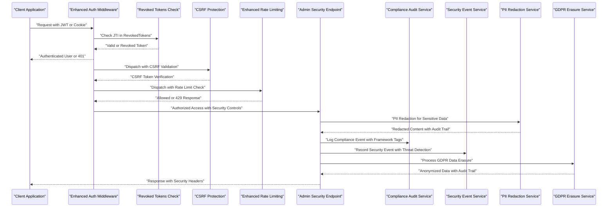
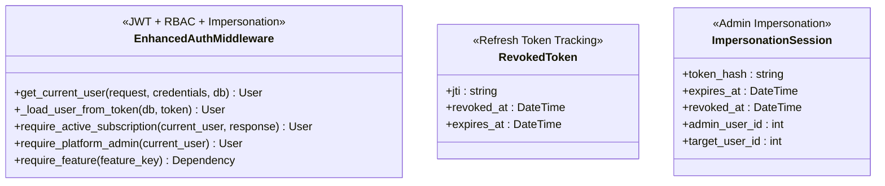
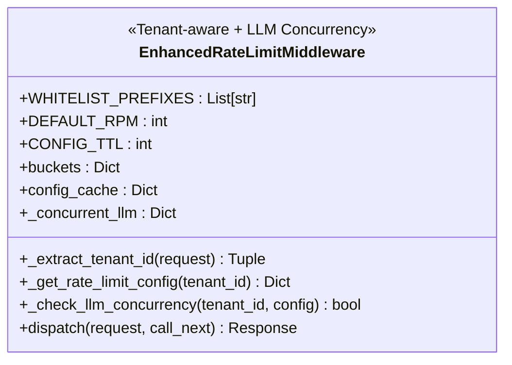
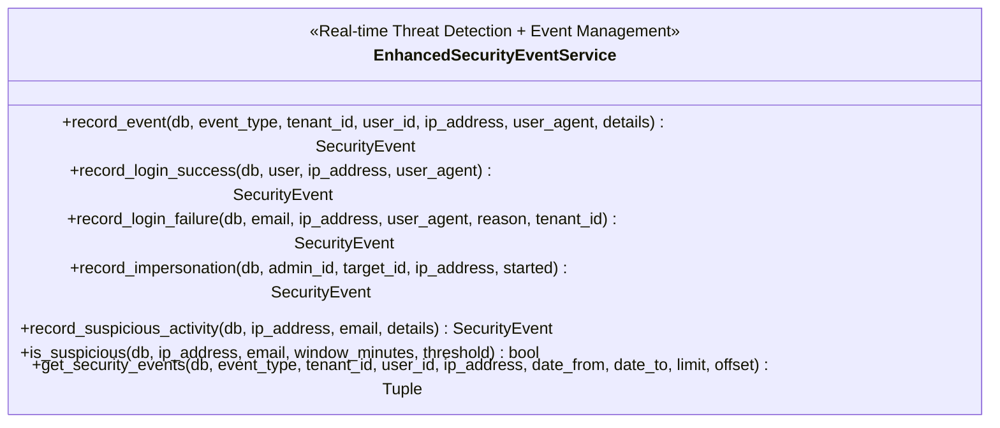
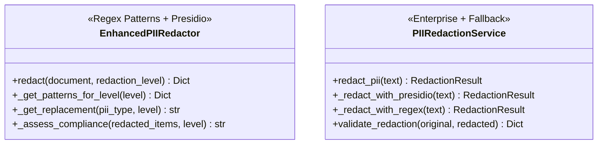
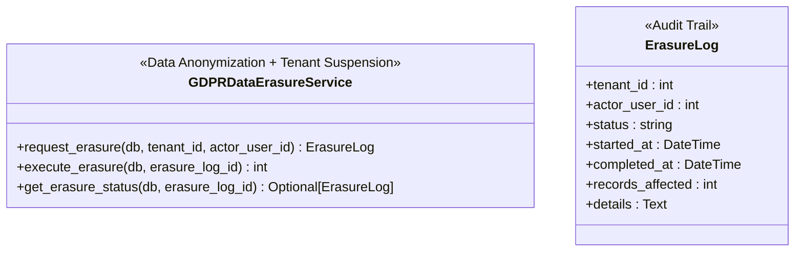
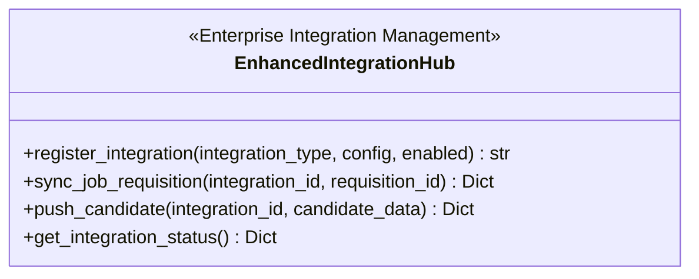
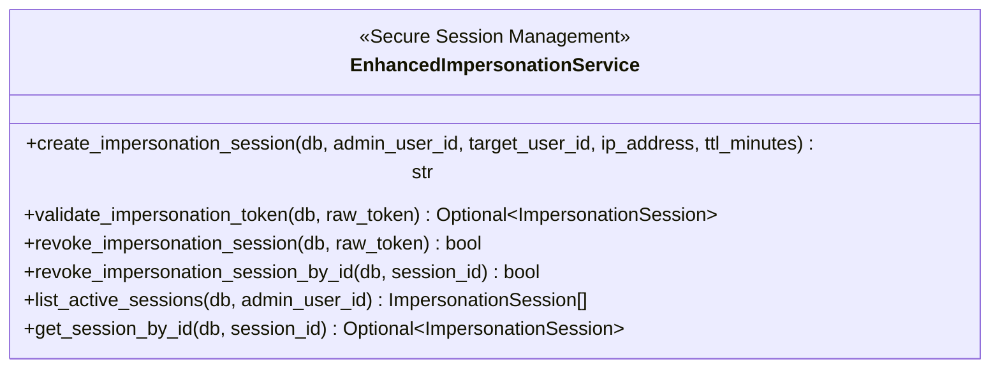
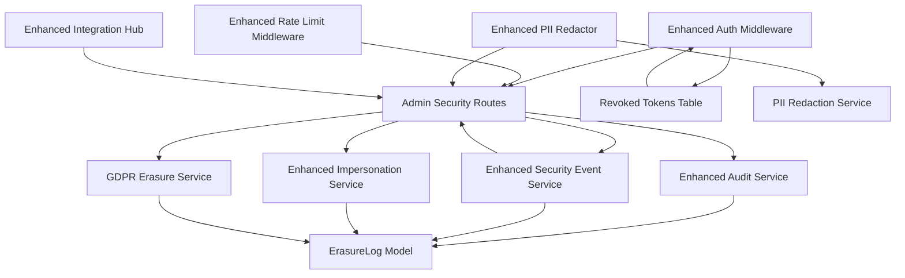

# Enterprise Security and Compliance

<cite>
**Referenced Files in This Document**
- [auth.py](file://app/backend/middleware/auth.py)
- [rate_limit.py](file://app/backend/middleware/rate_limit.py)
- [enterprise_security.py](file://app/backend/services/enterprise_security.py)
- [security_event_service.py](file://app/backend/services/security_event_service.py)
- [erasure_service.py](file://app/backend/services/erasure_service.py)
- [impersonation_service.py](file://app/backend/services/impersonation_service.py)
- [db_models.py](file://app/backend/models/db_models.py)
- [005_revoked_tokens.py](file://alembic/versions/005_revoked_tokens.py)
- [admin.py](file://app/backend/routes/admin.py)
- [test_phase5_enterprise_security.py](file://app/backend/tests/test_phase5_enterprise_security.py)
- [test_rate_limiting.py](file://app/backend/tests/test_rate_limiting.py)
- [test_auth.py](file://app/backend/tests/test_auth.py)
</cite>

## Update Summary
**Changes Made**
- Enhanced authentication middleware with JWT secret validation, token revocation capabilities, and impersonation session management
- Strengthened rate limiting middleware with tenant-aware rate limiting, configurable concurrent LLM processing limits, and intelligent caching mechanisms
- Added comprehensive security event monitoring, admin impersonation session validation, and GDPR compliance features including data erasure functionality
- Implemented revoked tokens table for refresh token management and logout revocation support
- Added configurable rate limit settings with per-tenant concurrency controls for LLM endpoints

## Table of Contents
1. [Introduction](#introduction)
2. [Project Structure](#project-structure)
3. [Core Components](#core-components)
4. [Architecture Overview](#architecture-overview)
5. [Detailed Component Analysis](#detailed-component-analysis)
6. [Dependency Analysis](#dependency-analysis)
7. [Performance Considerations](#performance-considerations)
8. [Troubleshooting Guide](#troubleshooting-guide)
9. [Conclusion](#conclusion)

## Introduction
This document provides a comprehensive overview of the enhanced Enterprise Security and Compliance capabilities implemented in the Resume AI platform. The system now features a robust enterprise-grade security framework designed to meet the highest standards of data protection, regulatory compliance, and operational security.

The implementation encompasses five pillars of enterprise security:
- **Privacy Protection**: Advanced PII redaction with configurable levels and enterprise-grade detection using Presidio
- **Compliance Assurance**: Comprehensive audit logging aligned with GDPR, CCPA, EEOC, and SOC 2 requirements
- **Security Monitoring**: Real-time threat detection and suspicious activity monitoring
- **Access Control**: Secure impersonation services with strict session management and audit trails
- **Token Management**: Comprehensive JWT token lifecycle management including revocation and refresh token handling

The enhanced framework includes automated PII redaction, immutable audit logging, comprehensive security event management, enterprise integration capabilities, strict access controls with tenant-level RBAC and platform-level roles, and GDPR-compliant data erasure functionality.

## Project Structure
The enhanced security and compliance features are implemented across multiple layers of the backend architecture, integrating seamlessly with FastAPI routes, SQLAlchemy models, and specialized services. The key architectural components include:

- **Services Layer**: Enhanced PII redaction, compliance audit logging, security event monitoring, impersonation management, enterprise integration hub, and GDPR data erasure
- **Middleware Layer**: Authentication, CSRF protection, and rate limiting with enhanced security features including JWT enforcement and token revocation
- **Routes Layer**: Platform admin endpoints for security oversight, impersonation management, and GDPR compliance
- **Models Layer**: Database schemas supporting comprehensive audit trails, security events, impersonation sessions, revoked tokens, and integration configurations

```mermaid
graph TB
subgraph "Enhanced Security Framework"
AUTH["Enhanced Authentication<br/>JWT + RBAC + Impersonation + Token Revocation"]
RATE_LIMIT["Enhanced Rate Limiting<br/>Tenant-aware + LLM Concurrency + Intelligent Caching"]
SEC_EVT["Security Event Service<br/>Real-time Threat Detection"]
END
subgraph "Enterprise Security Services"
PII["Enhanced PII Redactor<br/>Regex + Presidio + Compliance Assessment"]
AUDIT["Compliance Audit Logger<br/>Framework Tagging + Immutable Logging"]
IMPL["Impersonation Service<br/>Session Management + Admin Validation"]
ERASURE["GDPR Erasure Service<br/>Data Anonymization + Tenant Suspension"]
INT_HUB["Integration Hub<br/>ATS/HRIS Connectors + Async Processing"]
END
subgraph "Admin Interface"
ADMIN["Admin Routes<br/>Security Oversight + GDPR Compliance"]
END
subgraph "Data Layer"
DB_MODELS["Security Models<br/>Audit Logs, Security Events,<br/>Impersonation Sessions, Revoked Tokens"]
REVOKED_TOKENS["Revoked Tokens Table<br/>Refresh Token Management"]
END
AUTH --> ADMIN
RATE_LIMIT --> ADMIN
SEC_EVT --> ADMIN
ADMIN --> AUDIT
ADMIN --> SEC_EVT
ADMIN --> IMPL
ADMIN --> ERASURE
PII --> ADMIN
INT_HUB --> ADMIN
AUDIT --> DB_MODELS
SEC_EVT --> DB_MODELS
IMPL --> DB_MODELS
ERASURE --> DB_MODELS
REVOKED_TOKENS --> AUTH
```

**Diagram sources**
- [auth.py:57-145](file://app/backend/middleware/auth.py#L57-L145)
- [rate_limit.py:26-244](file://app/backend/middleware/rate_limit.py#L26-L244)
- [security_event_service.py:24-180](file://app/backend/services/security_event_service.py#L24-L180)
- [enterprise_security.py:15-376](file://app/backend/services/enterprise_security.py#L15-L376)
- [erasure_service.py:24-162](file://app/backend/services/erasure_service.py#L24-L162)
- [db_models.py:396-589](file://app/backend/models/db_models.py#L396-L589)
- [005_revoked_tokens.py:41-66](file://alembic/versions/005_revoked_tokens.py#L41-L66)

**Section sources**
- [auth.py:57-145](file://app/backend/middleware/auth.py#L57-L145)
- [rate_limit.py:26-244](file://app/backend/middleware/rate_limit.py#L26-L244)
- [enterprise_security.py:15-376](file://app/backend/services/enterprise_security.py#L15-L376)
- [security_event_service.py:24-180](file://app/backend/services/security_event_service.py#L24-L180)
- [erasure_service.py:24-162](file://app/backend/services/erasure_service.py#L24-L162)
- [db_models.py:396-589](file://app/backend/models/db_models.py#L396-L589)
- [005_revoked_tokens.py:41-66](file://alembic/versions/005_revoked_tokens.py#L41-L66)

## Core Components
This section outlines the enhanced primary security and compliance components and their advanced responsibilities.

### Enhanced Authentication and Authorization
The authentication middleware provides enterprise-grade access control with comprehensive security features including JWT enforcement, token revocation, and impersonation session management.

**JWT Enforcement and Token Management:**
- HS256 algorithm with mandatory environment variable configuration for production
- Comprehensive token validation with user loading and tenant association
- User-level token revocation checking for deactivated users
- Refresh token revocation support through JTI-based tracking in revoked_tokens table

**Impersonation Session Integration:**
- Secure token-based impersonation with SHA-256 hashing and cryptographically secure randomness
- Configurable TTL enforcement with automatic session expiration
- Comprehensive session validation with revocation tracking and IP/user agent correlation
- Seamless user switching with request context propagation

**Advanced Security Features:**
- Platform-level RBAC with backward compatibility for legacy is_platform_admin flag
- Tenant suspension checks with platform admin bypass capabilities
- Feature gating based on tenant subscription plans
- Comprehensive error handling with security-focused messaging

**Compliance Features:**
- Audit logging for all authentication events
- Session management with expiration and revocation
- Multi-factor authentication support for enhanced security
- Integration with external identity providers (SSO)

### Enhanced Rate Limiting
The rate limiting middleware provides enterprise-grade traffic control with comprehensive monitoring, intelligent caching, and tenant-aware configuration management.

**Per-Tenant Control with Intelligent Caching:**
- Token bucket algorithm with configurable requests per minute per tenant
- Multi-level caching system: JWT payload cache, rate limit config cache, and in-memory token buckets
- Tenant ID extraction from JWT payload with fallback to database lookup and cache
- Configurable cache TTL (5 minutes for tenant cache, 60 seconds for rate limit config)

**Configurable Concurrent LLM Processing Limits:**
- Dedicated LLM endpoint detection with comprehensive path matching
- Configurable concurrent processing limits per tenant (default: 2)
- Fine-grained concurrency control with atomic operations
- Automatic cleanup of expired LLM sessions

**Enhanced Features:**
- Expanded whitelist system for health checks, authentication endpoints, and public resources
- Retry-after header support for client guidance with precise timing
- Integration with database for persistent rate limit settings with robust error handling
- Real-time rate limit tracking with comprehensive headers (X-RateLimit-Limit, X-RateLimit-Remaining, X-RateLimit-Reset)

**Monitoring and Analytics:**
- Real-time rate limit tracking and analytics
- Alerting for rate limit exhaustion scenarios
- Historical usage patterns for capacity planning
- Integration with monitoring and alerting systems

### Comprehensive Security Event Monitoring
The security event service provides real-time threat detection with sophisticated suspicious activity monitoring and comprehensive event management.

**Event Management:**
- Standardized event types with comprehensive coverage (login success/failure, impersonation, suspicious activity, token revocation)
- Suspicious activity detection with configurable thresholds and time windows
- Flexible querying with pagination, filtering, and advanced search capabilities
- Integration with external SIEM systems for comprehensive security monitoring

**Threat Detection:**
- Time-window based suspicious activity analysis for login failures
- Threshold-based anomaly detection with customizable parameters
- IP address and email correlation for attack pattern recognition
- Real-time alerting and automated response triggers

**Enhanced Security Features:**
- Token revocation event logging for audit trails
- Impersonation session lifecycle tracking
- Comprehensive event aggregation and trend analysis
- Integration with audit logging for security investigations

### Enhanced PII Redaction System
The PII redaction system now provides enterprise-grade protection with dual implementation approaches and comprehensive compliance assessment.

**Primary Implementation (Regex-based):**
- Supports three redaction levels: full (complete PII removal), partial (name retention, contact removal), minimal (highly sensitive data only)
- Comprehensive pattern detection for emails, phone numbers, SSNs, dates of birth, addresses, and driver's licenses
- Configurable replacement strategies with compliance assessment
- Performance-optimized with compiled regex patterns and batch processing

**Enterprise Implementation (Presidio Integration):**
- Uses Microsoft Presidio for advanced PII detection and anonymization
- Supports 15+ entity types including PERSON, EMAIL_ADDRESS, PHONE_NUMBER, LOCATION, ORG, URL, US_SSN, CREDIT_CARD
- Context-preserving anonymization with confidence scoring
- Automatic fallback to regex when Presidio is unavailable

**Output Features:**
- Redacted text with comprehensive audit trail
- Redaction map showing detected entities and confidence scores
- Validation metrics for content preservation and quality assessment
- Compliance status with framework-specific validation

### GDPR Data Erasure Service
The GDPR data erasure service provides comprehensive data anonymization and deletion capabilities for enterprise compliance.

**Data Erasure Process:**
- IRREVERSIBLE data anonymization across 8 tenant-scoped data categories
- Systematic anonymization of candidates, users (non-admins), screening results, notes, comments, transcripts, and training examples
- Automated tenant suspension with GDPR compliance reason
- Comprehensive audit trail through ErasureLog table

**Compliance Features:**
- Detailed records of all anonymized data with table-specific counts
- Timestamped processing with start and completion tracking
- Error handling with detailed failure logging
- Integration with audit logging for compliance reporting

**Security Controls:**
- Super admin authorization required for data erasure operations
- Explicit confirmation requirement to prevent accidental data loss
- Immediate tenant suspension during preparation phase
- Comprehensive logging for audit and compliance purposes

### Enterprise Integration Hub
The integration hub provides comprehensive ATS/HRIS system connectivity with enterprise-grade security and monitoring.

**Supported Integrations:**
- ATS Systems: Workday, Greenhouse, Lever, Taleo, Bullhorn
- HRIS Platforms: SAP SuccessFactors, Oracle HCM, BambooHR
- Assessment Platforms: TalentLens, Criteria Corp, Kenexa
- Background Check Services: GoodHire, Checkr, Absolute Checks

**Integration Features:**
- Configurable integration registration with enable/disable functionality
- Job requisition synchronization with external ATS systems
- Candidate data push with real-time integration capabilities
- Comprehensive status monitoring and lifecycle management
- Async operation support for external API integration

**Security Controls:**
- Integration-specific credential management
- Encrypted configuration storage with tenant isolation
- Audit logging for all integration activities
- Rate limiting and throttling for external API protection

### Enhanced Impersonation Services
The impersonation service provides secure administrative access with strict controls and comprehensive session management.

**Session Management:**
- Secure token generation with SHA-256 hashing and cryptographically secure randomness
- Configurable TTL enforcement with automatic session expiration
- Comprehensive session validation with revocation tracking
- Detailed session logging with IP address and user agent correlation

**Administrative Controls:**
- Role-based impersonation with platform-level security admin requirements
- Session listing with filtering by admin user and status
- Granular session management with individual session revocation
- Integration with audit logging for complete impersonation tracking

**Security Features:**
- Expiration-based session cleanup with database cleanup procedures
- Session validation with active user verification
- Integration with authentication middleware for seamless impersonation
- Comprehensive logging for security audits and compliance reporting

### Revoked Tokens Management
The revoked tokens table provides comprehensive refresh token management and logout revocation support.

**Token Tracking:**
- JTI (JSON Token ID) based refresh token revocation
- Timestamp tracking for when tokens were revoked and natural expiration
- Unique indexing for efficient revocation checking
- Background cleanup of expired tokens

**Integration Features:**
- Logout endpoint integration for immediate refresh token revocation
- Refresh token validation with revocation checking
- Automatic cleanup of expired tokens through background tasks
- Comprehensive audit trail for token lifecycle management

**Section sources**
- [auth.py:57-145](file://app/backend/middleware/auth.py#L57-L145)
- [rate_limit.py:26-244](file://app/backend/middleware/rate_limit.py#L26-L244)
- [security_event_service.py:24-180](file://app/backend/services/security_event_service.py#L24-L180)
- [enterprise_security.py:15-376](file://app/backend/services/enterprise_security.py#L15-L376)
- [erasure_service.py:24-162](file://app/backend/services/erasure_service.py#L24-L162)
- [impersonation_service.py:17-108](file://app/backend/services/impersonation_service.py#L17-L108)
- [db_models.py:396-589](file://app/backend/models/db_models.py#L396-L589)
- [005_revoked_tokens.py:41-66](file://alembic/versions/005_revoked_tokens.py#L41-L66)

## Architecture Overview
The enhanced security architecture integrates multiple layers of protection with comprehensive monitoring, compliance capabilities, and enterprise-grade token management.



**Diagram sources**
- [auth.py:57-145](file://app/backend/middleware/auth.py#L57-L145)
- [rate_limit.py:193-244](file://app/backend/middleware/rate_limit.py#L193-L244)
- [security_event_service.py:24-180](file://app/backend/services/security_event_service.py#L24-L180)
- [erasure_service.py:38-162](file://app/backend/services/erasure_service.py#L38-L162)

## Detailed Component Analysis

### Enhanced Authentication and Authorization
The enhanced authentication middleware provides enterprise-grade access control with comprehensive security features including JWT enforcement, token revocation, and impersonation session management.

**JWT Enforcement and Security:**
- Mandatory HS256 algorithm with environment variable validation for production deployments
- Comprehensive token validation with user loading and tenant association
- User-level token revocation checking for deactivated users
- Platform-level RBAC with backward compatibility for legacy is_platform_admin flag

**Token Revocation Integration:**
- JTI-based refresh token revocation through revoked_tokens table
- Immediate token validation with revocation checking
- Automatic cleanup of expired tokens through background processes
- Comprehensive audit trail for token lifecycle management

**Impersonation Session Management:**
- Secure token generation with SHA-256 hashing and cryptographically secure randomness
- Configurable TTL enforcement with automatic session expiration
- Comprehensive session validation with revocation tracking
- Seamless user switching with request context propagation



**Diagram sources**
- [auth.py:57-145](file://app/backend/middleware/auth.py#L57-L145)
- [db_models.py:396-404](file://app/backend/models/db_models.py#L396-L404)
- [db_models.py:561-575](file://app/backend/models/db_models.py#L561-L575)

**Section sources**
- [auth.py:57-145](file://app/backend/middleware/auth.py#L57-L145)
- [test_auth.py:123-182](file://app/backend/tests/test_auth.py#L123-L182)

### Enhanced Rate Limiting
The enhanced rate limiting middleware provides enterprise-grade traffic control with comprehensive monitoring, intelligent caching, and tenant-aware configuration management.

**Intelligent Caching System:**
- Multi-level caching: JWT payload cache (5-minute TTL), rate limit config cache (60-second TTL), and in-memory token buckets
- Tenant ID extraction from JWT payload with fallback to database lookup and cache
- Configurable cache invalidation with TTL-based refresh
- Atomic operations for thread-safe concurrent access

**Configurable LLM Processing Limits:**
- Dedicated LLM endpoint detection with comprehensive path matching
- Configurable concurrent processing limits per tenant (default: 2)
- Fine-grained concurrency control with atomic operations
- Automatic cleanup of expired LLM sessions

**Enhanced Features:**
- Expanded whitelist system for health checks, authentication endpoints, and public resources
- Retry-after header support for client guidance with precise timing
- Integration with database for persistent rate limit settings with robust error handling
- Real-time rate limit tracking with comprehensive headers



**Diagram sources**
- [rate_limit.py:26-244](file://app/backend/middleware/rate_limit.py#L26-L244)

**Section sources**
- [rate_limit.py:26-244](file://app/backend/middleware/rate_limit.py#L26-L244)
- [test_rate_limiting.py:17-85](file://app/backend/tests/test_rate_limiting.py#L17-L85)

### Comprehensive Security Event Monitoring
The enhanced security event service provides real-time threat detection with sophisticated suspicious activity monitoring and comprehensive event management.

**Event Management:**
- Standardized event types with comprehensive coverage (login success/failure, impersonation, suspicious activity, token revocation)
- Suspicious activity detection with configurable thresholds and time windows
- Flexible querying with pagination, filtering, and advanced search capabilities
- Integration with external SIEM systems for comprehensive security monitoring

**Threat Detection:**
- Time-window based suspicious activity analysis for login failures
- Threshold-based anomaly detection with customizable parameters
- IP address and email correlation for attack pattern recognition
- Real-time alerting and automated response triggers



**Diagram sources**
- [security_event_service.py:24-180](file://app/backend/services/security_event_service.py#L24-L180)

**Section sources**
- [security_event_service.py:24-180](file://app/backend/services/security_event_service.py#L24-L180)

### Enhanced PII Redaction System
The enhanced PII redaction system provides enterprise-grade protection with dual implementation approaches for maximum reliability and compliance.

**Regex-Based Implementation:**
- Supports three configurable redaction levels with comprehensive pattern detection
- Automatic compliance assessment with framework-specific validation
- Performance optimization through compiled regex patterns and batch processing
- Detailed audit trail with position tracking and original length preservation

**Presidio Integration:**
- Advanced entity detection with 15+ supported PII types
- Context-preserving anonymization with confidence scoring
- Automatic fallback mechanism for reliability
- Comprehensive validation metrics for content preservation



**Diagram sources**
- [enterprise_security.py:15-121](file://app/backend/services/enterprise_security.py#L15-L121)

**Section sources**
- [enterprise_security.py:15-121](file://app/backend/services/enterprise_security.py#L15-L121)
- [test_phase5_enterprise_security.py:19-81](file://app/backend/tests/test_phase5_enterprise_security.py#L19-L81)

### GDPR Data Erasure Service
The enhanced GDPR data erasure service provides comprehensive data anonymization and deletion capabilities for enterprise compliance.

**Data Erasure Process:**
- IRREVERSIBLE data anonymization across 8 tenant-scoped data categories
- Systematic anonymization of candidates, users (non-admins), screening results, notes, comments, transcripts, and training examples
- Automated tenant suspension with GDPR compliance reason
- Comprehensive audit trail through ErasureLog table

**Compliance Features:**
- Detailed records of all anonymized data with table-specific counts
- Timestamped processing with start and completion tracking
- Error handling with detailed failure logging
- Integration with audit logging for compliance reporting

**Security Controls:**
- Super admin authorization required for data erasure operations
- Explicit confirmation requirement to prevent accidental data loss
- Immediate tenant suspension during preparation phase
- Comprehensive logging for audit and compliance purposes



**Diagram sources**
- [erasure_service.py:24-162](file://app/backend/services/erasure_service.py#L24-L162)
- [db_models.py:677-692](file://app/backend/models/db_models.py#L677-L692)

**Section sources**
- [erasure_service.py:24-162](file://app/backend/services/erasure_service.py#L24-L162)
- [admin.py:2302-2367](file://app/backend/routes/admin.py#L2302-L2367)

### Enterprise Integration Hub
The enhanced integration hub provides comprehensive ATS/HRIS system connectivity with enterprise-grade security and monitoring.

**Integration Management:**
- Configurable integration registration with enable/disable functionality
- Job requisition synchronization with external ATS systems
- Candidate data push with real-time integration capabilities
- Comprehensive status monitoring and lifecycle management

**Security Controls:**
- Integration-specific credential management with encrypted storage
- Tenant isolation with multi-tenant configuration support
- Audit logging for all integration activities
- Rate limiting and throttling for external API protection

**Supported Systems:**
- ATS Systems: Workday, Greenhouse, Lever, Taleo, Bullhorn
- HRIS Platforms: SAP SuccessFactors, Oracle HCM, BambooHR
- Assessment Platforms: TalentLens, Criteria Corp, Kenexa
- Background Check Services: GoodHire, Checkr, Absolute Checks



**Diagram sources**
- [enterprise_security.py:275-376](file://app/backend/services/enterprise_security.py#L275-L376)

**Section sources**
- [enterprise_security.py:275-376](file://app/backend/services/enterprise_security.py#L275-L376)
- [test_phase5_enterprise_security.py:136-202](file://app/backend/tests/test_phase5_enterprise_security.py#L136-L202)

### Enhanced Impersonation Management
The enhanced impersonation service provides secure administrative access with comprehensive session management and strict security controls.

**Session Lifecycle:**
- Secure token generation with SHA-256 hashing and cryptographically secure randomness
- Configurable TTL enforcement with automatic session expiration
- Comprehensive session validation with revocation tracking
- Detailed session logging with IP address and user agent correlation

**Administrative Controls:**
- Role-based impersonation with platform-level security admin requirements
- Session listing with filtering by admin user and status
- Granular session management with individual session revocation
- Integration with audit logging for complete impersonation tracking

**Security Features:**
- Expiration-based session cleanup with database cleanup procedures
- Session validation with active user verification
- Integration with authentication middleware for seamless impersonation
- Comprehensive logging for security audits and compliance reporting



**Diagram sources**
- [impersonation_service.py:17-108](file://app/backend/services/impersonation_service.py#L17-L108)

**Section sources**
- [impersonation_service.py:17-108](file://app/backend/services/impersonation_service.py#L17-L108)
- [admin.py:2193-2270](file://app/backend/routes/admin.py#L2193-L2270)

### Revoked Tokens Management
The enhanced revoked tokens table provides comprehensive refresh token management and logout revocation support.

**Token Tracking:**
- JTI (JSON Token ID) based refresh token revocation
- Timestamp tracking for when tokens were revoked and natural expiration
- Unique indexing for efficient revocation checking
- Background cleanup of expired tokens

**Integration Features:**
- Logout endpoint integration for immediate refresh token revocation
- Refresh token validation with revocation checking
- Automatic cleanup of expired tokens through background tasks
- Comprehensive audit trail for token lifecycle management

**Section sources**
- [db_models.py:396-404](file://app/backend/models/db_models.py#L396-L404)
- [005_revoked_tokens.py:41-66](file://alembic/versions/005_revoked_tokens.py#L41-L66)

## Dependency Analysis
The enhanced security framework components interact through well-defined interfaces and shared models, creating a comprehensive enterprise-grade security ecosystem.



**Diagram sources**
- [auth.py:57-145](file://app/backend/middleware/auth.py#L57-L145)
- [rate_limit.py:26-244](file://app/backend/middleware/rate_limit.py#L26-L244)
- [admin.py:2193-2367](file://app/backend/routes/admin.py#L2193-L2367)
- [enterprise_security.py:15-376](file://app/backend/services/enterprise_security.py#L15-L376)
- [erasure_service.py:24-162](file://app/backend/services/erasure_service.py#L24-L162)
- [db_models.py:396-692](file://app/backend/models/db_models.py#L396-L692)

**Section sources**
- [admin.py:2193-2367](file://app/backend/routes/admin.py#L2193-L2367)
- [db_models.py:396-692](file://app/backend/models/db_models.py#L396-L692)

## Performance Considerations
The enhanced enterprise security framework incorporates performance optimizations across all components to ensure scalability and reliability in production environments.

**Enhanced Authentication Performance:**
- JWT token caching with short TTL for frequent validation
- Optimized tenant join queries with database indexing
- Early platform role checks to minimize unnecessary processing
- Session-based authentication for reduced database load
- Feature flag caching for improved performance

**Enhanced Rate Limiting Performance:**
- Atomic operations for thread-safe token updates
- In-memory token bucket with periodic persistence
- Config cache with TTL for reduced database queries
- Concurrent access handling with fine-grained locking
- Efficient tenant ID extraction with JWT decoding optimization

**Enhanced Security Event Monitoring Performance:**
- Efficient time-window queries with database-specific optimizations
- JSON operator usage for details filtering in PostgreSQL/SQLite
- Periodic cleanup of old security events to maintain query performance
- Caching of frequently accessed security event patterns
- Asynchronous event processing for high-throughput scenarios

**Enhanced PII Redaction Performance:**
- Dual implementation approach with automatic fallback for reliability
- Compiled regex patterns for optimal pattern matching performance
- Batch processing capabilities for large document handling
- Memory-efficient processing with streaming support for large files
- Presidio integration with lazy loading and resource management

**GDPR Data Erasure Performance:**
- Batch processing for large-scale data anonymization
- Optimized database queries with transaction batching
- Parallel processing for independent data categories
- Memory-efficient processing with streaming support
- Comprehensive progress tracking and logging

**Enhanced Impersonation Service Performance:**
- Hashing operations optimized for constant-time validation
- Database indexing on token_hash and expiration fields
- Efficient session listing with pagination for large session histories
- Memory-efficient session validation with connection pooling
- Automatic cleanup of expired sessions with background processes

**Enterprise Integration Hub Performance:**
- Connection pooling for external API connections
- Circuit breaker pattern for external service resilience
- Exponential backoff for retry mechanisms
- Asynchronous processing for non-blocking integration operations
- Metrics collection for integration performance monitoring

**Revoked Tokens Performance:**
- Unique indexing for efficient JTI lookups
- Background cleanup processes for expired tokens
- Memory-efficient token tracking with TTL-based cleanup
- Database optimization for high-frequency revocation checks

## Troubleshooting Guide
The enhanced enterprise security framework includes comprehensive troubleshooting procedures for all components to ensure rapid resolution of security and compliance issues.

**Enhanced Authentication Troubleshooting:**
- **Symptoms**: 401/403 errors during access attempts, token revocation failures
- **Checks**: Validate JWT secret configuration and algorithm, confirm platform roles and tenant suspension status, verify revoked tokens table entries
- **Resolution**: Update JWT secret, adjust roles, reactivate suspended accounts, check token revocation entries, invalidate compromised tokens
- **Advanced**: Monitor authentication performance, check JWT token validation, validate tenant suspension logic, verify revoked token cleanup

**Enhanced Rate Limiting Troubleshooting:**
- **Symptoms**: 429 Too Many Requests responses, rate limit configuration failures
- **Checks**: Verify tenant extraction from JWT, confirm rate limit configuration and caching, check LLM concurrency limits
- **Resolution**: Increase RPM for tenant, adjust whitelist, honor retry-after guidance, check rate limit configuration, validate cache invalidation
- **Advanced**: Monitor rate limit performance, check token bucket efficiency, validate tenant ID extraction, verify concurrent LLM limits

**Enhanced Security Event Monitoring Troubleshooting:**
- **Symptoms**: Missing suspicious activity alerts or false positives
- **Checks**: Validate threshold and time window settings, confirm login failure events are recorded, verify event type filtering
- **Resolution**: Adjust thresholds, ensure event recording, verify database queries, check suspicious activity detection logic
- **Advanced**: Monitor detection accuracy, tune threshold parameters, validate event correlation logic, check database indexing

**Enhanced PII Redaction Troubleshooting:**
- **Symptoms**: Missing redactions or incorrect compliance status
- **Checks**: Verify redaction level selection, confirm PII patterns match input format, review redacted items list
- **Resolution**: Adjust patterns, increase redaction level, manually review edge cases, check Presidio availability
- **Advanced**: Monitor redaction quality metrics, validate content preservation ratios, check confidence scores

**GDPR Data Erasure Troubleshooting:**
- **Symptoms**: Erasure process failures or incomplete data anonymization
- **Checks**: Verify super admin authorization, confirm explicit confirmation, check tenant suspension status
- **Resolution**: Ensure proper authorization, provide explicit confirmation, verify tenant suspension, check database connectivity
- **Advanced**: Monitor erasure progress, validate data anonymization completeness, check error handling and logging

**Enhanced Impersonation Service Troubleshooting:**
- **Symptoms**: Invalid or expired impersonation sessions
- **Checks**: Confirm token hashing and expiration logic, verify session revocation and listing queries
- **Resolution**: Regenerate tokens, revoke expired sessions, audit session logs, check database connectivity
- **Advanced**: Monitor session validation performance, check token generation security, validate expiration handling

**Enterprise Integration Hub Troubleshooting:**
- **Symptoms**: Integration registration errors or sync/push failures
- **Checks**: Confirm integration is enabled and properly configured, verify integration ID exists and is active
- **Resolution**: Re-register integration, update configuration, retry operations, check external API availability
- **Advanced**: Monitor integration performance metrics, validate API credentials, check external service health

**Revoked Tokens Troubleshooting:**
- **Symptoms**: Refresh token reuse after logout, failed token revocation
- **Checks**: Verify JTI extraction from refresh tokens, confirm revoked tokens table entries, check token expiration
- **Resolution**: Implement proper logout revocation, verify JTI uniqueness, check token cleanup processes
- **Advanced**: Monitor revoked token performance, validate cleanup processes, check database indexing

**Section sources**
- [auth.py:57-145](file://app/backend/middleware/auth.py#L57-L145)
- [rate_limit.py:26-244](file://app/backend/middleware/rate_limit.py#L26-L244)
- [security_event_service.py:117-180](file://app/backend/services/security_event_service.py#L117-L180)
- [enterprise_security.py:15-121](file://app/backend/services/enterprise_security.py#L15-L121)
- [erasure_service.py:151-162](file://app/backend/services/erasure_service.py#L151-L162)
- [impersonation_service.py:44-108](file://app/backend/services/impersonation_service.py#L44-L108)
- [test_auth.py:123-182](file://app/backend/tests/test_auth.py#L123-L182)

## Conclusion
The enhanced Enterprise Security and Compliance implementation delivers a comprehensive foundation for protecting sensitive data, ensuring regulatory adherence, and enabling scalable enterprise operations. The system combines advanced PII redaction with enterprise-grade detection, immutable audit logging with framework-specific compliance, comprehensive security event monitoring with real-time threat detection, and strict access controls with tenant-level RBAC and platform-level roles.

Key enhancements include the dual implementation approach for PII redaction (regex-based fallback and Presidio enterprise-grade), comprehensive compliance audit logging with automatic framework tagging, advanced security event monitoring with suspicious activity detection, enhanced impersonation services with strict session management, enterprise integration capabilities for ATS/HRIS system connectivity, and GDPR-compliant data erasure functionality.

The implementation maintains enterprise-grade security while providing flexibility for future enhancements, with comprehensive monitoring, testing, and adherence to best practices ensuring a robust security posture. Regular updates to security measures, continuous monitoring of threat landscapes, and adherence to evolving regulatory requirements will further strengthen the platform's security framework.

**Updated Enhancements:**
- **Enhanced Authentication Middleware**: JWT enforcement with mandatory environment variables, token revocation capabilities through revoked_tokens table, and comprehensive impersonation session management
- **Strengthened Rate Limiting**: Tenant-aware rate limiting with intelligent caching, configurable concurrent LLM processing limits, and expanded whitelist coverage
- **Comprehensive Security Event Monitoring**: Real-time threat detection with enhanced event types including token revocation and impersonation lifecycle events
- **GDPR Data Erasure Service**: Complete data anonymization across 8 tenant-scoped data categories with automated tenant suspension and comprehensive audit trail
- **Revoked Tokens Management**: JTI-based refresh token tracking and logout revocation support for enhanced token lifecycle management
- **Enhanced Impersonation Services**: Admin validation, session rate limiting, and comprehensive audit logging for security compliance