# API Adapters

<cite>
**Referenced Files in This Document**
- [README.md](file://README.md)
- [main.py](file://app/backend/main.py)
- [database.py](file://app/backend/db/database.py)
- [auth.py](file://app/backend/middleware/auth.py)
- [analyze.py](file://app/backend/routes/analyze.py)
- [parser_service.py](file://app/backend/services/parser_service.py)
- [gap_detector.py](file://app/backend/services/gap_detector.py)
- [llm_service.py](file://app/backend/services/llm_service.py)
- [hybrid_pipeline.py](file://app/backend/services/hybrid_pipeline.py)
- [agent_pipeline.py](file://app/backend/services/agent_pipeline.py)
- [db_models.py](file://app/backend/models/db_models.py)
- [api.js](file://app/frontend/src/lib/api.js)
</cite>

## Table of Contents
1. [Introduction](#introduction)
2. [Project Structure](#project-structure)
3. [Core Components](#core-components)
4. [Architecture Overview](#architecture-overview)
5. [Detailed Component Analysis](#detailed-component-analysis)
6. [Dependency Analysis](#dependency-analysis)
7. [Performance Considerations](#performance-considerations)
8. [Troubleshooting Guide](#troubleshooting-guide)
9. [Conclusion](#conclusion)
10. [Appendices](#appendices)

## Introduction
This document explains the API adapter patterns used in Resume AI integrations. It focuses on how external service calls are abstracted behind unified interfaces, including AI APIs (Ollama), document processing services, and optional cloud storage providers. The guide covers error handling, retry logic, fallback mechanisms, authentication abstraction, request/response transformation, service discovery, pluggable adapters, configuration management, health monitoring, lifecycle management, testing strategies, and performance optimization.

## Project Structure
The backend is a FastAPI application that orchestrates:
- Authentication middleware
- Route handlers for analysis and related endpoints
- Services for parsing documents, detecting gaps, and invoking LLMs
- A hybrid pipeline that combines rule-based logic with LLM calls
- Database models and configuration

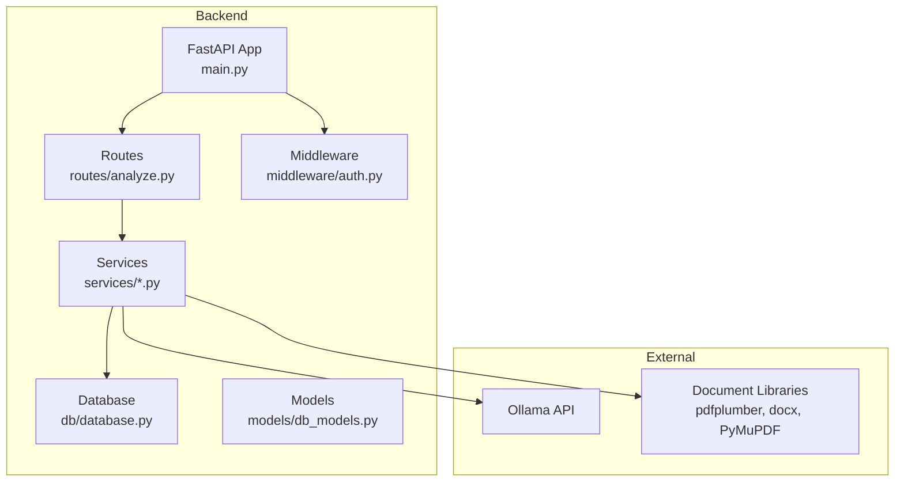

**Diagram sources**
- [main.py:174-260](file://app/backend/main.py#L174-L260)
- [analyze.py:354-501](file://app/backend/routes/analyze.py#L354-L501)
- [auth.py:19-46](file://app/backend/middleware/auth.py#L19-L46)
- [database.py:1-33](file://app/backend/db/database.py#L1-L33)
- [db_models.py:1-250](file://app/backend/models/db_models.py#L1-L250)

**Section sources**
- [README.md:231-251](file://README.md#L231-L251)
- [main.py:174-260](file://app/backend/main.py#L174-L260)

## Core Components
- LLM adapter: encapsulates Ollama API calls with timeouts, retries, and JSON parsing/fallback.
- Document processors: abstract parsing of PDF/DOCX/TXT/HTML/ODT via a unified interface.
- Gap detection: transforms work history into structured timeline and gaps.
- Hybrid pipeline: composes rule-based scoring with LLM narrative, with concurrency control and fallbacks.
- Health and startup checks: verify database and Ollama connectivity.

Key responsibilities:
- Unified interfaces for external services
- Error handling and fallbacks
- Retry logic and timeouts
- Authentication abstraction
- Request/response transformation
- Service discovery via environment variables
- Lifecycle management (singletons, semaphores)
- Health monitoring and diagnostics

**Section sources**
- [llm_service.py:7-156](file://app/backend/services/llm_service.py#L7-L156)
- [parser_service.py:130-552](file://app/backend/services/parser_service.py#L130-L552)
- [gap_detector.py:103-219](file://app/backend/services/gap_detector.py#L103-L219)
- [hybrid_pipeline.py:28-66](file://app/backend/services/hybrid_pipeline.py#L28-L66)
- [main.py:68-149](file://app/backend/main.py#L68-L149)

## Architecture Overview
The system integrates multiple adapters:
- HTTP client adapter for Ollama (LLMService)
- Document parsing adapters (parser_service)
- Gap detection adapter (gap_detector)
- Hybrid pipeline adapter (hybrid_pipeline)
- Health and startup checks (main.py)
- Authentication middleware (auth.py)
- Database adapter (SQLAlchemy)

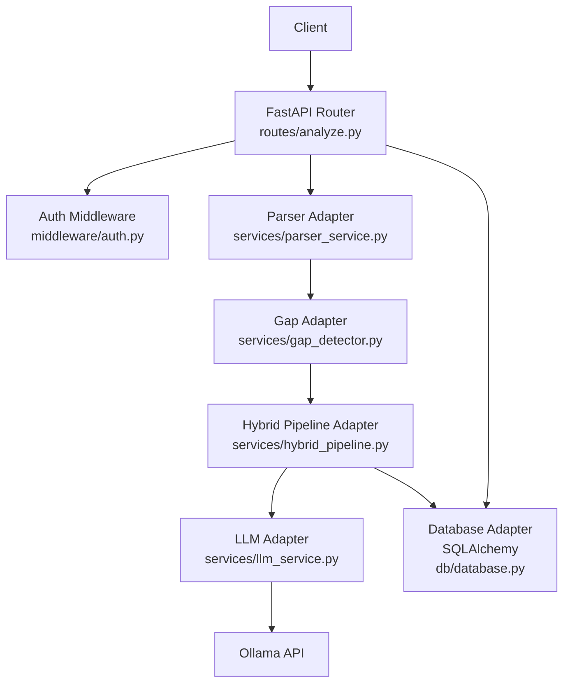

**Diagram sources**
- [analyze.py:354-501](file://app/backend/routes/analyze.py#L354-L501)
- [auth.py:19-46](file://app/backend/middleware/auth.py#L19-L46)
- [parser_service.py:130-552](file://app/backend/services/parser_service.py#L130-L552)
- [gap_detector.py:103-219](file://app/backend/services/gap_detector.py#L103-L219)
- [hybrid_pipeline.py:28-66](file://app/backend/services/hybrid_pipeline.py#L28-L66)
- [llm_service.py:7-156](file://app/backend/services/llm_service.py#L7-L156)
- [database.py:1-33](file://app/backend/db/database.py#L1-L33)

## Detailed Component Analysis

### LLM Adapter (Ollama)
The LLM adapter encapsulates Ollama API calls with:
- Configuration via environment variables (base URL, model)
- Timeout handling
- Retry logic with fallback response
- JSON parsing with multiple strategies
- Validation and normalization of results

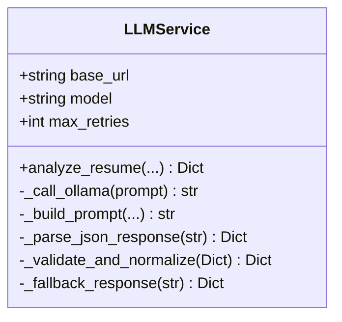

**Diagram sources**
- [llm_service.py:7-156](file://app/backend/services/llm_service.py#L7-L156)

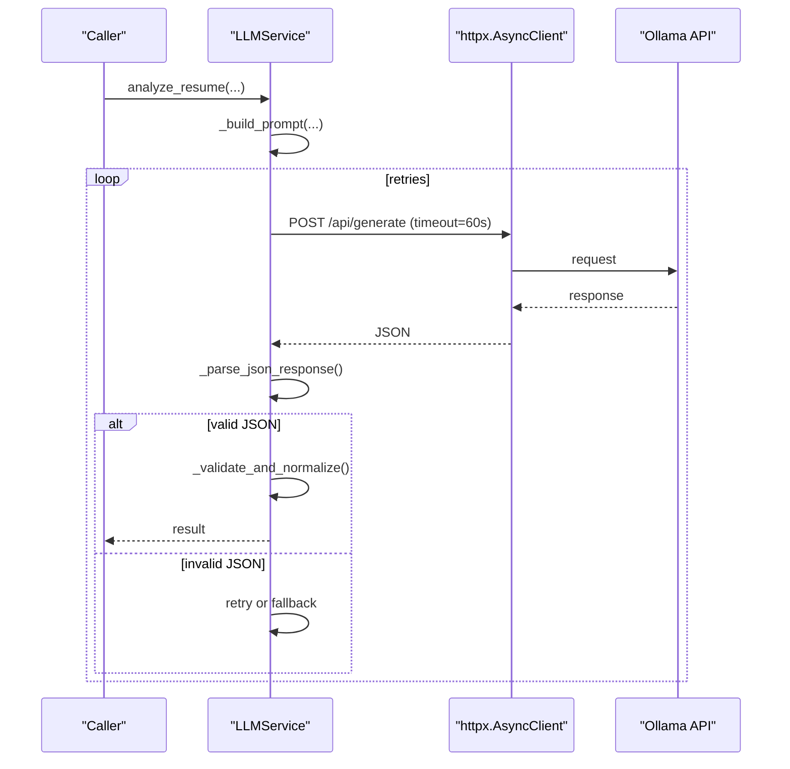

**Diagram sources**
- [llm_service.py:13-58](file://app/backend/services/llm_service.py#L13-L58)

Implementation highlights:
- Environment-driven configuration for base URL and model
- Strict timeout to prevent long-hanging requests
- Multiple parsing attempts for robustness
- Deterministic fallback response on failure

**Section sources**
- [llm_service.py:7-156](file://app/backend/services/llm_service.py#L7-L156)

### Document Processing Adapters
The parser adapter supports multiple resume formats and extracts structured data:
- PDF: PyMuPDF primary, pdfplumber fallback
- DOCX: paragraph and table extraction
- TXT/RTF/HTML/ODT: text extraction with normalization
- Fallback: broad skill list if advanced parsing fails

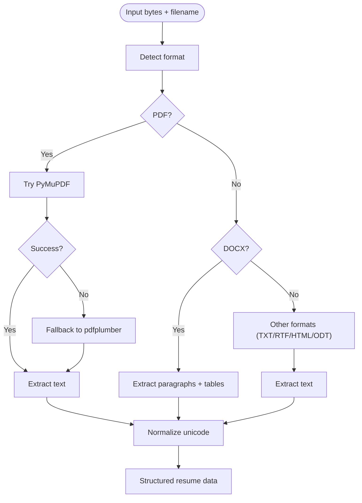

**Diagram sources**
- [parser_service.py:130-192](file://app/backend/services/parser_service.py#L130-L192)

Additional capabilities:
- Contact info extraction (name, email, phone, LinkedIn)
- Work experience parsing with date normalization
- Skills extraction via skills registry and regex fallback

**Section sources**
- [parser_service.py:130-552](file://app/backend/services/parser_service.py#L130-L552)

### Gap Detection Adapter
Transforms work experience into a structured timeline and computes:
- Employment gaps (threshold-based)
- Overlapping jobs
- Short stints
- Total effective years (merged intervals)

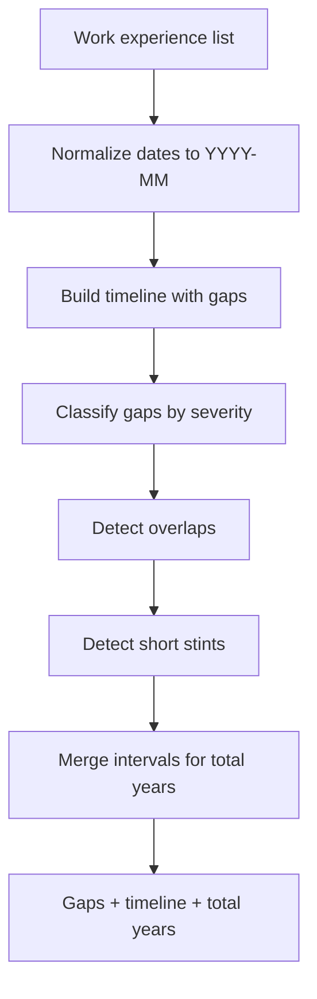

**Diagram sources**
- [gap_detector.py:103-219](file://app/backend/services/gap_detector.py#L103-L219)

**Section sources**
- [gap_detector.py:103-219](file://app/backend/services/gap_detector.py#L103-L219)

### Hybrid Pipeline Adapter
Combines rule-based scoring with a single LLM call for narrative:
- Concurrency control via semaphore
- LLM singletons to reuse connections
- In-memory JD cache for repeated jobs
- Fallback scoring when LLM calls fail

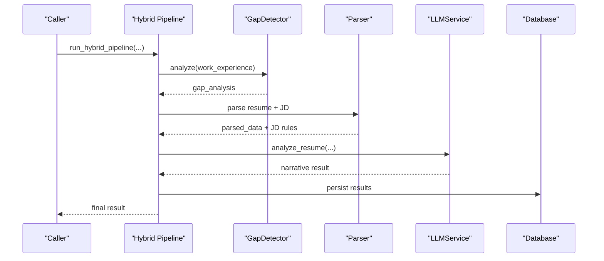

**Diagram sources**
- [hybrid_pipeline.py:28-66](file://app/backend/services/hybrid_pipeline.py#L28-L66)
- [gap_detector.py:103-219](file://app/backend/services/gap_detector.py#L103-L219)
- [llm_service.py:13-58](file://app/backend/services/llm_service.py#L13-L58)

**Section sources**
- [hybrid_pipeline.py:28-66](file://app/backend/services/hybrid_pipeline.py#L28-L66)
- [hybrid_pipeline.py:429-436](file://app/backend/services/hybrid_pipeline.py#L429-L436)

### Health and Startup Checks
The application performs health checks and startup verification:
- Database connectivity
- Ollama reachability and model status
- Model hot/cold status
- Environment configuration

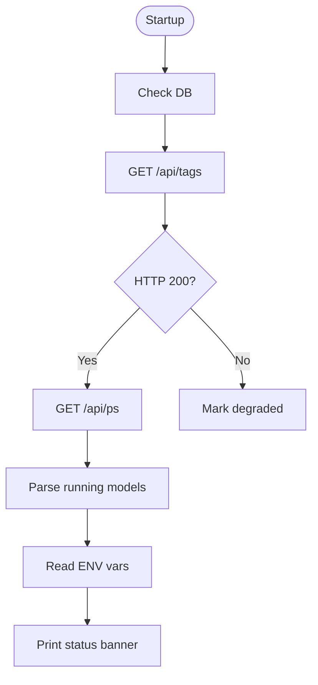

**Diagram sources**
- [main.py:68-149](file://app/backend/main.py#L68-L149)

**Section sources**
- [main.py:228-259](file://app/backend/main.py#L228-L259)
- [main.py:262-326](file://app/backend/main.py#L262-L326)

### Authentication Abstraction
Authentication is handled centrally:
- JWT bearer scheme
- User lookup and active status validation
- Admin role enforcement

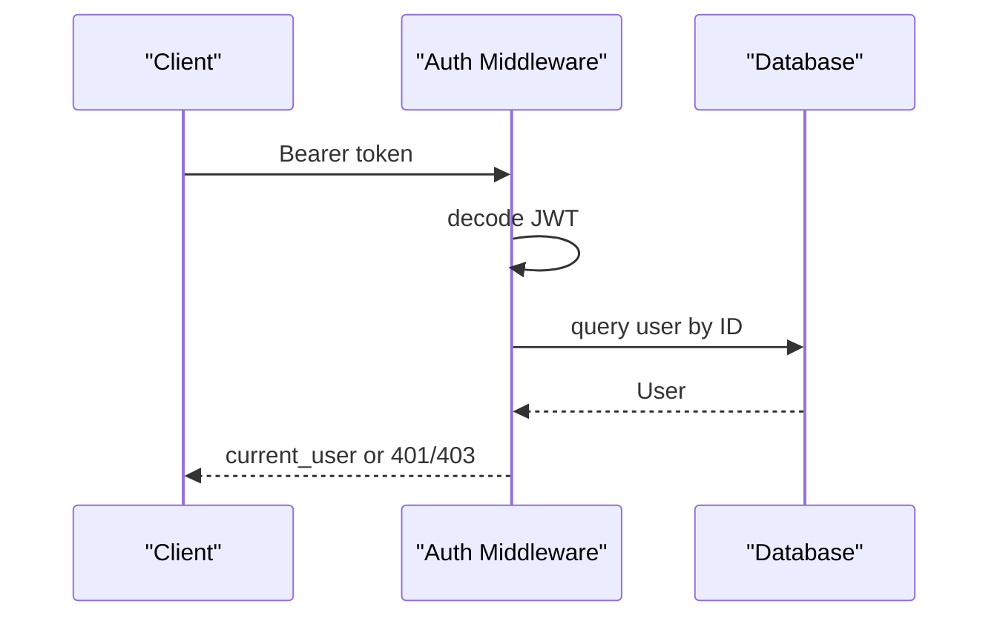

**Diagram sources**
- [auth.py:19-46](file://app/backend/middleware/auth.py#L19-L46)

**Section sources**
- [auth.py:19-46](file://app/backend/middleware/auth.py#L19-L46)

### Route-Level Integration
The analysis route coordinates:
- Usage checks and limits
- File validation and size limits
- Parsing and gap detection
- Hybrid pipeline execution
- Deduplication and persistence

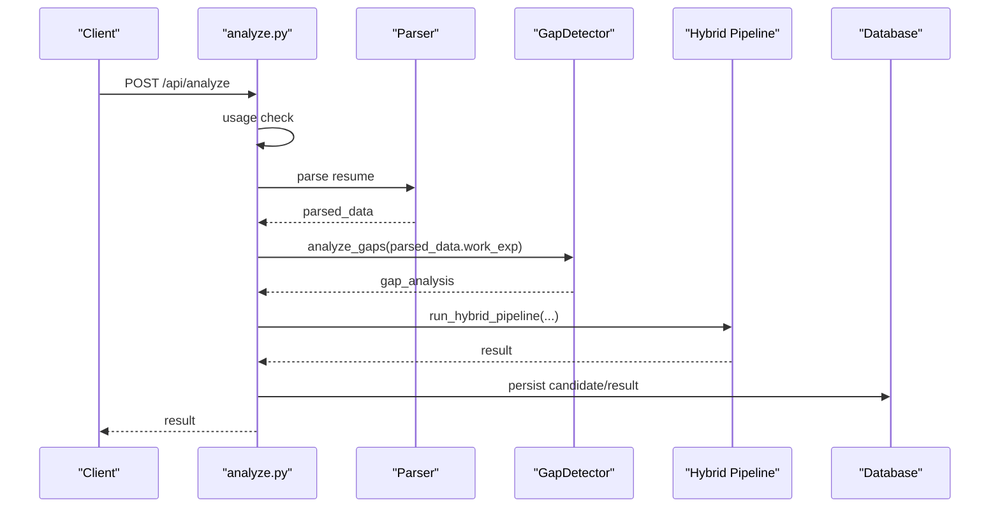

**Diagram sources**
- [analyze.py:354-501](file://app/backend/routes/analyze.py#L354-L501)

**Section sources**
- [analyze.py:354-501](file://app/backend/routes/analyze.py#L354-L501)

## Dependency Analysis
- Routes depend on services for parsing, gap detection, and hybrid pipeline.
- Services depend on external libraries (Ollama via httpx) and internal utilities.
- Database adapter abstracts SQLAlchemy operations.
- Middleware provides cross-cutting concerns (auth).

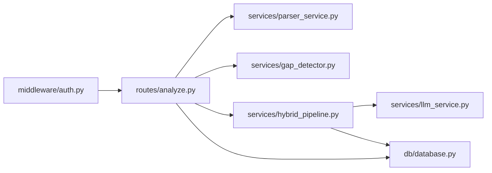

**Diagram sources**
- [analyze.py:32-41](file://app/backend/routes/analyze.py#L32-L41)
- [parser_service.py:1-10](file://app/backend/services/parser_service.py#L1-L10)
- [gap_detector.py:1-10](file://app/backend/services/gap_detector.py#L1-L10)
- [hybrid_pipeline.py:1-25](file://app/backend/services/hybrid_pipeline.py#L1-L25)
- [llm_service.py:1-10](file://app/backend/services/llm_service.py#L1-L10)
- [database.py:1-33](file://app/backend/db/database.py#L1-L33)
- [auth.py:1-10](file://app/backend/middleware/auth.py#L1-L10)

**Section sources**
- [analyze.py:32-41](file://app/backend/routes/analyze.py#L32-L41)
- [database.py:1-33](file://app/backend/db/database.py#L1-L33)

## Performance Considerations
- Concurrency control: a semaphore limits concurrent LLM calls to balance throughput and resource usage.
- LLM singletons: reuse ChatOllama instances to avoid connection overhead and benefit from keep-alive sessions.
- In-memory caches: JD cache reduces repeated LLM calls for identical job descriptions.
- Timeouts: strict timeouts on external calls prevent slow operations from blocking the system.
- Thread pool offloading: blocking I/O (e.g., PDF parsing) is executed in a thread pool to avoid event loop blocking.
- Database pooling: SQLAlchemy engine configured with pre-ping and appropriate connection arguments.

Recommendations:
- Monitor Ollama model hot/cold status and warm models during idle periods.
- Tune semaphore count and model context sizes based on hardware constraints.
- Use streaming responses for long-running operations to improve perceived latency.
- Implement circuit breakers for external services under load.

**Section sources**
- [hybrid_pipeline.py:28-32](file://app/backend/services/hybrid_pipeline.py#L28-L32)
- [hybrid_pipeline.py:45-66](file://app/backend/services/hybrid_pipeline.py#L45-L66)
- [hybrid_pipeline.py:67-83](file://app/backend/services/hybrid_pipeline.py#L67-L83)
- [main.py:262-326](file://app/backend/main.py#L262-L326)

## Troubleshooting Guide
Common issues and resolutions:
- Ollama not reachable: verify base URL and model availability; check health endpoints.
- Model not pulled or not hot: pull and preload the model; confirm via diagnostic endpoint.
- Database locked errors: SQLite concurrency limitations; restart backend container if locked.
- Scanned PDFs: parser rejects images; ensure text-based PDFs.
- Large files: enforce size limits in routes; reject oversized uploads.
- Authentication failures: ensure valid JWT and active user status.
- Usage limits: implement proper checks before processing; handle 429 gracefully.

Operational endpoints:
- Health check: returns DB and Ollama status
- LLM status: shows model readiness and diagnosis

**Section sources**
- [main.py:228-259](file://app/backend/main.py#L228-L259)
- [main.py:262-326](file://app/backend/main.py#L262-L326)
- [README.md:339-355](file://README.md#L339-L355)
- [analyze.py:369-384](file://app/backend/routes/analyze.py#L369-L384)

## Conclusion
The Resume AI backend employs a layered adapter pattern to abstract external services:
- LLM adapter encapsulates Ollama with timeouts, retries, and robust parsing/fallback.
- Document processors provide a unified interface across multiple formats.
- Gap detection and hybrid pipeline integrate rule-based logic with LLM narrative.
- Health checks, authentication, and database abstraction ensure reliability and maintainability.
Adopting these patterns enables pluggable adapters, centralized configuration, and resilient operation across diverse environments.

## Appendices

### Implementing Pluggable Adapters
To add a new external service provider:
- Define a protocol/interface for the adapter (e.g., a callable contract).
- Implement the adapter with environment-driven configuration.
- Encapsulate timeouts, retries, and fallbacks.
- Integrate via dependency injection or factory pattern.
- Add health checks and metrics.

### Configuration Management
- Centralize environment variables for external services.
- Provide defaults and validation.
- Use separate configuration modules per adapter.

### Service Discovery Patterns
- Use environment variables for base URLs and endpoints.
- Implement health endpoints to discover service status.
- Cache service metadata (e.g., JD cache) to reduce repeated calls.

### Adapter Lifecycle
- Initialize singletons and caches at startup.
- Respect timeouts and circuit breaker logic.
- Gracefully handle shutdown and cleanup.

### Testing Strategies
- Mock external adapters in unit tests.
- Use pytest fixtures for environment overrides.
- Simulate failures and timeouts to validate fallbacks.
- Test streaming endpoints with mock adapters.

### Example References
- LLM adapter: [llm_service.py:7-156](file://app/backend/services/llm_service.py#L7-L156)
- Parser adapter: [parser_service.py:130-552](file://app/backend/services/parser_service.py#L130-L552)
- Gap adapter: [gap_detector.py:103-219](file://app/backend/services/gap_detector.py#L103-L219)
- Hybrid pipeline: [hybrid_pipeline.py:28-66](file://app/backend/services/hybrid_pipeline.py#L28-L66)
- Health checks: [main.py:68-149](file://app/backend/main.py#L68-L149), [main.py:228-259](file://app/backend/main.py#L228-L259), [main.py:262-326](file://app/backend/main.py#L262-L326)
- Authentication: [auth.py:19-46](file://app/backend/middleware/auth.py#L19-L46)
- Route integration: [analyze.py:354-501](file://app/backend/routes/analyze.py#L354-L501)
- Database adapter: [database.py:1-33](file://app/backend/db/database.py#L1-L33)
- Frontend API usage: [api.js:93-141](file://app/frontend/src/lib/api.js#L93-L141)