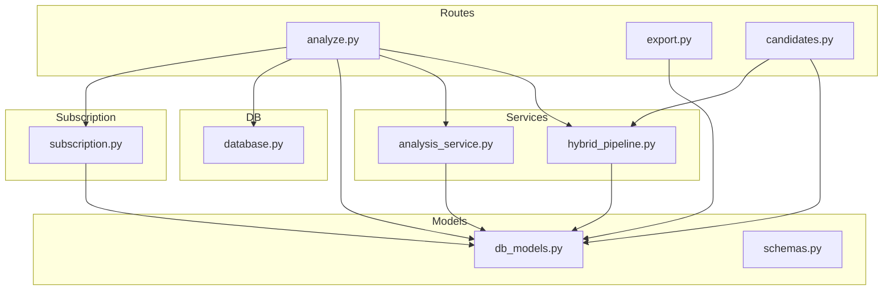
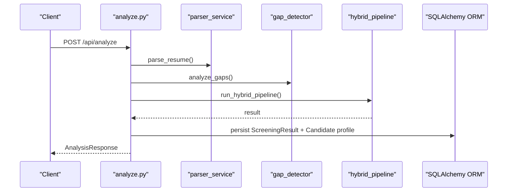
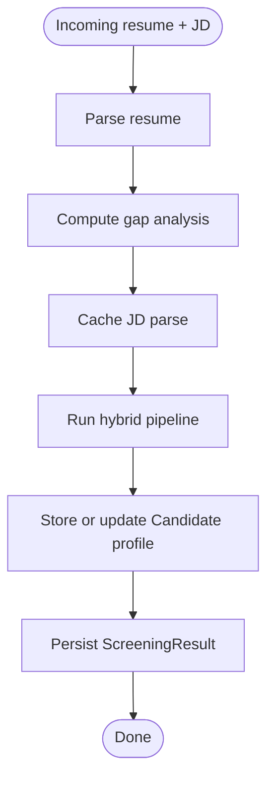
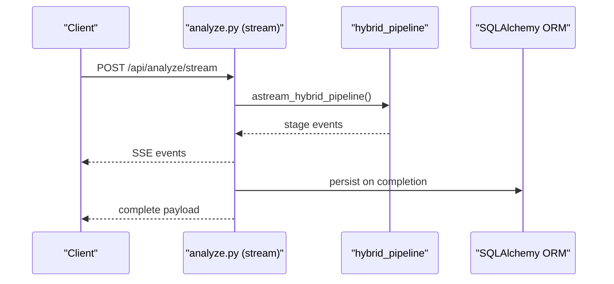
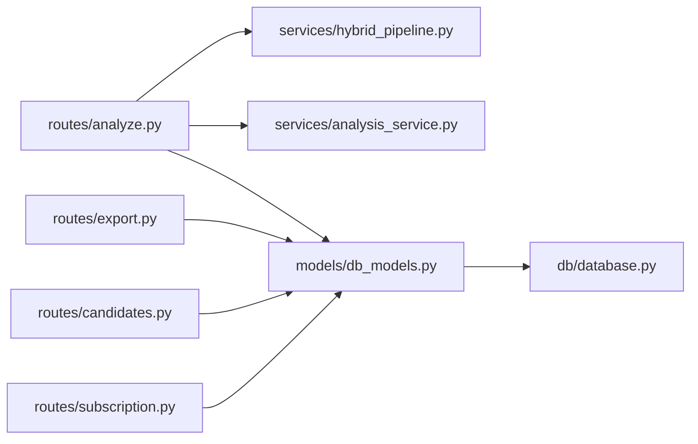

# Data Synchronization

<cite>
**Referenced Files in This Document**
- [analyze.py](file://app/backend/routes/analyze.py)
- [export.py](file://app/backend/routes/export.py)
- [candidates.py](file://app/backend/routes/candidates.py)
- [db_models.py](file://app/backend/models/db_models.py)
- [schemas.py](file://app/backend/models/schemas.py)
- [database.py](file://app/backend/db/database.py)
- [hybrid_pipeline.py](file://app/backend/services/hybrid_pipeline.py)
- [analysis_service.py](file://app/backend/services/analysis_service.py)
- [subscription.py](file://app/backend/routes/subscription.py)
- [test_routes_phase1.py](file://app/backend/tests/test_routes_phase1.py)
- [test_usage_enforcement.py](file://app/backend/tests/test_usage_enforcement.py)
</cite>

## Table of Contents
1. [Introduction](#introduction)
2. [Project Structure](#project-structure)
3. [Core Components](#core-components)
4. [Architecture Overview](#architecture-overview)
5. [Detailed Component Analysis](#detailed-component-analysis)
6. [Dependency Analysis](#dependency-analysis)
7. [Performance Considerations](#performance-considerations)
8. [Troubleshooting Guide](#troubleshooting-guide)
9. [Conclusion](#conclusion)
10. [Appendices](#appendices)

## Introduction
This document explains data synchronization patterns across integrated systems in Resume AI. It focuses on maintaining consistency between local data and external systems, including conflict resolution, update propagation, and bidirectional synchronization with external ATS systems. It also covers change detection, incremental updates, rollback procedures, data mapping strategies, synchronization timing patterns (real-time, batch, event-driven), and robustness through validation, normalization, and audit trails.

## Project Structure
Resume AI organizes data synchronization around:
- Route handlers that orchestrate ingestion, processing, and persistence
- SQLAlchemy models that define the schema and relationships
- Services that encapsulate analysis and pipeline logic
- Subscription and usage enforcement that govern synchronization budgets
- Export routes that transform internal results into ATS-friendly formats

**Diagram sources**
- [analyze.py:1-813](file://app/backend/routes/analyze.py#L1-L813)
- [export.py:1-105](file://app/backend/routes/export.py#L1-L105)
- [candidates.py:1-303](file://app/backend/routes/candidates.py#L1-L303)
- [hybrid_pipeline.py:1-1498](file://app/backend/services/hybrid_pipeline.py#L1-L1498)
- [analysis_service.py:1-121](file://app/backend/services/analysis_service.py#L1-L121)
- [db_models.py:1-250](file://app/backend/models/db_models.py#L1-L250)
- [schemas.py:1-379](file://app/backend/models/schemas.py#L1-L379)
- [database.py:1-33](file://app/backend/db/database.py#L1-L33)
- [subscription.py:1-477](file://app/backend/routes/subscription.py#L1-L477)

**Section sources**
- [analyze.py:1-813](file://app/backend/routes/analyze.py#L1-L813)
- [export.py:1-105](file://app/backend/routes/export.py#L1-L105)
- [candidates.py:1-303](file://app/backend/routes/candidates.py#L1-L303)
- [db_models.py:1-250](file://app/backend/models/db_models.py#L1-L250)
- [database.py:1-33](file://app/backend/db/database.py#L1-L33)

## Core Components
- Data models define the canonical schema for candidates, screening results, templates, transcripts, and skills. These models serve as the authoritative source for synchronization targets.
- Analysis routes ingest resumes and job descriptions, run hybrid pipelines, persist results, and maintain candidate profiles.
- Export routes transform screening results into CSV/Excel for ATS consumption.
- Subscription routes enforce usage limits and track usage for synchronization budgeting.
- Services implement skill matching, education scoring, and narrative generation, ensuring consistent transformations across sync boundaries.

**Section sources**
- [db_models.py:97-146](file://app/backend/models/db_models.py#L97-L146)
- [analyze.py:268-501](file://app/backend/routes/analyze.py#L268-L501)
- [export.py:20-105](file://app/backend/routes/export.py#L20-L105)
- [subscription.py:427-477](file://app/backend/routes/subscription.py#L427-L477)
- [hybrid_pipeline.py:654-751](file://app/backend/services/hybrid_pipeline.py#L654-L751)

## Architecture Overview
The system synchronizes data through three primary flows:
- Real-time sync: Single and streaming analysis endpoints persist results immediately and enrich candidate profiles.
- Batch sync: Batch analysis processes multiple resumes atomically, then persists all results.
- Event-driven updates: Streaming endpoints emit intermediate events, allowing clients to react to progress and errors.

**Diagram sources**
- [analyze.py:268-501](file://app/backend/routes/analyze.py#L268-L501)
- [hybrid_pipeline.py:1-1498](file://app/backend/services/hybrid_pipeline.py#L1-L1498)
- [db_models.py:97-146](file://app/backend/models/db_models.py#L97-L146)

## Detailed Component Analysis

### Candidate Profile Storage and Deduplication
- Deduplication uses multi-layer matching: email, file hash, and name+phone. On duplicates, the system can reuse stored profiles to avoid re-parsing.
- Candidate profiles are enriched with skills, education, work experience, and gap analysis. A parser snapshot preserves the full parsed structure for auditability.

**Diagram sources**
- [analyze.py:147-214](file://app/backend/routes/analyze.py#L147-L214)
- [analyze.py:268-318](file://app/backend/routes/analyze.py#L268-L318)

**Section sources**
- [analyze.py:147-214](file://app/backend/routes/analyze.py#L147-L214)
- [analyze.py:268-318](file://app/backend/routes/analyze.py#L268-L318)
- [db_models.py:97-126](file://app/backend/models/db_models.py#L97-L126)

### Bidirectional Synchronization with External ATS Systems
- Outbound synchronization: Export routes convert screening results into CSV/Excel for ATS import. Fields include fit score, recommendation, risk level, matched/missing skills, strengths/weaknesses, and timestamps.
- Inbound synchronization: The system does not currently implement inbound ATS updates. To support bidirectional sync:
  - Define a standardized ATS schema mapping to internal models.
  - Implement change detection via timestamps or hashes.
  - Apply incremental updates and conflict resolution (e.g., last-write-wins or merge with explicit conflict markers).
  - Enforce rollback procedures for failed updates using transactional writes and audit logs.

**Section sources**
- [export.py:27-52](file://app/backend/routes/export.py#L27-L52)
- [export.py:55-104](file://app/backend/routes/export.py#L55-L104)
- [db_models.py:128-146](file://app/backend/models/db_models.py#L128-L146)

### Data Mapping Strategies for ATS Formats
- Mapping from internal analysis results to ATS fields:
  - Fit score → “Score”
  - Final recommendation → “Recommendation”
  - Risk level → “Risk Level”
  - Matched/missing skills → “Matched Skills” / “Missing Skills”
  - Strengths/weaknesses → “Strengths” / “Weaknesses”
  - Timestamp → “Timestamp”
- Normalize and truncate fields to meet ATS constraints (e.g., character limits, special characters).

**Section sources**
- [export.py:27-52](file://app/backend/routes/export.py#L27-L52)

### Synchronization Timing Patterns
- Real-time sync: Single analysis endpoint persists immediately after hybrid pipeline completion.
- Streaming sync: SSE endpoint emits parsing, scoring, and complete stages, enabling near real-time UI updates while persisting results upon completion.
- Batch sync: Batch endpoint processes multiple files concurrently, persists all results, and sorts by fit score.

**Diagram sources**
- [analyze.py:506-646](file://app/backend/routes/analyze.py#L506-L646)
- [hybrid_pipeline.py:1-1498](file://app/backend/services/hybrid_pipeline.py#L1-L1498)

**Section sources**
- [analyze.py:506-646](file://app/backend/routes/analyze.py#L506-L646)
- [analyze.py:649-758](file://app/backend/routes/analyze.py#L649-L758)

### Conflict Resolution and Update Propagation
- Deduplication resolves conflicts by preferring stored profiles and updating when explicitly requested.
- Candidate enrichment propagates across results: subsequent analyses reuse the stored profile to avoid redundant parsing.
- For external ATS updates, implement a conflict policy (e.g., last-write-wins or merge with metadata indicating source and timestamp).

**Section sources**
- [analyze.py:147-214](file://app/backend/routes/analyze.py#L147-L214)
- [candidates.py:192-302](file://app/backend/routes/candidates.py#L192-L302)

### Rollback Procedures
- Partial failures in batch analysis: usage increments occur before validation in some flows. Tests document expected behavior and highlight the need to adjust increment timing to prevent incorrect usage accounting.
- Recommendations:
  - Move usage increment to after validation.
  - Wrap batch operations in a transaction and roll back on exceptions.
  - Record usage logs with statuses to enable manual reconciliation.

**Section sources**
- [test_usage_enforcement.py:580-605](file://app/backend/tests/test_usage_enforcement.py#L580-L605)
- [analyze.py:683-686](file://app/backend/routes/analyze.py#L683-L686)

### Implementing Custom Synchronization Logic
- Extend export routes to support additional ATS formats (e.g., JSON, XML) by adding mapping functions similar to the existing CSV/Excel converters.
- Introduce incremental export by filtering results by a timestamp window and emitting only changed records.
- Add ATS-specific validation and normalization to ensure compliance with target systems.

**Section sources**
- [export.py:27-104](file://app/backend/routes/export.py#L27-L104)

### Handling Partial Failures and Audit Trails
- Streaming analysis captures parse and pipeline errors and augments results with pipeline errors for auditability.
- Usage logs record actions and quantities, enabling audit trails for synchronization-related activities.
- Recommendation: persist detailed error payloads and timestamps for failed sync attempts to support diagnostics and retries.

**Section sources**
- [analyze.py:554-560](file://app/backend/routes/analyze.py#L554-L560)
- [analyze.py:623-626](file://app/backend/routes/analyze.py#L623-L626)
- [subscription.py:427-477](file://app/backend/routes/subscription.py#L427-L477)

### Data Validation, Normalization, and Integrity Checking
- Validation:
  - File size and type checks for resumes and job description uploads.
  - Minimum word count for job descriptions.
  - Usage limit checks before processing.
- Normalization:
  - Skill normalization and alias expansion for matching.
  - Education scoring normalization by degree relevance and field.
- Integrity:
  - Deduplication layers and candidate profile storage ensure consistent identity across results.
  - Snapshot JSON preservation supports audit and re-analysis.

**Section sources**
- [analyze.py:369-384](file://app/backend/routes/analyze.py#L369-L384)
- [analyze.py:255-265](file://app/backend/routes/analyze.py#L255-L265)
- [hybrid_pipeline.py:655-751](file://app/backend/services/hybrid_pipeline.py#L655-L751)
- [db_models.py:97-126](file://app/backend/models/db_models.py#L97-L126)

## Dependency Analysis
The synchronization logic depends on:
- Route handlers orchestrating ingestion and persistence
- Services implementing core transformations
- Models defining the canonical schema
- Subscription enforcement governing quotas and usage

**Diagram sources**
- [analyze.py:1-813](file://app/backend/routes/analyze.py#L1-L813)
- [export.py:1-105](file://app/backend/routes/export.py#L1-L105)
- [candidates.py:1-303](file://app/backend/routes/candidates.py#L1-L303)
- [hybrid_pipeline.py:1-1498](file://app/backend/services/hybrid_pipeline.py#L1-L1498)
- [analysis_service.py:1-121](file://app/backend/services/analysis_service.py#L1-L121)
- [db_models.py:1-250](file://app/backend/models/db_models.py#L1-L250)
- [database.py:1-33](file://app/backend/db/database.py#L1-L33)
- [subscription.py:1-477](file://app/backend/routes/subscription.py#L1-L477)

**Section sources**
- [analyze.py:1-813](file://app/backend/routes/analyze.py#L1-L813)
- [export.py:1-105](file://app/backend/routes/export.py#L1-L105)
- [candidates.py:1-303](file://app/backend/routes/candidates.py#L1-L303)
- [hybrid_pipeline.py:1-1498](file://app/backend/services/hybrid_pipeline.py#L1-L1498)
- [analysis_service.py:1-121](file://app/backend/services/analysis_service.py#L1-L121)
- [db_models.py:1-250](file://app/backend/models/db_models.py#L1-L250)
- [database.py:1-33](file://app/backend/db/database.py#L1-L33)
- [subscription.py:1-477](file://app/backend/routes/subscription.py#L1-L477)

## Performance Considerations
- Concurrency: Streaming and batch endpoints leverage asynchronous processing and concurrency controls to improve throughput.
- Caching: JD parsing is cached in the database to reduce repeated processing across workers.
- Memory: Candidate snapshots are capped to manage row sizes; consider compression or external storage for very large documents.
- Limits: Usage and batch size limits prevent resource exhaustion and ensure fair allocation.

[No sources needed since this section provides general guidance]

## Troubleshooting Guide
- Streaming errors: Inspect pipeline errors appended to results and verify LLM initialization and semaphore configuration.
- Batch failures: Review usage increment timing and transaction handling to prevent incorrect usage accounting.
- Export issues: Validate field mappings and ensure JSON serialization compatibility with ATS systems.
- Deduplication mismatches: Confirm deduplication layers and candidate profile updates.

**Section sources**
- [analyze.py:554-560](file://app/backend/routes/analyze.py#L554-L560)
- [analyze.py:623-626](file://app/backend/routes/analyze.py#L623-L626)
- [test_usage_enforcement.py:580-605](file://app/backend/tests/test_usage_enforcement.py#L580-L605)
- [export.py:27-52](file://app/backend/routes/export.py#L27-L52)

## Conclusion
Resume AI’s synchronization patterns center on robust ingestion, transformation, and persistence with strong validation, deduplication, and auditability. While outbound synchronization to ATS is supported via exports, bidirectional synchronization requires additional mapping, change detection, and rollback mechanisms. By leveraging existing services, models, and subscription enforcement, teams can extend the system to support real-time, batch, and event-driven synchronization with external ATS systems while maintaining data integrity and auditability.

## Appendices
- Example tests demonstrate export functionality and usage enforcement, providing reference patterns for extending synchronization logic.

**Section sources**
- [test_routes_phase1.py:178-192](file://app/backend/tests/test_routes_phase1.py#L178-L192)
- [test_usage_enforcement.py:231-254](file://app/backend/tests/test_usage_enforcement.py#L231-L254)