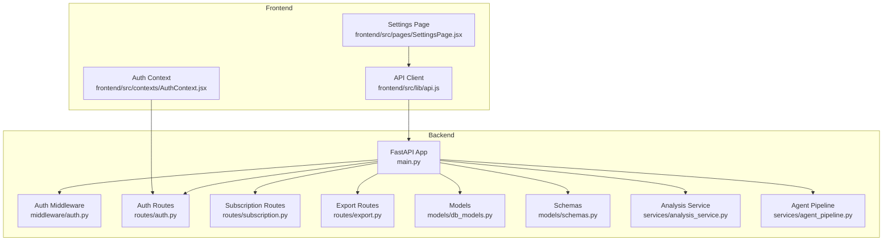
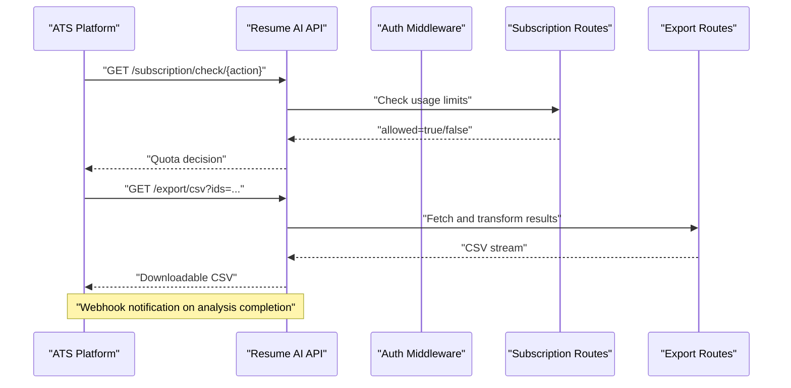
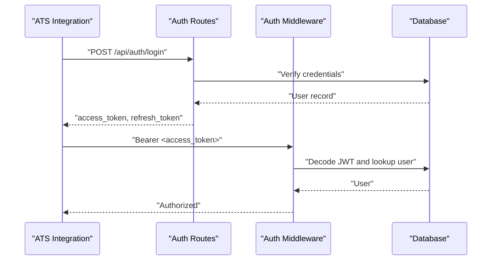
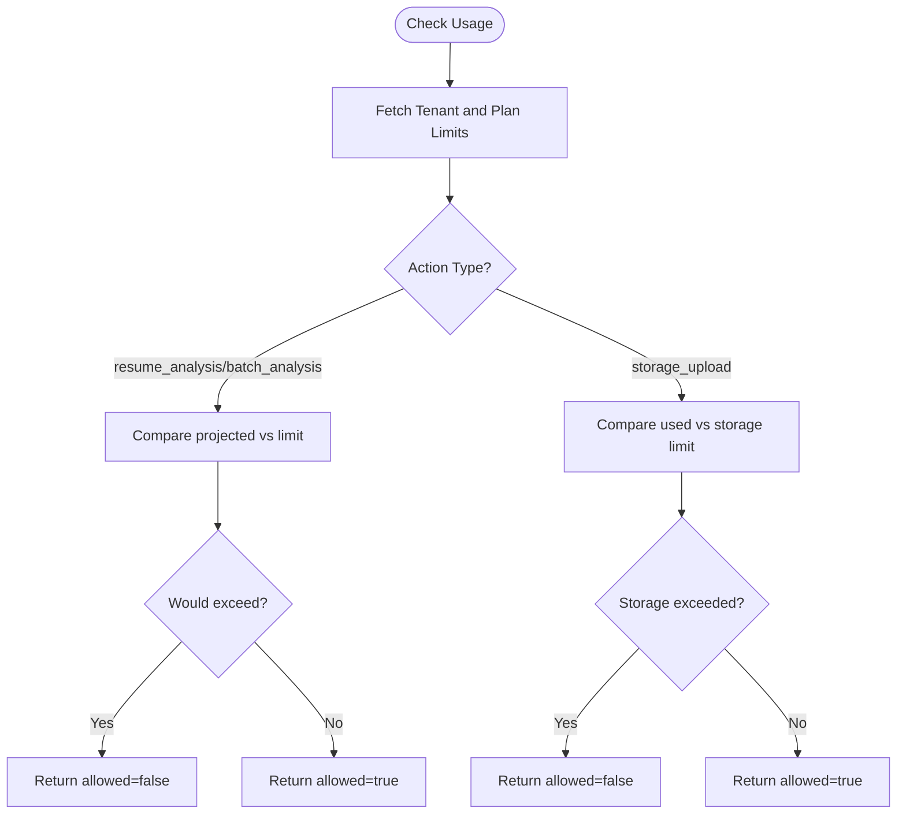
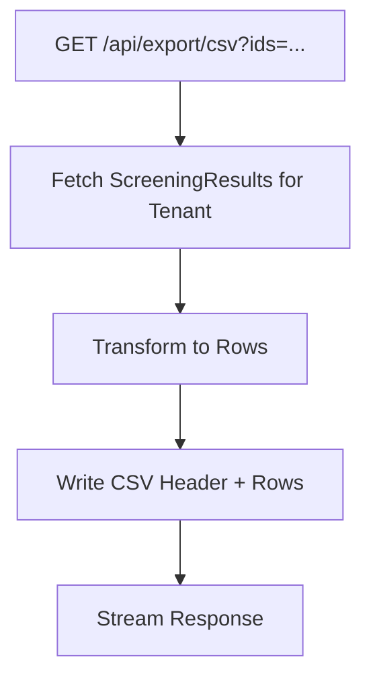
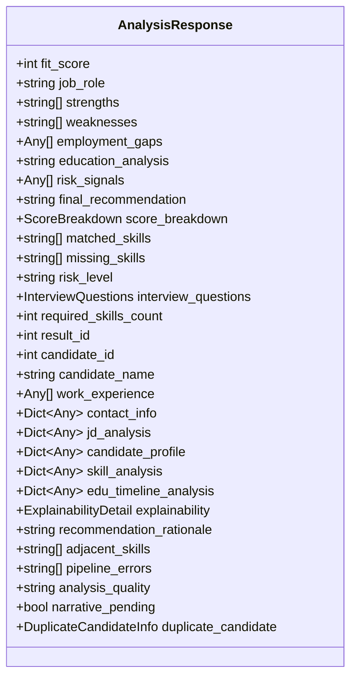
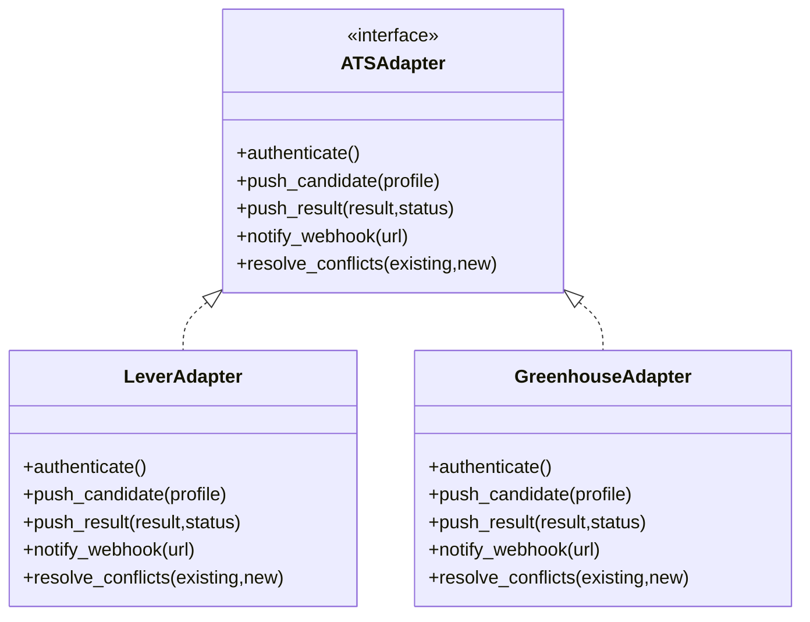
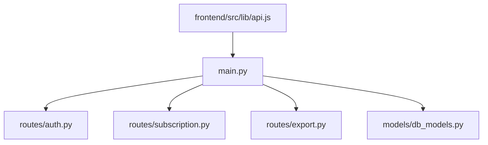

# External ATS Integration

<cite>
**Referenced Files in This Document**
- [main.py](file://app/backend/main.py)
- [auth.py](file://app/backend/middleware/auth.py)
- [auth_routes.py](file://app/backend/routes/auth.py)
- [subscription.py](file://app/backend/routes/subscription.py)
- [export.py](file://app/backend/routes/export.py)
- [db_models.py](file://app/backend/models/db_models.py)
- [schemas.py](file://app/backend/models/schemas.py)
- [analysis_service.py](file://app/backend/services/analysis_service.py)
- [agent_pipeline.py](file://app/backend/services/agent_pipeline.py)
- [api.js](file://app/frontend/src/lib/api.js)
- [SettingsPage.jsx](file://app/frontend/src/pages/SettingsPage.jsx)
- [AuthContext.jsx](file://app/frontend/src/contexts/AuthContext.jsx)
- [test_subscription.py](file://app/backend/tests/test_subscription.py)
- [test_auth.py](file://app/backend/tests/test_auth.py)
</cite>

## Table of Contents
1. [Introduction](#introduction)
2. [Project Structure](#project-structure)
3. [Core Components](#core-components)
4. [Architecture Overview](#architecture-overview)
5. [Detailed Component Analysis](#detailed-component-analysis)
6. [Dependency Analysis](#dependency-analysis)
7. [Performance Considerations](#performance-considerations)
8. [Troubleshooting Guide](#troubleshooting-guide)
9. [Conclusion](#conclusion)
10. [Appendices](#appendices)

## Introduction
This document describes how to integrate Resume AI with external Applicant Tracking Systems (ATS) using a standardized adapter pattern. It covers:
- Adapter pattern for connecting to multiple ATS platforms via unified APIs and webhooks
- Authentication mechanisms (JWT-based Bearer tokens)
- Data transformation pipelines to convert Resume AI analysis results into ATS-compatible formats
- Webhook implementation for real-time notifications upon analysis completion
- Examples for building custom ATS adapters, handling rate limits, and managing integration failures
- Strategies for data synchronization, conflict resolution, and consistency across ATS systems

## Project Structure
The backend is a FastAPI application that exposes REST endpoints, manages authentication, enforces usage quotas, and exports screening results. The frontend provides UI and API helpers for interacting with the backend.

**Diagram sources**
- [main.py:174-214](file://app/backend/main.py#L174-L214)
- [auth.py:19-46](file://app/backend/middleware/auth.py#L19-L46)
- [auth_routes.py:118-142](file://app/backend/routes/auth.py#L118-L142)
- [subscription.py:162-253](file://app/backend/routes/subscription.py#L162-L253)
- [export.py:55-104](file://app/backend/routes/export.py#L55-L104)
- [db_models.py:31-147](file://app/backend/models/db_models.py#L31-L147)
- [schemas.py:89-125](file://app/backend/models/schemas.py#L89-L125)
- [analysis_service.py:10-53](file://app/backend/services/analysis_service.py#L10-L53)
- [agent_pipeline.py:591-618](file://app/backend/services/agent_pipeline.py#L591-L618)
- [api.js:362-392](file://app/frontend/src/lib/api.js#L362-L392)
- [AuthContext.jsx:11-40](file://app/frontend/src/contexts/AuthContext.jsx#L11-L40)
- [SettingsPage.jsx:434-469](file://app/frontend/src/pages/SettingsPage.jsx#L434-L469)

**Section sources**
- [main.py:174-214](file://app/backend/main.py#L174-L214)
- [api.js:362-392](file://app/frontend/src/lib/api.js#L362-L392)

## Core Components
- Authentication and Authorization
  - JWT-based bearer tokens with refresh support
  - Admin-required routes for administrative tasks
- Usage and Quota Management
  - Plan-based limits (analyses per month, storage, team members)
  - Pre-flight usage checks and usage logging
- Data Export
  - CSV and Excel export of screening results for ATS ingestion
- Analysis Results
  - Structured analysis response compatible with downstream ATS transformations

**Section sources**
- [auth.py:19-46](file://app/backend/middleware/auth.py#L19-L46)
- [auth_routes.py:118-142](file://app/backend/routes/auth.py#L118-L142)
- [subscription.py:256-343](file://app/backend/routes/subscription.py#L256-L343)
- [subscription.py:427-477](file://app/backend/routes/subscription.py#L427-L477)
- [export.py:27-52](file://app/backend/routes/export.py#L27-L52)
- [schemas.py:89-125](file://app/backend/models/schemas.py#L89-L125)

## Architecture Overview
The integration architecture centers on:
- Standardized REST APIs for authentication, quota checks, and result exports
- An adapter layer that transforms Resume AI outputs into ATS-specific payloads
- Webhooks for asynchronous notifications when analysis completes
- Rate-limiting enforced by usage checks and plan limits

**Diagram sources**
- [subscription.py:256-343](file://app/backend/routes/subscription.py#L256-L343)
- [export.py:55-104](file://app/backend/routes/export.py#L55-L104)
- [auth.py:19-46](file://app/backend/middleware/auth.py#L19-L46)

## Detailed Component Analysis

### Authentication and Authorization
- JWT Bearer tokens are validated centrally; missing or invalid tokens return 401
- Refresh flow supports renewing access tokens using a refresh token
- Admin-only routes require admin role

**Diagram sources**
- [auth_routes.py:118-142](file://app/backend/routes/auth.py#L118-L142)
- [auth.py:19-46](file://app/backend/middleware/auth.py#L19-L46)

**Section sources**
- [auth.py:19-46](file://app/backend/middleware/auth.py#L19-L46)
- [auth_routes.py:118-142](file://app/backend/routes/auth.py#L118-L142)
- [test_auth.py:39-113](file://app/backend/tests/test_auth.py#L39-L113)

### Usage and Quota Management
- Pre-flight checks for actions like resume_analysis and batch_analysis
- Storage upload checks separate from monthly analysis limits
- Usage logs track who performed what action and when
- Admin endpoints to reset usage and change plans

**Diagram sources**
- [subscription.py:256-343](file://app/backend/routes/subscription.py#L256-L343)
- [subscription.py:427-477](file://app/backend/routes/subscription.py#L427-L477)

**Section sources**
- [subscription.py:256-343](file://app/backend/routes/subscription.py#L256-L343)
- [subscription.py:427-477](file://app/backend/routes/subscription.py#L427-L477)
- [test_subscription.py:136-187](file://app/backend/tests/test_subscription.py#L136-L187)

### Data Export for ATS
- CSV and Excel export of screening results
- Transforms analysis_result and parsed_data into a tabular format suitable for ATS ingestion
- Filtering by result IDs supported

**Diagram sources**
- [export.py:20-52](file://app/backend/routes/export.py#L20-L52)
- [export.py:55-104](file://app/backend/routes/export.py#L55-L104)

**Section sources**
- [export.py:27-52](file://app/backend/routes/export.py#L27-L52)
- [export.py:55-104](file://app/backend/routes/export.py#L55-L104)

### Analysis Results Schema
- Structured response includes fit score, strengths, weaknesses, risk signals, recommendations, and score breakdown
- New hybrid pipeline fields and explainability details included for richer ATS consumption

**Diagram sources**
- [schemas.py:89-125](file://app/backend/models/schemas.py#L89-L125)

**Section sources**
- [schemas.py:89-125](file://app/backend/models/schemas.py#L89-L125)
- [agent_pipeline.py:591-618](file://app/backend/services/agent_pipeline.py#L591-L618)

### Adapter Pattern for ATS Integrations
- Define a standardized interface for ATS adapters:
  - authenticate(): Establish connection using JWT or API key
  - push_candidate(): Upsert candidate profile
  - push_result(): Publish analysis result with status
  - notify_webhook(): Configure webhook endpoint for completion events
  - resolve_conflicts(): Merge or deduplicate on ID collisions
- Implement platform-specific clients (e.g., Lever, Greenhouse, Workday) as subclasses
- Use export endpoints to batch publish results when platform APIs are unavailable

[No sources needed since this diagram shows conceptual architecture]

### Webhook Implementation for Real-Time Notifications
- On analysis completion, emit a webhook to the configured ATS endpoint
- Payload should include:
  - event_type: "analysis.completed"
  - candidate_id, result_id
  - status: "shortlisted", "rejected", "pending", "in-review", "hired"
  - timestamps and analysis metadata
- ATS should acknowledge receipt to enable retry and idempotency

[No sources needed since this section provides general guidance]

### Data Transformation Pipelines
- Transform Resume AI’s AnalysisResponse into ATS-specific fields:
  - Fit score, recommendation, risk level
  - Skill match percentages and lists
  - Strengths and weaknesses
  - Contact info and work experience
- Normalize enums and statuses to ATS expectations
- For batch uploads, leverage CSV/Excel export and ATS bulk endpoints

**Section sources**
- [export.py:27-52](file://app/backend/routes/export.py#L27-L52)
- [schemas.py:89-125](file://app/backend/models/schemas.py#L89-L125)

### Implementing Custom ATS Adapters
- Steps:
  - Create adapter subclass implementing the interface
  - Manage authentication (JWT or API key) and token refresh
  - Map Resume AI fields to ATS fields
  - Implement conflict resolution (by candidate ID or external ID)
  - Handle rate limits and backoff
  - Emit webhooks on completion
- Example patterns:
  - Use frontend API helpers to pre-validate quotas before pushing
  - Store adapter configuration per tenant

[No sources needed since this section provides general guidance]

### Handling API Rate Limits and Failures
- Pre-flight usage checks to avoid exceeding limits
- Retry with exponential backoff and jitter
- Idempotent operations using unique correlation IDs
- Circuit breaker for persistent failures
- Fallback to CSV/Excel export when platform is down

**Section sources**
- [subscription.py:256-343](file://app/backend/routes/subscription.py#L256-L343)
- [api.js:372-374](file://app/frontend/src/lib/api.js#L372-L374)

### Data Synchronization and Conflict Resolution
- Use candidate identifiers (external ATS IDs, emails, or hashes) to detect duplicates
- Merge updates preserving higher confidence fields
- Maintain a sync log with timestamps and reasons for changes
- Periodic reconciliation jobs to align ATS state with Resume AI

[No sources needed since this section provides general guidance]

## Dependency Analysis
- Backend includes routers for auth, subscription, export, and others
- Models define tenants, users, usage logs, and screening results
- Frontend API module exposes subscription endpoints and export helpers

**Diagram sources**
- [main.py:202-214](file://app/backend/main.py#L202-L214)
- [db_models.py:31-147](file://app/backend/models/db_models.py#L31-L147)
- [api.js:362-392](file://app/frontend/src/lib/api.js#L362-L392)

**Section sources**
- [main.py:202-214](file://app/backend/main.py#L202-L214)
- [db_models.py:31-147](file://app/backend/models/db_models.py#L31-L147)
- [api.js:362-392](file://app/frontend/src/lib/api.js#L362-L392)

## Performance Considerations
- Use streaming responses for large exports (CSV/Excel)
- Cache plan limits and tenant usage to minimize DB queries
- Batch operations where supported by ATS APIs
- Monitor LLM availability and degrade gracefully if needed

[No sources needed since this section provides general guidance]

## Troubleshooting Guide
- Authentication failures
  - Verify JWT secret and algorithm configuration
  - Confirm refresh token validity and expiration
- Usage limit errors
  - Check plan limits and current usage
  - Use pre-flight checks before heavy operations
- Export issues
  - Validate result IDs and tenant scoping
  - Inspect streaming response headers and content type

**Section sources**
- [auth.py:19-46](file://app/backend/middleware/auth.py#L19-L46)
- [subscription.py:256-343](file://app/backend/routes/subscription.py#L256-L343)
- [export.py:55-104](file://app/backend/routes/export.py#L55-L104)
- [test_auth.py:39-113](file://app/backend/tests/test_auth.py#L39-L113)
- [test_subscription.py:136-187](file://app/backend/tests/test_subscription.py#L136-L187)

## Conclusion
By adopting a standardized adapter pattern, robust authentication, and a clear data transformation pipeline, Resume AI can integrate seamlessly with multiple ATS platforms. Pre-flight usage checks, webhook notifications, and conflict resolution strategies ensure reliable, scalable, and consistent operations across diverse ATS ecosystems.

## Appendices

### API Reference Highlights
- Authentication
  - POST /api/auth/login → access_token, refresh_token
  - POST /api/auth/refresh → new access_token
  - GET /api/auth/me → user and tenant info
- Subscription
  - GET /api/subscription/plans → available plans
  - GET /api/subscription → current plan and usage
  - GET /api/subscription/check/{action} → quota check
  - GET /api/subscription/usage-history → usage logs
- Export
  - GET /api/export/csv?ids=... → downloadable CSV
  - GET /api/export/excel?ids=... → downloadable Excel

**Section sources**
- [auth_routes.py:118-142](file://app/backend/routes/auth.py#L118-L142)
- [subscription.py:162-253](file://app/backend/routes/subscription.py#L162-L253)
- [subscription.py:256-343](file://app/backend/routes/subscription.py#L256-L343)
- [subscription.py:346-367](file://app/backend/routes/subscription.py#L346-L367)
- [export.py:55-104](file://app/backend/routes/export.py#L55-L104)