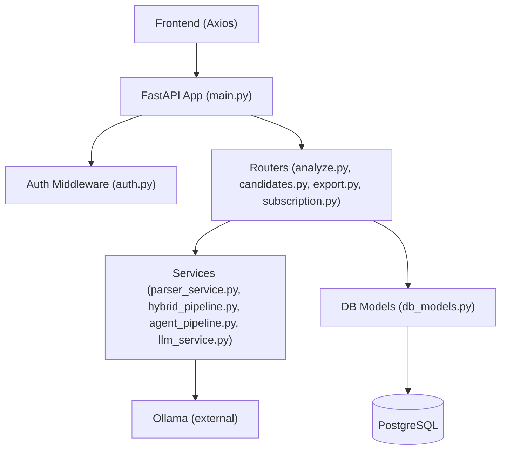
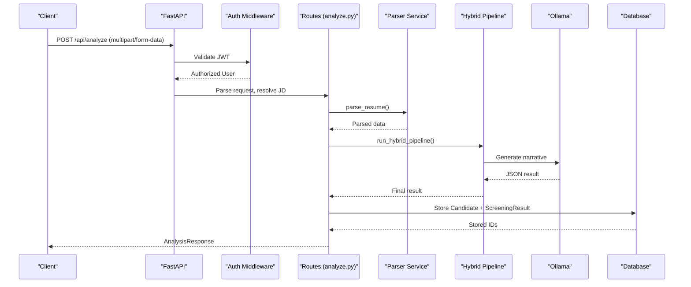
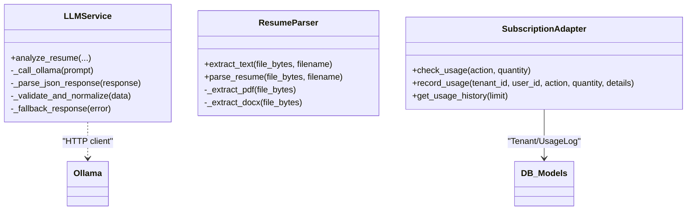
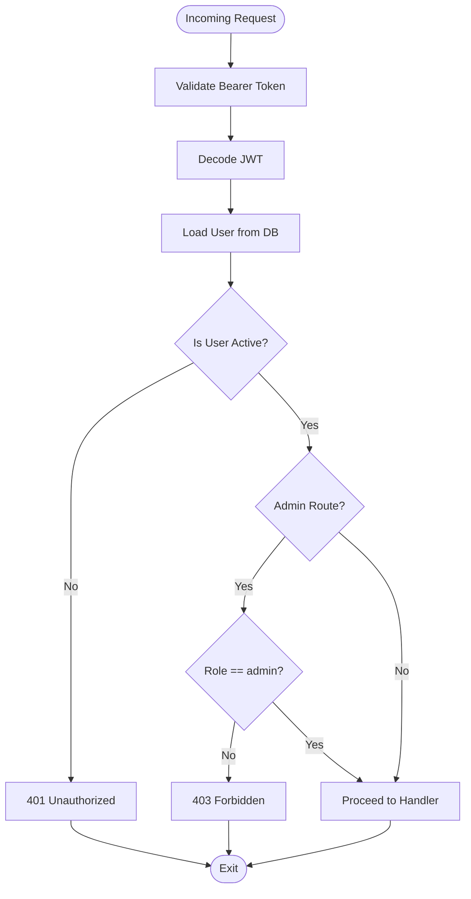
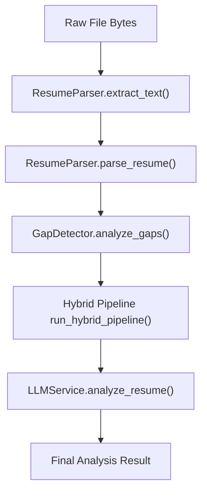
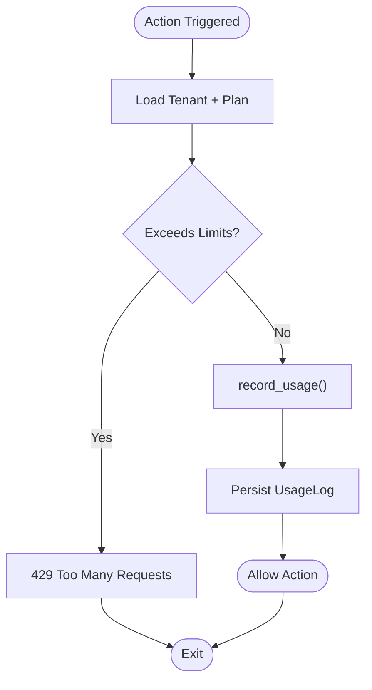
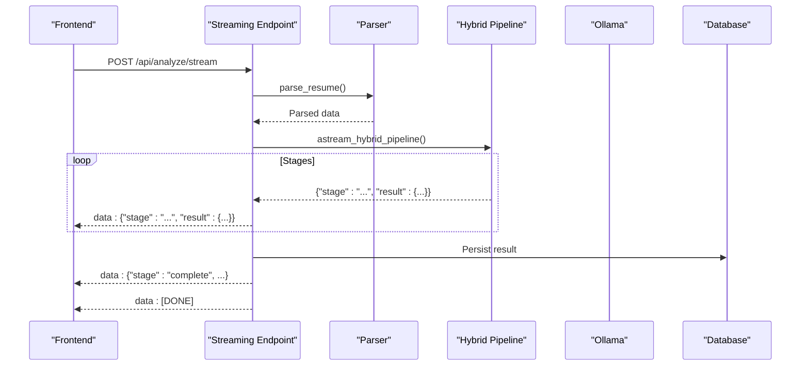
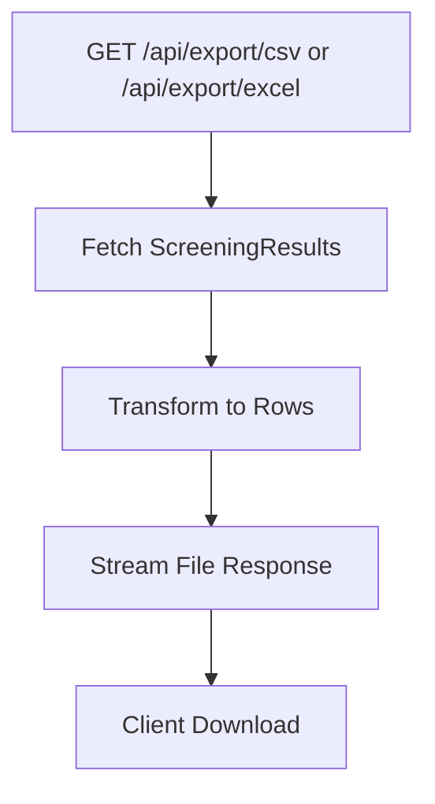
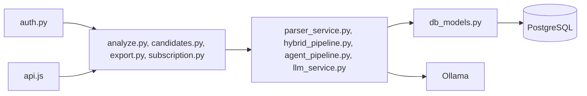

# Integration Patterns

<cite>
**Referenced Files in This Document**
- [main.py](file://app/backend/main.py)
- [auth.py](file://app/backend/middleware/auth.py)
- [db_models.py](file://app/backend/models/db_models.py)
- [parser_service.py](file://app/backend/services/parser_service.py)
- [subscription.py](file://app/backend/routes/subscription.py)
- [agent_pipeline.py](file://app/backend/services/agent_pipeline.py)
- [hybrid_pipeline.py](file://app/backend/services/hybrid_pipeline.py)
- [llm_service.py](file://app/backend/services/llm_service.py)
- [analyze.py](file://app/backend/routes/analyze.py)
- [candidates.py](file://app/backend/routes/candidates.py)
- [export.py](file://app/backend/routes/export.py)
- [api.js](file://app/frontend/src/lib/api.js)
- [SettingsPage.jsx](file://app/frontend/src/pages/SettingsPage.jsx)
</cite>

## Table of Contents
1. [Introduction](#introduction)
2. [Project Structure](#project-structure)
3. [Core Components](#core-components)
4. [Architecture Overview](#architecture-overview)
5. [Detailed Component Analysis](#detailed-component-analysis)
6. [Dependency Analysis](#dependency-analysis)
7. [Performance Considerations](#performance-considerations)
8. [Troubleshooting Guide](#troubleshooting-guide)
9. [Conclusion](#conclusion)
10. [Appendices](#appendices)

## Introduction
This document describes advanced integration patterns for Resume AI, focusing on how to connect to external ATS systems, HRIS platforms, and third-party services. It explains the adapter-style design used to support multiple external systems, authentication and authorization mechanisms, standardized data transformation pipelines, robust error handling, and usage enforcement. It also covers integration with external AI services (via Ollama), document processing APIs, and cloud storage considerations. Real-time integrations are supported through streaming endpoints and event-driven patterns, with guidance on webhook implementation, rate limiting, and data synchronization strategies.

## Project Structure
The backend is a FastAPI application with modular routers and services. Authentication is JWT-based. Services encapsulate AI orchestration, parsing, and usage enforcement. Frontend communicates via Axios with automatic token injection and retry logic.

**Diagram sources**
- [main.py:174-214](file://app/backend/main.py#L174-L214)
- [auth.py:19-46](file://app/backend/middleware/auth.py#L19-L46)
- [analyze.py:41-42](file://app/backend/routes/analyze.py#L41-L42)
- [candidates.py:23-23](file://app/backend/routes/candidates.py#L23-L23)
- [export.py:17-17](file://app/backend/routes/export.py#L17-L17)
- [subscription.py:20-20](file://app/backend/routes/subscription.py#L20-L20)
- [db_models.py:11-250](file://app/backend/models/db_models.py#L11-L250)

**Section sources**
- [main.py:174-214](file://app/backend/main.py#L174-L214)
- [auth.py:19-46](file://app/backend/middleware/auth.py#L19-L46)
- [db_models.py:11-250](file://app/backend/models/db_models.py#L11-L250)

## Core Components
- Authentication and Authorization: JWT bearer tokens validated centrally; admin-only routes protected by a dedicated dependency.
- Data Parsing and Transformation: Robust resume and JD parsers with fallbacks and normalization.
- AI Orchestration: Hybrid pipeline with Python-first rules and a single LLM call for narrative; optional LangGraph-based agent pipeline.
- Usage Enforcement: Subscription-based limits with monthly resets, storage tracking, and usage logging.
- Export and Integration Outputs: CSV/Excel exports for ATS ingestion; streaming endpoints for real-time feedback.
- External Integrations: Ollama for LLM inference; HTTP clients for outbound integrations; database-backed caches for performance.

**Section sources**
- [auth.py:19-46](file://app/backend/middleware/auth.py#L19-L46)
- [parser_service.py:22-127](file://app/backend/services/parser_service.py#L22-L127)
- [hybrid_pipeline.py:441-560](file://app/backend/services/hybrid_pipeline.py#L441-L560)
- [agent_pipeline.py:161-448](file://app/backend/services/agent_pipeline.py#L161-L448)
- [subscription.py:256-343](file://app/backend/routes/subscription.py#L256-L343)
- [export.py:27-52](file://app/backend/routes/export.py#L27-L52)
- [analyze.py:506-646](file://app/backend/routes/analyze.py#L506-L646)

## Architecture Overview
The system integrates external services through a layered approach:
- Authentication layer validates JWT tokens and scopes access.
- Route handlers coordinate parsing, orchestration, and persistence.
- Services encapsulate AI logic and external API calls.
- Models define multi-tenant data structures and usage tracking.
- External systems include Ollama for LLM inference and potential ATS/HRIS integrations via standardized endpoints.

**Diagram sources**
- [analyze.py:354-501](file://app/backend/routes/analyze.py#L354-L501)
- [parser_service.py:547-552](file://app/backend/services/parser_service.py#L547-L552)
- [hybrid_pipeline.py:623-634](file://app/backend/services/hybrid_pipeline.py#L623-L634)
- [llm_service.py:13-41](file://app/backend/services/llm_service.py#L13-L41)

## Detailed Component Analysis

### Adapter Pattern for External Systems
The system follows an adapter-style design by encapsulating external integrations behind service classes and route handlers:
- LLM adapters: LLMService wraps Ollama calls with retries, timeouts, and response normalization.
- Parser adapters: ResumeParser and JD extraction functions adapt various document formats.
- Usage adapters: Subscription routes centralize plan limits, storage quotas, and usage logging.

**Diagram sources**
- [llm_service.py:7-156](file://app/backend/services/llm_service.py#L7-L156)
- [parser_service.py:130-552](file://app/backend/services/parser_service.py#L130-L552)
- [subscription.py:256-477](file://app/backend/routes/subscription.py#L256-L477)

**Section sources**
- [llm_service.py:7-156](file://app/backend/services/llm_service.py#L7-L156)
- [parser_service.py:130-552](file://app/backend/services/parser_service.py#L130-L552)
- [subscription.py:256-477](file://app/backend/routes/subscription.py#L256-L477)

### Authentication and Authorization
- JWT bearer scheme is enforced via a dependency that decodes and validates tokens, loads the current user, and enforces active status.
- Admin-only routes use a separate dependency to restrict access.

**Diagram sources**
- [auth.py:19-46](file://app/backend/middleware/auth.py#L19-L46)

**Section sources**
- [auth.py:19-46](file://app/backend/middleware/auth.py#L19-L46)

### Data Transformation Pipelines
- Resume parsing supports multiple formats with fallbacks and normalization.
- Hybrid pipeline composes Python rules with a single LLM call for narrative, ensuring deterministic outputs and graceful fallbacks.
- Agent pipeline demonstrates a LangGraph-based multi-stage workflow with caching and streaming.

**Diagram sources**
- [parser_service.py:142-202](file://app/backend/services/parser_service.py#L142-L202)
- [hybrid_pipeline.py:604-634](file://app/backend/services/hybrid_pipeline.py#L604-L634)
- [llm_service.py:13-41](file://app/backend/services/llm_service.py#L13-L41)

**Section sources**
- [parser_service.py:142-202](file://app/backend/services/parser_service.py#L142-L202)
- [hybrid_pipeline.py:604-634](file://app/backend/services/hybrid_pipeline.py#L604-L634)
- [llm_service.py:13-41](file://app/backend/services/llm_service.py#L13-L41)

### Usage Enforcement and Rate Limits
- Monthly usage checks and increments are centralized in subscription routes.
- Storage quotas are computed from stored candidate snapshots and raw text.
- Usage logs capture every action for auditing and analytics.

**Diagram sources**
- [subscription.py:256-343](file://app/backend/routes/subscription.py#L256-L343)
- [subscription.py:427-477](file://app/backend/routes/subscription.py#L427-L477)

**Section sources**
- [subscription.py:256-343](file://app/backend/routes/subscription.py#L256-L343)
- [subscription.py:427-477](file://app/backend/routes/subscription.py#L427-L477)

### Real-Time Integrations and Streaming
- Streaming endpoint emits structured events during parsing and scoring phases.
- Frontend consumes SSE events and persists final results.

**Diagram sources**
- [analyze.py:506-646](file://app/backend/routes/analyze.py#L506-L646)
- [api.js:75-147](file://app/frontend/src/lib/api.js#L75-L147)

**Section sources**
- [analyze.py:506-646](file://app/backend/routes/analyze.py#L506-L646)
- [api.js:75-147](file://app/frontend/src/lib/api.js#L75-L147)

### Export and ATS Integration
- CSV and Excel exports provide standardized outputs suitable for ATS ingestion.
- Export endpoints fetch recent results and transform them into tabular form.

**Diagram sources**
- [export.py:20-105](file://app/backend/routes/export.py#L20-L105)

**Section sources**
- [export.py:20-105](file://app/backend/routes/export.py#L20-L105)

### Webhook Implementation Guidance
While the repository does not include webhook endpoints, the following patterns can be implemented:
- Event Sourcing: Emit events on key lifecycle transitions (e.g., analysis complete, status update).
- Outbound Delivery: Use HTTP client with exponential backoff and idempotency keys to deliver events to external subscribers.
- Idempotency: Store event IDs and deduplicate incoming deliveries.
- Retry and Dead Letter Queues: Queue failed deliveries for retry or archival.

[No sources needed since this section provides general guidance]

### Implementing Custom Integrations
- Define an adapter service similar to LLMService for external APIs.
- Normalize payloads to internal schemas and persist outcomes.
- Integrate with usage enforcement to avoid exceeding plan limits.
- Add health checks and circuit breaker patterns for resilience.

[No sources needed since this section provides general guidance]

## Dependency Analysis
The backend exhibits clear separation of concerns:
- Routes depend on services and models.
- Services depend on external systems (Ollama) and database models.
- Authentication middleware is reusable across routes.
- Frontend depends on API endpoints and handles token refresh.

**Diagram sources**
- [auth.py:19-46](file://app/backend/middleware/auth.py#L19-L46)
- [analyze.py:25-42](file://app/backend/routes/analyze.py#L25-L42)
- [candidates.py:18-23](file://app/backend/routes/candidates.py#L18-L23)
- [export.py:13-18](file://app/backend/routes/export.py#L13-L18)
- [subscription.py:14-21](file://app/backend/routes/subscription.py#L14-L21)
- [parser_service.py:1-18](file://app/backend/services/parser_service.py#L1-L18)
- [hybrid_pipeline.py:13-22](file://app/backend/services/hybrid_pipeline.py#L13-L22)
- [agent_pipeline.py:26-42](file://app/backend/services/agent_pipeline.py#L26-L42)
- [llm_service.py:1-5](file://app/backend/services/llm_service.py#L1-L5)
- [db_models.py:1-7](file://app/backend/models/db_models.py#L1-L7)
- [api.js:1-16](file://app/frontend/src/lib/api.js#L1-L16)

**Section sources**
- [auth.py:19-46](file://app/backend/middleware/auth.py#L19-L46)
- [db_models.py:11-250](file://app/backend/models/db_models.py#L11-L250)

## Performance Considerations
- Concurrency Control: LLM semaphore limits concurrent calls; adjust based on hardware.
- Caching: JD cache shared across workers; parser snapshots reduce repeated parsing.
- Streaming: SSE reduces perceived latency by delivering partial results.
- Timeouts: HTTP clients configured with appropriate timeouts for external services.
- Memory and CPU: Keep-alive models and reduced KV-cache improve throughput.

[No sources needed since this section provides general guidance]

## Troubleshooting Guide
- Authentication Failures: Verify JWT secret, token expiration, and user active status.
- Usage Exceeded: Check plan limits and monthly resets; inspect usage logs.
- LLM Unreachable: Confirm Ollama base URL and model availability; review health endpoints.
- Parsing Errors: Validate file formats and sizes; handle scanned PDFs gracefully.
- Streaming Issues: Ensure SSE support and proper event framing.

**Section sources**
- [auth.py:23-40](file://app/backend/middleware/auth.py#L23-L40)
- [subscription.py:256-343](file://app/backend/routes/subscription.py#L256-L343)
- [main.py:228-259](file://app/backend/main.py#L228-L259)
- [parser_service.py:175-181](file://app/backend/services/parser_service.py#L175-L181)
- [analyze.py:506-646](file://app/backend/routes/analyze.py#L506-L646)

## Conclusion
Resume AI’s integration patterns emphasize modularity, resilience, and scalability. By encapsulating external integrations in service adapters, enforcing usage policies, and supporting real-time streaming, the system can evolve to integrate with ATS, HRIS, and other third-party services. Standardized data transformations and robust error handling ensure reliable operation across diverse environments.

## Appendices

### API Surface for Integrations
- Authentication: JWT bearer tokens required for protected routes.
- Analysis: Single and batch resume analysis with streaming support.
- Export: CSV and Excel exports for ATS ingestion.
- Subscription: Usage checks, limits, and history.

**Section sources**
- [api.js:47-165](file://app/frontend/src/lib/api.js#L47-L165)
- [export.py:55-105](file://app/backend/routes/export.py#L55-L105)
- [subscription.py:162-367](file://app/backend/routes/subscription.py#L162-L367)

### Frontend Access Keys
- API keys for integrations are exposed in the settings page with feature gating.

**Section sources**
- [SettingsPage.jsx:434-457](file://app/frontend/src/pages/SettingsPage.jsx#L434-L457)