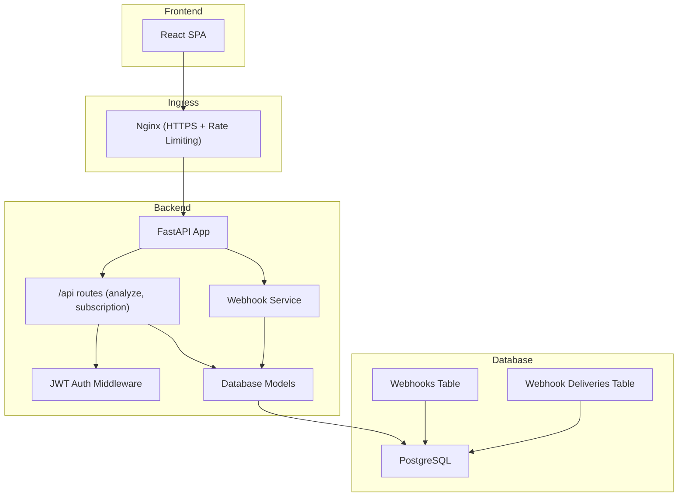
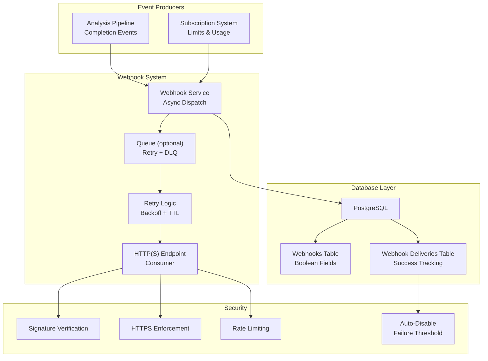
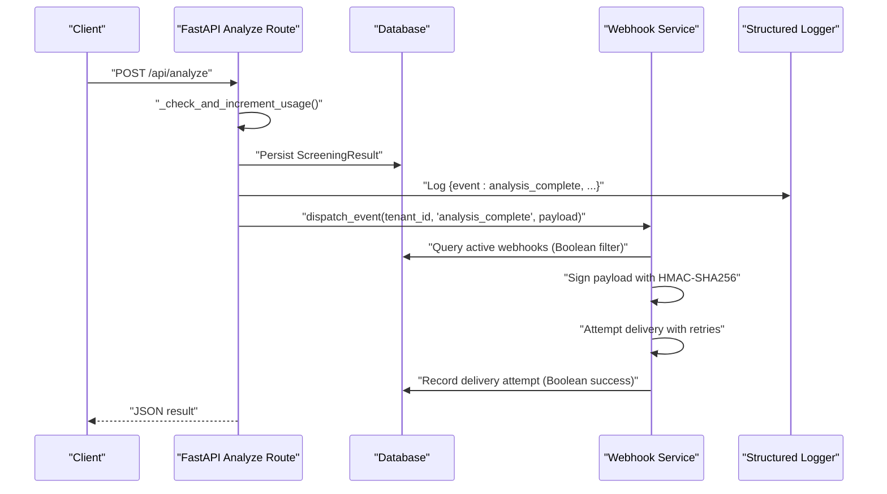
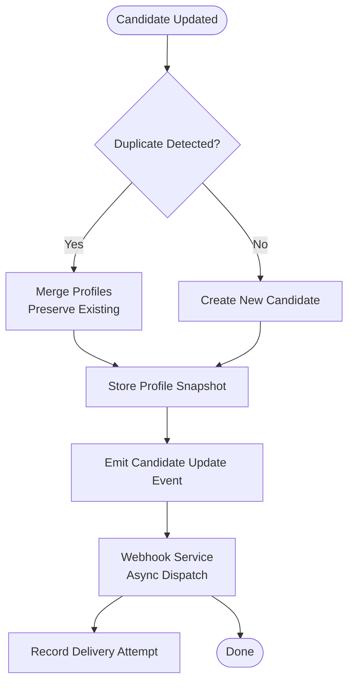
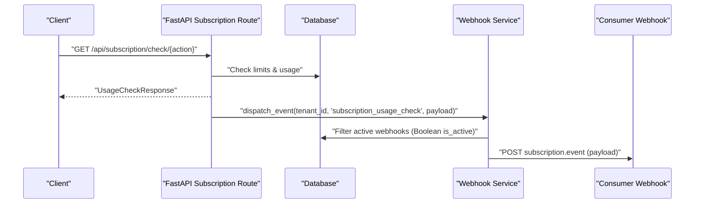
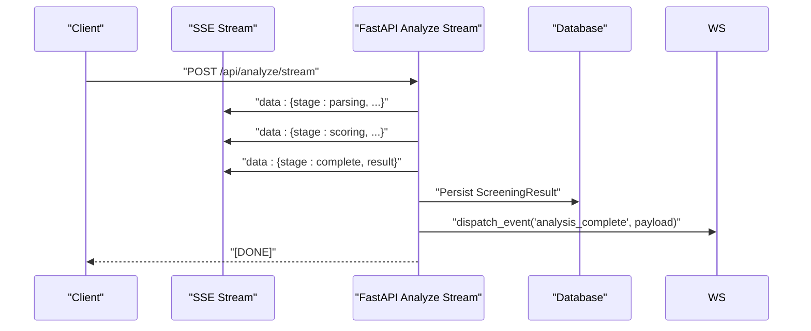
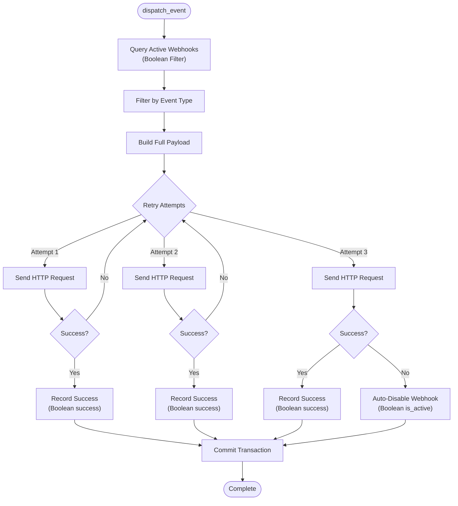
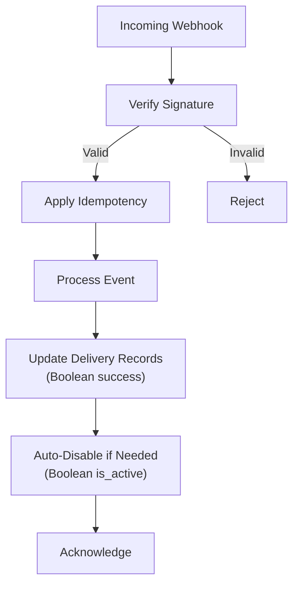
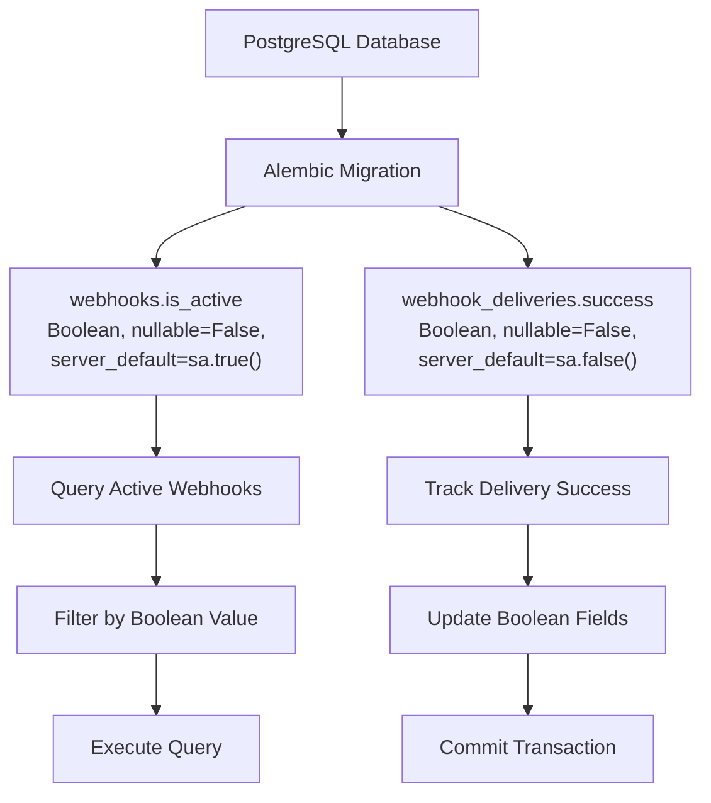
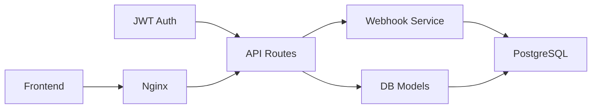

# Webhook Systems

<cite>
**Referenced Files in This Document**
- [main.py](file://app/backend/main.py)
- [analyze.py](file://app/backend/routes/analyze.py)
- [subscription.py](file://app/backend/routes/subscription.py)
- [db_models.py](file://app/backend/models/db_models.py)
- [auth.py](file://app/backend/middleware/auth.py)
- [nginx.prod.conf](file://app/nginx/nginx.prod.conf)
- [api.js](file://app/frontend/src/lib/api.js)
- [useSubscription.jsx](file://app/frontend/src/hooks/useSubscription.jsx)
- [test_subscription.py](file://app/backend/tests/test_subscription.py)
- [run-full-tests.sh](file://scripts/run-full-tests.sh)
- [README.md](file://scripts/README.md)
- [webhook_service.py](file://app/backend/services/webhook_service.py)
- [admin.py](file://app/backend/routes/admin.py)
- [test_webhooks.py](file://app/backend/tests/test_webhooks.py)
- [013_webhooks_and_notifications.py](file://alembic/versions/013_webhooks_and_notifications.py)
- [014_billing_system.py](file://alembic/versions/014_billing_system.py)
</cite>

## Update Summary
**Changes Made**
- Added comprehensive webhook system documentation with PostgreSQL compatibility improvements
- Updated database model documentation to reflect boolean field handling
- Added webhook service implementation details and retry mechanisms
- Enhanced security measures with signature verification and HTTPS enforcement
- Expanded monitoring and debugging sections with delivery tracking
- Updated architecture diagrams to show webhook delivery workflow

## Table of Contents
1. [Introduction](#introduction)
2. [Project Structure](#project-structure)
3. [Core Components](#core-components)
4. [Architecture Overview](#architecture-overview)
5. [Detailed Component Analysis](#detailed-component-analysis)
6. [PostgreSQL Compatibility Enhancements](#postgresql-compatibility-enhancements)
7. [Dependency Analysis](#dependency-analysis)
8. [Performance Considerations](#performance-considerations)
9. [Troubleshooting Guide](#troubleshooting-guide)
10. [Conclusion](#conclusion)
11. [Appendices](#appendices)

## Introduction
This document describes webhook implementation patterns for Resume AI, focusing on event-driven integrations, endpoint configuration, payload structures, delivery reliability, and security. Resume AI now includes a fully functional webhook system with PostgreSQL-compatible boolean handling, providing robust event-driven integrations for analysis completion, candidate updates, and subscription events. The system ensures deployment reliability across different database systems while maintaining security and observability.

## Project Structure
Resume AI is a FastAPI-based backend with Nginx ingress and a React frontend. The webhook system is integrated into the existing architecture with dedicated models, services, and admin endpoints:

- FastAPI app registers routers for analysis, subscription, and webhook administration
- PostgreSQL database stores webhook configurations and delivery records with proper boolean handling
- Nginx enforces HTTPS and rate limiting for all API endpoints
- Frontend integrates with streaming analysis and subscription APIs

**Diagram sources**
- [main.py:174-214](file://app/backend/main.py#L174-L214)
- [nginx.prod.conf:27-101](file://app/nginx/nginx.prod.conf#L27-L101)
- [webhook_service.py:46-112](file://app/backend/services/webhook_service.py#L46-L112)
- [db_models.py:331-364](file://app/backend/models/db_models.py#L331-L364)

**Section sources**
- [main.py:174-214](file://app/backend/main.py#L174-L214)
- [nginx.prod.conf:27-101](file://app/nginx/nginx.prod.conf#L27-L101)
- [webhook_service.py:46-112](file://app/backend/services/webhook_service.py#L46-L112)
- [db_models.py:331-364](file://app/backend/models/db_models.py#L331-L364)

## Core Components
- **Authentication and authorization**: JWT bearer tokens protect routes and enable tenant-scoped usage enforcement
- **Analysis pipeline**: Non-streaming and streaming endpoints for resume analysis, with structured logging upon completion
- **Subscription system**: Usage tracking, limits, and plan-based controls suitable for webhook-triggered billing or notifications
- **Webhook service**: Asynchronous delivery with retry logic, signature verification, and delivery tracking
- **Database models**: Tenant, UsageLog, Webhook, WebhookDelivery entities with PostgreSQL-compatible boolean handling
- **Admin endpoints**: Complete CRUD operations for webhook management and delivery monitoring

Key implementation anchors:
- JWT-based authentication and admin checks
- Usage enforcement and logging for analysis completion
- Subscription usage history and plan limits
- Structured logging for analysis lifecycle events
- Asynchronous webhook dispatch with retry mechanisms
- PostgreSQL-compatible boolean field definitions

**Section sources**
- [auth.py:19-46](file://app/backend/middleware/auth.py#L19-L46)
- [analyze.py:323-351](file://app/backend/routes/analyze.py#L323-L351)
- [subscription.py:427-477](file://app/backend/routes/subscription.py#L427-L477)
- [webhook_service.py:46-112](file://app/backend/services/webhook_service.py#L46-L112)
- [db_models.py:331-364](file://app/backend/models/db_models.py#L331-L364)
- [admin.py:819-893](file://app/backend/routes/admin.py#L819-L893)

## Architecture Overview
The webhook architecture centers on event producers (analysis pipeline and subscription system) and consumers (external systems). The system ensures PostgreSQL compatibility through proper boolean field handling and provides robust delivery guarantees.

**Diagram sources**
- [webhook_service.py:46-112](file://app/backend/services/webhook_service.py#L46-L112)
- [db_models.py:331-364](file://app/backend/models/db_models.py#L331-L364)
- [013_webhooks_and_notifications.py:40-88](file://alembic/versions/013_webhooks_and_notifications.py#L40-L88)

## Detailed Component Analysis

### Analysis Completion Events
The analysis pipeline emits structured logs upon completion. These logs are ideal for webhook payloads describing analysis outcomes with proper PostgreSQL boolean handling.

**Diagram sources**
- [analyze.py:354-501](file://app/backend/routes/analyze.py#L354-L501)
- [webhook_service.py:46-112](file://app/backend/services/webhook_service.py#L46-L112)
- [db_models.py:331-364](file://app/backend/models/db_models.py#L331-L364)

Payload structure for analysis completion:
- event: "analysis_complete"
- tenant_id: integer
- filename: string
- skills_found: integer
- fit_score: number or null
- llm_used: boolean (PostgreSQL-compatible)
- quality: string
- total_ms: integer

Idempotency and retries:
- Use a unique event ID (e.g., result_id) in the payload
- Consumers store received IDs to avoid reprocessing
- Implement exponential backoff and dead-letter queue for failed deliveries

Security:
- Sign payloads with HMAC-SHA256 using a shared secret
- Enforce HTTPS and mutual TLS if possible
- Apply rate limiting at ingress and per-consumer endpoint

Monitoring:
- Track delivery latency, retry counts, and failure reasons
- Maintain a delivery status dashboard

**Section sources**
- [analyze.py:323-351](file://app/backend/routes/analyze.py#L323-L351)
- [webhook_service.py:46-112](file://app/backend/services/webhook_service.py#L46-L112)
- [db_models.py:331-364](file://app/backend/models/db_models.py#L331-L364)

### Candidate Updates
Candidate profiles are updated during analysis. Consumers can subscribe to candidate change events by polling or by emitting candidate update webhooks.

Payload structure for candidate updates:
- event: "candidate_updated"
- candidate_id: integer
- tenant_id: integer
- action: "created" | "updated" | "merged"
- profile: snapshot JSON
- timestamp: ISO string

Idempotency:
- Use candidate_id + action + timestamp as dedup key
- Store last processed event metadata per consumer

**Section sources**
- [analyze.py:147-214](file://app/backend/routes/analyze.py#L147-L214)
- [analyze.py:118-145](file://app/backend/routes/analyze.py#L118-L145)

### Subscription Events
The subscription system tracks usage and plan limits. Webhooks can notify downstream systems about plan changes, usage thresholds, and limits with proper PostgreSQL boolean handling.

Payload structure for subscription events:
- event: "subscription_usage_check" | "subscription_plan_changed"
- tenant_id: integer
- action: string
- allowed: boolean (PostgreSQL-compatible)
- current_usage: integer
- limit: integer
- message: string or null

Idempotency:
- Use a correlation ID in the payload
- Consumers maintain a set of processed correlation IDs

**Section sources**
- [subscription.py:256-343](file://app/backend/routes/subscription.py#L256-L343)
- [subscription.py:394-422](file://app/backend/routes/subscription.py#L394-L422)

### Streaming Analysis and SSE
The streaming endpoint emits stage events and completes with a final result. Consumers can subscribe to SSE streams or receive a webhook upon completion.

Payload structure for SSE stages:
- stage: "parsing" | "scoring" | "complete" | "error"
- result: partial or final analysis JSON

Webhook equivalent:
- Emit a single "analysis_complete" webhook with the final result

**Section sources**
- [analyze.py:506-646](file://app/backend/routes/analyze.py#L506-L646)

### Webhook Service Implementation
The webhook service provides asynchronous delivery with robust retry logic and PostgreSQL-compatible boolean handling.

**Diagram sources**
- [webhook_service.py:46-112](file://app/backend/services/webhook_service.py#L46-L112)
- [db_models.py:331-364](file://app/backend/models/db_models.py#L331-L364)

Key features:
- **Asynchronous processing**: Non-blocking webhook dispatch
- **Exponential backoff**: 1s, 5s, 30s retry delays
- **Automatic disabling**: Webhooks disabled after 10 consecutive failures
- **Delivery tracking**: Comprehensive logging of attempts and responses
- **PostgreSQL compatibility**: Proper boolean field handling in database operations

**Section sources**
- [webhook_service.py:46-112](file://app/backend/services/webhook_service.py#L46-L112)
- [db_models.py:331-364](file://app/backend/models/db_models.py#L331-L364)

### Security Measures
- **Signature verification**: Sign webhook payloads with HMAC-SHA256 using a shared secret. Consumers verify signatures before processing.
- **HTTPS enforcement**: All traffic is served over HTTPS at the ingress layer.
- **Rate limiting**: Nginx applies rate limits to API endpoints; apply per-consumer endpoint limits as well.
- **JWT authentication**: Use bearer tokens for protected routes and administrative endpoints.
- **PostgreSQL security**: Boolean fields properly handled across different database systems.

**Section sources**
- [auth.py:19-46](file://app/backend/middleware/auth.py#L19-L46)
- [nginx.prod.conf:9-10](file://app/nginx/nginx.prod.conf#L9-L10)
- [nginx.prod.conf:28-38](file://app/nginx/nginx.prod.conf#L28-L38)
- [webhook_service.py:18-43](file://app/backend/services/webhook_service.py#L18-L43)

### Queue Management and Retry
Recommended queue and retry strategy:
- Use a managed queue (e.g., Redis Streams, RabbitMQ, or cloud equivalents)
- Implement exponential backoff (1s, 5s, 30s, 5m, 15m) with jitter
- Set a maximum retry window (e.g., 24 hours)
- Move unrecoverable failures to a dead-letter queue for manual inspection
- Maintain delivery receipts and timestamps

**Section sources**
- [webhook_service.py:13-15](file://app/backend/services/webhook_service.py#L13-L15)

### Monitoring and Debugging
- **Logging**: Emit structured logs for all webhook events with correlation IDs
- **Metrics**: Track delivery latency, retry counts, and failure rates
- **Dashboards**: Visualize delivery status and consumer health
- **Debugging**: Enable verbose logging for failed deliveries; inspect signatures and timestamps
- **Delivery tracking**: Monitor webhook delivery attempts and success rates

**Section sources**
- [webhook_service.py:46-112](file://app/backend/services/webhook_service.py#L46-L112)
- [admin.py:896-926](file://app/backend/routes/admin.py#L896-L926)

## PostgreSQL Compatibility Enhancements

### Boolean Field Handling
The webhook system has been enhanced with PostgreSQL-compatible boolean field handling, ensuring reliable operation across different database systems:

- **Webhook.is_active**: Boolean field with proper server default handling
- **WebhookDelivery.success**: Boolean field indicating delivery success/failure
- **Database migration compatibility**: Alembic migrations properly define boolean columns

**Diagram sources**
- [013_webhooks_and_notifications.py:48](file://alembic/versions/013_webhooks_and_notifications.py#L48)
- [013_webhooks_and_notifications.py:76](file://alembic/versions/013_webhooks_and_notifications.py#L76)
- [db_models.py:340](file://app/backend/models/db_models.py#L340)
- [db_models.py:360](file://app/backend/models/db_models.py#L360)

### Migration Improvements
The migration system now properly handles boolean values across different database systems:

- **Consistent defaults**: Boolean fields have explicit server defaults
- **Type safety**: Proper SQLAlchemy boolean type definitions
- **Cross-database compatibility**: Migration scripts work reliably on PostgreSQL, MySQL, and SQLite
- **Index optimization**: Boolean fields properly indexed for filtering

**Section sources**
- [013_webhooks_and_notifications.py:48](file://alembic/versions/013_webhooks_and_notifications.py#L48)
- [013_webhooks_and_notifications.py:76](file://alembic/versions/013_webhooks_and_notifications.py#L76)
- [db_models.py:340](file://app/backend/models/db_models.py#L340)
- [db_models.py:360](file://app/backend/models/db_models.py#L360)

## Dependency Analysis
The webhook system relies on:
- JWT authentication for route protection
- PostgreSQL database with proper boolean field handling
- Database models for usage tracking and auditability
- Nginx for HTTPS and rate limiting
- Frontend integration for streaming and subscription UI

**Diagram sources**
- [auth.py:19-46](file://app/backend/middleware/auth.py#L19-L46)
- [db_models.py:331-364](file://app/backend/models/db_models.py#L331-L364)
- [webhook_service.py:46-112](file://app/backend/services/webhook_service.py#L46-L112)
- [nginx.prod.conf:27-101](file://app/nginx/nginx.prod.conf#L27-L101)

**Section sources**
- [auth.py:19-46](file://app/backend/middleware/auth.py#L19-L46)
- [db_models.py:331-364](file://app/backend/models/db_models.py#L331-L364)
- [webhook_service.py:46-112](file://app/backend/services/webhook_service.py#L46-L112)
- [nginx.prod.conf:27-101](file://app/nginx/nginx.prod.conf#L27-L101)

## Performance Considerations
- Use asynchronous processing for webhook consumers to avoid blocking
- Batch small events to reduce overhead
- Tune queue backpressure and consumer concurrency
- Apply circuit breakers to prevent cascading failures
- Optimize PostgreSQL boolean field queries with proper indexing
- Monitor webhook delivery performance and adjust retry strategies

## Troubleshooting Guide
Common issues and resolutions:
- **Signature verification failures**: Ensure shared secrets match and signatures are computed over canonicalized payloads
- **Rate limiting**: Reduce request volume or increase limits; monitor per-consumer quotas
- **Delivery timeouts**: Increase consumer timeouts and implement retry with backoff
- **Duplicate processing**: Enforce idempotency using unique event IDs and deduplication keys
- **PostgreSQL boolean issues**: Verify boolean field defaults and server-side constraints
- **Webhook auto-disabling**: Check failure thresholds and delivery logs

**Section sources**
- [nginx.prod.conf:9-10](file://app/nginx/nginx.prod.conf#L9-L10)
- [webhook_service.py:107-109](file://app/backend/services/webhook_service.py#L107-L109)

## Conclusion
Resume AI provides a comprehensive webhook-based integration platform with enhanced PostgreSQL compatibility. The system offers secure, reliable, and observable webhook workflows through proper boolean field handling, robust retry mechanisms, and comprehensive delivery tracking. The recommended patterns—signature verification, HTTPS enforcement, rate limiting, idempotent processing, and robust retry—ensure resilient integrations that scale with the platform while maintaining deployment reliability across different database systems.

## Appendices

### Appendix A: Endpoint Reference
- POST /api/analyze: Non-streaming analysis; emits completion event
- POST /api/analyze/stream: Streaming analysis; emits stage events
- GET /api/subscription: Subscription details and usage
- GET /api/subscription/check/{action}: Usage check for actions (e.g., resume_analysis)
- GET /api/subscription/usage-history: Recent usage logs
- GET /api/admin/tenants/{tenant_id}/webhooks: List tenant webhooks
- POST /api/admin/tenants/{tenant_id}/webhooks: Create webhook
- DELETE /api/admin/tenants/{tenant_id}/webhooks/{webhook_id}: Delete webhook
- GET /api/admin/tenants/{tenant_id}/webhooks/{webhook_id}/deliveries: View delivery history

**Section sources**
- [analyze.py:354-501](file://app/backend/routes/analyze.py#L354-L501)
- [analyze.py:506-646](file://app/backend/routes/analyze.py#L506-L646)
- [subscription.py:172-253](file://app/backend/routes/subscription.py#L172-L253)
- [subscription.py:256-343](file://app/backend/routes/subscription.py#L256-L343)
- [subscription.py:346-367](file://app/backend/routes/subscription.py#L346-L367)
- [admin.py:819-893](file://app/backend/routes/admin.py#L819-L893)
- [admin.py:896-926](file://app/backend/routes/admin.py#L896-L926)

### Appendix B: Payload Examples
- Analysis completion event:
  - event: "analysis_complete"
  - tenant_id: integer
  - filename: string
  - skills_found: integer
  - fit_score: number or null
  - llm_used: boolean (PostgreSQL-compatible)
  - quality: string
  - total_ms: integer

- Candidate update event:
  - event: "candidate_updated"
  - candidate_id: integer
  - tenant_id: integer
  - action: "created" | "updated" | "merged"
  - profile: snapshot JSON
  - timestamp: ISO string

- Subscription usage check event:
  - event: "subscription_usage_check"
  - tenant_id: integer
  - action: string
  - allowed: boolean (PostgreSQL-compatible)
  - current_usage: integer
  - limit: integer
  - message: string or null

**Section sources**
- [analyze.py:491-500](file://app/backend/routes/analyze.py#L491-L500)
- [analyze.py:147-214](file://app/backend/routes/analyze.py#L147-L214)
- [subscription.py:256-343](file://app/backend/routes/subscription.py#L256-L343)

### Appendix C: Testing and Validation
- Backend route registration tests confirm subscription and analyze routes are present
- Subscription tests validate usage history and plan retrieval
- Webhook tests validate service layer functionality and admin endpoints
- Frontend integration tests ensure API endpoints are reachable

**Section sources**
- [run-full-tests.sh:137-168](file://scripts/run-full-tests.sh#L137-L168)
- [test_subscription.py:15-47](file://app/backend/tests/test_subscription.py#L15-L47)
- [test_webhooks.py:109-142](file://app/backend/tests/test_webhooks.py#L109-L142)
- [README.md:82-91](file://scripts/README.md#L82-L91)

### Appendix D: Database Schema Details
- **Webhooks table**: Stores webhook configurations with PostgreSQL-compatible boolean fields
- **Webhook deliveries table**: Tracks delivery attempts with success indicators
- **Migration compatibility**: Proper boolean field definitions for cross-database deployment

**Section sources**
- [013_webhooks_and_notifications.py:40-88](file://alembic/versions/013_webhooks_and_notifications.py#L40-L88)
- [db_models.py:331-364](file://app/backend/models/db_models.py#L331-L364)