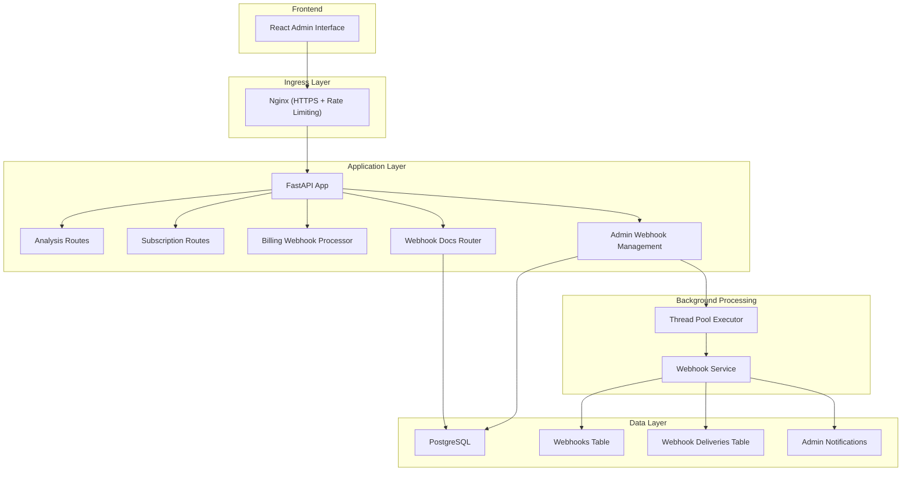
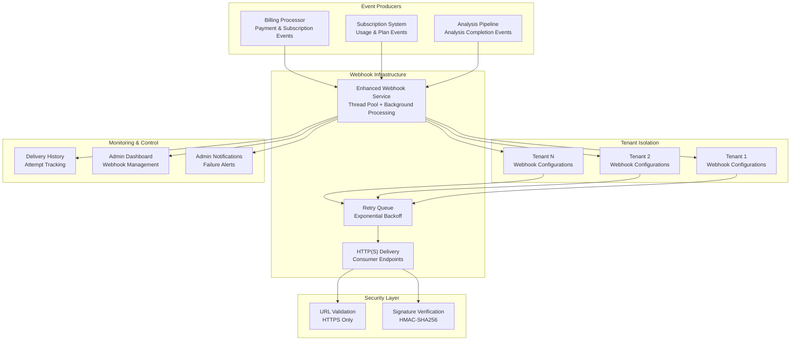
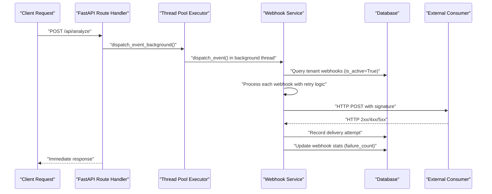
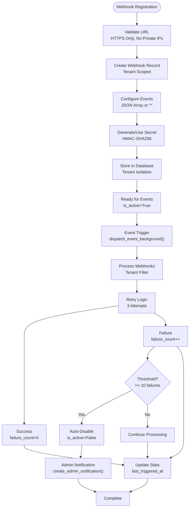
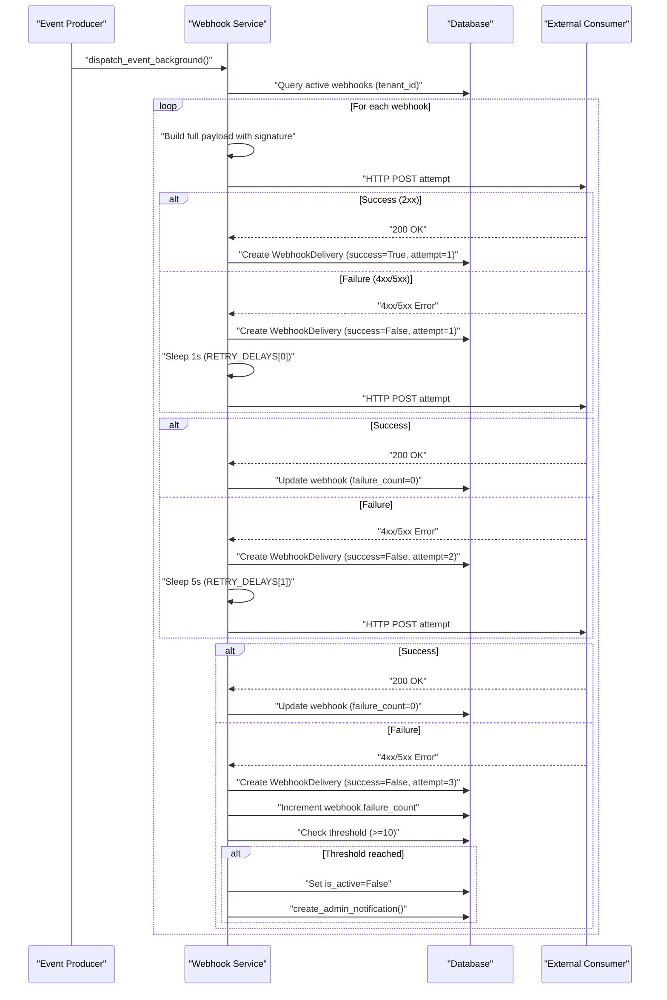
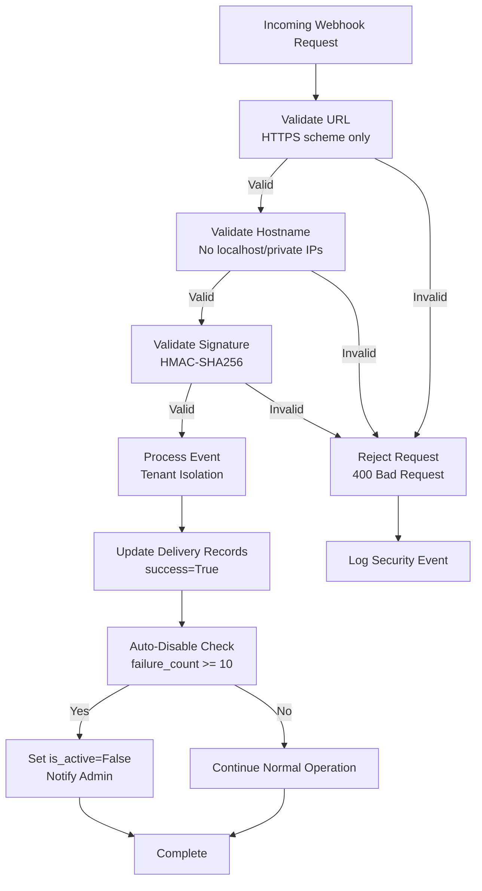

# Webhook Systems

<cite>
**Referenced Files in This Document**
- [main.py](file://app/backend/main.py)
- [analyze.py](file://app/backend/routes/analyze.py)
- [subscription.py](file://app/backend/routes/subscription.py)
- [db_models.py](file://app/backend/models/db_models.py)
- [auth.py](file://app/backend/middleware/auth.py)
- [nginx.prod.conf](file://app/nginx/nginx.prod.conf)
- [api.js](file://app/frontend/src/lib/api.js)
- [useSubscription.jsx](file://app/frontend/src/hooks/useSubscription.jsx)
- [test_subscription.py](file://app/backend/tests/test_subscription.py)
- [run-full-tests.sh](file://scripts/run-full-tests.sh)
- [README.md](file://scripts/README.md)
- [webhook_service.py](file://app/backend/services/webhook_service.py)
- [admin.py](file://app/backend/routes/admin.py)
- [test_webhooks.py](file://app/backend/tests/test_webhooks.py)
- [013_webhooks_and_notifications.py](file://alembic/versions/013_webhooks_and_notifications.py)
- [014_billing_system.py](file://alembic/versions/014_billing_system.py)
- [webhook_docs.py](file://app/backend/routes/webhook_docs.py)
- [notification_service.py](file://app/backend/services/notification_service.py)
- [billing/webhook_processor.py](file://app/backend/services/billing/webhook_processor.py)
</cite>

## Update Summary
**Changes Made**
- Enhanced webhook systems with comprehensive background processing and thread pool execution
- Added webhook registry management with tenant isolation and event-driven integration
- Implemented delivery history tracking with comprehensive retry logic and auto-disable mechanisms
- Integrated webhook event registry for self-documenting webhook integrations
- Added webhook URL validation and security measures including signature verification
- Enhanced admin endpoints for webhook CRUD operations and delivery monitoring
- Integrated billing webhook processing with subscription change notifications

## Table of Contents
1. [Introduction](#introduction)
2. [Project Structure](#project-structure)
3. [Core Components](#core-components)
4. [Architecture Overview](#architecture-overview)
5. [Detailed Component Analysis](#detailed-component-analysis)
6. [Enhanced Background Processing](#enhanced-background-processing)
7. [Webhook Registry Management](#webhook-registry-management)
8. [Delivery History and Monitoring](#delivery-history-and-monitoring)
9. [Security and Validation](#security-and-validation)
10. [Event-Driven Integration Patterns](#event-driven-integration-patterns)
11. [Admin Management Interface](#admin-management-interface)
12. [Testing and Validation](#testing-and-validation)
13. [Performance Considerations](#performance-considerations)
14. [Troubleshooting Guide](#troubleshooting-guide)
15. [Conclusion](#conclusion)
16. [Appendices](#appendices)

## Introduction
This document describes the enhanced webhook implementation patterns for Resume AI, focusing on comprehensive event-driven integrations, background processing, tenant isolation, and robust delivery mechanisms. Resume AI now features a fully enhanced webhook system with PostgreSQL-compatible boolean handling, comprehensive retry logic, delivery history tracking, and tenant-scoped webhook registry management. The system provides reliable event-driven integrations for analysis completion, candidate updates, subscription events, and billing webhook processing with automatic failure detection and recovery.

## Project Structure
Resume AI is a FastAPI-based backend with Nginx ingress and a React frontend. The enhanced webhook system is integrated with comprehensive background processing, tenant isolation, and administrative management interfaces:

- FastAPI app with enhanced webhook service supporting background processing
- PostgreSQL database with tenant-scoped webhook configurations and delivery tracking
- Thread pool executor for non-blocking webhook dispatch
- Webhook event registry for self-documenting integrations
- Administrative endpoints for webhook management and monitoring
- Frontend integration with webhook management interface

**Diagram sources**
- [main.py:174-214](file://app/backend/main.py#L174-L214)
- [nginx.prod.conf:27-101](file://app/nginx/nginx.prod.conf#L27-L101)
- [webhook_service.py:134-158](file://app/backend/services/webhook_service.py#L134-L158)
- [db_models.py:491-524](file://app/backend/models/db_models.py#L491-L524)
- [webhook_docs.py:10-94](file://app/backend/routes/webhook_docs.py#L10-L94)
- [admin.py:1556-1679](file://app/backend/routes/admin.py#L1556-L1679)

**Section sources**
- [main.py:174-214](file://app/backend/main.py#L174-L214)
- [nginx.prod.conf:27-101](file://app/nginx/nginx.prod.conf#L27-L101)
- [webhook_service.py:134-158](file://app/backend/services/webhook_service.py#L134-L158)
- [db_models.py:491-524](file://app/backend/models/db_models.py#L491-L524)
- [webhook_docs.py:10-94](file://app/backend/routes/webhook_docs.py#L10-L94)
- [admin.py:1556-1679](file://app/backend/routes/admin.py#L1556-L1679)

## Core Components
- **Enhanced Webhook Service**: Thread pool executor-based background processing with comprehensive retry logic and delivery tracking
- **Tenant Isolation**: Webhook configurations and delivery history scoped to individual tenants for security and separation
- **Webhook Registry**: Self-documenting event registry with example payloads and signing information
- **Administrative Management**: Complete CRUD operations for webhook management with delivery monitoring and tenant scoping
- **Background Processing**: Non-blocking webhook dispatch using ThreadPoolExecutor for improved performance
- **Delivery Tracking**: Comprehensive logging of delivery attempts, success/failure states, and retry mechanisms
- **Auto-Disable Mechanism**: Automatic webhook deactivation after configurable failure thresholds
- **Security Features**: URL validation, signature verification, and HTTPS enforcement

Key implementation anchors:
- Thread pool executor with configurable worker count for background processing
- Tenant-scoped webhook queries and delivery tracking
- Comprehensive retry logic with exponential backoff delays
- Webhook URL validation preventing localhost and private IP usage
- HMAC-SHA256 signature verification for payload integrity
- Administrative endpoints with platform admin authorization
- Delivery history with attempt tracking and success indicators

**Section sources**
- [webhook_service.py:134-158](file://app/backend/services/webhook_service.py#L134-L158)
- [webhook_service.py:49-131](file://app/backend/services/webhook_service.py#L49-L131)
- [webhook_service.py:160-186](file://app/backend/services/webhook_service.py#L160-L186)
- [db_models.py:491-524](file://app/backend/models/db_models.py#L491-L524)
- [webhook_docs.py:12-93](file://app/backend/routes/webhook_docs.py#L12-L93)
- [admin.py:1556-1679](file://app/backend/routes/admin.py#L1556-L1679)

## Architecture Overview
The enhanced webhook architecture provides comprehensive background processing, tenant isolation, and robust delivery mechanisms with automatic failure recovery and monitoring capabilities.

**Diagram sources**
- [webhook_service.py:49-131](file://app/backend/services/webhook_service.py#L49-L131)
- [webhook_service.py:134-158](file://app/backend/services/webhook_service.py#L134-L158)
- [db_models.py:491-524](file://app/backend/models/db_models.py#L491-L524)
- [admin.py:1556-1679](file://app/backend/routes/admin.py#L1556-L1679)
- [notification_service.py:23-62](file://app/backend/services/notification_service.py#L23-L62)

## Detailed Component Analysis

### Enhanced Background Processing
The webhook system now utilizes a thread pool executor for non-blocking background processing, significantly improving performance and scalability.

**Diagram sources**
- [webhook_service.py:137-158](file://app/backend/services/webhook_service.py#L137-L158)
- [webhook_service.py:49-131](file://app/backend/services/webhook_service.py#L49-L131)

Key enhancements:
- **Thread Pool Executor**: Configurable worker count (4) for concurrent webhook processing
- **Non-blocking Dispatch**: Immediate response to client requests while background processing occurs
- **Background Session Management**: Each thread creates its own database session for thread safety
- **Error Isolation**: Exceptions in background threads don't affect main request processing

**Section sources**
- [webhook_service.py:134-158](file://app/backend/services/webhook_service.py#L134-L158)
- [webhook_service.py:146-158](file://app/backend/services/webhook_service.py#L146-L158)

### Webhook Registry Management
The system provides comprehensive webhook registry management with tenant isolation and event-driven integration capabilities.

**Diagram sources**
- [admin.py:1585-1646](file://app/backend/routes/admin.py#L1585-L1646)
- [webhook_service.py:49-131](file://app/backend/services/webhook_service.py#L49-L131)
- [notification_service.py:23-62](file://app/backend/services/notification_service.py#L23-L62)

**Section sources**
- [admin.py:1556-1679](file://app/backend/routes/admin.py#L1556-L1679)
- [webhook_service.py:49-131](file://app/backend/services/webhook_service.py#L49-L131)
- [notification_service.py:23-62](file://app/backend/services/notification_service.py#L23-L62)

### Delivery History and Monitoring
Comprehensive delivery tracking provides detailed insights into webhook delivery performance and troubleshooting capabilities.

**Diagram sources**
- [webhook_service.py:83-131](file://app/backend/services/webhook_service.py#L83-L131)
- [db_models.py:510-524](file://app/backend/models/db_models.py#L510-L524)

**Section sources**
- [webhook_service.py:83-131](file://app/backend/services/webhook_service.py#L83-L131)
- [db_models.py:510-524](file://app/backend/models/db_models.py#L510-L524)

### Security and Validation
Enhanced security measures ensure webhook delivery integrity and prevent unauthorized access to webhook endpoints.

**Diagram sources**
- [webhook_service.py:160-186](file://app/backend/services/webhook_service.py#L160-L186)
- [webhook_service.py:21-23](file://app/backend/services/webhook_service.py#L21-L23)

**Section sources**
- [webhook_service.py:160-186](file://app/backend/services/webhook_service.py#L160-L186)
- [webhook_service.py:21-23](file://app/backend/services/webhook_service.py#L21-L23)

### Event-Driven Integration Patterns
The system supports comprehensive event-driven integration patterns with flexible event subscription and tenant isolation.

**Section sources**
- [webhook_docs.py:12-93](file://app/backend/routes/webhook_docs.py#L12-L93)
- [billing/webhook_processor.py:97-111](file://app/backend/services/billing/webhook_processor.py#L97-L111)

## Enhanced Background Processing

### Thread Pool Executor Configuration
The webhook service utilizes a ThreadPoolExecutor for non-blocking background processing with configurable worker capacity.

Key features:
- **Worker Count**: 4 concurrent workers for balanced performance
- **Thread Naming**: "webhook" prefix for easy identification
- **Background Dispatch**: `dispatch_event_background()` enables fire-and-forget processing
- **Session Management**: Each thread creates its own database session for thread safety

**Section sources**
- [webhook_service.py:134-158](file://app/backend/services/webhook_service.py#L134-L158)
- [webhook_service.py:146-158](file://app/backend/services/webhook_service.py#L146-L158)

### Retry Logic and Exponential Backoff
Comprehensive retry mechanism with exponential backoff ensures reliable delivery even under transient failures.

Retry configuration:
- **Maximum Retries**: 3 attempts per webhook delivery
- **Backoff Delays**: 1s, 5s, 30s between retry attempts
- **Failure Threshold**: Auto-disable after 10 consecutive failures
- **Attempt Tracking**: Detailed logging of each delivery attempt

**Section sources**
- [webhook_service.py:16-18](file://app/backend/services/webhook_service.py#L16-L18)
- [webhook_service.py:83-109](file://app/backend/services/webhook_service.py#L83-L109)

## Webhook Registry Management

### Tenant Isolation
Webhook configurations are strictly isolated to individual tenants for security and separation of concerns.

Tenant scoping features:
- **Foreign Key Relationships**: Webhooks linked to tenants via `tenant_id` foreign key
- **Tenant Queries**: All webhook operations filtered by tenant context
- **Isolated Delivery History**: Delivery records scoped to specific tenant webhooks
- **Administrative Access**: Platform admin authorization required for webhook management

**Section sources**
- [db_models.py:491-507](file://app/backend/models/db_models.py#L491-L507)
- [admin.py:1556-1679](file://app/backend/routes/admin.py#L1556-L1679)

### Event Subscription Management
Flexible event subscription system allows granular control over webhook event delivery.

Event configuration:
- **Wildcard Support**: `"*"` subscribes to all events
- **JSON Array Format**: Events stored as JSON arrays in database
- **Event Filtering**: Webhooks only receive subscribed event types
- **Dynamic Updates**: Events array can be modified without recreating webhooks

**Section sources**
- [webhook_service.py:62-69](file://app/backend/services/webhook_service.py#L62-L69)
- [db_models.py:499](file://app/backend/models/db_models.py#L499)

## Delivery History and Monitoring

### Comprehensive Delivery Tracking
Every webhook delivery attempt is recorded with detailed information for monitoring and troubleshooting.

Delivery record fields:
- **Event Type**: Specific event being delivered
- **Response Status**: HTTP status code received
- **Response Body**: First 1000 characters of response
- **Success Indicator**: Boolean success/failure flag
- **Attempt Number**: Which retry attempt this represents
- **Timestamps**: Creation time and attempt timing

**Section sources**
- [db_models.py:510-524](file://app/backend/models/db_models.py#L510-L524)
- [webhook_service.py:88-96](file://app/backend/services/webhook_service.py#L88-L96)

### Auto-Disable Mechanism
Robust failure detection prevents continued delivery attempts to non-responsive endpoints.

Auto-disable criteria:
- **Failure Threshold**: 10 consecutive failed attempts
- **Automatic Suspension**: Webhook marked inactive (`is_active=False`)
- **Administrative Notification**: Critical severity notification sent to admins
- **Manual Recovery**: Webhook can be manually re-enabled after resolution

**Section sources**
- [webhook_service.py:110-131](file://app/backend/services/webhook_service.py#L110-L131)
- [notification_service.py:23-62](file://app/backend/services/notification_service.py#L23-L62)

## Security and Validation

### URL Validation
Strict URL validation prevents security vulnerabilities and ensures proper delivery endpoints.

Validation rules:
- **Scheme Enforcement**: Only HTTPS URLs permitted
- **Hostname Restrictions**: Blocks localhost, 127.0.0.1, ::1, 0.0.0.0
- **Private IP Blocking**: Prevents access to private network ranges
- **Reserved IP Blocking**: Blocks reserved and special-purpose addresses

**Section sources**
- [webhook_service.py:160-186](file://app/backend/services/webhook_service.py#L160-L186)

### Signature Verification
HMAC-SHA256 signature verification ensures payload integrity and authenticates webhook sources.

Signature implementation:
- **Header Format**: `X-Webhook-Signature: sha256=<digest>`
- **Digest Calculation**: SHA256 of raw JSON payload using webhook secret
- **Verification Process**: Recompute digest and compare with received signature
- **Security Headers**: Standardized header format for consumer compatibility

**Section sources**
- [webhook_service.py:21-23](file://app/backend/services/webhook_service.py#L21-L23)
- [webhook_docs.py:76-84](file://app/backend/routes/webhook_docs.py#L76-L84)

## Event-Driven Integration Patterns

### Webhook Event Registry
Self-documenting event registry provides comprehensive information about available webhook events for integrators.

Registry features:
- **Event Descriptions**: Clear explanations of each event type
- **Example Payloads**: Representative JSON examples for each event
- **Signing Information**: HMAC-SHA256 signature details and header format
- **Public Endpoint**: `/api/webhooks/events` accessible without authentication

**Section sources**
- [webhook_docs.py:12-93](file://app/backend/routes/webhook_docs.py#L12-L93)

### Billing Webhook Integration
Seamless integration with billing system provides subscription change notifications and payment status updates.

Integration patterns:
- **Subscription Changes**: Automatic firing of `subscription.changed` events
- **Payment Status**: Real-time updates for payment approval/rejection
- **Dunning Events**: Automated notifications for payment retry processes
- **Tenant Context**: All billing events include tenant identification

**Section sources**
- [billing/webhook_processor.py:97-111](file://app/backend/services/billing/webhook_processor.py#L97-L111)

## Admin Management Interface

### Comprehensive CRUD Operations
Administrative endpoints provide complete webhook management capabilities with tenant scoping and security controls.

Management features:
- **Create Webhooks**: Configure URL, secret, and event subscriptions
- **List Webhooks**: View all tenant webhooks with status and statistics
- **Delete Webhooks**: Remove webhook configurations when no longer needed
- **Delivery History**: Monitor delivery attempts and success rates
- **Platform Admin Only**: Strict authorization requirements for management access

**Section sources**
- [admin.py:1556-1679](file://app/backend/routes/admin.py#L1556-L1679)

### Delivery Monitoring Dashboard
Administrative interface provides comprehensive monitoring of webhook delivery performance and troubleshooting capabilities.

Monitoring capabilities:
- **Delivery Statistics**: Success/failure rates and retry patterns
- **Webhook Status**: Active/inactive state and failure counts
- **Recent Activity**: Latest delivery attempts and timestamps
- **Failure Analysis**: Trend analysis for webhook reliability

**Section sources**
- [admin.py:1649-1679](file://app/backend/routes/admin.py#L1649-L1679)

## Testing and Validation

### Comprehensive Test Coverage
Extensive test suite validates webhook functionality, background processing, and administrative operations.

Test categories:
- **Service Layer Tests**: Core webhook dispatch and retry logic validation
- **Admin Endpoint Tests**: CRUD operations and authorization testing
- **Background Processing**: Thread pool execution and session management
- **Delivery Tracking**: History recording and statistics maintenance
- **Auto-Disable Functionality**: Failure threshold and notification validation

**Section sources**
- [test_webhooks.py:109-142](file://app/backend/tests/test_webhooks.py#L109-L142)
- [test_webhooks.py:146-198](file://app/backend/tests/test_webhooks.py#L146-L198)
- [test_webhooks.py:202-339](file://app/backend/tests/test_webhooks.py#L202-L339)

### Database Migration Validation
Alembic migrations ensure consistent webhook database schema across environments with proper PostgreSQL compatibility.

Migration features:
- **Webhooks Table**: Tenant-scoped webhook configurations with boolean fields
- **Webhook Deliveries Table**: Delivery attempt history with success tracking
- **Index Optimization**: Proper indexing for tenant and webhook queries
- **Server Defaults**: Consistent boolean field defaults across database systems

**Section sources**
- [013_webhooks_and_notifications.py:40-88](file://alembic/versions/013_webhooks_and_notifications.py#L40-L88)

## Performance Considerations
- **Thread Pool Sizing**: Configurable worker count balances throughput and resource usage
- **Background Processing**: Non-blocking dispatch prevents request timeouts
- **Database Connection Management**: Per-thread sessions prevent connection conflicts
- **Retry Optimization**: Exponential backoff reduces load on failing endpoints
- **Delivery History**: Efficient indexing on webhook_id and created_at for monitoring queries
- **Memory Management**: Automatic cleanup of background thread resources

## Troubleshooting Guide
Common issues and resolutions:
- **Background Processing Failures**: Check thread pool executor configuration and worker availability
- **Delivery History Missing**: Verify database connectivity and webhook delivery creation
- **Auto-Disable Issues**: Review failure thresholds and admin notification configuration
- **Signature Verification Failures**: Ensure consistent payload formatting and secret synchronization
- **URL Validation Errors**: Confirm HTTPS scheme and non-private hostname configuration
- **Tenant Isolation Problems**: Verify tenant_id filtering and administrative access permissions

**Section sources**
- [webhook_service.py:154-157](file://app/backend/services/webhook_service.py#L154-L157)
- [admin.py:1615-1621](file://app/backend/routes/admin.py#L1615-L1621)

## Conclusion
Resume AI provides a comprehensive, enterprise-grade webhook system with enhanced background processing, tenant isolation, and robust delivery mechanisms. The system offers secure, reliable, and observable webhook workflows through thread pool execution, comprehensive retry logic, delivery history tracking, and administrative management interfaces. The enhanced patterns—background processing with thread pools, tenant-scoped webhook registries, auto-disable mechanisms, signature verification, and comprehensive monitoring—ensure resilient integrations that scale with the platform while maintaining security and operational visibility across all tenant environments.

## Appendices

### Appendix A: Enhanced Endpoint Reference
- **POST /api/webhooks/events**: Public webhook event registry with descriptions and examples
- **GET /api/admin/tenants/{tenant_id}/webhooks**: List tenant webhooks with status and statistics
- **POST /api/admin/tenants/{tenant_id}/webhooks**: Create webhook with URL validation and secret generation
- **DELETE /api/admin/tenants/{tenant_id}/webhooks/{webhook_id}**: Delete webhook configuration
- **GET /api/admin/tenants/{tenant_id}/webhooks/{webhook_id}/deliveries**: View delivery history with attempt details

**Section sources**
- [webhook_docs.py:87-93](file://app/backend/routes/webhook_docs.py#L87-L93)
- [admin.py:1556-1679](file://app/backend/routes/admin.py#L1556-L1679)

### Appendix B: Enhanced Payload Examples
- **Analysis completion event**:
  - event: "analysis_complete"
  - timestamp: ISO format UTC timestamp
  - tenant_id: integer
  - data: analysis result payload

- **Subscription changed event**:
  - event: "subscription.changed"
  - timestamp: ISO format UTC timestamp
  - tenant_id: integer
  - data: { "subscription_status": string, "changed_at": ISO timestamp }

- **Webhook delivery record**:
  - id: integer
  - event: string
  - response_status: integer or null
  - success: boolean
  - attempt: integer
  - created_at: ISO format timestamp

**Section sources**
- [webhook_service.py:72-77](file://app/backend/services/webhook_service.py#L72-L77)
- [webhook_docs.py:14-73](file://app/backend/routes/webhook_docs.py#L14-L73)
- [db_models.py:514-522](file://app/backend/models/db_models.py#L514-L522)

### Appendix C: Enhanced Configuration Parameters
- **Thread Pool**: max_workers=4, thread_name_prefix="webhook"
- **Retry Logic**: MAX_RETRIES=3, RETRY_DELAYS=[1, 5, 30], MAX_FAILURE_COUNT=10
- **URL Validation**: HTTPS only, blocks localhost and private IPs
- **Signature Algorithm**: HMAC-SHA256 with X-Webhook-Signature header
- **Database Defaults**: Boolean fields with server_default values for PostgreSQL compatibility

**Section sources**
- [webhook_service.py:134](file://app/backend/services/webhook_service.py#L134)
- [webhook_service.py:16-18](file://app/backend/services/webhook_service.py#L16-L18)
- [webhook_service.py:160-186](file://app/backend/services/webhook_service.py#L160-L186)
- [013_webhooks_and_notifications.py:47-53](file://alembic/versions/013_webhooks_and_notifications.py#L47-L53)

### Appendix D: Database Schema Details
- **Webhooks table**: Tenant-scoped webhook configurations with boolean fields and event subscriptions
- **Webhook deliveries table**: Comprehensive delivery history with success tracking and attempt numbering
- **Admin notifications table**: Critical alerts for webhook auto-disable and system events
- **Migration compatibility**: Proper boolean field definitions and server defaults for cross-database deployment

**Section sources**
- [013_webhooks_and_notifications.py:40-88](file://alembic/versions/013_webhooks_and_notifications.py#L40-L88)
- [db_models.py:491-524](file://app/backend/models/db_models.py#L491-L524)
- [notification_service.py:23-62](file://app/backend/services/notification_service.py#L23-L62)