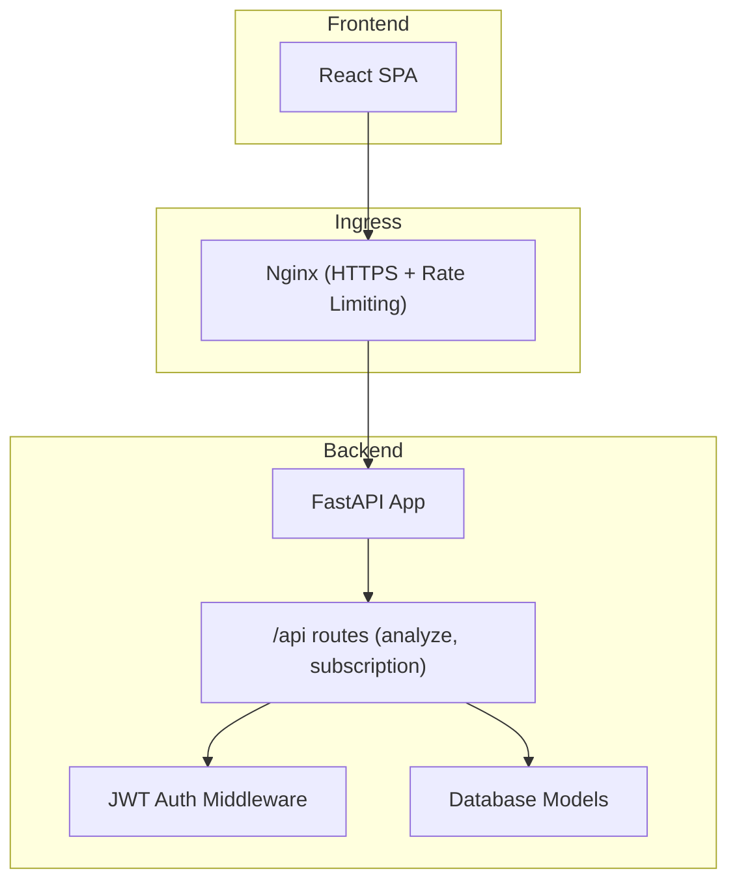
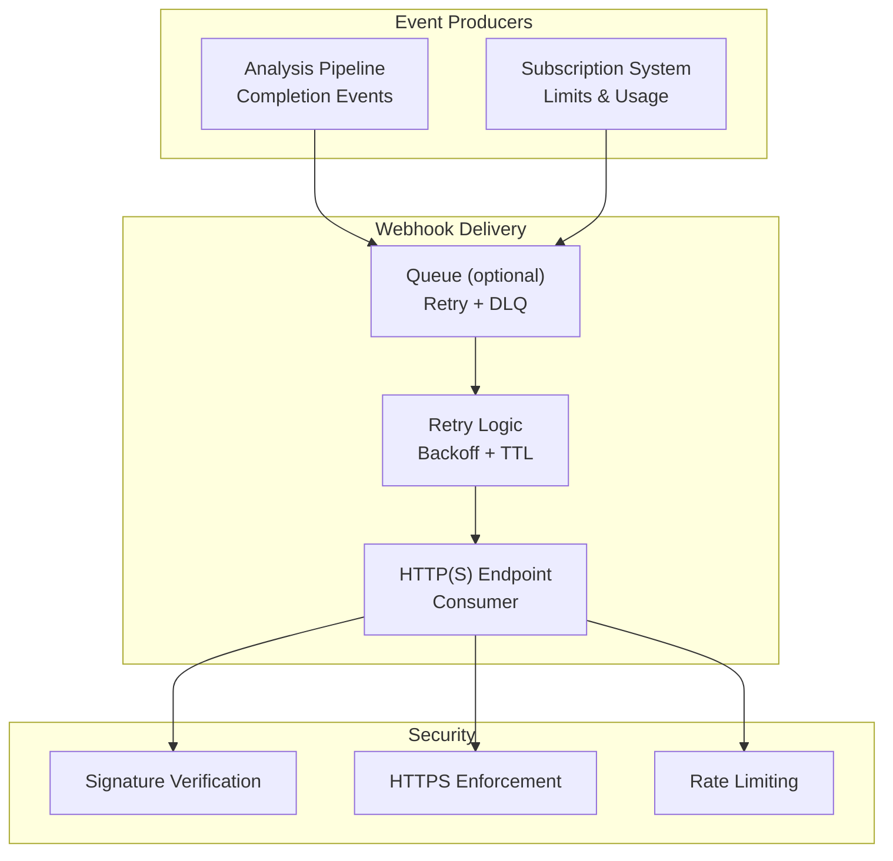
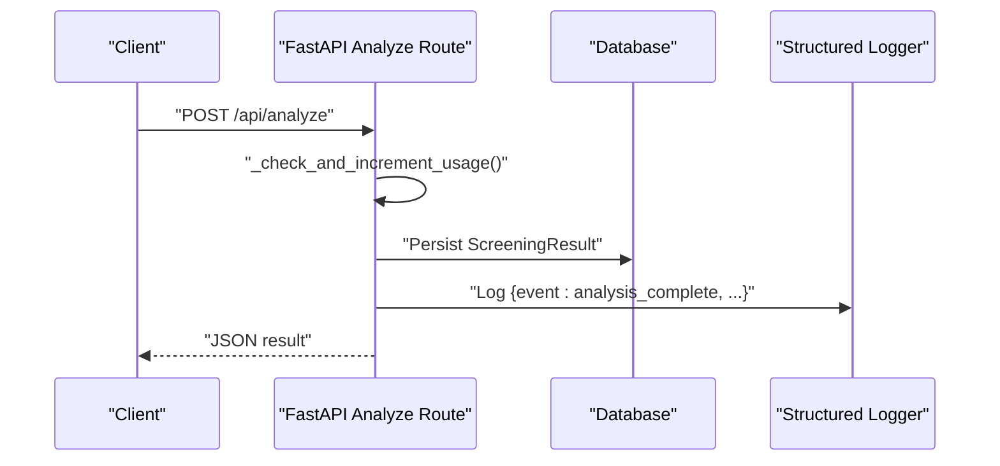
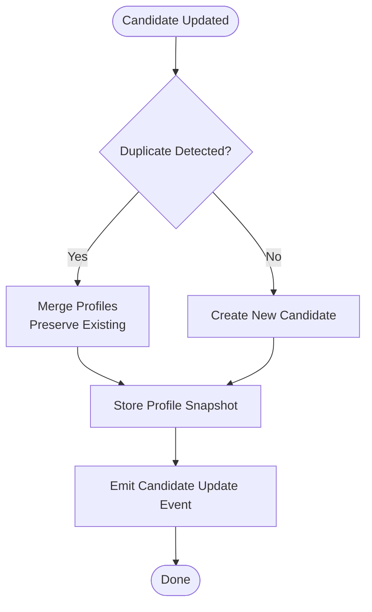
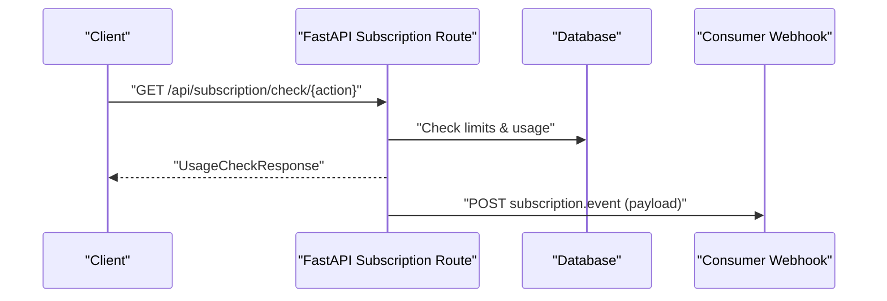
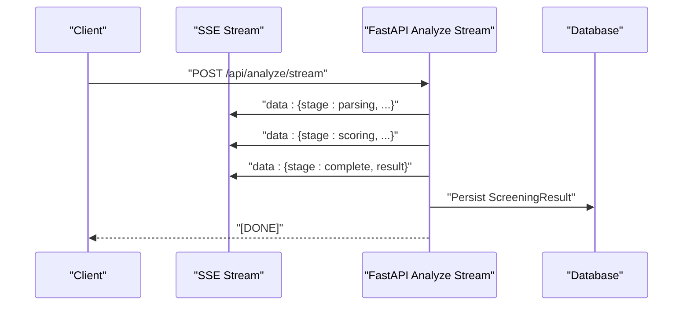
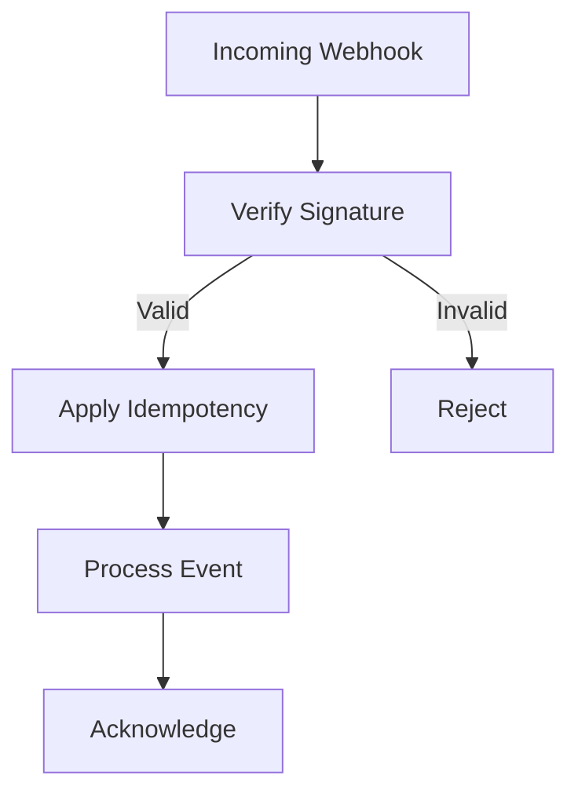
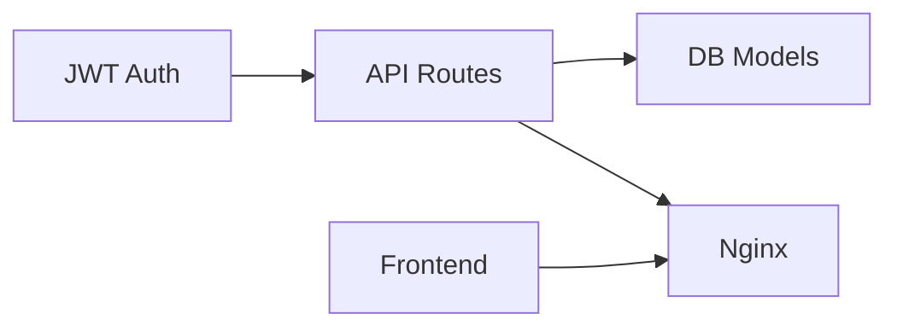

# Webhook Systems

<cite>
**Referenced Files in This Document**
- [main.py](file://app/backend/main.py)
- [analyze.py](file://app/backend/routes/analyze.py)
- [subscription.py](file://app/backend/routes/subscription.py)
- [db_models.py](file://app/backend/models/db_models.py)
- [auth.py](file://app/backend/middleware/auth.py)
- [nginx.prod.conf](file://app/nginx/nginx.prod.conf)
- [api.js](file://app/frontend/src/lib/api.js)
- [useSubscription.jsx](file://app/frontend/src/hooks/useSubscription.jsx)
- [test_subscription.py](file://app/backend/tests/test_subscription.py)
- [run-full-tests.sh](file://scripts/run-full-tests.sh)
- [README.md](file://scripts/README.md)
</cite>

## Table of Contents
1. [Introduction](#introduction)
2. [Project Structure](#project-structure)
3. [Core Components](#core-components)
4. [Architecture Overview](#architecture-overview)
5. [Detailed Component Analysis](#detailed-component-analysis)
6. [Dependency Analysis](#dependency-analysis)
7. [Performance Considerations](#performance-considerations)
8. [Troubleshooting Guide](#troubleshooting-guide)
9. [Conclusion](#conclusion)
10. [Appendices](#appendices)

## Introduction
This document describes webhook implementation patterns for Resume AI, focusing on event-driven integrations, endpoint configuration, payload structures, delivery reliability, and security. While the repository does not include a dedicated webhook endpoint, it provides strong building blocks for constructing secure, reliable, and scalable webhook integrations around the existing analysis pipeline and subscription system. The document explains how to:
- Configure webhook endpoints and integrate with external systems
- Define payload structures for analysis completion, candidate updates, and subscription events
- Implement idempotent processing and robust retry mechanisms
- Enforce security via signature verification, HTTPS, and rate limiting
- Monitor delivery status and debug webhook integrations

## Project Structure
Resume AI is a FastAPI-based backend with Nginx ingress and a React frontend. Webhook capabilities can be layered onto the existing routes and services:
- FastAPI app registers routers for analysis, subscription, and other features
- Nginx enforces HTTPS and rate limiting for all API endpoints
- Frontend integrates with streaming analysis and subscription APIs

**Diagram sources**
- [main.py:174-214](file://app/backend/main.py#L174-L214)
- [nginx.prod.conf:27-101](file://app/nginx/nginx.prod.conf#L27-L101)

**Section sources**
- [main.py:174-214](file://app/backend/main.py#L174-L214)
- [nginx.prod.conf:27-101](file://app/nginx/nginx.prod.conf#L27-L101)

## Core Components
- Authentication and authorization: JWT bearer tokens protect routes and enable tenant-scoped usage enforcement.
- Analysis pipeline: Non-streaming and streaming endpoints for resume analysis, with structured logging upon completion.
- Subscription system: Usage tracking, limits, and plan-based controls suitable for webhook-triggered billing or notifications.
- Database models: Tenant, UsageLog, and related entities support auditability and idempotency.

Key implementation anchors:
- JWT-based authentication and admin checks
- Usage enforcement and logging for analysis completion
- Subscription usage history and plan limits
- Structured logging for analysis lifecycle events

**Section sources**
- [auth.py:19-46](file://app/backend/middleware/auth.py#L19-L46)
- [analyze.py:323-351](file://app/backend/routes/analyze.py#L323-L351)
- [subscription.py:427-477](file://app/backend/routes/subscription.py#L427-L477)
- [db_models.py:31-92](file://app/backend/models/db_models.py#L31-L92)

## Architecture Overview
The webhook architecture centers on event producers (analysis pipeline and subscription system) and consumers (external systems). Producers emit events to a queue or directly call consumer endpoints. Consumers verify authenticity, apply idempotency, and process events reliably.

[No sources needed since this diagram shows conceptual workflow, not actual code structure]

## Detailed Component Analysis

### Analysis Completion Events
The analysis pipeline emits structured logs upon completion. These logs are ideal for webhook payloads describing analysis outcomes.

**Diagram sources**
- [analyze.py:354-501](file://app/backend/routes/analyze.py#L354-L501)
- [analyze.py:491-500](file://app/backend/routes/analyze.py#L491-L500)

Payload structure for analysis completion:
- event: "analysis_complete"
- tenant_id: integer
- filename: string
- skills_found: integer
- fit_score: number or null
- llm_used: boolean
- quality: string
- total_ms: integer

Idempotency and retries:
- Use a unique event ID (e.g., result_id) in the payload
- Consumers store received IDs to avoid reprocessing
- Implement exponential backoff and dead-letter queue for failed deliveries

Security:
- Sign payloads with HMAC-SHA256 using a shared secret
- Enforce HTTPS and mutual TLS if possible
- Apply rate limiting at ingress and per-consumer endpoint

Monitoring:
- Track delivery latency, retry counts, and failure reasons
- Maintain a delivery status dashboard

**Section sources**
- [analyze.py:323-351](file://app/backend/routes/analyze.py#L323-L351)
- [analyze.py:491-500](file://app/backend/routes/analyze.py#L491-L500)

### Candidate Updates
Candidate profiles are updated during analysis. Consumers can subscribe to candidate change events by polling or by emitting candidate update webhooks.

Payload structure for candidate updates:
- event: "candidate_updated"
- candidate_id: integer
- tenant_id: integer
- action: "created" | "updated" | "merged"
- profile: snapshot JSON
- timestamp: ISO string

Idempotency:
- Use candidate_id + action + timestamp as dedup key
- Store last processed event metadata per consumer

**Section sources**
- [analyze.py:147-214](file://app/backend/routes/analyze.py#L147-L214)
- [analyze.py:118-145](file://app/backend/routes/analyze.py#L118-L145)

### Subscription Events
The subscription system tracks usage and plan limits. Webhooks can notify downstream systems about plan changes, usage thresholds, and limits.

Payload structure for subscription events:
- event: "subscription_usage_check" | "subscription_plan_changed"
- tenant_id: integer
- action: string
- allowed: boolean
- current_usage: integer
- limit: integer
- message: string or null

Idempotency:
- Use a correlation ID in the payload
- Consumers maintain a set of processed correlation IDs

**Section sources**
- [subscription.py:256-343](file://app/backend/routes/subscription.py#L256-L343)
- [subscription.py:394-422](file://app/backend/routes/subscription.py#L394-L422)

### Streaming Analysis and SSE
The streaming endpoint emits stage events and completes with a final result. Consumers can subscribe to SSE streams or receive a webhook upon completion.

Payload structure for SSE stages:
- stage: "parsing" | "scoring" | "complete" | "error"
- result: partial or final analysis JSON

Webhook equivalent:
- Emit a single "analysis_complete" webhook with the final result

**Section sources**
- [analyze.py:506-646](file://app/backend/routes/analyze.py#L506-L646)

### Security Measures
- Signature verification: Sign webhook payloads with HMAC-SHA256 using a shared secret. Consumers verify signatures before processing.
- HTTPS enforcement: All traffic is served over HTTPS at the ingress layer.
- Rate limiting: Nginx applies rate limits to API endpoints; apply per-consumer endpoint limits as well.
- JWT authentication: Use bearer tokens for protected routes and administrative endpoints.

**Section sources**
- [auth.py:19-46](file://app/backend/middleware/auth.py#L19-L46)
- [nginx.prod.conf:9-10](file://app/nginx/nginx.prod.conf#L9-L10)
- [nginx.prod.conf:28-38](file://app/nginx/nginx.prod.conf#L28-L38)

### Queue Management and Retry
Recommended queue and retry strategy:
- Use a managed queue (e.g., Redis Streams, RabbitMQ, or cloud equivalents)
- Implement exponential backoff (1s, 5s, 30s, 5m, 15m) with jitter
- Set a maximum retry window (e.g., 24 hours)
- Move unrecoverable failures to a dead-letter queue for manual inspection
- Maintain delivery receipts and timestamps

[No sources needed since this section provides general guidance]

### Monitoring and Debugging
- Logging: Emit structured logs for all webhook events with correlation IDs
- Metrics: Track delivery latency, retry counts, and failure rates
- Dashboards: Visualize delivery status and consumer health
- Debugging: Enable verbose logging for failed deliveries; inspect signatures and timestamps

**Section sources**
- [analyze.py:491-500](file://app/backend/routes/analyze.py#L491-L500)

## Dependency Analysis
The webhook system relies on:
- JWT authentication for route protection
- Database models for usage tracking and auditability
- Nginx for HTTPS and rate limiting
- Frontend integration for streaming and subscription UI

**Diagram sources**
- [auth.py:19-46](file://app/backend/middleware/auth.py#L19-L46)
- [db_models.py:31-92](file://app/backend/models/db_models.py#L31-L92)
- [nginx.prod.conf:27-101](file://app/nginx/nginx.prod.conf#L27-L101)

**Section sources**
- [auth.py:19-46](file://app/backend/middleware/auth.py#L19-L46)
- [db_models.py:31-92](file://app/backend/models/db_models.py#L31-L92)
- [nginx.prod.conf:27-101](file://app/nginx/nginx.prod.conf#L27-L101)

## Performance Considerations
- Use asynchronous processing for webhook consumers to avoid blocking
- Batch small events to reduce overhead
- Tune queue backpressure and consumer concurrency
- Apply circuit breakers to prevent cascading failures

[No sources needed since this section provides general guidance]

## Troubleshooting Guide
Common issues and resolutions:
- Signature verification failures: Ensure shared secrets match and signatures are computed over canonicalized payloads
- Rate limiting: Reduce request volume or increase limits; monitor per-consumer quotas
- Delivery timeouts: Increase consumer timeouts and implement retry with backoff
- Duplicate processing: Enforce idempotency using unique event IDs and deduplication keys

**Section sources**
- [nginx.prod.conf:9-10](file://app/nginx/nginx.prod.conf#L9-L10)

## Conclusion
Resume AI provides a solid foundation for webhook-based integrations. By leveraging the existing authentication, analysis pipeline, and subscription system, teams can implement secure, reliable, and observable webhook workflows. The recommended patterns—signature verification, HTTPS enforcement, rate limiting, idempotent processing, and robust retry—ensure resilient integrations that scale with the platform.

[No sources needed since this section summarizes without analyzing specific files]

## Appendices

### Appendix A: Endpoint Reference
- POST /api/analyze: Non-streaming analysis; emits completion event
- POST /api/analyze/stream: Streaming analysis; emits stage events
- GET /api/subscription: Subscription details and usage
- GET /api/subscription/check/{action}: Usage check for actions (e.g., resume_analysis)
- GET /api/subscription/usage-history: Recent usage logs

**Section sources**
- [analyze.py:354-501](file://app/backend/routes/analyze.py#L354-L501)
- [analyze.py:506-646](file://app/backend/routes/analyze.py#L506-L646)
- [subscription.py:172-253](file://app/backend/routes/subscription.py#L172-L253)
- [subscription.py:256-343](file://app/backend/routes/subscription.py#L256-L343)
- [subscription.py:346-367](file://app/backend/routes/subscription.py#L346-L367)

### Appendix B: Payload Examples
- Analysis completion event:
  - event: "analysis_complete"
  - tenant_id: integer
  - filename: string
  - skills_found: integer
  - fit_score: number or null
  - llm_used: boolean
  - quality: string
  - total_ms: integer

- Candidate update event:
  - event: "candidate_updated"
  - candidate_id: integer
  - tenant_id: integer
  - action: "created" | "updated" | "merged"
  - profile: snapshot JSON
  - timestamp: ISO string

- Subscription usage check event:
  - event: "subscription_usage_check"
  - tenant_id: integer
  - action: string
  - allowed: boolean
  - current_usage: integer
  - limit: integer
  - message: string or null

**Section sources**
- [analyze.py:491-500](file://app/backend/routes/analyze.py#L491-L500)
- [analyze.py:147-214](file://app/backend/routes/analyze.py#L147-L214)
- [subscription.py:256-343](file://app/backend/routes/subscription.py#L256-L343)

### Appendix C: Testing and Validation
- Backend route registration tests confirm subscription and analyze routes are present
- Subscription tests validate usage history and plan retrieval
- Frontend integration tests ensure API endpoints are reachable

**Section sources**
- [run-full-tests.sh:137-168](file://scripts/run-full-tests.sh#L137-L168)
- [test_subscription.py:15-47](file://app/backend/tests/test_subscription.py#L15-L47)
- [README.md:82-91](file://scripts/README.md#L82-L91)