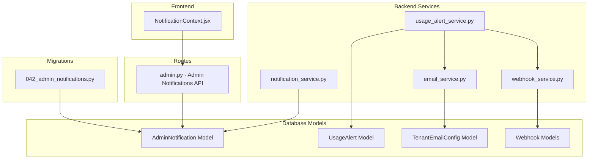
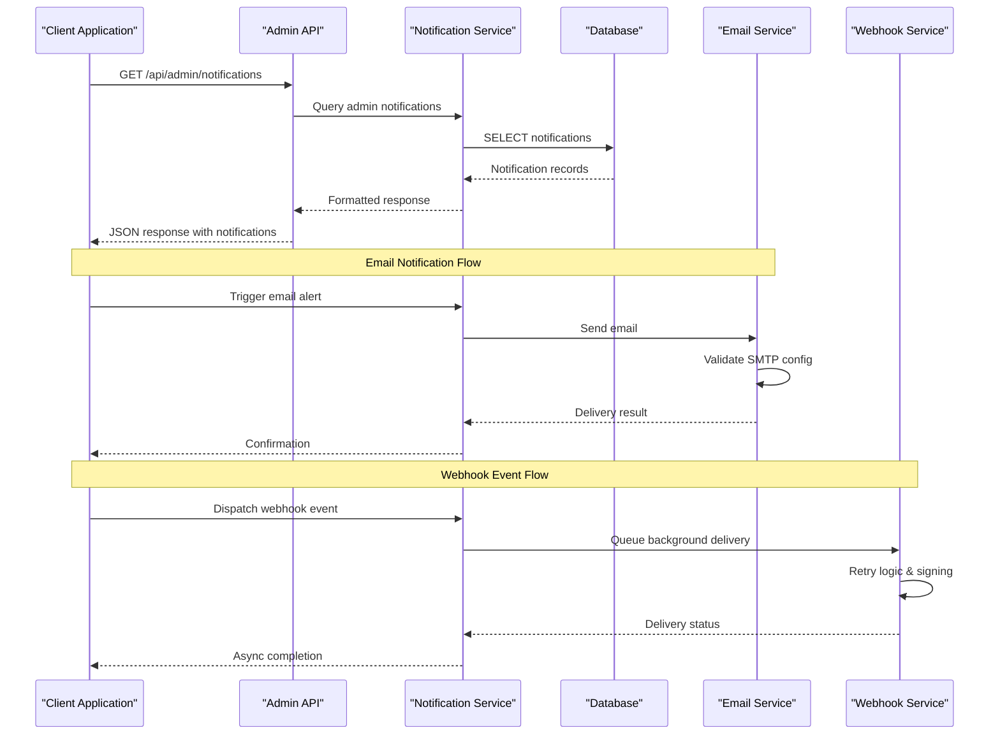
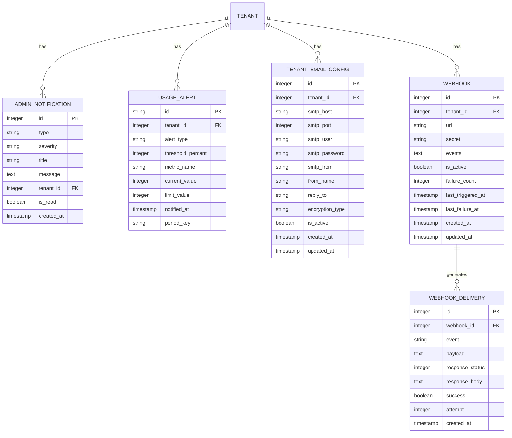
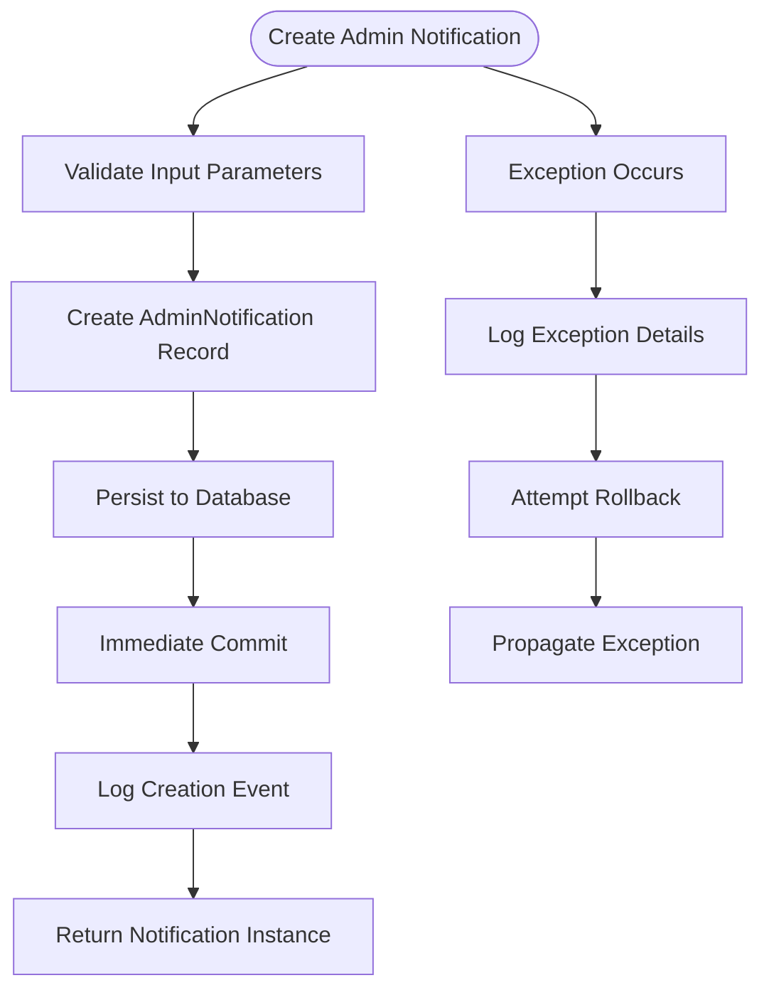
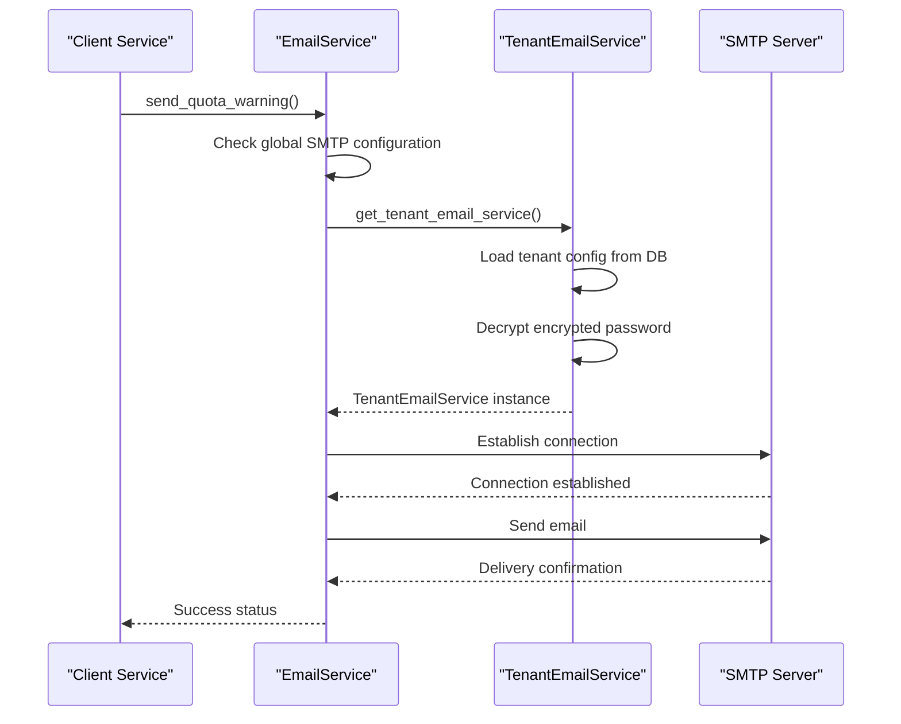
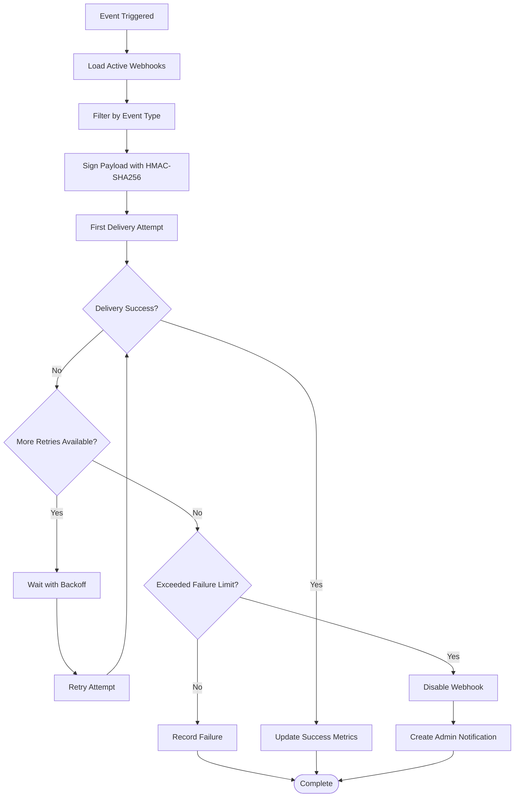
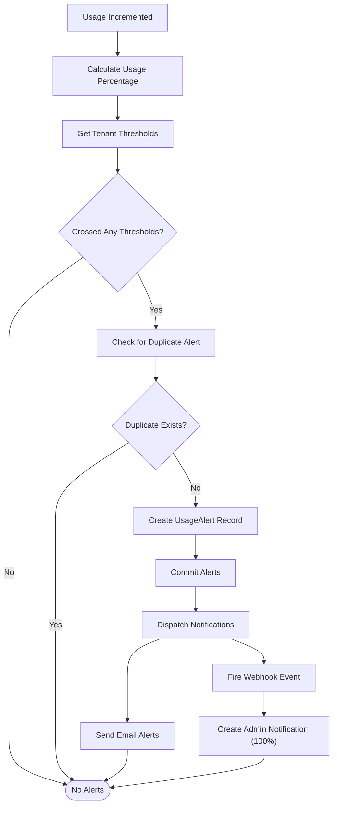
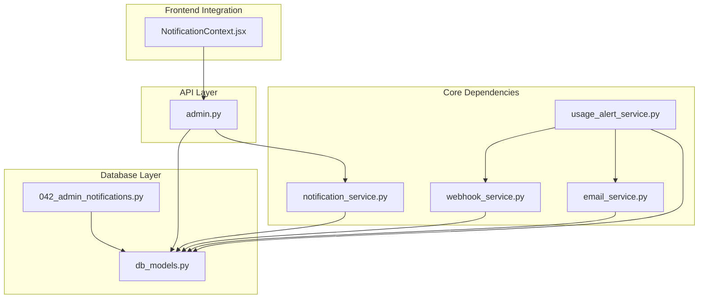

# Notification Service

<cite>
**Referenced Files in This Document**
- [notification_service.py](file://app/backend/services/notification_service.py)
- [db_models.py](file://app/backend/models/db_models.py)
- [admin.py](file://app/backend/routes/admin.py)
- [042_admin_notifications.py](file://alembic/versions/042_admin_notifications.py)
- [email_service.py](file://app/backend/services/email_service.py)
- [webhook_service.py](file://app/backend/services/webhook_service.py)
- [usage_alert_service.py](file://app/backend/services/usage_alert_service.py)
- [NotificationContext.jsx](file://app/frontend/src/contexts/NotificationContext.jsx)
</cite>

## Table of Contents
1. [Introduction](#introduction)
2. [Project Structure](#project-structure)
3. [Core Components](#core-components)
4. [Architecture Overview](#architecture-overview)
5. [Detailed Component Analysis](#detailed-component-analysis)
6. [Dependency Analysis](#dependency-analysis)
7. [Performance Considerations](#performance-considerations)
8. [Troubleshooting Guide](#troubleshooting-guide)
9. [Conclusion](#conclusion)

## Introduction
This document provides comprehensive documentation for the Notification Service ecosystem within the Resume AI platform. The notification system encompasses three primary notification channels: administrative notifications, email alerts, and webhook events. Administrative notifications are stored in a dedicated database table and surfaced through an admin API endpoint. Email notifications support both global SMTP configuration and tenant-specific encrypted configurations. Webhook notifications provide event-driven integrations with external systems, including retry logic and HMAC signing for security. The system is designed for reliability, scalability, and operational visibility, with built-in mechanisms for monitoring, alerting, and administrative oversight.

## Project Structure
The notification service spans backend Python services, database models, Alembic migrations, and frontend React context providers. The structure supports a clean separation of concerns with distinct responsibilities for each component.

**Diagram sources**
- [notification_service.py:1-62](file://app/backend/services/notification_service.py#L1-L62)
- [email_service.py:1-291](file://app/backend/services/email_service.py#L1-L291)
- [webhook_service.py:1-186](file://app/backend/services/webhook_service.py#L1-L186)
- [usage_alert_service.py:1-272](file://app/backend/services/usage_alert_service.py#L1-L272)
- [db_models.py:826-862](file://app/backend/models/db_models.py#L826-L862)
- [admin.py:1225-1285](file://app/backend/routes/admin.py#L1225-L1285)
- [042_admin_notifications.py:1-32](file://alembic/versions/042_admin_notifications.py#L1-L32)
- [NotificationContext.jsx:1-97](file://app/frontend/src/contexts/NotificationContext.jsx#L1-L97)

**Section sources**
- [notification_service.py:1-62](file://app/backend/services/notification_service.py#L1-L62)
- [email_service.py:1-291](file://app/backend/services/email_service.py#L1-L291)
- [webhook_service.py:1-186](file://app/backend/services/webhook_service.py#L1-L186)
- [usage_alert_service.py:1-272](file://app/backend/services/usage_alert_service.py#L1-L272)
- [db_models.py:826-862](file://app/backend/models/db_models.py#L826-L862)
- [admin.py:1225-1285](file://app/backend/routes/admin.py#L1225-L1285)
- [042_admin_notifications.py:1-32](file://alembic/versions/042_admin_notifications.py#L1-L32)
- [NotificationContext.jsx:1-97](file://app/frontend/src/contexts/NotificationContext.jsx#L1-L97)

## Core Components
The notification service consists of several interconnected components that handle different aspects of notification delivery and management.

### Admin Notification Service
The Admin Notification Service provides a centralized mechanism for creating and managing platform-level administrative notifications. It offers a single helper function that persists notifications to the database with immediate commit, ensuring real-time visibility for polling clients. The service supports severity levels (info, warning, critical) and optional tenant scoping.

Key characteristics:
- Immediate persistence with automatic commit
- Severity-based categorization
- Tenant-scoped notifications
- Robust error handling with logging
- Automatic rollback on failures

### Email Notification Service
The Email Notification Service handles administrative email alerts with flexible configuration options. It supports both global SMTP settings and tenant-specific encrypted configurations, enabling organizations to customize sender identities and authentication credentials per tenant.

Core features:
- Global SMTP configuration fallback
- Tenant-specific encrypted credential storage
- Multiple encryption modes (TLS, SSL, plain SMTP)
- Graceful degradation when SMTP is unavailable
- Template-based email generation for common scenarios

### Webhook Notification Service
The Webhook Notification Service enables event-driven integrations with external systems. It provides secure, reliable event delivery with built-in retry logic, HMAC signing for payload verification, and automatic disabling of failing webhooks.

Distinctive capabilities:
- HMAC-SHA256 payload signing
- Configurable retry delays (1s, 5s, 30s)
- Automatic webhook deactivation after repeated failures
- Thread pool executor for background processing
- URL validation and security restrictions

### Usage Alert Service
The Usage Alert Service monitors tenant usage against plan limits and triggers appropriate notifications when thresholds are reached. It prevents duplicate alerts within billing periods and coordinates multiple notification channels.

Primary functions:
- Threshold-based alerting (80%, 100% defaults)
- Period-keyed deduplication
- Multi-channel notification dispatch
- Tenant administrator email delivery
- Webhook event firing for external integrations

**Section sources**
- [notification_service.py:23-62](file://app/backend/services/notification_service.py#L23-L62)
- [email_service.py:44-291](file://app/backend/services/email_service.py#L44-L291)
- [webhook_service.py:26-186](file://app/backend/services/webhook_service.py#L26-L186)
- [usage_alert_service.py:21-272](file://app/backend/services/usage_alert_service.py#L21-L272)

## Architecture Overview
The notification service architecture follows a layered approach with clear separation between data persistence, business logic, and presentation layers. The system integrates with external services while maintaining internal consistency and reliability.

**Diagram sources**
- [admin.py:1225-1285](file://app/backend/routes/admin.py#L1225-L1285)
- [notification_service.py:23-62](file://app/backend/services/notification_service.py#L23-L62)
- [email_service.py:69-101](file://app/backend/services/email_service.py#L69-L101)
- [webhook_service.py:137-158](file://app/backend/services/webhook_service.py#L137-L158)

The architecture ensures loose coupling between components while maintaining clear data flow and error handling boundaries. Each service operates independently but integrates seamlessly through well-defined interfaces.

## Detailed Component Analysis

### Database Models and Schema
The notification system relies on well-structured database models that support efficient querying and maintain data integrity across multiple notification types.

**Diagram sources**
- [db_models.py:826-862](file://app/backend/models/db_models.py#L826-L862)

The schema design emphasizes:
- Efficient indexing on frequently queried fields (is_read, created_at)
- Foreign key relationships for referential integrity
- Tenant scoping for multi-tenant isolation
- Unique constraints to prevent duplicate alerts
- Comprehensive audit trail through timestamps

### Admin Notification Management
The admin notification system provides a centralized hub for platform-wide notifications that administrators can monitor and manage.

**Diagram sources**
- [notification_service.py:37-62](file://app/backend/services/notification_service.py#L37-L62)

Administrative endpoints support comprehensive management:
- Listing notifications with filtering options
- Marking individual notifications as read
- Bulk marking all notifications as read
- Real-time unread count calculation

### Email Delivery Pipeline
The email service implements a robust delivery pipeline that accommodates various SMTP configurations and provides fallback mechanisms for reliability.

**Diagram sources**
- [email_service.py:258-291](file://app/backend/services/email_service.py#L258-L291)
- [email_service.py:69-101](file://app/backend/services/email_service.py#L69-L101)

The email pipeline includes sophisticated error handling:
- Graceful degradation when SMTP is not configured
- Encrypted credential storage and retrieval
- Multiple encryption protocol support
- Comprehensive logging for troubleshooting

### Webhook Event Processing
The webhook service implements a sophisticated event processing system with retry logic, security measures, and operational monitoring.

**Diagram sources**
- [webhook_service.py:49-132](file://app/backend/services/webhook_service.py#L49-L132)

Key operational features:
- Configurable retry schedule with exponential backoff
- HMAC signature verification for payload integrity
- Automatic webhook deactivation after excessive failures
- Comprehensive delivery tracking and logging
- Thread pool executor for concurrent processing

### Usage Alert Monitoring
The usage alert service provides intelligent monitoring of tenant resource consumption with configurable thresholds and multi-channel notification dispatch.

**Diagram sources**
- [usage_alert_service.py:43-129](file://app/backend/services/usage_alert_service.py#L43-L129)

The usage alert system includes:
- Configurable threshold percentages per tenant
- Period-based deduplication to prevent spam
- Multi-channel notification dispatch
- Tenant administrator email delivery
- Automatic admin notifications for critical thresholds

**Section sources**
- [db_models.py:826-862](file://app/backend/models/db_models.py#L826-L862)
- [admin.py:1225-1285](file://app/backend/routes/admin.py#L1225-L1285)
- [email_service.py:44-291](file://app/backend/services/email_service.py#L44-L291)
- [webhook_service.py:26-186](file://app/backend/services/webhook_service.py#L26-L186)
- [usage_alert_service.py:21-272](file://app/backend/services/usage_alert_service.py#L21-L272)

## Dependency Analysis
The notification service exhibits well-managed dependencies with clear separation of concerns and minimal circular dependencies.

**Diagram sources**
- [notification_service.py:18](file://app/backend/services/notification_service.py#L18)
- [email_service.py:264](file://app/backend/services/email_service.py#L264)
- [webhook_service.py:12](file://app/backend/services/webhook_service.py#L12)
- [usage_alert_service.py:16](file://app/backend/services/usage_alert_service.py#L16)
- [db_models.py:826](file://app/backend/models/db_models.py#L826)
- [admin.py:1225](file://app/backend/routes/admin.py#L1225)
- [042_admin_notifications.py:13](file://alembic/versions/042_admin_notifications.py#L13)
- [NotificationContext.jsx:3](file://app/frontend/src/contexts/NotificationContext.jsx#L3)

The dependency graph reveals:
- Centralized notification creation through the notification service
- Usage alert service as the orchestrator for multi-channel notifications
- Loose coupling between email and webhook services
- Clear separation between data models and business logic
- Frontend integration through the admin API

**Section sources**
- [notification_service.py:18](file://app/backend/services/notification_service.py#L18)
- [email_service.py:264](file://app/backend/services/email_service.py#L264)
- [webhook_service.py:12](file://app/backend/services/webhook_service.py#L12)
- [usage_alert_service.py:16](file://app/backend/services/usage_alert_service.py#L16)
- [db_models.py:826](file://app/backend/models/db_models.py#L826)
- [admin.py:1225](file://app/backend/routes/admin.py#L1225)
- [042_admin_notifications.py:13](file://alembic/versions/042_admin_notifications.py#L13)
- [NotificationContext.jsx:3](file://app/frontend/src/contexts/NotificationContext.jsx#L3)

## Performance Considerations
The notification service is designed with performance and scalability in mind, incorporating several optimization strategies:

### Database Optimization
- Strategic indexing on frequently queried fields (is_read, created_at, tenant_id)
- Efficient query patterns with proper filtering and limiting
- Unique constraints to prevent duplicate alert generation
- Relationship-based loading to minimize N+1 query problems

### Asynchronous Processing
- Background thread pool executor for webhook delivery
- Non-blocking email sending operations
- Fire-and-forget pattern for bulk notifications
- Connection pooling for database operations

### Memory Management
- Proper resource cleanup in database sessions
- Timed cleanup for batch analysis progress tracking
- Reference-based timeout management for UI updates
- Efficient payload serialization for webhook events

### Caching and Deduplication
- Period-based deduplication for usage alerts
- Tenant-specific configuration caching
- In-memory thread pool for concurrent operations
- Efficient notification counting queries

## Troubleshooting Guide

### Common Issues and Solutions

**Email Delivery Failures**
- Verify SMTP environment variables are properly configured
- Check tenant-specific email configurations in the database
- Review encryption key configuration for credential decryption
- Monitor SMTP server connectivity and authentication

**Webhook Delivery Problems**
- Validate webhook URL format and security requirements
- Check HMAC signature verification on receiving end
- Monitor retry attempts and failure patterns
- Review webhook deactivation due to excessive failures

**Database Connectivity Issues**
- Verify database connection strings and credentials
- Check migration status and table existence
- Monitor connection pool exhaustion
- Review transaction isolation levels

**Notification Visibility Problems**
- Confirm admin API authentication and permissions
- Check notification filtering and pagination parameters
- Verify tenant scoping for multi-tenant environments
- Review notification read/unread status tracking

### Diagnostic Commands and Checks

**Database Verification**
- Confirm admin_notifications table exists and indexed
- Verify usage_alerts table constraints and relationships
- Check tenant_email_configs encryption and activation status
- Validate webhook and webhook_deliveries relationships

**Service Health Checks**
- Test SMTP connectivity and authentication
- Verify webhook URL accessibility and security
- Check thread pool executor health
- Monitor database connection pool utilization

**Monitoring and Logging**
- Review notification service error logs
- Check webhook delivery attempt logs
- Monitor email delivery success rates
- Track usage alert generation frequency

**Section sources**
- [email_service.py:75-100](file://app/backend/services/email_service.py#L75-L100)
- [webhook_service.py:160-186](file://app/backend/services/webhook_service.py#L160-L186)
- [notification_service.py:53-61](file://app/backend/services/notification_service.py#L53-L61)
- [admin.py:1225-1285](file://app/backend/routes/admin.py#L1225-L1285)

## Conclusion
The Notification Service ecosystem provides a comprehensive, scalable solution for delivering administrative notifications, email alerts, and webhook events across the Resume AI platform. The system's design emphasizes reliability, security, and operational efficiency through well-structured components, robust error handling, and thoughtful architectural decisions.

Key strengths of the implementation include:
- Clear separation of concerns with specialized services for each notification channel
- Comprehensive error handling and graceful degradation mechanisms
- Strong security measures including encrypted credential storage and HMAC signing
- Efficient database design with strategic indexing and constraints
- Flexible configuration options supporting multi-tenant deployments
- Robust asynchronous processing for high-throughput scenarios

The service successfully balances functionality with performance, providing administrators with comprehensive visibility into platform operations while maintaining system reliability and security. The modular architecture ensures maintainability and extensibility for future enhancements and additional notification channels.