# AI Model Optimization

<cite>
**Referenced Files in This Document**
- [llm_service.py](file://app/backend/services/llm_service.py)
- [agent_pipeline.py](file://app/backend/services/agent_pipeline.py)
- [hybrid_pipeline.py](file://app/backend/services/hybrid_pipeline.py)
- [analysis_service.py](file://app/backend/services/analysis_service.py)
- [analyze.py](file://app/backend/routes/analyze.py)
- [wait_for_ollama.py](file://app/backend/scripts/wait_for_ollama.py)
- [setup-recruiter-model.sh](file://ollama/setup-recruiter-model.sh)
- [db_models.py](file://app/backend/models/db_models.py)
- [main.py](file://app/backend/main.py)
</cite>

## Table of Contents
1. [Introduction](#introduction)
2. [Project Structure](#project-structure)
3. [Core Components](#core-components)
4. [Architecture Overview](#architecture-overview)
5. [Detailed Component Analysis](#detailed-component-analysis)
6. [Dependency Analysis](#dependency-analysis)
7. [Performance Considerations](#performance-considerations)
8. [Troubleshooting Guide](#troubleshooting-guide)
9. [Conclusion](#conclusion)
10. [Appendices](#appendices)

## Introduction
This document presents a comprehensive guide to AI model optimization strategies for Resume AI’s Ollama-based LLM workflows. It covers prompt engineering best practices, context window management, inference acceleration, model parameter tuning, caching and warm-up strategies, fallback mechanisms, performance monitoring, and cost-effective inference patterns. It also includes practical examples for optimizing skill matching prompts, reducing context size without losing accuracy, and implementing efficient batch processing.

## Project Structure
Resume AI implements two complementary analysis pipelines:
- A hybrid pipeline combining deterministic Python scoring with a single LLM call for narrative synthesis. This minimizes LLM calls and improves throughput.
- A LangGraph-based agent pipeline that splits analysis into multiple specialized nodes, enabling parallelism and robust fallbacks.

Key runtime components:
- LLM service wrappers for Ollama HTTP API
- Prompt builders with truncation and schema enforcement
- Caching for repeated prompts and shared job descriptions
- Model warm-up and readiness gates
- Batch orchestration with concurrency control and timeouts

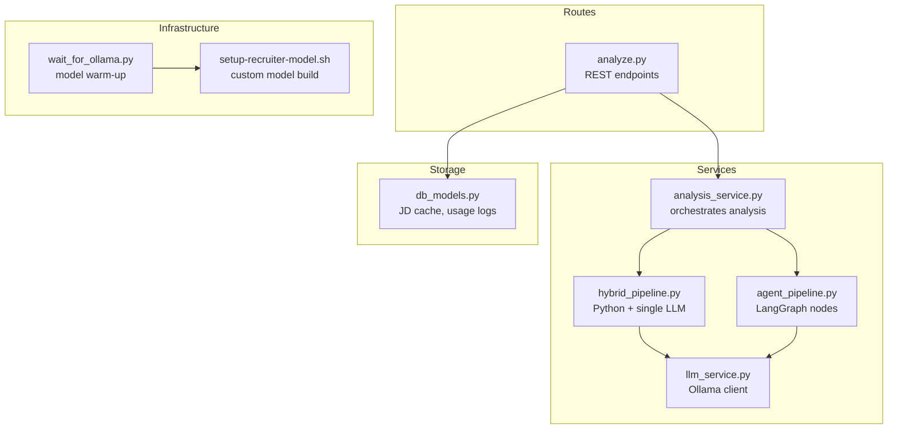

**Diagram sources**
- [analyze.py:354-501](file://app/backend/routes/analyze.py#L354-L501)
- [analysis_service.py:10-53](file://app/backend/services/analysis_service.py#L10-L53)
- [hybrid_pipeline.py:1353-1407](file://app/backend/services/hybrid_pipeline.py#L1353-L1407)
- [agent_pipeline.py:623-633](file://app/backend/services/agent_pipeline.py#L623-L633)
- [llm_service.py:13-41](file://app/backend/services/llm_service.py#L13-L41)
- [wait_for_ollama.py:34-91](file://app/backend/scripts/wait_for_ollama.py#L34-L91)
- [setup-recruiter-model.sh:1-54](file://ollama/setup-recruiter-model.sh#L1-L54)
- [db_models.py:229-236](file://app/backend/models/db_models.py#L229-L236)

**Section sources**
- [analyze.py:1-121](file://app/backend/routes/analyze.py#L1-L121)
- [analysis_service.py:1-121](file://app/backend/services/analysis_service.py#L1-L121)
- [hybrid_pipeline.py:1-120](file://app/backend/services/hybrid_pipeline.py#L1-L120)
- [agent_pipeline.py:1-63](file://app/backend/services/agent_pipeline.py#L1-L63)
- [llm_service.py:1-156](file://app/backend/services/llm_service.py#L1-L156)
- [wait_for_ollama.py:1-96](file://app/backend/scripts/wait_for_ollama.py#L1-L96)
- [setup-recruiter-model.sh:1-54](file://ollama/setup-recruiter-model.sh#L1-L54)
- [db_models.py:1-250](file://app/backend/models/db_models.py#L1-L250)

## Core Components
- LLM service: encapsulates Ollama HTTP calls, JSON parsing, and fallback responses.
- Hybrid pipeline: deterministic Python scoring plus a single LLM call for narrative synthesis.
- Agent pipeline: LangGraph nodes with parallel stages, caching, and robust fallbacks.
- Route orchestration: batch processing, usage enforcement, and persistence.
- Warm-up and readiness: startup gate to ensure model availability and RAM residency.

**Section sources**
- [llm_service.py:7-156](file://app/backend/services/llm_service.py#L7-L156)
- [hybrid_pipeline.py:1262-1407](file://app/backend/services/hybrid_pipeline.py#L1262-L1407)
- [agent_pipeline.py:57-100](file://app/backend/services/agent_pipeline.py#L57-L100)
- [analyze.py:649-758](file://app/backend/routes/analyze.py#L649-L758)
- [wait_for_ollama.py:34-91](file://app/backend/scripts/wait_for_ollama.py#L34-L91)

## Architecture Overview
The system balances determinism and LLM-driven insights:
- Deterministic phase computes skill, experience, domain, and timeline scores.
- Single LLM call synthesizes strengths, weaknesses, rationale, and interview questions.
- Alternative LangGraph pipeline splits work into nodes with per-node fallbacks and a shared reasoning model.

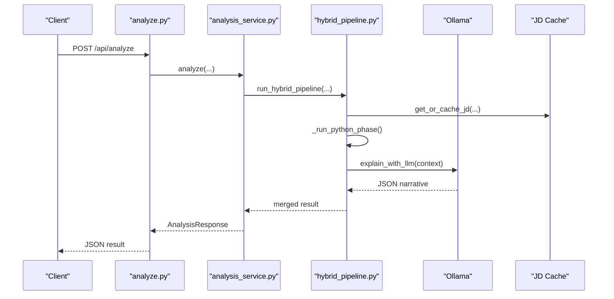

**Diagram sources**
- [analyze.py:354-501](file://app/backend/routes/analyze.py#L354-L501)
- [analysis_service.py:10-53](file://app/backend/services/analysis_service.py#L10-L53)
- [hybrid_pipeline.py:1353-1407](file://app/backend/services/hybrid_pipeline.py#L1353-L1407)

## Detailed Component Analysis

### Prompt Engineering Best Practices
- Schema-bound JSON output: enforce strict JSON schemas and use “format”: “json” to reduce hallucinations.
- Minimal, structured prompts: include only essential fields and truncate long inputs to stay within context.
- Clear instructions: define output shape and rules explicitly; include examples when helpful.
- Robust parsing: extract JSON from various LLM output forms (code fences, markdown, partial JSON).

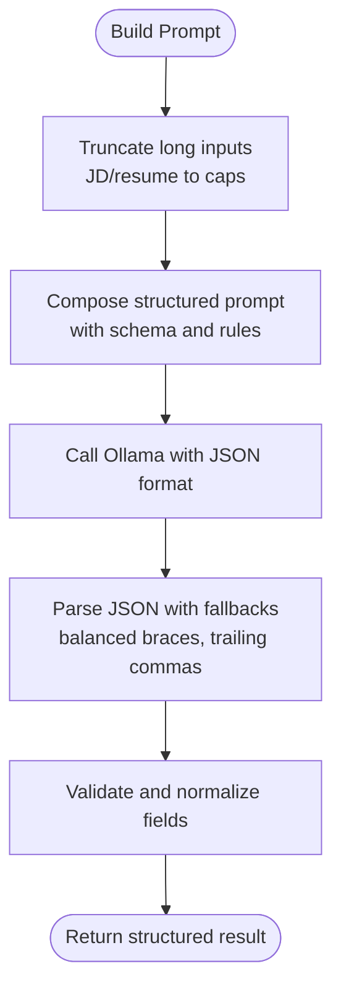

**Diagram sources**
- [llm_service.py:59-103](file://app/backend/services/llm_service.py#L59-L103)
- [hybrid_pipeline.py:1144-1194](file://app/backend/services/hybrid_pipeline.py#L1144-L1194)

**Section sources**
- [llm_service.py:59-103](file://app/backend/services/llm_service.py#L59-L103)
- [hybrid_pipeline.py:1144-1194](file://app/backend/services/hybrid_pipeline.py#L1144-L1194)

### Context Window Management
- Truncation: cap job descriptions and resumes to predefined lengths to prevent overflow.
- Selective inclusion: pass only required fields (e.g., first N skills, first few gaps).
- Token budgeting: set num_ctx and num_predict to match prompt plus desired output.

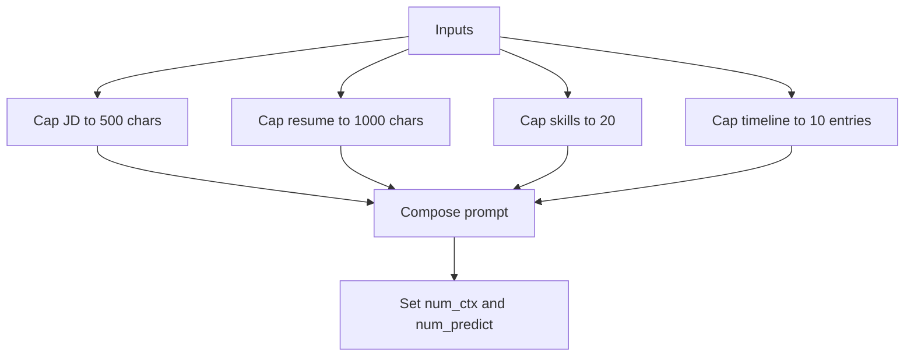

**Diagram sources**
- [llm_service.py:68-71](file://app/backend/services/llm_service.py#L68-L71)
- [agent_pipeline.py:308-311](file://app/backend/services/agent_pipeline.py#L308-L311)
- [hybrid_pipeline.py:1155-1157](file://app/backend/services/hybrid_pipeline.py#L1155-L1157)

**Section sources**
- [llm_service.py:68-71](file://app/backend/services/llm_service.py#L68-L71)
- [agent_pipeline.py:308-311](file://app/backend/services/agent_pipeline.py#L308-L311)
- [hybrid_pipeline.py:1155-1157](file://app/backend/services/hybrid_pipeline.py#L1155-L1157)

### Inference Acceleration Techniques
- Keep-alive and hot models: reuse ChatOllama instances and set keep_alive to keep models resident in RAM.
- Concurrency control: limit concurrent LLM calls with a semaphore to avoid resource contention.
- Streaming with heartbeats: maintain long-lived connections with periodic SSE pings to keep proxies happy.
- Warm-up gate: ensure model is pulled and warmed before serving requests.

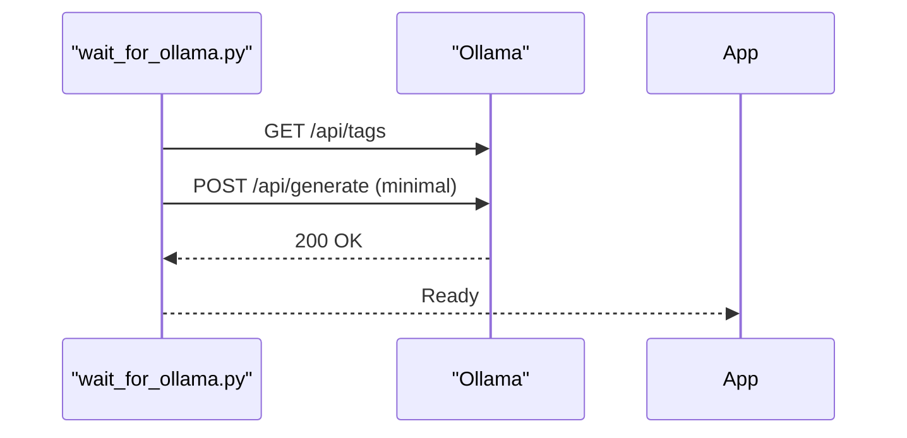

**Diagram sources**
- [wait_for_ollama.py:34-91](file://app/backend/scripts/wait_for_ollama.py#L34-L91)

**Section sources**
- [agent_pipeline.py:70-99](file://app/backend/services/agent_pipeline.py#L70-L99)
- [hybrid_pipeline.py:24-32](file://app/backend/services/hybrid_pipeline.py#L24-L32)
- [hybrid_pipeline.py:1410-1497](file://app/backend/services/hybrid_pipeline.py#L1410-L1497)
- [wait_for_ollama.py:34-91](file://app/backend/scripts/wait_for_ollama.py#L34-L91)

### Model Parameter Tuning
- Temperature: set to deterministic values (0.0 or near-zero) for schema-bound JSON to reduce variability.
- num_predict: constrain output length to avoid oversized KV allocations.
- num_ctx: tune to fit the prompt plus output with a small margin.
- keep_alive: keep model hot to avoid cold-start latency spikes.

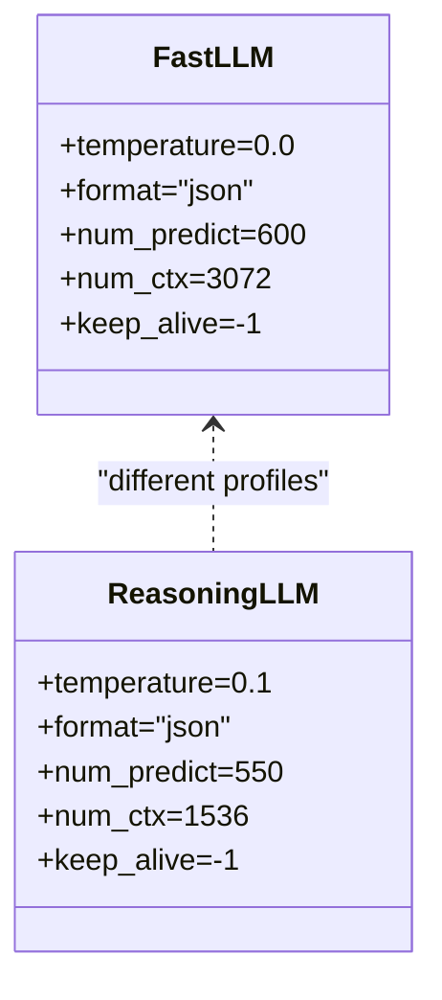

**Diagram sources**
- [agent_pipeline.py:70-99](file://app/backend/services/agent_pipeline.py#L70-L99)
- [hybrid_pipeline.py:45-66](file://app/backend/services/hybrid_pipeline.py#L45-L66)

**Section sources**
- [agent_pipeline.py:70-99](file://app/backend/services/agent_pipeline.py#L70-L99)
- [hybrid_pipeline.py:45-66](file://app/backend/services/hybrid_pipeline.py#L45-L66)

### Caching Strategies
- Job Description Cache: MD5-based cache keyed by first 2000 characters of JD; shared across workers via DB.
- In-memory JD Cache: per-worker cache for repeated screening of the same JD across candidates.
- Candidate Profile Storage: persist parsed data to avoid re-parsing on subsequent analyses.

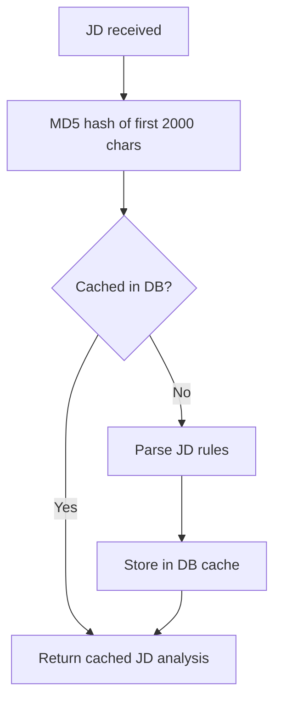

**Diagram sources**
- [analyze.py:49-67](file://app/backend/routes/analyze.py#L49-L67)
- [agent_pipeline.py:64-67](file://app/backend/services/agent_pipeline.py#L64-L67)

**Section sources**
- [analyze.py:49-67](file://app/backend/routes/analyze.py#L49-L67)
- [agent_pipeline.py:64-67](file://app/backend/services/agent_pipeline.py#L64-L67)
- [db_models.py:229-236](file://app/backend/models/db_models.py#L229-L236)

### Model Warm-up Procedures
- Startup gate: verify Ollama availability, model presence, and warm-up completion before accepting requests.
- Custom model builder: script to build a tailored model inside the Ollama container.

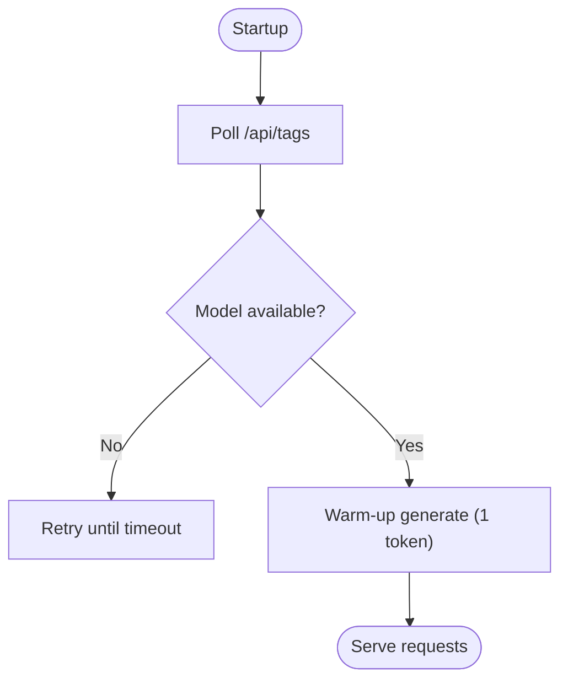

**Diagram sources**
- [wait_for_ollama.py:34-91](file://app/backend/scripts/wait_for_ollama.py#L34-L91)
- [setup-recruiter-model.sh:36-42](file://ollama/setup-recruiter-model.sh#L36-L42)

**Section sources**
- [wait_for_ollama.py:34-91](file://app/backend/scripts/wait_for_ollama.py#L34-L91)
- [setup-recruiter-model.sh:1-54](file://ollama/setup-recruiter-model.sh#L1-L54)

### Fallback Mechanisms
- Per-node fallbacks: each LangGraph node returns safe defaults on failure.
- Hybrid fallback: deterministic narrative when LLM times out or fails.
- Route fallback: structured fallback result with safe defaults.

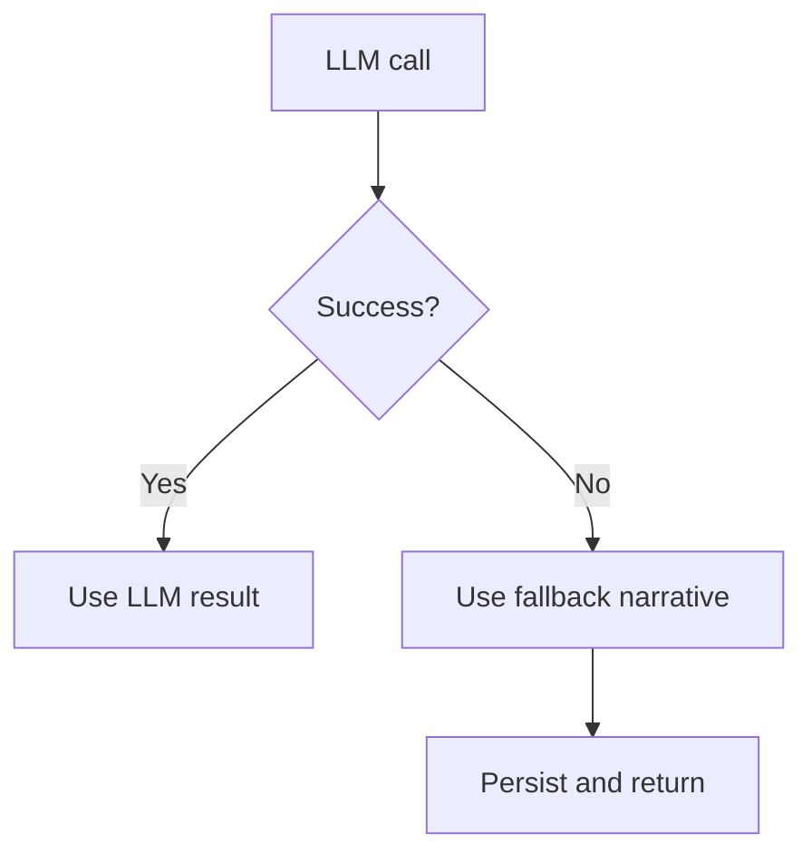

**Diagram sources**
- [agent_pipeline.py:178-179](file://app/backend/services/agent_pipeline.py#L178-L179)
- [hybrid_pipeline.py:1384-1406](file://app/backend/services/hybrid_pipeline.py#L1384-L1406)

**Section sources**
- [agent_pipeline.py:178-179](file://app/backend/services/agent_pipeline.py#L178-L179)
- [hybrid_pipeline.py:1384-1406](file://app/backend/services/hybrid_pipeline.py#L1384-L1406)

### Performance Monitoring
- Latency metrics: log total request time and fit score for downstream dashboards.
- Throughput: batch processing with controlled concurrency and chunking.
- Cost-effectiveness: minimize LLM calls by using deterministic scoring and single LLM narrative.

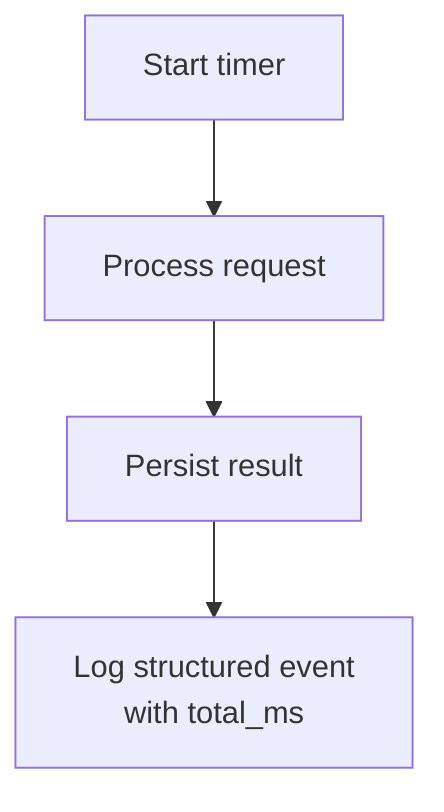

**Diagram sources**
- [analyze.py:449-501](file://app/backend/routes/analyze.py#L449-L501)

**Section sources**
- [analyze.py:449-501](file://app/backend/routes/analyze.py#L449-L501)

### Batch Processing Examples
- Batch endpoint enforces plan limits and processes multiple resumes concurrently with controlled concurrency.
- Chunking and gather: process files in batches to avoid memory pressure.

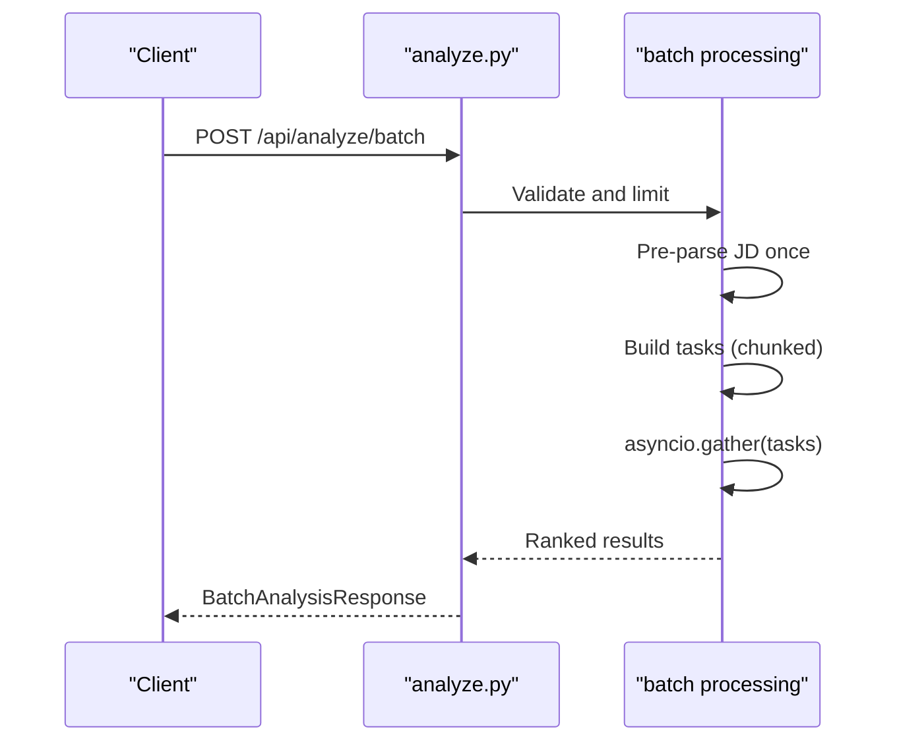

**Diagram sources**
- [analyze.py:651-758](file://app/backend/routes/analyze.py#L651-L758)

**Section sources**
- [analyze.py:651-758](file://app/backend/routes/analyze.py#L651-L758)

### Model Versioning and A/B Testing
- Environment-driven model selection: configure OLLAMA_MODEL and OLLAMA_FAST_MODEL per environment.
- A/B testing: route orchestrator can select different pipelines or prompts based on flags or user segments.
- Resource allocation: separate reasoning and fast models for different workloads.

**Section sources**
- [agent_pipeline.py:39-41](file://app/backend/services/agent_pipeline.py#L39-L41)
- [hybrid_pipeline.py:45-66](file://app/backend/services/hybrid_pipeline.py#L45-L66)

## Dependency Analysis
- Routes depend on services for orchestration and on DB models for caching and usage tracking.
- Services depend on LLM clients and LangChain ChatOllama for model interactions.
- Pipelines share configuration via environment variables and caches.

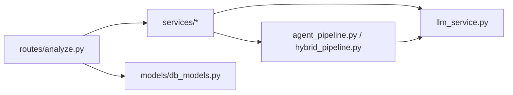

**Diagram sources**
- [analyze.py:34-38](file://app/backend/routes/analyze.py#L34-L38)
- [llm_service.py:1-156](file://app/backend/services/llm_service.py#L1-L156)
- [agent_pipeline.py:1-63](file://app/backend/services/agent_pipeline.py#L1-L63)
- [hybrid_pipeline.py:1-120](file://app/backend/services/hybrid_pipeline.py#L1-L120)
- [db_models.py:1-250](file://app/backend/models/db_models.py#L1-L250)

**Section sources**
- [analyze.py:34-38](file://app/backend/routes/analyze.py#L34-L38)
- [llm_service.py:1-156](file://app/backend/services/llm_service.py#L1-L156)
- [agent_pipeline.py:1-63](file://app/backend/services/agent_pipeline.py#L1-L63)
- [hybrid_pipeline.py:1-120](file://app/backend/services/hybrid_pipeline.py#L1-L120)
- [db_models.py:1-250](file://app/backend/models/db_models.py#L1-L250)

## Performance Considerations
- Reduce LLM calls: deterministic scoring plus a single narrative call.
- Control concurrency: use semaphores to cap parallel LLM invocations.
- Warm models: keep models resident in RAM to avoid cold-start latency.
- Monitor and alert: structured logs with timing and outcomes.
- Tune context sizes: balance prompt length with KV cache size and attention speed.

[No sources needed since this section provides general guidance]

## Troubleshooting Guide
Common issues and remedies:
- Ollama not ready: use the startup gate to ensure model availability and warm-up.
- LLM timeouts: increase LLM_NARRATIVE_TIMEOUT; implement fallback narratives.
- JSON parsing failures: use robust extraction with balanced brace parsing and fallbacks.
- Concurrency bottlenecks: adjust semaphore limits and process in chunks.

**Section sources**
- [wait_for_ollama.py:34-91](file://app/backend/scripts/wait_for_ollama.py#L34-L91)
- [hybrid_pipeline.py:1384-1406](file://app/backend/services/hybrid_pipeline.py#L1384-L1406)
- [hybrid_pipeline.py:1116-1141](file://app/backend/services/hybrid_pipeline.py#L1116-L1141)
- [hybrid_pipeline.py:24-32](file://app/backend/services/hybrid_pipeline.py#L24-L32)

## Conclusion
Resume AI’s optimization strategy centers on minimizing LLM calls while maintaining high-quality, deterministic scoring and robust fallbacks. By carefully managing context windows, tuning model parameters, warming models, and implementing intelligent caching and batching, the system achieves predictable latency, improved throughput, and cost-effective inference. These patterns can be adapted to other Ollama-based applications requiring scalable LLM workflows.

[No sources needed since this section summarizes without analyzing specific files]

## Appendices

### Example: Optimizing Skill Matching Prompts
- Reduce context: cap required skills and timeline entries.
- Normalize inputs: use canonical skill names and alias expansion.
- Schema enforcement: instruct the model to output only valid JSON.

**Section sources**
- [agent_pipeline.py:308-311](file://app/backend/services/agent_pipeline.py#L308-L311)
- [hybrid_pipeline.py:1155-1157](file://app/backend/services/hybrid_pipeline.py#L1155-L1157)

### Example: Reducing Context Size Without Losing Accuracy
- Truncate long texts to fixed caps.
- Pass only the most relevant fields (e.g., first N skills, first few gaps).
- Use summaries for long inputs (e.g., career summary snippet).

**Section sources**
- [llm_service.py:68-71](file://app/backend/services/llm_service.py#L68-L71)
- [hybrid_pipeline.py:1155-1157](file://app/backend/services/hybrid_pipeline.py#L1155-L1157)

### Example: Efficient Batch Processing
- Validate and limit batch size per plan.
- Pre-parse JD once and reuse across resumes.
- Use asyncio.gather with chunking and concurrency control.

**Section sources**
- [analyze.py:670-721](file://app/backend/routes/analyze.py#L670-L721)

### Example: Model Warm-up and Readiness
- Poll tags endpoint and warm with a minimal generate call.
- Configure environment variables for base URL and model names.

**Section sources**
- [wait_for_ollama.py:34-91](file://app/backend/scripts/wait_for_ollama.py#L34-L91)
- [setup-recruiter-model.sh:48-52](file://ollama/setup-recruiter-model.sh#L48-L52)