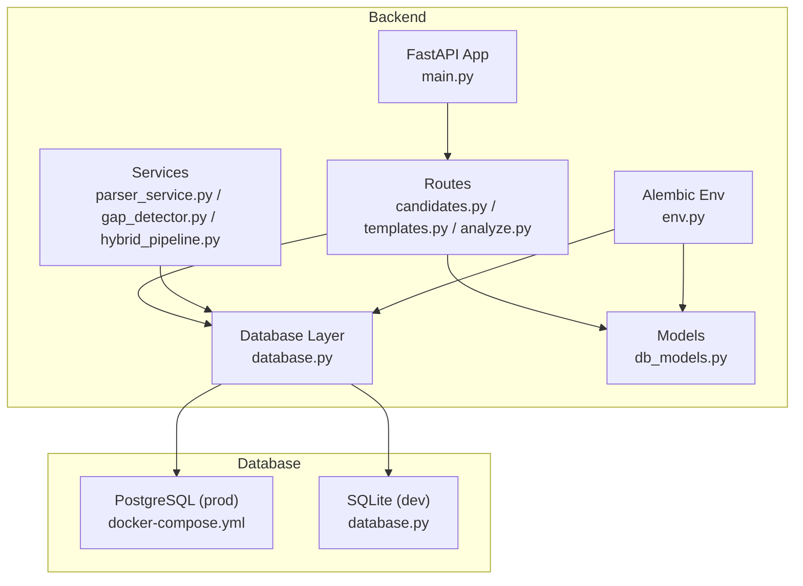
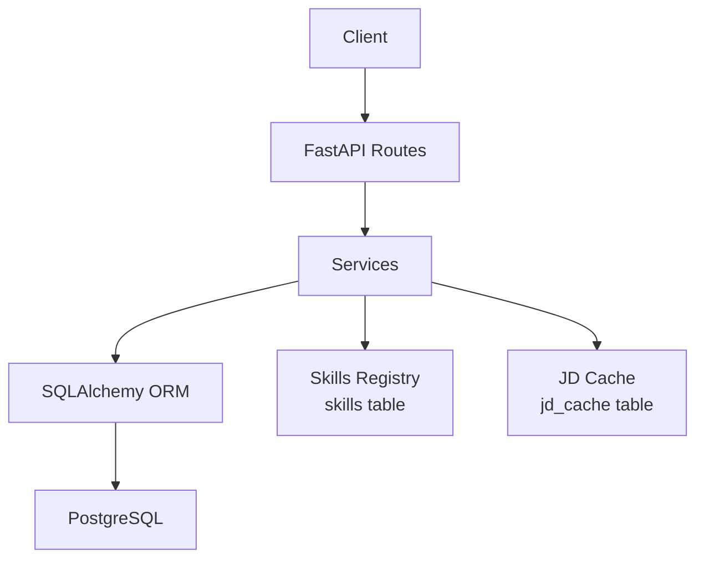
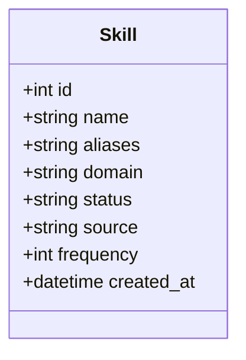
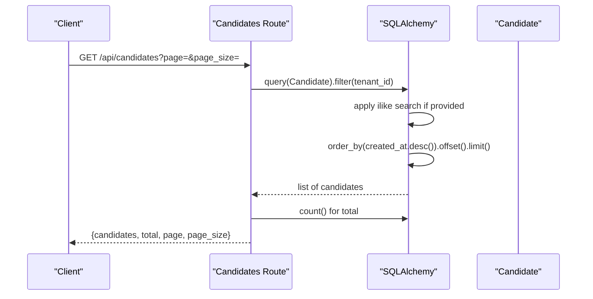
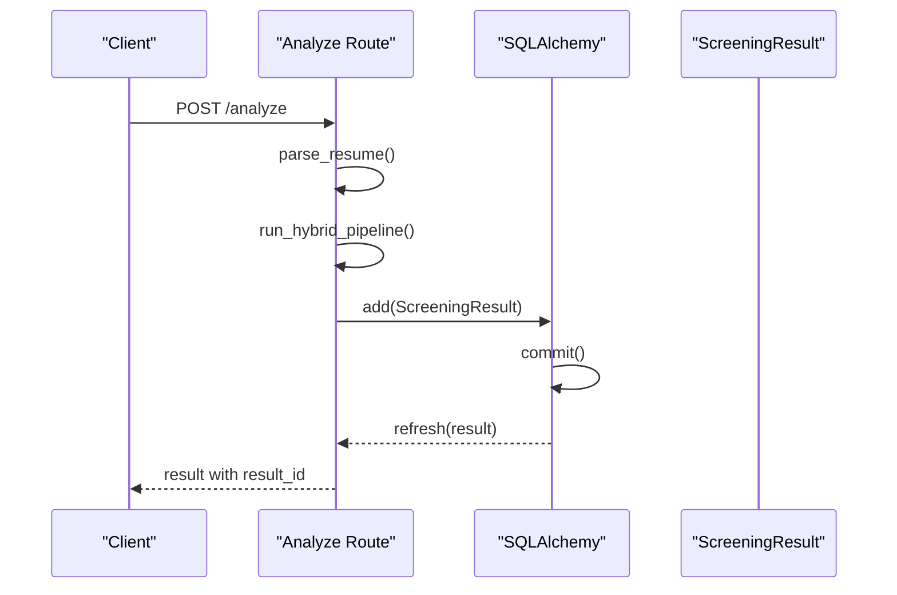
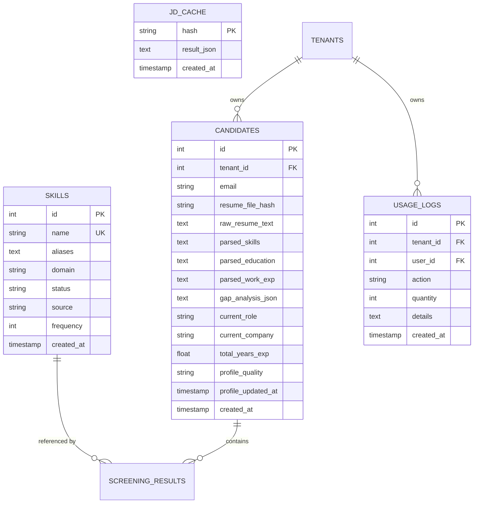
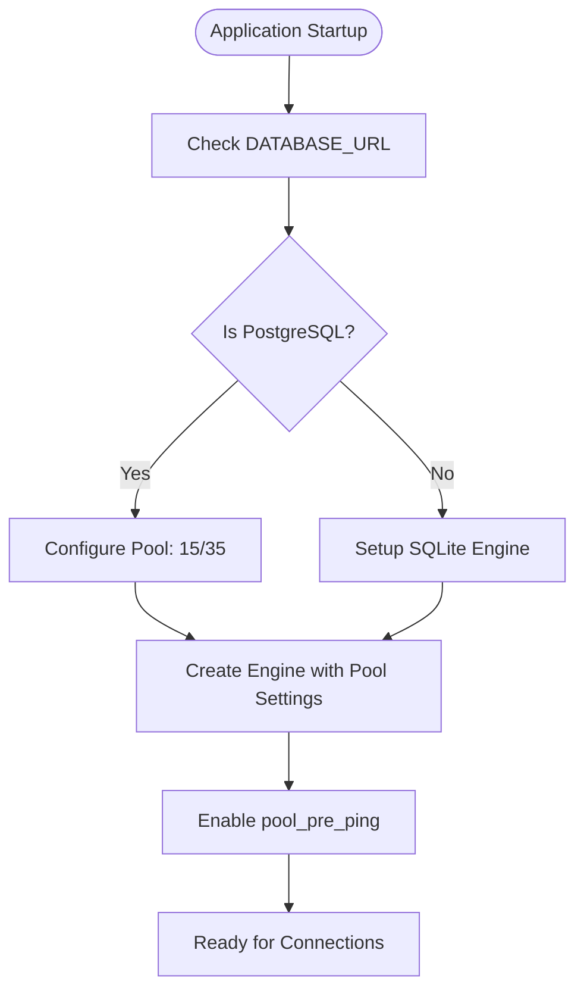
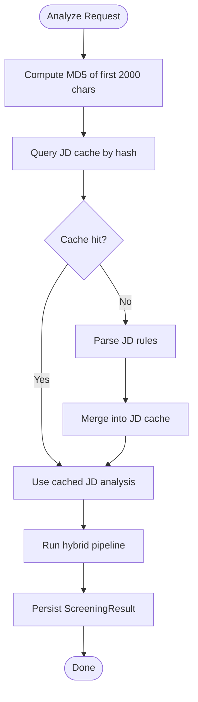
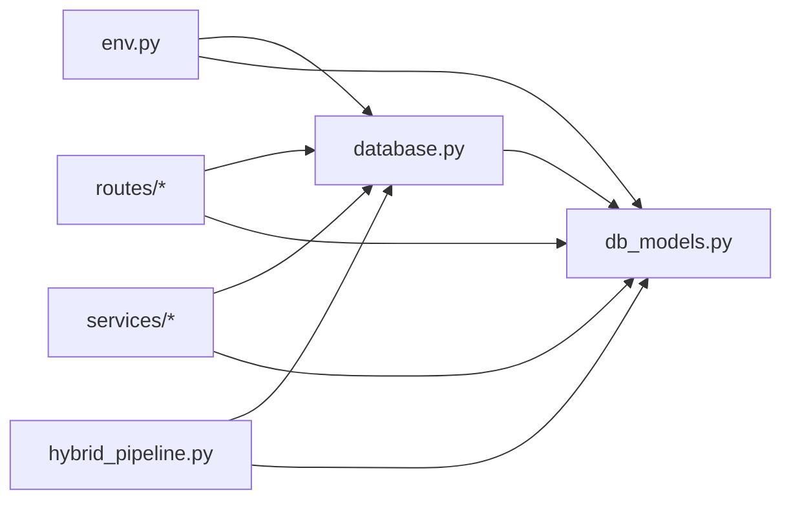

# Database Performance

<cite>
**Referenced Files in This Document**
- [database.py](file://app/backend/db/database.py)
- [db_models.py](file://app/backend/models/db_models.py)
- [main.py](file://app/backend/main.py)
- [candidates.py](file://app/backend/routes/candidates.py)
- [templates.py](file://app/backend/routes/templates.py)
- [analyze.py](file://app/backend/routes/analyze.py)
- [parser_service.py](file://app/backend/services/parser_service.py)
- [gap_detector.py](file://app/backend/services/gap_detector.py)
- [hybrid_pipeline.py](file://app/backend/services/hybrid_pipeline.py)
- [001_enrich_candidates_add_caches.py](file://alembic/versions/001_enrich_candidates_add_caches.py)
- [002_parser_snapshot_json.py](file://alembic/versions/002_parser_snapshot_json.py)
- [env.py](file://alembic/env.py)
- [docker-compose.yml](file://docker-compose.yml)
- [requirements.txt](file://requirements.txt)
</cite>

## Update Summary
**Changes Made**
- Updated connection pooling configuration section to reflect new pool settings (15/35)
- Added new section on connection pool sizing considerations
- Updated troubleshooting guide to include pool configuration guidance
- Enhanced performance considerations with connection pool implications

## Table of Contents
1. [Introduction](#introduction)
2. [Project Structure](#project-structure)
3. [Core Components](#core-components)
4. [Architecture Overview](#architecture-overview)
5. [Detailed Component Analysis](#detailed-component-analysis)
6. [Dependency Analysis](#dependency-analysis)
7. [Performance Considerations](#performance-considerations)
8. [Troubleshooting Guide](#troubleshooting-guide)
9. [Conclusion](#conclusion)
10. [Appendices](#appendices)

## Introduction
This document focuses on database performance optimization for Resume AI. It covers query optimization strategies for skills registry operations, candidate profile queries, and analysis result storage. It also documents indexing strategies for frequently accessed data, connection pooling configuration, transaction management for concurrency, caching mechanisms for hot data, tuning parameters, execution plan analysis, monitoring approaches, and practical examples for skills matching, batch inserts, and efficient pagination. Finally, it outlines maintenance tasks, backup strategies, and capacity planning for growing datasets.

## Project Structure
The database layer is implemented with SQLAlchemy ORM and Alembic migrations. The backend exposes FastAPI routes that perform database operations, while the hybrid pipeline integrates skills registry lookups and caching. The deployment uses PostgreSQL in production and supports SQLite for development.

**Diagram sources**
- [main.py:174-215](file://app/backend/main.py#L174-L215)
- [candidates.py:23-33](file://app/backend/routes/candidates.py#L23-L33)
- [templates.py:13-26](file://app/backend/routes/templates.py#L13-L26)
- [analyze.py:41-42](file://app/backend/routes/analyze.py#L41-L42)
- [database.py:1-33](file://app/backend/db/database.py#L1-L33)
- [db_models.py:1-250](file://app/backend/models/db_models.py#L1-L250)
- [env.py:11-20](file://alembic/env.py#L11-L20)
- [docker-compose.yml:65](file://docker-compose.yml#L65)

**Section sources**
- [database.py:1-33](file://app/backend/db/database.py#L1-L33)
- [db_models.py:1-250](file://app/backend/models/db_models.py#L1-L250)
- [main.py:174-215](file://app/backend/main.py#L174-L215)
- [docker-compose.yml:6](file-L6-L17)

## Core Components
- Database engine and session factory: configured with connection pooling and pre-ping for reliability.
- SQLAlchemy models define tables, relationships, and indexes for tenants, users, candidates, screening results, role templates, transcripts, training examples, JD cache, and skills registry.
- Alembic migrations manage schema evolution, including the addition of profile columns, JD cache, and skills registry tables with appropriate indexes.
- Routes orchestrate database transactions for CRUD operations, pagination, and analysis persistence.
- Services encapsulate parsing, gap detection, and skills registry integration.

**Section sources**
- [database.py:20-24](file://app/backend/db/database.py#L20-L24)
- [db_models.py:11-250](file://app/backend/models/db_models.py#L11-L250)
- [001_enrich_candidates_add_caches.py:42-111](file://alembic/versions/001_enrich_candidates_add_caches.py#L42-L111)
- [analyze.py:354-501](file://app/backend/routes/analyze.py#L354-L501)
- [candidates.py:26-80](file://app/backend/routes/candidates.py#L26-L80)

## Architecture Overview
The system uses a multi-tenant architecture with per-tenant isolation. Database operations are performed through SQLAlchemy sessions managed by FastAPI route handlers. The hybrid pipeline leverages a skills registry and a shared JD cache to optimize repeated operations.

**Diagram sources**
- [analyze.py:49-67](file://app/backend/routes/analyze.py#L49-L67)
- [db_models.py:229-250](file://app/backend/models/db_models.py#L229-L250)
- [parser_service.py:356-371](file://app/backend/services/parser_service.py#L356-L371)

## Detailed Component Analysis

### Skills Registry Operations
Skills are stored in a dedicated table with unique names and optional aliases. The hybrid pipeline integrates a skills registry that uses keyword extraction to match skills efficiently. Indexes on id and name support fast lookups.

Optimization strategies:
- Use the skills registry's keyword processor to minimize regex scans over large texts.
- Maintain frequency counts to prioritize high-value skills.
- Normalize skill names and aliases to reduce false negatives.

**Diagram sources**
- [db_models.py:238-250](file://app/backend/models/db_models.py#L238-L250)

**Section sources**
- [db_models.py:238-250](file://app/backend/models/db_models.py#L238-L250)
- [001_enrich_candidates_add_caches.py:88-111](file://alembic/versions/001_enrich_candidates_add_caches.py#L88-L111)
- [parser_service.py:356-371](file://app/backend/services/parser_service.py#L356-L371)

### Candidate Profile Queries
Candidate profiles are enriched with denormalized fields and a full parser snapshot. Pagination is supported with offset/limit and tenant scoping. Efficient queries leverage indexes on email and resume hash.

Optimization strategies:
- Use tenant_id filters to isolate data.
- Leverage resume_file_hash index for deduplication lookups.
- Use ilike with lowercased expressions and proper indexes for search.
- Denormalize frequently accessed fields to avoid joins in listing views.

**Diagram sources**
- [candidates.py:26-80](file://app/backend/routes/candidates.py#L26-L80)

**Section sources**
- [candidates.py:26-80](file://app/backend/routes/candidates.py#L26-L80)
- [db_models.py:97-126](file://app/backend/models/db_models.py#L97-L126)
- [001_enrich_candidates_add_caches.py:75](file://alembic/versions/001_enrich_candidates_add_caches.py#L75)

### Analysis Result Storage
Screening results are persisted after analysis. The system supports both JSON responses and streaming responses. Results include parsed data and analysis outcomes.

Optimization strategies:
- Store only necessary fields; avoid oversized JSON blobs.
- Use tenant_id scoping for all queries.
- Batch commit for multiple results to reduce overhead.

**Diagram sources**
- [analyze.py:354-501](file://app/backend/routes/analyze.py#L354-L501)

**Section sources**
- [analyze.py:354-501](file://app/backend/routes/analyze.py#L354-L501)
- [db_models.py:128-147](file://app/backend/models/db_models.py#L128-L147)

### Indexing Strategies
- Skills: unique name index and id index.
- Candidates: resume_file_hash index for deduplication and email index for search.
- Usage logs: tenant_id and created_at indexes for reporting and usage tracking.
- JD cache: primary key on hash for fast lookup.

**Diagram sources**
- [db_models.py:238-250](file://app/backend/models/db_models.py#L238-L250)
- [db_models.py:97-126](file://app/backend/models/db_models.py#L97-L126)
- [db_models.py:79-93](file://app/backend/models/db_models.py#L79-L93)
- [db_models.py:229-236](file://app/backend/models/db_models.py#L229-L236)

**Section sources**
- [001_enrich_candidates_add_caches.py:75-111](file://alembic/versions/001_enrich_candidates_add_caches.py#L75-L111)
- [db_models.py:67](file://app/backend/models/db_models.py#L67)
- [db_models.py:84](file://app/backend/models/db_models.py#L84)

### Connection Pooling and Transaction Management

**Updated** Upgraded connection pool configuration from 10/20 to 15/35 to support increased concurrent processing

The database connection pool has been upgraded from the previous configuration of pool_size: 10 and max_overflow: 20 to pool_size: 15 and max_overflow: 35. This enhancement provides better support for concurrent database operations while maintaining connection reliability through pool_pre_ping.

Connection pool configuration:
- **Pool Size**: 15 connections (previously 10)
- **Max Overflow**: 35 connections (previously 20)
- **Pool Recycle**: 3600 seconds (1 hour)
- **Pool Pre-Ping**: Enabled for connection validation
- **Connect Args**: SQLite-specific thread checking disabled for PostgreSQL

**Diagram sources**
- [database.py:21-28](file://app/backend/db/database.py#L21-L28)
- [database.py:32-37](file://app/backend/db/database.py#L32-L37)

Recommendations:
- Monitor connection pool utilization during peak loads
- Adjust pool settings based on observed concurrent request patterns
- Use autocommit=False and autoflush=False as configured
- Wrap bulk operations in a single transaction to reduce overhead

**Section sources**
- [database.py:20](file://app/backend/db/database.py#L20)
- [database.py:22](file://app/backend/db/database.py#L22)
- [database.py:24-28](file://app/backend/db/database.py#L24-L28)
- [database.py:32](file://app/backend/db/database.py#L32)
- [database.py:35](file://app/backend/db/database.py#L35)

### Caching Mechanisms for Hot Data
- JD cache: shared across workers via DB; reduces repeated parsing costs.
- Skills registry: maintains an in-memory processor for fast keyword extraction.
- Candidate parser snapshot: stores full parsed output to avoid re-parsing.

**Diagram sources**
- [analyze.py:49-67](file://app/backend/routes/analyze.py#L49-L67)

**Section sources**
- [analyze.py:49-67](file://app/backend/routes/analyze.py#L49-L67)
- [db_models.py:229-236](file://app/backend/models/db_models.py#L229-L236)
- [parser_service.py:356-371](file://app/backend/services/parser_service.py#L356-L371)

### Query Optimization Examples

#### Skills Matching Query
- Use the skills registry's processor to extract keywords from resume text.
- Prefer exact or normalized matches; leverage aliases for fuzzy coverage.
- Maintain frequency to rank matches.

**Section sources**
- [parser_service.py:356-371](file://app/backend/services/parser_service.py#L356-L371)
- [db_models.py:238-250](file://app/backend/models/db_models.py#L238-L250)

#### Batch Insert Operations for Candidate Processing
- Use flush() to obtain IDs without committing, then commit once after adding all results.
- Sort results by fit score post-insert for ranking.

**Section sources**
- [analyze.py:731-751](file://app/backend/routes/analyze.py#L731-L751)

#### Efficient Pagination for Large Datasets
- Use order_by with created_at desc and offset/limit.
- Count total separately to avoid expensive count(*) on large tables.

**Section sources**
- [candidates.py:41-47](file://app/backend/routes/candidates.py#L41-L47)

### Database Tuning Parameters
- PostgreSQL: tune work_mem, shared_buffers, effective_cache_size, maintenance_work_mem, checkpoint_completion_target, and autovacuum settings based on dataset size and I/O patterns.
- SQLite (development): consider WAL mode and pragmas for improved concurrency.

Note: These are general recommendations; adjust based on profiling and monitoring.

### Query Execution Plans and Monitoring
- Use EXPLAIN/EXPLAIN ANALYZE to inspect query plans for slow routes.
- Monitor slow query logs and set thresholds for long-running statements.
- Track metrics like query duration, rows examined, and lock waits.

## Dependency Analysis
The database layer depends on SQLAlchemy and Alembic for schema management. Routes depend on models and services. The hybrid pipeline depends on the skills registry and JD cache.

**Diagram sources**
- [env.py:11-20](file://alembic/env.py#L11-L20)
- [database.py:1-33](file://app/backend/db/database.py#L1-L33)
- [db_models.py:1-250](file://app/backend/models/db_models.py#L1-L250)

**Section sources**
- [env.py:11-20](file://alembic/env.py#L11-L20)
- [database.py:1-33](file://app/backend/db/database.py#L1-L33)
- [db_models.py:1-250](file://app/backend/models/db_models.py#L1-L250)

## Performance Considerations

**Updated** Enhanced connection pool sizing considerations for improved concurrent processing

- Use tenant_id filters everywhere to prevent cross-tenant scans.
- Prefer covering indexes for common filters (email, resume hash, created_at).
- Batch writes for high-throughput scenarios; use flush/commit judiciously.
- Cache hot data (JD cache, skills registry) to reduce repeated computation.
- Monitor and tune PostgreSQL settings for your workload.
- **Connection Pool Sizing**: The upgraded pool configuration (15/35) provides better concurrency handling for concurrent database operations while maintaining connection reliability.

[No sources needed since this section provides general guidance]

## Troubleshooting Guide

**Updated** Added connection pool configuration guidance for troubleshooting

- Health checks: the health endpoint validates database connectivity and LLM availability.
- Startup checks: the application performs database and skills registry initialization at startup.
- Connection issues: ensure DATABASE_URL is correctly set and reachable; pool_pre_ping helps detect dead connections.
- **Connection Pool Issues**: Monitor pool utilization and consider adjusting pool_size and max_overflow based on observed concurrent request patterns.
- **Connection Leaks**: Ensure proper session cleanup in all routes and services.

**Section sources**
- [main.py:228-259](file://app/backend/main.py#L228-L259)
- [main.py:68-149](file://app/backend/main.py#L68-L149)
- [database.py:20](file://app/backend/db/database.py#L20)

## Conclusion
By leveraging proper indexing, caching, transaction batching, and tenant-scoped queries, Resume AI can achieve strong database performance. The hybrid pipeline's integration with the skills registry and JD cache significantly reduces repeated work. The upgraded connection pool configuration (15/35) provides enhanced support for concurrent processing. Align operational settings with workload characteristics and continuously monitor query performance to sustain growth.

[No sources needed since this section summarizes without analyzing specific files]

## Appendices

### Database Maintenance Tasks
- Vacuum/Analyze periodically to maintain statistics.
- Reindex if fragmentation is suspected.
- Archive old screening results to keep hot tables lean.

[No sources needed since this section provides general guidance]

### Backup Strategies
- Use logical backups (e.g., pg_dump) for point-in-time recovery.
- Consider continuous archiving and PITR for production.

[No sources needed since this section provides general guidance]

### Capacity Planning for Growing Datasets
- Monitor table sizes and growth rates.
- Scale vertically or horizontally based on CPU, memory, and I/O.
- Consider partitioning large tables by time or tenant if growth warrants.
- **Connection Pool Planning**: Plan for increased concurrent connections as user base grows, considering the current pool configuration of 15/35 as a baseline for scaling decisions.

[No sources needed since this section provides general guidance]